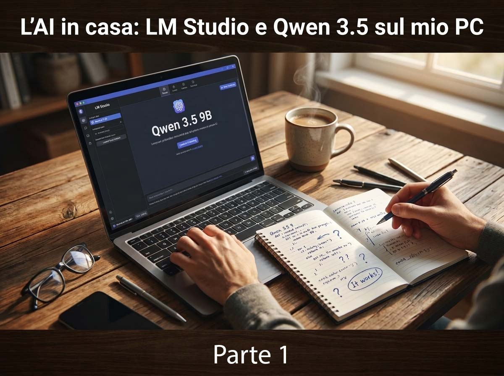
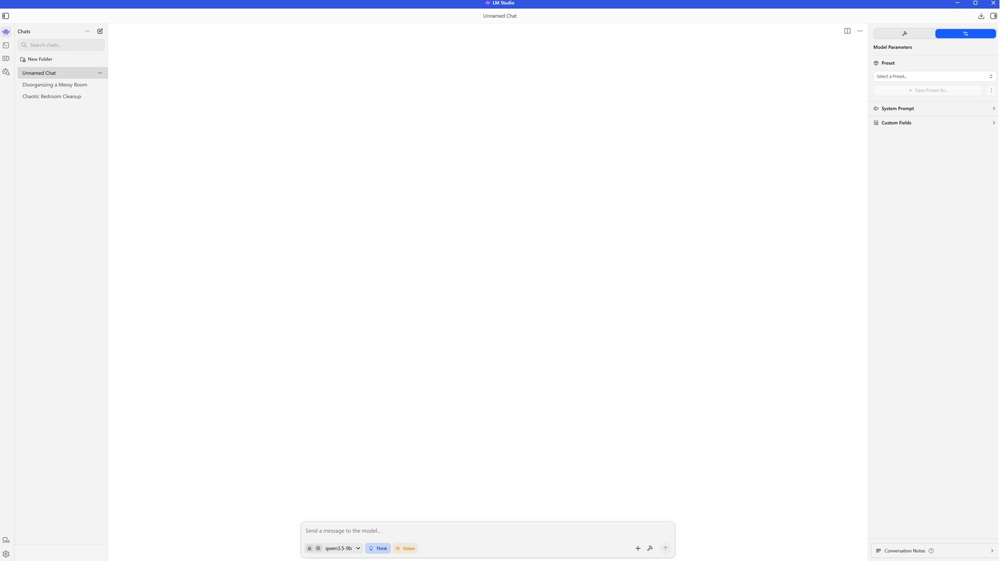
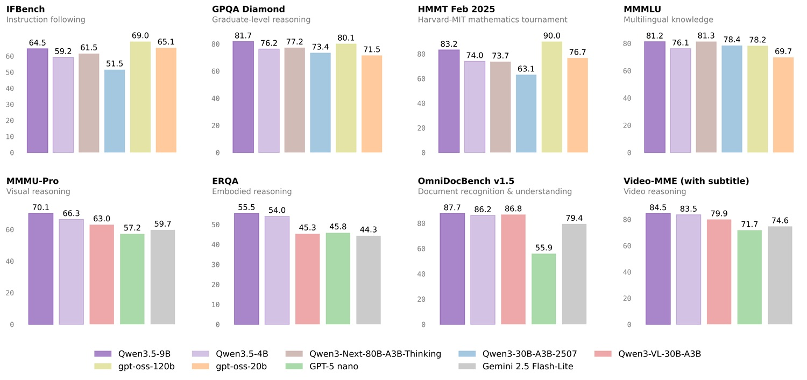

## L'IA à la maison : LM Studio et Qwen 3.5 sur mon PC - Épisode 1

*Il y a un moment précis où une technologie cesse d'être une promesse pour devenir un outil. Ce n'est pas lors de la sortie du communiqué de presse, ni quand les benchmarks font le tour des réseaux sociaux, mais quand une personne normale, avec un PC normal, s'assoit, télécharge quelque chose et décide de comprendre vraiment ce qui se passe. Cet article est ce moment-là, du moins pour moi.*

Au cours des deux dernières semaines, un seul nom a dominé les conversations dans l'écosystème open-weight de l'intelligence artificielle : Qwen 3.5. L'équipe d'Alibaba a publié le 2 mars 2026 la série "small" du modèle, des variantes allant de 0,8 à 9 milliards de paramètres, toutes sous licence Apache 2.0, toutes exécutables sur du matériel grand public, et la réaction de la communauté a été immédiate et vive. Mais avant d'entrer dans les détails du modèle et de mon expérience personnelle, il est utile de comprendre pourquoi ce moment est arrivé précisément maintenant.

## Le vent tourne

Dans un article publié il y a quelques semaines sur ce portail, [j'ai analysé les raisons pour lesquelles 2026 s'annonce comme l'année des Small Language Models](https://aitalk.it/it/slm-2026.html) : la convergence entre les pressions sur les coûts énergétiques, des exigences de confidentialité de plus en plus strictes et un saut qualitatif dans l'efficacité architecturale qui a redessiné la frontière entre le « possible sur le cloud » et le « possible en local ». Ce n'est pas une tendance idéologique, c'est une réponse pragmatique à des contraintes réelles.

Les données racontent toutefois encore une histoire à deux vitesses. Comme il ressort de [l'analyse du rapport DigitalOcean Currents également publiée ici](https://aitalk.it/it/agenti-al-lavoro.html), 64 % des entreprises intègrent aujourd'hui des modèles via des API de fournisseurs tiers, et seulement 21 % utilisent des modèles open-weight en production. Le cloud n'est pas mort : il est toujours dominant. Mais ce qui semblait être une asymétrie insurmontable entre d'énormes modèles propriétaires et des modèles locaux « de secours » s'amenuise à une vitesse qui surprend même les observateurs les plus attentifs.

Sur des benchmarks comme [GPQA Diamond](https://huggingface.co/datasets/Idavidrein/gpqa), le test de référence pour le raisonnement de niveau universitaire avancé — 198 questions de physique, chimie et biologie — Qwen3.5-9B affiche un score de 81,7, dépassant le GPT-OSS-120B d'OpenAI qui s'arrête à 71,5, comme indiqué sur la [page officielle du modèle sur HuggingFace](https://huggingface.co/Qwen/Qwen3.5-9B). Nous parlons d'un modèle avec treize fois moins de paramètres. Ce n'est pas une optimisation incrémentielle : c'est un changement de paradigme sur ce que signifie « petit » en 2026.

Les réactions dans le secteur ont été significatives et, comme c'est souvent le cas dans ce domaine, non unanimes. Certains observateurs de premier plan ont accueilli la sortie avec enthousiasme, soulignant la densité de capacités par rapport à la taille. D'autres, Anthropic en tête, ont gardé un ton plus prudent, observant que les modèles optimisés pour performer sur les benchmarks ne transfèrent pas toujours ces capacités dans le monde réel avec la même fidélité. Une tension qui traverse tout le débat sur l'IA open-weight et qu'aucun chiffre sur un tableau ne résout définitivement. La vérité, comme toujours, réside dans l'usage.

Et c'est précisément pour cela que j'ai décidé de mettre la main à la pâte.

## Une expérience honnête, sans prétentions scientifiques

Avant de poursuivre, il est nécessaire d'être clair sur ce que cet article est et ce qu'il n'est pas. Ce qui suit est une expérience personnelle, menée par un passionné qui veut comprendre ce qu'il est possible d'obtenir avec des moyens normaux à ce moment historique précis. Il n'y a pas de protocole de test évalué par des pairs, il n'y a pas d'échantillon statistiquement significatif de prompts, il n'y a pas de méthode reproductible qui résisterait à l'examen d'une conférence académique. Les tests ont été vérifiés en recoupant les résultats avec des modèles de pointe comme Claude et DeepSeek, mais cela ne les transforme pas en benchmarks scientifiques : ils restent des tests sur le terrain, menés avec les outils d'un utilisateur averti, non d'un chercheur.

La valeur, s'il y en a une, réside précisément en ceci : comprendre jusqu'où on peut aller avec de bonnes connaissances mais sans doctorat, avec du matériel de particulier et la volonté de comprendre avant d'acheter. Ceux qui veulent des chiffres certifiés trouveront les benchmarks officiels sur la [page HuggingFace du modèle](https://huggingface.co/Qwen/Qwen3.5-9B). Ceux qui veulent savoir comment il tourne sur un PC de 2025 acheté à un prix raisonnable, continuez à lire.

## Le laboratoire : un PC de niveau intermédiaire

La machine sur laquelle j'ai mené les tests n'est ni une station de travail de rendu professionnelle, ni un rig de gaming de compétition. C'est un PC assemblé avec discernement mais sans exagération : processeur AMD Ryzen 7700, 32 Go de RAM DDR5, et surtout un GPU AMD Radeon RX 9060 XT avec 16 Go de VRAM. Une configuration que de nombreux utilisateurs avancés, gamers, créateurs de contenu, développeurs travaillant à domicile, pourraient reconnaître comme la leur. Matériel de milieu-haut de gamme dans le segment grand public, mais loin de l'A100 que l'on imagine quand on parle d'inférence locale sur des modèles de langage.

Ce choix n'est pas fortuit. C'est précisément le niveau intermédiaire de la configuration qui est le point central. Si un modèle tourne bien ici, il tournera bien sur une énorme part des PC déjà existants. S'il peine ici, cette part se réduit considérablement.

## Choisir le framework : LM Studio contre Ollama

Pour exécuter un modèle de langage en local, deux choses sont nécessaires : le modèle lui-même (un fichier de quelques gigaoctets) et un framework qui sert d'interprète entre le matériel et le modèle, en gérant la mémoire, la tokenisation et l'inférence. Sans cette couche intermédiaire, télécharger les poids d'un modèle revient à avoir les fichiers d'un film sans lecteur vidéo.

Les deux voies qui dominent cet espace en 2026 peuvent être représentées par [LM Studio](https://lmstudio.ai/) et [Ollama](https://ollama.com/), et la différence entre eux reflète une tension classique dans le logiciel : accessibilité contre contrôle.

[Ollama](https://ollama.com/) est l'outil des développeurs. Il s'installe avec une ligne de terminal, expose par défaut une API REST compatible avec OpenAI sur `localhost:11434`, s'intègre sans friction dans des scripts, des pipelines et des applications. C'est de l'open source, avec une large communauté, et sa philosophie minimaliste — une commande pour télécharger, une commande pour exécuter — en fait le backend préféré de dizaines d'applications tierces. En termes de performance brute, il est tendanciellement plus rapide, gère mieux les requêtes simultanées et consomme moins de ressources grâce à l'absence de surcoût graphique. Le revers de la médaille : il nécessite une familiarité avec le terminal, la configuration avancée passe par des Modelfiles, et son interface graphique native est arrivée tardivement et reste minimale. Il y a aussi une question de transparence qu'il convient de signaler : Ollama est open source et la communauté a confiance en sa conduite, tandis que LM Studio est propriétaire (closed source), un détail à prendre en compte pour ceux qui sont particulièrement attentifs à la confidentialité.

[LM Studio](https://lmstudio.ai/) joue sur un autre terrain. C'est une application de bureau avec une interface graphique soignée, disponible pour Windows, macOS et Linux. Elle permet de rechercher, télécharger et charger des modèles sans ouvrir de terminal, expose également une API compatible avec OpenAI pour ceux qui souhaitent l'intégrer à d'autres outils, et gère automatiquement l'accélération GPU sur le matériel NVIDIA, Apple Silicon et AMD. Mais le détail qui change vraiment l'expérience pour ceux qui arrivent à l'IA locale sans bagage de développeur est le suivant : lors de la sélection d'un modèle, LM Studio affiche en temps réel une estimation des performances attendues sur sa propre configuration matérielle, avec des indicateurs colorés qui communiquent immédiatement si le modèle tournera facilement, avec des limitations, ou si le matériel est insuffisant. Pour un particulier qui expérimente, cette suppression de friction vaut bien l'éventuel écart de performance par rapport à Ollama.

Le choix pour cette expérience s'est porté sur LM Studio pour des raisons pragmatiques : la possibilité de voir à l'avance si Qwen 3.5 9B Q8_0 tournerait à plein régime sur mon GPU, sans calculs manuels ni documentation technique à consulter, m'a permis d'optimiser le choix immédiatement. Pour ceux qui ont en revanche l'intention d'intégrer un modèle dans une application, d'automatiser des workflows ou de travailler en environnement serveur, Ollama reste le choix le plus solide.

*Capture d'écran de mon PC au démarrage de LM Studio. Dans le menu en haut à droite, les options du logiciel avec le bouton plus bas pour sélectionner et télécharger le modèle souhaité. À côté, l'historique des chats. En bas au centre, la fenêtre de dialogue pour les prompts, où l'on peut noter le modèle sélectionné.*

## Installer LM Studio : cinq minutes et c'est parti

L'installation ne nécessite pas de compétences techniques particulières. Depuis le [site officiel](https://lmstudio.ai/), on télécharge l'installeur pour son système d'exploitation — un exécutable sur Windows, un DMG sur macOS, une AppImage pour Linux — et on procède comme pour n'importe quelle autre application de bureau. Aucune dépendance externe à installer, aucun environnement virtuel à configurer, aucun terminal à ouvrir. Le paquet pèse environ 500 Mo ; les premiers écrans guident vers la configuration de l'accélération matérielle détectée automatiquement, et en quelques minutes, on se retrouve devant l'écran principal.

De là, la section de recherche de modèles permet de parcourir le catalogue, qui puise principalement dans HuggingFace, en filtrant par taille, type de quantification et compatibilité matérielle déclarée. En sélectionnant un modèle, les estimations de performance sur sa machine apparaissent : c'est là que l'on comprend immédiatement à quoi s'attendre avant même de télécharger un seul gigaoctet.

## Pourquoi Qwen 3.5 9B, et pourquoi Q8_0

Une fois le framework installé, le choix du modèle est le deuxième point critique. J'ai choisi Qwen 3.5 9B en quantification Q8_0, le fichier occupant un peu plus de 10 Go sur le disque, pour des raisons qu'il convient d'expliquer, car elles reflètent une logique utile pour quiconque aborde ce choix.

La taille de 9 milliards de paramètres est devenue ces derniers temps le standard de fait pour les tests sur le terrain : c'est la dimension la plus répandue parmi tous les principaux concurrents qui publient des modèles open-weight, elle représente le point d'équilibre entre capacité et exigences matérielles, et permet des comparaisons significatives entre différentes familles. Les variantes de 27B et 35B sont certes plus capables, mais nécessitent un matériel plus coûteux qui représente pour un particulier un saut non négligeable. Pour une entreprise, même petite, évaluer un modèle de 9B a une double valeur : comprendre ce que l'on obtient immédiatement avec un investissement minimal, et projeter ce que l'on pourrait obtenir avec un cran de matériel supérieur, vu le rythme auquel les performances croissent et les exigences diminuent.

Le choix de la quantification Q8_0, la plus élevée parmi les trois options disponibles dans LM Studio pour ce modèle, a été rendu possible précisément par les 16 Go de VRAM : l'indicateur vert confirmait que le modèle tournerait entièrement sur le GPU sans avoir à décharger de couches sur la RAM système, garantissant une vitesse d'inférence maximale et une qualité de réponse non dégradée par les approximations numériques des quantifications plus agressives.

Sur le plan technique, Qwen 3.5 n'est pas simplement un modèle précédent rétréci. Comme décrit dans la [documentation officielle sur HuggingFace](https://huggingface.co/Qwen/Qwen3.5-9B), l'architecture adopte une approche hybride combinant Gated Delta Networks — une forme d'attention linéaire — avec sparse Mixture-of-Experts, dans le but de faire face au « memory wall » qui limite typiquement les petits modèles, garantissant un débit élevé avec une latence réduite. La fenêtre de contexte native est de 262 144 tokens, extensible jusqu'à environ un million via YaRN. Et contrairement aux générations précédentes qui ajoutaient des capacités visuelles sous forme de modules séparés, Qwen 3.5 a été entraîné dès le départ sur des tokens multimodaux, du texte, des images et de la vidéo intégrés via un processus appelé early fusion.

Le modèle supporte deux modes opératoires : *thinking* et *non-thinking*. Dans le premier, avant de produire la réponse, le modèle génère explicitement une chaîne de raisonnement interne, consacrant 20 à 40 secondes de traitement avant d'écrire la réponse proprement dite. Dans le second, il répond immédiatement. Dans tous les tests qui suivent, j'ai utilisé le mode thinking, car certains prompts étaient délibérément complexes. J'ai fait les mêmes tests en désactivant le thinking : les réponses deviennent immédiates, la profondeur baisse légèrement sur les questions les plus articulées, mais pour des usages quotidiens, l'assistance à l'écriture, le codage de routine, l'analyse de textes, les questions informatives, la combinaison de précision et de vitesse est plus que satisfaisante. Dans les deux modes, l'output a voyagé à environ 30 tokens par seconde sur cette configuration matérielle.

[Image tirée de huggingface.co](https://huggingface.co/Qwen/Qwen3.5-9B)

## Les tests : six essais sur le terrain

Les six tests qui suivent ont été conçus pour couvrir les domaines principaux d'évaluation des modèles de langage : raisonnement scientifique avancé, compréhension multimodale, génération de code complexe, capacité multilingue avec planification, gestion de contextes très longs et raisonnement visuo-spatial. Pour chaque test, les résultats de Qwen 3.5 9B ont été vérifiés en recoupant les réponses avec des modèles de pointe comme Claude et DeepSeek, non pas comme une validation scientifique, mais comme un contrôle de validité pratique.

Les notes qui accompagnent chaque test sont le fruit d'une évaluation personnelle après des recherches en ligne, recoupées avec les réponses aux mêmes prompts et les évaluations des réponses fournies par Qwen 3.5 9B, soumises à Claude et DeepSeek. C'est le jugement d'un utilisateur exigeant, non la sentence d'un benchmark.

### Test 1 — Raisonnement scientifique : le mécanisme de Higgs

Le premier test était un classique des benchmarks de haut niveau : expliquer le mécanisme de Higgs et la rupture de la symétrie électrofaible à un étudiant en physique. Une question qui exige de la rigueur mathématique sans sacrifier la clarté, et la capacité de construire un parcours narratif qui guide le lecteur à travers des concepts non triviaux.

La réponse est arrivée structurée en cinq sections progressant avec la logique d'un cours bien mené : du cadrage du problème de la masse dans les bosons de jauge, à l'introduction du champ de Higgs avec son potentiel en « chapeau mexicain » comme image mentale, jusqu'à l'explication du mécanisme par lequel les bosons W et Z « boivent » les bosons de Goldstone en acquérant une masse tandis que le photon reste sans masse grâce à la symétrie résiduelle. Chaque formule était accompagnée d'une interprétation physique ; chaque étape technique avait une phrase qui en révélait le sens physique profond. Les vérifications croisées avec les modèles de pointe et des recherches personnelles en ligne ont trouvé la réponse correcte, bien structurée et avec les bonnes métaphores. Pas banal pour un modèle qui tourne sur un PC grand public.

**Note : 5/5.** La rigueur était là, la clarté aussi. La capacité de choisir des métaphores appropriées plutôt que de se contenter de reproduire des notions est ce qui a le plus surpris.

### Test 2 — Multimodalité : lire le chaos visuel

Pour le deuxième test, j'ai téléchargé en ligne une petite image de basse qualité montrant une feuille de calcul avec l'inventaire d'un magasin d'électronique : neuf colonnes avec des codes d'articles, des noms de produits, des dates d'achat, des catégories, des quantités, des coûts et des prix de vente. L'image était délibérément médiocre, légèrement floue, et j'ai chargé le fichier directement dans LM Studio en demandant au modèle de décrire ce qu'il voyait.

Le modèle a lu toutes les colonnes et les valeurs numériques, mais la partie intéressante est venue ensuite : il a remarqué de lui-même que la colonne « Total » était le produit de la quantité par le prix unitaire, a identifié certains moniteurs avec des ventes à zéro en les interprétant comme de potentiels invendus, a distingué les articles à bas coût comme les souris des produits premium comme les processeurs, et a reconnu que les dates d'achat couvraient une période allant d'octobre 2017 à décembre 2018. Il ne s'est pas contenté de transcrire : il a interprété les données comme le ferait un analyste.

Quelques détails numériques mineurs ont été rapportés de manière imprécise, ce qui est compréhensible vu la qualité de l'image. Mais la capacité de passer de la lecture à la compréhension contextuelle est exactement ce qui distingue une multimodalité décorative d'une multimodalité fonctionnelle.

**Note : 4,8/5.** La lecture était correcte, l'analyse de business intelligence ajoutée était un bonus inattendu. Quelques dixièmes perdus pour quelques imprécisions numériques mineures.

### Test 3 — Génération de code : un problème NP-difficile

Le troisième test portait sur le codage, le domaine où les benchmarks suggèrent que Qwen 3.5 9B est légèrement moins brillant que d'autres. J'ai demandé d'implémenter en Python un algorithme pour trouver le cycle de longueur maximale dans un graphe non orienté, un problème NP-difficile qui exige non seulement une capacité d'implémentation mais aussi une conscience théorique.

La première réponse s'est interrompue à la moitié à cause d'un problème technique de gestion des sorties longues, un comportement à signaler honnêtement. Sollicité pour compléter, le modèle a produit une solution complète avec backtracking et élagage (pruning), l'approche correcte pour ce type de problème, avec des type hints, des méthodes bien séparées et des commentaires pertinents. Mais le détail qui a le plus frappé est arrivé avant même le code : le modèle a déclaré explicitement que le problème est NP-difficile, qu'il n'existe pas d'algorithme en temps polynomial connu, et que pour des graphes de grande taille, on devrait envisager une approche approchée. Cette conscience des limites théoriques avant même d'écrire du code est le signe de quelque chose de plus profond que la simple génération de syntaxe.

**Note : 5/5.** L'accroc initial est à noter, mais la solution finale et la maturité théorique démontrée ont dépassé les attentes pour un modèle de 9 milliards de paramètres.

---

*L'épisode s'arrête ici. Dans la deuxième partie : le test de planification multilingue, le défi avec un PDF de 460 pages et le raisonnement visuo-spatial sur une pièce en plein chaos. Plus les conclusions sur ce que signifie vraiment avoir un assistant local en 2026.*
