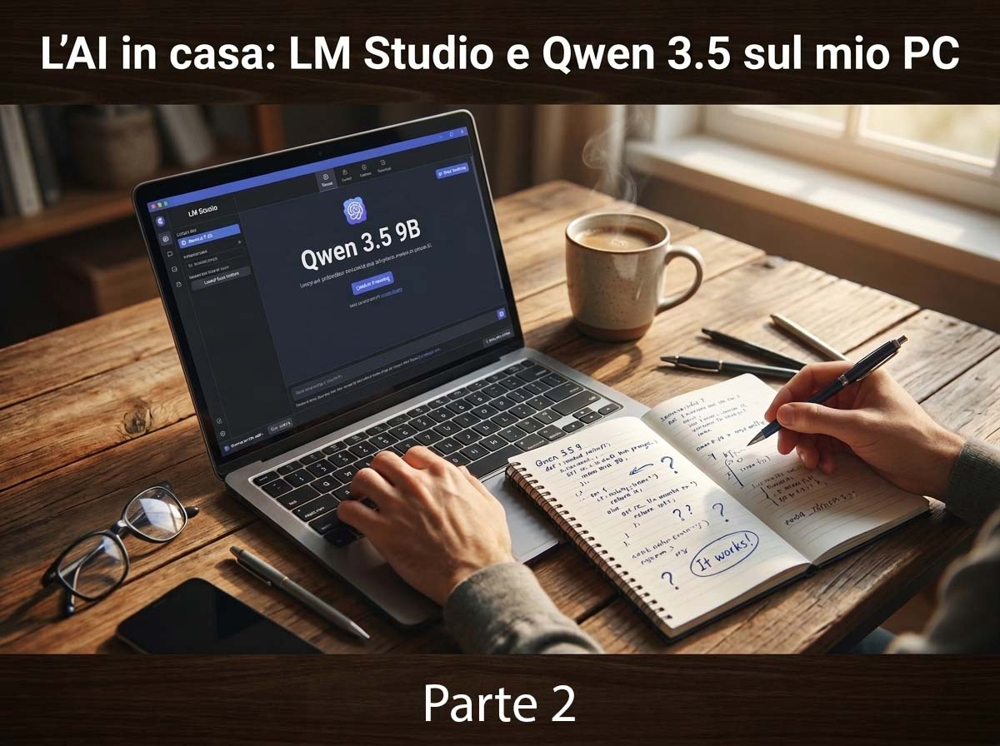
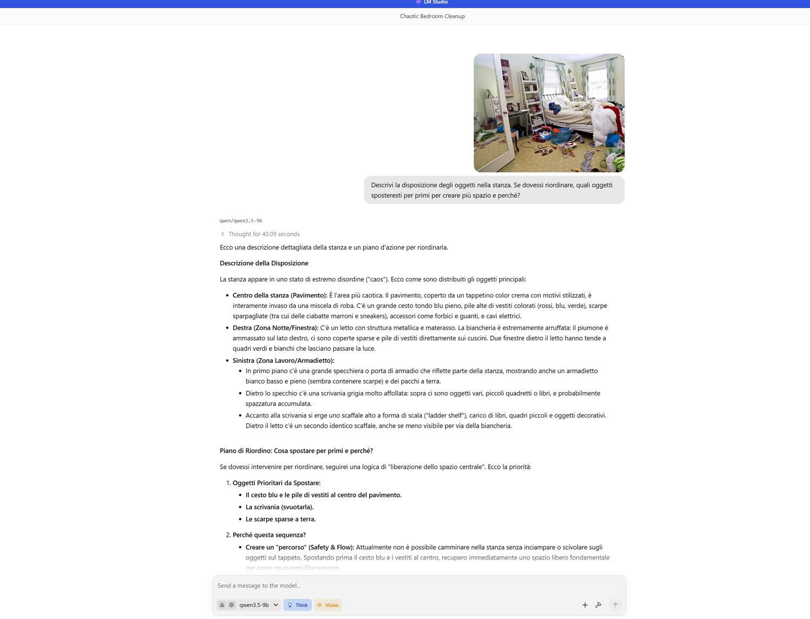

# L'AI in casa: LM Studio e Qwen 3.5 sul mio PC - Puntata 2

*Continua dalla [Puntata 1](https://aitalk.it/it/qwen35-locale-puntata1.html), dove abbiamo descritto la configurazione hardware, la scelta di LM Studio come framework, e i primi tre test: ragionamento scientifico sul meccanismo di Higgs, lettura multimodale di un foglio di calcolo sfocato, e generazione di codice per un problema NP-hard.*

La conversazione intorno a Qwen 3.5 nelle scorse due settimane non è rimasta confinata ai forum tecnici internazionali. In Italia, voci come quella di [Salvatore Sanfilippo](https://www.youtube.com/watch?v=NDBQq_NzxiE), tra gli esperti più seguiti sul tema dell'intelligenza artificiale applicata, hanno portato il modello all'attenzione di un pubblico più ampio, contribuendo a fare di questo rilascio uno degli argomenti più discussi della stagione nell'ecosistema italiano dell'AI. Non è hype da social: è il riconoscimento che qualcosa di strutturale sta cambiando nei modelli open-weight, e che quel cambiamento è finalmente abbastanza tangibile da meritare attenzione al di fuori delle cerchie dei ricercatori.

I tre test che concludono questa seconda puntata erano stati progettati proprio per toccare le aree che più interessano chi non fa il ricercatore ma usa l'AI per lavorare, pianificare, analizzare e organizzare: la capacità di ragionare in più lingue mantenendo coerenza culturale, la gestione di documenti lunghi con precisione chirurgica, e la comprensione dello spazio fisico attraverso un'immagine.

## Test 4 — Agente di viaggio in tre lingue

Il quarto test puntava su due delle capacità più pubblicizzate del modello: il supporto multilingua esteso, Qwen 3.5 supporta 201 lingue, e le performance da agente su compiti di pianificazione complessa. Ho immaginato un cliente francese che non parla inglese, interessato a visitare Tokyo e Kyoto con focus su templi storici e cibo di strada. La richiesta era articolata: un itinerario di cinque giorni in francese impeccabile, con consigli pratici su trasporti e barriere linguistiche, seguito da una sezione in italiano per un secondo viaggiatore che volesse seguire lo stesso percorso.

La risposta avrebbe potuto essere un itinerario generico generato interpolando informazioni da un database di guide turistiche. Non è andata così. Il francese era quello di un consulente di viaggio di fascia alta: formale ma caldo, preciso senza essere burocratico. L'itinerario aveva una logistica reale: arrivo a Tokyo e prima immersione ad Asakusa e Senso-ji, secondo giorno tra il Meiji Shrine e il vecchio mercato di Tsukiji con indicazione che lì il sushi si mangia al bancone pagando all'unità, terzo giorno con shinkansen verso Kyoto e passeggiata nei boschi di bambù di Arashiyama nel tardo pomeriggio, quarto giorno con la salita ai torii di Fushimi Inari con avvertimento esplicito di indossare scarpe comode, sera a Pontocho per la possibilità di incrociare le geishe. Quinto giorno al mercato Nishiki, "il ventre di Kyoto", come lo ha chiamato il modello, prima della partenza.

I dettagli fanno la differenza tra un'informazione e una conoscenza: sapere che Suica e Pasmo sono le carte ricaricabili per i trasporti, che Google Translate con pacchetti offline è quasi indispensabile in Giappone, che nei templi si tolgono le scarpe. Tutti presenti, tutti corretti. La sezione in italiano era un concentrato pratico, scritto in una lingua sciolta e utile, senza ripetere pedissequamente l'intero itinerario ma sintetizzando i consigli essenziali per chi già conosce il percorso. Il passaggio da una lingua all'altra non ha abbassato la qualità: tono, pertinenza culturale e accuratezza si sono mantenuti stabili.

**Voto: 5/5.** Un agente che conosce il Giappone come una guida turistica, scrive in francese come un madrelingua e sintetizza in italiano senza perdere il filo.

## Test 5 — L'ago nel pagliaio di 460 pagine

Il quinto test era il più impegnativo dal punto di vista tecnico, e probabilmente il più rilevante per chi usa l'AI in contesti professionali di analisi documentale. Ho caricato in LM Studio l'[Artificial Intelligence Index Report 2025](https://hai.stanford.edu/ai-index/2025-ai-index-report) dello Stanford HAI: 460 pagine e circa 20Mbyte, decine di migliaia di parole, grafici, tabelle, capitoli tematici. Un volume che nessun essere umano legge dall'inizio alla fine in una sessione. La domanda era apparentemente semplice: trovarmi i dati sulla crescita della generazione video e indicarmi a quale pagina si trovano.

La prima volta, nessuna risposta. La seconda, silenzio. La terza, ancora. In tutti e tre i tentativi il modello effettiuava il ragionamento, che è visibile e consultabile, ma al termine non produceva l'output. Ho dovuto sollecitare esplicitamente, specificando che a volte il modello non produce output in chat pur avendo elaborato la richiesta. Al quarto tentativo, la risposta è arrivata ed era precisa in modo sorprendente.

Il modello ha identificato le pagine 126 e 127 del Capitolo 2 (Technical Performance), sezione "Image and Video". Ha descritto cosa contenevano: la pagina 126 con le schede dei modelli Google Veo, Meta Movie Gen e OpenAI Sora, con i grafici di preferenza utente (Figure 2.3.11 e 2.3.12); la pagina 127 con il confronto tra video generati nel tempo. E poi ha recuperato spontaneamente un esempio specifico: il prompt "Will Smith eating spaghetti", diventato nel tempo un piccolo caso di studio informale sulla qualità dei video generati dall'AI, il tipo di dettaglio culturale che un buon ricercatore avrebbe inserito in una nota a piè di pagina.

Il comportamento di blocco dei primi tre tentativi è un limite reale, da segnalare onestamente. Probabilmente dipende dalla mole di dati da processare e da come LM Studio gestisce i token di contesto nelle finestre molto larghe. Non è un problema che si risolve in cinque minuti, richiede comprensione del proprio setup e pazienza. Ma quando il modello risponde, risponde bene.

**Voto: 4.5/5.** Precisione millimetrica nel recupero di informazioni da un documento di 460 pagine, pagine esatte, figure numerate, esempi culturali. Mezzo punto perso per i tre tentativi a vuoto, un comportamento che il workflow reale deve mettere in conto.

## Test 6 — Il geometra del caos domestico

L'ultimo test era forse il più insolito, e quello che ha prodotto la risposta più narrativamente ricca. Ho scaricato online una foto di bassa qualità di una stanza in preda al disordine: vestiti ovunque, un letto sfatto, una scrivania sommersa di carta, scaffali saturi, oggetti sparsi sul pavimento. Ho caricato la foto in LM Studio e ho chiesto al modello di descrivere la disposizione degli oggetti e proporre una strategia per ricavare spazio.

La descrizione della stanza era visivamente fedele: il cesto blu al centro che occupa il percorso principale, le pile di vestiti colorati suddivise per colori e materiali, le ciabatte marroni e le sneakers sparse vicino all'ingresso, il letto a destra con la biancheria accumulata che rende inaccessibile il comodino, la scrivania a sinistra "affollata come un nido di disordine visivo". Ma il dettaglio più impressionante è stato uno: il modello ha notato che la specchiera sulla parete rifletteva l'armadietto bianco e alcune scatole sul pavimento, dimostrando di percepire non solo gli oggetti visibili ma le relazioni spaziali generate dai riflessi, una comprensione tridimensionale dello spazio che non era scontata.

La strategia di riordino proposta seguiva una logica impeccabile: prima liberare il centro della stanza per creare un percorso sicuro, poi svuotare la scrivania per categorizzare, poi sistemare il letto per recuperare superficie visiva, infine archiviare negli armadi ora accessibili. Ogni passo aveva una motivazione: il centro prima perché è il rischio di caduta più immediato, il letto poi perché sistemarlo cambia visivamente la percezione dell'intera stanza, non solo la sua funzionalità. È la logica di chi ha capito non solo cosa c'è in quella stanza, ma come lo spazio funziona per chi ci abita.

**Voto: 5/5.** Comprensione spaziale tridimensionale, analisi dei riflessi, strategia di intervento motivata passo per passo. Un interior designer non avrebbe fatto meglio.

*Screenshot di una parte della risposta di Qwen 3.5, alla richiesta di analizzare l'immagine caricata.*

## Il conto finale

Sei test, sei aree, un quadro abbastanza completo per tirare le somme, con la consapevolezza che questo rimane un esperimento personale, non una valutazione sistematica.

Quello che emerge con chiarezza è che Qwen 3.5 9B, a 30 token al secondo su una GPU consumer da 16 GB di VRAM, fa cose che fino a un anno fa avrebbero richiesto accesso a API di frontiera a pagamento. Spiega fisica quantistica con la chiarezza di un buon insegnante, legge tabelle sfocate come un analista, scrive codice con consapevolezza teorica dei limiti, pianifica viaggi in multilingua con coerenza culturale, trova pagine specifiche in un report di 460 pagine, descrive una stanza disordinata e riconosce i suoi riflessi. Tutto questo gira offline, senza inviare un singolo byte a nessun server.

I limiti ci sono e vanno detti senza sconti. Il comportamento di blocco su output molto lunghi o contesti estesi è il problema principale: richiede solleciti espliciti e introduce un'incertezza nel workflow che chi usa questi strumenti in produzione deve gestire. Il primo tentativo interrotto nel test di coding, i tre silenzi nel test documentale, non sono difetti trascurabili, sono comportamenti che un utente professionale deve imparare ad anticipare.

Resta anche aperta una questione che nessun test locale può risolvere: la privacy e la provenienza dei dati di addestramento. Qwen è un progetto di Alibaba Cloud, un'azienda cinese soggetta alla legislazione di Pechino. Eseguire il modello in locale risolve la questione della trasmissione dei dati in inferenza, i prompt non escono dalla macchina, ma non dice nulla su cosa il modello abbia visto durante l'addestramento, né su eventuali bias legati al contesto geopolitico di chi lo ha creato. Per molti usi personali e professionali la questione è irrilevante; per altri, in ambiti regolamentati, in contesti dove la sovranità del dato è vincolo legale, vale la pena rifletterci prima di integrarlo in un workflow critico.

Sul fronte del cloud, la competizione rimane asimmetrica per i task che richiedono ragionamento multi-step profondo, conoscenza enciclopedica aggiornata in tempo reale, e gestione di contesti enormi senza comportamenti imprevedibili. I modelli di frontiera come Claude, ChatGPT e Gemini giocano ancora su un campo diverso per questi scenari. Ma il gap si riduce a ogni rilascio, e la direzione è chiara.

## La voglia di continuare

Questa esperienza è stata quello che speravo fosse: istruttiva, concreta, a tratti sorprendente. Installare un modello di questa qualità in locale, su un PC che non è una workstation da cinquemila euro, e ottenere risposte che reggono il confronto con i migliori servizi cloud, sarebbe sembrato fuori portata solo dodici mesi fa. Non lo è più.

Qwen 3.5 9B è certamente il modello open-weight più discusso delle ultime settimane, e la fama che aveva costruito con le versioni precedenti della famiglia non era infondata. Ma è anche solo uno dei punti di questo ecosistema in rapida evoluzione. Per chi ha meno VRAM o cerca eccellenza nel coding, [Phi-4-mini di Microsoft](https://huggingface.co/microsoft/Phi-4-mini-instruct) merita attenzione. Per chi lavora prevalentemente in italiano o su lingue europee, le varianti di [Mistral](https://mistral.ai/) hanno caratteristiche specifiche di interesse. Ogni modello eccelle in qualcosa e cede in altro: la scelta dipende sempre dal caso d'uso, e il caso d'uso lo conosce solo chi sta davanti alla tastiera.

Il punto, però, non è quale modello scegliere. Il punto è che questa scelta esiste, è accessibile, e funziona. Gli LLM locali, o SLM se preferite la denominazione più precisa, non sono più un esperimento per appassionati con hardware da laboratorio. Sono strumenti presenti, funzionanti, migliorabili, che rispettano la privacy e che con un gradino hardware appena superiore a quello consumer standard diventano potenti alleati per progettare, scrivere, analizzare e costruire.

Bisogna solo avere voglia di sporcarsi le mani. E con questi strumenti, le mani si sporcano sempre meno.
