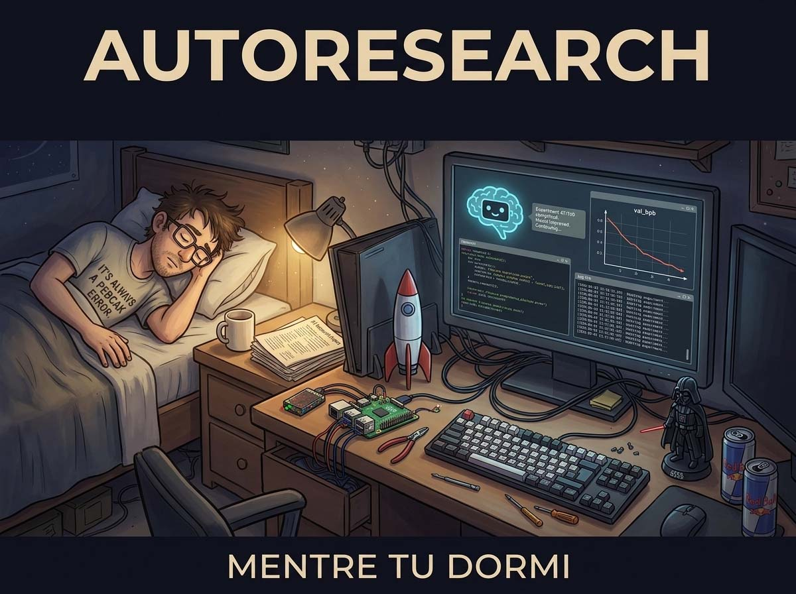
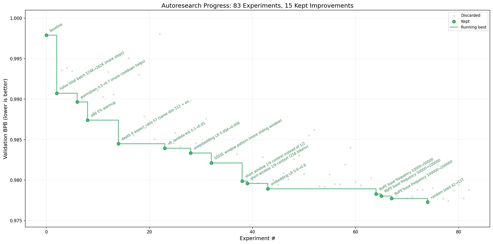

# Il ricercatore dorme. Autoresearch: come Andrej Karpathy ha insegnato alle macchine a fare ricerca autonoma

*C'è una scena nei videogiochi di ruolo giapponesi, Karpathy li conosce bene, in cui il protagonista smette di combattere i mostri da solo e comincia ad addestrare altri personaggi perché lo facciano al posto suo. Il passaggio cambia tutto: non sei più un combattente, sei un allenatore. Andrej Karpathy ha fatto qualcosa di simile con la ricerca sull'intelligenza artificiale.*

Karpathy è una figura che nel settore non ha bisogno di molte presentazioni, ma vale la pena inquadrarlo per chi arriva da fuori. Ex direttore dell'intelligenza artificiale di Tesla, cofondatore di OpenAI, oggi indipendente e prolifico divulgatore tecnico: è noto soprattutto per la sua capacità di rendere accessibili concetti densi e specialistici. Il suo corso [Neural Networks: Zero to Hero](https://karpathy.ai/zero-to-hero.html) è un punto di riferimento per chiunque voglia capire i modelli linguistici senza un dottorato in tasca.

All'inizio di marzo 2026, Karpathy ha pubblicato su GitHub un nuovo progetto open-source chiamato [autoresearch](https://github.com/karpathy/autoresearch). Il repository conta già oltre 23.000 stelle e quasi tremila fork, numeri che nel mondo dello sviluppo software misurano l'interesse con la stessa precisione di un sismografo. L'idea di fondo è semplice da descrivere ma difficile da digerire: dare a un agente di intelligenza artificiale un piccolo ma autentico sistema di addestramento di modelli linguistici, e lasciarlo sperimentare da solo, di notte, mentre il ricercatore dorme.

## Anatomia di un loop notturno

Per capire cosa fa autoresearch, è utile immaginare il lavoro quotidiano di un ricercatore di machine learning. Normalmente, questa persona siede davanti al computer, formula un'ipotesi («e se usassi una dimensione del batch più piccola?»), modifica manualmente il codice di addestramento, lancia un esperimento che dura ore, analizza i risultati, e ricomincia. È un processo seriale, lento, e limitato dalle ore della giornata lavorativa e dalla capacità di concentrazione umana.

Autoresearch spezza questo ciclo in modo radicale. Il sistema è costruito intorno a soli tre file che contano davvero: `prepare.py` (che gestisce la preparazione dei dati e non viene mai modificato), `train.py` (il codice del modello, che l'agente può toccare in ogni sua parte), e `program.md` (le istruzioni per l'agente, scritte in linguaggio naturale). L'utente umano non mette mano ai file Python: il suo compito è scrivere e raffinare il file Markdown, cioè *programmare il programma* piuttosto che programmare direttamente.

Una volta avviato, l'agente, nella configurazione standard si tratta di Claude di Anthropic o di Codex di OpenAI, legge le istruzioni, propone una modifica al codice di addestramento, esegue un esperimento della durata fissa di cinque minuti esatti, misura se il risultato è migliorato, tiene o scarta la modifica, e ripete. Dodici esperimenti all'ora, circa cento nel corso di una notte. Al mattino, il ricercatore si sveglia davanti a un registro dettagliato di tutto quello che è stato provato e a (si spera) un modello migliore.

La metrica usata per misurare i progressi si chiama `val_bpb`, ovvero *validation bits per byte*: misura quanto bene il modello riesce a comprimere il testo, in termini di quanti bit servono per rappresentare ogni byte di dati. È una metrica elegante perché è indipendente dalla dimensione del vocabolario, il che significa che esperimenti con architetture diverse rimangono confrontabili tra loro. Valori più bassi indicano un modello più capace.

L'intera base di codice si sviluppa su circa 630 righe di Python. Non è una caratteristica accessoria: è una scelta filosofica. Karpathy ha costruito deliberatamente un sistema che un singolo sviluppatore può leggere, capire e tenere sotto controllo. La revisione umana rimane possibile. I diff, le differenze tra una versione del codice e la successiva, sono leggibili.

Per capire autoresearch fino in fondo, bisogna conoscere il progetto da cui nasce: [nanochat](https://github.com/karpathy/nanochat), che Karpathy descrive semplicemente come «il miglior ChatGPT che cento dollari possano comprare». Non è un'iperbole di marketing: nanochat è un sistema completo e minimale per addestrare modelli linguistici su una singola GPU, che copre l'intera filiera, dalla tokenizzazione al pretraining, dal fine-tuning fino a un'interfaccia di chat funzionante.

Il suo punto di vanto è un leaderboard pubblico che misura il tempo necessario per replicare le capacità del GPT-2 originale (che nel 2019 costò circa 43.000 dollari e settimane di calcolo) su hardware accessibile: al momento, il record è sceso a poco più di tre ore su un nodo con otto GPU H100, per una spesa intorno ai settanta dollari.

Autoresearch è, in sostanza, la versione monogpu e agente-centrica di nanochat: usa la stessa base di codice semplificata come campo di sperimentazione, con la stessa metrica val_bpb come bussola, ma affida all'agente il compito di esplorare quel territorio da solo.

Capire nanochat significa capire su cosa l'agente sta effettivamente lavorando, e perché i risultati ottenuti in cinque minuti di addestramento autonomo possono essere confrontati, con qualche cautela, con quelli delle sessioni più impegnative del leaderboard principale.

## Cosa fanno davvero i numeri

Il modo più onesto di valutare autoresearch non è guardare la descrizione del progetto, ma i dati reali degli esperimenti. Karpathy ha pubblicato nella [discussion #43](https://github.com/karpathy/autoresearch/discussions/43) del repository un resoconto dettagliato di una sessione completa, notevolmente trasparente: 126 esperimenti eseguiti su una GPU NVIDIA H100 nell'arco di circa dieci ore e mezza.

Il punto di partenza era un `val_bpb` di 0.9979. Il punto di arrivo: 0.9697. Un miglioramento di 0.0282 in termini assoluti, che in questo contesto rappresenta un salto significativo. Per orientarsi: le modifiche più impattanti sono state la riduzione della dimensione del batch (da 524.000 a 262.000 token, che ha permesso di eseguire più passi di aggiornamento nei cinque minuti disponibili, guadagnando 0.0119 di miglioramento), l'aggiunta di uno strato alla profondità del modello (0.0043), e una serie di aggiustamenti più fini come l'introduzione di piccoli valori di regolarizzazione (*weight decay*) sulle componenti di embedding.

Quello che colpisce leggendo il log completo non è solo il risultato finale, ma la granularità del processo. L'agente ha esplorato sistematicamente decine di ipotesi, molte delle quali si sono rivelate vicoli ciechi: il *weight tying* tra embedding e de-embedding ha prodotto un crollo catastrofico della metrica; l'attenzione multi-query con un'unica testa di chiave-valore è risultata troppo aggressiva; le architetture con più strati ma dimensioni ridotte finivano per esaurire il budget di cinque minuti prima ancora di convergere. Questi fallimenti documentati sono quasi più utili dei successi, perché disegnano la mappa del territorio esplorato.

I risultati ottenuti su una GPU H100, la scheda grafica più performante attualmente disponibile per questo tipo di carichi, si sono poi mostrati trasferibili a modelli più profondi da 24 strati, abbastanza da competere nelle classifiche di riferimento del settore. Non è un risultato banale. Ma il confine della trasferibilità è ancora poco chiaro, e questo è uno dei limiti del progetto su cui vale la pena soffermarsi.

[Immagine tratta da github.com](https://github.com/karpathy/autoresearch)

## Il rovescio della medaglia

Autoresearch ha ricevuto un'accoglienza entusiasta, e l'entusiasmo è comprensibile. Ma un'analisi onesta richiede di guardare anche dove il sistema mostra le sue crepe.

Il primo limite è strutturale: il budget fisso di cinque minuti per esperimento, che è anche uno dei punti di forza del progetto, diventa un vincolo rigido quando si esplorano architetture più complesse. Nei dati della sessione #43 si vede chiaramente: ogni tentativo di aggiungere strati al di là di una certa soglia si concludeva con un esperimento incompleto, perché il tempo finiva prima che il modello convergesse. L'agente stava cercando in uno spazio di possibilità parzialmente bloccato dalla sua stessa architettura temporale.

Il secondo limite riguarda il parallelismo. Il sistema è progettato per una singola GPU, e gli esperimenti sono eseguiti in sequenza, non in parallelo. Significa che mentre un esperimento gira, nessun altro può essere avviato. Chi avesse accesso a un cluster di GPU potrebbe voler esplorare più direzioni contemporaneamente, autoresearch, per scelta deliberata, non lo supporta. Karpathy è trasparente su questo: è una decisione di design, non una dimenticanza. Ma la conseguenza pratica è che l'esplorazione dello spazio di ricerca rimane fondamentalmente lineare.

Terzo punto critico: la dipendenza da modelli proprietari. Per eseguire gli esperimenti in modalità autonoma, serve un agente capace, e nella configurazione standard si parla di Claude o Codex, entrambi sistemi commerciali. Chi vuole democratizzare la ricerca sull'intelligenza artificiale potrebbe trovare paradossale che uno strumento pensato per abbassare le barriere di ingresso richieda comunque un abbonamento a servizi di terze parti.

C'è poi un aspetto più sottile, che riguarda la natura stessa delle scelte che l'agente compie. autoresearch è eccellente nell'ottimizzazione locale: trova il punto migliore nella vicinanza del punto di partenza, attraverso una sequenza di piccoli passi. Ma non è un sistema progettato per fare salti concettuali. La revisione della letteratura, la formulazione di ipotesi radicalmente nuove, la comprensione del perché un approccio funziona a livello teorico, tutto questo rimane territorio umano, almeno per ora. La ricerca vera, quella che cambia i paradigmi, non è solo un processo di ottimizzazione sequenziale.

Infine, c'è la questione della spiegabilità. Quando l'agente scopre che un'inizializzazione dei pesi ridotta a 0.68x del valore standard produce risultati migliori, non fornisce una spiegazione causale di questo miglioramento. Sa che funziona, non perché funziona. Per chi usa i risultati come punto di partenza per ricerche successive, questa mancanza di comprensione è un debito tecnico che prima o poi va saldato.

## L'umano che programma il programma

Una delle idee più interessanti, e meno discusse, di autoresearch è il ruolo che assegna all'essere umano nel processo. Non si tratta di eliminarlo, ma di spostarlo.

Il file `program.md` è descritto nel README come una "skill" ultraleggera: un documento in linguaggio naturale che definisce gli obiettivi dell'agente, le sue priorità, i vincoli entro cui operare. L'utente non scrive più Python, scrive istruzioni. Non modifica il codice di addestramento, modifica il documento che dice all'agente come modificare il codice di addestramento. È un livello di astrazione in più, e porta con sé conseguenze concrete.

Da un lato, questo abbassa enormemente la soglia d'ingresso. Non serve un dottorato in machine learning per avviare una sessione di autoresearch. Il README include una "Weekend Guide", una guida per il fine settimana, che promette di portare chiunque dalla configurazione iniziale ai primi esperimenti autonomi senza background specialistico. La semplicità tecnica del setup (una singola GPU NVIDIA, Python 3.10 o superiore, e il gestore di pacchetti `uv`) è reale.

Dall'altro lato, questa astrazione crea una nuova dipendenza. Chi scrive le istruzioni in `program.md` determina lo spazio di esplorazione dell'agente. Un documento scritto male, con obiettivi vaghi o vincoli contraddittori, produce sessioni di ricerca altrettanto vaghe. Il collo di bottiglia si sposta: invece di richiedere competenze nella scrittura di codice, autoresearch richiede competenze nella scrittura di istruzioni efficaci per sistemi di intelligenza artificiale, una disciplina relativamente nuova, ancora priva di standard consolidati.

C'è qualcosa di ricorsivo in tutto questo, e Karpathy ne è consapevole. Nel README del progetto ha inserito un'epigrafe volutamente ambigua, che descrive un futuro ipotetico in cui sciami di agenti autonomi gestiscono cluster di calcolo in una ricerca continuamente auto-modificante, con una base di codice alla decimiladuesima generazione «cresciuta oltre la comprensione umana». È un tono tra il distopico e lo scherzo da nerd, ma il fatto che quella frase apra il documento di presentazione di un progetto reale non è casuale.

## Dove porta questa strada

Il paragone più immediato per autoresearch è con AutoML, i sistemi che negli ultimi anni hanno cercato di automatizzare la scelta delle architetture neurali e degli iperparametri. Ma c'è una differenza sostanziale: AutoML tradizionale opera su spazi di ricerca predefiniti, cercando la combinazione ottimale tra opzioni già enumerate. autoresearch lascia che l'agente modifichi liberamente qualsiasi parte del codice, incluse architettura, ottimizzatore, dimensione del batch, schema di apprendimento, praticamente tutto. Lo spazio di esplorazione è molto più grande, e molto meno strutturato.

Questo apre possibilità interessanti, ma anche domande scomode. Se il sistema funziona davvero, se agenti autonomi possono fare ricerca significativa su modelli linguistici senza supervisione continua, dove si ferma questo processo? La risposta onesta è che nessuno lo sa con certezza. Il progetto è esplicitamente pensato per essere il punto di partenza di qualcosa di più grande, e Karpathy stesso indica la direzione verso configurazioni multi-agente asincrone, dove più istanze parallele esplorano direzioni diverse su cluster distribuiti.

Dal punto di vista etico, questo scenario merita attenzione. L'accelerazione dei cicli di ricerca è desiderabile se porta a modelli migliori e più sicuri. Ma la stessa accelerazione, applicata senza supervisione adeguata, può amplificare bias algoritmici già presenti nei dati di addestramento, produrre ottimizzazioni che massimizzano metriche misurabili a scapito di qualità non misurabili, o rendere il processo abbastanza opaco da sfuggire a qualsiasi forma di controllo significativo.

Il fatto che autoresearch sia open-source e minimalista è, in questo senso, una garanzia parziale. Il codice è abbastanza corto da essere auditato, i dati degli esperimenti sono pubblici. Ma man mano che il sistema scala, verso cluster multi-GPU, verso sessioni più lunghe, verso agenti che affinano le proprie istruzioni, la supervisione diventa più difficile.

C'è infine una considerazione pragmatica che riguarda chi valuta questo strumento per un uso professionale. autoresearch nella sua forma attuale è un prototipo raffinato, non un sistema di produzione. Richiede hardware specifico (GPU NVIDIA, con supporto ottimale per H100), dipende da API esterne per l'agente, e produce risultati che vanno interpretati con competenza per essere utili. La promessa della "guida del weekend" è reale per chi vuole sperimentare, ma non sostituisce la comprensione di base di come funziona l'addestramento dei modelli linguistici.

Ciò detto, il valore di autoresearch non si misura solo su quello che fa oggi, ma su quello che dimostra essere possibile. Mostra che la ricerca automatizzata su sistemi reali, non simulazioni semplificate, non benchmark artificiali, è già alla portata di chi ha una singola GPU e la curiosità di esplorare. E lo fa con una trasparenza metodologica, quella dei log pubblici e del codice leggibile, che molti laboratori di ricerca ben finanziati non si concedono.

Il ricercatore che dorme, intanto, si è già svegliato. Ha trovato 126 esperimenti che aspettano di essere letti.