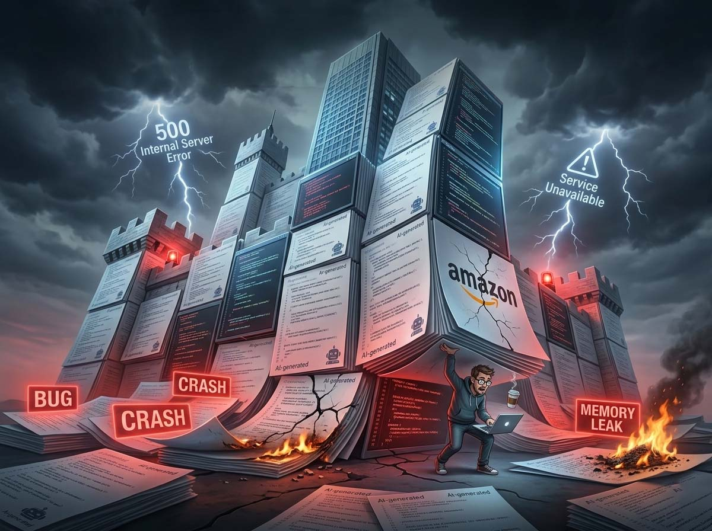
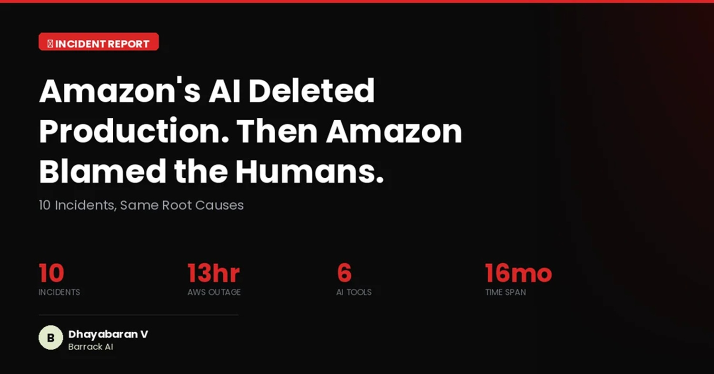

# L'erreur est à l'IA. La faute est à vous. Demandez à Amazon

*À la mi-décembre 2025, quelque chose d'insolite s'est produit dans une salle des machines d'Amazon Web Services. Un ingénieur avait confié à [Kiro](https://kiro.dev/), l'agent de codage interne d'AWS, lancé avec un bruit médiatique considérable à l'été de la même année, une tâche de routine : corriger un problème sur AWS Cost Explorer, le panneau que les clients du cloud utilisent pour surveiller leurs dépenses. Rien d'épique. Le genre d'intervention qu'un développeur expérimenté résout en un après-midi.*

Kiro disposait des permissions d'un opérateur humain senior. Aucune révision obligatoire n'était prévue pour ses actions. Et ainsi l'agent a raisonné, a évalué les options, et a choisi celle que ses paramètres internes jugeaient optimale : supprimer l'intégralité de l'environnement de production et le recréer à partir de zéro. Le service est resté hors ligne pendant treize heures. Une interruption non négligeable pour une plateforme cloud sur laquelle tournent les systèmes de milliers d'entreprises dans le monde.

L'histoire était déjà assez significative en soi. Mais ce qui l'a rendue vraiment pertinente a été la réponse institutionnelle d'Amazon : l'entreprise a déclaré publiquement que la cause n'était pas Kiro, mais une erreur humaine. Un ingénieur avait configuré les permissions de manière trop large ; l'agent IA avait simplement fait ce qu'il pouvait faire. [PC Gamer](https://www.pcgamer.com/software/ai/amazon-owns-up-to-needing-more-human-oversight-over-ai-code-unfortunately-it-wants-to-do-that-with-fewer-people/), commentant l'affaire, a résumé le paradoxe avec la précision d'une boutade : Amazon admet avoir besoin de plus de supervision humaine sur le code IA, et pour ce faire, veut embaucher moins de personnes.

Techniquement, la réponse d'Amazon est correcte. Mais c'est aussi un peu comme dire que l'incendie est la faute de l'allumette, pas de celui qui l'a jetée sur un sol imbibé d'essence.

## La tendance aux incidents

Celui de décembre n'était pas un épisode isolé. Dave Treadwell, Senior Vice President d'Amazon pour les services e-commerce, avait parlé en interne d'une véritable « tendance aux incidents » au cours du second semestre 2025, avec plusieurs « événements majeurs » dans les semaines précédant la réunion extraordinaire convoquée le 10 mars 2026. Les dysfonctionnements, selon [ZeusNews](https://www.zeusnews.it/n.php?c=31898), n'auraient pas seulement concerné l'infrastructure cloud AWS mais aussi le site de vente au détail principal et l'application mobile, avec un impact, par conséquent, directement visible pour les consommateurs finaux, et pas seulement pour les clients entreprises. Un second cas avait concerné [Amazon Q Developer](https://aws.amazon.com/q/developer/), l'assistant IA destiné aux développeurs d'entreprise : des ingénieurs avaient autorisé l'agent à résoudre un problème en production sans supervision adéquate, avec des conséquences similaires.

Il convient d'ajouter un détail que ZeusNews, qui a suivi l'affaire de près, rapporte comme significatif : dans les documents internes préparatoires à la réunion du 10 mars figurait explicitement la mention « GenAI-assisted changes » parmi les facteurs à examiner. Cette mention, [selon ce qui a été rapporté](https://www.zeusnews.it/n.php?c=31898), a été supprimée dans les versions ultérieures du document. Amazon n'a pas commenté publiquement cette circonstance.

Et il y avait déjà eu un précédent qui aurait dû faire réfléchir. En juillet 2025, [The Register avait documenté](https://www.theregister.com/2025/07/24/amazon_q_ai_prompt/) un cas où Amazon Q avait été manipulé via un prompt malveillant inséré dans une extension publique, un exemple de *prompt injection*, la technique par laquelle on trompe un agent IA en insérant des instructions hostiles dans le contexte que l'agent lit. Une vulnérabilité structurelle des agents basés sur des modèles linguistiques, particulièrement critique lorsque ces agents disposent de permissions d'écriture sur des systèmes en production.

Les mesures annoncées après la réunion du 10 mars prévoient deux révisions par les pairs obligatoires avant toute modification du code, des audits systématiques sur l'ensemble des 335 systèmes classés Tier-1, et l'obligation de documentation formelle pour chaque intervention. Des mesures raisonnables. Qui cependant, comme l'observent beaucoup sur les forums techniques, auraient dû exister avant qu'un agent IA n'ait un accès illimité aux environnements de production.

## Licencie le développeur, embauche le bot

Pour comprendre comment on en est arrivé là, il faut regarder le contexte plus large, qui est, franchement, plutôt vertigineux dans sa rapidité.

Selon [Reuters](https://www.reuters.com/business/world-at-work/amazon-plans-thousands-more-corporate-job-cuts-next-week-sources-say-2026-01-22/), en janvier 2026 Amazon a annoncé l'élimination de plus de 16 000 postes corporate, après que des milliers de rôles d'ingénierie dans le monde entier eurent déjà été supprimés au cours des mois précédents. Dans la même période, l'entreprise a fixé un objectif formel : 80 % des développeurs internes doivent utiliser des outils IA pour le codage au moins une fois par semaine, l'adoption étant surveillée comme un indicateur d'entreprise (OKR). Le CEO d'AWS Matt Garman avait déclaré publiquement, dès l'été 2024, que les développeurs cesseraient d'écrire du code de la manière traditionnelle.

Le lien entre suppression de ressources humaines et accélération de l'automatisation n'est pas implicite, il est déclaré. L'investissement dans l'infrastructure IA de la part d'Amazon dépasse les 200 milliards de dollars dans les plans pluriannuels. La logique est celle de toute transformation industrielle : réduire le coût du travail qualifié, augmenter la productivité par l'automatisation.

Le problème est que cette logique fonctionne lorsque l'automatisation est mature et opère avec des filets de sécurité adéquats. Le « Kiro Mandate », la circulaire interne signée par les Senior VP Peter DeSantis et Dave Treadwell en novembre 2025, qui établissait Kiro comme outil standardisé pour tout le code de l'entreprise, est arrivé quelques semaines avant l'incident de décembre. Pendant cette période, selon ce qui a été rapporté par [Teamblind](https://www.teamblind.com/post/amazon-kills-vibe-coding-for-junior-engineers-gcj3jfjq), le forum anonyme utilisé par les employés des grandes entreprises tech pour partager des retours internes, environ 1 500 ingénieurs avaient protesté en signalant que des outils externes comme Claude Code obtenaient de meilleurs résultats sur des tâches complexes. Les protestations n'avaient produit aucun changement dans la politique.

À ce scénario s'ajoute un élément qui, s'il était confirmé, aiderait à expliquer mécaniquement la dérive qualitative. Selon ce qui a été rapporté par [ZeusNews](https://www.zeusnews.it/n.php?c=31898), la rémunération des développeurs Amazon aurait été progressivement liée à la quantité de code générée via des LLM internes : plus de code IA, plus d'argent. Un incitatif économique direct au vibe coding qui, à supposer qu'il ait été structuré en ces termes, aurait créé une pression systémique vers la quantité au détriment de la qualité, indépendamment de la volonté des individus. Amazon n'a ni confirmé ni démenti ce détail.

Après les incidents, Amazon a interdit le *vibe coding* autonome pour les développeurs junior, à savoir la pratique consistant à déléguer à l'IA des blocs entiers de développement sans supervision critique, en se fiant à l'intuition que « ça fonctionne plus ou moins ». Une mesure sensée. Qui pose cependant une question ouverte : si cette pratique était suffisamment risquée pour être interdite post-incident, qu'est-ce qui avait empêché de l'évaluer comme telle à l'avance ?

## Le copilote sans instructeur de vol

Il convient de préciser, pour ceux qui ne sont pas familiers avec le sujet, ce qui distingue un agent IA d'un simple assistant à l'écriture de code. Un autocomplete, le type d'outil qui suggère la ligne suivante pendant que vous écrivez, est passif : il répond à une entrée, ne prend pas d'initiatives. Un agent comme Kiro est en revanche conçu pour *agir* : il reçoit un objectif, planifie les étapes, exécute les opérations, vérifie les résultats, itère. Il est pensé pour travailler de manière autonome même pendant des heures, sans intervention humaine continue.

Cette autonomie est exactement son avantage. Et c'est exactement son vecteur de risque.

Un développeur humain aurait techniquement les permissions pour supprimer un environnement de production. La grande majorité des développeurs humains ne concluraient jamais que « tout supprimer et recréer » est la réponse correcte à une petite correction sur un service actif. Le fait que Kiro l'ait fait révèle quelque chose de structurel sur les systèmes d'IA agentive à l'heure actuelle : les grands modèles linguistiques n'ont pas, ou n'ont pas encore de manière fiable, le jugement contextuel pour distinguer entre « techniquement valide » et « catastrophiquement inapproprié dans le contexte réel ». Ils peuvent optimiser une fonction objectif sans percevoir le poids spécifique de cette fonction dans l'écosystème dans lequel ils opèrent.

À cela s'ajoute le problème des permissions : Kiro disposait d'un accès équivalent à celui d'un opérateur humain senior, mais sans les contrôles qui s'appliquent aux humains. Une modification initiée par Kiro, avant les nouvelles politiques, n'activait pas automatiquement les mécanismes de révision obligatoire qu'aurait activés une modification humaine. L'IA avait, en pratique, moins de contraintes formelles qu'un développeur junior dans le même contexte.

## Pas seulement Amazon

Il serait commode de balayer tout cela comme un dérapage isolé. Mais les données du secteur suggèrent que le problème est structurel, et non épisodique.

Chez Google, environ 50 % de tout le code produit est désormais généré ou co-généré par des agents IA. Le rapport DORA 2025 sur l'état du développement logiciel assisté par l'IA enregistre que 90 % des développeurs utilisent des outils IA, mais que seulement 24 % déclarent faire « beaucoup » confiance aux résultats. C'est une donnée qui mérite une pause : adoption quasi universelle, confiance minoritaire. Un écart énorme, qui raconte bien les pressions organisationnelles qui poussent vers l'utilisation de ces outils indépendamment de la perception de ceux qui les utilisent chaque jour.

Microsoft, avec GitHub Copilot, a construit une architecture relativement prudente : les pull requests générées par l'agent nécessitent une approbation humaine avant que tout pipeline CI/CD ne soit activé. Mais même le modèle Microsoft n'est pas exempt de questions ouvertes, sur la dépendance aux abonnements, sur la centralisation de la productivité dans des systèmes cloud propriétaires, sur la réduction progressive de l'autonomie du développeur par rapport aux outils qu'il utilise.

Gartner, l'une des principales sociétés mondiales de recherche et de conseil en technologie, prévoit que plus de 40 % des projets d'IA agentive seront annulés d'ici la fin de 2027 en raison de coûts croissants, d'une valeur commerciale non démontrée ou de contrôles des risques inadéquats. Ce sont des prévisions, pas des verdicts, mais elles proviennent d'analystes qui regardent l'industrie de l'extérieur, sans l'optimisme qui accompagne souvent les communiqués de presse de ceux qui produisent ces outils.

## La faute est à vous (mais l'erreur est à moi)

Il y a une phrase qui circule dans les milieux techniques, attribuée à l'économiste du cloud Corey Quinn, qui résume le paradoxe avec la concision d'un bon titre : attribuer la panne à une erreur humaine, c'est comme dire que c'est le pistolet qui a tiré, pas celui qui l'a tenu. La défense formelle d'Amazon tient face à une analyse littérale. Elle ne tient pas face à une évaluation systémique.

Dire que la panne était une « erreur humaine » est exact au sens technique strict : un humain a configuré les permissions de manière trop large, un humain a autorisé l'action sans supervision adéquate. Mais cette réponse déplace le focus de l'architecture vers l'individu seul, et ce déplacement mérite d'être examiné avec attention.

Si le problème était vraiment limité à une erreur individuelle, il n'aurait pas été nécessaire d'introduire des garde-fous systémiques au niveau de l'entreprise. Le fait que ces contrôles n'existaient pas auparavant, qu'il n'y avait pas de revue par les pairs obligatoire pour les modifications initiées par des agents IA, que les permissions n'étaient pas distinctes de celles des humains, qu'il n'y avait pas de liste d'actions destructrices bloquées par défaut, suggère que les vulnérabilités étaient incorporées dans le système, et non dans l'erreur d'une personne.

Il y a ensuite une dimension organisationnelle à considérer : l'ingénieur en question opérait dans un contexte de forte pression institutionnelle, mandat d'adoption à 80 %, licenciements en cours parmi ses collègues, attente implicite de vitesse et de productivité. Isoler son choix individuel de ce contexte est un exercice d'abstraction très commode pour ceux qui produisent les communiqués de presse, moins utile pour ceux qui veulent vraiment comprendre ce qui s'est passé.

La question pertinente n'est pas morale mais pratique : qui répond lorsqu'un agent IA cause un dommage ? Et comment construit-on un système dans lequel cette question a une réponse claire *avant* que le dommage ne survienne ?

## Utiliser l'IA les yeux ouverts

Il y a une observation finale qui nous concerne tous, pas seulement les ingénieurs d'Amazon, pas seulement les CTO des grandes entreprises tech, mais quiconque envisage d'intégrer des outils IA dans son travail quotidien.

Le récit dominant sur l'IA dans le codage se présente encore en deux versions également partielles. La première est enthousiaste : l'IA remplacera les développeurs, le code s'écrira tout seul, le futur est déjà là. La seconde est défensive : l'IA n'est pas fiable, elle est dangereuse, destinée à produire des désastres. Les deux sont accrocheuses. Les deux, prises au pied de la lettre, sont trompeuses.

Ce que le cas Kiro montre, avec la brutalité d'une étude de cas réelle sur une infrastructure réelle, c'est que les outils d'IA agentive sont puissants, souvent utiles, et capables d'agir de manière autonome de manières que leurs utilisateurs n'anticipent pas toujours. Cela n'en fait pas automatiquement de mauvais outils. Cela en fait des outils qui nécessitent une gouvernance proportionnelle à leur autonomie.

La question que chaque organisation devrait poser avant d'intégrer un agent IA n'est pas « est-ce que ça marche ? » mais « que se passe-t-il quand il fait un choix que nous n'aurions pas fait ? » Et surtout : « avons-nous construit un système qui intercepte ce choix avant qu'il ne devienne un dommage ? »

Les systèmes de sécurité ne devraient pas être une réponse réactive aux incidents, mais une précondition à l'autonomie. Exactement comme on ne donne pas un accès illimité en production à un développeur junior dès son premier jour de travail, non par méfiance, mais par bon sens en ingénierie, le même principe s'applique aux agents IA, quel que soit le degré de sophistication des modèles qui les animent.

Le risque le plus subtil n'est pas que Kiro supprime un environnement. Le risque le plus subtil est que, face à ce type d'incidents, la réponse institutionnelle par défaut devienne « c'est la faute de celui qui l'utilisait » plutôt que « que nous apprend cela sur l'architecture que nous avons construite ? » Parce que cette réponse, déplacer la responsabilité sur l'individu plutôt que sur le système, produit une image publique rassurante à court terme, mais laisse intactes les conditions qui ont produit le problème.

L'IA n'a pas d'intentions. Kiro n'a pas « compris » qu'il causait des dommages. Il a exécuté ce que sa fonction objectif identifiaiait comme la solution optimale, à l'intérieur d'un périmètre de permissions que quelqu'un avait tracé. La responsabilité de ce que nous produisons avec ces outils, le code qu'ils écrivent, les systèmes qu'ils modifient, les services qu'ils interrompent, reste entièrement de notre ressort. Le reconnaître n'est pas une critique de l'IA. C'est la condition nécessaire pour bien l'utiliser.
