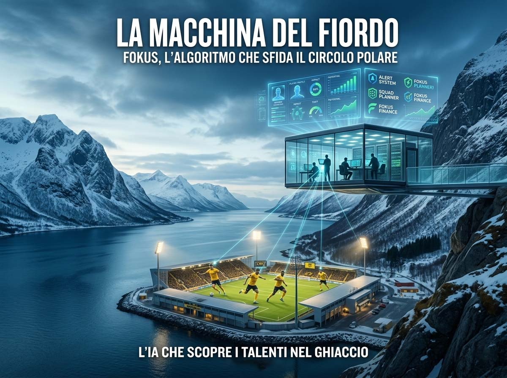
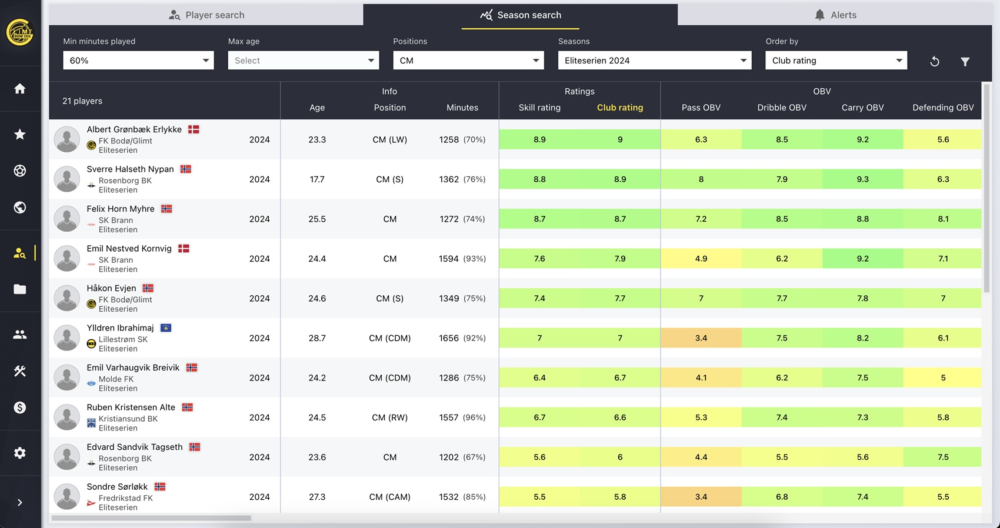
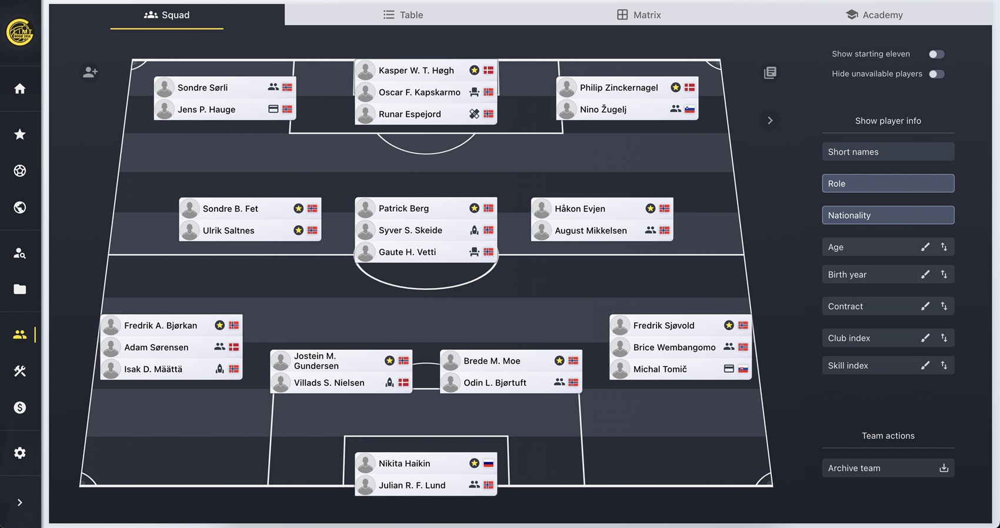
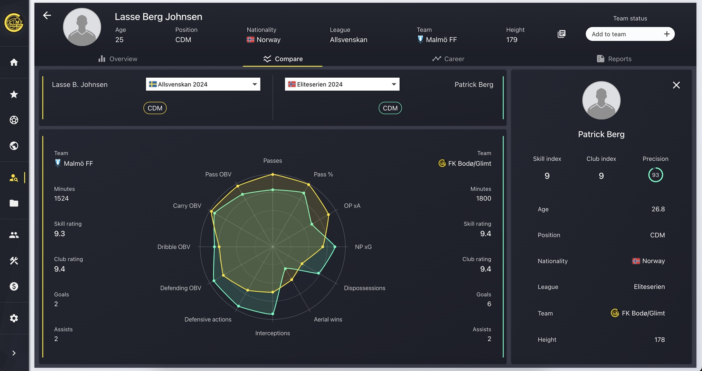
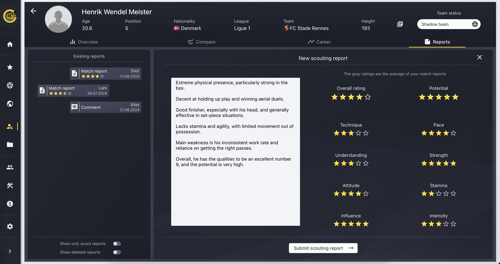

# Oltre il circolo polare: un'AI nata da una tesi universitaria sta riscrivendo il calcio europeo

*Se sei interista, so già come stai. Quella serata del 24 febbraio 2026 ti è rimasta appiccicata addosso come la maglia bagnata dopo un tempo supplementare. Non te la prendere, il calcio va così. Ma se riesci a staccarti per un attimo dalla sciarpa e a guardare cosa è successo davvero quella sera a San Siro, scoprirai qualcosa di molto più interessante di una sconfitta. Scoprirai che il [Bodø/Glimt](https://www.glimt.no/) non ti ha battuto per caso, e che dietro quei due gol di Hauge e Evjen, quelli che hanno chiuso il doppio confronto sul 5-2 aggregato, eliminando la squadra finalista della Champions League della stagione precedente, c'è una storia che riguarda il futuro del calcio europeo. Anzi, del calcio e basta.*

Quindi vieni con me. Lasciamo il tifo fuori dalla porta per qualche minuto.

## Bodø non è una città: è un argomento

Per capire quello che sta succedendo, bisogna prima capire *da dove* viene. [Bodø](https://it.wikipedia.org/wiki/Bod%C3%B8) è una città di circa 50.000 abitanti nella Norvegia settentrionale, appena sopra il Circolo Polare Artico. Cinquantamila persone: meno degli spettatori che riempiono Curva Nord e Curva Sud di San Siro messe insieme. Lo stadio di casa, l'[Aspmyra](https://www.glimt.no/), contiene 8.270 spettatori, ha il campo in erba sintetica con riscaldamento sotterraneo e il vento del Mare di Norvegia come variabile tattica permanente. Nel 2024, la città è stata nominata Capitale Europea della Cultura, un riconoscimento che dice molto sulla determinazione di una comunità a non accettare il ruolo di comparsa.

Il [Bodø/Glimt](https://it.wikipedia.org/wiki/Fotballklubben_Bod%C3%B8/Glimt) è stato fondato il 19 settembre 1916. "Glimt" in norvegese significa "fulmine", metafora perfetta per come questa squadra si è sempre mossa. La storia del club è un'alternanza di slanci e cadute, con almeno due passaggi sull'orlo del baratro finanziario. Il più drammatico è quello del 2009-2010: la squadra retrocede in seconda divisione, i giocatori [non ricevono lo stipendio per mesi](https://www.inter.it/it/notizie/storia-curiosita-inter-bodo-glimt-champions-league-25-26), i tifosi raccolgono bottiglie vuote per i contributi ambientali, i pescatori locali donano pesce da rivendere. Un club salvato letteralmente da una colletta popolare. Nel 2016 arriva un'altra retrocessione, poi di nuovo la risalita.

La vera svolta è nel 2017, con l'arrivo in panchina di Kjetil Knutsen, ex maestro elementare. Sotto la sua guida il Bodø/Glimt [conquista quattro campionati norvegesi](https://it.wikipedia.org/wiki/Fotballklubben_Bod%C3%B8/Glimt), nel 2020, 2021, 2023 e 2024, e costruisce un percorso europeo che sembrava fantascienza. Prima il 6-1 alla Roma di Mourinho nella Conference League 2021-22. Poi le semifinali di Europa League nel 2025, prima squadra norvegese a tagliare quel traguardo. E infine, nella stagione 2025-26, la Champions League: Manchester City battuto 3-1 in casa, Atlético Madrid sconfitto 2-1 a Madrid, Inter eliminata 5-2 sull'aggregato. Come riportato da [ESPN](https://www.espn.com/soccer/report/_/gameId/401858766), il Bodø/Glimt è diventato la prima squadra norvegese a superare un turno a eliminazione diretta in Champions, e il primo club fuori dai cinque grandi campionati a vincere quattro partite di fila contro squadre da quelle leghe dai tempi dell'Ajax nel 1971-72. Quell'Ajax andò a vincere il trofeo. Ma questa è un'altra storia, o forse no.

Tutto questo senza un proprietario miliardario. Senza scorciatoie. La domanda vera è: su cosa si fonda concretamente questo sistema? La risposta porta a Oslo, a tre studenti di ingegneria, e a una tesi magistrale diventata qualcosa di molto diverso da una nota accademica.

## Tre ingegneri, una tesi, un algoritmo

La storia di [Fokus](https://fokus.ing/) inizia nel 2021 e ha tutti gli ingredienti del racconto di fondazione tecnologica che piace alla Silicon Valley, tranne il garage californiano e i capitali da venture capital. Lars Hegg Gundersen, Markus Malum Kim ed Eliot Karlsen Strobel sono tre studenti di ingegneria a Oslo con un'idea radicale: prendere la logica di ottimizzazione che governa un videogioco come Football Manager, quello dove passi notti intere a cercare il centrocampista perfetto in Mongolia con un budget da quattro soldi, e trasformarla in un sistema operativo reale per le decisioni di mercato di un club calcistico.

Serve un club disposto ad ascoltarli. L'incontro decisivo avviene con Håvard Sakariassen, responsabile dello scouting del Bodø/Glimt, in un momento storico preciso: subito dopo il 6-1 alla Roma che aveva fatto conoscere il club al continente. Sakariassen è il tipo di dirigente che nella narrativa calcistica tradizionale non esiste: aperto al dato, curioso verso l'ingegneria, disposto a fidarsi di tre ragazzi con un prototipo. Come racconta [Fubolitix](https://fubolitix.substack.com/p/il-primo-club-di-calcio-a-sfruttare), il processo si è fondato su una divisione netta dei ruoli: conoscenza del calcio da un lato, competenza tecnica dall'altro. Dalla loro collaborazione è nata, nel 2022, Fokus.

Nel 2023 nasce formalmente **Fokus Solutions AS**, con sede a Oslo. Non è una semplice app di scouting: è un sistema di "club management" olistico che integra reclutamento, pianificazione della rosa e governance economica su un'unica piattaforma. Nel 2024, [Norsk Toppfotball](https://www.sprintesport.it/nazionali/2026/03/05/news/fokus-lalgoritmo-che-sta-rivoluzionando-il-modo-di-fare-mercato-dentro-la-macchina-del-bod-glimt-750502/), l'associazione dei club d'élite norvegesi, ha siglato un accordo quadro per diffondere Fokus alla maggioranza dei club del paese, formalizzando una propagazione già in corso tra Eliteserien (la massima divisione professionistica del campionato norvegese di calcio) e campionati nordici: Brann, Haugesund, ODD, Rosenborg. Il modello nato a Bodø si muove verso sud come un'onda lenta ma inarrestabile.

[Immagine della scheda season search tratta da fokus.ing](https://fokus.ing/)

## La macchina e il suo pilota

Prima di entrare nel funzionamento tecnico, è necessario sgombrare il campo da un equivoco ricorrente quando si parla di intelligenza artificiale nel calcio: l'idea che la macchina "decida" al posto degli esseri umani. Fokus non funziona così, e capirlo è fondamentale per valutarne il valore reale.

La piattaforma si articola in tre moduli principali che dialogano tra loro. Il primo è l'**Alert System**: un motore di segnalazione proattiva che filtra grandi volumi di dati e attiva notifiche quando un calciatore raggiunge certe soglie di compatibilità con il modello di gioco del club, con il suo profilo salariale e con il potenziale di rivendita. L'obiettivo è intercettare le *asimmetrie informative*, quel giocatore che il mercato non ha ancora prezzato correttamente.

Il secondo è il **Squad Planner**: un cruscotto di pianificazione che mette in relazione ruoli, minutaggi, successione generazionale e sviluppo interno con il calendario competitivo.

Il terzo è **Fokus Finance**: il layer economico che incrocia valutazioni tecniche con la sostenibilità finanziaria, simulando l'impatto di ogni operazione sul bilancio e sulle regole del fair play finanziario UEFA.

Il cuore del sistema di valutazione è un modello di *machine learning* che valuta i giocatori non in base a parametri di volume grezzo, passaggi completati, contrasti, chilometri, ma in base al **valore effettivo delle loro azioni sul risultato**. Come sottolinea [Fubolitix](https://fubolitix.substack.com/p/il-primo-club-di-calcio-a-sfruttare), è un approccio simile a quello che sistemi come Soccerment hanno applicato alla Serie A: un giocatore che fa molte cose "neutre" senza sbagliare può avere un impatto reale superiore a chi fa giocate spettacolari ad alto rischio di errore.

Fokus integra anche provider di dati avanzati esterni come [Goalimpact](https://goalimpact.com/), che assegna a ogni calciatore un indice basato sull'impatto sul differenziale reti della propria squadra nel tempo. Non l'unico strumento del genere, piattaforme come SciSports o IMPECT operano su logiche simili, ma Fokus si posiziona come "hub" capace di gestire e normalizzare fonti eterogenee, restituendo *insight* immediatamente utilizzabili a persone che non hanno necessariamente un background da analisti del dato.

Quest'ultimo punto è forse il vantaggio competitivo più sottovalutato della piattaforma. Come spiega Sakariassen citato da [Fubolitix](https://fubolitix.substack.com/p/il-primo-club-di-calcio-a-sfruttare), avere tutto su un'unica piattaforma intuitiva da permettere a chiunque di utilizzarla, che tu abbia 22 o 55 anni, è centrale nel valore del sistema. L'obiettivo non è creare una casta tecnica che controlla l'informazione, ma distribuire la capacità decisionale a tutto il club. C'è poi la **continuità istituzionale**: quando uno scout se ne va, porta via anni di osservazioni. Con Fokus, tutte le valutazioni sono centralizzate. La macchina non dimentica.

[Immagine della scheda strategy tratta da fokus.ing](https://fokus.ing/)

## I numeri che parlano da soli

I risultati economici del Bodø/Glimt negli anni di utilizzo di Fokus sono documentati. Il club ha generato entrate da cessioni per oltre 60 milioni di euro nelle stagioni dal 2021 al 2025, con un picco intorno ai 19,6 milioni nel solo 2024, come riportato da [Sprint e Sport](https://www.sprintesport.it/nazionali/2026/03/05/news/fokus-lalgoritmo-che-sta-rivoluzionando-il-modo-di-fare-mercato-dentro-la-macchina-del-bod-glimt-750502/). Nel 2025 il club ha presentato un utile storico di circa 203,5 milioni di corone norvegesi su ricavi totali vicini a 808,8 milioni. I nomi delle cessioni, Albert Grønbæk, Faris Moumbagna, Hugo Vetlesen, Victor Boniface, Joel Mvuka, non sono operazioni spot, ma l'output ricorrente di un modello che identifica talenti, li valorizza e li cede al momento giusto. Per un club salvato nel 2010 dalla raccolta di bottiglie vuote, è una trasformazione senza molti paragoni nel calcio europeo recente.

I risultati sportivi nella Champions League 2025-26 hanno aggiunto il sigillo definitivo. Come documentato da [ESPN](https://www.espn.com/soccer/report/_/gameId/401858766), a gennaio 2026 il Bodø/Glimt aveva lo 0,3% di probabilità di accedere agli ottavi secondo il modello Opta. Poi è arrivata la striscia: Manchester City battuto 3-1 in casa, Atlético Madrid sconfitto 2-1 a Madrid, Inter eliminata 5-2 sull'aggregato. Il portiere Haikin ha chiuso la stagione come miglior portiere della competizione per *expected goals* evitati, con +4,6 secondo Opta, davanti a Sommer dell'Inter, a +2,6. Non è fortuna che produce questi numeri.

[Immagine della scheda scouting tratta da fokus.ing](https://fokus.ing/)

## Il lato oscuro dell'algoritmo

Sarebbe disonesto, però, raccontare questa storia solo come un trionfo senza ombre. Ogni sistema basato sui dati porta con sé i limiti strutturali dei dati su cui è stato addestrato, e il calcio non fa eccezione.

Il primo rischio è quello dei **bias algoritmici**. I modelli di machine learning imparano dai dati storici, e se i dati storici rispecchiano un mondo in cui certi calciatori, per ragioni geografiche, economiche, culturali, sono stati sistematicamente sottorappresentati nelle banche dati avanzate, il modello tende a perpetuare quella sottorappresentazione. Un talento che gioca in un campionato con scarsa copertura statistica rischia di essere invisibile al radar, non perché non sia bravo, ma perché i dati semplicemente non esistono in forma processabile. I campionati africani, alcune leghe sudamericane, buona parte dell'Asia: il problema non è l'algoritmo, è la qualità e la distribuzione disomogenea del dato in ingresso.

Il secondo rischio è l'**over-reliance**: la tentazione di affidarsi al dato come se fosse la realtà, dimenticando che i dati misurano comportamenti passati in contesti passati. Un giocatore eccezionale in un contesto tattico specifico potrebbe essere mediocre in un altro. La creatività, la personalità, la resistenza alla pressione psicologica, la capacità di emergere in momenti decisivi: queste qualità sono difficili da quantificare e i modelli attuali non le catturano con sufficiente precisione. Come ammette lo stesso Fubolitix: il limite della piattaforma è proprio quello di non saper valutare comportamenti, attitudini e mentalità dell'atleta. Per questo, nelle parole degli stessi fondatori, lo scouting tradizionale in carne ed ossa rimane un pilastro irrinunciabile. Fokus segnala e filtra; l'occhio umano osserva e decide.

C'è poi la questione della **democratizzazione reale**. Fokus è pensato per ridurre i costi e i tempi dello scouting per i club più piccoli, e in Scandinavia sta già funzionando in questo senso. Ma a scala europea e globale, il rischio è che gli strumenti più sofisticati di analisi del dato restino accessibili solo ai club con le risorse economiche per acquistarli, implementarli e soprattutto formare il personale che li utilizza. La tecnologia democratizza solo se distribuisce davvero l'accesso, altrimenti sposta semplicemente il piano su cui si gioca il vantaggio competitivo: da "chi ha più soldi per comprare i calciatori" a "chi ha più soldi per comprare i migliori algoritmi".

Infine, ci sono le **implicazioni etiche e legali** legate ai dati personali dei giocatori. I modelli di valutazione utilizzano metriche biomeccaniche, dati sulla salute e sulle performance fisiche, informazioni che in Europa ricadono sotto il GDPR e che richiedono consenso esplicito e trattamento trasparente. La "black box" degli algoritmi, il fatto che spesso non sia possibile spiegare in modo semplice perché un modello abbia valutato un giocatore in un certo modo, crea anche potenziali problemi di trasparenza nei confronti dei calciatori stessi, che potrebbero essere esclusi da opportunità di carriera sulla base di valutazioni che non possono contestare né comprendere.

[Immagine della scheda decision tratta da fokus.ing](https://fokus.ing/)

## Il futuro che arriva dal freddo

Dove porta tutto questo? Il Bodø/Glimt e Fokus non sono un'anomalia destinata a restare circoscritta ai campionati nordici. Sono il segnale di una trasformazione più ampia nel modo in cui il calcio prende decisioni.

Gli strumenti di analisi avanzata nel calcio non sono una novità, Wyscout, StatsBomb, SciSports operano da anni nel settore. Ma Fokus porta un approccio diverso: non un tool isolato per gli analisti del dato, ma una piattaforma integrata che connette scouting, pianificazione della rosa e finanza in un sistema unico, progettato per essere accessibile a tutta l'organizzazione. È la differenza tra avere un consulente esterno che ti fornisce un report e avere un sistema interno che trasforma la cultura decisionale dell'intera struttura.

Il percorso del Bodø/Glimt nella Champions League 2025-26 si è chiuso agli ottavi di finale: dopo aver battuto lo Sporting Lisbona 3-0 nell'andata, la squadra ha subito un 5-0 in Portogallo, uscendo dalla competizione con un 5-3 aggregato. Un'eliminazione che non ridimensiona né l'impresa né l'analisi che abbiamo fatto: il metodo, la cultura decisionale e il modello costruito con Fokus non si valutano sul risultato finale di una singola coppa. Nessuno si aspettava che una squadra di una piccola città artica alzasse la coppa dalle grandi orecchie. Quello che rimane intatto è qualcosa di più solido di un trofeo: la dimostrazione che si può competere ai massimi livelli europei con intelligenza, dati e una visione chiara, anche senza i budget delle grandi. Nessun club norvegese era mai arrivato così lontano. E questo, con o senza Lisbona, non lo toglie nessuno.

Knutsen, l'ex maestro elementare diventato uno degli allenatori più innovativi del continente, dopo il 5-2 sull'Inter ha detto una cosa semplice a TV2: "È stato un viaggio. C'è un grande gruppo di noi che ne ha fatto parte. Ci sono un numero incredibile di persone dietro a tutto questo, che credono così fortemente nel progetto". Il progetto è qualcosa di più grande di una squadra di una città di 50.000 persone sopra il Circolo Polare Artico. È la dimostrazione che la combinazione di cultura organizzativa, identità collettiva e intelligenza artificiale applicata con giudizio, non in sostituzione degli esseri umani, ma come loro amplificatore, può produrre risultati che sfidano logiche che sembravano immutabili.

Quindi, caro tifoso interista: hai tutto il diritto di essere ancora arrabbiato. Il calcio funziona così, e quei due gol a San Siro fanno ancora male. Ma se un giorno ti capiterà di guardare una partita del Bodø/Glimt senza il filtro del tifo, potresti scoprire che stai guardando qualcosa di raro: una squadra che ha capito prima di quasi chiunque altra come il futuro del calcio si costruisce non solo sul campo, ma nei modelli che decidi di costruire prima ancora che la palla rotoli. E quella, nel calcio come nella vita, è una partita che vale sempre la pena di studiare.