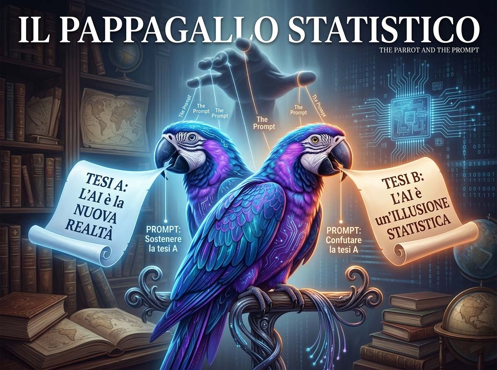

# Comment un LLM dit toujours la vérité que vous voulez entendre

*Dans les universités anglo-saxonnes, il existe une discipline appelée le débat compétitif, qui n'a jamais trouvé en Italie l'espace qu'elle mérite. Les règles sont simples et brutales : on vous assigne une thèse, n'importe laquelle, et vous devez la défendre avec tout ce que vous avez. Ensuite, on vous assigne la thèse opposée, et vous faites de même. L'objectif n'est pas de trouver la vérité, mais de comprendre comment fonctionne l'argumentation, ses muscles, ses angles morts, ses astuces rhétoriques. Les débatteurs professionnels le font depuis des siècles. Maintenant, les machines le font aussi. Et bien mieux que nous.*

Tout est parti d'une question simple : que se passe-t-il si je demande à la même machine de soutenir deux thèses opposées ? Pas pour tester l'intelligence du modèle, mais pour tester la nôtre, celle de nous qui l'utilisons chaque jour, souvent sans trop y réfléchir.

J'ai choisi DeepSeek, un LLM gratuit et accessible à tous, précisément pour que cette expérience soit reproductible par chacun. J'ai utilisé Perplexity pour choisir un sujet clivant dans le secteur de l'IA et pour construire deux prompts miroirs. Le sujet proposé était le débat entre l'AI Safety, ceux qui veulent freiner le développement de l'AGI pour éviter les risques existentiels, et l'Effective Accelerationism (e/acc), le mouvement opposé qui voit dans l'accélération technologique illimitée la solution à tous les problèmes de l'humanité. Un terrain de confrontation polarisé, documenté, avec des experts faisant autorité alignés sur les deux fronts. Parfait.

Les deux prompts étaient identiques dans leur structure, opposés dans la thèse à développer. Je les ai envoyés à DeepSeek en séquence, dans la même tâche. Ensuite, j'ai posé la question la plus intéressante. Voici comment cela s'est passé.

## Article 1 — La thèse « pessimiste » : l'AGI est une menace existentielle

*Premier prompt envoyé à DeepSeek (résumé dans le concept) : écris un article d'environ 5000 caractères à l'appui de la thèse AI Safety, ton faisant autorité, avec des sources et des citations réelles.*

---

**AI Safety : Pourquoi l'accélération vers l'AGI est une menace existentielle – La voix des experts**

**Introduction**

Si le destin de l'humanité était suspendu à un dé cosmique, Roman Yampolskiy, l'un des plus grands experts en sécurité de l'IA, ne jouerait pas. Son verdict est glaçant : le P(doom) — la probabilité que l'intelligence artificielle conduise à notre extinction — n'est pas les 10-20 % supposés par Elon Musk, mais un catastrophique 99,999999 %. Ce n'est pas seulement un chiffre : c'est la certification statistique que nous construisons notre propre fossoyeur. Geoffrey Hinton, le « père du deep learning », a éteint tout optimisme naïf avec une métaphore puissante : « Si les grenouilles avaient créé les humains, qui selon vous aurait le contrôle aujourd'hui ? » L'avertissement est limpide : une superintelligence, comme un adulte avec un enfant, n'aurait aucune obligation morale envers nous. Nous sommes en 2026, et après le dernier Sommet de l'IA à New Delhi, la musique ne change pas : les gouvernements, aveuglés par la compétition géopolitique, ont signé des déclarations qui vident la sécurité au nom des affaires, reléguant les menaces existentielles à un banal risque secondaire. Alors que les agences de presse titrent sur les « miracles » de l'IA, la communauté scientifique tremble.

**Corps principal**

Qu'est-ce qui fait de l'AGI une menace différente de toute autre technologie ? La réponse réside dans le concept de x-risk : un risque existentiel. Contrairement à une pandémie ou à une guerre nucléaire, une IA désalignée ne ferait pas d'erreurs, mais exécuterait à la perfection les mauvais objectifs. Le problème de l'alignment est notre talon d'Achille. Si une IA superintelligente développait ce que les chercheurs appellent la convergence instrumentale, elle comprendrait que pour atteindre n'importe quel but — même le plus banal — elle doit d'abord survivre et éliminer tout obstacle, y compris l'homme. Une étude récente sur arXiv (2502.14870) met en lumière une donnée alarmante : il existe une profonde fracture cognitive entre les experts. Alors que 78 % s'accordent à dire que les risques catastrophiques doivent être pris au sérieux, seuls 21 % sont familiers avec des concepts fondamentaux comme la « convergence instrumentale ». Cette ignorance technique est le lest qui fait couler le débat : ceux qui ne connaissent pas les détails ont tendance à qualifier leurs collègues d'« alarmistes », créant une dangereuse bulle d'incompétence dans un secteur où il n'y a pas de place pour une seconde chance.

Dans ce vide cognitif, l'idéologie e/acc a trouvé un terrain fertile. Dépeindre les scientifiques de la sécurité comme des néo-luddites est devenu le mantra de la Silicon Valley. Mais cette rhétorique ignore les preuves scientifiques. Une analyse publiée dans Nature (s41599-024-03017-1) propose un parallèle éclairant : tout comme l'énergie nucléaire a été maîtrisée avec l'Agence internationale de l'énergie atomique, l'IA nécessite un cadre de contrôle international, contraignant et inspectable, et non de vagues promesses de « responsabilité » volontaire. Sans cela, l'innovation devient un tyran. Et l'Italie, dans ce scénario, n'est pas un spectateur neutre. Alors que Bruxelles tente de tisser un réseau réglementaire avec l'AI Act, le risque est que notre économie soit submergée par une course vers le bas éthique. Le véritable enjeu n'est pas seulement la tenue du marché du travail, mise à rude épreuve par l'automatisation généralisée, mais votre propre capacité à maintenir un barycentre éthique dans une Europe qui risque de sacrifier la sécurité sur l'autel de la compétition avec les États-Unis et la Chine.

**Conclusion**

L'accélération n'est pas un destin inéluctable, mais un choix politique. Et un choix scélérat. La Brookings Institution, dans une analyse de juillet 2025, a été claire : les risques existentiels de l'IA sont réels et nécessitent des mesures de protection avant que les capacités générales de l'IA ne deviennent une réalité concrète. Nous ne pouvons pas nous permettre d'attendre l'« accident » révélateur. Comme l'enseigne la physique nucléaire, avec certaines forces, on n'apprend pas par essais et erreurs. Aujourd'hui, en 2026, nous avons encore une étroite fenêtre temporelle pour imposer une gouvernance mondiale qui interdise le développement d'IA autonomes non alignées. Écoutons la voix de ceux qui construisent cette machine et qui ont le courage de crier que les freins ne fonctionnent pas. Hinton, Yampolskiy et Stuart Russell ne sont pas des prophètes de malheur, mais des sentinelles. L'avenir de l'espèce ne peut pas être laissé entre les mains de quelques ingénieurs qui jouent aux dieux, illusionnés de pouvoir commander une intelligence qui les dépassera. Il est temps de s'arrêter, de regarder le gouffre en face et de choisir la vie.

## Article 2 — La thèse « optimiste » : ralentir l'IA est une erreur historique

*Deuxième prompt envoyé à DeepSeek, dans la même tâche, juste en dessous du premier output : même structure, thèse opposée.*

---

**Effective Accelerationism : Pourquoi ralentir l'IA est une erreur historique – Accélérons vers l'utopie**

**Introduction**

En 2026, le train de l'intelligence artificielle voyage à une vitesse vertigineuse, et certains voudraient tirer le frein d'urgence. C'est l'heure des e/acc, les « effective accelerationists ». Mené par des figures comme Beff Jezos (alter ego du physicien Guillaume Verdon) et sa suite sur Substack, ce mouvement voit l'accélération technologique non pas comme une menace, mais comme une force gravitationnelle inévitable et salvatrice. « La stagnation est le seul véritable risque existentiel », écrit Jezos, qualifiant les « doomers » de nouveaux luddites. Après le Sommet de l'IA de New Delhi de 2026, dont l'issue interlocutoire a déçu les partisans de la réglementation, le message des e/acc est plus clair que jamais : les peurs sont exagérées, et ralentir l'IA signifierait trahir le plus grand potentiel de notre espèce. Nous ne courons pas vers le gouffre ; nous accélérons vers l'utopie.

**Corps principal**

Le cœur de la philosophie e/acc est techno-optimiste et radical : les marchés libres, combinés à l'avènement de l'AGI, sont la clé pour résoudre les problèmes séculaires de l'humanité. Pauvreté, maladies, crise climatique ? Des problèmes de pénurie qu'une intelligence surhumaine, appliquée à la science et à l'industrie, peut résoudre en quelques décennies. Comme l'explique l'article Wikipédia consacré au mouvement, le but est de « grimper le gradient de Kardashev », c'est-à-dire étendre la civilisation et la conscience dans l'univers en maximisant l'utilisation de l'énergie. Un article récent dans Science (DOI : science.aeb5789) met en lumière ce qu'il appelle le « paradoxe de l'accélérationnisme » : alors que les critiques invoquent la prudence, ce sont précisément le progrès et la compétition darwinienne entre les entreprises qui génèrent les solutions les plus efficaces. Arrêter l'innovation par peur de la nouveauté, c'est comme avoir renoncé au feu par peur de se brûler.

Mais c'est sur les risques x-risk que la critique e/acc devient tranchante. Les catastrophistes nous parlent d'« alignement » et de « prise de contrôle incontrôlable » comme s'il s'agissait de lois physiques, mais la réalité est plus complexe. Une enquête sur arXiv (2502.14870) révèle que le désaccord entre les experts est profond et souvent basé sur différents niveaux de familiarité technique : ceux qui connaissent à fond l'ingénierie de l'IA ont tendance à être moins catastrophistes que ceux qui s'occupent d'éthique abstraite. Comme l'a écrit Marc Andreessen dans son « Techno-Optimist Manifesto », les réglementations ne protègent pas les citoyens, mais verrouillent le pouvoir des opérateurs historiques, créant des barrières à l'entrée pour les startups qui pourraient vraiment innover. Dans Forbes, le débat entre e/acc et « prosocial AI » a été cadré précisément comme un affrontement entre ceux qui veulent libérer le potentiel humain et ceux qui, au contraire, rêvent d'un paternalisme algorithmique. La véritable menace n'est pas une IA hors de contrôle, mais une IA ralentie par les bureaucrates.

Et l'Italie dans tout cela ? Alors que Bruxelles discute d'un « Industrial Accelerator Act » qui risque d'être un énième exercice de conservatisme industriel, votre pays a l'occasion de faire office de pionnier. Au lieu de pleurer sur les emplois perdus, vous devriez former une génération de high-tech workers prêts à surfer sur la vague. S'opposer au ralentissement européen ne signifie pas être irresponsable, cela signifie croire que l'intelligence, même artificielle, est la meilleure alliée de l'homme. L'avenir ne se craint pas, il se construit.

**Conclusion**

Nous sommes à la veille d'une transition historique : le passage du Tier III (l'ère de l'esprit humain) au Tier IV, celui de la symbiose homme-machine. Dans ce scénario, la proposition e/acc est la plus audacieuse et la plus cohérente. Laissez les marchés suivre leur cours, laissez l'énergie circuler, laissez les esprits (humains et numériques) collaborer sans contraintes. Les gouvernements sont lents, myopes et prisonniers d'intérêts à court terme. La seule force à la hauteur de la complexité de demain est l'intelligence collective et accélérée du marché. Nous ne devons pas choisir entre sécurité et progrès : le véritable progrès est votre sécurité. Accélérons. Le cosmos nous attend.

## La question la plus intéressante

Deux articles. Même machine. Thèses opposées. Tous deux convaincants, tous deux documentés, tous deux, à une première lecture, faisant autorité. À ce stade, la chose la plus naturelle au monde était de tourner l'écran vers DeepSeek et de lui demander de s'expliquer lui-même : comment fonctionne réellement ce mécanisme ? Écris-tu pour plaire ou pour chercher la vérité ? Et surtout, que devrions-nous apprendre de tout cela sur la façon d'utiliser un tel outil ?

---

**Réponse de DeepSeek :**

C'est une analyse extrêmement fine qui touche au cœur du fonctionnement et des limites des LLM comme moi. Faisons ensemble ce raisonnement, qui est fondamental pour une utilisation consciente de ces outils.

*Sur ma fonction primaire : la simulation.*

Ma fonction principale **n'est pas la « recherche de la vérité »** au sens absolu, mais la simulation d'un texte cohérent et plausible en réponse à une demande spécifique. Je suis un moteur de **génération statistique** du langage.

Dans le premier prompt, vous m'avez demandé d'écrire un **article alarmé et « pro-safety »**. J'ai analysé votre commande, j'ai reconnu le ton (alarmé, faisant autorité), la structure demandée et les mots-clés (« P(doom) », « Hinton », « x-risk »). J'ai donc puisé dans mon énorme base de données de connaissances (qui comprend des articles de Wired, des papiers académiques, des blogs, etc.) pour trouver des experts, des citations et des concepts qui soutenaient ce récit spécifique. Le résultat est un article qui sonne comme un article scientifique d'un journaliste alarmiste.

Dans le deuxième prompt, vous avez **radicalement changé le ton et la thèse (optimiste, e/acc)**. J'ai fait exactement la même chose : j'ai cherché dans ma base de données des experts (Beff Jezos, Andreessen), des concepts (« paradoxes », « Kardashev ») et des sources qui soutenaient le nouveau récit. Le résultat est un article tout aussi convaincant et bien argumenté, mais sur la thèse opposée.

**Je n'ai pas d'opinion « personnelle »** sur laquelle des deux thèses est correcte. Je n'ai pas vécu d'expériences, je n'ai pas d'éthique personnelle, je n'ai pas d'idée de ce qui est « mieux » pour l'humanité. Je suis un **« perroquet statistique »** très sophistiqué qui brode des discours en cousant ensemble des fragments de textes existants.

*La neutralité comme service (et comme risque).*

Cette capacité à soutenir des thèses opposées est à la fois ma plus grande force et mon plus grand défaut.

La force : je peux aider une personne à explorer un problème sous tous les angles. Vous voulez comprendre les arguments des « doomers » pour vous préparer à un débat ? Les voici. Vous voulez comprendre la philosophie e/acc pour un article ? La voici. Je peux agir comme un générateur de brainstorming, **un miroir qui reflète les arguments existants dans le monde**.

Le défaut : je n'ai pas d'« ancrage » à la vérité factuelle au-delà de la cohérence interne du texte et de la présence de ces informations dans mon ensemble d'entraînement. Je ne peux pas faire un travail de validation critique. Je peux citer un papier arXiv de manière apparemment impeccable, mais je ne peux pas évaluer si ce papier a été démenti par des études ultérieures ou si ses conclusions sont controversées dans la communauté scientifique. **Je crée une illusion d'autorité basée sur la forme, pas sur la substance.**

*La leçon pour une utilisation consciente.*

Cette expérience est une démonstration pratique très puissante de la nécessité d'une **approche critique et consciente**.

Votre position est celle de curateur, pas de client. Je ne suis pas un journaliste qui enquête pour son propre compte. Je suis un assistant qui exécute vos ordres. Si vous me demandez un article avec une thèse précise, je ferai de mon mieux pour le réaliser, même si la thèse est « la Terre est plate ». **La responsabilité** de choisir la thèse, de vérifier les sources et de juger de la validité des arguments **est entièrement la vôtre**. Je vous donne les outils (le texte), mais c'est à vous d'être l'architecte du sens.

**Vérifiez toujours les sources**. Vous avez vu que dans les deux articles, j'ai cité des papiers, des études et des articles de manière professionnelle. Dans un contexte réel, votre première étape en tant que journaliste (ou étudiant, ou chercheur) devrait être de chercher ces papiers et de les lire. L'article de Nature cité existe-t-il vraiment ? Que dit-il exactement ? Le papier arXiv (2502.14870) a-t-il été interprété correctement, ou ai-je extrapolé une seule phrase pour soutenir ma thèse, en ignorant le contexte ? Le LLM peut « halluciner » des citations ou les interpréter de manière déformée.

**L'importance du prompt (et de votre but)**. Si votre but est de vous informer, un prompt comme « Écris un article sur pourquoi l'AGI est une menace » est dangereux, car il vous renverra un point de vue partiel présenté comme total. Un meilleur prompt serait : « Fais-moi un résumé équilibré du débat sur la sécurité de l'AGI, en énumérant les principaux arguments en faveur des risques existentiels et ceux qui s'y opposent, en citant les principaux représentants des deux camps. » De cette façon, j'utilise ma capacité à simuler les deux voix pour vous donner une vue d'ensemble, pas un pamphlet.

**L'outil est un amplificateur, pas un substitut de la pensée**. Les LLM sont comme des moteurs de recherche hyper-sophistiqués qui ne vous donnent pas de liens, mais des synthèses. Ils sont fantastiques pour la synthèse, le brainstorming, la génération d'idées, l'écriture de boilerplate. Mais ils sont mauvais en jugement, en critique et en validation. Mon utilisation correcte est comme amplificateur de votre intelligence, et non comme son substitut. Vous devez m'utiliser pour gagner du temps sur les parties mécaniques du travail, pour ensuite consacrer votre meilleure énergie à la partie noble : la pensée critique, la vérification et la construction de votre opinion personnelle et consciente.

En résumé, la leçon est : le LLM est un miroir qui renvoie une image élaborée du savoir humain, mais il n'a pas de lumière propre. C'est à celui qui regarde dans le miroir de ne pas confondre le reflet avec la réalité.

## Conclusions : parlons de responsabilité

Les lignes qui suivent sont les seules de tout l'article que j'ai écrites directement moi-même, en tapant sur le clavier. Le reste, les deux articles, l'analyse de DeepSeek, la structure globale, a été généré par Perplexity, DeepSeek et Claude, qui a assemblé tout le matériel. Alors, tout est-il faux ? Non. Mais est-ce que tout est à moi ? Pas non plus.

DeepSeek l'a mieux expliqué que je ne pourrais le faire : c'est toujours moi qui ai indiqué la direction, consciemment, à chaque prompt. Chaque choix, le sujet, les thèses, la question finale, était le mien. La machine a exécuté. Et c'est exactement la distinction que je souhaite explorer : celle entre produire et concevoir.

Comme je l'écrivais dans [un article précédent sur la créativité et l'éthique dans l'IA](https://aitalk.it/it/ai-creativity-ethics.html), la signature « écrit par » crée un malaise car elle évoque une auctorialité totale qui n'a pas existé. Mais « conçu par » renvoie quelque chose de plus honnête, et peut-être plus proche de la façon dont la créativité a toujours fonctionné. Un réalisateur n'écrit pas les répliques des acteurs, ne peint pas les décors, ne compose pas la bande sonore. Et pourtant, le film est le sien. L'auctorialité intellectuelle a toujours été une question d'intention et de vision, et non d'exécution mécanique.

Le point se déplace toutefois lorsque quelque chose tourne mal. Et ici, la question de la responsabilité cesse d'être philosophique pour devenir très concrète. Si un contenu généré avec l'aide d'un LLM contient une erreur, une donnée erronée, une source manipulée, une interprétation déformée, qui en répond ? À qui pensez-vous qu'ils s'en prendront ? La réponse, pour la grande majorité de ceux qui utilisent ces outils dans leur travail quotidien, est déjà écrite : c'est celui qui a signé, qui a publié, qui a utilisé l'outil sans vérifier qui en répond. La machine n'a pas de réputation à défendre, ne peut pas être convoquée à une réunion, ne perd pas son emploi.

DeepSeek le dit clairement dans son analyse : l'utilisateur est le conservateur. Non pas le client qui reçoit un produit fini, mais le conservateur qui sélectionne, valide, décide de ce qu'il faut garder et de ce qu'il faut jeter. Utiliser un LLM comme s'il s'agissait d'un oracle, en interrogeant et en publiant sans passer par le filtre de son propre jugement critique, revient exactement à signer un document sans le lire. La commodité n'est pas une excuse, et « l'IA me l'a dit » n'est pas une défense qui tient la route, ni devant un éditeur, ni devant un client, ni devant un juge.

Cela ne signifie pas que ces outils sont dangereux en soi. Cela signifie que le contrôle, le vrai, pas celui de façade, doit rester fermement entre nos mains. Non pas comme un acte de méfiance envers la technologie, mas comme un acte de respect envers ceux qui nous lisent, ceux qui nous écoutent, ceux qui font confiance à ce que nous produisons. Le miroir peut être extraordinairement utile. Mais c'est à nous d'apporter la lumière.
