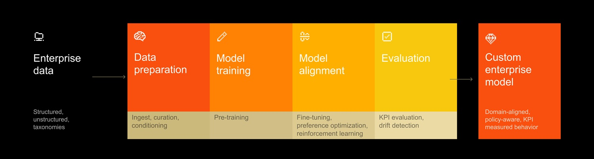

# Il tuo modello, le tue regole: Mistral Forge e l'AI proprietaria

*C'è un equivoco sottile al cuore di come la maggior parte delle aziende usa l'intelligenza artificiale oggi. Mandano prompt a modelli addestrati su miliardi di pagine internet, su libri, articoli, forum, codice pubblico su GitHub, e si aspettano risposte calibrate sulla loro realtà interna. Ma quella realtà interna, le procedure operative di un'azienda farmaceutica, i manuali di manutenzione di una turbina, i contratti tipo di uno studio legale milanese, le policy di compliance di una banca, non è mai entrata in nessun dataset di addestramento. È come chiedere a qualcuno che ha letto tutta la Treccani di spiegare come funziona il processo di approvazione interna di una richiesta di ferie nella vostra azienda. La risposta sarà generica, educata, inutile.*

Mistral AI ha scelto il palco del Nvidia GTC 2026, la conferenza annuale di Jensen Huang dove quest'anno si è parlato quasi esclusivamente di AI agentiva per l'enterprise, per annunciare [Forge](https://mistral.ai/news/forge): un sistema che consente alle organizzazioni di addestrare modelli linguistici direttamente sulla propria conoscenza istituzionale. Non si tratta di un nuovo chatbot, né di uno strumento per ottimizzare i prompt. È qualcosa di strutturalmente diverso, e vale la pena capire esattamente cosa, perché le implicazioni, tecniche, economiche, geopolitiche, sono tutt'altro che banali.

## Cosa fa Forge, nel concreto

Per capire Forge serve prima capire cosa lo distingue dagli strumenti di personalizzazione dell'AI già esistenti. La stragrande maggioranza delle soluzioni enterprise oggi lavora in due modi: il Retrieval-Augmented Generation (RAG), dove il modello non viene toccato ma viene "informato" al momento della risposta recuperando documenti rilevanti da un database, oppure il fine-tuning superficiale, dove si riaddestra il modello su un piccolo dataset specifico per adattarne leggermente il comportamento. Entrambi gli approcci lasciano il modello base immutato. È come affittare un appartamento e portarsi i propri mobili: l'edificio non cambia, cambia solo l'arredamento.

Forge propone qualcosa di radicalmente diverso: costruire l'edificio da zero, seguendo le proprie specifiche. La [pagina prodotto](https://mistral.ai/products/forge) descrive un processo articolato in più fasi del ciclo di vita del modello. Il pre-training, la fase più profonda, permette di addestrare il modello su grandi volumi di documentazione interna non strutturata, codebase aziendali, dati operativi, archivi storici, in modo che il modello non si limiti a consultare quella conoscenza ma la interiorizzi nel suo funzionamento di base. È la differenza tra un medico che legge una cartella clinica prima di una visita e un medico che ha trascorso dieci anni a lavorare in quel reparto specifico.

Accanto al pre-training, Forge offre strumenti di post-training per raffinare il comportamento su task specifici, Supervised Fine-Tuning (SFT) e Direct Preference Optimization (DPO) per codificare preferenze e standard interni, e Low-Rank Adaptation (LoRA) per adattamenti più leggeri senza riaddestrare l'intero modello. La terza gamba del sistema è il Reinforcement Learning: attraverso pipeline di RLHF, le organizzazioni possono allineare il comportamento del modello con le proprie policy operative e i propri criteri di valutazione, e migliorare le performance degli agenti in ambienti complessi, dall'orchestrazione di workflow all'uso di strumenti, al processo decisionale. Il tutto viene completato da strumenti di generazione di dati sintetici, fondamentali per coprire quei casi limite che raramente emergono nei dati reali ma che in produzione fanno la differenza, e da framework di valutazione legati agli KPI interni dell'azienda, non ai benchmark generici su cui si misurano i modelli nel mondo accademico.

Un dettaglio tecnico che conta per le scelte architetturali è il supporto sia per modelli densi che per architetture Mixture-of-Experts (MoE). Come già [analizzato parlando di Devstral 2](https://aitalk.it/it/mistral-devstral.html), le architetture MoE attivano solo un sottoinsieme di "sottoreti specializzate" per ogni richiesta, ottenendo capacità comparabili a modelli molto più grandi con latenza e costi computazionali inferiori. Per un'azienda che deve decidere se investire in un modello denso di alta qualità o in un MoE più efficiente, questa flessibilità non è un dettaglio cosmetico. Forge supporta anche input multimodali, testo, immagini, audio, dove il caso d'uso lo richiede.

Sul fronte dell'agenticità, Forge è stato progettato per funzionare con [Mistral Vibe](https://mistral.ai/products/vibe), l'agente autonomo di Mistral che può usare la piattaforma per fare fine-tuning, trovare iperparametri ottimali, schedulare job, e generare dati sintetici in autonomia. Il sistema monitora le metriche per evitare regressioni sui benchmark rilevanti, e l'intera interfaccia è progettata per essere azionabile in linguaggio naturale, anche da parte di agenti non umani.

Mistral ha già reso disponibile Forge a un gruppo di partner selezionati: ASML (il produttore olandese di macchine per litografia EUV, che ha guidato il round Series C di Mistral), Ericsson, l'Agenzia Spaziale Europea, DSO National Laboratories, HTX Singapore, e Reply, la società italiana di consulenza tecnologica. Sono nomi che coprono settori molto diversi: telecomunicazioni, difesa e sicurezza, aerospazio, manifattura di precisione, consulenza tech. Il ventaglio non è casuale: Mistral vuole dimostrare che Forge risponde a bisogni industriali concreti, non a casi d'uso di laboratorio.

## Il confronto: dove finisce il fine-tuning e dove inizia Forge

Per capire dove si posiziona Forge rispetto all'ecosistema esistente, vale la pena fare un esercizio comparativo onesto, partendo dai competitor più rilevanti.

OpenAI offre fine-tuning su GPT-4o e altri modelli della famiglia, ma si tratta di un adattamento del modello base di OpenAI, non di un training from scratch su architettura a scelta del cliente. È un'opzione più accessibile, veloce, e con barriere d'ingresso molto più basse, ma strutturalmente limitata: si lavora pur sempre dentro i vincoli del modello base, che rimane proprietà di OpenAI e può essere deprecato, modificato, o cambiato di prezzo senza che il cliente abbia voce in capitolo. La distanza concettuale con Forge è quella tra personalizzare un software SaaS e sviluppare la propria applicazione.

Anthropic con Claude non offre retraining del modello base: il paradigma è quello delle "skills" e dell'integrazione contestuale tramite system prompt e RAG. È un approccio più snello e accessibile, ma esplicitamente pensato per adattare il comportamento a runtime, non per modificare la conoscenza fondamentale del modello. Google con Vertex AI offre capacità di custom training, anche partendo da zero su architetture proprie, ma la piattaforma è storicamente orientata al machine learning tradizionale più che ai grandi modelli linguistici agentivi, e l'integrazione con strumenti agent-first è meno matura rispetto a quanto Forge dichiara.

L'altra alternativa significativa è quella del training locale su modelli open-weight, dà il massimo controllo sull'intera catena, dall'hardware al modello ai dati. Ma la differenza con Forge sta nella scala e nell'expertise richiesta. Il pre-training di un modello di dimensioni enterprise richiede cluster di GPU da centinaia di unità, dataset curati nell'ordine dei terabyte, e competenze specifiche che pochissime aziende possono permettersi di costruire internamente. Come [documentato nell'analisi sugli SLM](https://aitalk.it/it/slm-2026.html), anche un fine-tuning su un modello da 7 miliardi richiede attrezzatura e competenze non banali: scalare a un pre-training completo è un salto di ordini di grandezza. Forge si posiziona come il servizio gestito che elimina questa barriera, delegando l'infrastruttura e il know-how tecnico a Mistral mentre l'azienda contribuisce la conoscenza di dominio e i dati.

Su questo punto, Timothée Lacroix, co-fondatore e chief technologist di Mistral, è stato esplicito con TechCrunch: il cliente decide il modello e l'infrastruttura, ma Mistral consiglia e accompagna. E per i team che hanno bisogno di più che una consulenza, Forge viene fornito con ingegneri "forward-deployed", una figura che Mistral ha mutuato esplicitamente dai playbook di Palantir e IBM: professionisti tecnici che si integrano direttamente nei team cliente per supervisionare la costruzione dei pipeline di dati, la definizione degli eval, e la calibrazione del processo di addestramento. È un modello di delivery che ammette implicitamente che la tecnologia da sola non basta.

[Immagine tratta da mistral.ai](https://mistral.ai/news/forge)

## Vantaggi reali, criticità reali

Detto degli strumenti, conviene analizzare con onestà cosa Forge promette e dove emergono le domande ancora aperte.

Il vantaggio più strutturale è quello sul controllo della proprietà intellettuale. Un modello addestrato sui dati interni di un'azienda codifica in modo permanente quella conoscenza nella sua architettura, non come riferimento esterno consultabile ma come parte integrante del ragionamento. Questo cambia profondamente la natura degli agenti AI che su quel modello vengono costruiti: invece di agenti che recuperano informazioni da database e le incorporano nelle risposte, si ottengono agenti che ragionano usando il vocabolario, i pattern decisionali, e i vincoli operativi dell'organizzazione come punto di partenza naturale. Per workflow critici, il comportamento che ne risulta è più prevedibile, più aderente alle procedure interne, meno soggetto alle allucinazioni che emergono quando un modello generalista tenta di applicare ragionamenti generici a contesti altamente specifici.

Per settori dove la lingua non è l'inglese, o dove si opera con terminologie specialistiche che non esistono nei corpus pubblici di addestramento, il vantaggio del pre-training su dati proprietari è ancora più marcato. Un modello addestrato su anni di normativa regolamentare italiana comprende le sfumature del diritto amministrativo italiano non perché qualcuno gliele ha spiegate a runtime, ma perché le ha "lette" durante l'addestramento con la stessa profondità con cui ha letto qualsiasi altro testo.

Le criticità, però, meritano altrettanta attenzione. La prima riguarda i dati stessi. Forge richiede grandi volumi di documentazione interna strutturata e di qualità per produrre risultati significativi. Nella pratica, molte organizzazioni si trovano con archivi storici disomogenei, documenti in formati eterogenei, dati non normalizzati, versioni contrastanti delle stesse policy. Il "garbage in, garbage out" si applica con ancora più forza al training che al RAG: un modello pre-addestrato su dati di scarsa qualità non li recupera a runtime, li interiorizza. Il rischio di overfitting su un corpus troppo ristretto o su policy obsolete è reale, e il processo di pulizia e cura del dataset è spesso tanto oneroso quanto il training stesso.

La seconda criticità riguarda i costi e le competenze. Pre-training di modelli di dimensioni enterprise su GPU cluster di fascia alta ha costi che difficilmente si giustificano per realtà medie. Mistral non ha ancora pubblicato una struttura di pricing dettagliata per Forge, il servizio è attualmente disponibile su richiesta diretta, e questo rende difficile una valutazione concreta dei ritorni sull'investimento per un CFO che deve approvare il budget. Gli FDE inclusi nel servizio risolvono parte del problema delle competenze interne, ma introducono una dipendenza umana e organizzativa che ha i propri costi di gestione.

La terza questione, probabilmente la più delicata per chi deve prendere decisioni a livello manageriale, riguarda l'infrastruttura. La pagina prodotto di Forge parla di "infrastructure flexibility" e promette deployment senza "cloud lock-in". Ma leggendo attentamente la documentazione disponibile, la distinzione che emerge è tra la flessibilità nell'**inferenza**, dove il modello risultante può effettivamente essere deployato su cloud privato, on-premise, o sull'infrastruttura Mistral Compute a scelta del cliente, e la fase di **training**, su cui Mistral non esplicita pubblicamente le opzioni di deployment. Considerando che il pre-training di un modello di dimensioni significative richiede cluster di centinaia di GPU H100 o equivalenti, ed è altamente improbabile che anche i partner più grandi come ASML o Ericsson abbiano questa infrastruttura in house per un progetto di questo tipo, è ragionevole ipotizzare che almeno la fase di addestramento avvenga su infrastruttura Mistral. Ma, è importante precisarlo, si tratta di una valutazione basata su considerazioni tecniche e su ciò che Mistral non dice, non su dichiarazioni esplicite. Mistral non conferma né smentisce questa lettura nella documentazione pubblica disponibile. Chi valuta Forge per dati particolarmente sensibili farebbe bene a chiarire questo punto contrattualmente prima di procedere.

## L'Europa nell'occhio del ciclone AI

Forge non è stato annunciato nel vuoto. Il timing al Nvidia GTC 2026 è un posizionamento esplicito: Mistral si presenta sul palco della conferenza più influente del settore, davanti ai principali player dell'ecosistema AI globale, con un prodotto che compete direttamente con le offerte enterprise di OpenAI e Google Cloud. È un atto di sfida lucida, non di improvvisazione.

Come [analizzato in questo mio articolo precedente a proposito di Devstral 2](https://aitalk.it/it/mistral-devstral.html), Mistral si trova in una posizione strutturalmente paradossale: è la più convincente dimostrazione che l'Europa può produrre AI di frontiera, ed è al contempo un'azienda di medie dimensioni che opera con risorse incomparabili rispetto ai suoi rivali americani. La valutazione di 11,7 miliardi di euro raggiunta con il round Series C guidato da ASML è un traguardo notevole per gli standard europei e microscopica rispetto alla valutazione di OpenAI, che supera i 150 miliardi di dollari. La proiezione di superare il miliardo di dollari di ARR (Ricavo Annuo Ricorrente) nel 2026, riportata dal Financial Times, segnala trazione commerciale reale, ma non risolve l'asimmetria di scala.

In questo contesto, Forge ha una lettura geopolitica che va oltre il prodotto stesso. Per un'azienda europea che addestra i propri clienti a costruire modelli proprietari, la questione della sovranità sui dati è sia un argomento di vendita sia un impegno politico. Il GDPR garantisce un framework normativo che i provider americani devono rispettare ma che non hanno contribuito a costruire. Mistral, come realtà francese soggetta al diritto europeo, offre garanzie strutturali diverse su come i dati vengono trattati durante il training, anche se, come abbiamo visto, i dettagli tecnici dell'infrastruttura su cui avviene quel training rimangono parzialmente opachi.

Il punto che vale la pena non romanticizzare è che la dipendenza dall'hardware NVIDIA rimane intatta. Ogni modello Mistral, Forge incluso, si addestra su GPU progettate in California, il che significa che la "sovranità tecnologica europea" è inevitabilmente parziale finché l'Europa non ha un equivalente della catena produttiva di chip AI. ASML, che produce le macchine per la litografia EUV senza le quali nessun chip avanzato può essere fabbricato, è un tassello fondamentale, ma la strada da ASML a una GPU AI europea competitiva è ancora lunga.

## Le domande che restano aperte

Forge è un prodotto interessante e tecnicamente ambizioso. Ma alcune domande restano senza risposta, e sono domande che chi deve prendere decisioni concrete farebbe bene a tenere presenti.

La più urgente riguarda la trasparenza dell'infrastruttura di training: dove fisicamente avviene l'addestramento del modello? Quali garanzie contrattuali esistono sull'isolamento dei dati durante il training? Quali certificazioni di sicurezza coprono i dati durante quel processo? Non esistendo ancora una documentazione pubblica dettagliata su questi aspetti, la risposta oggi è: bisogna chiederla direttamente a Mistral, e metterla per iscritto.

La seconda domanda riguarda la sostenibilità economica del modello per organizzazioni di dimensioni medie. Forge sembra oggi ottimizzato per grandi realtà con budget, dataset, e complessità operativa che giustificano un investimento di questa portata. Cosa succede quando, o se, Mistral decidesse di estendere Forge verso il mercato mid-market? Il pricing e le modalità di accesso potrebbero cambiare significativamente rispetto all'approccio consultivo attuale.

La terza domanda è quella sul ciclo di vita del modello nel tempo. Un modello addestrato oggi sui dati di un'organizzazione inizia a divergere dalla realtà operativa dal momento stesso del deployment, perché le organizzazioni cambiano, le normative si aggiornano, i processi evolvono. Forge include strumenti di drift detection e pipeline di continuous improvement tramite RL, ma quanto è effettivamente sostenibile mantenere un modello proprietario aggiornato rispetto a un modello esterno che qualcun altro aggiorna continuamente? È un costo nascosto che non appare nei comunicati stampa.

La quarta, e forse più fondamentale, è la domanda sul lock-in. Costruire un modello profondamente integrato con la conoscenza istituzionale di un'organizzazione è per definizione un investimento difficile da cui tornare indietro. Se Mistral cambiasse strategia, venisse acquisita, o semplicemente decidesse di modificare le condizioni del servizio, quanto sarebbe difficile estrarre e riutilizzare quella conoscenza codificata? È la versione AI di una domanda che le aziende si sono già poste con i database proprietari, i CRM, i software ERP: ogni strumento che diventa infrastruttura critica diventa anche un rischio di dipendenza.

Forge è, in sintesi, una risposta seria a un problema serio. L'idea che i modelli AI debbano imparare a ragionare con la conoscenza specifica di chi li usa, non semplicemente a consultarla, è concettualmente solida e probabilmente rappresenta una direzione importante per l'adozione enterprise dell'AI nei prossimi anni. Le domande aperte non negano questo, le rendono più necessarie.