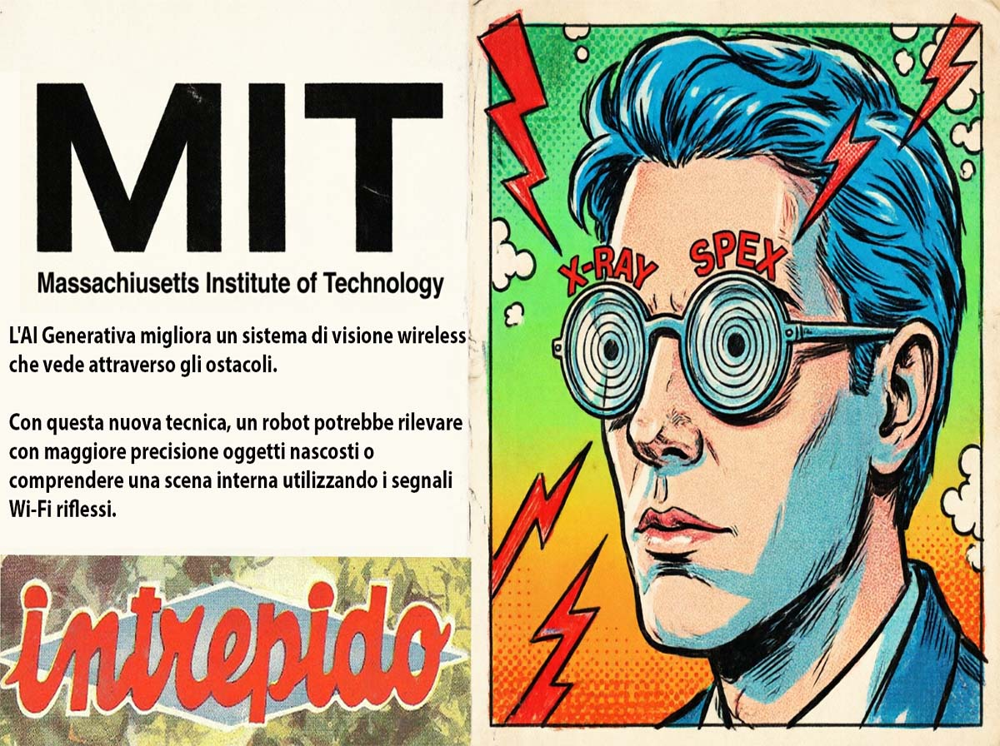
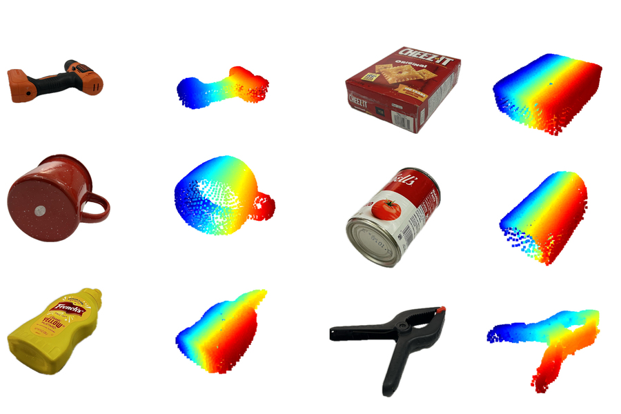
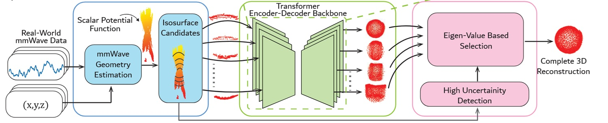
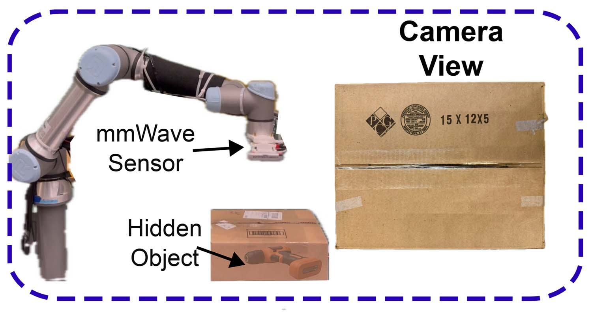

# MIT Fulfills the Promise of X-Ray Glasses

*Anyone who was a teenager between the late 70s and early 80s well remembers that feeling that came while flipping through the last pages of *L'Intrepido* or *Lanciostory*: amidst the advertisements for ballpoint pens and correspondence drawing courses, an ad stood out promising the impossible. X-ray glasses. Real ones. For a few lire, shipping included. The promise was crystal clear: wear them and you will see through anything. Walls, boxes, clothes. The reality, as every teenager who gave in to temptation bitterly discovered, was much more prosaic: a card with a curious optical effect based on light diffraction, capable at most of making one's own hand look transparent. A scam worthy of Totò, a cheap illusion.*

That dream, however, never really disappeared. It just moved to research laboratories, where for decades engineers and physicists have sought concrete ways to see what human eyes cannot reach. And on March 19, 2026, [MIT published](https://news.mit.edu/2026/generative-ai-improves-wireless-vision-system-sees-through-obstructions-0319) the results of research that, without exaggeration, represents the most convincing step towards that 1980s hoax promise: a system capable of reconstructing hidden objects and entire environments using reflected radio signals, guided by generative artificial intelligence models. No cardboard glasses this time. Two papers accepted at the IEEE CVPR conference, one of the world's most authoritative forums in the field of computer vision, and a laboratory that for over a decade has been accumulating results once considered impossible.

## The Physical Problem That Kept Everything on Standby for Twenty Years

To understand why this research is relevant, one must take a step back and face a matter of honest physics. Millimeter waves, or mmWave, are radio signals with very high frequency, the same ones used in the latest generation Wi-Fi networks and automotive radars. They have a very useful property: they pass relatively easily through common materials such as cardboard, plastic, wood, and drywall. This makes them, in theory, perfect for "seeing" what is on the other side of a wall or hidden under a pile of objects.

The problem is different, and it has a precise technical name: specularity, or specular reflection. When a millimeter wave hits a surface, it tends to bounce in only one direction, like light on a mirror. This means that the sensor can only capture a limited portion of the surface of the hidden object: typically the highest part, the one that reflects the signal directly back to the receiver. The underside, the sides, the inclined surfaces: all invisible. Like trying to reconstruct the shape of a sculpture by touching it with only one finger, always from the same angle.

Researchers from the [Signal Kinetics group](https://www.media.mit.edu/groups/signal-kinetics/overview/) at the MIT Media Lab had already achieved significant results in this field. In the summer of 2025, they presented mmNorm, a system capable of estimating the surface normals of hidden objects, winning the Best Paper Runner-up and the Best Poster Award at ACM MobiSys. But the specularity problem remained a glass ceiling: reconstructions were partial, precise where the signal reached, blind elsewhere. Something qualitatively different was needed for the next leap.

## Wave-Former: When AI Learns to Imagine What It Doesn't See

The solution the team found is, thinking about it, elegant in its logic: if the physical sensor cannot collect enough data to reconstruct the entire shape of an object, you train a generative artificial intelligence model to *imagine* the missing parts. Not an arbitrary invention, but a physics-guided inference: the system knows how millimeter waves behave, knows the properties of specular reflection, and learns to complete the plausible shape of an object starting from a partial reconstruction.

The system is called Wave-Former, and it works in three phases. First, it builds a partial reconstruction of the hidden object starting from the reflected mmWave signals. Then, it passes this incomplete reconstruction to a generative model, which proposes what the complete shape could look like. Finally, it iteratively refines the surfaces until a coherent final reconstruction is obtained.

The most interesting knot, from a technical point of view, is how the team solved the training problem. Generative artificial intelligence models work well when they have large amounts of training data available. GPT, Claude, Llama: they are all based on astronomically sized datasets. But there is no dataset large enough of mmWave scans of hidden objects, and building one from scratch would have required, as Maisy Lam, one of the researchers involved, explains, literally years of data collection. The team therefore adopted an indirect strategy: it took large existing computer vision datasets, those with millions of 3D images of common objects, and *transformed* them to simulate the physical properties of mmWave reflection, including specularity and the characteristic noise of these signals. A synthetic but physically accurate dataset, built with a process that directly incorporates wave physics into the training images.

The results are solid. Wave-Former was tested on about 70 everyday objects—cans, boxes, cutlery, fruit—hidden behind or under different materials: cardboard, wood, drywall, plastic, fabric. Compared to previous methods considered state-of-the-art, the system achieved an improvement of nearly 20% in reconstruction accuracy, measured with the Chamfer error metric, which quantifies how much the reconstructed shape deviates from the real one.

[Image from news.mit.edu](https://news.mit.edu/2026/generative-ai-improves-wireless-vision-system-sees-through-obstructions-0319)

## RISE: The Ghosts That Draw Rooms

The second system presented in the papers is called RISE, and it pushes the concept even further. Instead of reconstructing individual hidden objects, RISE reconstructs entire rooms, including all the furniture present, using a single fixed radar and without any sensor moving in the environment.

The mechanism it exploits is counterintuitive. When a person moves in a room, the mmWave waves emitted by the radar don't just bounce off the person: some waves reflected from the human figure then bounce off a wall or a piece of furniture, and only then reach the sensor. These secondary reflections, called "ghost" signals because they appear as shifted copies of the original source, are usually ignored or filtered as noise. They contain, however, precious information: since their position changes while the person moves, and since their path depends on the geometry of the room, by analyzing how they vary over time, it is possible to infer where walls and furniture are located.

The problem is that this direct inference produces very coarse and imprecise reconstructions. This is where the generative model intervenes: as in the case of Wave-Former, the system uses AI to take a coarse map of the environment and refine it until a credible representation of the room is obtained. RISE was validated on over 100 human trajectories recorded in real environments, with a single static radar. The improvement over previous methods is even more marked: the reconstructions are on average twice as precise as those obtainable with pre-existing techniques.

## The Laboratory of the Impossible and Its Founder

Behind these results is the [Signal Kinetics Group](https://www.media.mit.edu/groups/signal-kinetics/overview/), which Fadel Adib directs at the MIT Media Lab. Adib is a Lebanese-American researcher, graduated from the American University of Beirut with the highest GPA in the digitally recorded history of the university, then Master's and PhD at MIT. His doctoral thesis, which earned him the ACM SIGMOBILE Dissertation Award, was already about seeing through walls using Wi-Fi. From that work, Emerald Innovations was born, a startup whose devices are today used for remote health monitoring of thousands of patients.

Adib's curriculum is the type of list that is almost annoying for its density: among Forbes 30 Under 30, Technology Review's 35 Innovators Under 35, Sloan Research Fellowship, ACM SIGMOBILE Rockstar Award, ACM MobiCom Best Paper Award, ONR Young Investigator Award, and NSF CAREER Award, he also had the rather rare privilege of presenting his research to President Obama during the first White House Demo Day in 2015. The group he directs has produced, over the years, technologies ranging from battery-free underwater navigation to augmented reality headsets with X-ray vision, to heart rate detection through walls.

The two papers presented this week see Laura Dodds as the main co-author, an MIT Presidential Fellow and holder of the prize for the best MEng thesis in EECS at MIT. The working group also includes Maisy Lam, NSF GRFP Fellow, Waleed Akbar, Yibo Cheng, and former postdoc Kaichen Zhou, now lead author of the paper on RISE. Funding comes from NSF, MIT Media Lab, and Amazon.

[Image from arxiv.org](https://arxiv.org/pdf/2511.14152)

## From Warehouse to Operating Room: Concrete Applications

The leap from laboratory reconstructions to real-world applications is shorter than one might imagine. The researchers themselves cite two priority scenarios, and in both cases, the logic is compelling.

In the context of logistics and automated warehouses, the ability to verify the content of a closed box without opening it is a direct and measurable economic value. Today, a significant share of e-commerce returns is generated by packaging errors: wrong product, missing product, damaged product not visible from the outside. A robot equipped with a system like Wave-Former could verify the content of every box before shipping, drastically reducing these errors. Amazon, among the funders of the research, clearly has interest in this direction.

In the domestic and service robotics context, RISE opens another possibility: a robot that "knows" where furniture and people are in the room, without needing cameras. The privacy advantage over camera-based systems is anything but trivial: mmWave signals do not capture visual images of people, but only their approximate position and the environment's profile. A home assistance system for the elderly that works without recording video is a commercially and ethically much more acceptable product than one that installs cameras in every room.

In the medical field, the prospects are even more ambitious but also further from immediate application. The possibility of obtaining images through opaque surfaces with relatively cheap hardware could one day complement or support imaging techniques like ultrasound in contexts where access to sophisticated machinery is limited.

## The Flip Side: Surveillance, Privacy, and Those Left Behind

So far, the story of technical progress in its optimistic version. But it would be dishonest to stop here, because a technology capable of reconstructing environments and objects through walls brings uncomfortable questions that researchers' goodwill alone cannot resolve.

The distinction between "detecting a person's position" and "surveilling a person" is much subtler than it seems. The RISE system, in its current form, needs a human being moving in the room to function as an environmental mapper. But the fact that the person's position is used as a "probe" for the environment does not mean that that position is not recorded. A system that knows where you are in your house, even without cameras, is already a surveillance system to the extent that someone has access to those data.

Comparison with GDPR and the European AI Act is inevitable, and the contours are not yet defined. European privacy regulations are built around the concept of "personal data," which explicitly includes information related to the position of an identifiable person. A radio signal that localizes someone in their own home likely falls into this category, meaning any commercial product based on these principles will need to obtain explicit and documented informed consent. The AI Act, approved in 2024, introduces further constraints on "remote biometric identification" systems, a category these systems could fall into if used to identify and track people in public spaces.

The most concrete short-term risk is not the government spying on citizens through the walls of their homes—a dystopian regime scenario that requires extraordinary resources and motivations. The more immediate risk is that of unauthorized use at a small scale: a landlord who installs a sensor to monitor tenants, an employer who tracks employees' movements in offices, a violent partner who wants to know where the other person is at all times. The history of surveillance technology teaches that the most dangerous uses are never those imagined by researchers during development.

There is then a question of technological power distribution that deserves attention. Advanced sensing technologies tend to spread first among those who already have resources: law enforcement, large companies, states with high technological capacity. If regulation does not keep pace with diffusion, a period of potentially very problematic information asymmetry is created, in which some actors can "see" without being seen. The gap between countries with strong regulatory capacity, like the European Union, and countries where these protections are absent risks translating into a concrete disparity in the protections citizens can expect.

[Image from arxiv.org](https://arxiv.org/pdf/2511.14152)

## Towards the Wireless "Foundation Model"

MIT researchers are not stopping at current results. Adib has explicitly stated that the long-term goal is to build foundational models for wireless signals, similar to what GPT, Claude, and Gemini represent for language and images. A model trained on a huge variety of radio signals, capable of understanding and interpreting reflections from environments, objects, and human bodies with a generality and flexibility current systems lack.

This prospect is both fascinating and dizzying. Foundational models for language have demonstrated emergent capabilities—behaviors that were not explicitly programmed but emerged from the scale and diversity of training. A similar model for the wireless domain could develop environmental perception capabilities we cannot even imagine today. It could also, like language models, prove difficult to interpret, control, and limit to specific uses.

The competitive context in which this research moves is lively. Alternative approaches exist based on Wi-Fi CSI (Channel State Information), which uses variations in Wi-Fi channel characteristics to infer the presence and movement of people, and military-type through-wall radars—much more expensive and invasive systems used by special forces in operational contexts. Adib's group research stands out for its focus on relatively cheap hardware, signals already present in the environment, and increasingly sophisticated processing techniques. The startup Cartesian Systems, co-founded by Adib, seems oriented towards bringing these technologies to commercial applications, although specific product details are not yet public.

## X-Ray Glasses, Finally

There is something circular, and vaguely moving, in the fact that technology has taken fifty years to fulfill a promise made on glossy paper to a boy with 7,200 lire in his pocket. *L'Intrepido* glasses were a scam, but they were also a symptom: augmented perception, seeing beyond the visible, is a desire so rooted in the human imagination that it resists any disillusionment.

Wave-Former and RISE are not commercial products, they are not ready for the market, and they are not without technical limits and unresolved ethical implications. They are, however, something more solid than a promise: they are replicable, measurable results presented to the international scientific community. The qualitative leap introduced by generative artificial intelligence, the ability to *complete* what physics alone cannot see, is genuine.

The question that remains open is not technical. It is the question that has accompanied every perception technology since surveillance existed: who has the right to see what, and with what authorization? MIT has built an extraordinary tool. It is up to legislators, companies, and citizens to decide in what world to use it. Because this time, unlike the cardboard glasses, it really works.
