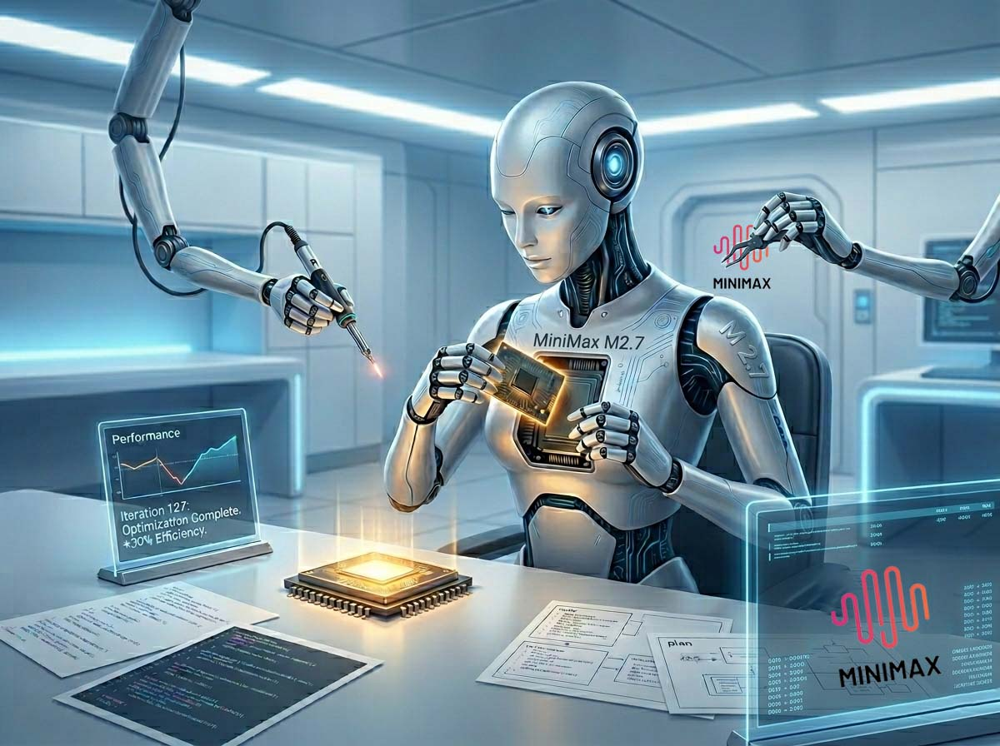
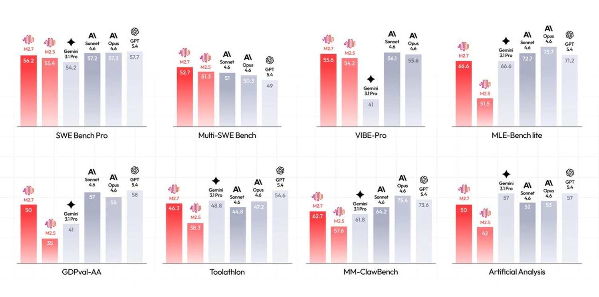
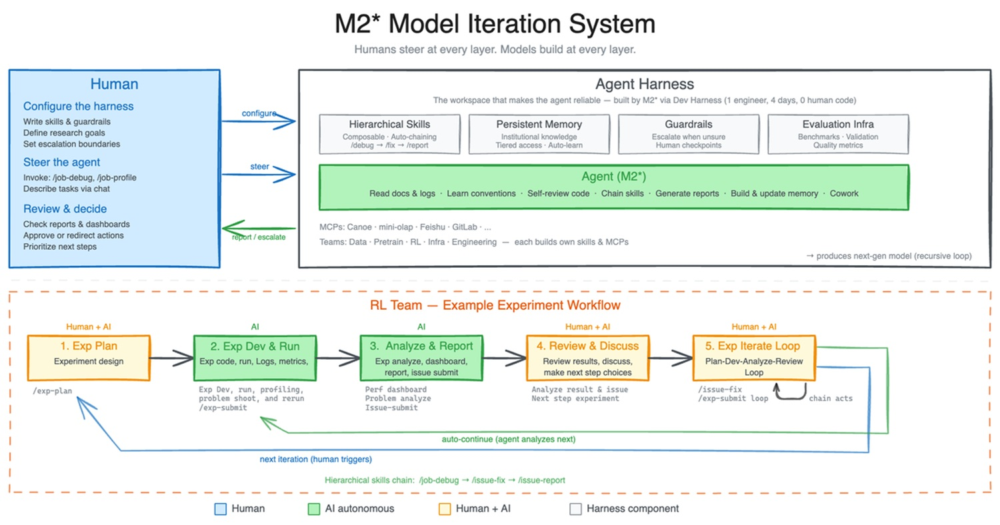

# MiniMax M2.7: l'AI che impara da sé stessa (quasi)

*Un mese. È il tempo che separa M2.5 da M2.7, la nuova versione del modello di MiniMax rilasciata il 18 marzo 2026. In un settore dove i cicli di sviluppo si misuravano in anni e poi in mesi, poche settimane sono diventate il nuovo intervallo normale. Ma questa volta la distanza temporale è solo il dettaglio meno interessante.*

Appena un mese fa, sul magazine di Codemotion, [ho analizzato MiniMax M2.5](https://www.codemotion.com/magazine/it/intelligenza-artificiale/minimax-m2-5-costi-bassi-prestazioni/): un modello con architettura a esperti misti da 230 miliardi di parametri totali, capace di attivarne solo 10 miliardi per query, con prestazioni su SWE-Bench Verified (80,2%) praticamente identiche a Claude Opus 4.6 (80,8%) a un ventesimo del prezzo. La proposta era semplice quanto destabilizzante: qualità da frontiera a costi accessibili, con una "mentalità da architetto" che emergeva spontaneamente durante il training su oltre 200.000 ambienti reali. MiniMax, startup di Shanghai quotata a Hong Kong con una capitalizzazione post-IPO intorno ai 13 miliardi di dollari, aveva già ridisegnato il rapporto qualità-prezzo nell'AI per il codice.

M2.7 non è una risposta a una debolezza di M2.5. È qualcosa di diverso: un tentativo dichiarato di cambiare il modo in cui un modello viene sviluppato, non solo cosa produce. La parola chiave che MiniMax ha scelto per comunicarlo è *self-evolution*, auto-evoluzione. È una parola affascinante, evocativa, e potenzialmente fuorviante. Vale la pena capire esattamente cosa significa, e soprattutto cosa non significa.

## Il modello che aiuta a costruire il modello successivo

Per capire cosa è davvero successo con M2.7, bisogna partire da un'immagine concreta. Nel team di ricerca di MiniMax, i ricercatori che lavorano al reinforcement learning (l'addestramento tramite ricompense e penalità) gestiscono cicli sperimentali lunghi e complessi: idee da testare, dati da preparare, esperimenti da lanciare, risultati da analizzare, codice da correggere, nuovi esperimenti da configurare. È un lavoro che normalmente richiede la collaborazione tra più persone di team diversi.

[Secondo la documentazione ufficiale di MiniMax](https://www.minimax.io/news/minimax-m27-en), una versione interna di M2.7 è stata messa al lavoro proprio su questo ciclo: il modello aiutava nella revisione della letteratura, preparava pipeline di dati, lanciava esperimenti, monitorava i log, debuggava errori, analizzava metriche, apriva merge request, eseguiva smoke test. I ricercatori umani intervenivano solo per le decisioni critiche e le discussioni strategiche. In questo contesto, MiniMax stima che M2.7 sia riuscito a gestire autonomamente il 30-50% del flusso di lavoro del team RL.

Ma c'è un secondo livello, più radicale. MiniMax ha chiesto a M2.7 di ottimizzare autonomamente le performance di un modello su uno scaffold interno di programmazione. Il processo era interamente automatizzato: il sistema eseguiva un ciclo iterativo di analisi delle traiettorie di fallimento, pianificazione di modifiche, alterazione del codice dello scaffold, esecuzione di valutazioni, confronto dei risultati, decisione di mantenere o annullare i cambiamenti. Questo ciclo si è ripetuto per oltre 100 iterazioni consecutive. Il risultato dichiarato da MiniMax è un miglioramento del 30% delle performance sugli evaluation set interni. Le ottimizzazioni trovate autonomamente dal modello includevano la ricerca sistematica della combinazione ottimale di parametri di campionamento come temperatura, frequency penalty e presence penalty, la progettazione di linee guida di workflow più specifiche (per esempio, cercare automaticamente pattern di bug simili in altri file dopo una correzione), e l'aggiunta di meccanismi di rilevamento dei loop all'interno del ciclo agentico.

Questo è il nucleo tecnico dell'auto-evoluzione di M2.7. Non è un modello che si riscrive da zero, non è coscienza artificiale, non è un'entità che decide autonomamente dove migliorare. È un agente che ottimizza una funzione obiettivo predefinita, in un ambiente controllato, su un problema specifico, con regole stabilite da ingegneri umani. La differenza rispetto al passato è la velocità e la scala di questa ottimizzazione: centinaia di cicli in poche ore, laddove un team umano avrebbe impiegato settimane.

Vale anche la pena fare un passo indietro e notare che MiniMax non è la prima organizzazione a esplorare questo territorio. Nel maggio 2025, Google DeepMind aveva presentato [AlphaEvolve](https://deepmind.google/blog/alphaevolve-a-gemini-powered-coding-agent-for-designing-advanced-algorithms/), un agente evolutivo basato su Gemini che usava un ciclo automatizzato di generazione, valutazione e selezione di algoritmi. AlphaEvolve aveva migliorato l'efficienza dei data center di Google (recuperando in media lo 0,7% delle risorse computazionali globali), accelerato il training di Gemini stesso del 23% su un kernel critico, e persino risolto un problema aperto nell'algoritmo di moltiplicazione di matrici rimasto invariato dall'era di Strassen nel 1969. L'approccio era però fondamentalmente diverso: AlphaEvolve si concentrava sull'ottimizzazione di algoritmi specifici, valutabili con metriche oggettive. M2.7 tenta qualcosa di più ampio, applicando la logica dell'auto-miglioramento a un intero ciclo di ricerca in ML, con strumenti, memoria persistente e collaborazione tra agenti. Le famiglie di approcci sono imparentate, non identiche.

## Self-evolution: quanto è vero davvero?

La narrazione pubblica intorno a M2.7 ha rapidamente gravitato verso il frame dell'"AI che si evolve da sola", con video che accumulano milioni di visualizzazioni e post che dipingono scenari da fantascienza. È il momento giusto per mettere i piedi per terra.

La percentuale di auto-ottimizzazione che MiniMax cita, quel 30-50% del workflow gestito autonomamente nel contesto del team RL, si riferisce a un contesto specifico e controllato: un team interno, con strumenti predefiniti, obiettivi chiari, infrastrutture progettate appositamente. Non è un numero che si trasferisce automaticamente ad altri contesti. Il restante 50-70% del lavoro restava in mano ai ricercatori umani, che prendevano le decisioni strategiche, valutavano la direzione degli esperimenti, e soprattutto definivano cosa significasse "miglioramento".

Un punto critico che la comunicazione di MiniMax lascia volutamente in penombra è l'architettura di controllo. Quali azioni può eseguire autonomamente l'agente? Può modificare il codice di produzione senza approvazione umana? Può lanciare esperimenti con costi computazionali arbitrari? Come si prevengono loop dannosi, regressioni silenti o comportamenti emergenti indesiderati? Il comunicato ufficiale menziona che l'agente "decide di mantenere o annullare i cambiamenti" in base ai risultati degli evaluation set, ma non descrive i guardrail che impediscono al sistema di convergere verso falsi ottimi o di ottimizzare proxy che non corrispondono agli obiettivi reali.

L'assenza di un technical report in stile arXiv, con dettagli su architettura, dimensioni del modello, data mix e strategie di training, è un limite oggettivo per chiunque voglia fare un'analisi indipendente. MiniMax ha pubblicato documentazione tecnica e il repository del progetto agentico [OpenRoom](https://github.com/MiniMax-AI/OpenRoom), ma i dettagli sulla pipeline di self-evolution restano proprietari. In un settore dove la verificabilità è il fondamento della fiducia scientifica, questa opacità è una scelta con conseguenze precise: rende impossibile distinguere, dall'esterno, i claim verificabili da quelli che restano nel dominio del marketing.

## Benchmark: cosa dicono i numeri (e cosa non dicono)

Sui benchmark dichiarati da MiniMax, i dati meritano una lettura attenta. Su [SWE-Pro](https://www.minimax.io/news/minimax-m27-en), che valuta capacità di ingegneria del software su problemi reali multi-linguaggio, M2.7 raggiunge il 56,22%, avvicinandosi al livello di Opus 4.6. Su VIBE-Pro, benchmark per la consegna di progetti completi end-to-end (web, Android, iOS, simulazioni), il punteggio è 55,6%. Su Terminal Bench 2, che misura la comprensione profonda di sistemi ingegneristici complessi, M2.7 arriva al 57,0%. Su GDPval-AA, la valutazione della capacità di consegna di task professionali in domini come finanza, diritto e lavoro d'ufficio, M2.7 ottiene un ELO di 1495, il più alto tra i modelli open-source, secondo solo a Opus 4.6, Sonnet 4.6 e GPT-5.4 tra tutti i modelli testati.

Dove i dati indipendenti diventano più interessanti è nel report di [Kilo](https://blog.kilo.ai/p/minimax-m27), piattaforma di coding agentico che ha testato M2.7 su due benchmark propri. Su PinchBench, il benchmark per task standard di agenti OpenClaw, M2.7 ottiene 86,2%, posizionandosi 5° su 50 modelli testati, a meno di 1,2 punti da Claude Opus 4.6 (87,4%). Il salto rispetto a M2.5 (82,5%) è di 3,7 punti, sufficiente a spostarlo dalla fascia media alla fascia alta della classifica. Su Kilo Bench, 89 task di coding autonomo su tutto lo spettro, dalle operazioni git alla crittanalisi differenziale, dall'emulazione MIPS all'automazione QEMU, M2.7 ha superato il 47% dei task, secondo solo a Qwen3.5-plus (49%).

Il dato più interessante emerso da Kilo Bench non è però il pass rate grezzo, ma il profilo comportamentale. M2.7 tende a leggere estensivamente il codice circostante prima di scrivere: analizza dipendenze, traccia call chain, raccoglie contesto da file correlati. Questo approccio "da investigatore" paga su task che richiedono comprensione sistemica profonda, Kilo cita come esempio un task SPARQL dove il modello ha correttamente identificato che un filtro sui paesi UE era un criterio di eligibility, non un filtro sull'output, una distinzione di ragionamento sottile che gli altri modelli testati hanno mancato. Ma la stessa tendenza all'over-exploration causa timeout su task dove la velocità conta più della profondità: la durata mediana di un task per M2.7 è di 355 secondi, superiore ai suoi predecessori. Il costo in token è proporzionalmente più alto: circa 2,8 milioni di token in input per trial su Kilo Bench, il valore più alto tra i modelli testati.

Le voci dall'esperienza pratica aggiungono un'altra dimensione. Nei commenti al report di Kilo, un utente descrive esperienze molto deludenti con M2.7 su task di migrazione, lamentando che il modello tendesse a creare componenti UI fittizi invece di migrare elementi esistenti, a inserire commenti TODO ignorandoli poi completamente, e a rifiutarsi di continuare migrazioni a metà processo. Lo stesso utente riferisce risultati nettamente superiori con GPT-5.3-Codex, Claude 4.6 e GLM-5 sugli stessi task. Non è un campione statisticamente rappresentativo, ma è un segnale che il profilo comportamentale di M2.7, forte su comprensione sistemica e ragionamento contestuale, potenzialmente fragile su esecuzione disciplinata di piani strutturati, non si adatta ugualmente bene a tutti gli scenari di sviluppo.

[Immagine tratta da minimax.io](https://www.minimax.io/news/minimax-m27-en)

## Sviluppatori e knowledge worker: chi ci guadagna

La promessa operativa più concreta di M2.7 è nella diagnostica di produzione. Il comunicato ufficiale descrive scenari di debugging in ambienti live dove il modello correlava metriche di monitoraggio con timeline di deployment, eseguiva analisi statistica su trace sampling, si connetteva autonomamente ai database per verificare ipotesi, identificava file di migrazione degli indici mancanti nel repository e proponeva soluzioni non bloccanti. MiniMax dichiara di aver ridotto in più occasioni il tempo di recovery per incidenti in produzione a meno di tre minuti, rispetto ai processi manuali tradizionali.

È un claim potente, e non inverosimile per chi conosce la diagnostica di sistemi distribuiti: gran parte del tempo in un incidente di produzione viene spesa a correlare informazioni che esistono già, in dashboard diverse, log diversi, repository diversi. Un agente che può navigare questi spazi autonomamente e costruire ipotesi causali coerenti è genuinamente utile. Il rischio speculare è l'"automation bias": la tendenza a fidarsi eccessivamente delle diagnosi generate dall'agente anche quando sono errate, specialmente in situazioni ad alta pressione dove il tempo per verificare è limitato. Un sistema che trova la causa giusta il 90% delle volte e sbaglia il 10% in modo silenzioso è più pericoloso di uno che sbaglia visibilmente.

Per i knowledge worker in finanza e altri domini professionali, M2.7 introduce capacità che meritano attenzione critica. Il caso dimostrativo mostrato da MiniMax riguarda un'analisi TSMC: partendo da report annuali e verbali delle earnings call, il modello costruisce autonomamente un modello di previsione dei ricavi, progetta le assunzioni, produce una presentazione PowerPoint basata su template e redige un report di equity research in Word. MiniMax riporta che i professionisti del settore hanno valutato l'output come utilizzabile come prima bozza da inserire direttamente nei flussi di lavoro successivi.

Questo tipo di applicazione, un agente che produce analisi finanziarie quasi autonomamente,— apre questioni regolamentari non banali. MiFID II richiede che i servizi di consulenza finanziaria siano forniti da soggetti autorizzati. Un'analisi prodotta da un agente AI e presentata a un cliente senza adeguata supervisione e disclosure può configurare violazioni normative. Chi risponde degli errori in un modello finanziario generato autonomamente? La risposta corretta è ancora "l'umano che ha deciso di usarlo e di presentarlo", ma la catena di responsabilità diventa più sottile man mano che il processo si automatizza.

## Il prezzo resta l'argomento più forte

Al di là di tutti i discorsi sull'auto-evoluzione, il dato che più concretamente posiziona M2.7 nel mercato è il costo. L'accesso API è disponibile a 0,30 dollari per milione di token in input e 1,20 dollari per milione di token in output per la versione standard, con una versione M2.7-highspeed che offre velocità superiore allo stesso prezzo grazie al cache automatico. Claude Opus 4.6 costa 15 dollari per milione di token in input e 75 dollari per milione di token in output. Il rapporto è, rispettivamente, 1:50 sull'input e 1:62,5 sull'output. Per applicazioni agentic che consumano decine di milioni di token per ciclo, la differenza è quella tra un esperimento fattibile e uno economicamente proibitivo.

Kilo sintetizza bene il posizionamento pratico: M2.7 è una scelta forte quando si lavora su task che premiano la raccolta profonda di contesto, refactoring complessi, modifiche che interessano l'intera codebase, analisi sistemiche. Per task time-sensitive e ben circoscritti, modelli più veloci e meno token-intensivi possono dare risultati migliori a costi inferiori. Non è un sostituto universale, è uno strumento con un profilo preciso.

[Immagine tratta da minimax.io](https://www.minimax.io/news/minimax-m27-en)

## OpenRoom e la nuova interfaccia dell'agente

Tra le novità che accompagnano M2.7 c'è [OpenRoom](https://www.openroom.ai/), un sistema di interazione basato su agenti che MiniMax ha reso open-source. OpenRoom libera l'interazione dal flusso di testo puro e la colloca in uno spazio GUI web interattivo: i personaggi non sono prompt statici ma entità con impostazioni persistenti che interagiscono attivamente con l'ambiente, generando feedback visivo in tempo reale. La maggior parte del codice è stata scritta dall'AI, precisano i developer notes del repository.

La direzione è chiara: MiniMax immagina agenti che abitano spazi, non solo rispondono a prompt. È una visione che ha implicazioni interessanti per gaming, creator economy e, su un piano più delicato, per la dinamica psicologica dell'interazione prolungata con entità artificiali con personalità persistenti. Il rischio di antropomorfizzazione e attaccamento emotivo verso questi sistemi è documentato dalla letteratura accademica almeno dal lavoro di Clifford Nass e Byron Reeves negli anni Novanta sulla "equazione dei media". Non è fantascienza, è psicologia dello sviluppo applicata a sistemi interattivi.

## Il nodo irrisolto: opacità, governance e narrativa culturale

C'è una tensione strutturale nel modo in cui M2.7 è stato presentato al mondo, una tensione che vale la pena nominare esplicitamente. MiniMax ha costruito una narrativa potente e memorabile intorno all'"AI che si evolve da sola", ma ha fornito pochissimi dettagli tecnici verificabili su come quella evoluzione venga governata. Non c'è un technical report pubblico. Non c'è una disclosure sui meccanismi di sicurezza dell'agente auto-ottimizzante. Non c'è una spiegazione di come si prevengono loop di ottimizzazione che convergono verso proxy errati o comportamenti emergenti indesiderati.

Questo non è necessariamente malafede: è la norma nel settore. OpenAI, Anthropic e Google non pubblicano technical report esaustivi su tutti i loro sistemi interni. Ma quando si rivendica esplicitamente che un modello "partecipa alla propria evoluzione" e gestisce autonomamente cicli di ricerca in ML, il livello di dettaglio atteso dalla comunità dovrebbe essere proporzionalmente più alto. La differenza tra un ciclo di ottimizzazione controllato e un sistema che scappa dagli obiettivi definiti dai suoi creatori è esattamente il tipo di dettaglio che un technical report dovrebbe chiarire.

Sul fronte della narrativa culturale, vale la pena notare come la stampa tech abbia amplificato l'aspetto dell'auto-evoluzione ben oltre quello che i dati giustificano. Il frame dell'"AI che si migliora da sola" è narrativamente potente perché richiama archetipi profondi, dalla creatura di Frankenstein al Golem della tradizione ebraica, passando per l'HAL 9000 di Kubrick, ma descrizioni accurate del fenomeno sono molto più prosaiche: un agente ben progettato che ottimizza una funzione su un task specifico in un ambiente controllato. La differenza tra le due descrizioni è la differenza tra letteratura e ingegneria. Entrambe sono utili, ma non sono la stessa cosa.

La questione regolamentare resta sullo sfondo ma non svanisce. L'AI Act europeo, nel suo framework attuale, classifica i sistemi AI ad alto rischio in base al loro dominio applicativo e al loro impatto potenziale. Un modello agentico che partecipa autonomamente a pipeline di training di altri modelli AI, o che produce analisi finanziarie con supervisione umana ridotta, si avvicina a categorie che l'AI Act tende a guardare con particolare attenzione. Come si inserisce M2.7 in questo framework è una domanda a cui nessuno ha ancora dato una risposta precisa, né MiniMax né i regolatori europei.

M2.7 è un modello genuinamente capace, con benchmark indipendenti che ne confermano la posizione nel gruppo di testa del panorama attuale, un prezzo che lo rende accessibile a progetti che i modelli di frontiera occidentali renderebbero proibitivi, e un approccio all'auto-ottimizzazione che è tecnicamente reale, anche se meno spettacolare di quanto la narrazione pubblica suggerisca. Il 30% di autonomia nel workflow RL interno è un risultato ingegneristico solido. Non è la nascita dell'AI cosciente. È qualcosa di più modesto e più interessante: un segnale che il ciclo di sviluppo dei modelli stessi sta iniziando a includere i modelli come partecipanti attivi, con tutto ciò che questo comporta in termini di velocità, scala, e necessità di nuovi strumenti di governance.

La domanda più rilevante che M2.7 lascia aperta non è "fino a dove può arrivare l'auto-evoluzione?", ma "chi decide cosa significa migliorare, e con quale trasparenza?". Finché quella domanda resta senza risposta pubblica e verificabile, ogni claim sull'AI che impara da sé stessa andrà letto con curiosità, rigore, e una sana dose di scetticismo metodologico.