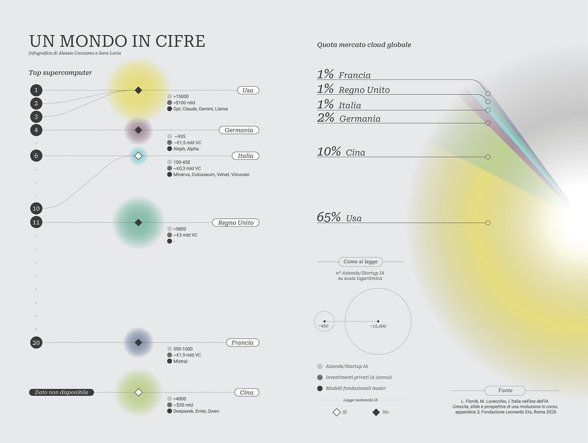
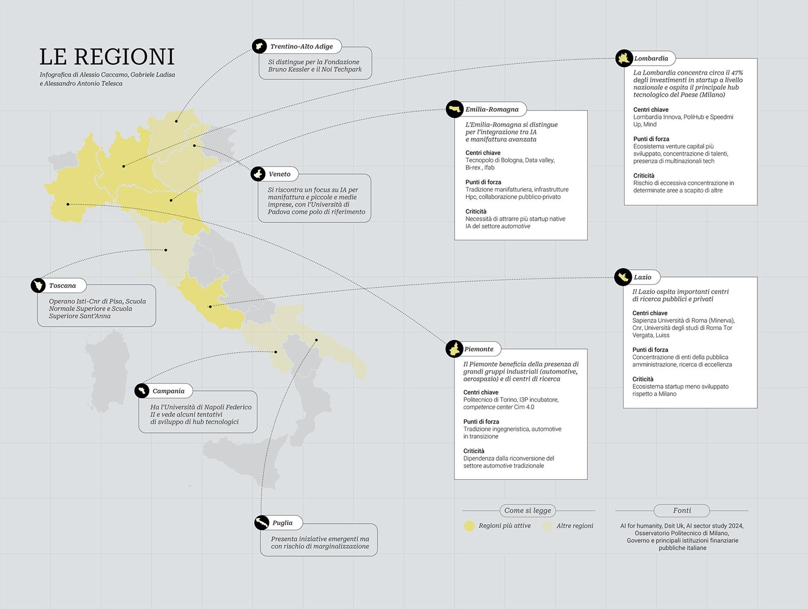

# Fondazione Leonardo: L'Italia nell'era dell'IA - Parte 1

*Il 19 marzo 2026, nella Sala della Regina della Camera dei Deputati, viene presentato un documento che si distingue nettamente dalla categoria dei rapporti istituzionali destinati a prendere polvere su qualche scaffale ministeriale. ["L'Italia nell'era dell'IA. Crescita, sfide e prospettive di una rivoluzione in corso"](https://www.fondazioneleonardo.com/sites/default/files/downloads/2026-03/REPORT-FLORIDI_web_0.pdf) nasce con un'ambizione dichiarata: non un esercizio speculativo, non un manifesto ottimista, ma una mappa operativa dello stato dell'intelligenza artificiale in Italia, con raccomandazioni corredate di indicatori misurabili, responsabilità istituzionali precise e analisi delle barriere all'implementazione. È, in senso letterale, quello che il titolo promette: una bussola.*

A firmarlo sono Luciano Floridi, Presidente della Fondazione Leonardo ETS e Direttore del Digital Ethics Center di Yale, e Micaela Lovecchio, che per la Fondazione si occupa di Education e Formazione. Floridi è una figura che il dibattito sull'etica digitale lo ha attraversato da protagonista per vent'anni, non da commentatore esterno, ed è proprio questa combinazione, rigore accademico con orientamento pragmatico, a caratterizzare l'impianto del lavoro. Nella prefazione, l'autore è esplicito sull'approccio: "Troppi rapporti restano lettera morta perché formulano obiettivi vaghi senza indicare chi deve fare cosa, entro quando e come si verificherà il successo. Abbiamo cercato di evitare questa trappola."

La Fondazione Leonardo ETS ha garantito indipendenza scientifica e ha coinvolto un ecosistema istituzionale di prim'ordine: CINECA, il progetto FAIR (Future Artificial Intelligence Research), l'Osservatorio Artificial Intelligence del Politecnico di Milano, AgID, l'Agenzia per la Cybersicurezza Nazionale, INPS, ISTAT, la Camera dei Deputati, il Senato, la Sapienza, il Politecnico di Torino, l'Istituto Italiano di Tecnologia, la Scuola Normale Superiore, insieme a campioni del settore privato come Bending Spoons, Domyn, Eni, Fastweb e Intesa Sanpaolo, e a startup come Datapizza, ASC27, Crossnection e Metis. Il risultato è un testo costruito su dati reali, non su proiezioni di marketing, organizzato in sei parti che procedono metodicamente dal contesto all'azione: analisi del mercato, asset e punti di forza, sfide e rischi, opportunità settoriali, raccomandazioni strategiche, meccanismi di monitoraggio.

Una nota metodologica è doverosa fin dall'inizio: gli autori stessi segnalano sistematicamente i limiti delle fonti, distinguendo tra rilevazioni statistiche ufficiali e stime di mercato, tra dati verificabili e inferenze qualitative. Le avvertenze che punteggiano il rapporto non sono una debolezza, ma una scelta di rigore che va tenuta presente in ogni lettura dei numeri che seguono.

## Il mercato accelera, ma a due velocità

Il punto di partenza è un dato che, letto senza contesto, suonerebbe da comunicato stampa trionfante: nel 2024, secondo l'Osservatorio Artificial Intelligence del Politecnico di Milano, il mercato italiano dell'intelligenza artificiale ha raggiunto 1,2 miliardi di euro, con una crescita del 58% rispetto all'anno precedente. Un numero che merita subito una precisazione: si riferisce alla spesa in software e servizi di IA, non all'intero ecosistema tecnologico, e non va confuso con le proiezioni commerciali di fornitori come Statista, che adottano perimetri più ampi e producono cifre significativamente superiori. L'obiettivo di policy fissato nel rapporto è raggiungere i 5 miliardi di euro entro il 2030: è un target di indirizzo politico, non una previsione economica, e la distinzione non è secondaria.

Sul versante dell'adozione, i dati ISTAT indicano che il 16,4% delle imprese con almeno dieci dipendenti adotta formalmente soluzioni di intelligenza artificiale nel 2025, raddoppiato rispetto all'8,2% dell'anno precedente. Il rapporto spiega questa accelerazione con una pluralità di cause: l'effetto di familiarizzazione collettiva prodotto da strumenti come ChatGPT, la maturazione di soluzioni pronte all'uso che non richiedono più sviluppo su misura, gli incentivi PNRR legati a Transizione 4.0, la chiarezza normativa introdotta dalla Legge 132/2025. C'è anche un fattore statistico da non trascurare, e gli autori lo segnalano con onestà: partire da una base bassa amplifica la variazione percentuale.

Il 16,4% italiano si colloca al di sotto della media europea, che secondo Eurostat ha raggiunto il 20% nel 2025. Germania al 26%, Francia al 19,5%, Spagna al 19,1%: l'Italia è al 18° posto nella classifica UE-27 per adozione, ma mostra una delle dinamiche di crescita più rapide del continente. Il dato sull'uso individuale è ancora più netto: solo il 19,9% dei cittadini italiani ha utilizzato strumenti di IA generativa nel 2025, tra i valori più bassi dell'Unione europea, anche se il rapporto invita alla cautela perché le rilevazioni in questo ambito non sono ancora pienamente armonizzate tra Paesi.

Il vero nodo strutturale è la distribuzione interna. Le imprese con oltre 250 dipendenti hanno raggiunto il 53,1% di adozione, più che raddoppiato rispetto al 32,5% dell'anno precedente. Le piccole e medie imprese si fermano al 15,7%. È quello che il rapporto chiama il "digital divide dimensionale", e le cause non si riducono alla formula generica di mancanza di competenze e costi elevati. Sono strutturali e multiple: i costi fissi di implementazione, dalla consulenza all'integrazione alla formazione, sono simili indipendentemente dalle dimensioni aziendali ma pesano proporzionalmente di più sul fatturato di una PMI; l'assenza di figure dedicate come CTO o data scientist rende l'intelligenza artificiale una priorità tra tante ugualmente pressanti; l'asimmetria informativa è elevata, con le PMI in difficoltà nel distinguere soluzioni valide dall'hype commerciale; in molte realtà mancano archivi di dati organizzati e di qualità adeguata. Poiché le PMI sono la spina dorsale del sistema produttivo italiano, il rapporto è netto: gli incentivi generici non bastano. Servono intermediari di fiducia come le associazioni di categoria e gli European Digital Innovation Hub, soluzioni preconfigurate per settori specifici, ambienti di sperimentazione a basso rischio.

[Immagine tratta da fondazioneleonardo.com](https://www.fondazioneleonardo.com/stories/Ia-italia-bussola-orientarsi)

## La triade del supercalcolo

Se c'è un asset in cui l'Italia non ha complessi di inferiorità in Europa, è l'infrastruttura di calcolo ad alte prestazioni. Il rapporto documenta quello che chiama la "triade del supercalcolo": nella classifica TOP500 di novembre 2025, due sistemi italiani occupano posizioni di eccellenza assoluta a livello continentale. HPC6, il supercomputer industriale di Eni, è al sesto posto mondiale e secondo in Europa con 477,9 PetaFLOPS di potenza reale (Rmax), con una potenza di picco di circa 606 PetaFLOPS. Leonardo, il sistema gestito dal CINECA a Bologna, è al decimo posto mondiale e quinto in Europa con 241,2 PetaFLOPS. A questi si aggiunge davinci-2 di Leonardo S.p.A., 123° nella classifica mondiale, con architettura HPE Cray XD670 equipaggiata con processori Intel Xeon Platinum 8568Y+ e acceleratori NVIDIA H200, per una potenza reale di 14,2 PetaFLOPS. L'Italia è l'unico Paese europeo con due sistemi nella top 5 del continente, combinando capacità pubblica e privata in un modo che non ha eguali.

La dimensione della sostenibilità energetica di questa infrastruttura non è un dettaglio accessorio: il supercomputer Leonardo di CINECA opera al 100% con energia rinnovabile e raggiunge un indicatore di efficienza PUE (Power Usage Effectiveness) prossimo a 1,1, dove 1,0 rappresenta il limite teorico perfetto e la media del settore si aggira attorno a 1,5. In un'epoca in cui il dibattito sull'impronta ambientale dell'intelligenza artificiale si fa sempre più urgente, ogni ciclo di addestramento di un grande modello linguistico consuma quantità significative di energia ed emette CO₂, e l'efficienza energetica smette di essere una virtù ambientale per diventare un vantaggio competitivo diretto. Il rapporto dedica una sezione specifica alla sostenibilità ambientale dell'intelligenza artificiale come criticità sistemica da gestire, e il fatto che le infrastrutture italiane siano già avanti su questo fronte significa anticipare vincoli regolatori che inevitabilmente arriveranno.

Il Progetto LISA, avviato nel maggio 2025, sta potenziando le partizioni GPU del supercomputer Leonardo specificamente per l'intelligenza artificiale generativa. Sul fronte dello sviluppo futuro, il progetto Colosseum di Domyn si propone un obiettivo ambizioso di 100 AI ExaFLOPS in calcolo a bassa precisione, mentre l'iniziativa IT4LIA AI Factory prevede 420 milioni di euro di investimento, cofinanziati in misura paritaria dal Governo italiano e dalla Commissione europea, per sviluppare competenze e costruire un ponte tra infrastruttura computazionale e capitale umano. Il Polo Strategico Nazionale risponde all'esigenza di cloud sovrano per il settore pubblico, ma la dipendenza dai grandi fornitori internazionali di servizi cloud resta una questione strategica aperta.

Il rapporto non si ferma alla celebrazione. C'è quello che Floridi chiama il paradosso della sovranità: possediamo i motori, ma la catena di fornitura dell'hardware resta dipendente dall'estero. NVIDIA detiene una quota stimata tra l'80% e il 95% del mercato degli acceleratori GPU per l'addestramento di modelli di intelligenza artificiale. Le restrizioni all'export verso la Cina hanno dimostrato che gli Stati Uniti sono disposti a usare l'hardware come leva geopolitica. La Germania, nel frattempo, ha attivato JUPITER, il primo sistema exascale europeo con un ExaFLOPS di potenza. La risposta strutturale passa per la partecipazione attiva allo European Chips Act e per il monitoraggio dello sviluppo di alternative europee agli acceleratori oggi dominati da un singolo fornitore.

## Parlare italiano: i modelli sovrani

Se i supercomputer sono la forza bruta, i modelli linguistici italiani sono qualcosa di più sottile: una questione di identità culturale, di precisione giuridica e di autonomia nell'era in cui le parole sono dati. Un modello addestrato prevalentemente su testi in inglese porta con sé bias culturali, lacune nella comprensione del contesto normativo italiano, imprecisioni nella lingua che per un medico o un giudice possono avere conseguenze concrete.

Il rapporto documenta un ecosistema di modelli linguistici italiani che non ha equivalenti in Europa per una lingua con circa 65 milioni di parlanti. Minerva, sviluppato dalla Sapienza NLP nell'ambito del progetto FAIR, è stato rilasciato nel 2024 con modelli da 350 milioni, 1 miliardo e 3 miliardi di parametri addestrati da zero su dati in lingua italiana, seguiti a novembre 2024 dal Minerva 7B con 7 miliardi di parametri. Velvet di Almawave, nella versione a 25 miliardi di parametri, è ottimizzato per 24 lingue europee e per settori regolamentati, addestrato interamente su infrastruttura italiana, con i dati che non lasciano il territorio nazionale. Italia di Domyn è un modello da 9 miliardi di parametri rilasciato con Open Weights nel luglio 2024. FastwebMIIA si basa sull'infrastruttura NeXXt AI Factory con 248 GPU H100. Vitruvian di ASC27 è orientato a contesti professionali e istituzionali critici. Colosseum 355B completa il quadro con la sua architettura a larga scala.

Una distinzione tecnica e politica fondamentale percorre tutto il rapporto: la maggior parte di questi modelli sono Open Weights, non Open Source nel senso pieno del termine. Un modello Open Weights rende pubblici i parametri addestrati, permettendo di ispezionarlo, scaricarlo e utilizzarlo localmente, ma non necessariamente condivide i dati di addestramento né il codice completo di training. Per la pubblica amministrazione e per i settori regolamentati questa distinzione è cruciale: l'ispezionabilità e la possibilità di eseguire il modello in ambienti controllati sono requisiti etici e legali imprescindibili che un modello proprietario chiuso non può soddisfare. La strategia open source e open weights per l'intelligenza artificiale italiana, a cui il rapporto dedica una sezione specifica, è presentata non come scelta ideologica ma come posizionamento strategico coerente con la vocazione del Paese verso un'intelligenza artificiale responsabile e verificabile.

[Immagine tratta da fondazioneleonardo.com](https://www.fondazioneleonardo.com/stories/Ia-italia-bussola-orientarsi)

## Legge 132: l'Italia prima in Europa

Nella corsa alla regolamentazione dell'intelligenza artificiale, l'Italia ha fatto una mossa inattesa per chi è abituato a considerare il Paese in ritardo cronico sulle infrastrutture normative. Il 10 ottobre 2025 è entrata in vigore la Legge 132/2025, che rende l'Italia il primo Stato membro dell'Unione europea a dotarsi di una legge organica sull'intelligenza artificiale, in anticipo rispetto all'applicazione piena dell'AI Act europeo, in vigore dall'agosto 2024 ma con applicazione progressiva. La legge italiana non si limita ad anticiparlo: lo affianca e lo integra con disposizioni specifiche per il contesto nazionale.

Il rapporto identifica tre pilastri strategici di particolare rilevanza. L'articolo 7 introduce un unicum globale imponendo l'obbligo di intelligenza artificiale inclusiva per le persone con disabilità, un requisito di accessibilità che nessun altro ordinamento aveva ancora codificato con questa esplicitezza. L'articolo 18 promuove partenariati pubblico-privati per la cyberdifesa, riconoscendo che la sicurezza dei sistemi di intelligenza artificiale non può essere delegata al solo settore pubblico. L'articolo 23 autorizza un fondo da 1 miliardo di euro destinato a intelligenza artificiale, cybersecurity e calcolo quantistico, con quest'ultimo che emerge nel rapporto come una delle prossime frontiere strategiche: la convergenza tra intelligenza artificiale e quantum computing potrebbe ridefinire le capacità di ottimizzazione, crittografia e simulazione scientifica nei settori di punta del Paese, e il rapporto la tratta come un orizzonte tecnologico su cui investire oggi per non inseguire domani.

Il vantaggio normativo può tradursi in vantaggio competitivo attraverso il meccanismo del compliance-by-design: le imprese che sviluppano soluzioni conformi sin dalla progettazione possono esportare nel mercato unico europeo prodotti già pre-certificati, riducendo il time-to-market rispetto ai concorrenti che devono adattare soluzioni nate in contesti normativi diversi. Il condizionale è però d'obbligo: il rapporto precisa che la concreta traduzione di questo primato in effettivo vantaggio dipenderà dall'efficace implementazione della legge. Senza i decreti attuativi, la certezza del diritto resta incompleta e il vantaggio competitivo rimane sulla carta. Al momento della pubblicazione, nessun altro Paese dell'UE risulta aver approvato un provvedimento analogo.

La percezione pubblica accompagna questo quadro normativo con segnali contrastanti. Secondo lo Special Eurobarometer 554 del 2024, il 55% dei cittadini europei si aspetta che l'intelligenza artificiale abbia un impatto positivo sulla vita quotidiana nei prossimi vent'anni, contro il 35% che ne prevede effetti negativi. In Italia, la fiducia nella pubblica amministrazione rimane generalmente tiepida, con solo il 9% degli italiani che dichiara piena fiducia nella PA. Ma un'indagine Salesforce e The European House – Ambrosetti del 2025 su un campione di 750 italiani mostra segnali di apertura specifici per i servizi digitali: il 58% si dichiara favorevole all'uso di agenti intelligenti per prenotare appuntamenti, quasi la metà li userebbe per richiedere o rinnovare licenze e permessi. È una disponibilità che cresce, anche se lentamente.

---

*Nella prossima puntata concluderemo l'analisi del report trattando: l'ecosistema privato, la pubblica amministrazione, il capitale umano, il posizionamento globale e la sfida è organizzativa.*
