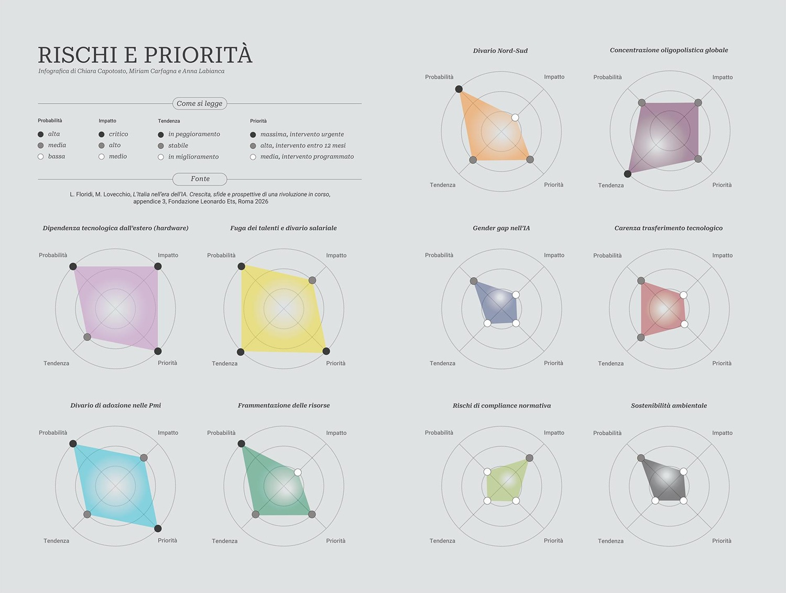

# Fondazione Leonardo: L'Italia nell'era dell'IA - Parte 2

*Nella prima puntata abbiamo mappato il sistema Italia nell'intelligenza artificiale: un mercato da 1,2 miliardi in forte crescita ma spaccato tra grandi imprese e PMI, due supercomputer tra i primi cinque in Europa, modelli linguistici sovrani unici nel continente e una legge sull'IA che fa dell'Italia il primo Paese UE ad averla. Eccellenze reali, con un paradosso al centro: hardware e cloud restano dipendenti dall'estero, e il vantaggio normativo vale solo se i decreti attuativi arrivano. In questa seconda puntata entriamo nel tessuto più concreto: le aziende, la pubblica amministrazione, i talenti che fuggono e la roadmap per il 2030.*

## L'ecosistema privato: verticalizzare per sopravvivere

Il settore privato italiano mostra dinamiche contrastanti che il rapporto analizza con la stessa precisione riservata al mercato. I campioni nazionali più visibili condividono tre caratteristiche: verticalizzazione competitiva in nicchie specifiche, attenzione al contesto italiano in termini di lingua e normativa, integrazione tra tecnologie di frontiera e competenze tradizionali.

Bending Spoons, valutata 11 miliardi di dollari dopo un aumento di capitale da 710 milioni guidato da investitori internazionali, non produce tecnologia di intelligenza artificiale: la usa come strumento per ottimizzare le piattaforme digitali acquisite. Il rapporto è preciso nella qualificazione: non è un'azienda che sviluppa IA, ma un operatore digitale ad alta intensità di IA che ha costruito il proprio successo nell'ottimizzazione di prodotti come Evernote e altre piattaforme acquisite. La distinzione conta per non confondere il successo industriale con la capacità di sviluppo tecnologico sovrano. Domyn, rinominata nel giugno 2025, ha raggiunto lo status di unicorno con una valutazione di circa 1,7 miliardi di euro, puntando sullo sviluppo tecnologico autonomo per settori regolamentati e sulla cooperazione internazionale, come dimostra la partnership con G42 degli Emirati Arabi Uniti. Intesa Sanpaolo, con il centro di ricerca CENTAI e il programma AIxeleration, ha esplorato applicazioni che spaziano dall'efficienza operativa all'equità algoritmica nel credito. Translated dimostra come l'automazione possa potenziare il lavoro qualificato invece di sostituirlo, con la traduzione neurale adattiva che si perfeziona grazie al feedback dei traduttori professionisti: una filosofia che incarna il principio di centralità umana che percorre tutto il rapporto.

Sul fronte biotech, i mega-round di AAVantgarde Bio (122 milioni di euro, Serie B nel 2024) e Nanophoria (83,5 milioni di euro, Serie A) posizionano l'Italia come hub emergente per la convergenza tra intelligenza artificiale e scienze della vita, una dimensione spesso trascurata nell'attenzione mediatica concentrata sull'IA generativa ma che rappresenta, secondo il rapporto, uno dei settori con il maggiore potenziale di crescita. Nel complesso, il rapporto di Confindustria ha raccolto per la prima volta oltre 240 casi d'uso dell'intelligenza artificiale già implementati e attivi in più di 70 aziende operanti in settori chiave, una documentazione sistematica che consente alle imprese di identificare applicazioni rilevanti e apprendere dalle esperienze altrui.

## La pubblica amministrazione come laboratorio

Uno degli aspetti meno celebrati ma più significativi documentati nel rapporto è il ruolo della pubblica amministrazione come laboratorio sperimentale di intelligenza artificiale responsabile. La Camera dei Deputati è tra le prime istituzioni parlamentari al mondo ad aver sviluppato sistemi basati su modelli linguistici per migliorare la gestione delle informazioni legislative: nel luglio 2025 ha presentato tre prototipi, Norma per l'analisi della produzione legislativa in linguaggio naturale, la Macchina Scrittura Emendamenti per assistere i deputati nella redazione, e Depuchat per permettere ai cittadini di interrogare le informazioni ufficiali sull'attività parlamentare. Il costo complessivo, circa 500 mila euro, è contenuto, ma il valore è ben oltre quello economico: l'Italia è tra i primi Paesi al mondo a sperimentare l'intelligenza artificiale per migliorare la trasparenza del processo democratico.

L'assistente virtuale dell'INPS per l'Assegno Unico Universale riduce i tempi di attesa garantendo tracciabilità e possibilità di passaggio a un operatore umano in ogni momento. Questi casi condividono un'enfasi sulla centralità dell'umano, sulla protezione dei dati e sull'inclusione che il rapporto presenta come un approccio distintivo italiano all'intelligenza artificiale pubblica. Non è un caso che il progetto FAIR sia esplicitamente citato tra le iniziative che incarnano questa filosofia. Il rapporto raccomanda la creazione di un repository nazionale dei casi d'uso della pubblica amministrazione, per scalare le esperienze di successo invece di lasciarle isolate nei singoli enti.

La distribuzione geografica di queste esperienze racconta però un Paese ancora profondamente asimmetrico. Milano concentra circa il 47% delle operazioni di investimento nelle startup a livello nazionale. L'Emilia-Romagna, con il Tecnopolo di Bologna e l'ecosistema costruito attorno al supercomputer Leonardo, mostra come l'integrazione tra infrastrutture, competenze locali e solidità amministrativa possa generare soluzioni scalabili: è il modello che il rapporto indica come riferimento per le strategie regionali. Il Mezzogiorno resta in gran parte ai margini di questa trasformazione, e il rapporto propone spoke dedicati nel Sud e programmi di scambio bidirezionali tra le istituzioni del Nord e quelle meridionali come risposta strutturale a un divario che, se non affrontato, rischia di diventare permanente.

## Il capitale umano che fugge

Supercomputer di classe mondiale, modelli linguistici sovrani, una legge d'avanguardia, una pubblica amministrazione che sperimenta. E poi c'è il dato che ridimensiona l'ottimismo con la precisione di un termometro: un divario salariale del 40-50% rispetto a Germania e Regno Unito nel settore dell'intelligenza artificiale. Un ingegnere specializzato guadagna in Italia tra i 30 e i 35 mila euro all'anno, contro i 55-60 mila della Germania. Nessun appello all'orgoglio nazionale ferma una carriera quando la differenza è questa, e il rapporto non si illude che possa farlo.

Il fenomeno è analizzato come una "leaky pipeline" che non riguarda solo i salari. L'hub di Milano mostra una presenza femminile del 30,7% nell'ecosistema tech, un dato relativamente positivo per gli standard del settore, ma le donne occupano meno del 14% dei ruoli apicali a livello globale. La pipeline perde pezzi a ogni livello gerarchico, e nessuna strategia di inclusione si dimostra efficace se non affronta le cause strutturali dell'abbandono, che il rapporto identifica in ostacoli culturali, mancanza di modelli di riferimento e assenza di politiche di flessibilità nei contesti lavorativi più competitivi.

Le barriere per chi vorrebbe tornare in Italia dall'estero sono altrettanto documentate. Il regime fiscale degli impatriati, ovvero coloro che hanno lavorato o studiato all'estero per un certo numero di anni, previsto attualmente per cinque anni, è insufficiente a competere con gli incentivi tedeschi e britannici che si estendono su orizzonti temporali più lunghi. Il rapporto raccomanda l'estensione a dieci anni specificamente per i profili specializzati in intelligenza artificiale, citando la Bending Spoons Fellowship, che garantisce 50 mila euro all'anno a dieci studenti selezionati, come esempio virtuoso del settore privato che però non può sostituire misure strutturali pubbliche.

Il problema del capitale umano ha radici profonde nel sistema formativo. Il rapporto dedica una sezione specifica all'istruzione a tutti i livelli: solo il 33% dei docenti italiani si sente preparato a insegnare competenze digitali, e l'alfabetizzazione dei cittadini, non solo degli specialisti, rimane una criticità seria. Tra le imprese che hanno valutato l'adozione senza implementarla, il 59% indica la mancanza di competenze interne come barriera principale, seguita dall'incertezza normativa al 47,3% e dai problemi di qualità dei dati al 45,2%. Il Programma Nazionale di Dottorato in Intelligenza Artificiale, con 318 dottorandi finanziati dal 2021, è uno degli investimenti strutturali nel capitale umano di lungo termine, ma l'orizzonte della formazione specialistica non basta: serve alfabetizzazione diffusa, dalla scuola primaria alla formazione professionale, per costruire la capacità collettiva di valutare, usare e governare consapevolmente i sistemi di intelligenza artificiale.

[Immagine tratta da fondazioneleonardo.com](https://www.fondazioneleonardo.com/stories/Ia-italia-bussola-orientarsi)

## Il posizionamento globale: differenziarsi, non inseguire

L'Italia non può competere frontalmente con gli Stati Uniti e la Cina nei livelli fondazionali dell'ecosistema dell'intelligenza artificiale, e il rapporto non lo nasconde. Gli USA mantengono una leadership schiacciante con investimenti privati annui superiori ai 100 miliardi di dollari e il controllo dell'intera catena tecnologica: hardware con NVIDIA che domina il mercato degli acceleratori, cloud con AWS, Azure e Google Cloud, modelli fondazionali con OpenAI, Anthropic, Google e Meta, e piattaforme applicative. La dipendenza italiana da queste piattaforme è strutturale e non eliminabile nel breve termine: la strategia deve accettare questa realtà e concentrarsi su minimizzare i rischi, catturare valore nelle applicazioni verticali e costruire capacità autonome in nicchie specifiche. La Cina compete con massicci investimenti statali, un ecosistema applicativo che conta oltre un miliardo di utenti generatori di dati, e progressi significativi nonostante le restrizioni hardware imposte dagli USA, come dimostrano DeepSeek, Baidu ERNIE e Alibaba Qwen.

La strategia documentata nel rapporto è quella della differenziazione, non della competizione diretta. Le aree prioritarie sono l'intelligenza artificiale responsabile e human-centered supportata dal vantaggio normativo, le applicazioni verticali nei settori di eccellenza italiana come manifattura di precisione, agroalimentare, patrimonio culturale e sanità, la sovranità linguistica e culturale con modelli ottimizzati per l'italiano e il contesto mediterraneo, e l'intelligenza artificiale per la sostenibilità, dalla transizione energetica all'agricoltura rigenerativa.

Il rapporto analizza anche i modelli dell'Asia-Pacifico come riferimenti parzialmente trasferibili. Il Giappone eccelle nell'integrazione tra intelligenza artificiale e robotica industriale, con il programma Society 5.0 che offre un framework per l'IA human-centered che risuona con l'approccio italiano. La Corea del Sud integra massicciamente l'intelligenza artificiale nei semiconduttori e nell'automotive. Singapore si è posizionata come hub regionale attraverso una regolamentazione favorevole e l'attrazione di talenti globali. Israele rappresenta un caso unico di densità di startup IA rispetto alla popolazione, con un modello che non è direttamente replicabile, diverso contesto geopolitico e cultura imprenditoriale, ma offre spunti su meccanismi di trasferimento tecnologico e connessione con la diaspora internazionale.

Il confronto europeo più rilevante riguarda Francia e Germania. Mistral AI ha raggiunto una valutazione di 11,7 miliardi di euro post-money nel settembre 2025 dopo un round da 1,7 miliardi guidato da ASML, un confronto che rende evidente la diversa scala dei campioni nazionali. Sul supercalcolo e sul quadro normativo, il primato italiano è reale e documentato. Sulla dimensione complessiva del mercato e sull'ecosistema delle startup, il divario è altrettanto reale.

La cooperazione internazionale nell'AI Safety è l'ambito in cui il primato normativo si traduce anche in peso negoziale. L'Italia partecipa attivamente ai processi del G7 e alle iniziative europee di AI Safety, dal Seoul AI Safety Summit del 2024 in poi, contribuendo alla definizione di standard che poi vincolano anche le scelte domestiche delle imprese. È una partecipazione che non è solo diplomatica: gli standard internazionali di sicurezza per i sistemi di intelligenza artificiale sono anche una barriera all'ingresso per i competitor che non li rispettano, e l'Italia ha interesse a renderli il più possibile coerenti con il proprio quadro normativo interno.

## La sfida è organizzativa

Il rapporto formula diciotto raccomandazioni strategiche operative, ciascuna con KPI misurabili, responsabilità istituzionali assegnate e analisi delle barriere all'implementazione. Alcune priorità emergono con urgenza per il breve termine.

L'emanazione dei decreti attuativi della Legge 132/2025 entro aprile 2026 è identificata come la priorità assoluta: senza le linee guida operative, la certezza del diritto resta incompleta e il vantaggio normativo non si converte in vantaggio competitivo. La Presidenza del Consiglio dei Ministri è indicata come soggetto responsabile. L'operatività del fondo da 1 miliardo di euro dell'articolo 23 richiede la definizione dei criteri di allocazione per intelligenza artificiale, quantum computing e cybersecurity: le risorse esistono sulla carta, ma devono essere sbloccate con criteri chiari. Il potenziamento di CDP Venture Capital con un fondo dedicato di almeno 500 milioni di euro per le fasi seed è la leva per colmare il gap di capitalizzazione rispetto ai competitor europei, con MEF e CDP indicati come responsabili. L'estensione del regime fiscale degli impatriati da cinque a dieci anni per i profili specializzati in intelligenza artificiale, sotto la responsabilità del MEF, è la risposta strutturale al problema del divario salariale. Una strategia per ridurre la dipendenza hardware, sviluppata in coordinamento tra MIMIT e ACN nell'ambito dello European Chips Act, completa le priorità immediate.

Il rapporto introduce anche un allarme esplicito contro l'AI-washing: il rischio che finanziamenti pubblici vengano dispersi nella ridenominazione di sistemi legacy obsoleti spacciati per intelligenza artificiale. I fondi devono essere vincolati a KPI orientati ai risultati concreti, non all'adozione di etichette. Le risorse incrementali stimate per l'attuazione nel triennio 2026-2028 ammontano a una forchetta tra 800 milioni e 1,2 miliardi di euro: circa 500 milioni per il fondo di venture capital, 150 milioni per gli incentivi fiscali al rientro dei talenti, 100 milioni per il potenziamento dei Technology Transfer Office universitari, la quota rimanente per formazione, infrastrutture dati e coordinamento istituzionale.

Gli obiettivi sono articolati su tre orizzonti temporali con indicatori precisi. Per il 2028: crescita del mercato oltre i 2,5 miliardi di euro, adozione nelle PMI superiore al 30%, emissione dei decreti attuativi e operatività dei principali meccanismi di finanziamento. Per il 2030: mercato a 5 miliardi di euro, adozione complessiva tra il 65% e il 70%, posizionamento tra i primi dieci Paesi UE, riduzione del divario salariale di 25 punti percentuali, cinque unicorni IA italiani. Per il 2035: integrazione sistemica dell'intelligenza artificiale nel sistema produttivo, nella pubblica amministrazione e nell'istruzione, con l'Italia stabilmente nel Tier 1 europeo dell'intelligenza artificiale.

## Le carte ci sono, il gioco no

La metafora più onesta per descrivere la posizione italiana nell'intelligenza artificiale non è quella del ritardatario che insegue, né quella del primogenito che detta il ritmo. È quella di un giocatore con una mano di carte rispettabile che non ha ancora trovato la coerenza tattica per giocarla bene: le eccellenze ci sono, ma spesso restano isolate, non scalano, non si parlano tra loro.

Le infrastrutture di supercalcolo sono tra le prime al mondo, già allineate agli standard energetici del futuro. I modelli linguistici sovrani esistono e funzionano. Una legge d'avanguardia è in vigore. La pubblica amministrazione sperimenta con approcci che fanno scuola a livello internazionale. Campioni industriali globalmente competitivi dimostrano che il sistema sa produrre eccellenza. Il rapporto Fondazione Leonardo, nella sua meticolosità documentale, fornisce la mappa più precisa disponibile di dove siamo e dove potremmo arrivare, con la franchezza di chi non nasconde le difficoltà strutturali che rischiano di vanificare le eccellenze: il divario salariale, la leaky pipeline dei talenti, il digital divide tra grandi imprese e PMI, la concentrazione geografica al Nord, la dipendenza hardware dall'estero, la frammentazione delle risorse che disperde energie invece di creare masse critiche.

La sfida, come sintetizza Floridi nella conclusione, non è più tecnologica ma organizzativa e attuativa: consolidare le condizioni affinché il Paese catturi una quota significativa della crescita del mercato dell'intelligenza artificiale, trasformandola da rischio competitivo in opportunità di crescita industriale. Una bussola, appunto. La direzione è tracciata, i punti cardinali sono chiari, gli ostacoli sono mappati con onestà. Decidere di muoversi, e con quale velocità, spetta alla classe dirigente.

---

*Il rapporto completo "[L'Italia nell'era dell'IA. Crescita, sfide e prospettive di una rivoluzione in corso](https://www.fondazioneleonardo.com/sites/default/files/downloads/2026-03/REPORT-FLORIDI_web_0.pdf)" è disponibile gratuitamente sul sito della [Fondazione Leonardo ETS](https://www.fondazioneleonardo.com/stories/Ia-italia-bussola-orientarsi). A cura di Luciano Floridi e Micaela Lovecchio, marzo 2026.*
