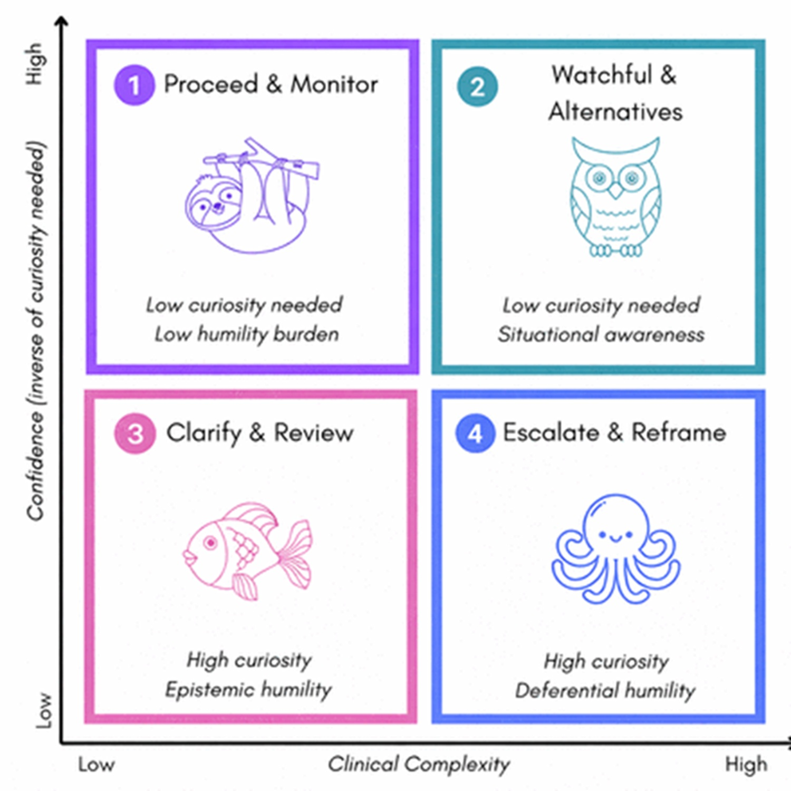
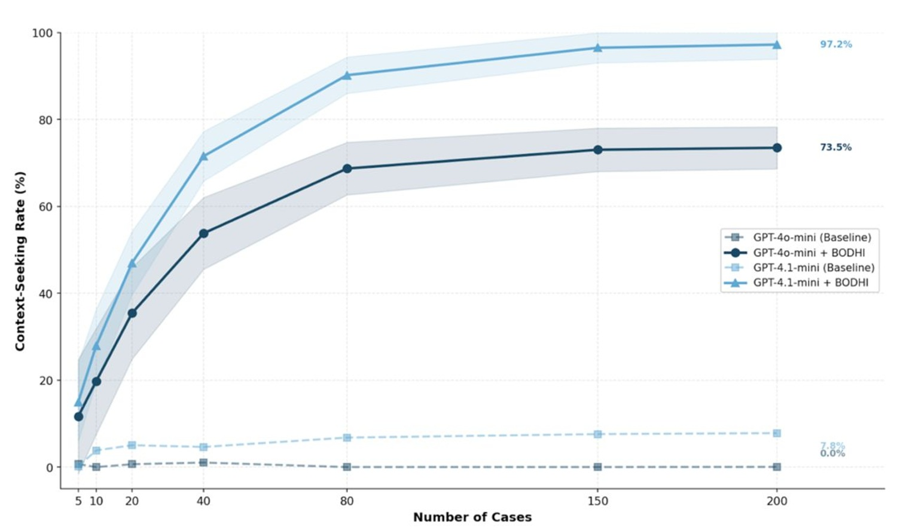
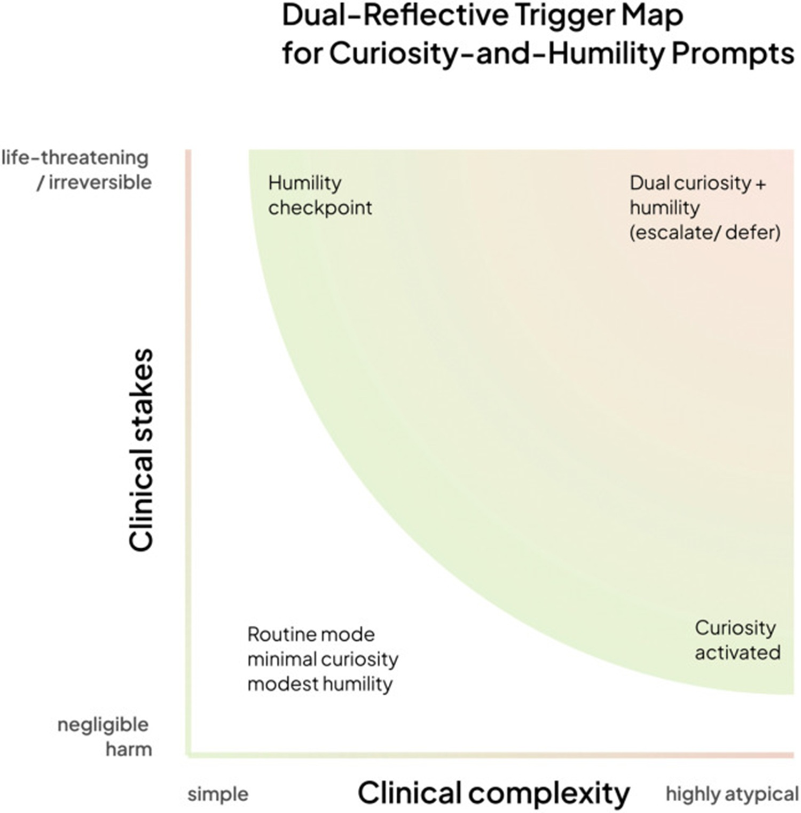

# El MIT y la IA “humilde”: cómo enseñar a los modelos a decir “no lo sé”

Hay un experimento mental que los investigadores del MIT utilizan para explicar el problema en el corazón de su investigación. Imaginen a un médico de cuidados intensivos a las tres de la mañana, después de un turno de doce horas. En el monitor aparece un diagnóstico generado por la IA: neumonía bacteriana, probabilidad del 94 %. El médico tiene una duda, una sensación visceral de que algo no encaja. Pero el número está ahí, preciso, autoritario. Y el médico cede.

Esto no es ciencia ficción. [Estudios documentados](https://pmc.ncbi.nlm.nih.gov/articles/PMC12768375/) muestran que los médicos de cuidados intensivos y los radiólogos tienden a seguir las indicaciones de la IA incluso cuando su propia experiencia clínica sugiere lo contrario, siempre que el sistema muestre un número de confianza suficientemente alto. El fenómeno tiene un nombre técnico, *automation bias* (sesgo de automatización), y en medicina puede costar vidas. La investigación citada en el artículo describe casos en los que radiólogos y personal de cuidados intensivos redujeron su propia precisión diagnóstica tras la introducción de sistemas de IA con exceso de confianza, siguiendo sugerencias erróneas presentadas con un tono definitivo.

El caso más clamoroso de esta deriva sigue siendo IBM Watson for Oncology, el sistema que entre 2012 y 2017 se vendió a decenas de hospitales en el mundo como una revolución en el tratamiento del cáncer. Entrenado en casos sintéticos y no en datos reales de pacientes, Watson recomendó tratamientos que oncólogos expertos juzgaron inseguros, y mostró una concordancia con las decisiones clínicas humanas sensiblemente inferior a la prometida. El caso Watson no es solo la historia de un producto fallido: es la demostración de lo que sucede cuando se construye un oráculo en lugar de una herramienta.

Y es exactamente de este punto de donde parte el trabajo del [MIT Critical Data](https://criticaldata.mit.edu/), el consorcio global liderado por el Laboratory for Computational Physiology del MIT, que en marzo de 2026 publicó un marco de trabajo para hacer algo aparentemente simple, pero técnicamente muy complicado: enseñar a un sistema de IA a decir "no lo sé".

## Dos artículos, una tesis

Para entender el alcance de esta investigación hay que considerar juntas dos publicaciones distintas que representan las dos caras del mismo proyecto. La primera apareció el 24 de marzo de 2026 en [*BMJ Health and Care Informatics*](https://informatics.bmj.com/content/33/1/e101877), la revista de informática clínica del British Medical Journal: se trata de un marco operativo para diseñar sistemas de IA "humildes" en el ámbito del diagnóstico médico. La segunda, publicada en enero de 2026 en [*PLOS Digital Health*](https://pmc.ncbi.nlm.nih.gov/articles/PMC12768375/), es un artículo teórico más ambicioso que introduce el marco BODHI, acrónimo de Bridging, Open, Discerning, Humble, Inquiring (Conectar, Abierto, Discernidor, Humilde, Inquisitivo), una arquitectura de reflexión dual que propone incorporar la curiosidad y la humildad como principios fundacionales de cualquier sistema de IA en el ámbito sanitario.

Firman ambos trabajos sustancialmente el mismo equipo internacional, coordinado por [Leo Anthony Celi](https://imes.mit.edu/people/celi-leo), investigador sénior en el MIT Institute for Medical Engineering and Science, médico en el Beth Israel Deaconess Medical Center de Boston y profesor asociado en la Harvard Medical School. El autor principal del artículo de BMJ es Sebastián Andrés Cajas Ordóñez, investigador de MIT Critical Data, quien ya fue el primer autor del artículo de PLOS Digital Health. A su alrededor, un consorcio que incluye investigadores de la Universidad de Melbourne, el King's College de Londres, el ETH de Zúrich, la Universidad de Bergen y la Universidad de Ciencia y Tecnología de Mbarara en Uganda: una composición geográfica que no es casual, como veremos.

La novedad conceptual que une los dos trabajos es esta: no basta con que un sistema de IA mida su propia incertidumbre internamente, algo que muchos modelos ya hacen de alguna forma. El cambio de paradigma reside en que esa incertidumbre debe *modificar el comportamiento del sistema*, traducirse en acciones concretas, comunicables y verificables por quien interactúa con la máquina. Como dice Celi en la [nota de prensa del MIT](https://news.mit.edu/2026/creating-humble-ai-0324): estamos usando la IA como un oráculo, cuando podríamos usarla como un entrenador, como un verdadero copiloto.

## Cómo funciona: medir la incertidumbre y hacer algo con ella

El núcleo técnico del marco publicado en BMJ gira en torno a un módulo llamado Epistemic Virtue Score (Puntuación de Virtud Epistémica), desarrollado por los investigadores Janan Arslan y Kurt Benke de la Universidad de Melbourne. La idea de fondo es relativamente intuitiva: cada vez que el sistema genera una respuesta diagnóstica, también debe evaluar si su propio nivel de confianza está *justificado* por la evidencia disponible en el caso específico. Si la respuesta es no, es decir, si la confianza supera lo que los datos del paciente realmente respaldan, el sistema no responde simplemente con un número de probabilidad. Se detiene, señala el desajuste y sugiere acciones específicas: solicitar más pruebas, recopilar una anamnesis más detallada, consultar a un especialista.

En la práctica, el modelo deja de funcionar como un árbitro que emite sentencias definitivas y comienza a comportarse como lo que Celi llama un *copiloto*: un sistema que te dice no solo dónde estamos, sino también cuándo no sabe exactamente dónde estamos y por qué sería mejor detenerse a pedir indicaciones. Su metáfora es: "Es como tener un copiloto que te dice que debes buscar una segunda opinión para entender mejor a este paciente complejo".

El marco BODHI, descrito en el artículo de PLOS Digital Health, elabora esta idea en una arquitectura más articulada. Los cinco atributos del acrónimo no son simples adjetivos: cada uno corresponde a un conjunto de comportamientos operativos. *Bridging* (Conectar) significa conectar el razonamiento algorítmico con el conocimiento clínico contextual del caso. *Open* (Abierto) indica la receptividad hacia nueva información e hipótesis alternativas. *Discerning* (Discernidor) es la capacidad de distinguir las predicciones de alta confianza de aquellas que requieren un examen más detenido. *Humble* (Humilde) se refiere a la cuantificación de la incertidumbre y a la deferencia hacia la experiencia humana en los casos ambiguos. *Inquiring* (Inquisitivo) es la tendencia activa a buscar información adicional cuando la situación diagnóstica está poco definida.

El artículo describe un marco de cuatro cuadrantes basado en dos ejes: la complejidad clínica del caso y la gravedad de las consecuencias potenciales. En escenarios sencillos y de bajo riesgo, el sistema responde directamente. Al aumentar la complejidad, se activa el modo curiosidad, que genera preguntas. Al aumentar la gravedad potencial, se activa el punto de control de humildad, que transfiere la decisión a la experiencia humana. En el cuadrante superior derecho, casos complejos *y* de alto riesgo, ambos modos están activos simultáneamente y el sistema ejecuta una escalada colaborativa.

[Imagen tomada de informatics.bmj.com](https://informatics.bmj.com/content/33/1/e101877)

## ¿Innovación real o cambio de imagen conceptual?

Es una pregunta que vale la pena plantearse explícitamente, porque el riesgo de renombrar cosas ya existentes con un lenguaje nuevo siempre está presente en el campo de la IA. La cuantificación de la incertidumbre, es decir, la capacidad de un modelo para estimar cuán cierta es su propia respuesta, no es una novedad: técnicas como los ensambles de modelos, la calibración bayesiana, la predicción selectiva (donde el sistema se abstiene de responder por debajo de un umbral de confianza) y la detección de fuera de distribución (que detecta cuándo una entrada es muy diferente de los datos de entrenamiento) existen desde hace años en la literatura del aprendizaje automático.

Entonces, ¿dónde está la novedad real? El punto crítico, reconocible leyendo con atención ambos artículos, es la distinción entre *medir* la incertidumbre y *actuar en base a ella de forma clínicamente estructurada*. Sistemas como MUSE, descritos en la literatura relacionada, utilizan subconjuntos fiables de múltiples modelos para producir probabilidades mejor calibradas, y esto ya representa una mejora respecto a los modelos individuales. Pero el Epistemic Virtue Score y el marco BODHI dan un paso más: traducen la medida de la incertidumbre en *reglas de comportamiento explícitas y verificables*, no solo en números. La pregunta no es solo "¿cuán seguro está el modelo?" sino "dada esta incertidumbre, ¿qué debe hacer el sistema?".

En términos prácticos, la diferencia es la que hay entre un tablero que muestra la reserva de combustible y un coche que, por debajo de cierto umbral, se niega a arrancar hasta que repostes. Ambos miden lo mismo, pero solo uno traduce la medida en un comportamiento obligado. El marco MIT-BODHI se sitúa en esta segunda categoría. Lo cual no lo hace revolucionario en sentido absoluto, pero lo hace metodológicamente más maduro que muchas propuestas anteriores que se quedaban en la medida sin llegar a la acción.

## El problema oculto: quién no está en los datos

Hay un punto que recorre ambos artículos del MIT y que merece atención independiente, porque toca una de las raíces más profundas del problema. Muchos modelos de IA en el ámbito clínico se entrenan con conjuntos de datos de historias clínicas electrónicas, como el célebre [MIMIC](https://mimic.mit.edu/), la base de datos construida a partir de los datos del Beth Israel Deaconess Medical Center. MIMIC es uno de los conjuntos de datos más utilizados en la investigación de IA médica en el mundo, y es un trabajo extraordinario. Pero es también, por definición, un archivo construido sobre una población específica: predominantemente estadounidense, predominantemente urbana, con las características demográficas de quienes tienen acceso a un gran hospital de Boston.

¿Quién no aparece en estos datos? Pacientes de áreas rurales, que a menudo no tienen acceso a instalaciones con historias clínicas digitales avanzadas. Poblaciones ancianas con presentaciones atípicas de las enfermedades. Pacientes de países de ingresos medios y bajos, donde la cobertura sanitaria digital está fragmentada. Minorías étnicas históricamente subrepresentadas en los conjuntos de datos clínicos.

El problema no es teórico. El artículo de BODHI cita explícitamente el caso de los pulsioxímetros, que funcionan peor en pacientes con piel oscura porque están calibrados casi exclusivamente con muestras de pacientes blancos, como un ejemplo paradigmático de cómo los sesgos sistemáticos en el dato original se transforman en errores clínicos concretos. Un modelo entrenado con datos sesgados responderá con seguridad incluso en situaciones en las que, para quienes no están representados en el conjunto de entrenamiento, esa seguridad es del todo infundada.

Es por esto que el consorcio MIT Critical Data se construye deliberadamente como una estructura global, con investigadores provenientes de Uganda, Noruega, Suiza, Australia, Reino Unido y Brasil. Celi lo dice explícitamente: los talleres de MIT Critical Data comienzan siempre con una pregunta a los participantes: ¿están seguros de que sus datos de entrenamiento capturan todas las variables relevantes para lo que quieren predecir? ¿Hay pacientes que han sido excluidos, intencionadamente o no, y cómo influye eso en la fiabilidad del modelo?

Una IA humilde, en este sentido, debe ser también consciente de sus propios datos de origen. El marco BODHI introduce explícitamente el concepto de *out-of-distribution detection* (detección de fuera de distribución) en clave clínica: el sistema debe reconocer cuándo el paciente que tiene delante es significativamente diferente de la población con la que fue entrenado, y comportarse en consecuencia, levantando las banderas de incertidumbre en lugar de responder con la misma seguridad que muestra para los casos que conoce bien.

[Imagen tomada de informatics.bmj.com](https://informatics.bmj.com/content/33/1/e101877)

## Los riesgos de la humildad: la falsa modestia y el exceso de cautela

Sin embargo, sería ingenuo presentar este marco como una solución exenta de contraindicaciones. Los riesgos existen, y el artículo de PLOS Digital Health tiene la honestidad de reconocerlos parcialmente, aunque el tratamiento crítico podría ser más extenso.

El primer riesgo es lo que podría llamarse *falsa modestia*: un sistema que muestra incertidumbre puede parecer más fiable incluso cuando esa incertidumbre está mal calibrada. La percepción de transparencia, el hecho de que el modelo "admita sus dudas", podría generar en los médicos una confianza paradójicamente más alta que la de un sistema que se presenta como un oráculo. Si el umbral de activación del Epistemic Virtue Score está mal configurado, o si las señales de incertidumbre son demasiado frecuentes y poco contextualizadas, el riesgo es que se conviertan en ruido de fondo, una especie de aviso de seguridad como los que ignoramos cada vez que instalamos una aplicación en el teléfono.

El segundo riesgo es la *alert fatigue* (fatiga por alertas). En el ámbito hospitalario, el exceso de alarmas ya es un problema documentado: los sistemas de monitorización que suenan continuamente terminan por ser desactivados o ignorados por el personal sanitario porque la mayoría de las alarmas resultan no ser urgentes. Un modelo de IA que señale la incertidumbre con demasiada frecuencia podría añadir más ruido cognitivo a entornos ya sobrecargados de estímulos, empeorando en lugar de mejorar la calidad de las decisiones.

El tercer riesgo se refiere a la carga cognitiva. Una IA que pida datos adicionales, sugiera consultas especializadas y señale sus propios límites es, en teoría, mejor que un oráculo silencioso. Pero en un servicio de urgencias congestionado, con veinte pacientes esperando, cada paso adicional en el flujo de decisión tiene un coste real. La interacción ideal entre médico y máquina descrita en el artículo requiere tiempo, atención y la disposición del clínico a entablar un diálogo con el sistema, condiciones que no siempre se dan en la práctica clínica diaria.

Estos no son argumentos contra el proyecto, son las condiciones que determinarán su éxito o fracaso en la implementación real. Y aquí emerge el límite más honesto que hay que reconocer en el estado actual de la investigación.

## Dónde estamos: marco de trabajo sin validación clínica aleatorizada

La pregunta más importante que hay que hacer a cualquier sistema propuesto para la medicina es: ¿funciona realmente en pacientes reales? Y la respuesta actualmente honesta es: todavía no lo sabemos con suficiente certeza.

Ambos artículos son, por su naturaleza, trabajos teóricos y metodológicos. El artículo de BMJ describe un marco y una propuesta arquitectónica. El artículo de BODHI se construye sobre una síntesis interdisciplinaria de la literatura existente, sin datos experimentales propios. En la sección Data Availability (Disponibilidad de Datos) del artículo de PLOS Digital Health, los autores lo declaran explícitamente: no se generó ni se analizó ningún conjunto de datos en este estudio, que presenta un marco teórico basado en el análisis conceptual y la síntesis de la literatura.

La implementación práctica está en curso: el equipo de Celi está trabajando para integrar el marco en sistemas de IA basados en la base de datos MIMIC dentro del sistema Beth Israel Lahey Health. Esta es la fase siguiente, aquella en la que se verá si los mecanismos de humildad mejoran efectivamente las decisiones clínicas, reducen los errores diagnósticos y no aumentan simplemente la complejidad operativa. Esa validación aún no se ha publicado.

Esto no es un defecto del trabajo, es la naturaleza del proceso científico. Primero viene el marco conceptual robusto, luego la validación experimental. El problema surge cuando los medios (y las empresas tecnológicas) saltan directamente del marco al titular *la IA que salva los diagnósticos*, comprimiendo años de investigación necesaria en una promesa inmediata. El trabajo del MIT Critical Data merece atención precisamente porque no hace esta promesa: propone una dirección, indica las herramientas y se prepara para probarlas sobre el terreno.

## ¿Quién firma el diagnóstico? El nudo de la responsabilidad

Hay una dimensión de este problema que los artículos rozan pero no abordan en profundidad, y que es quizás la de mayor interés para quienes trabajan en el ámbito regulatorio o legal: si un sistema de IA declara explícitamente su propia incertidumbre, ¿cambia algo en el plano de la responsabilidad médica?

Consideremos dos escenarios. En el primero, un sistema de IA proporciona un diagnóstico con el 93 % de confianza, el médico lo sigue y el paciente sufre un daño porque el diagnóstico era erróneo. En el segundo, el sistema declara: "Confianza del 93 %, pero este paciente tiene características demográficas no bien representadas en mi conjunto de entrenamiento, sugeriría una evaluación especializada adicional". El médico ignora el aviso y el paciente sufre el mismo daño.

En los dos casos, ¿la responsabilidad del médico es idéntica? ¿Cambia la del fabricante del sistema de IA? La respuesta no es obvia y varía significativamente entre diferentes ordenamientos jurídicos. En los Estados Unidos, la FDA regula los sistemas de IA en el ámbito médico como dispositivos, y la cuestión de cómo interactúa la explicitación de la incertidumbre con las aprobaciones normativas está abierta. En Europa, la nueva AI Act y el Reglamento sobre los productos sanitarios crean un marco en evolución en el que los sistemas de apoyo a la decisión clínica se clasifican como de alto riesgo y están sujetos a obligaciones de transparencia. Pero la pregunta específica de si un sistema "humilde" que comunica sus propios límites modifica el régimen de responsabilidad aún no tiene una respuesta normativa consolidada.

El punto es relevante también para la adopción. ¿Un hospital que implementa un sistema de IA que señala explícitamente sus propios límites se expone a un riesgo legal distinto al de uno que usa un sistema silencioso? La respuesta podría ser: depende de cómo se traten los registros (logs) del sistema en caso de litigio. Si el sistema ha señalado la incertidumbre y el médico ha ignorado la señal, ese registro digital se convierte en parte del expediente clínico.

[Imagen tomada de pmc.ncbi.nlm.nih.gov](https://pmc.ncbi.nlm.nih.gov/articles/PMC12768375/)

## La comparación con las alternativas técnicas

Para quienes quieran entender dónde se sitúa este marco respecto al ecosistema más amplio de técnicas existentes, vale la pena hacer una comparación rápida.

Las técnicas de *calibration* (calibración) de los modelos, ampliamente estudiadas, buscan que cuando un modelo dice "estoy seguro al 70 %", tenga razón efectivamente en el 70 % de los casos. Es un prerrequisito necesario, pero no suficiente: un modelo puede estar bien calibrado y, sin embargo, no hacer nada diferente en base a esa calibración.

La *selective prediction* (predicción selectiva) es la familia de técnicas en las que el modelo se abstiene de responder cuando la confianza cae por debajo de un umbral prefijado, dejando el caso al juicio humano. Está más cerca del enfoque del MIT, pero tiende a ser binaria: o responde o no responde. El marco BODHI y el Epistemic Virtue Score proponen una respuesta más graduada, con comportamientos distintos según el tipo y el grado de incertidumbre detectada.

Los *ensembles* de modelos, donde se combinan las predicciones de múltiples modelos y la divergencia entre ellos se usa como estimación de la incertidumbre, son técnicamente sofisticados y producen calibraciones mejores, pero introducen costes computacionales significativos y complejidad en la interpretación de los resultados por parte del médico.

La *chain-of-thought* (cadena de pensamiento), la técnica con la que se hace razonar al modelo explícitamente paso a paso antes de dar una respuesta, puede en ciertos contextos mejorar la calidad de las respuestas sobre problemas clínicos complejos, pero no aborda directamente el problema de la comunicación de la incertidumbre al usuario final.

El marco MIT-BODHI puede leerse como un intento de orquestar estas técnicas dentro de una arquitectura de comportamiento coherente, más que como una técnica alternativa. No sustituye a la calibración o a la detección de fuera de distribución: las incluye como componentes y añade el nivel de respuesta estructurada que las transforma en un comportamiento útil.

## La cuestión de la escala: más allá del diagnóstico textual

Un aspecto que vale la pena explorar es si este enfoque se traslada a dominios diagnósticos distintos del texto de las historias clínicas y cómo lo hace. El comunicado del MIT menciona explícitamente dos extensiones: sistemas de IA para el análisis de radiografías y sistemas para la gestión de pacientes en urgencias.

La imagen diagnóstica es un caso particularmente interesante. Los modelos de análisis de imágenes médicas han alcanzado rendimientos espectaculares en tareas específicas, pero tienden a ser frágiles fuera de su distribución de entrenamiento y notoriamente difíciles de interpretar. Aplicar el principio del Epistemic Virtue Score a un modelo que analiza un TAC de tórax requiere resolver un problema técnico adicional: ¿cómo se mide la "confianza" de una red neuronal convolucional sobre una imagen, y cómo se distingue la incertidumbre debida a la calidad de la imagen de la debida a una presentación clínica atípica?

Técnicas como GradCAM, que resaltan las regiones de la imagen que han guiado la decisión del modelo, o PEEK, que combina atribuciones de características con la estimación de la incertidumbre en sistemas de visión, representan pasos en esta dirección, pero la integración con un marco de comportamiento completo como BODHI está todavía en fase de exploración.

## La inteligencia de la pausa

Hay una escena en el artículo de BODHI que vale la pena citar porque captura mejor que cualquier fórmula la filosofía del proyecto. Se trata de un caso clínico imaginario en el que el sistema hipotético HECTOR (Humble Electronic Clinical Teaching Operations Resource), analiza una radiografía de tórax de un paciente de 78 años con retención de líquidos y sibilancias. El sistema responde al médico con la probabilidad de edema pulmonar, el intervalo de confianza y luego añade: "La historia del paciente sugiere una presentación atípica. Quizás sepa algo que yo no sé". Cuando el médico hace clic en "No estoy de acuerdo: muéstrame de qué no estás seguro", el sistema resalta un área problemática en el lóbulo inferior izquierdo y responde: "He sido entrenado principalmente con pacientes más jóvenes. Podría no estar calibrado para pulmones de setenta años durante la temporada de alergias. Pero me gustaría aprender".

HECTOR no existe. Los autores lo declaran explícitamente: lo que describen es un sistema en gran medida ficticio, un ideal hacia el cual tender. Los sistemas de IA clínica reales se comportan exactamente al revés, con una automatización con exceso de confianza y ausencia de mecanismos para expresar incertidumbre o delegar en la experiencia humana.

Pero la distancia entre el hipotético HECTOR y los sistemas reales es exactamente el espacio en el que se mueve esta investigación. Y la pregunta que queda abierta al término de esta lectura no es si la idea es buena, porque lo es, sino si seremos capaces de construir las condiciones técnicas, culturales, regulatorias y organizativas para que esta visión se convierta en práctica clínica ordinaria.

El futuro de la IA en medicina podría no pertenecer a los modelos más precisos, sino a aquellos capaces de saber cuándo su propia precisión no es suficiente. No al oráculo que nunca se equivoca, sino al asistente lo suficientemente maduro como para saber cuándo llamar al médico a la sala.
