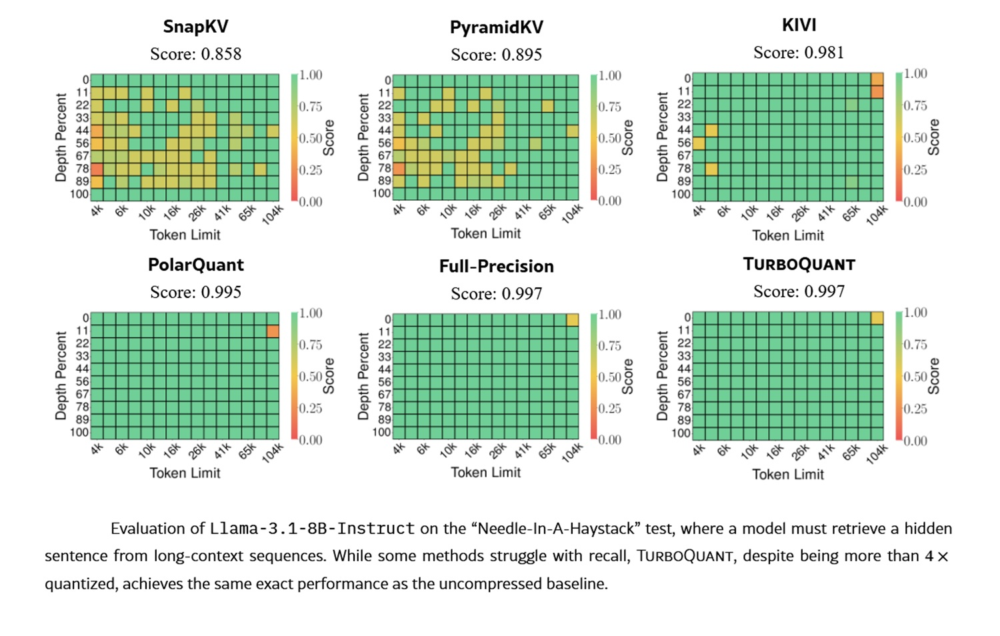
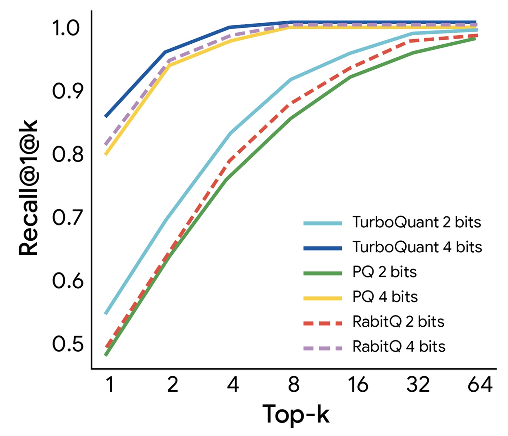
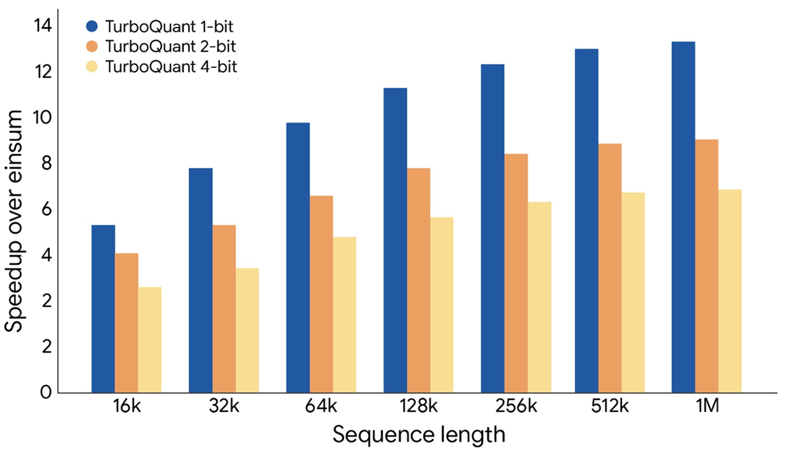

# TurboQuant: un bit per ridefinire i limiti dell'intelligenza artificiale

*Alla fine di aprile 2025, quattro ricercatori di Google Research e della New York University pubblicavano su arXiv un paper dal titolo sobrio: *[TurboQuant: Online Vector Quantization with Near-optimal Distortion Rate](https://arxiv.org/abs/2504.19874)*. Per mesi, quasi nessuno ne ha parlato al di fuori dei circoli accademici. Poi, a marzo 2026, Google pubblica un [post sul blog ufficiale](https://research.google/blog/turboquant-redefining-ai-efficiency-with-extreme-compression/) che annuncia TurboQuant come una svolta nell'efficienza dei modelli linguistici, con l'accettazione all'[ICLR 2026](https://iclr.cc/), e nel giro di quarantotto ore il paper compare su ogni feed tech. Annunci di compressioni oltre cinque volte superiori senza perdita di qualità, titoli entusiastici ovunque. Un anno di ritardo, un'ondata di clamore.*

Vale la pena fermarsi, perché questa dinamica, il paper dormiente che esplode grazie alla spinta comunicativa di un grande laboratorio, racconta qualcosa su come funziona l'informazione nell'ecosistema dell'intelligenza artificiale. Vale ancora di più la pena capire cosa fa davvero TurboQuant, senza sovrastimare né liquidare il contributo.

Quando un grande modello linguistico genera testo, non processa ogni parola da zero ogni volta. Invece, tiene in memoria una struttura chiamata **KV cache**, un archivio di coppie chiave-valore, che funziona come un bigino digitale ad alta velocità. Man mano che la conversazione avanza, il modello vi accumula i vettori matematici che codificano il significato di tutto ciò che ha già letto, per consultarli istantaneamente durante il meccanismo di *attention*, con cui il Transformer decide a cosa prestare attenzione in ogni momento.

Il problema è che questa cache cresce in modo inesorabile con il contesto. Con finestre di 128.000 o 250.000 token, ormai standard nei modelli moderni, può occupare decine di gigabyte di memoria ad alta velocità. Chi usa modelli in locale conosce la situazione paradossale: RAM sufficiente per caricare i pesi del modello, ma non abbastanza appena si prova ad usarlo con un contesto lungo. Come avere un archivio capiente con corridoi troppo stretti per portarci dentro i faldoni.

La risposta ovvia è comprimere quei vettori, ed è qui che entra la quantizzazione.

## Quantizzare senza perdere il filo

La quantizzazione è uno di quei concetti che sembrano oscuri finché non si trova l'analogia giusta. Immaginate un righello con graduazioni finissime, capace di misurare al decimo di millimetro. Volete archiviare migliaia di misurazioni ma avete poco spazio, così passate a un righello più grossolano con tacche ogni mezzo centimetro: perdete un po' di precisione, ma occupate molto meno spazio. Nella pratica, i vettori KV vengono normalmente salvati a 16 bit per componente, circa 65.000 valori distinti. Portarli a 4 bit riduce a soli 16 valori possibili, con un risparmio di memoria di quattro volte, ma con un'approssimazione che può degradare le prestazioni del modello.

Il degrado non è banale. Come osserva il programmatore e analista tecnico Salvatore Sanfilippo nella sua analisi approfondita, la quantizzazione della KV cache non intacca solo la capacità di recuperare dettagli testuali precisi, ma compromette anche la qualità della sintesi semantica nei layer successivi del Transformer, dove i token diventano rappresentazioni sempre più astratte. I benchmark sull'*ago nel pagliaio*, la prova classica in cui si nasconde un'informazione specifica in un testo molto lungo, catturano solo una parte di questo deterioramento.

Il territorio ha già visto molti esploratori. Tecniche come [KIVI](https://arxiv.org/abs/2402.02750) hanno proposto diversi approcci alla compressione della KV cache. Nel campo più generale, la *product quantization* (PQ) è lo standard storico: divide ogni vettore in sottovettori, costruisce un dizionario per ciascuno, e sostituisce ogni sottovettore con l'indice del centroide più vicino. Funziona bene, ma richiede una fase di addestramento offline, inutilizzabile in scenari come la KV cache, dove i vettori arrivano in tempo reale.

TurboQuant parte da un obiettivo più ambizioso: essere *data-oblivious*, cioè funzionare senza sapere niente sulla distribuzione dei dati in ingresso, e farlo con garanzie teoriche solide.

[Immagine tratta da arxiv.org](https://arxiv.org/abs/2504.19874)

## Il trucco della rotazione e il bit residuale

Il cuore tecnico di TurboQuant si spiega in due atti.

**Primo atto: la rotazione casuale.** I vettori KV hanno un problema strutturale fastidioso: le loro componenti non sono distribuite uniformemente. Alcune dimensioni contengono quasi tutta l'informazione rilevante, mentre molte altre sono vicine a zero. Applicare una quantizzazione standard significa sprecare bit preziosi sulle dimensioni irrilevanti e accumulare errori sulle poche che contano davvero. È come calibrare una bilancia di precisione per pesare sassolini, perdendo così tutta la finezza necessaria a pesare la polvere d'oro.

TurboQuant risolve questo applicando una **rotazione casuale** al vettore prima di quantizzarlo: moltiplicarlo per una matrice di rotazione cambia le coordinate senza alterare la lunghezza del vettore, esattamente come ruotare un oggetto nello spazio non ne cambia le dimensioni. Il risultato è che dopo la rotazione, le componenti seguono una distribuzione statistica nota in anticipo, una distribuzione Beta che in alte dimensioni converge a una gaussiana, trasformando un problema dipendente dai dati in uno universale. Non importa più la distribuzione originale: si possono precalcolare le tabelle di quantizzazione ottimali per ogni livello di bit desiderato e applicarle sempre, senza calibrazioni caso per caso. Da notare la distinzione tecnica importante: moltiplicare per una matrice gaussiana casuale qualsiasi cambierebbe anche la lunghezza del vettore, introducendo distorsioni incontrollabili. La rotazione mantiene la norma L2 invariata, e questa proprietà è fondamentale.

**Secondo atto: il bit del residuo.** I quantizzatori ottimizzati per minimizzare l'errore quadratico medio (MSE) non garantiscono stime accurate dei *prodotti interni* tra vettori, e i prodotti interni sono esattamente ciò che il meccanismo di *attention* calcola continuamente. Avere una buona ricostruzione del vettore non implica automaticamente buone stime dei prodotti interni.

TurboQuant affronta questo con un secondo stadio: dopo aver quantizzato il vettore a b−1 bit, calcola il residuo, la differenza tra il vettore originale e quello quantizzato, e lo processa con la tecnica **QJL** (*Quantized Johnson-Lindenstrauss*), che lo proietta su una matrice gaussiana casuale e ne conserva solo il segno di ogni componente, occupando esattamente 1 bit. Questo bit funziona come correttore d'errore: garantisce che la stima dei prodotti interni sia *unbiased*, cioè che l'errore non sia sistematicamente orientato in una direzione. La magnitudo dell'errore residuale si stima analiticamente senza salvarla, perché la distribuzione è nota dalla costruzione del quantizzatore. Il sistema usa in totale b bit: b−1 per la compressione principale, 1 per la correzione.

## Quanto è solido il claim teorico?

Il paper dichiara che TurboQuant è *near-optimal*, vicino al limite teorico inferiore di distorsione per qualsiasi quantizzatore possibile. È il tipo di affermazione che va letta con cura.

Gli autori dimostrano, usando il teorema di codifica di Shannon e il principio minimax di Yao, che per qualsiasi quantizzatore randomizzato esistono input per cui la distorsione MSE è almeno 1/4^b. TurboQuant raggiunge una distorsione al massimo √(3π/2) ≈ 2,7 volte superiore a questo lower bound, e a 1 bit, il gap scende a circa 1,45. I risultati sono formalmente dimostrati.

Il claim regge, con due precisazioni. Prima: "near-optimal" significa entro un fattore costante dal limite teorico, non toccare il limite. La costante 2,7 è piccola e in pratica trascurabile, ma tecnicamente il gap esiste. Seconda: il lower bound è derivato per il caso peggiore su input arbitrari. In produzione, le distribuzioni reali dei vettori KV possono comportarsi diversamente.

Una distinzione fondamentale, spesso ignorata nella copertura mediatica, è quella tra ottimizzazione per MSE e ottimizzazione per distorsione del prodotto interno. Sono due obiettivi diversi che richiedono soluzioni diverse, e TurboQuant li affronta entrambi con il suo approccio a due stadi. Non è un dettaglio: significa che il metodo è pensato specificamente per il funzionamento interno dei Transformer, non solo per comprimere vettori in senso generico.

[Immagine tratta da research.google](https://research.google/blog/turboquant-redefining-ai-efficiency-with-extreme-compression/)

## La questione RabbitQ: chi ha fatto cosa prima

Il paper ha sollevato un dibattito durante la fase di revisione, e sarebbe disonesto non affrontarlo.

Il nodo: la rotazione casuale come tecnica di preprocessing non è stata inventata da TurboQuant. Un metodo precedente chiamato [RabbitQ](https://arxiv.org/abs/2405.12154) aveva già utilizzato una trasformazione simile, e i suoi autori hanno protestato pubblicamente durante il peer review, sostenendo che il loro contributo fosse stato ignorato. Le loro note sono state recepite, ma la caratterizzazione di RabbitQ nel paper finale ha continuato a essere considerata inadeguata, con i ricercatori che rivendicano anche per il loro metodo proprietà di eccellenza asintotica.

Esiste poi un lavoro precedente degli stessi autori di TurboQuant, [PolarQuant](https://arxiv.org/abs/2502.02617), che usava una trasformazione in coordinate polari per ottenere un effetto simile, ma con costo computazionale significativamente più elevato, rendendolo inutilizzabile in scenari online. TurboQuant ne è un'evoluzione più pratica.

Come osserva Sanfilippo, il trucco della rotazione era già presente altrove, e non averlo esplicitamente riconosciuto è la parte più problematica dell'intera vicenda. La comunicazione pubblica di Google ha sorvolato con disinvoltura su questi precedenti, amplificando l'impressione di una novità più radicale di quanto il paper stesso sostenga.

## I benchmark e il valore reale del contributo

Il claim di "assoluta neutralità qualitativa a 3,5 bit" è supportato dai dati, ma con contesti che meritano attenzione. I test principali sono condotti su Llama-2-7B, un modello da 7 miliardi di parametri che per gli standard attuali è considerato piccolo. Su modelli più grandi, la quantizzazione aggressiva tende a comportarsi diversamente. Sanfilippo sottolinea un punto critico: quando i benchmark mostrano che anche metodi meno sofisticati ottengono punteggi simili, può significare che il compito è troppo semplice per discriminare le differenze reali.

Su LongBench, la comparazione è più rivelatrice. KIWI a 5 bit ottiene punteggi comparabili a TurboQuant a 3,5 bit su diversi task. Questo non sminuisce il risultato, usare meno bit per la stessa qualità è un vantaggio reale, ma ridimensiona la portata della "rivoluzione". Il risparmio effettivo, nella valutazione più onesta, è nell'ordine di un bit rispetto allo stato dell'arte: poter quantizzare a 4 bit con le stesse prestazioni di una quantizzazione a 5 bit con altri metodi, ovvero ridurre l'occupazione della KV cache del 20% rispetto ai concorrenti. Un vantaggio solido, non una discontinuità.

Sul fronte della ricerca vettoriale i risultati sono invece più chiaramente differenzianti: eliminare la fase di addestramento offline del codebook è un vantaggio operativo concreto per chi costruisce sistemi di retrieval su dati dinamici.

[Immagine tratta da research.google](https://research.google/blog/turboquant-redefining-ai-efficiency-with-extreme-compression/)

## Domande aperte

Dopo aver letto il paper, il blog post, le critiche dei ricercatori di RabbitQ e l'analisi di Sanfilippo, rimangono alcune domande fondamentali senza risposta soddisfacente.

La prima e più importante: i risultati su Llama-2-7B si trasferiscono ai modelli da 70 o 400 miliardi di parametri, alle architetture mixture-of-experts oggi dominanti? La teoria dice di sì, ma va verificato empiricamente. Le architetture più recenti, con grouped query attention o configurazioni multi-query, dove le dimensioni dei vettori KV sono ridotte, potrebbero rispondere in modo diverso alla rotazione casuale.

La seconda riguarda il confronto diretto con RabbitQ nelle stesse condizioni. Le polemiche durante la peer review suggeriscono che la comparazione presentata nel paper non fosse completamente equa: RabbitQ testato su CPU, TurboQuant su H100. Una comparazione su hardware identico, con gli stessi benchmark, rimane da fare in modo indipendente.

La terza riguarda l'integrazione nelle pipeline reali. In produzione, la KV cache coesiste con strategie di eviction dei token, attenzione sparsa, sistemi di paginazione della memoria come PagedAttention. Un bit guadagnato dalla quantizzazione può essere facilmente annullato da un'integrazione sub ottimale in questi sistemi compositi.

Infine, la domanda più ampia: la compressione della KV cache è davvero il collo di bottiglia principale nell'inferenza a lungo contesto, o ci sono altri fattori, larghezza di banda, latenza di accesso, parallelizzazione dell'attenzione, che pesano di più? Risparmiare un bit è un contributo reale, ma il suo impatto pratico dipende da dove si trova il vero vincolo del sistema.

TurboQuant è un pezzo solido di ricerca, con fondamenta teoriche robuste e un contributo tecnico originale nel secondo stadio QJL. Non è la fine della storia della compressione vettoriale, e non era giusto presentarlo come tale. Ma è un passo avanti genuino, del tipo che vale la pena capire, non solo condividere.
