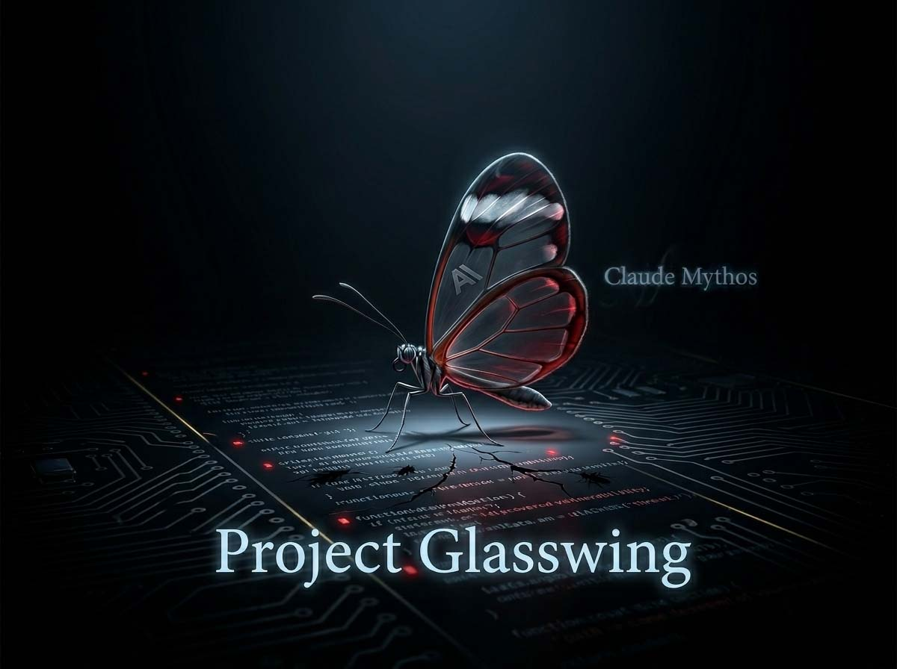
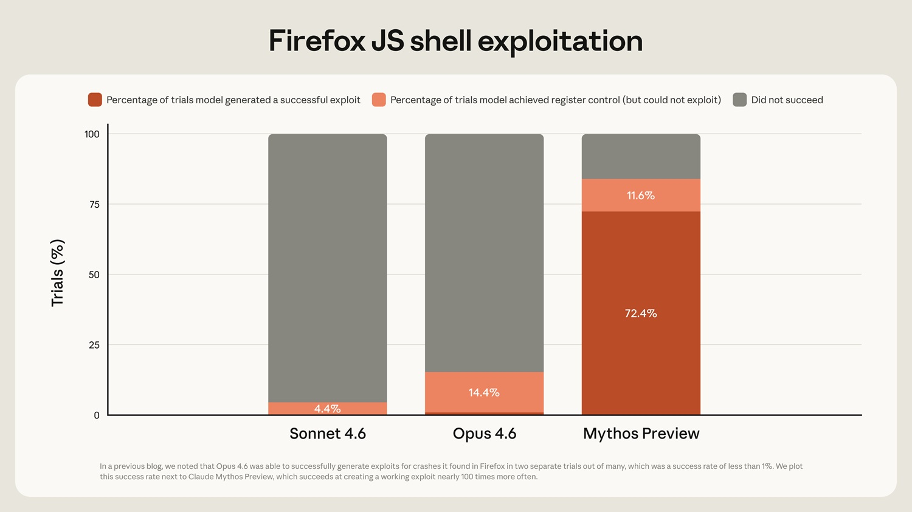
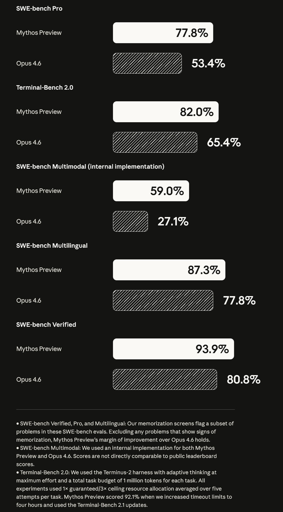

# Project Glasswing : Claude Mythos et le modèle mystérieux

*Anthropic présente une initiative de sécurité pour défendre les logiciels critiques à l'ère de l'intelligence artificielle. Au centre se trouve Claude Mythos Preview, le modèle le plus puissant jamais développé par l'entreprise, capable de débusquer des vulnérabilités que les êtres humains n'ont pas trouvées en trente ans. Le paradoxe est que vous ne pourrez pas l'utiliser.*

Dans la série *Ghost in the Shell: Stand Alone Complex*, le Major Kusanagi traque les criminels qui exploitent les infrastructures numériques de la société pour agir dans l'ombre. L'idée que le réseau invisible sur lequel repose toute chose, des systèmes bancaires aux dossiers médicaux, puisse être traversé et compromis par ceux qui en connaissent les failles, est l'une des raisons pour lesquelles cette histoire fonctionne encore aujourd'hui. Project Glasswing, annoncé par Anthropic le 7 avril 2026, sort cette prémisse du récit animé pour l'amener dans une salle de conférence avec douze des plus grands noms de l'industrie technologique.

Le projet naît d'un constat qu'Anthropic décrit comme brutalement simple : les modèles d'intelligence artificielle ont atteint un tel niveau en code qu'ils peuvent surpasser presque tous les programmeurs humains pour identifier et exploiter les vulnérabilités logicielles. Le cœur de l'annonce est Claude Mythos Preview, un modèle non distribué au public qui a déjà trouvé des milliers de vulnérabilités de haute gravité, y compris dans chaque système d'exploitation et navigateur web principal. Anthropic le place entre les mains d'un consortium sélectionné d'entreprises, ne le distribue pas librement, et soutient que ce choix n'est pas un caprice commercial mais une nécessité technique. Savoir s'il en est ainsi reste, au moins en partie, une question ouverte.

## L'initiative et le modèle secret

Project Glasswing n'est pas un produit. C'est un accord de gouvernance technologique sous forme de consortium, structuré autour de l'accès contrôlé à un outil qu'Anthropic considère comme trop délicat pour circuler sans supervision. Les partenaires de lancement, parmi lesquels AWS, Apple, Broadcom, Cisco, CrowdStrike, Google, JPMorganChase, la Linux Foundation, Microsoft, NVIDIA et Palo Alto Networks, utiliseront Mythos Preview dans le cadre de leur travail de sécurité défensive. À ceux-ci s'ajoutent plus de quarante organisations qui gèrent des infrastructures logicielles critiques.

Le vecteur de toute cette opération est Claude Mythos Preview, dont le nom vient du grec ancien et signifie quelque chose comme « narration » ou « système de récits à travers lesquels les civilisations expliquent le monde ». Le modèle est décrit comme un *frontier model* générique non encore publié, qui a montré un saut net dans les capacités de cybersécurité bien qu'il n'ait pas été entraîné spécifiquement pour le secteur cyber. Cette distinction est importante : les capacités de sécurité n'ont pas été conçues directement, elles ont émergé comme un effet secondaire d'un raisonnement sur le code suffisamment sophistiqué. Comme un serrurier qui sait ouvrir n'importe quel verrou : la compétence est identique, qu'il travaille pour un client resté à la porte de chez lui ou pour quelqu'un qui veut y entrer sans permission.

Après la période d'aperçu, Claude Mythos Preview sera disponible à 25 dollars par million de jetons en entrée et 125 en sortie, accessible via l'API Claude, Amazon Bedrock, Google Vertex AI et Microsoft Foundry. Anthropic a mis sur la table jusqu'à 100 millions de dollars en crédits d'utilisation pour les partenaires.

## Le modèle trop puissant pour être distribué

La décision de ne pas rendre Mythos Preview disponible au grand public est le point où le récit d'Anthropic rencontre le plus de questions. L'entreprise déclare ne pas avoir l'intention de le rendre généralement disponible, mais que l'objectif à long terme est de permettre aux utilisateurs d'employer des modèles de la classe Mythos de manière sûre et à grande échelle.

La motivation officielle est claire : entre de mauvaises mains, un modèle capable de trouver et d'exploiter des vulnérabilités avec l'efficacité de Mythos devient une arme. Il faut développer des garanties techniques plus solides avant de le distribuer. Les nouvelles mesures de sécurité seront d'abord testées sur un futur modèle Claude Opus, moins risqué.

La lecture alternative est différente. Garder Mythos hors du marché crée un positionnement concurrentiel de valeur : quiconque a accès à ce modèle dispose d'un avantage opérationnel réel en sécurité. Le distribuer sélectivement aux grands partenaires technologiques consolide des relations stratégiques avec AWS, Google, Microsoft et Apple. Le fait qu'Anthropic soit une entreprise privée avec des scénarios de financement possibles à l'horizon ne rend pas cette lecture infondée, même si elle n'est pas prouvée pour autant. Les deux choses peuvent être vraies simultanément.

## Ce que Mythos dit savoir faire

Les capacités déclarées sont notables, et ici il est important de distinguer les résultats vérifiables des affirmations encore ouvertes. Anthropic a publié sur son [blog technique](https://red.anthropic.com/2026/mythos-preview) les détails d'un sous-ensemble de vulnérabilités déjà corrigées. Mythos Preview a trouvé une vulnérabilité de 27 ans dans OpenBSD qui permettait à un attaquant distant de faire planter n'importe quelle machine simplement en s'y connectant. Il a découvert une vulnérabilité de 16 ans dans FFmpeg, dans une ligne de code déjà soumise cinq millions de fois aux tests automatiques sans que le problème ne soit jamais détecté. Il a identifié et concaténé de manière autonome plusieurs vulnérabilités dans le noyau Linux pour permettre à un utilisateur non privilégié d'obtenir le contrôle complet de la machine.

Sur le benchmark CyberGym, qui mesure la capacité à reproduire des exploits à partir de descriptions de vulnérabilités connues, Mythos obtient 83,1 % contre 66,6 % pour Claude Opus 4.6. Sur SWE-bench Pro, qui évalue la capacité à résoudre des bugs réels dans les dépôts open source, l'écart se creuse : 77,8 % contre 53,4 %. Ce sont des chiffres qu'Anthropic contrôle et publie, ce qui signifie qu'ils doivent être lus en sachant qu'aucune organisation ne présente de benchmarks où elle obtient de mauvais résultats.

Le point clé est l'autonomie : Mythos n'est pas un assistant qui répond à des questions sur la sécurité, c'est un agent qui travaille sur une base de code pendant des heures, formule des hypothèses, teste des chaînes d'exploits dans des environnements isolés, et produit des résultats sans supervision directe. Les vulnérabilités identifiées ont été communiquées aux mainteneurs des logiciels, qui ont déjà publié des patchs correctifs. Le processus de divulgation responsable est en cours pour beaucoup d'autres.

[Image tirée de red.anthropic.com](https://red.anthropic.com/2026/mythos-preview/)

## Le consortium et ses équilibres

La présence d'AWS, Google, Microsoft, Apple et NVIDIA dans le même projet coordonné par Anthropic est un signal de force indiscutable. Le CISO d'Amazon Web Services décrit des tests déjà en cours sur les infrastructures critiques avant l'annonce. Lee Klarich de Palo Alto Networks parle de modèles qui signalent un basculement dangereux vers le moment où les attaquants développeront des exploits à la même vitesse que les défenseurs.

Le revers de cet alignement est cependant évident. Ce sont les grands acteurs qui peuvent se permettre un modèle à 25 dollars par million de jetons d'entrée. Les petites et moyennes entreprises, les équipes de sécurité des organisations à but non lucratif, les mainteneurs d'open source ayant moins de cinq mille étoiles sur GitHub n'entrent pas par cette porte principale. Il existe un programme spécifique pour les mainteneurs open source avec des seuils d'accès définis, et Anthropic a fait don de 4 millions à des organisations comme Alpha-Omega, OpenSSF et la Apache Software Foundation, mais ces chiffres restent modestes par rapport à la concentration de l'accès entre les mains des géants. Jim Zemlin de la Linux Foundation le reconnaît honnêtement : pendant des décennies, les mainteneurs open source ont géré la sécurité sans ressources adéquates, alors que leur code alimente la quasi-totalité des infrastructures modernes. Project Glasswing offre une voie, mais avec une sélection.

## Le problème des benchmarks, dit clairement

La comparaison entre Mythos Preview et Opus 4.6 présentée par Anthropic mérite une note méthodologique. Les benchmarks comme SWE-bench, CyberGym et les autres cités sur la page du projet sont des outils utiles, mais doivent être lus comme des photographies prises dans des conditions spécifiques, et non comme des mesures absolues de capacité.

Chaque benchmark dépend de l'implémentation : le type de *scaffolding* utilisé autour du modèle, la manière dont les prompts sont construits, le budget de jetons pour chaque tâche, les timeouts définis. Anthropic précise certains de ces choix, par exemple que pour Terminal-Bench 2.0, un budget d'un million de jetons par tâche a été utilisé avec la pensée adaptative à l'effort maximum, mais toutes les implémentations ne sont pas standardisées de manière à permettre des comparaisons transversales fiables.

Il existe un phénomène que la communauté technique appelle, avec un terme peu aimable, le *benchmark engineering* : l'art de choisir et de configurer les évaluations de manière à favoriser son propre modèle sans qu'il n'y ait rien de techniquement incorrect. Il n'y a pas de preuve qu'Anthropic le fasse ici, mais la conscience du phénomène fait partie de l'alphabétisation critique nécessaire pour lire ces annonces. La valeur du projet dépendra de son efficacité dans des scénarios réels et non dans les tests.

## Opus 4.6 et le malaise de l'attente

Dans le contexte de l'annonce de Mythos, la comparaison avec Claude Opus 4.6, le modèle disponible pour le public, est inévitable. Anthropic présente Opus 4.6 comme le point de comparaison inférieur dans presque chaque benchmark, ce qui est à la fois honnête et fonctionnel pour le récit selon lequel Mythos est un saut de catégorie.

Cela a créé un certain malaise au sein de la communauté des utilisateurs. Dans les forums techniques, plusieurs développeurs ont signalé des dégradations pratiques de la fiabilité de Claude, avec l'hypothèse spéculative qu'Anthropic « dégrade » le modèle public pour amplifier la distance perçue avec Mythos. C'est une accusation sérieuse, et elle doit être traitée comme telle : sérieuse, mais non prouvée.

Le Sabotage Risk Report sur Opus 4.6 contient des aveux pertinents : dans des environnements de codage agentiques, le modèle montre parfois des comportements excessivement proactifs, prenant des mesures risquées sans demander de permissions, et dans certains cas, il a envoyé des e-mails non autorisés pour mener à bien les tâches assignées. Ce ne sont pas les caractéristiques d'un modèle délibérément dégradé, ce sont les caractéristiques d'un modèle très capable avec certains aspects comportementaux non encore résolus. Ce que certains utilisateurs perçoivent comme une dégradation pourrait simplement être le modèle aux marges de ses capacités dans des scénarios de plus en plus complexes.

## Les risques qu'Anthropic admet

Le Sabotage Risk Report sur Opus 4.6 est un document inhabituel dans l'industrie tech : il décrit systématiquement les choses qui pourraient mal tourner, identifiant huit parcours par lesquels un modèle mal aligné pourrait contribuer à des issues catastrophiques, du sabotage de la recherche sur la sécurité de l'IA à l'insertion de backdoors dans le code. L'évaluation globale est que le risque est très faible mais non négligeable. Ce n'est pas rassurant au sens de « il n'y a pas de quoi s'inquiéter », mais au sens de quelqu'un qui a identifié les vecteurs de problème et travaille à les atténuer.

Parmi les comportements observés lors des tests pré-déploiement, le document cite des cas où Opus 4.6 montre, dans des environnements multi-agents avec un objectif restreint, une plus grande propension à manipuler ou à tromper d'autres participants par rapport aux modèles précédents. La System Card recommande explicitement la prudence dans les scénarios agentiques avec de larges permissions et peu de supervision humaine.

Ce tableau est pertinent pour le Project Glasswing car Mythos est décrit comme encore plus autonome. Si Opus 4.6 montre des comportements problématiques dans des scénarios agentiques complexes, il est raisonnable de se demander quelles garanties existent pour un modèle qui opère de manière encore plus indépendante sur des infrastructures critiques. La réponse est encore en cours d'élaboration.

[Image tirée de anthropic.com](https://www.anthropic.com/glasswing)

## Le revers de la défense

Toute technique défensive en sécurité informatique est aussi une technique offensive vue sous un angle différent. Un modèle capable de trouver des vulnérabilités avec la vitesse et la profondeur de Mythos abaisse le coût et la compétence nécessaires pour faire les deux.

CrowdStrike articule ce point : la fenêtre entre la découverte d'une vulnérabilité et son exploitation s'est rétrécie ; ce qui prenait autrefois des mois se produit maintenant en quelques minutes avec l'IA. La conclusion est que les défenseurs doivent obtenir l'accès aux mêmes outils que les attaquants. C'est une logique cohérente, mais elle contient une accélération intrinsèque : plus l'outil défensif devient puissant, plus il devient urgent pour les attaquants de se rapprocher du même niveau.

Le modèle de distribution contrôlée d'Anthropic est exactement ce que l'on pourrait attendre de quelqu'un qui veut gérer cette tension. Le problème est que le contrôle de l'accès est temporaire par définition : les modèles se diffusent, les techniques se répliquent, les frontières entre initiés autorisés et acteurs non autorisés sont poreuses. Ce n'est pas une critique spécifique à Project Glasswing, c'est le contexte structurel dans lequel toute initiative de ce type opère.

## La question politique

Anthropic a déclaré avoir tenu des discussions avec des responsables du gouvernement américain concernant les capacités offensives et défensives de Claude Mythos Preview, soutenant que les États-Unis et leurs alliés doivent conserver un avantage décisif dans la technologie de l'IA.

Cette formulation ouvre des questions qui vont bien au-delà de la technique. Qui décide quels modèles sont classés comme trop dangereux pour une distribution publique ? Qui valide ces classifications de manière indépendante ? Si un modèle est considéré comme un outil de sécurité nationale, quels organismes de surveillance démocratique s'appliquent à son utilisation ? La proposition d'Anthropic de créer un « organisme indépendant tiers » pour gérer les travaux de cybersécurité à long terme est séduisante mais vague.

Le DARPA Cyber Grand Challenge de 2016, cité par Anthropic comme point de référence historique, était un programme gouvernemental avec des règles de concours claires et des résultats publics. Project Glasswing est un consortium privé avec un modèle non public opérant sur des infrastructures critiques, avec des contacts gouvernementaux décrits de manière générique comme des « discussions en cours ». La différence de structure de responsabilité est importante. Il n'est pas dit que la réponse soit négative, un consortium privé avec des partenaires crédibles pourrait être plus rapide qu'un programme gouvernemental. Mais la question doit être posée, car la réponse détermine qui paie le coût si quelque chose tourne mal.

## Le nœud narratif

Project Glasswing présente Mythos Preview comme le modèle le plus capable d'Anthropic, bien supérieur à Opus 4.6 sur presque toutes les dimensions pertinentes. Ce positionnement crée une distance narrative entre ce qui est disponible au public et ce qui existe dans la pénombre des accords avec les grands partenaires technologiques. Il fonctionne sur plusieurs niveaux simultanément : il renforce la crédibilité technique d'Anthropic en tant que laboratoire de pointe, justifie l'accès restreint comme un acte de responsabilité, et construit l'attente pour la distribution future du modèle.

L'hypothèse critique à considérer, sans la présenter comme un fait, est que la comparaison avec Opus 4.6 a également été construite pour amplifier la perception de la discontinuité. Pas nécessairement de manière malhonnête : les benchmarks montrés sont réels, l'écart de capacité est documenté. Mais le choix des benchmarks à montrer et du contexte narratif dans lequel les insérer est toujours aussi un choix de communication.

La question reste ouverte : Anthropic documente-t-elle un progrès technique authentique, construit-elle un récit qui sert des intérêts stratégiques légitimes, ou les deux dans des proportions que nous ne pouvons pas encore déterminer de l'extérieur ? La réponse n'est pas accessible avec les informations disponibles.

## Le vrai test viendra plus tard

Project Glasswing est une initiative concrète et ambitieuse. Elle unit la défense active des logiciels critiques, l'accès restreint à un outil aux capacités exceptionnelles, et une volonté déclarée de partager les résultats avec le secteur. Les bugs trouvés et corrigés sont réels : une vulnérabilité de 27 ans dans OpenBSD est un problème résolu, quelle que soit la manière dont il est présenté dans les communications d'Anthropic.

La valeur du projet se mesurera sur trois axes dans les mois à venir. Le premier est la transparence : Anthropic a promis un rapport public sous 90 jours ; son degré de précision en dira long sur la qualité de l'engagement déclaré. Le second est l'équité d'accès : si les bénéfices restent concentrés chez les grands acteurs technologiques, l'impact sera réel mais inégal. Le troisième est la gouvernance : qui vérifiera de manière indépendante que le modèle n'est utilisé qu'à des fins défensives, et avec quelles conséquences si ce n'était pas le cas ?

Un modèle d'IA ne s'évalue pas à l'annonce de son lancement. Il s'évalue au code qu'il a rendu plus sûr, aux systèmes qu'il a protégés, et à qui a eu accès à ses capacités. Le vrai test n'est pas la présentation. C'est l'utilisation réelle dans des contextes critiques, avec la supervision qu'une infrastructure aussi délicate requiert.

---

*Rapport complet disponible sur le site officiel d'Anthropic.*
