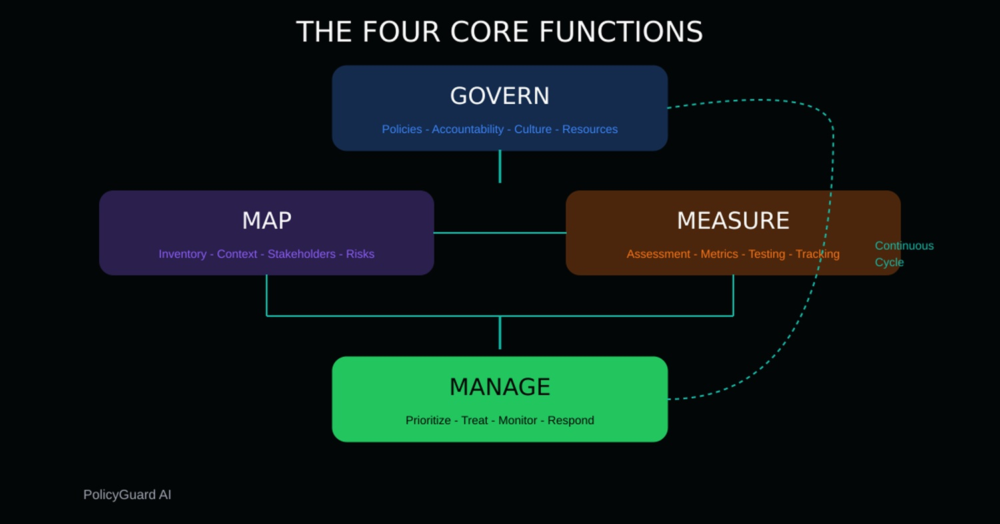
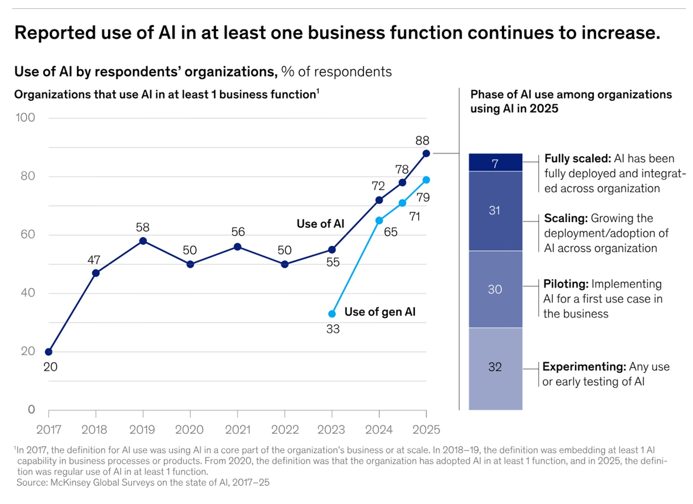

# 10 Regeln für den Einsatz von KI im Unternehmen

*Beginnen wir mit einer Zahl, die uns den Spiegel vorhält. Laut dem [McKinsey State of AI Report vom November 2025](https://www.mckinsey.com/capabilities/quantumblack/our-insights/the-state-of-ai) nutzen bereits 88 % der Organisationen KI in mindestens einer Geschäftsfunktion. Doch im selben Zeitraum schätzten das Weltwirtschaftsforum und Accenture, dass weniger als 1 % dieser Unternehmen einen verantwortungsvollen KI-Ansatz vollständig operativ umgesetzt haben, während 81 % in den embryonalsten Phasen der Governance-Reife verharren. Das Paradoxon ist perfekt: Fast alle nutzen KI, fast niemand steuert sie wirklich.*

Die brennendste Bestätigung liefert [eine EY-Umfrage vom Februar 2026](https://www.ey.com/en_us/newsroom/2026/03/ey-survey-autonomous-ai-adoption-surges-at-tech-companies-as-oversight-falls-behind) unter 500 Technologie-Führungskräften: 45 % gaben an, dass ihre Organisation in den letzten zwölf Monaten einen bestätigten oder vermuteten Abfluss sensibler Daten erlitten hat. Verursacht wurde dies durch Mitarbeiter, die nicht autorisierte generative KI-Tools wie ChatGPT, Claude oder Gemini nutzten – oft wurden sensible Unternehmensdaten in einen Prompt kopiert, ohne dass die IT-Abteilung davon wusste. Der [PEX Report 2025/26](https://www.aidataanalytics.network/data-science-ai/news-trends/less-than-half-of-businesses-have-an-ai-governance-policy) vervollständigt das Bild: Nur 43 % der Organisationen verfügen über eine formelle KI-Governance-Richtlinie, während fast ein Drittel (29 %) überhaupt keine hat.

Dieser Artikel soll keine Belehrung von oben herab sein. Er gleicht eher jenem nützlichen Gespräch, das man mit einem Kollegen vor einer wichtigen Entscheidung führt: Etwas, das hilft zu verstehen, worauf man sich einlässt, mit konkreten Beispielen und überprüfbaren Referenzen. Zehn Regeln, zehn Kontrollen, zehn Fehler, die man nicht wiederholen sollte.

## Zuallererst: KI-Sicherheit ist nicht IT-Sicherheit mit einem neuen Hut

Wer im IT-Bereich arbeitet, weiß, dass es bereits ein bewährtes Arsenal an Werkzeugen zum Schutz von Systemen gibt: Firewalls, Identitätsmanagement, Verschlüsselung, Schwachstellenanalysen. Das Problem ist, dass KI eine Risikooberfläche einführt, die diese Werkzeuge nicht sehen.

Ein Sprachmodell kann falsche Antworten mit der gleichen Überzeugung produzieren wie korrekte – ein Phänomen, das in Fachkreisen als Halluzination bezeichnet wird und in Unternehmenskontexten zu falschen Entscheidungen führen kann, die auf erfundenen Informationen basieren. Ein RAG-System (Retrieval-Augmented Generation), das auf interne Dokumente zugreift, kann durch eine versteckte Anweisung in einer scheinbar harmlosen Datei manipuliert werden: Das ist das, was die [OWASP LLM Top 10](https://www.promptfoo.dev/docs/red-team/owasp-llm-top-10/) als *Prompt Injection* bezeichnen, was 2025 bereits in realen Umgebungen ausgenutzt wurde. Die Daten, die Sie in das System eingeben, können gespeichert, protokolliert oder an externe Infrastrukturen gesendet werden, die Sie nicht kontrollieren.

Das [NIST AI Risk Management Framework](https://blog.getpolicyguard.com/nist-ai-rmf-implementation-guide/), das aktualisiert und zunehmend als globaler Referenzrahmen übernommen wird, organisiert die Reaktion auf diese Risiken in vier Funktionen: *Govern, Map, Measure, Manage*. Dies sind keine sequenziellen Schritte, sondern Räder, die sich kontinuierlich drehen. Und genau hier sollte man ansetzen.

## Governance vor Technologie

Vor jedem Werkzeug bedarf es einer klaren Antwort auf drei Fragen: Wer entscheidet, was mit KI im Unternehmen gemacht werden darf? Wer haftet, wenn etwas schiefgeht? An wen wird das Problem eskaliert?

ISO/IEC 42001, der im Dezember 2023 veröffentlichte und bereits von [KPMG](https://kpmg.com/ch/en/insights/artificial-intelligence/iso-iec-42001.html) und anderen großen Beratungsunternehmen als Referenz übernommene internationale Standard für KI-Managementsysteme, beantwortet diese Fragen mit einem einfachen Konzept: Es braucht ein *KI-Managementsystem* mit benannten Rollen, dokumentierten Prozessen und kontinuierlichen Verbesserungszyklen. Das ist keine Bürokratie um ihrer selbst willen: Es ist der Weg, um nicht mitten in einem Vorfall dazustehen und nicht zu wissen, wer die Befugnis hat, das System abzuschalten.

ISO/IEC 42001:2023 bleibt der geltende Standard und die zertifizierbare Referenz für KI-Managementsysteme. Es ist jedoch erwähnenswert, dass die ISO im April 2025 [ISO/IEC 42005:2025](https://www.aarc-360.com/understanding-iso-iec-42005-2025/) veröffentlicht hat – einen ergänzenden Standard, der sich speziell den Folgenabschätzungen von KI-Systemen widmet. Dieses Werkzeug hilft dabei, die sozialen und individuellen Auswirkungen von KI über den gesamten Lebenszyklus hinweg zu messen, nicht nur die technischen Risiken. Er ist für die 42001-Zertifizierung nicht obligatorisch, schließt aber in der Praxis genau die Lücke zwischen „wir haben eine Governance“ und „wir wissen, was unser System konkret bei den Menschen bewirkt“.

### Das unsichtbare Problem: Shadow AI

Noch bevor wir über die Risikoklassifizierung sprechen, gibt es ein Phänomen, das man explizit benennen sollte, da es am weitesten verbreitet ist und am wenigsten überwacht wird: *Shadow AI*. Es funktioniert genau wie die Shadow IT der 2000er Jahre, als Mitarbeiter begannen, private Dropbox- und Gmail-Accounts für Arbeitsdateien zu nutzen, weil die Unternehmenstools langsam waren – nur dass die Folgen unmittelbarer und weniger umkehrbar sind.

Ein Mitarbeiter im Finanzsektor, der eine nicht konsolidierte Bilanz in ChatGPT kopiert, um sich beim Schreiben eines Kommentars helfen zu lassen; ein Recruiter, der Lebensläufe von Kandidaten in ein externes Tool hochlädt, um eine Vorauswahl treffen zu lassen; ein Anwalt, der einen Consumer-LLM nutzt, um eine Vertragsklausel zu entwerfen: In all diesen Fällen verlassen die Daten die Unternehmensinfrastruktur, landen auf Servern von Drittanbietern mit Aufbewahrungsrichtlinien, die das Unternehmen nicht ausgehandelt hat, und tragen potenziell zum Training zukünftiger Modelle bei. Die eingangs zitierte EY-Zahl – 45 % Datenlecks durch nicht autorisierte Tools – ist keine Ausnahme, sondern die stille Norm.

Die Antwort lautet nicht, alles zu verbieten, denn unkontrollierte Verbote funktionieren nicht, wie die Geschichte der Shadow IT lehrt. Die Antwort ist der Aufbau von gesteuerten Alternativen, die gut genug sind, dass die Menschen nicht nach externen Lösungen suchen müssen, begleitet von einer klaren Richtlinie darüber, was erlaubt ist, mit welchen Werkzeugen und unter welchen Bedingungen. Dies ist genau der Ausgangspunkt der KI-Governance.

[Bild entnommen von blog.getpolicyguard.com](https://blog.getpolicyguard.com/nist-ai-rmf-implementation-guide/)

## Regel 1 — Klassifizieren Sie die Anwendungsfälle nach Risikostufe vor dem Deployment

Nicht jeder Einsatz von KI ist gleich. Ein interner Chatbot zur Beantwortung von Urlaubsfragen ist etwas anderes als ein System, das HR-Kandidaten bewertet oder Kunden eine Kreditwürdigkeit zuweist. Das [NIST AI RMF](https://blog.getpolicyguard.com/nist-ai-rmf-implementation-guide/) nutzt die Funktion *Map* genau dafür: Erstellung eines Inventars der verwendeten KI-Systeme und deren Klassifizierung nach der Stufe der potenziellen Auswirkungen.

Der [EU AI Act](https://www.lw.com/en/insights/eu-ai-act-obligations-for-deployers-of-high-risk-ai-systems), der bis August 2027 für Hochrisiko-Anwendungen voll anwendbar sein wird, identifiziert als Hochrisiko-Systeme solche, die für die Auswahl und Überwachung von Mitarbeitern, für die Kreditvergabe und für das Profiling von Einzelpersonen eingesetzt werden. Für jeden dieser Fälle steigen die Anforderungen erheblich: Folgenabschätzung, menschliche Aufsicht, Protokollierung, Meldung von Vorfällen.

Ein konkretes Beispiel: Wenn Ihr Unternehmen einen LLM nutzt, um Recruiter bei der Vorauswahl von Lebensläufen zu unterstützen, ist dieses System nach dem EU AI Act ein Hochrisiko-System. Wenn dasselbe Modell nur zur Erstellung von Entwürfen für Stellenbeschreibungen verwendet wird, ist das Risiko viel geringer. Die Klassifizierung muss von Fall zu Fall erfolgen, nicht nach der allgemeinen Werkzeugkategorie.

## Regel 2 — Begrenzen Sie die Daten, die in das System fließen

Hier gilt das gleiche Prinzip wie bei einer Diät: Nicht alles, was man essen kann, sollte man auch essen. Im KI-Bereich nennt man das *Datenminimierung*, und es ist der erste Schutz gegen das Risiko des *Data Leakage*.

Der im [Mai 2025 von CISA, NSA und FBI veröffentlichte Leitfaden](https://www.insidegovernmentcontracts.com/2025/06/cisa-releases-ai-data-security-guidance/) ist explizit: Organisationen müssen Daten klassifizieren, bevor sie sie in KI-Systemen verwenden, strenge Zugriffskontrollen anwenden und niemals davon ausgehen, dass Datensätze sauber und frei von bösartigen Inhalten sind. Derselbe Leitfaden führt das Konzept der *Data Provenance* ein: Zu wissen, woher die Daten stammen, mit denen das Modell arbeitet, ist keine Formalität, sondern eine Sicherheitsanforderung.

In der Praxis: Legen Sie per Richtlinie fest, welche Datenkategorien niemals in ein KI-System gelangen dürfen (Geschäftsgeheimnisse, Zugangsdaten, nicht unbedingt erforderliche personenbezogene Daten, Informationen, die regulatorischen Beschränkungen unterliegen). Ein nützliches Beispiel für den Finanzsektor: Nicht konsolidierte Bilanzdaten sollten niemals als Kontext in einem allgemeinen Unternehmens-Chatbot verwendet werden, der für die gesamte Organisation zugänglich ist.

## Regel 3 — Steuern Sie Anbieter, Modelle und Integrationen

Unternehmens-KI ist selten ein monolithisches System, das Sie vollständig kontrollieren. Meist ist es eine Zusammenstellung: eine SaaS-Plattform, ein Basismodell eines Dritten, Plugins, externe Tools, die über APIs verbunden sind. Jede dieser Komponenten ist ein potenzieller Eintrittspunkt für Risiken, die Sie nicht direkt bewertet haben.

Der [gemeinsame CISA-Leitfaden von 2025](https://www.insidegovernmentcontracts.com/2025/06/cisa-releases-ai-data-security-guidance/) widmet den Risiken der *Daten-Lieferkette* einen ganzen Abschnitt, mit besonderem Augenmerk auf *Data Poisoning*: die Manipulation von Trainingsdaten durch böswillige Akteure, die durch aus dem Web gesammelte Datensätze, gezielt zurückgekaufte abgelaufene Domains oder das Einschleusen falscher Beispiele in die für das Fine-Tuning verwendeten Korpora erfolgen kann.

Die praktische Kontrolle ist eine strukturierte Anbieterbewertung: Prüfen Sie für jeden Anbieter von KI-Komponenten, wo die Protokolle der Interaktionen gespeichert werden, ob und wie Ihre Daten zum Trainieren von Modellen verwendet werden und welche vertraglichen Garantien für die Datenverarbeitung bestehen. ISO/IEC 42001 sieht explizit die *Überwachung von Drittanbietern* als Anforderung an das Managementsystem vor.

## Regel 4 — Testen Sie das System vor der Freigabe

Kein KI-System sollte in Produktion gehen, ohne einen Testzyklus durchlaufen zu haben, der Missbrauchsszenarien einschließt. Der EU AI Act fordert dies für Hochrisiko-Systeme explizit als Teil des *Qualitätsmanagementsystems*: Prüfungen auf Genauigkeit, Robustheit, Bias und unerwartetes Verhalten vor dem Go-live.

*Red Teaming*, also die Simulation von Angriffen und unsachgemäßem Gebrauch durch ein internes oder externes Team, ist keine Praxis, die nur großen Tech-Unternehmen vorbehalten ist. Werkzeuge wie [Promptfoo](https://www.promptfoo.dev/docs/red-team/owasp-llm-top-10/) ermöglichen es, Tests basierend auf den OWASP LLM Top 10 auch ohne ein spezielles Sicherheitsteam zu automatisieren.

Ein konkretes Beispiel für den Kundenservice: Bevor Sie einen konversationellen Assistenten freigeben, der Zugriff auf Kundendaten hat, prüfen Sie systematisch, ob er auf Benutzer mit Namen unterschiedlicher kultureller Herkunft unterschiedlich reagiert (Bias-Test), ob er Informationen über andere als den authentifizierten Benutzer preisgibt (Leakage-Test) oder ob er durch ausgefeilte Prompts dazu gebracht werden kann, Systemanweisungen zu ignorieren (Jailbreak-Test).

## Regel 5 — Schützen Sie sich vor Prompt Injection und gefährlichem Output

Dies ist die technischste Regel, aber es lohnt sich, sie zu verstehen, da sie auch am meisten unterschätzt wird. *Prompt Injection* funktioniert so: Ein Benutzer oder ein externer Inhalt, den das Modell liest, fügt Anweisungen ein, die die ursprünglichen Systemanweisungen überschreiben. Das Modell unterscheidet nicht zwischen den Anweisungen seines Betreibers und den injizierten – es führt beide aus und bevorzugt oft die neueren.

Die [OWASP LLM Top 10](https://www.promptfoo.dev/docs/red-team/owasp-llm-top-10/), das Referenzdokument für die Sicherheit von Sprachmodellen, führt dies als Risiko Nummer eins auf. Zu den operativen Gegenmaßnahmen gehören: architektonische Trennung von Systemanweisungen und Benutzereingaben, Begrenzung der Werkzeuge, auf die das Modell Zugriff hat (ein Assistent, der Fragen zu Produkten beantwortet, muss keine E-Mails senden oder Datenbanken ändern können), Anwendung von Filtern auf den Output, um Antworten abzufangen, die sensible strukturierte Daten enthalten.

Das Zeitalter der Agenten hat bereits begonnen, und wir sind über Chatbots und Copiloten hinaus: Agenten beantworten nicht nur eine Frage, sondern führen Handlungssequenzen aus, navigieren auf Websites, lesen und schreiben Dateien, rufen APIs auf, senden E-Mails – mit minimaler oder gar keiner menschlichen Aufsicht. Der [Deloitte Report State of AI in the Enterprise vom Januar 2026](https://www.deloitte.com/us/en/what-we-do/capabilities/applied-artificial-intelligence/content/state-of-ai-in-the-enterprise.html) schätzt, dass heute nur jedes fünfte Unternehmen über ein ausgereiftes Governance-Modell für autonome KI-Agenten verfügt, während deren Einsatz in den nächsten zwei Jahren deutlich zunehmen wird.

In diesem Zusammenhang ist das Prinzip des geringsten Privilegs keine bloße Empfehlung mehr, sondern eine Überlebensbedingung: Ein Agent mit unbegrenztem Zugriff auf Werkzeuge, Daten und Kommunikationskanäle kann schnell und automatisch Schäden anrichten, die nur schwer rückgängig zu machen sind. Bevor Sie ein agentisches System einsetzen, sollten Sie sich fragen: Wenn dieser Agent die Anweisung auf die denkbar falschste Weise missversteht, was passiert dann?

[Bild entnommen von mckinsey.com](https://www.mckinsey.com/capabilities/quantumblack/our-insights/the-state-of-ai)

## Regel 6 — Behalten Sie eine reale menschliche Aufsicht bei, nicht nur eine formelle

Es gibt eine inhaltsleere Version der *Human Oversight*: Man setzt eine Unterschrift unter ein Dokument, das besagt, dass ein Mensch die Entscheidung überwacht hat, obwohl in Wirklichkeit niemand etwas geprüft hat. Der EU AI Act ist in den Artikeln über die Pflichten der Betreiber von Hochrisiko-Systemen in diesem Punkt sehr spezifisch: Die menschliche Aufsicht muss substanziell sein, nicht dekorativ. Die mit der Aufsicht betrauten Personen müssen die Kompetenz haben, die Ergebnisse zu interpretieren, die Fähigkeit, das System zu stoppen, und die Befugnis, dies zu tun.

Die praktische Unterscheidung, die in jedem kritischen Prozess schriftlich festzulegen ist, lautet: Die KI schlägt vor, der Mensch entscheidet. Nicht „die KI entscheidet und der Mensch kann widersprechen“, denn die psychologischen Kosten des Widerstands gegen ein automatisches System sind bereits durch die Forschung belegt: Menschen neigen dazu, Vorschläge automatischer Systeme zu akzeptieren, selbst wenn sie Zweifel haben, insbesondere unter Zeitdruck. In den Bereichen Personalwesen, Finanzen, Compliance und Gesundheit ist diese Dynamik nicht akzeptabel.

## Regel 7 — Überwachen Sie das System nach dem Go-live

Der Start ist nicht das Ziel, sondern der Anfang. KI-Systeme verschlechtern sich im Laufe der Zeit aus Gründen, die nicht immer offensichtlich sind: Die Sprache der Benutzer ändert sich, die Eingabedaten verschieben sich gegenüber der ursprünglichen Verteilung (das nennt der [CISA-Leitfaden](https://www.insidegovernmentcontracts.com/2025/06/cisa-releases-ai-data-security-guidance/) *Data Drift*), Missbrauchsmuster entwickeln sich weiter. Es braucht ein Protokollierungssystem, das stichprobenartig Outputs erfasst, automatische Alarme, wenn Qualitätsmetriken von der Baseline abweichen, und einen Incident-Response-Prozess, der die Frage beantwortet: Wenn das System heute Nacht etwas Falsches tut, wer bemerkt es und in welcher Zeit?

Der EU AI Act verlangt für Hochrisiko-Systeme die Aufbewahrung von Protokollen für mindestens sechs Monate und die Benachrichtigung der Behörden bei schwerwiegenden Vorfällen. ISO/IEC 42001 sieht regelmäßige Überprüfungen des Managementsystems vor. Das NIST AI RMF besteht in der Funktion *Manage* auf einer aktiven Überwachung, die den Verbesserungszyklus speist.

## Regel 8 — Dokumentieren Sie alles, wirklich alles

Was nicht dokumentiert ist, ist nicht steuerbar. Dieser Satz klingt offensichtlich, wird aber im operativen Alltag systematisch ignoriert. Die Dokumentation eines KI-Systems ist nicht das Benutzerhandbuch: Es ist die Gesamtheit der genehmigten Richtlinien, Risikobewertungen, Testergebnisse, Versionen des in Produktion befindlichen Modells, getroffenen Entscheidungen und deren Begründungen.

Diese Dokumentation dient drei konkreten Zwecken: dem Nachweis der regulatorischen Konformität im Falle eines Audits, dem Verständnis dafür, was sich geändert hat, wenn etwas nicht mehr funktioniert, und der Verbesserung des Systems im Laufe der Zeit durch das Lernen aus Fehlern. Das Format ist nicht vorgeschrieben, aber es muss rückverfolgbar und für diejenigen zugänglich sein, die es benötigen. Ein Verzeichnis der in Produktion befindlichen Modellversionen, geführt in einer manuell aktualisierten gemeinsamen Excel-Datei, ist bereits mehr wert als gar nichts.

Für diejenigen, die diesen Schritt streng strukturieren wollen, bietet [ISO/IEC 42005:2025](https://www.aarc-360.com/understanding-iso-iec-42005-2025/) ein spezifisches Framework für die Dokumentation der Auswirkungen von KI-Systemen, einschließlich sensibler Nutzungen, vorhersehbarer Missbräuche und unbeabsichtigter Anwendungen, das direkt auf die Kontrollen der ISO/IEC 42001 abgebildet ist.

## Regel 9 — Schulung der Personen, die das System nutzen

Menschliches Versagen bleibt eine der größten Risikooberflächen, und Schulung ist der kostengünstigste Schutz dagegen. Doch es gibt eine Zahl, die dieses Prinzip vom allgemeinen gesunden Menschenverstand in einen messbaren strategischen Hebel verwandelt: Laut dem [Report von CSA und Google Cloud vom Dezember 2025](https://cloudsecurityalliance.org/blog/2025/12/18/ai-security-governance-your-maturity-multiplier) schulen 65 % der Organisationen mit einer vollständigen KI-Governance ihr Personal bereits im Umgang mit KI-Tools, gegenüber nur 27 % derer mit lückenhaften Richtlinien und 14 % derer, die sich noch in der Entwicklungsphase befinden. Das ist kein Detail: Schulung ist einer der am stärksten unterscheidenden Indikatoren zwischen denen, die KI wirklich steuern, und denen, die nur Richtlinien schreiben, die niemand liest.

KI-Schulung ist kein obligatorischer einstündiger Kurs, den alle durchklicken, ohne hinzusehen: Sie muss rollenspezifisch sein und drei verschiedene Aspekte abdecken. Der erste ist die korrekte Nutzung der Werkzeuge: wie das System genutzt wird, was man fragen kann, was man niemals eingeben sollte. Der zweite ist das Erkennen der Grenzen: Die Mitarbeiter müssen wissen, dass Sprachmodelle mit großer Bestimmtheit falsch liegen können, und sie müssen die Befugnis haben, dem Output nicht zu trauen, wenn sie begründete Zweifel haben. Der dritte ist das Vorfallmanagement: was zu tun ist, wenn etwas schiefgeht, an wen man es meldet, wie man es dokumentiert. Der EU AI Act fordert explizit eine *AI Literacy Schulung* für alle Nutzer von Hochrisiko-Systemen: Das ist kein regulatorisches Detail, sondern operativer gesunder Menschenverstand mit einer Frist.

## Regel 10 — Aktualisieren Sie die Regeln im Laufe der Zeit

KI ist vielleicht das einzige Feld, in dem Betriebsanweisungen schneller altern als die Systeme, die sie steuern. Ein Anfang 2024 verfasstes Governance-Framework berücksichtigt weder die agentischen Fähigkeiten aktueller Modelle noch die 2025 dokumentierten neuen Angriffsvektoren oder die näher rückenden regulatorischen Fristen des EU AI Acts. Sowohl das [NIST AI RMF](https://blog.getpolicyguard.com/nist-ai-rmf-implementation-guide/) als auch [ISO/IEC 42001](https://kpmg.com/ch/en/insights/artificial-intelligence/iso-iec-42001.html) sind um das Prinzip der kontinuierlichen Verbesserung herum aufgebaut: Richtlinien sollten mindestens einmal im Jahr überprüft werden, und jeder bedeutende Vorfall muss eine sofortige Überprüfung der damit verbundenen Kontrollen auslösen.

Der minimal praktikable Rhythmus ist dieser: jährliche Überprüfung des Gesamtrahmens, halbjährliche Überprüfung der Datenrichtlinien, sofortige Überprüfung nach jedem Vorfall oder jeder relevanten Änderung an den verwendeten Modellen. Das ist kein schwerfälliger Zyklus: Es ist der Unterschied zwischen einer lebendigen Governance und einem Dokument, das niemand aktualisiert.

## Fazit

Um eine Metapher aus *Ghost in the Shell* aufzugreifen – nicht aus dem Hollywood-Film, sondern aus dem Original-Manga von Masamune Shirow: Das Problem ist nie das System an sich, sondern wer es gebaut hat und mit welcher Absicht. Unternehmens-KI funktioniert dann, wenn diejenigen, die sie eingeführt haben, genau wissen, was sie erreichen wollen, die damit verbundenen Risiken kennen und eine Struktur aufgebaut haben, die in der Lage ist zu reagieren, wenn die Dinge nicht wie geplant verlaufen.

Die Frage, die man sich stellen sollte, lautet nicht: „Nutzen wir KI?“ Fast sicher tun wir das. Die Frage ist: „Wissen wir, nach welchen Regeln?“
