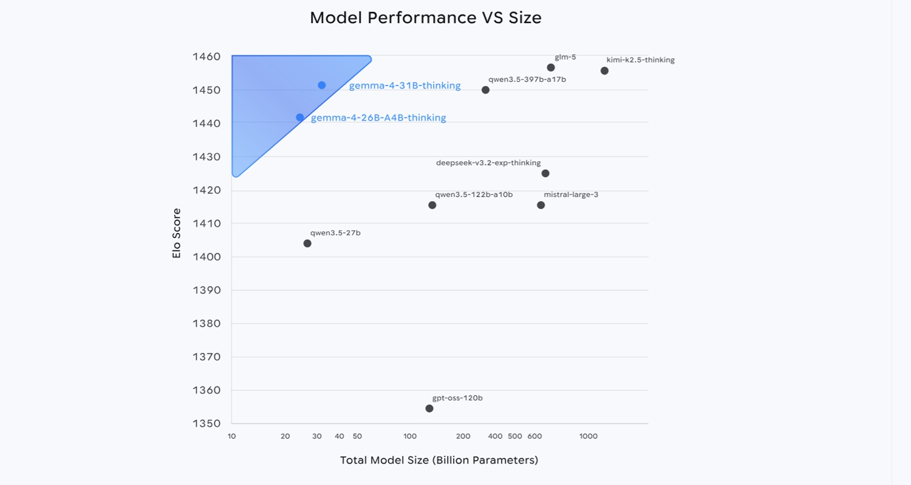
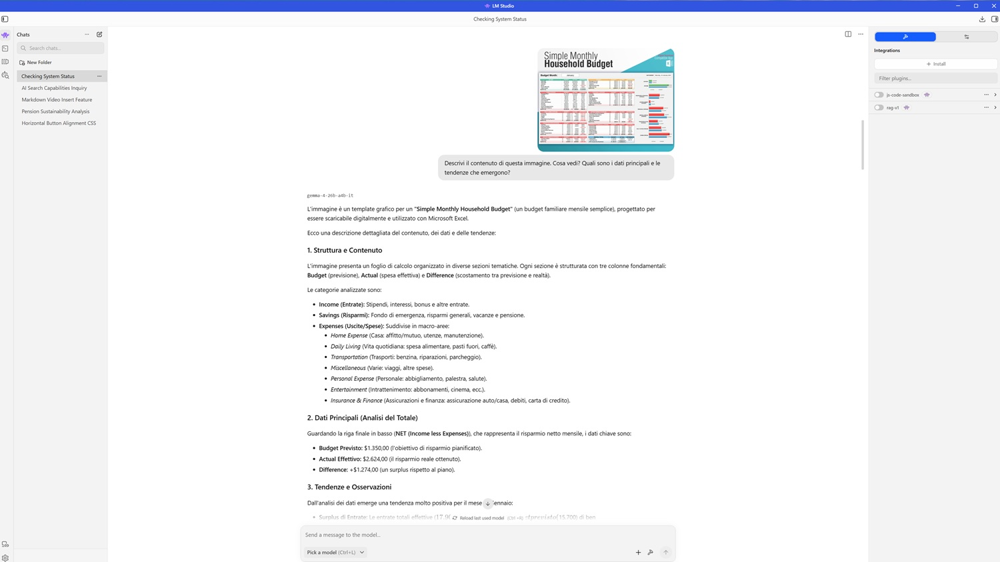
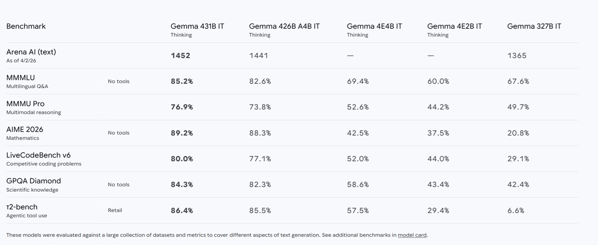
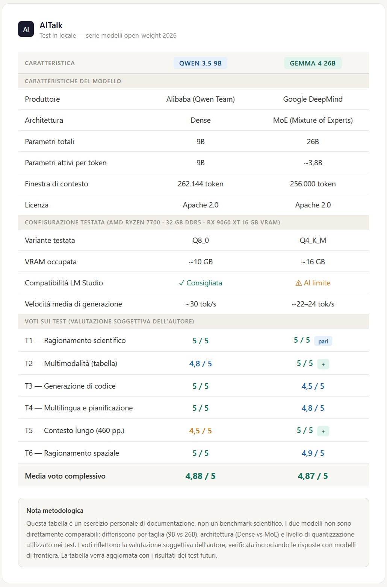

# Gemma 4 in locale: 26 miliardi sul mio PC

*C'è una soddisfazione particolare nel fare girare qualcosa che sarebbe sconsigliato scaricare. Non la soddisfazione dell'hacker che forca un sistema, quella è roba diversa, ma quella più tranquilla e artigianale di chi stringe le viti un po' oltre il serraggio raccomandato e scopre che la struttura regge lo stesso. È il tipo di soddisfazione che ho trovato questa settimana, mentre Gemma 4 26B girava sul mio PC consumer con una fluidità che non mi aspettavo.*

Questo articolo è il secondo di una serie che ho [iniziato qualche settimana fa con Qwen 3.5](https://aitalk.it/it/qwen3.5-locale-puntata1.html). Se avete letto quel pezzo, potete saltare il prossimo paragrafo. Se invece siete qui per la prima volta, vi dò rapidamente le coordinate del progetto.

## Il laboratorio, già noto

L'idea è semplice: prendere modelli aperti appena rilasciati, eseguirli in locale su hardware consumer, e capire cosa si ottiene davvero, al di fuori dei comunicati stampa e dei benchmark di marketing. Lo strumento è [LM Studio](https://lmstudio.ai/), un'applicazione desktop che permette di scaricare e avviare modelli senza aprire un terminale, con l'utilissima caratteristica di mostrare in anticipo una stima delle performance attese sulla propria configurazione hardware. Una discriminante cromatica, verde-arancio-rosso, che risparmia ore di tentativi a vuoto. La macchina è un PC assemblato con criterio ma senza eccessi: processore AMD Ryzen 7700, 32 GB di RAM DDR5, e una GPU AMD Radeon RX 9060 XT con 16 GB di VRAM. Hardware da utente evoluto, non da laboratorio di ricerca.

Il metodo, lo ribadisco qui come ho fatto in apertura del pezzo su Qwen, non è scientifico nel senso accademico del termine. Non c'è un protocollo peer-reviewed, non c'è un campione statisticamente significativo di prompt, non c'è riproducibilità certificata da una conferenza. I test sono stati verificati incrociando i risultati con modelli di frontiera come Claude e DeepSeek, ma questo non li trasforma in benchmark: rimangono prove sul campo, condotte con gli strumenti di un utente esigente. I voti che accompagnano ogni test sono valutazioni personali, non sentenze.

## Gemma 4: la famiglia, l'architettura, la filosofia

Google DeepMind ha rilasciato Gemma 4 il 2 aprile 2026, sotto licenza Apache 2.0. Non è un dettaglio secondario: è la prima volta nella storia della famiglia Gemma che un modello viene rilasciato sotto questa licenza, il che elimina ogni ambiguità sull'uso commerciale e mette Gemma 4 sullo stesso piano permissivo di Qwen 3.5, con cui condivide l'ecosistema open-weight.

La famiglia si articola in quattro varianti: E2B ed E4B, pensate per il deployment su dispositivi mobili e periferici con finestra di contesto da 128.000 token, e le due varianti maggiori, il 26B MoE e il 31B Dense, con finestra di contesto da 256.000 token. Il 31B Dense è il modello di punta in termini di qualità bruta, e al momento del lancio ha conquistato la terza posizione globale sull'Arena AI text leaderboard, non tra i modelli aperti, ma tra tutti i modelli in assoluto. Il 26B MoE si è sistemato al sesto posto.

Sul 26B MoE vale la pena spendere due righe di architettura, prometto di essere breve. Il concetto chiave da tenere a mente per leggere il resto di questo articolo è uno solo: il modello 26B attiva durante l'inferenza solo circa 3,8 miliardi dei suoi parametri totali, il che lo rende significativamente più veloce di quanto il numero complessivo suggerirebbe, avvicinandolo in termini di velocità a un modello da 4 miliardi di parametri. Il prezzo da pagare è che tutti i 26 miliardi di parametri devono comunque stare in memoria. Veloce come un modello piccolo, pesante come uno grande: una cambiale che si paga in VRAM.

I numeri dei benchmark sono impressionanti, in particolare rispetto alla generazione precedente. Il balzo rispetto a Gemma 3 è difficile da ignorare: su AIME 2026 si passa dal 20,8% all'89,2%, su LiveCodeBench dal 29,1% all'80,0%, su GPQA Science dal 42,4% all'84,3%. Non è un'ottimizzazione incrementale. Qualcosa di strutturale è cambiato nel modo in cui questi modelli ragionano.

[Immagine tratta da deepmind.google](https://deepmind.google/models/gemma/gemma-4/)

## La scelta oltre il limite

Venendo al mio esperimento specifico, ho scelto di testare il **Gemma 4 26B A4B Instruct Q4_K_M**, la versione con la quantizzazione più aggressiva disponibile per la variante da 26 miliardi. La scelta è stata deliberatamente al limite: LM Studio segnalava questa configurazione come leggermente fuori dalle capacità consigliate per il mio hardware, indicandola con quel colore arancione che di solito suggerisce di abbassare le aspettative o di ridimensionare la scelta. Ho ignorato il consiglio, non per testardaggine, ma perché testare il limite era esattamente il punto.

La quantizzazione Q4_K_M riduce la precisione numerica dei pesi del modello da 16 bit a circa 4 bit, con una tecnica che cerca di distribuire la perdita di informazione in modo meno uniforme e più intelligente rispetto alle quantizzazioni piatte, preservando meglio i pesi che il modello considera più importanti. Il risultato pratico è un file che occupa circa 16 GB su disco e può appoggiarsi interamente sui 16 GB di VRAM della mia GPU, un equilibrio al limite: la Q4_K_M sul modello 26B MoE usa approssimativamente 16 GB, appena entro i limiti di una GPU consumer come la mia. La perdita di qualità rispetto alla versione completa in bfloat16 è reale, ma quanto reale? Questo è uno dei sottotesti dell'intero esperimento.

Ho scelto deliberatamente gli stessi sei test usati con Qwen 3.5, non perché i due modelli siano paragonabili in senso stretto (uno è un 9B denso, l'altro un 26B MoE), ma per mantenere una coerenza metodologica minima che permettesse almeno osservazioni qualitative. Non è un confronto testa a testa. È più simile a misurare la temperatura con lo stesso termometro in due città diverse: i numeri sono comparabili, le città no.

## Sei prove, sei verdetti

### Ragionamento scientifico: il meccanismo di Higgs — 5/5

Il primo test è quello che uso come termometro generale dell'intelligenza del modello: spiegare il meccanismo di rottura della simmetria elettrodebole nel Modello Standard, il ruolo del campo di Higgs, e perché i bosoni W e Z acquisiscono massa mentre il fotone rimane senza. Richiesta esplicita: linguaggio preciso ma accessibile a uno studente universitario di fisica.

La risposta mi ha sorpreso, non tanto per la correttezza dei contenuti, quanto per la qualità espositiva. Il modello ha organizzato la spiegazione in quattro sezioni logiche con la struttura che userebbe un buon docente universitario, partendo dall'invarianza di gauge, passando per il potenziale a "cappello messicano" con la condizione sul segno del termine di massa, fino alle conseguenze fisiche concrete. Le formule erano riportate correttamente, il gruppo di gauge SU(2)_L × U(1)_Y, il valore di aspettazione nel vuoto, le masse dei bosoni. Ma la vera forza era la capacità di accompagnare ogni formula con un'immagine mentale comprensibile. Quando il modello scriveva che i gradi di libertà angolari vengono "mangiati" dai bosoni di gauge, stava traducendo un concetto matematico astratto in qualcosa che un fisico del secondo anno riconosce subito. È la differenza tra un dizionario e un professore.

Un dettaglio tecnico vale la pena segnalare: nonostante la complessità del ragionamento e la lunghezza della risposta, il modello ha ragionato per soli 2,2 secondi e generato il testo a circa 24 token al secondo. Per un modello che teoricamente pesa 26 miliardi di parametri, è una velocità sorprendente, resa possibile proprio dall'architettura MoE che tiene inattiva la maggior parte dei pesi durante la generazione. **Voto: 5/5.**

### Multimodalità: leggere un foglio di calcolo sfocato — 5/5

Il secondo test era pensato per mettere alla prova le capacità visive con un input deliberatamente difficile: una foto piccola e non nitida di un foglio di calcolo per il budget familiare mensile, con richiesta di descrivere il contenuto, i dati principali e le tendenze emergenti.

Il modello ha impiegato circa dieci secondi per analizzare l'immagine, un tempo sensibilmente più lungo rispetto al test precedente, comprensibile per un compito visivo, prima di avviare la generazione a circa 23 token al secondo. La risposta era notevolmente completa: ha identificato correttamente la struttura del documento, un template Excel con sezioni per entrate, risparmi e uscite, ciascuna con colonne Budget, Actual e Difference. Ha letto i valori numerici chiave con precisione millimetrica, risparmio netto mensile con budget previsto di 1.350 dollari, effettivo di 2.624 dollari, differenza positiva di 1.274 dollari. Ha persino notato la presenza di un grafico a barre orizzontali sulla destra del foglio.

Ma la parte che ha confermato che non si trattava di semplice trascrizione era l'analisi: il modello ha osservato autonomamente che nonostante l'aumento delle entrate, le spese totali effettive erano rimaste vicine al budget previsto, e ne ha tratto una conclusione logica sull'efficienza del risparmio. Da un'immagine sfocata a un'analisi di flusso di cassa. **Voto: 5/5.**

Immagine tratta dal mio PC durante i test su LMStudio

### Codice: un problema NP-hard con autocorrezione — 4,5/5

Il terzo test era il più tecnico: implementare in Python un algoritmo per trovare il ciclo di lunghezza massima in un grafo non orientato, gestendo grafi con cicli multipli e spiegando la complessità temporale.

Gli aspetti positivi erano notevoli. Il modello ha dichiarato senza esitazione che il problema è NP-hard, che non esiste un algoritmo polinomiale per risolverlo su grafi generici, e ha scelto il backtracking con ricerca in profondità come approccio corretto, quello che userebbe chiunque abbia studiato algoritmi seriamente. La rappresentazione tramite lista di adiacenza con dizionario era efficiente, la logica di esplorazione dei cammini semplici corretta, la spiegazione della complessità temporale chiara e onesta.

Tuttavia, la prima versione del codice conteneva tre errori sintattici: una parola chiave scritta come `not be in` invece di `not in`, un nome di variabile sbagliato in una chiamata a metodo, e un'altra variabile scritta in modo errato nel controllo della condizione di ciclo. Tre errori che, da soli, avrebbero impedito l'esecuzione senza intervento manuale.

Qui arriva però la parte più interessante della valutazione. Quando ho chiesto al modello, in modo generico e senza indicare quali fossero gli errori, di controllare il codice per eventuali problemi di sintassi, ha identificato e corretto tutti e tre al primo tentativo. In altre parole, sapeva già come doveva essere scritto il codice corretto: semplicemente non lo aveva scritto con sufficiente attenzione la prima volta. Questo comportamento rispecchia l'uso realistico di questi strumenti: raramente un programmatore si affida ciecamente alla prima versione generata. La capacità di diagnosticare i propri errori su sollecitazione generica è quasi altrettanto preziosa della scrittura iniziale perfetta. Quasi. **Voto: 4,5/5.**

### Multilingua e pianificazione: Giappone in francese — 4,8/5

Il quarto test valutava capacità multilingua e pianificazione complessa: agire da agente di viaggio, pianificare un itinerario di cinque giorni in Giappone per un cliente francese che non parla inglese, con focus su templi storici e cibo di strada, più una sezione finale in italiano con consigli per un turista italiano.

Il francese era impeccabile, fluente e privo di errori, con un tono professionale ma non freddo. La pianificazione dell'itinerario era logisticamente realistica: il primo giorno ad Asakusa con il Senso-ji e un'izakaya la sera, il secondo tra il santuario Meiji-jingu e Shibuya, il terzo in shinkansen a Kyoto con il Kiyomizu-dera e Gion, il quarto al Padiglione d'Oro e alla foresta di bambù di Arashiyama, il quinto al Fushimi Inari. Ogni giornata bilanciata tra sito storico ed esperienza gastronomica, come richiesto. La conoscenza del Giappone era sorprendentemente dettagliata: citazioni di luoghi come Sannenzaka e Ninenzaka, cibi specifici come gli Age-manju, consigli pratici sulla carta Suica e sull'applicazione Japan Transit, la menzione dei Depachika, i piani interrati dei grandi magazzini giapponesi, un dettaglio da insider che non si trova nelle guide turistiche generiche.

Tuttavia, la sezione finale in italiano presentava due errori che non possono essere ignorati. Il primo era "suggeramenti" al posto di "suggerimenti", un termine che in italiano semplicemente non esiste. Il secondo era più strano: la parola "comprare" appariva scritta con una desinenza cirillica, "compraть", come se il modello avesse momentaneamente perso il filo della lingua. Due errori in centocinquanta parole di italiano, su una lingua che non è tra le più rare al mondo. Per un modello che dichiara il supporto a oltre 140 lingue, ci si aspetterebbe una maggiore robustezza anche nelle lingue secondarie di una risposta. **Voto: 4,8/5.**

[Immagine tratta da deepmind.google](https://deepmind.google/models/gemma/gemma-4/)

### Contesto lungo: 460 pagine di AI al primo tentativo — 5/5

Il quinto test è quello che considero il più significativo per un uso reale del modello: ho caricato l'[AI Index Report 2025 di Stanford](https://aiindex.stanford.edu/report/), un PDF di circa 460 pagine e oltre 20 milioni di caratteri, lo stesso documento usato nel test con Qwen 3.5. Ho chiesto al modello, in modo generico, di parlarmi della crescita della generazione video e di indicarmi le pagine in cui trovare i dati.

La risposta è arrivata dopo 4,4 secondi di elaborazione, a 22 token al secondo. Il modello ha identificato correttamente le pagine 125, 126 e 127, non un vago rimando al "capitolo centrale", ma riferimenti precisi e verificabili. Ha fornito poi una sintesi strutturata dei contenuti: Stable Video Diffusion di Stability AI, Sora di OpenAI presentato a febbraio 2024 e reso pubblico a dicembre, Movie Gen di Meta con capacità di editing e integrazione audio, Veo e Veo 2 di Google. Ha persino citato il celebre esempio del prompt "Will Smith eating spaghetti", quel test diventato un meme della community AI per documentare i progressi nella generazione video.

Il confronto con l'esperienza su Qwen 3.5 è illuminante: il modello da 9 miliardi aveva richiesto quattro tentativi e una sollecitazione esplicita a rispondere in chat per ottenere un risultato simile. Gemma 4 ha risposto al primo tentativo, senza esitazioni. La finestra di contesto da 256.000 token si è rivelata non solo una specifica tecnica ma una capacità realmente utilizzabile su hardware consumer. **Voto: 5/5.**

### Ragionamento spaziale: la stanza nel caos — 4,9/5

L'ultimo test era quello che amo di più perché misura qualcosa di difficilmente standardizzabile: l'intelligenza visuo-spaziale. Ho caricato una foto di una stanza in forte disordine, la stessa usata con Qwen 3.5, e ho chiesto di descrivere la disposizione degli oggetti e suggerire come riordinare per creare più spazio. Il modello ha impiegato 7,5 secondi per elaborare, il secondo tempo più lungo dell'intero test.

La risposta si apriva con una frase che non ho capito: "Non sono state trovate citazioni nei file dell'utente per questa richiesta." Una frase fuori contesto, come se il modello avesse attivato un meccanismo di ricerca documentale che non aveva nulla a che fare con il compito visivo. Superata quella stranezza iniziale, tuttavia, il resto della risposta era eccellente.

La descrizione era precisa: letto matrimoniale sulla destra con lenzuola bianche parzialmente coperte, due librerie alte e strette posizionate correttamente in relazione alla finestra e alla scrivania, scrivania grigia sulla sinistra, due finestre con tende a strisce verticali. Ma la parte davvero impressionante era la descrizione degli oggetti a terra: vestiti sparsi, calzature tra cui un paio di infradito, borse, cestini della biancheria, e il dettaglio che uno dei cestini era blu con motivi. Questo livello di osservazione fine è notevole.

L'unica piccola imprecisione riguardava lo specchio: il modello lo collocava su un armadio o una cassettiera, mentre nella foto era montato sulla porta di ingresso. Un errore comprensibile in un'immagine bidimensionale dove la distinzione tra porta e armadio può essere ambigua.

Il piano di riordino era logico e ben motivato: prima i vestiti e i tessuti sul pavimento perché sono l'ostacolo principale alla camminata, poi i cestini e le borse verso una zona dedicata, infine la scrivania e le librerie per ridurre il senso di affollamento visivo. La priorità assegnata a "liberare la superficie calpestabile" era corretta e pratica. **Voto: 4,9/5.**

*Così per sfizio, visto l'impossibilità di comparazione visto la taglia e le caratteristiche diverse, vi propongo una tabella, dove potete fare le vostre valutazioni e scelte a seconda del hardware a disposizione. Pur di taglie diverse i risultati sono molto simili, con preferenze per l'uno o per l'altro a seconda del compito, devo aggiungere tuttavia che in utilizzi successivi Qwen 3.5 9b ha mostrato situazioni di blocco e non risposta, che gemma 4 26b non ha mostrato.*

## Che cosa rimane in mano

La media aritmetica dei sei test è 4,87 su 5. Un numero che va contestualizzato con onestà.

Stiamo parlando di un modello con 26 miliardi di parametri totali, quantizzato alla sua versione più compressa, eseguito su hardware consumer leggermente sottodimensionato rispetto alle specifiche consigliate, in locale, senza cloud, senza API, senza costi per token. Il fatto che giri in modo fluido a velocità che rendono l'interazione reattiva è già di per sé un risultato notevole. Il fatto che risponda con questa qualità lo rende qualcosa di più interessante.

Il confronto con Qwen 3.5 9B, il soggetto del test precedente, non è diretto per la differenza di taglia, ma alcune osservazioni qualitative emergono chiaramente. Gemma 4 gestisce il contesto lungo con una affidabilità superiore, risponde al primo tentativo senza bisogno di sollecitazioni, e mostra una coerenza espositiva più robusta nei compiti complessi. Paga invece qualcosa sul fronte della perfezione sintattica nel codice alla prima generazione, e mostra qualche fragilità nelle lingue secondarie all'interno della stessa risposta. Non è un trade-off sorprendente per un modello di questa taglia.

La domanda che rimane aperta, e che non rientra nella portata di questo esperimento, è quanto la quantizzazione Q4_K_M abbia effettivamente costato in termini di qualità rispetto alla versione completa. I risultati sono abbastanza alti da rendere difficile stimare quanto margine sia rimasto sul tavolo. Forse molto, forse sorprendentemente poco. Sarebbe un esperimento interessante per chi ha accesso a hardware con più VRAM.

Quello che posso dire con certezza, da appassionato che vuole capire cosa è possibile fare con mezzi normali nel 2026, è che il confine tra "possibile solo su cloud" e "possibile in locale" si è spostato di nuovo. Non di poco. Gemma 4 26B MoE, anche nella sua versione più compressa, su hardware che molti utenti avanzati già possiedono, produce risposte che fino a qualche mese fa avrebbero richiesto una chiamata API a un modello di frontiera. Questo è il dato che trovo più significativo, più di qualsiasi singolo voto.

Una cosa è certa: quella che a gennaio indicavo come la tendenza dell'anno, la corsa agli [Small Language Model in locale](https://aitalk.it/it/slm-2026.html), non sta semplicemente confermandosi, sta bruciando le tappe. E siamo solo ad aprile.