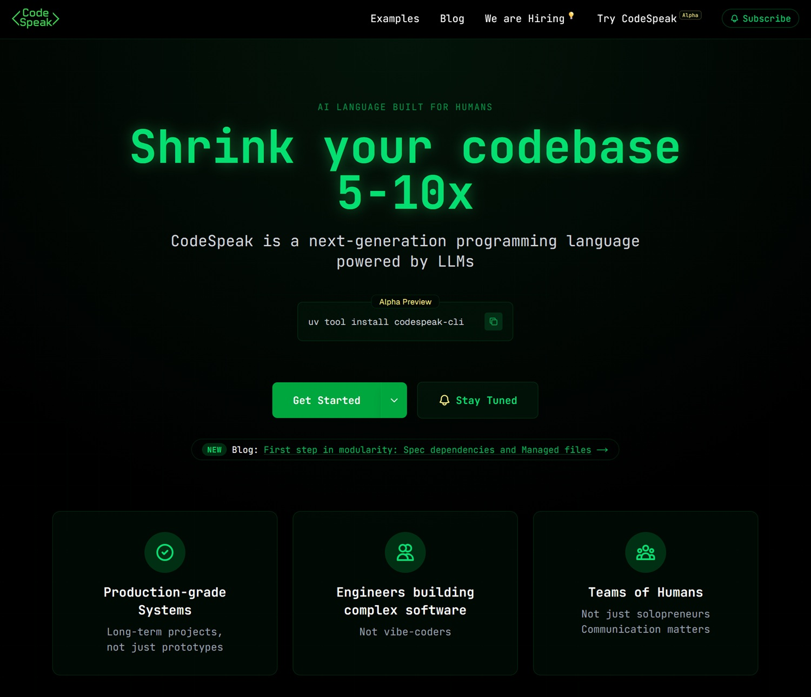
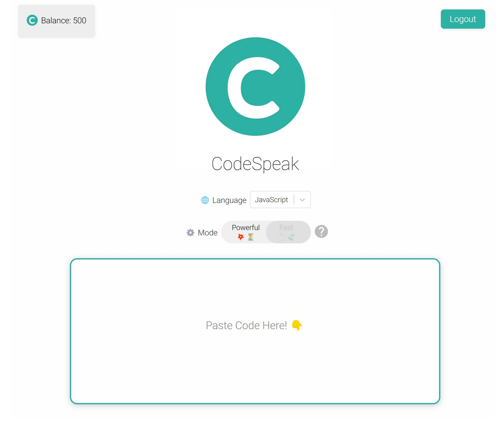
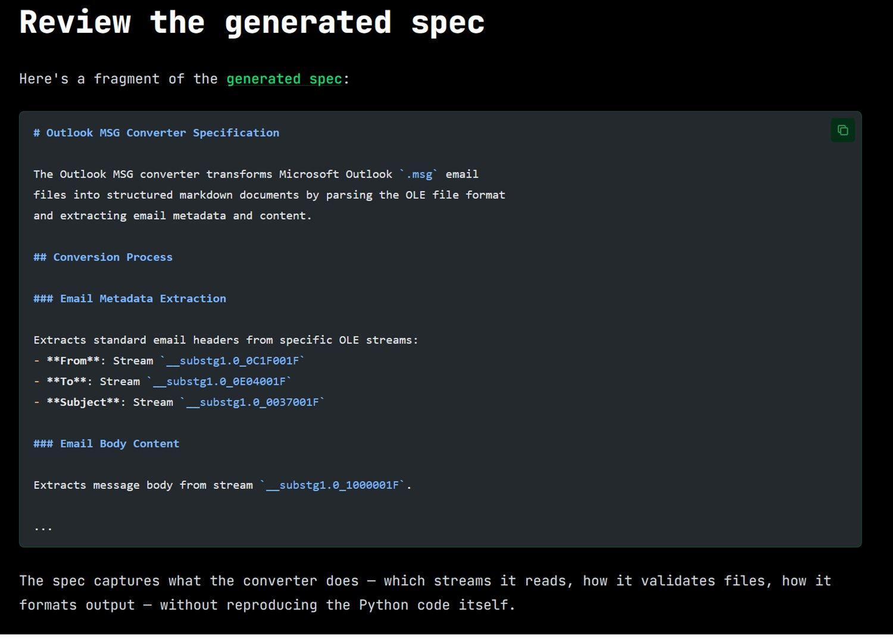

# Il codice che non si scrive: CodeSpeak e la rivoluzione delle specifiche

*Ci sono nomi che nel mondo della programmazione portano un peso specifico. Andrey Breslav è uno di questi. Se oggi milioni di sviluppatori Android scrivono codice in Kotlin anziché in Java, è in buona parte merito suo: Breslav è il progettista principale del linguaggio che JetBrains lanciò nel 2011 e che Google adottò ufficialmente come linguaggio preferito per Android nel 2017, durante il Google I/O che cambiò l'ecosistema mobile per sempre. Non è un accademico che teorizza da una cattedra: è uno di quelli che hanno costruito strumenti usati ogni giorno da centinaia di migliaia di persone nel mondo reale, con tutti i compromessi, i bug di produzione e le pressioni che questo comporta.*

Questa premessa non è un omaggio fine a se stesso. Serve a capire perché il suo nuovo progetto, [CodeSpeak](https://codespeak.dev/), meriti attenzione ben oltre i confini delle solite anteprime di linguaggi sperimentali che proliferano su GitHub. Quando Breslav dice di voler ripensare il modo in cui gli esseri umani interagiscono con il codice nell'era degli agenti AI, lo fa con il bagaglio di chi ha già percorso una volta questa strada e sa dove si nascondono le trappole. Come ha raccontato a Gergely Orosz nel [podcast del Pragmatic Engineer](https://newsletter.pragmaticengineer.com/p/the-programming-language-after-kotlin), la lezione più profonda di Kotlin non riguarda la sintassi o il sistema di tipi, ma l'interoperabilità: un linguaggio nuovo che non riesce a convivere pacificamente con ciò che esiste già è destinato a restare un esperimento. È un principio che ha trasferito direttamente in CodeSpeak.

Il progetto è in Alpha Preview, dettaglio che vale la pena tenere a mente lungo tutta la lettura, ed è costruito attorno a un'idea che, detta in una riga, suona quasi provocatoria: *e se smettessimo di mantenere il codice e iniziassimo a mantenere le specifiche?*

## Spec, non codice: un cambio di paradigma

Per capire cosa propone CodeSpeak, bisogna prima fare un passo indietro e guardare il problema che cerca di risolvere. Chiunque abbia lavorato su un progetto software di media complessità conosce la sensazione: il codice cresce. Cresce quando si aggiungono funzionalità, cresce quando si correggono bug, cresce quando arrivano nuovi sviluppatori che interpretano le specifiche in modo leggermente diverso da chi li ha preceduti. Con l'arrivo degli agenti AI che generano migliaia di righe in pochi secondi, questa crescita rischia di diventare incontrollabile. Non perché il codice generato sia necessariamente sbagliato, ma perché nessuno riesce più a tenerlo in testa nella sua interezza.

Il terreno su cui si innesta CodeSpeak non è neutro. Nel febbraio 2025, Andrej Karpathy, co-fondatore di OpenAI ed ex direttore dell'AI di Tesla, coniò l'espressione vibe coding per descrivere una pratica già diffusissima: dare istruzioni in linguaggio naturale a un agente AI e accettare il codice generato senza leggerlo davvero, affidandosi all'istinto che "funzioni". Il post originale su X raccolse milioni di visualizzazioni in pochi giorni, e l'etichetta entrò persino nel dizionario [Merriam-Webster](https://www.merriam-webster.com/slang/vibe-coding) entro marzo dello stesso anno, velocità che la dice lunga su quanto il fenomeno fosse già reale. CodeSpeak nasce esattamente come risposta strutturata a questa deriva: non nega che gli LLM possano scrivere codice utile, ma sostiene che lasciare gli agenti liberi di generare senza vincoli formali produca codebase che nessuno capisce più davvero.

CodeSpeak propone di spostare il fuoco: invece di scrivere e mantenere il codice di implementazione, il team mantiene dei file di *specifica*, documenti compatti, leggibili da un essere umano, scritti in un Markdown strutturato con una sintassi propria. È il sistema, poi, a occuparsi di tradurre quelle specifiche in codice funzionante, usando un modello di linguaggio (attualmente Claude di Anthropic, il che spiega il requisito di una chiave API) come motore di generazione.

L'analogia più utile, per chi non scrive codice, è quella con i disegni tecnici in architettura. Un architetto non costruisce l'edificio mattone per mattone: disegna le planimetrie, specifica i materiali, definisce le proporzioni e i carichi. Gli operai, o, in questo caso, l'LLM, si occupano dell'esecuzione concreta. Quando l'architetto vuole modificare la disposizione di una stanza, non demolisce e ricostruisce: aggiorna le planimetrie, e il cantiere si adegua. CodeSpeak funziona esattamente così: si modifica la specifica, si lancia `codespeak build`, e il codice viene aggiornato di conseguenza.

Questo approccio si inserisce in un dibattito più ampio che nel mondo dello sviluppo software va sotto vari nomi: *spec-driven development*, *intent-based programming*, o più genericamente l'idea che il prossimo livello di astrazione non siano nuovi linguaggi di programmazione nel senso tradizionale, ma nuovi modi di comunicare l'intento agli agenti AI. La differenza rispetto al semplice "prompt engineering", il dare istruzioni a un chatbot, è che CodeSpeak introduce struttura, versionamento e testabilità. Le specifiche vivono in un repository Git, si tracciano come qualsiasi altro artefatto di codice, e il loro effetto si misura attraverso le suite di test esistenti. Non è vibe coding: è ingegneria del software con un livello di astrazione più alto.

[Immagine tratta da codespeak.dev](https://codespeak.dev/)

## Come funziona: dalla CLI al takeover

Tecnicamente, CodeSpeak si installa con un singolo comando da terminale, `uv tool install codespeak-cli`, e richiede una chiave API Anthropic che l'utente porta con sé (il modello è BYOK, *Bring Your Own Key*). Da lì, il flusso di lavoro si articola in tre modalità principali, pensate per scenari diversi.

La modalità più semplice è quella da zero (*greenfield*): si inizializza un progetto CodeSpeak, si scrivono le specifiche in file Markdown con estensione `.cs.md`, si lancia `codespeak build` e il sistema genera il codice Python corrispondente, esegue i test, e segnala se tutto funziona. Una specifica per un'applicazione CLI per gestire note potrebbe occupare letteralmente dieci righe di testo leggibile, e produrre un'applicazione funzionante completa di comandi, gestione dell'archiviazione e interfaccia da terminale.

La modalità più interessante, e quella che ha più implicazioni pratiche per chi lavora su progetti esistenti, è la *mixed mode*. CodeSpeak non chiede di buttare via il codice che già esiste: può convivere con esso. Si inizializza con `codespeak init --mixed`, e da quel momento il progetto diventa ibrido: alcune parti restano scritte a mano dagli sviluppatori, altre sono gestite dalle specifiche. L'LLM "vede" entrambe le parti durante la generazione, e può usare il codice manuale come contesto per implementare correttamente le specifiche. È un compromesso pragmatico che ricorda, non a caso, la scelta di Kotlin di garantire interoperabilità completa con Java fin dal primo giorno.

Il terzo scenario, introdotto di recente con il comando `codespeak takeover`, è forse il più suggestivo: dato un file di codice esistente, anche legacy, anche scritto anni fa da qualcun altro, CodeSpeak legge il sorgente e ne estrae automaticamente una specifica compatta. Da quel momento, per modificare quel componente non si tocca più il codice Python (o qualsiasi altro linguaggio): si modifica la specifica, e si rilancia il build. Nel [post ufficiale del blog](https://codespeak.dev/blog/codespeak-takeover-20260223) che illustra questa funzionalità, il team ha usato come cavia il progetto open source *MarkItDown* di Microsoft, un convertitore di documenti in Markdown, prendendo il file responsabile della conversione dei file `.msg` di Outlook, estraendone una specifica di poche decine di righe, e poi usando quella specifica per correggere un bug reale segnalato su GitHub. Il tutto senza toccare una sola riga di Python. La modifica alla specifica, aggiungere il supporto per i campi Cc, Bcc, Data e allegati mancanti, era di 23 righe; il codice generato che ne è risultato era di 221 righe. Un rapporto di circa 10 a 1.

## Modularità: quando le specifiche diventano un sistema

Un linguaggio che funziona solo per progetti piccoli è un esperimento da laboratorio. Per diventare uno strumento professionale, deve scalare. Ed è qui che entrano in gioco le feature di modularità che il team ha rilasciato il 9 marzo 2026 con la versione 0.3.4: le [*spec dependencies*](https://codespeak.dev/blog/modularity-20260309) e i *managed files*.

L'idea delle spec dependencies è analoga a quella dei moduli nel codice tradizionale: una specifica può dichiarare di dipendere da un'altra attraverso una semplice direttiva nel frontmatter del file Markdown. Se la specifica dell'interfaccia a riga di comando di un'applicazione dipende dalla specifica dello strato di archiviazione dei dati, CodeSpeak costruisce prima lo strato di archiviazione, poi l'interfaccia, garantendo che il secondo possa usare correttamente ciò che il primo fornisce. E se si modifica solo la specifica dello storage (cambiando, per esempio, il backend da JSON a SQLite con una sola riga di testo), CodeSpeak ricostruisce solo quella parte, senza toccare il resto.

I *managed files* sono invece un meccanismo di governance: ogni specifica "conosce" quali file di codice sono sotto la sua responsabilità. Quando durante un build CodeSpeak ha bisogno di modificare un file che non appartiene alla specifica corrente, per esempio, il file di configurazione delle dipendenze del progetto, lo fa, ma avvisa esplicitamente lo sviluppatore. L'intera logica ricorda la distinzione tra proprietà e accesso nei sistemi di controllo degli accessi: ciascuna specifica ha il suo dominio, e le invasioni di campo vengono segnalate, non silenziosamente tollerate. Per team che lavorano su basi di codice grandi e complesse, è una garanzia non banale contro gli effetti collaterali indesiderati delle modifiche.

[Immagine tratta da github.com](https://github.com/kadenoseen/CodeSpeak)

## I numeri: quanto si riduce davvero il codice?

I case study pubblicati sul sito ufficiale sono l'elemento più concreto e verificabile dell'intera proposta. Il team ha preso quattro progetti open source reali, non toy examples costruiti ad hoc, e ha generato le specifiche corrispondenti per porzioni significative del loro codice, misurando la riduzione in termini di righe.

Per [yt-dlp](https://codespeak.dev/shrink-factor/yt-dlp-webvtt), il celebre downloader di video, il componente per la gestione dei sottotitoli WebVTT è passato da 255 righe di codice a 38 righe di specifica, con un fattore di riduzione di 6,7 volte. Per [Faker](https://codespeak.dev/shrink-factor/faker-ssn-italy), la libreria Python per generare dati fittizi, il generatore di codici fiscali italiani è sceso da 165 a 21 righe (7,9 volte). Per [BeautifulSoup4](https://codespeak.dev/shrink-factor/beautifulsoup4-dammit), la libreria per il parsing HTML, il modulo di rilevamento automatico della codifica è il caso più imponente: 826 righe di codice ridotte a 141 di specifica, fattore 5,9. E per MarkItDown, il convertitore di Microsoft già citato, il modulo EML è passato da 139 a 14 righe, con un fattore di 9,9, quasi 10 volte.

Il dato che colpisce più dei numeri assoluti, però, è quello relativo ai test. In tutti e quattro i casi, la suite di test non solo ha continuato a passare dopo la rigenerazione del codice, ma ha visto *aumentare* il numero di test che superano con successo: 37 test aggiunti per yt-dlp, 13 per Faker, 25 per BeautifulSoup4, 27 per MarkItDown. La riduzione del codice non è cosmesi, non si tratta di comprimere il sorgente eliminando commenti e spazi vuoti, ma di eliminare la ridondanza concettuale lasciando che l'LLM si occupi dei dettagli implementativi che sono, come li chiama Breslav, "ovvi per le macchine". Quel che resta nella specifica è solo ciò che è specifico del dominio: le regole di business, le scelte architetturali, i casi limite.

Detto questo, è onesto segnalare un limite metodologico: questi test sono stati condotti dal team stesso di CodeSpeak su porzioni selezionate di progetti open source. Non si tratta di benchmark indipendenti su basi di codice arbitrarie. La domanda su come si comporti il sistema su codice particolarmente intricato, con dipendenze circolari o logica distribuita tra molti file, resta per ora senza una risposta documentata.

## Più umani o meno umani?

C'è una tentazione ricorrente, quando si parla di strumenti AI per lo sviluppo software, di cadere in una delle due trappole simmetriche: o il trionfalismo ("l'AI farà tutto, i programmatori sono obsoleti") o il negazionismo ("è solo un autocomplete glorificato, niente di nuovo sotto il sole"). CodeSpeak non si presta bene a nessuna delle due narrazioni, e questo è probabilmente il suo tratto più interessante.

Per capire come si colloca rispetto agli strumenti già esistenti, vale la pena fare un confronto diretto. GitHub Copilot e i suoi analoghi, Cursor, Junie di JetBrains, e la galassia di assistenti integrati negli IDE, operano sul codice come artefatto primario: suggeriscono righe, completano funzioni, a volte generano blocchi interi. Sono strumenti straordinariamente utili, ma il loro modello concettuale non cambia: lo sviluppatore scrive codice, l'AI aiuta a scrivere codice più velocemente. Gli agenti AI più recenti, come Claude Code o le pipeline "LLM + tools" che stanno proliferando, fanno un passo ulteriore: possono navigare file, eseguire comandi, aprire pull request. Ma anche in questo caso, l'artefatto che producono e modificano è il codice, e il codice generato da agenti autonomi che si auto-modificano è, come Breslav ha sottolineato esplicitamente nel [podcast con il Pragmatic Engineer](https://newsletter.pragmaticengineer.com/p/the-programming-language-after-kotlin), una fonte di opacità crescente. Chi controlla cosa, quando qualcosa smette di funzionare?

CodeSpeak risponde a questa domanda con una scelta radicale: togliere il codice generato dal centro dell'attenzione umana e metterci al suo posto le specifiche. L'LLM non è un assistente che suggerisce, è un compilatore che esegue. La differenza non è solo semantica: cambia profondamente il contratto tra sviluppatore e macchina. Lo sviluppatore non revisiona il codice generato riga per riga (attività che, su output di centinaia di righe prodotte in secondi, è nella pratica spesso illusoria); revisiona la specifica, che è compatta, leggibile, e versionata in Git come qualsiasi altro documento. Il codice generato è, in questa visione, un artefatto intermedio, simile al bytecode Java o all'assembly prodotto da un compilatore C: qualcosa che in linea di principio si può ispezionare, ma che nella pratica quotidiana non è il punto dove si concentra il pensiero.

Questo ha implicazioni concrete sul workflow dei team. In un progetto CodeSpeak maturo, i product manager e i tech lead ragionano in termini di specifiche eseguibili, documenti che descrivono *cosa* il sistema deve fare, non *come* lo fa. I developer curano la qualità di queste specifiche e dei test associati più che il dettaglio di ogni singola funzione. Le code review si spostano: invece di commentare su nomi di variabili e scelte implementative, si discute se la specifica cattura correttamente il comportamento atteso. È un salto concettuale non banale, simile, per usare un paragone dal mondo del design, al passaggio dal disegno a mano libera ai sistemi di design parametrico: non si disegna più ogni elemento, si definiscono le regole che lo generano.

C'è però una questione che i sostenitori più entusiasti tendono a glissare: la specifica è davvero più leggibile e comprensibile del codice? Per funzioni semplici e ben delimitate, la risposta è quasi certamente sì. Ma per logiche complesse, con dipendenze sottili tra componenti e comportamenti che emergono dall'interazione di molte parti, la specifica rischia di diventare essa stessa un documento denso e difficile da mantenere. Si sposta il problema più che risolverlo, e il rischio è che la complessità, rimossa dal codice, si reinstalli nella specifica in forme meno strutturate e quindi più difficili da ragionare. È la stessa critica che si è rivolta ai sistemi di *low-code* e *no-code* nel corso dell'ultimo decennio: l'astrazione non elimina la complessità, la nasconde, e quando riemerge, lo fa in posti dove gli strumenti per gestirla sono più scarsi.

[Immagine tratta da codespeak.dev](https://codespeak.dev/blog/codespeak-takeover-20260223)

## Lock-in, rischi e domande aperte

Essere onesti su un progetto in Alpha Preview significa anche fare i conti con ciò che non funziona ancora, o che potrebbe non funzionare mai nel modo sperato. CodeSpeak solleva una serie di questioni legittime che vale la pena affrontare senza sconti.

Il primo rischio è quello del lock-in tecnologico. Adottare CodeSpeak significa affidarsi a un linguaggio proprietario, a una toolchain specifica, e a un fornitore di LLM (attualmente Anthropic) per la generazione del codice. Se domani il progetto cambia direzione, l'azienda che lo sviluppa chiude, o il modello di pricing dell'API di Anthropic diventa insostenibile, cosa succede al codice generato? Tecnicamente, il codice Python (o qualsiasi altro linguaggio target) continua a esistere ed è leggibile, non si perde il prodotto del lavoro. Ma si perde la capacità di mantenerlo attraverso le specifiche, il che significa tornare al punto di partenza, con in più la difficoltà di lavorare su codice che non è stato scritto a mano e che potrebbe avere strutture non ovvie.

Il secondo rischio riguarda l'ambiguità delle specifiche. Un compilatore tradizionale è deterministico: dato lo stesso codice sorgente, produce sempre lo stesso output. Un LLM non lo è. Due build successive della stessa specifica possono produrre codice funzionalmente equivalente ma strutturalmente diverso, il che complica il debug, il versionamento e la comprensione di cosa sia cambiato e perché. Il team di CodeSpeak ha introdotto i test come meccanismo di stabilizzazione (se i test passano, il codice è corretto per definizione), ma questo richiede una suite di test sufficientemente completa e ben progettata. In progetti dove i test sono scarsi o mal scritti, e sono molti più di quanto si ammetta, il sistema perde uno dei suoi principali salvagenti.

Il terzo rischio è quello del debug opaco. Quando il codice generato non si comporta come la specifica descrive, dove si cerca il problema? Nella specifica (ambigua), nel modello (che ha interpretato male), nella versione dell'API (cambiata silenziosamente), nel contesto del progetto (che l'LLM ha letto in modo parziale)? La catena causale si allunga, e con essa il tempo necessario per isolare e correggere l'errore. Il team segnala questo come uno dei fronti di miglioramento prioritari nella roadmap, ma per ora è un limite reale che chiunque voglia usare CodeSpeak in produzione deve mettere nel conto.

C'è infine la questione della portabilità. CodeSpeak supporta oggi Python, e solo Python. L'estensione ad altri linguaggi è nella roadmap, ma non ha ancora una data. Per la grande maggioranza dei progetti enterprise, che usano Java, TypeScript, Go, o stack poliglotti, questa è una barriera d'ingresso significativa.

Detto questo, sarebbe ingiusto usare questi limiti per liquidare il progetto. Sono i limiti normali di un'Alpha, non difetti strutturali dell'idea. La domanda più interessante non è "funziona perfettamente adesso?", la risposta è ovviamente no, ma "l'idea regge sotto pressione?". E qui la risposta è meno scontata, e più interessante.

## Roadmap e prospettive

La [roadmap pubblica](https://codespeak.dev/blog) che emerge dai post del blog è abbastanza chiara nelle sue priorità. Il tema della modularità, introdotto con le spec dependencies e i managed files a marzo 2026, è il cantiere principale: rendere le specifiche componibili e riutilizzabili è il prerequisito per scalare a progetti di dimensioni reali. Il `codespeak takeover` è in fase di affinamento: l'obiettivo dichiarato è garantire che la specifica estratta da codice esistente sia sufficientemente completa da poter rigenerare un'implementazione equivalente da zero, passando tutti i test originali. Non ci sono ancora annunci su supporto a linguaggi oltre Python, né su integrazioni con sistemi di CI/CD.

La domanda strategica di fondo è se CodeSpeak possa aspirare a diventare uno standard de facto per quello che qualcuno chiama già "AI-native programming", la progettazione di linguaggi e strumenti pensati fin dall'inizio per un mondo in cui parte dell'esecuzione è delegata a modelli di linguaggio, oppure se resterà uno strumento di nicchia, adottato da team con altissima disciplina di testing e casi d'uso ben delimitati. La risposta dipenderà in parte dalla qualità dell'esecuzione, in parte dall'evoluzione dei modelli sottostanti, e in parte da fattori di ecosistema che oggi sono difficili da prevedere.

Breslav ha una posizione chiara sul contesto più ampio. Nel dialogo con il Pragmatic Engineer ha affermato che il 2026 sarà l'anno della rinascita degli ambienti di sviluppo integrati rispetto agli strumenti da terminale, non per nostalgia, ma perché gli agenti AI lavorano meglio dentro ambienti strutturati che offrono contesto ricco. È una previsione che si allinea perfettamente con la filosofia di CodeSpeak: non il prompt libero nel vuoto, ma l'intenzione umana incanalata in strutture che la macchina può interpretare in modo affidabile.

## Il mestiere che cambia

C'è una domanda che aleggia su tutto questo, e che va oltre le considerazioni tecniche: cosa succede al lavoro degli sviluppatori in un mondo dove uno strumento come CodeSpeak funziona bene?

La risposta superficiale, e la più comune sui social media, è che i programmatori diventano obsoleti. Breslav la respinge esplicitamente, con una frase che vale la pena citare nella sua interezza: *"In futuro, saranno ancora gli ingegneri a costruire sistemi complessi. Tenetelo a mente: non è che spariremo tutti nel nulla."* Non è ottimismo di facciata: è la stessa logica che ha guidato ogni salto di astrazione nella storia dell'informatica. L'assembler non ha eliminato i programmatori; il C non ha eliminato i programmatori; i linguaggi di alto livello non hanno eliminato i programmatori. Hanno cambiato cosa fanno, spostando il baricentro del lavoro dalla gestione dei dettagli meccanici alla modellazione concettuale del problema.

CodeSpeak, se mantiene le sue promesse, sposta ulteriormente questo baricentro. Meno tempo a scrivere codice boilerplate, più tempo a ragionare su cosa il sistema deve fare, a progettare i test che ne verificano il comportamento, a scrivere specifiche che siano precise senza essere rigide. È un lavoro più vicino a quello di un architetto software che a quello di un artigiano del codice, e storicamente, questo tipo di transizione ha creato più valore di quanto ne abbia distrutto, anche se ha ridistribuito ruoli e competenze in modo non indolore.

Il rischio reale non è la scomparsa del programmatore: è la concentrazione delle opportunità. Se mantenere un sistema complesso richiede solo un decimo delle righe di codice, forse richiede anche meno sviluppatori per mantenerlo. L'efficienza guadagnata dai team più disciplinati potrebbe tradursi in pressioni sul dimensionamento degli organici, almeno nel breve periodo. È il classico paradosso della produttività tecnologica: crea ricchezza nell'aggregato, ma la distribuisce in modo asimmetrico nel transitorio.

Per i developer più giovani c'è poi una questione di apprendimento. Imparare a programmare scrivendo codice, con tutti gli errori, i debugger aperti alle tre di notte, la lenta comprensione di come funziona davvero la memoria o il networking, è un percorso formativo che ha una logica propria. Un mondo in cui il codice viene generato da specifiche rischia di oscurare questi strati di comprensione. Non è un problema insolubile, anche i medici imparano anatomia anche se non eseguono più interventi a mano nuda, ma è una questione che il settore dovrà affrontare consapevolmente, non lasciare che si risolva da sola.

## Una lingua per umani e macchine

Tornando dove avevamo cominciato, al profilo di Breslav e alle lezioni di Kotlin, c'è un filo rosso che attraversa tutta la storia di CodeSpeak e che vale la pena rendere esplicito. Kotlin nacque, tra le altre cose, dalla constatazione che Java stagnava: il linguaggio non evolveva alla velocità richiesta dagli sviluppatori, e il mercato era pronto per qualcosa di meglio. CodeSpeak nasce da una constatazione analoga, ma ribaltata: i linguaggi esistenti evolvono troppo lentamente rispetto alla velocità con cui gli agenti AI stanno cambiando il modo in cui il codice viene prodotto. Non si tratta di un linguaggio più ergonomico per gli umani, si tratta del primo linguaggio progettato esplicitamente per un sistema in cui umani e LLM collaborano, ciascuno facendo la parte per cui è più adatto.

Se questa scommessa paga, CodeSpeak potrebbe rappresentare qualcosa di più di uno strumento utile: potrebbe essere il primo esempio di una nuova categoria, quella dei linguaggi "AI-native", progettati fin dall'inizio per un mondo in cui la generazione automatica di codice non è un'eccezione ma la norma. Se non paga, per limiti tecnici, di adozione, o perché l'evoluzione dei modelli stessi renderà obsoleto l'approccio, resterà comunque un esperimento prezioso, che avrà chiarito quali sono le domande giuste da porre.

Breslav chiude la sua intervista con un invito che suona più come una sfida: *"Non bisogna credere ciecamente a tutto ciò che si legge su Twitter: alcune persone affermano cose assurde. Tuttavia, se usati correttamente, questi strumenti possono essere molto produttivi e vale assolutamente la pena investirci."* È il tono di chi ha già attraversato un ciclo di hype, quello di Kotlin, e sa che tra l'entusiasmo iniziale e l'utilità duratura c'è sempre un tratto di strada difficile da percorrere. CodeSpeak è all'inizio di quel tratto. Vale la pena seguirlo.