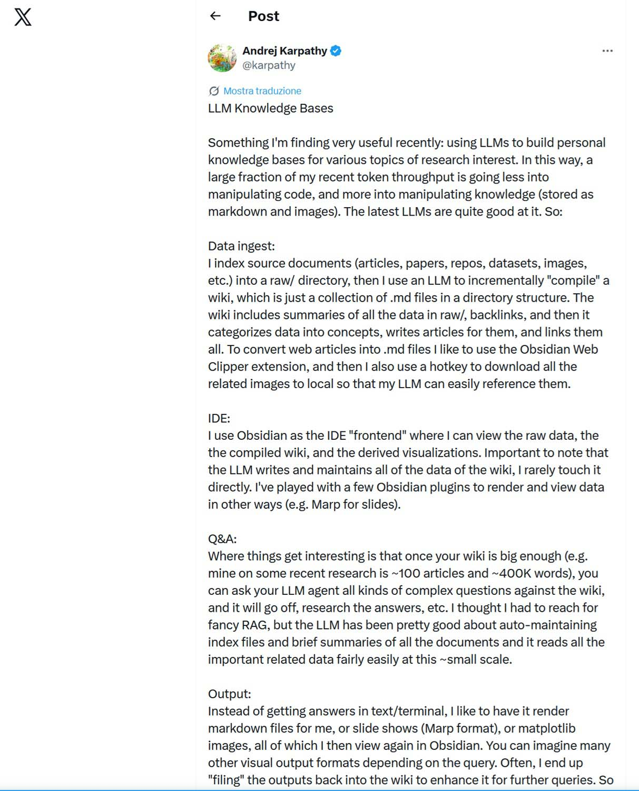

# Das lernende Gedächtnis: Karpathy fordert RAG mit einer evolutionären Knowledge Base heraus

*Es gibt einen Moment, den jeder kennt, der intensiv mit einem Sprachmodell gearbeitet hat: den Reset. Man baut etwas Komplexes auf, vielleicht eine ausgefeilte Softwarearchitektur oder eine Recherche, die Dutzende von Quellen verflicht, und das Modell hat alles verstanden, hält den Faden, antwortet mit chirurgischer Präzision. Dann endet die Sitzung, oder man erreicht das Kontextlimit, und die KI vergisst alles. Sie fängt bei Null an. Man muss ihr erneut erklären, wer man ist, was man tut, welche Entscheidungen man gemeinsam getroffen hat. Es ist wie in Christopher Nolans Film „Memento“, in dem der Protagonist sich Informationen auf den Körper tätowieren muss, weil das Kurzzeitgedächtnis nicht funktioniert: brutal, redundant und zutiefst frustrierend.*

Andrej Karpathy, ehemaliger KI-Direktor bei Tesla und Mitbegründer von OpenAI, der nun an einem unabhängigen Projekt arbeitet, hat dieses Problem genau in diesen Worten beschrieben und am 2. April 2026 [auf X einen Vorschlag](https://x.com/karpathy/status/2039805659525644595) zu dessen Lösung veröffentlicht. Der Post ging mit über 16 Millionen Aufrufen viral, und das vertiefende [GitHub Gist](https://gist.github.com/karpathy/442a6bf555914893e9891c11519de94f) erreichte in wenigen Tagen über 5.000 Sterne. Er kündigte kein neues Modell und keinen Benchmark an. Er beschrieb eine Änderung in der Art und Weise, wie er selbst Sprachmodelle nutzt – eine Änderung, die eine hitzige technische Debatte und, wie so oft, einige übermäßige Vereinfachungen auslöste.

## Was RAG ist und warum es zur dominierenden Methode wurde

Bevor man versteht, was Karpathy vorschlägt, lohnt es sich zu erklären, was RAG tut. Denn in den letzten drei Jahren ist es zum Standardansatz geworden, um Sprachmodellen Zugang zu externem Wissen zu verschaffen, und es bringt einige strukturelle Probleme mit sich, die nicht jeder explizit anspricht.

Retrieval-Augmented Generation bedeutet wörtlich: durch Abruf ergänzte Generierung. In einem Standard-RAG-System werden Dokumente in willkürliche Fragmente, sogenannte „Chunks“, zerlegt, in mathematische Vektoren, sogenannte Embeddings, umgewandelt und in einer spezialisierten Datenbank gespeichert. Wenn der Nutzer eine Frage stellt, führt das System eine „Ähnlichkeitssuche“ durch, um die relevantesten Fragmente zu finden, und fügt sie in den Kontext des Modells ein.

Der Mechanismus funktioniert in vielen Szenarien gut. Er bringt jedoch Eigenschaften mit sich, die in bestimmten Kontexten zu Problemen werden. Das erste ist die grundlegend zustandslose (*stateless*) Natur des Systems: Jede Abfrage beginnt bei Null und sucht erneut in den Quellen, ohne dass sich über die Zeit etwas ansammelt. Es gibt kein Gedächtnis für vergangene Verarbeitungen, keine Wissensakkumulation. Das zweite Problem betrifft die Qualität des Abrufs: Ein Dokument in Stücke zu schneiden und nach vektorieller Ähnlichkeit zu suchen, funktioniert gut, wenn die Antwort in ein oder zwei zusammenhängenden Fragmenten steckt. Es wird jedoch ungenau, wenn eine Frage die Synthese von Ideen erfordert, die über Dutzende verschiedener Quellen verteilt sind. Das dritte, oft unterschätzte Problem ist die infrastrukturelle Komplexität: Vektordatenbanken, Embedding-Pipelines, Indexierungssysteme – all das verursacht Kosten in Bezug auf Latenz, Wartung und Intransparenz. Die Vektoren sind für keinen Menschen lesbar, was es schwierig macht zu verstehen, warum das System bestimmte Fragmente gegenüber anderen bevorzugt hat.

## Wie die Gedächtnismaschine funktioniert

Karpathys Vorschlag geht von einer anderen Frage aus: Was würde passieren, wenn die KI Wissen im Voraus strukturiert aufbauen und dann direkt darin nachschlagen würde, anstatt jedes Mal neu zu suchen?

Karpathy veröffentlichte auf GitHub Gist die Beschreibung eines Drei-Ordner-Systems, das es einem Modell ermöglicht, eine Knowledge Base ohne Vektordatenbanken zu erstellen und zu pflegen. Die Architektur ist bewusst einfach gehalten. Der erste Ordner, `raw/`, enthält das Rohmaterial: PDFs, Notizen, Webartikel, GitHub-Repositories, Datensätze. Der zweite, `wiki/`, beherbergt die vom Modell erstellten Artikel, einen pro Konzept oder Thema. Der dritte ist eine Datei `index.md`, eine Gesamtkarte aller Artikel, die so dimensioniert ist, dass sie in das Kontextfenster des Modells passt.

Karpathy nutzt den Obsidian Web Clipper, um Webinhalte in Markdown-Dateien umzuwandeln, wobei er sicherstellt, dass auch Bilder lokal gespeichert werden, damit das Modell sie über seine Vision-Fähigkeiten referenzieren kann.

Der zentrale Schritt, der diesen Ansatz von einem einfachen Archiv unterscheidet, ist die Kompilierung. Anstatt die Dateien zu indexieren, „kompiliert“ das Modell sie: Es liest die Rohdaten und schreibt ein strukturiertes Wiki, generiert Zusammenfassungen, identifiziert Schlüsselkonzepte, erstellt Artikel im Enzyklopädie-Stil und erstellt – ganz entscheidend – Backlinks zwischen verwandten Ideen.

Das System ist nicht statisch: Karpathy beschreibt periodische „Linting“-Zyklen, in denen das Modell das Wiki nach Inkonsistenzen, fehlenden Daten oder neuen möglichen Verbindungen durchsucht. Das System verhält sich wie eine lebendige Wissensbasis, die sich selbst heilt. Die Abfragen an das System werden im Wiki selbst gespeichert, sodass sich jede Exploration ansammelt: Antworten, Grafiken und Analysen werden in die Wissensbasis integriert, die kumulativ wächst.

In welchem Maßstab funktioniert das Ganze? Karpathy präzisierte, dass er derzeit mit etwa 100 Artikeln und 400.000 Wörtern Quellmaterial arbeitet und dass bei dieser Größe die Fähigkeit des Modells, durch Zusammenfassungen und Indexdateien zu navigieren, mehr als ausreichend ist. Eine von MindStudio durchgeführte Analyse ergab, dass dieser Ansatz den Token-Verbrauch im Vergleich zum vollständigen Laden der Dokumente in den Kontext um bis zu 95 % senken kann – ein Vorteil, der im Vergleich zu optimierten RAG-Pipelines schrumpft.

Karpathys Post fügt sich in eine präzise Abfolge seines Denkens über die Mensch-KI-Interaktion ein: Nach dem „Vibe Coding“ vom Februar 2025, bei dem der Nutzer den generierten Code akzeptiert, ohne ihn Zeile für Zeile zu prüfen, und dem agentischen Engineering vom Januar 2026, bei dem [Menschen Agenten orchestrieren](https://aitalk.it/it/autoresearch-karpathy.html), anstatt direkt Code zu schreiben, stellen die LLM Knowledge Bases die dritte Phase dar: Die KI verwaltet das Wissen, nicht nur den Code. Der Mensch wird zum Kurator, nicht zum Schreiber.

[Screenshot aus dem X-Profil von Andrej Karpathy](https://x.com/karpathy/status/2039805659525644595)

## Der Vorteil der Lesbarkeit

Einer der konkretsten Aspekte des Vorschlags, der oft diejenigen am leichtesten überzeugt, die Erfahrungen mit Enterprise-RAG gesammelt haben, betrifft die Transparenz. Indem Karpathy Markdown-Dateien als „Source of Truth“ behandelt, vermeidet er das Problem der „Black Box“ der Embedding-Vektoren. Jede Aussage des Modells kann auf eine spezifische `.md`-Datei zurückgeführt werden, die ein Mensch lesen, ändern oder löschen kann.

Diese Eigenschaft hat nicht triviale praktische Auswirkungen. Wenn das Modell in einem RAG-System eine falsche oder unvollständige Antwort liefert, erfordert das Aufspüren der Problemursache das Verständnis darüber, welche Fragmente abgerufen wurden, wie sie segmentiert wurden und warum die Ähnlichkeitssuche bestimmte Vektoren gegenüber anderen bevorzugt hat. In einem gut strukturierten Markdown-Wiki ist der Fehler sichtbar: Es gibt einen schlecht geschriebenen Artikel, einen fehlenden Backlink oder eine veraltete Information. Es ist ein redaktionelles Problem, kein Problem der linearen Algebra.

Die Architektur ist bewusst auf Markdown als offenem und werkzeugunabhängigem Standard aufgebaut. Sollte Obsidian verschwinden oder seine Lizenzbedingungen ändern, bliebe die Knowledge Base ein Verzeichnis von einfachen Textdateien, die jeder Editor öffnen kann. Dies ist eine Form der Souveränität über die eigenen Daten, die Enterprise-Lösungen tendenziell nicht bieten.

Lex Fridman hat bestätigt, ein ähnliches System zu verwenden, wobei er eine dynamische Visualisierungsebene hinzugefügt hat: Er generiert HTML mit JavaScript, um die Daten zu sortieren und zu filtern, und baut temporäre Mini-Wissensbasen zu einem spezifischen Thema auf, die er während seiner 10–15 Kilometer langen Läufe im Sprachmodus lädt. Dieses „ephemere Wiki“ skizziert eine interessante Richtung: Man chattet nicht mit einer KI, sondern spawnt ein Team von Agenten, um eine personalisierte Rechercheumgebung für eine spezifische Aufgabe aufzubauen, die sich danach wieder auflöst.

Es gibt auch eine langfristige Implikation, die Karpathy nur beiläufig erwähnt, die aber nennenswert ist. Je öfter das Wiki automatisiert revidiert (*linted*) und verfeinert wird, desto sauberer wird die Darstellung der Domäne: dedupliziert (Informationen erscheinen nur einmal), querverlinkt und in einem konsistenten Stil geschrieben. An diesem Punkt wird die Knowledge Base zu einem Kandidaten für Trainingsdaten: Anstatt ständig ein großes allgemeines Modell mit dem Wiki zu „prompten“, könnte ein Team ein kleineres Modell auf diesem kuratierten Korpus feinabstimmen (*fine-tuning*). So würde die Wissensbasis in die Gewichte des Modells kodiert und ein persönliches oder abteilungsinternes Archiv in eine private spezialisierte Intelligenz verwandelt.

## Wo RAG standhält

Das Narrativ vom „Tod von RAG“, das in den Tagen nach Karpathys Post in den sozialen Medien kursierte, ist genau die Art von Vereinfachung, die Schaden anrichtet. RAG ist nicht tot, und es gibt präzise Kontexte, in denen es der richtige – oft der einzig praktikable – Ansatz bleibt.

Die erste Grenze von Karpathys Vorschlag wird von ihm selbst benannt: die Skalierung. Wenn die Anzahl der Artikel über einige Hundert hinauswächst oder die Quellen Millionen von Wörtern überschreiten, wird der Index selbst zu groß für das Kontextfenster, und das Retrieval wird wieder notwendig. Der Ansatz ist explizit für den persönlichen Gebrauch und kleine Teams positioniert, nicht für Dokumentenarchive auf Unternehmensebene. Ein Unternehmen mit Millionen von Dokumenten, heterogenen Altsystemen, strengen Compliance-Anforderungen und Hunderten von gleichzeitigen Nutzern benötigt etwas Robusteres als ein Verzeichnis von Markdown-Dateien.

Die zweite Grenze betrifft die Aktualität der Daten. RAG eignet sich besonders gut, wenn sich Quellen häufig ändern und man es sich nicht leisten kann, das Wissen jedes Mal „neu zu kompilieren“. Ein Kundensupport-Assistent, der auf Basis der aktuellen Dokumentation eines sich ständig weiterentwickelnden Produkts antworten muss, oder ein Finanzanalysesystem, das Marktnachrichten in Echtzeit einbeziehen muss, benötigt einen dynamischen Abruf und kein Wiki, das periodisch aktualisiert wird.

Das dritte und vielleicht tückischste Problem ist das, was in den Kommentaren zum GitHub Gist als „Memory Drift“ bezeichnet wird. Wie geht man bei wachsender Knowledge Base mit dem semantischen Drift um – dem Phänomen, bei dem sich die Bedeutung eines Begriffs, eines Konzepts oder einer Aussage im Laufe der Zeit mit jeder Umschreibung oder Zusammenfassung schrittweise verschiebt und sich von der ursprünglichen Intention entfernt, ohne dass dies jemandem explizit auffällt? Und wie verhindert man, dass sich widersprüchliche Informationen ansammeln?

Jedes Mal, wenn das Modell einen Artikel umschreibt oder zusammenfasst, besteht ein Risiko: Ist die Zusammenfassung ungenau oder werden zwei widersprüchliche Quellen inkonsistent integriert, gelangt der Fehler in die Basis und pflanzt sich fort. Bei RAG bleibt ein fehlerhaftes Dokument im Korpus isoliert und kann korrigiert oder entfernt werden. In einem KI-kompilierten Wiki kann der Fehler umformuliert und über mehrere verknüpfte Artikel verteilt worden sein, was die Korrektur erheblich erschwert.

Einige Vorschläge aus der Community regen an, das System mit SQLite, BM25 und TREESEARCH zu ergänzen, um das Wachstum des Korpus besser zu verwalten. Mehrere Kommentatoren betonen zudem, dass Menschen „im Loop“ bleiben müssen, um den von der KI vorbereiteten Wissenskontext zu verwalten und Drifts sowie Inkonsistenzen zu verhindern.

Hinzu kommt die Frage nach der Herkunft der Quellen. Ein gut formatiertes Wiki ist zwar in seiner Struktur transparent, aber nicht notwendigerweise in der Herkunft der Aussagen. Ohne ein strenges internes Zitiersystem, das jede Behauptung zum ursprünglichen Quelldokument zurückverfolgt, erhält man Lesbarkeit ohne Verifizierbarkeit – ein Unterschied, der in regulierten, medizinischen oder rechtlichen Kontexten substanziell ist.

## Hybrid oder Showdown?

Wie ein Analyst in einem Kommentar zum Gist schrieb, ist das LLM-Wiki im Wesentlichen eine manuelle und rückverfolgbare Implementierung von Graph RAG: Jede Behauptung verweist auf die Quellen, die Beziehungen sind explizit und die Struktur ist für Menschen lesbar. Dieser Punkt klärt vieles: Die beiden Ansätze sind keine philosophischen Gegensätze, sondern technische Lösungen, die für unterschiedliche Kontexte optimiert sind. Die Grenze zwischen ihnen ist durchlässiger, als die Online-Debatte vermuten lässt.

Einige Teams versuchen bereits, die Lücke mit Multi-Agenten-Architekturen zu schließen: Ein „Swarm Knowledge Base“-Design skaliert Karpathys Workflow auf ein System von 10 Agenten, die von einer Steuerungsebene orchestriert werden. Dabei werden Überwachungsmodelle hinzugefügt, um das gemeinsame Wiki vor sich summierenden Halluzinationen zu schützen. Ein auf Evaluierung fokussiertes Modell bewertet und validiert als „Quality Gate“ die Artikelentwürfe, bevor sie in die aktive Wissensbasis aufgenommen werden.

Die plausibelste Zukunft ist nicht der Sieg eines der beiden Paradigmen über das andere. Würde [Subject]... Es ist eine geschichtete Architektur, in der ein strukturiertes und kompiliertes Wiki das stabile Domänenwissen verwaltet, das in periodischen, von Menschen überwachten Zyklen aktualisiert wird, während der dynamische Abruf bei Live-Quellen, frischen Daten und Korpora einspringt, die sich zu schnell ändern, um kompiliert zu werden. Das strukturierte Gedächtnis als Fundament, der Abruf als Fenster zur Außenwelt und die menschliche Überprüfung als Qualitätskontrolle, die noch kein automatisches System vollständig ersetzen kann.

Im Gist merkt Karpathy an, dass sich seine Token-Nutzung von der Codegenerierung hin zur Verwaltung von strukturiertem Wissen verschoben hat – eine scheinbar marginale Notiz, die tatsächlich einen Prioritätenwechsel in der realen Nutzung fortgeschrittener Modelle signalisiert. Wissensmanagement wird zum Gravitationszentrum der Arbeit mit Sprachmodellen, nicht die Codegenerierung.

Die eigentliche Frage ist nicht, ob Karpathy RAG „schlägt“. Es geht darum, welche Architektur die Zuverlässigkeit, Aktualisierbarkeit und den operativen Wert in dem spezifischen Kontext maximiert, in dem sie eingesetzt wird. Für einen unabhängigen Forscher, ein kleines Team, das eine interne technische Dokumentation aufbaut, oder einen Knowledge Worker, der möchte, dass sein KI-Assistent nicht mehr bei jeder Sitzung unter Amnesie leidet, ist Karpathys Vorschlag konkret, heute umsetzbar und löst ein reales Problem. Für ein Unternehmen mit Millionen von Dokumenten, Daten, die sich stündlich ändern, und strengen Governance-Anforderungen bleibt RAG in seiner weiterentwickelten Form – vielleicht bereichert durch Elemente von Karpathys Vorschlag – die einzige praktikable Option.

Für Teams, die abwägen, ob sie diesen Ansatz übernehmen oder in eine vollständige RAG-Pipeline investieren sollen, lautet die ehrliche Antwort: Fangt hiermit an und wechselt erst dann zu RAG, wenn das Kontextfenster zu einem echten Flaschenhals wird und nicht nur zu einem hypothetischen Problem. Wahrscheinlich werden Sie überrascht sein, wie weit Sie strukturiertes Markdown bringt. Es ist nicht das Ende von RAG. Es ist der Beginn einer differenzierteren Konversation darüber, wie KI-Systeme das Gedächtnis über die Zeit verwalten – eine Konversation, die bis vor zwei Wochen fast niemand in der richtigen Weise geführt hat.
