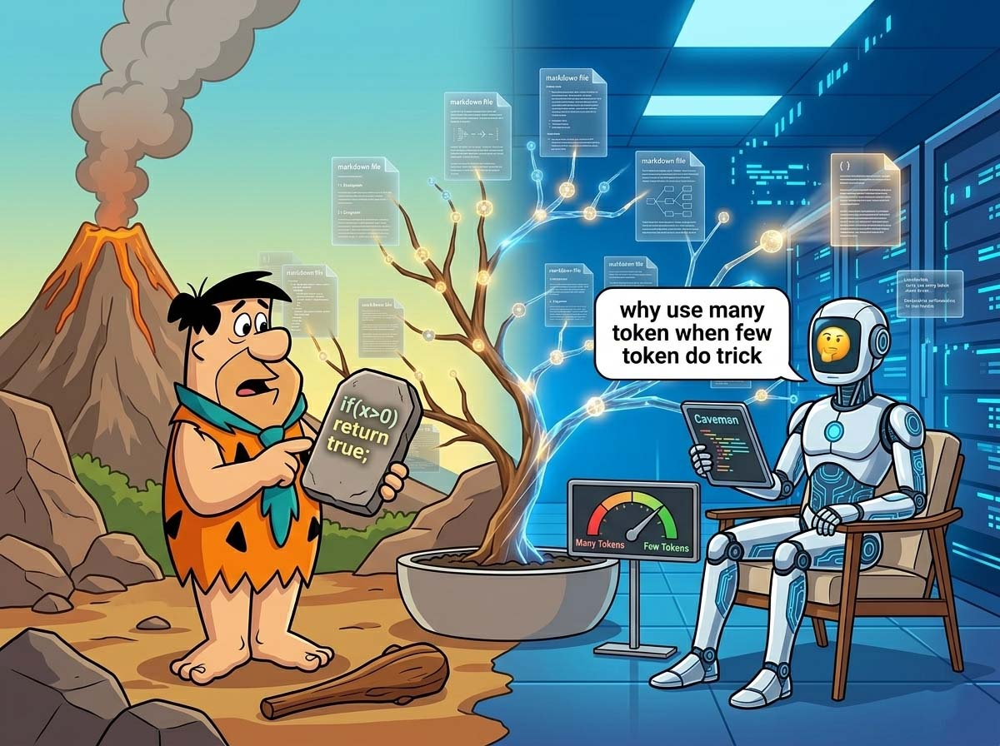
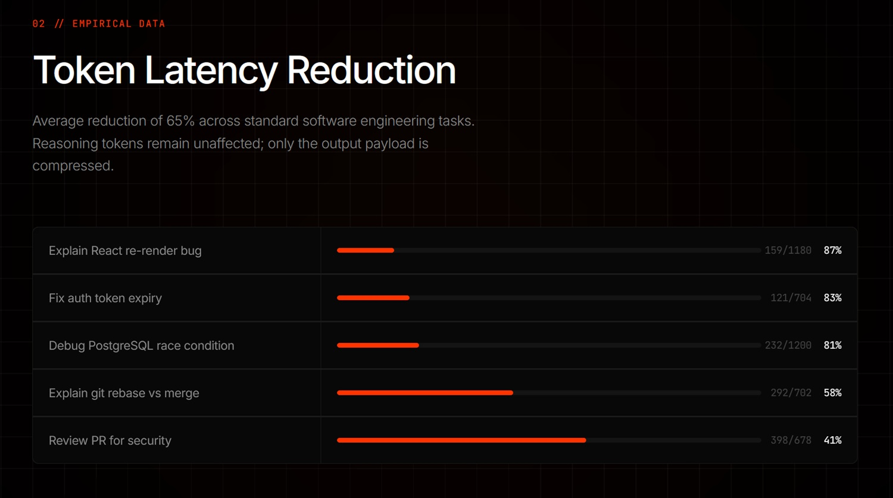

# Caveman: Por qué conviene que la IA hable como un cavernícola

*¡Yabba-dabba-doo! ¿Recordáis a Fred Flintstone (Pedro Picapiedra)? Vivía en Bedrock (Piedradura), conducía un coche impulsado por sus pies descalzos, tenía un dinosaurio como grúa y un pterodáctilo como tocadiscos. Sin embargo, si lo miramos bien, esa civilización de la Edad de Piedra ya poseía todo lo necesario para una vida moderna confortable: aparatos funcionales, tecnología eficiente, soluciones prácticas. Solo le faltaba la pátina brillante del progreso. Quizás deberíamos haber entendido ya entonces que lo esencial basta, y que añadir complejidad no significa necesariamente añadir valor.*

Julius Brussee, desarrollador holandés, parece haber releído la lección con ojos nuevos. Su proyecto [Caveman](https://github.com/JuliusBrussee/caveman), disponible en GitHub bajo licencia MIT, hace una sola cosa: obliga al modelo a responder como un cavernícola. Nada de artículos, nada de cortesías, nada de frases de calentamiento. Solo el núcleo técnico, expresado de la forma más directa posible.

El problema que Caveman intenta resolver es real, y cualquiera que trabaje con modelos lingüísticos de pago lo conoce bien. Cada respuesta de un LLM tiene un coste medido en *tokens*, las unidades elementales en las que el modelo descompone y recompone el lenguaje, algo intermedio entre una sílaba y una palabra. A través de la API, los tokens de salida son generalmente más caros que los de entrada, y los modelos modernos tienden a ser generosos con las palabras: introducen cada respuesta con fórmulas de cortesía, precisan lo obvio, repiten el contexto ya conocido, concluyen con un resumen de lo que acaban de decir. Es una prolijidad sistémica, entrenada durante años con retroalimentación humana que a menudo premiaba la completitud aparente sobre la concisión real.

Tomemos un ejemplo concreto, el mismo que aparece en la [documentación oficial del proyecto](https://juliusbrussee.github.io/caveman/). La respuesta estándar de Claude a un problema de re-renderizado en React suena más o menos así: *"The reason your React component is re-rendering is likely because you're creating a new object reference on each render cycle. When you pass an inline object as a prop, React's shallow comparison sees it as a different object every time, which triggers a re-render. I'd recommend using useMemo to memoize the object."* Sesenta y nueve tokens. En modo Caveman, la misma información se convierte en: *"New object ref each render. Inline object prop = new ref = re-render. Wrap in \`useMemo\`."* Diecinueve tokens. Mismo diagnóstico, misma solución, tres veces y media menos palabras.

## Cómo funciona

Técnicamente, Caveman es un archivo .md que se instala en el entorno del agente elegido con un solo comando.

Una vez instalado, la herramienta se activa bajo demanda mediante el comando `/caveman` o `$caveman` en Codex, y la frase "talk like caveman", "caveman mode" o simplemente "less tokens please", y se desactiva con "stop caveman" o "normal mode". Se trata de un conjunto de instrucciones contextuales que modifican el comportamiento del modelo dentro de una sesión, sin reentrenarlo ni modificar sus parámetros internos.

A esto se suma una segunda herramienta, `/caveman:compress`, que actúa en el lado opuesto: en lugar de comprimir las respuestas del modelo, comprime los archivos de contexto (por ejemplo, Claude lo carga en cada sesión, típicamente CLAUDE.md y los archivos de notas del proyecto). El comando reescribe estos archivos al estilo cavernícola y conserva automáticamente una copia legible como respaldo (CLAUDE.original.md). Todo lo que es técnico (bloques de código, URL, rutas de archivos, comandos, encabezados, fechas, números de versión) permanece invariable; solo se comprime la prosa descriptiva. Las pruebas de rendimiento del proyecto en cinco tipos de archivos reales muestran una reducción media del 46% de los tokens de entrada por sesión, con un pico del 59,6% en los archivos de preferencias.

El núcleo del mecanismo es un conjunto de restricciones gramaticales y estilísticas que un comentario de un usuario en [Hackaday](https://hackaday.com/2026/04/06/so-expensive-a-caveman-can-do-it/) resumió con precisión: se eliminan los artículos determinados e indeterminados, se suprimen las muletillas lingüísticas (*just, really, basically, actually*), se borran las cortesías (*sure, certainly, of course, happy to*), se priorizan los sinónimos cortos (*big* en lugar de *extensive*, *fix* en lugar de *implement a solution for*), se prohíbe el uso de formas de vacilación (*it might be worth considering*). Los fragmentos de frases son aceptables. No hace falta el sujeto si está implícito. La terminología técnica, en cambio, permanece intacta: *polymorphism* sigue siendo *polymorphism*, los bloques de código se escriben normalmente, los mensajes de error se citan textualmente. Como dice el README del proyecto con autoironía: *"Caveman not dumb. Caveman efficient."*

Esta distinción es fundamental para entender qué hace realmente Caveman. No es un compresor que corta las respuestas a la mitad, ni una herramienta que simplifica los conceptos para hacerlos más digeribles. Es un filtro que elimina el excedente comunicativo, esas frases que los modelos producen no porque contengan información útil, sino porque su entrenamiento, basado en evaluaciones humanas que tienden a premiar las respuestas elaboradas y corteses, los ha empujado en esa dirección. Caveman se comporta como un editor severo que borra todo lo que no añade valor técnico, dejando en la página solo lo necesario.

Mientras tanto, el proyecto ha añadido una granularidad que lo hace más adaptable de lo que la premisa cavernícola sugería inicialmente. Hay tres niveles de intensidad disponibles, seleccionables con activadores dedicados: `/caveman lite` mantiene la gramática intacta y solo elimina las muletillas, devolviendo una salida profesional pero escueta, adecuada para contextos donde la forma todavía cuenta; `/caveman full` es el modo predeterminado, el que elimina artículos, acepta fragmentos de frases y apunta al núcleo técnico sin mediaciones; `/caveman ultra` lleva la compresión al máximo, con un estilo telegráfico que abrevia todo lo comprimible.

El nivel seleccionado persiste durante toda la sesión hasta que haya un cambio explícito. Pero la sorpresa más inesperada es otra: el [README del proyecto](https://github.com/JuliusBrussee/caveman) también documenta un modo en chino clásico literario, el *wenyan* (文言文), la lengua escrita utilizada en China durante más de dos mil años hasta el siglo XX, famosa por una densidad semántica que no tiene equivalente en las lenguas modernas. La idea no es folclórica: el wenyan es objetivamente uno de los sistemas de escritura más eficientes en términos de tokens jamás inventados por la humanidad, y Brussee lo ha integrado con la misma lógica progresiva de los niveles latinos, desde `/caveman wenyan-lite`, que mantiene la gramática pero elimina lo superfluo, hasta `/caveman wenyan-ultra`, que el README describe con cierta ironía como el modo del antiguo erudito con poco presupuesto. Por supuesto, con el wenyan, el ahorro es extremo, pero luego hay que entender lo que escribe...

Los datos de rendimiento publicados en la [página del proyecto](https://juliusbrussee.github.io/caveman/) indican reducciones variables según el tipo de tarea: desde un 87% en los problemas de re-renderizado de React hasta un 83% en la depuración de middleware de autenticación, un 81% en condiciones de carrera en PostgreSQL, bajando hasta un 58% para explicaciones de *git rebase vs merge* y un 41% para revisiones de seguridad en solicitudes de incorporación (pull requests). El promedio declarado se sitúa en torno al 65% de reducción de los tokens de salida. Es importante señalar que estas cifras se refieren exclusivamente a los tokens de salida, no a la sesión completa: los tokens de entrada (los del contexto, las instrucciones del sistema y las llamadas a herramientas) permanecen invariables y pueden representar una parte significativa del coste total, especialmente en sesiones largas o con muchas llamadas a herramientas externas.

[Imagen tomada de juliusbrussee.github.io/caveman](https://juliusbrussee.github.io/caveman/)

## La ciencia del silencio

Hasta aquí, se podría descartar Caveman como un truco simpático, uno de esos microproyectos que circulan por GitHub durante unos días y luego desaparecen. Lo que lo hace interesante desde un punto de vista más amplio es su conexión con una literatura científica emergente que estudia la relación entre la brevedad y el rendimiento de los modelos lingüísticos, y los resultados de esa literatura son, por decirlo con cautela, contraintuitivos.

El artículo de referencia es [*"Brevity Constraints Reverse Performance Hierarchies in Language Models"*](https://arxiv.org/abs/2604.00025), publicado el 11 de marzo de 2026 por MD Azizul Hakim en arXiv. El estudio parte de una observación anómala: en un subconjunto igual al 7,7% de los problemas evaluados, distribuidos en cinco conjuntos de datos diferentes, los modelos lingüísticos más grandes obtienen peores resultados que los modelos más pequeños por nada menos que 28,4 puntos porcentuales, a pesar de contar con un número de parámetros de 10 a 100 veces superior.

El mecanismo identificado como causa es lo que el artículo llama *scale-dependent verbosity* (verbosidad dependiente de la escala), una prolijidad que crece a medida que aumenta el tamaño del modelo. Los modelos más grandes tienden a procesar en exceso las respuestas, añadiendo pasos de razonamiento, matices y digresiones que no mejoran la respuesta final y, a menudo, la empeoran al introducir errores por exceso de procesamiento. Imponer a los modelos grandes que respondan de forma concisa mejora su precisión en 26,3 puntos porcentuales, reduciendo la brecha con los modelos pequeños en un 67%, mientras que los modelos pequeños, sometidos a la misma restricción, sufren una caída de solo 3,1 puntos porcentuales.

El resultado más sorprendente se refiere a puntos de referencia específicos. En GSM8K, el conjunto de datos de razonamiento matemático, y en MMLU-STEM, el de conocimiento científico, las restricciones de brevedad invierten completamente la jerarquía de rendimiento: los modelos grandes, que en condiciones normales se comportaban peor que los pequeños, llegan a superarlos por 7,7-15,9 puntos porcentuales. En otros términos, la capacidad superior ya estaba allí, pero estaba enmascarada por la tendencia a razonar en voz alta de forma excesiva. La brevedad no comprime el razonamiento, lo libera del envoltorio verboso que lo asfixia.

Sin embargo, hay que registrar una nota de cautela que el propio estudio introduce con honestidad: en BoolQ, el conjunto de datos que requiere la integración de información distribuida en varias frases, las restricciones de brevedad aumentan ligeramente la brecha en lugar de reducirla, del 23,5% al 24,3%. En este tipo de problemas, el procesamiento extenso es funcional, no excesivo: cortarlo empeora el resultado. No se trata de un resultado universal, sino que depende del contexto, y este matiz es crucial para no malinterpretar lo que demuestra el artículo.

La hipótesis propuesta por los autores para explicar la tendencia a la prolijidad en los modelos grandes es que el proceso de alineación mediante retroalimentación humana (RLHF) ha entrenado inadvertidamente a estos modelos para procesar en exceso, ya que los evaluadores humanos tienden a premiar las respuestas largas y aparentemente completas, creando un sesgo sistemático que escala con el tamaño del modelo. Es una explicación plausible y coherente con otros fenómenos conocidos en el entrenamiento de modelos, aunque sigue siendo una hipótesis interpretativa que debe verificarse más a fondo.

## El mamut en la habitación

Con los datos en la mano, Caveman funciona, al menos en ciertos contextos. El ahorro declarado es real y medible, la base científica existe y no es trivial, el mecanismo técnico es transparente y verificable por cualquiera. Pero un análisis honesto requiere poner sobre la mesa también las reservas, y hay varias.

La primera reserva se refiere a la calidad de las respuestas en tareas complejas. ¿Es una respuesta más corta siempre una respuesta mejor? El artículo de Hakim dice explícitamente que no para ciertos tipos de problemas, y la intuición es verificable en la práctica diaria. Cuando se trabaja en un error oscuro, en un problema de arquitectura con muchas variables, en código antiguo mal documentado, una respuesta que explica el razonamiento paso a paso tiene un valor que va más allá de la cantidad de información estrictamente necesaria: ayuda a comprender, a verificar, a construir un modelo mental. Cortar esa explicación en nombre de la eficiencia puede obligar a más iteraciones, a más preguntas de aclaración, a más tiempo perdido, anulando el ahorro inicial.

Esto lleva a la segunda reserva, relativa a la experiencia de usuario diferenciada. Para un desarrollador sénior que usa un agente como acelerador, que conoce el código en el que trabaja y necesita confirmaciones rápidas más que explicaciones, Caveman es probablemente una ganancia neta. Para un júnior que usa el asistente también para aprender, para alguien que se enfrenta a un dominio técnico nuevo o para quien usa agentes en contextos que van más allá del puro código (como redacción técnica, análisis de seguridad, apoyo a decisiones arquitectónicas), la síntesis excesiva puede aumentar la carga cognitiva y generar más confusión que claridad.

Finalmente, vale la pena recordar que las pruebas científicas disponibles respaldan el *principio* de la brevedad como restricción útil, pero no validan específicamente a Caveman como implementación. El artículo de Hakim se publicó en arXiv, todavía en fase de pre-print en el momento de escribir este artículo, y aún no ha recibido una revisión formal por parte de la comunidad académica. La herramienta de Brussee ha atraído la atención de la comunidad tecnológica con 33,5 mil estrellas en GitHub en pocos días, y esto no puede subestimarse, pero no ha sido objeto de una evaluación independiente y sistemática por parte de terceros. Son señales de interés genuino, no de validación certificada.

## ¿Piedra angular o meteoro?

La pregunta más interesante que plantea Caveman no es técnica, sino metodológica. Si los modelos lingüísticos más potentes tienden estructuralmente a responder de forma más prolija, y si esa prolijidad es a menudo perjudicial tanto para los costes como, sorprendentemente, para la calidad de las respuestas en ciertos tipos de problemas, entonces el problema no es de Caveman: es de la forma en que estos modelos se entrenan y evalúan.

El artículo de Hakim propone un enfoque que denomina *problem-aware routing*: usar modelos pequeños para las tareas en las que destacan de forma natural o donde las restricciones de brevedad no ayudan a los modelos grandes, y usar modelos grandes con restricciones de brevedad para las tareas en las que poseen capacidades latentes superiores pero tienden al exceso de procesamiento. Este enfoque, dicen los autores, puede mejorar simultáneamente la precisión y los costes. No es ciencia ficción: es una forma de ingeniería de instrucciones consciente de la escala del modelo, una idea que podría convertirse en práctica habitual en los flujos de trabajo de agentes profesionales.

En este sentido, Caveman no es simplemente un truco para ahorrar unos céntimos en la API. Es una demostración práctica de un principio que la investigación empieza a formalizar: que las instrucciones del sistema no son decorativas, que la forma en que se interroga a un modelo cambia no solo la forma sino la calidad de la respuesta, y que optimizar la interfaz hombre-máquina tiene consecuencias medibles en el rendimiento del sistema global.

Quedan abiertas preguntas legítimas. ¿Se traslada el patrón realmente a todo tipo de tareas o solo a las estructuradas de programación? ¿Cómo se mide el ROI neto cuando se incluye en el cálculo el coste de las iteraciones adicionales que puede generar una respuesta demasiado sintética? ¿Cuánto influye la familiaridad del usuario con el dominio técnico a la hora de determinar si la brevedad es una ventaja o una desventaja? Y, volviendo a la gran pregunta de fondo: si la brevedad mejora el rendimiento, ¿por qué no se entrena a los modelos de forma nativa para que respondan de forma más concisa?

Esta última es quizás la más importante, y la respuesta implícita en el artículo de Hakim es incómoda: porque la retroalimentación humana en la que se basa la alineación de estos modelos prefiere a menudo la extensión a la precisión, la cortesía a la densidad informativa. Somos nosotros, como evaluadores, como usuarios, como clientes, quienes hemos entrenado a los modelos para la prolijidad. Caveman es, en el fondo, un correctivo artesanal a un problema sistémico que nace mucho más atrás.

Pedro Picapiedra, probablemente, ya lo había entendido todo. Cueva pequeña, herramientas esenciales, resultado grande. El resto es solo piedra de más que arrastrar.
