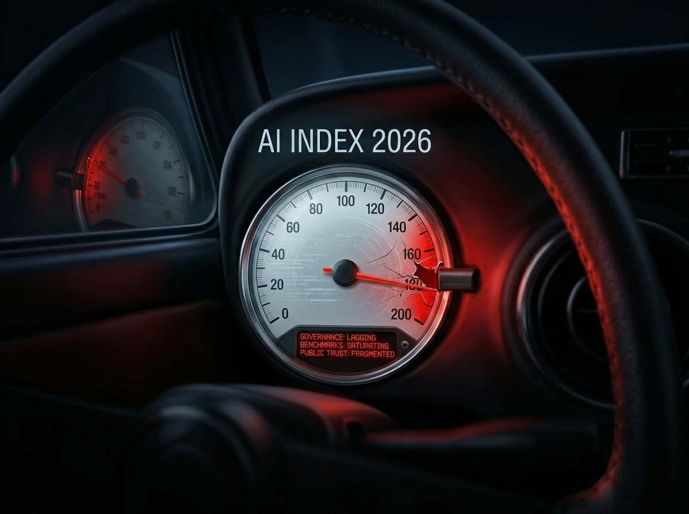
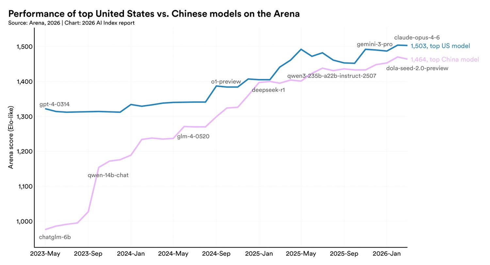
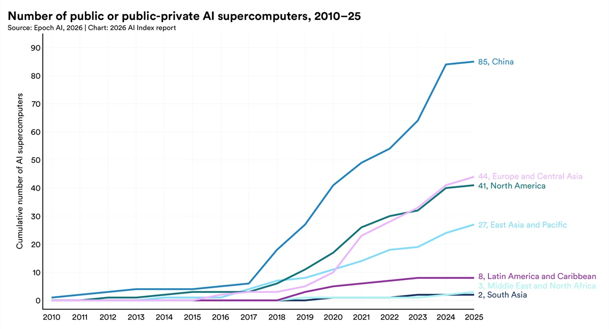
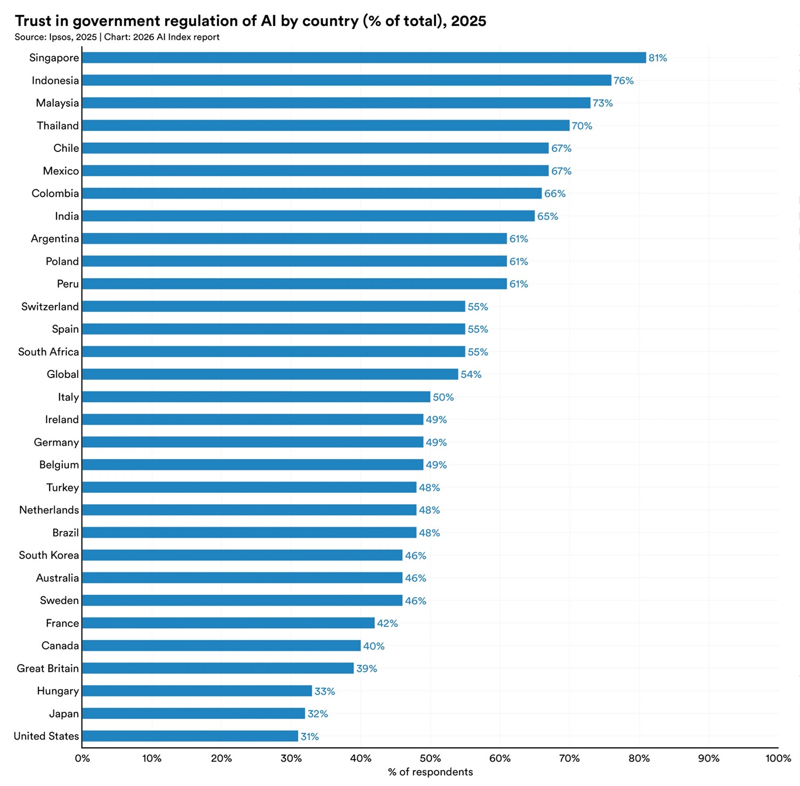

# AI Index Report 2026 di Stanford: l'AI accelera, la governance frena

*Cinquantatré percento di adozione globale in tre anni, più rapido di internet e del personal computer. Ottantotto percento delle organizzazioni che dichiara di usare l'AI. Un benchmark di programmazione, SWE-bench Verified, passato dal 60% a quasi il 100% in dodici mesi. Investimenti privati negli USA a 285,9 miliardi di dollari, ventitré volte quelli cinesi. Un divario di cinquanta punti percentuali tra cosa si aspettano dall'AI gli esperti e cosa ne pensa il pubblico. Questi cinque numeri inquadrano il perimetro del [2026 AI Index Report](https://hai.stanford.edu/assets/files/ai_index_report_2026.pdf) di Stanford HAI: nona edizione di un documento che funziona da specchio impietoso di un settore che accelera molto più in fretta di chiunque riesca a misurarla, regolarla o assorbirla socialmente.*

Strutturato in otto capitoli, ricerca e sviluppo, performance tecnica, AI responsabile, economia, scienza, medicina, educazione, governance e opinione pubblica, e alimentato da dati di Epoch AI, LinkedIn, GitHub, McKinsey e OECD, il report apre con una premessa che è quasi una confessione: "I dati non puntano in un'unica direzione. Rivelano un campo che scala più in fretta dei sistemi intorno a lui." Non è retorica. È il filo che attraversa tutto il documento.

## I numeri che non mentono

Prima di entrare nei dettagli, vale la pena fermarsi su ciò che il report comunica con più forza. L'AI generativa ha raggiunto il 53% di adozione a livello di popolazione in meno di tre anni: per fare lo stesso, il personal computer ha impiegato oltre un decennio. Il 91,6% dei modelli "notevoli" nel 2025 è prodotto dall'industria privata, contro un solo modello accademico identificato nell'intero anno. L'università, che ha costruito le fondamenta di questo campo, è ormai quasi irrilevante nella produzione dei sistemi al confine della conoscenza. Il valore economico degli strumenti di AI generativa per i soli consumatori americani ha raggiunto 172 miliardi di dollari annui, con il valore medio per utente triplicato in un anno, e quasi tutto accessibile gratuitamente: uno dei trasferimenti di valore tecnologico più asimmetrici della storia recente.

## La frontiera frastagliata: dove i modelli eccellono e dove falliscono ancora

C'è un'immagine nel report che vale quanto mille grafici. Gemini Deep Think di Google ha vinto una medaglia d'oro all'International Mathematical Olympiad 2025, competendo contro i migliori liceali matematici del pianeta. Lo stesso modello, o modelli dello stesso livello, legge correttamente un orologio analogico solo il 50,1% delle volte. In pratica, poco meglio del lancio di una moneta.

Questo è il concetto di *jagged frontier*, frontiera frastagliata, che il report usa come chiave interpretativa del momento attuale. I sistemi AI non sono né onnipotenti né banali: sono straordinariamente capaci in certi domini e sorprendentemente fragili in altri, spesso senza che ci sia una logica intuitiva a guidare la distinzione. La matematica olimpionica è un compito strutturato, simbolico, con regole precise e verificabili. Leggere un orologio richiede percezione spaziale e mapping visivo-semantico, che per i modelli attuali rimane ostico.

Dove i progressi nell'ultimo anno sono stati più evidenti? Nel codice: il benchmark SWE-bench Verified, che misura la capacità di risolvere issue reali su repository GitHub, è passato dal 60% a quasi il 100% rispetto alla baseline umana in un solo anno. Negli agenti autonomi: su OSWorld, test su compiti reali che simulano l'uso di un computer con sistema operativo, il tasso di successo è balzato dal 12% a circa il 66%. Nei benchmark scientifici: diversi modelli frontier ora eguagliano o superano la baseline umana su domande di livello dottorato in fisica, chimica e matematica.

Dove invece i limiti restano profondi? Nella robotica fisica: i robot riescono solo nel 12% dei compiti domestici, nonostante raggiungano l'89,4% su simulazioni in ambienti controllati. Il gap tra laboratorio e cucina reale è ancora un abisso. E nei ragionamenti che richiedono giudizio contestuale, senso comune o comprensione dei sottotesti comunicativi: qui i modelli mostrano le crepe più evidenti, quelle che meno si prestano a essere misurate da un benchmark.

Il confronto con il 2025 è illuminante. L'anno scorso il report documentava l'arrivo dell'AI come forza mainstream. Quest'anno documenta cosa succede dopo l'arrivo: saturazione dei benchmark (sempre più modelli li superano, rendendoli meno informativi), crescente opacità dei lab (meno trasparenza su parametri, dataset, compute), e una divergenza tra le capacità dichiarate dagli sviluppatori e quelle verificate da test indipendenti. È la differenza tra un esordio cinematografico e il sequel: più grande, più costoso, ma con meno sorprese.

## USA vs Cina: il sorpasso che non c'è (ancora)

Il capitolo geopolitico del report è probabilmente il più seguito dai decision-maker politici e industriali. E i dati del 2026 confermano una tendenza che chi segue questo settore aveva già intuito: il vantaggio americano sui modelli frontier si è ridotto a una distanza quasi simbolica.

A febbraio 2025, DeepSeek-R1 ha brevemente eguagliato il miglior modello americano disponibile. A marzo 2026, il modello di punta di Anthropic guida la classifica con un margine del 2,7% sul migliore modello cinese. In un campo dove i benchmark vengono aggiornati ogni settimana, 2,7 punti percentuali non è un vantaggio strategico: è rumore statistico. I modelli dei due paesi si sono scambiati la testa della classifica più volte nel corso dell'ultimo anno.

Questo dato va letto insieme alla struttura più ampia della competizione. Gli Stati Uniti restano avanti nella produzione di modelli notevoli, 50 nel 2025 contro 30 della Cina, e nei brevetti ad alto impatto. La Cina guida invece nel volume di pubblicazioni scientifiche, nelle citazioni, nell'output brevettuale complessivo e nelle installazioni di robot industriali. Pechino ha aumentato la propria quota dei 100 articoli AI più citati al mondo da 33 nel 2021 a 41 nel 2024. La Korea del Sud emerge come outlier di densità innovativa: prima al mondo in brevetti AI pro capite.

Il quadro è quello di una competizione tecnologica trasformata in parità armata più che in predominio unilaterale. Chi legge questi dati alla luce dei blocchi alle esportazioni di chip e della guerra dei semiconduttori non può non chiedersi se quelle misure abbiano ottenuto il risultato sperato. La risposta che emerge da Stanford è scomoda: probabilmente no.

Su AITalk abbiamo seguito questa traiettoria da vicino. Lo scorso anno documentavamo le capacità di [GLM-5 di Zhipu AI](https://aitalk.it/it/glm-5.html), un modello cinese che già allora mostrava prestazioni competitive sui benchmark multimodali. Nell'analisi sulla [guerra dell'AI tra USA e Cina](https://aitalk.it/it/degregori-ai-war.html) avevamo evidenziato come le restrizioni americane stessero paradossalmente accelerando l'autonomia tecnologica cinese nel campo dei chip e dei modelli. [Kimi K2](https://aitalk.it/it/kimik2.5.html) di Moonshot AI e soprattutto [DeepSeek](https://aitalk.it/it/deepseek-mhc.html), con la sua capacità di produrre modelli competitivi a costi drasticamente inferiori, hanno reso concreta quella previsione. Il report di Stanford non fa che aggiungere il sigillo quantitativo a una storia che si stava già scrivendo.

Un elemento che il report aggiunge a questo scenario è la fuga di talenti americana, che rappresenta forse la crepa più sottovalutata nel primato USA. Il numero di ricercatori e sviluppatori AI che si trasferiscono negli Stati Uniti è crollato dell'89% rispetto al 2017, con un calo dell'80% nell'ultimo anno. Gli Stati Uniti restano il paese con il più alto stock di talenti AI, ma attirano nuovi cervelli al ritmo più basso degli ultimi dieci anni. È il tipo di indicatore che non impatta sui benchmark di oggi ma che definisce la traiettoria dei prossimi cinque anni.

[Immagine tratta da hai.stanford.edu](https://hai.stanford.edu/ai-index/2026-ai-index-report)

## L'infrastruttura fragile del mondo

Dietro ogni risposta generata da un modello AI c'è una filiera materiale di proporzioni enormi e fragilità strutturale sottovalutata. Gli Stati Uniti ospitano 5.427 data center AI, più di dieci volte qualsiasi altro paese, e consumano più energia di qualsiasi altra regione per questo scopo. La capacità di elaborazione globale per l'AI è cresciuta di 3,3 volte all'anno dal 2022, raggiungendo l'equivalente di 17,1 milioni di schede Nvidia H100. Nvidia controlla oltre il 60% di questo compute.

Il dato più rilevante geopoliticamente è però un altro. Quasi tutti i chip che alimentano questa infrastruttura vengono prodotti da un'unica azienda: TSMC, con sede a Taiwan. Il report lo afferma senza perifrasi: la supply chain hardware globale dell'AI dipende da un'unica fonderia su un'isola contesa. Ci sono pochi paragoni per questa concentrazione di rischio sistemico, forse la dipendenza energetica europea dal gas russo prima del 2022, ma con una differenza cruciale: non esiste, per i chip AI, un fornitore alternativo già pronto. Una prima espansione TSMC l'ha avviata in Arizona nel 2025, ma la capacità americana resta una frazione di quella taiwanese.

L'impatto ambientale completa il quadro. Il training di Grok 4 ha prodotto circa 72.816 tonnellate di CO₂ equivalente. La capacità di alimentazione dei data center AI ha raggiunto 29,6 gigawatt, paragonabile al picco di consumo dell'intero stato di New York. Le stime sul consumo idrico dell'inferenza di GPT-4o indicano un uso annuale che potrebbe superare il fabbisogno di 12 milioni di persone. L'AI non è un'industria virtuale: ha un corpo fisico, e quel corpo cresce più velocemente delle nostre infrastrutture energetiche.

## Lavoro, adozione e valore: chi guadagna, chi perde

Il capitolo economia del report è il più atteso dai non-tecnici, e quest'anno porta dati più granulari del solito. La produttività in settori come il supporto clienti e lo sviluppo software è aumentata tra il 14% e il 26% nei contesti dove l'AI è stata introdotta in modo strutturato. Gli effetti però non sono uniformi: i guadagni sono più forti nei compiti routinari e più deboli, o addirittura negativi, nei compiti che richiedono giudizio complesso.

Il dato più discusso riguarda i giovani sviluppatori americani. Nella fascia 22-25 anni, l'occupazione nel settore software è calata di quasi il 20% nel 2024, mentre il numero di sviluppatori senior continua a crescere. Il report evita di fare della causalità ciò che è correlazione, ma l'associazione è difficile da ignorare: i guadagni di produttività AI si concentrano esattamente nei compiti tipicamente assegnati ai profili junior, e l'impatto occupazionale si materializza esattamente in quella fascia. È come se l'AI stesse comprimendo il livello di ingresso della professione, cancellando il percorso di apprendistato che per decenni ha trasformato i laureati in sviluppatori esperti.

Il modello di adozione ha caratteristiche geografiche sorprendenti. Singapore è al 61%, gli Emirati Arabi Uniti al 54%, entrambi sopra le attese rispetto al PIL pro capite. Gli Stati Uniti, sede dei principali sviluppatori AI, si posizionano al 24° posto con il 28,3%: la prossimità all'industria non basta a generare adozione diffusa.

[Immagine tratta da hai.stanford.edu](https://hai.stanford.edu/ai-index/2026-ai-index-report)

## Governance, sicurezza, trasparenza: il ritardo sistemico

Il capitolo più preoccupante del report non è quello sulle capacità tecniche, ma quello sull'AI responsabile. Quasi tutti i principali laboratori pubblicano risultati sui benchmark di capacità. Ma la copertura dei benchmark di sicurezza, fairness e governance rimane sporadica e disomogenea, rendendo impossibile qualsiasi confronto sistematico. Gli incidenti documentati legati all'AI sono saliti a 362 nel 2025, dai 233 del 2024. E il report segnala un problema tecnico insidioso: migliorare una dimensione dell'AI responsabile, ad esempio la sicurezza, può degradarne un'altra, come l'accuratezza.

Sul piano della governance, il 2025 ha visto movimenti in direzioni opposte. Il EU AI Act ha fatto entrare in vigore le prime proibizioni. Gli Stati Uniti hanno virato verso la deregolamentazione. Giappone, Korea del Sud e Italia hanno approvato leggi nazionali. Più della metà delle nuove strategie nazionali adottate nel 2025 proviene da paesi in via di sviluppo che entrano per la prima volta nel dibattito normativo. La sovranità AI, la capacità di controllare autonomamente la propria infrastruttura e i propri modelli, è diventata il principio organizzativo centrale di molte di queste strategie.

Il dato sul trust pubblico è il più spiazzante dell'intero report. Tra i paesi inclusi nel sondaggio, gli Stati Uniti mostrano il livello più basso di fiducia nel proprio governo per la regolamentazione dell'AI: 31%. L'Unione Europea è considerata più affidabile degli Stati Uniti o della Cina. Per il paese che ospita OpenAI, Google DeepMind, Anthropic e xAI, è un verdetto che dice molto sullo scollamento tra capacità industriale e legittimità regolatoria. Il gap di prospettiva tra esperti e pubblico sintetizza tutto questo: 73% degli esperti si aspetta un impatto positivo dell'AI sul proprio lavoro, contro solo il 23% del pubblico. Cinquanta punti percentuali di distanza su una delle questioni centrali del nostro tempo.

## AI nella scienza, nella medicina, nell'educazione

Il report 2026 introduce per la prima volta due capitoli standalone su scienza e medicina. In ambito scientifico, i modelli frontier superano in media i chimici umani nel benchmark ChemBench, e un modello genomico da 200 milioni di parametri ha battuto sistemi quasi duecento volte più grandi. La legge "più grande è meglio" si incrina nei domini specializzati. Ma gli stessi modelli ottengono punteggi inferiori al 20% nella replicazione di esperimenti astrofisici: la frontiera frastagliata vale anche in laboratorio.

In medicina, gli strumenti di documentazione automatica, che generano la nota clinica dal colloquio paziente-medico, hanno visto un'adozione significativa nel 2025, con medici che riportano fino all'83% di risparmio di tempo nella stesura. Il problema è l'evidenza: una revisione di oltre 500 studi clinici ha rilevato che quasi la metà usava domande d'esame invece di dati reali sui pazienti, e solo il 5% si basava su dati clinici autentici. Il divario tra promessa e prova è ancora largo.

Nell'educazione, più dell'80% degli studenti usa l'AI per compiti scolastici, ma solo metà delle scuole ha policy in vigore e appena il 6% degli insegnanti le giudica chiare. I nuovi dottorati in AI negli USA e Canada sono cresciuti del 22% tra il 2022 e il 2024, ma quell'incremento è andato interamente verso l'accademia, non verso l'industria. Più formazione di alto livello, meno trasferimento diretto al settore produttivo: un paradosso che il report registra senza risolverlo.

[Immagine tratta da hai.stanford.edu](https://hai.stanford.edu/ai-index/2026-ai-index-report)

## Le domande aperte: chi controlla, chi beneficia, chi paga

Il report di Stanford non si conclude con risposte. Si conclude con domande, e questa è la sua qualità più preziosa in un settore dove le certezze vengono vendute a prezzi di mercato.

Sul controllo: la produzione di modelli rimane concentrata in pochissime organizzazioni private, e i migliori sistemi del mondo sono sempre meno trasparenti, 80 dei 95 modelli notevoli del 2025 rilasciati senza codice di training. Chi non è Google, OpenAI, Anthropic, Alibaba o DeepSeek opera in un ecosistema che dipende da decisioni che non controlla. Sul valore: l'AI genera ricchezza misurabile, ma la sua distribuzione è fortemente asimmetrica, pochi operatori raccolgono i ricavi, i lavoratori junior iniziano a pagare il prezzo dell'automazione, i consumatori ricevono strumenti gratuiti con dipendenze e rischi ancora poco compresi. Sui costi: l'impronta ambientale cresce senza essere prezzata, i ruoli junior scompaiono insieme al percorso di formazione che produce gli esperti di domani, e i costi di governance si accumulano silenziosamente mentre i benchmark di capacità salgono.

Ogni tecnologia trasformativa ridisegna infrastrutture, lavoro e potere. Il report di Stanford 2026 documenta, dati alla mano, che l'AI sta facendo esattamente questo, più velocemente di quanto i nostri sistemi di misura, regolazione e adattamento riescano a seguire. La notizia non è che l'AI migliora. È che il divario tra la sua velocità e la nostra capacità di gestirla si allarga a ogni edizione del report. E questa, per ora, è la frontiera più frastagliata di tutte.