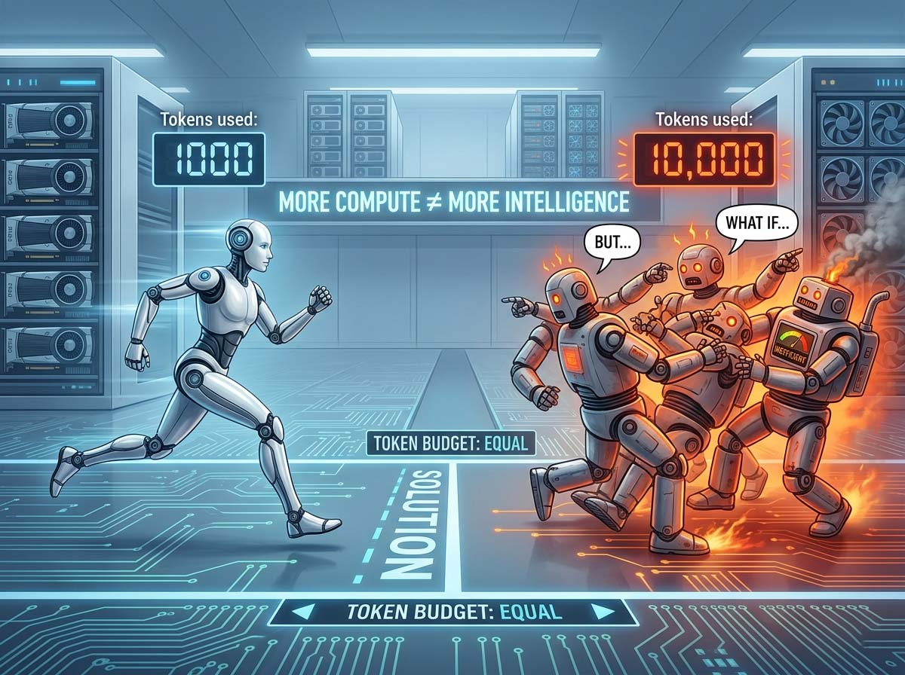
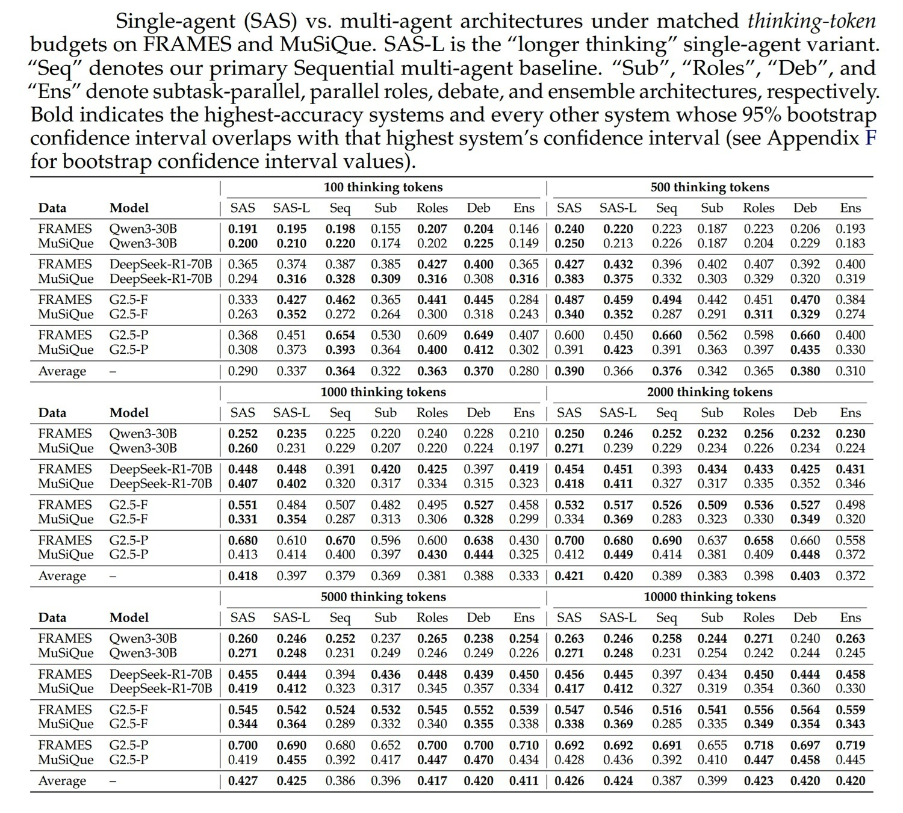
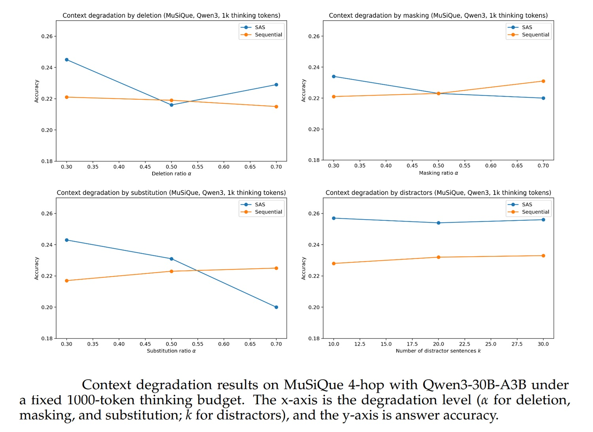

# Più agenti, meno intelligenza? Stanford mette in discussione l'architettura multi-agent

*C'è una scena cult in "Primer", il film di fantascienza a basso budget di Shane Carruth, in cui due ingegneri costruiscono una macchina del tempo nel garage di casa convinti che più componenti aggiungano, meglio funzioni. Poi scoprono, nel modo più doloroso possibile, che la complessità non è sinonimo di potenza: è solo complessità. L'industria dell'intelligenza artificiale sta attraversando in questo momento una crisi filosofica simile, anche se decisamente meno temporale, riguardo ai sistemi multi-agent. E un paper, pubblicato da due ricercatori di Stanford ad aprile 2026, ha il merito di mettere il dito esattamente nella piaga.*

Il titolo del paper: [*Single-Agent LLMs Outperform Multi-Agent Systems on Multi-Hop Reasoning Under Equal Thinking Token Budgets*](https://arxiv.org/abs/2604.02460), è di quelli che non lasciano spazio all'interpretazione. Un singolo agente, nelle condizioni giuste, batte un sistema multi-agent. Non sempre, non ovunque, non per motivi banali. Ma lo batte.

## Cos'è un agente, e perché improvvisamente ce ne vogliono sempre di più

Prima di capire perché il paper è rilevante, vale la pena fermarsi un momento su cosa intendiamo quando diciamo "agente" nel contesto dei modelli linguistici di grandi dimensioni. Un agente, in questo contesto, è semplicemente un'istanza di un modello linguistico a cui viene affidato un compito: riceve un testo in ingresso, una domanda, un problema, un'istruzione, "ragiona" su di esso, e produce una risposta. Tutto qui. Il modello pensa, risponde, fine.

Un sistema multi-agent è invece una pipeline in cui più di questi agenti lavorano insieme, ciascuno vedendo solo una parte del problema o una porzione delle informazioni disponibili, e comunicando attraverso testo generato. In genere c'è un pianificatore che decompone il problema in sottoproblemi, un insieme di lavoratori specializzati che affrontano ciascuno la propria parte, e un aggregatore che sintetizza le risposte parziali in una risposta finale.

L'idea intuitiva è potente: divide et impera. Sembra quasi ovvio che distribuire un compito complesso tra agenti specializzati debba produrre risultati migliori di quello che può fare una sola mente. È esattamente la stessa logica che ci porta a pensare che un'orchestra suoni meglio di un solista, che un team di chirurghi operi meglio di uno solo, che un collettivo creativo produca più di un individuo isolato. E in molti contesti è vera. Il problema è che con i modelli linguistici, il confronto viene quasi sempre fatto in modo scorretto.

## Il trucco del conto nascosto

Quando un sistema multi-agent sembra battere un singolo agente, c'è quasi sempre un motivo molto semplice dietro: ha usato più risorse computazionali. Non è un'architettura migliore. È solo che ha "pensato" di più, nel senso letterale del termine: ha generato più token di ragionamento intermedio.

I modelli linguistici moderni, in particolare quelli "a ragionamento" come DeepSeek, Gemini o Qwen, producono un flusso di pensiero interno prima di rispondere, i cosiddetti *thinking tokens*, o token di pensiero. Questi token non compaiono nella risposta finale, ma sono il mezzo con cui il modello ragiona passo dopo passo prima di produrre l'output. Sono computazionalmente costosi, e il numero di token che un modello usa internamente è direttamente proporzionale alla qualità delle risposte su task complessi.

Ora, il problema è che in un sistema multi-agent ogni agente ha il proprio budget di token di ragionamento. Se hai cinque agenti e ciascuno pensa per mille token, il sistema ha consumato cinquemila token di ragionamento in totale. Se poi confronti questo sistema con un singolo agente a cui ne hai dati solo mille, stai facendo un confronto disuguale. È come paragonare un atleta che si allena cinque ore al giorno con uno che si allena un'ora, e poi stupirsi che il primo corra più veloce.

Questo è esattamente il punto che Dat Tran e Douwe Kiela di Stanford hanno deciso di affrontare con rigore metodologico. Il loro approccio è semplice: imponi un budget totale di token di pensiero uguale per tutti i sistemi, e poi misura chi se la cava meglio. Non token di prompt, non token di output, solo token di ragionamento intermedio. Poi guarda cosa succede.

## Il terreno di prova: domande a catena e risposte che richiedono più passi

I ricercatori hanno scelto due benchmark specifici per i loro esperimenti. Il primo è [FRAMES](https://arxiv.org/abs/2409.12941), un dataset progettato per testare la capacità di recuperare e sintetizzare informazioni da più fonti. Il secondo è [MuSiQue](https://arxiv.org/abs/2108.00573), filtrato per includere solo le domande a quattro salti, cioè quelle che richiedono di concatenare quattro passaggi di ragionamento distinti per arrivare alla risposta corretta. Del tipo: "In quale paese si trova la città natale del regista del film che ha vinto il premio X nell'anno in cui è nato l'autore del libro Y?" Non è un esempio vero, ma rende l'idea della complessità: ogni risposta è vincolata alla precedente, e sbagliare un anello significa perdere l'intera catena.

Le famiglie di modelli usate sono tre: Qwen3-30B, DeepSeek-R1-Distill-Llama-70B, Gemini 2.5 Flash e Gemini 2.5 Pro. I budget di token di pensiero testati vanno da 100 a 10.000, attraverso sei livelli. E le architetture multi-agent confrontate sono cinque, tutte descritte in dettaglio nel paper: la Sequenziale (un pianificatore che divide il problema in passi, agenti che eseguono in serie, un aggregatore finale), la Parallela per Sottotask (stessa logica ma i lavoratori operano in parallelo), quella a Ruoli Paralleli (un risolutore, un estrattore di fatti, uno scettico e un secondo risolutore che operano in parallelo), il Debate (due agenti si confrontano e poi si criticano a vicenda), e infine l'Ensemble (più agenti rispondono indipendentemente e un giudice sceglie la risposta migliore).

L'architettura più interessante da un punto di vista teorico è la Sequenziale, perché è il confronto più pulito con il singolo agente: entrambi affrontano il problema in modo seriale, entrambi usano lo stesso budget totale, l'unica differenza è che nel sistema multi-agent il ragionamento intermedio viene esternalizzato in messaggi espliciti tra agenti, mentre nel singolo agente rimane latente all'interno di una catena continua di pensiero.

## La matematica che ci dice perché il singolo agente dovrebbe vincere

Prima di guardare i numeri, i ricercatori costruiscono un argomento teorico che merita di essere capito, perché ha implicazioni che vanno ben oltre questo paper specifico.

L'argomento si basa sulla "Disuguaglianza di Elaborazione dei Dati", un risultato classico della teoria dell'informazione. In parole molto semplici, dice questo: qualunque trasformazione applichi a un'informazione, non puoi aumentare la quantità di informazione che essa contiene sulla risposta che stai cercando. Puoi solo conservarla o perderla.

Nel contesto dei sistemi multi-agent, questo si traduce in un'osservazione diretta: i messaggi che un agente passa all'agente successivo sono una funzione del contesto originale. Quella funzione non può creare informazione dal nulla. Quindi il contesto originale, visto nella sua interezza da un singolo agente, contiene sempre almeno tanta informazione utile quanto qualsiasi messaggio estratto da esso. Ogni volta che un'informazione viene "riassunta" e passata da un agente all'altro, qualcosa va inevitabilmente perso. La comunicazione è sempre un imbuto.

Il corollario pratico è immediato: se un singolo agente può vedere tutto il contesto disponibile e ha lo stesso budget computazionale di un sistema multi-agent, non c'è nessuna ragione teorica per cui il sistema multi-agent dovrebbe fare meglio. Potrebbe fare lo stesso. Non meglio.

Ma c'è un'eccezione, ed è dove il paper diventa davvero interessante.

[Immagine tratta da arxiv.org](https://arxiv.org/abs/2604.02460)

## Quando il contesto è degradato: l'unico caso in cui i multi-agent recuperano

La garanzia teorica del singolo agente vale solo se il singolo agente utilizza il contesto in modo perfetto. E i modelli linguistici moderni non lo fanno. Ci sono fenomeni ben documentati nella letteratura, dalla diluizione dell'attenzione al cosiddetto "lost in the middle", il fatto cioè che i modelli tendono a ricordare meglio le informazioni all'inizio e alla fine di un contesto lungo piuttosto che nel mezzo, che mostrano come la capacità di usare efficientemente un contesto molto lungo non sia scontata.

I ricercatori formalizzano questo come "degradazione del contesto" e la modellano sperimentalmente attraverso quattro modalità: cancellazione di parti del testo rilevante, mascheramento di informazioni chiave, sostituzione con testo scorretto, e inserimento di distrattori fuorvianti. All'aumentare del livello di degradazione, la garanzia teorica del singolo agente si indebolisce, perché il singolo agente non opera più sul contesto integro ma su una versione rumorosa di esso. In questo caso, un sistema multi-agent ben progettato può compensare parzialmente quel rumore attraverso la strutturazione del lavoro: agenti diversi che vedono parti diverse, che si verificano a vicenda, che filtrano il rumore attraverso più passaggi.

Il punto cruciale è "parzialmente". Anche in condizioni di degradazione severa, i sistemi multi-agent non diventano dominanti in modo netto: diventano *comparabili* al singolo agente. Il vantaggio dell'agente singolo si riduce, ma non si inverte con continuità.

## I numeri, che sono la parte scomoda

La Tabella 1 del paper, che copre 192 combinazioni di modello, dataset, budget e architettura, è di quelle che si guardano con una certa lentezza. Non perché i risultati siano ambigui, ma perché la complessità è reale e merita rispetto.

Il risultato principale è che, a budget uguale di token di pensiero, il singolo agente (SAS) è l'architettura più forte o statisticamente indistinguibile dall'architettura migliore in praticamente tutti i casi al di sopra del budget minimo di 100 token. Con 100 token il modello non produce nessun ragionamento utile, né come singolo agente né come multi-agent, quindi quel livello non dice nulla di interessante.

Guardando i budget intermedi e alti, il pattern è stabile. A 1.000 token di pensiero, per esempio, la media tra tutti i modelli e dataset è 0,418 per SAS contro 0,379 per la Sequenziale, 0,369 per la Parallela e 0,333 per l'Ensemble. A 2.000 token, 0,421 per SAS contro 0,389 per la Sequenziale. A 5.000 token, 0,427 per SAS contro 0,386 per la Sequenziale. La distanza tende a non amplificarsi né a sparire all'aumentare del budget, ma rimane consistente.

Ci sono eccezioni: con Gemini 2.5 Pro a bassi budget, il sistema Sequenziale e il Debate hanno numeri competitivi, a volte leggermente superiori. Ma questi casi sono in parte spiegati da un artefatto tecnico specifico di Gemini che merita menzione a parte.

## Il problema di Gemini e il token accounting opaco

Una delle sezioni diagnostiche più interessanti del paper riguarda Gemini 2.5, e rivela qualcosa di abbastanza scomodo sul modo in cui le API di questi modelli funzionano nella pratica.

Quando si imposta un budget di token di pensiero per Gemini via API, il numero di token di pensiero effettivamente "visibili", cioè che emergono nel testo di risposta, tende a essere molto inferiore al budget richiesto nel caso del singolo agente. I ricercatori mostrano che Gemini sembra "pensare internamente" in modo opaco, producendo meno testo di ragionamento visibile di quanto il budget permetterebbe, mentre in un sistema multi-agent con più chiamate API la quantità totale di pensiero visibile è più alta, semplicemente perché ci sono più chiamate che estraggono testo di ragionamento.

Questo significa che, per Gemini, i confronti a budget nominale uguale non sono del tutto affidabili: il singolo agente potrebbe in realtà stare usando *meno* compute effettiva di quanto richiesto, mentre il sistema multi-agent ne usa di più attraverso le chiamate multiple. È un'irregolarità nel modo in cui Gemini gestisce internamente i token di pensiero, non un vantaggio architetturale del multi-agent.

Per compensare questo, i ricercatori hanno sviluppato la variante SAS-Lm "Longer Thinking", che aggiunge al prompt del singolo agente un'istruzione strutturata: prima di rispondere, identifica le ambiguità, proponi interpretazioni, valutale, poi rispondi. Questa piccola modifica spinge Gemini a produrre più testo di ragionamento visibile, avvicinando il compute effettivo a quello nominale. Il risultato è che SAS-L migliora significativamente su Gemini 2.5 Flash e Pro, mentre ha effetti trascurabili o neutri su Qwen3 e DeepSeek, dove il problema dell'accounting opaco non esiste. Per Gemini 2.5 Flash su MuSiQue, SAS-L è l'architettura più forte in ogni fascia di budget. Un dato significativo.

## La fragilità dei benchmark: il test del parafrasare

C'è un'altra analisi del paper che merita attenzione, perché tocca una questione metodologica che affligge l'intera letteratura sui modelli linguistici: quanto i risultati dipendono dalla formulazione esatta delle domande?

I ricercatori hanno condotto uno studio di ablazione con parafrasi: hanno riscritto le domande dei benchmark con termini diversi ma significato equivalente, e poi misurato quanto cambiavano i risultati. La risposta è: abbastanza. L'accuratezza dei modelli si modifica in modo non trascurabile quando le domande vengono parafrasate, il che suggerisce che parte dei risultati dipende dal fatto che i modelli "riconoscono" le domande dei benchmark, hanno cioè visto durante l'addestramento formulazioni simili o identiche, e le rispondono parzialmente per memoria piuttosto che per ragionamento puro. Questo fenomeno, noto come *benchmark contamination* o memorizzazione, è un problema trasversale a tutta la valutazione dei modelli linguistici, e il paper lo segnala onestamente come limite.

La buona notizia è che la contaminazione sembra distribuirsi in modo relativamente uniforme tra SAS e MAS: non è che i sistemi multi-agent ne beneficiano sistematicamente più del singolo agente, o viceversa. Ma è un avvertimento a non prendere i numeri assoluti di accuratezza come verità definitiva.

[Immagine tratta da arxiv.org](https://arxiv.org/abs/2604.02460)

## Il limite onesto: FRAMES e MuSiQue non sono il mondo reale

Il paper è rigoroso anche nelle sue ammissioni. I due benchmark scelti, FRAMES e MuSiQue, sono ottimi per isolare la capacità di ragionamento a catena su dati strutturati. Ma non sono rappresentativi di tutti i task in cui i sistemi multi-agent vengono effettivamente usati. Sono relativamente "puliti": le domande hanno risposte corrette ben definite, il contesto è fornito esplicitamente, non ci sono strumenti esterni, non c'è incertezza sulle fonti, non c'è l'ambiguità del mondo reale.

Un sistema multi-agent per l'analisi di documenti aziendali che include ricerca web, estrazione da database, verifica di fonti e generazione di report opera in un ambiente molto più caotico di quello testato nel paper. I ricercatori riconoscono esplicitamente questo limite nella sezione dedicata, e invitano a non generalizzare i risultati oltre il dominio del ragionamento a salti multipli su contesto integro. È un avvertimento da tenere presente, e su cui torneremo.

Allo stesso modo, la metrica di valutazione usata, LLM-as-a-judge, cioè usare un altro modello linguistico per giudicare la correttezza delle risposte, ha i propri limiti. Il giudice può essere influenzato dal formato delle risposte, dalla verbosità, dalla "confidenza" con cui un'architettura presenta le proprie conclusioni. I sistemi multi-agent, che aggregano risposte di più agenti, producono spesso risposte più elaborate e strutturate, che un giudice potrebbe valutare positivamente anche quando il contenuto fattuale è simile. I ricercatori hanno cercato di minimizzare questo effetto usando una rubrica fissa, ma il rischio di un bias sistematico del giudice non è completamente eliminabile.

## Quando l'orchestrazione è vera architettura

Detto tutto questo, arriviamo alla domanda che conta davvero per chi deve decidere come costruire sistemi reali: quando ha senso usare un sistema multi-agent e quando invece è compute mascherato da complessità?

La risposta del paper, integrata con il contesto più ampio, porta a distinguere due scenari molto diversi.

Il primo scenario in cui l'orchestrazione ha senso genuino è quello in cui il task richiede fasi operativamente distinte e non intercambiabili: ricerca in sorgenti esterne, recupero dati strutturati, verifica fattuale, pianificazione, esecuzione di strumenti, controllo qualità. In questi casi, la separazione in agenti non è una scelta architettuale per migliorare il ragionamento, è una necessità operativa. L'agente che cerca su web non può fare la stessa cosa dell'agente che genera codice eseguibile. Non si tratta di dividere un problema di ragionamento, ma di orchestrare capacità diverse che non possono coesistere in un unico prompt.

Il secondo scenario in cui l'orchestrazione diventa rilevante è esattamente quello che il paper identifica teoricamente e verifica sperimentalmente: quando il contesto disponibile al singolo agente è degradato, frammentato, rumoroso o troppo lungo per essere utilizzato in modo efficiente. In questi casi, distribuire il lavoro tra agenti che vedono ciascuno  una porzione più piccola e più gestibile del contesto può compensare la perdita di qualità del ragionamento che il singolo agente sperimenta di fronte a un contesto deteriorato. Non è una soluzione magica, e il paper mostra che anche in questi casi il vantaggio multi-agent è spesso modesto, ma è una direzione reale e teoricamente fondata.

C'è anche un terzo scenario, non testato direttamente nel paper ma coerente con il suo framework teorico: i task in cui il numero di passi necessari non è determinabile in anticipo, e dove l'orchestrazione serve a gestire una complessità operativa che cambia dinamicamente durante l'esecuzione. Un sistema che deve monitorare un processo in corso, adattarsi a risultati intermedi imprevisti e coordinare azioni su più sistemi non può essere ridotto a un singolo prompt con un budget fisso. Qui l'orchestrazione non è una scelta di performance ma una necessità strutturale.

## Quando invece è solo compute travestito

Le situazioni in cui la multi-agentness non serve, o serve poco, è forse il più importante per chi deve decidere cosa costruire e cosa non costruire.

Il pattern più comune di pseudo-architettura è il sistema che funziona meglio del singolo agente semplicemente perché usa più compute totale, senza che ci sia nessun vantaggio strutturale reale. Se il tuo sistema multi-agent produce risultati migliori solo perché ha a disposizione cinque volte più token di ragionamento distribuiti tra agenti, non hai un'architettura più intelligente: hai un singolo agente più ricco che si nasconde dietro un'interfaccia più complessa. I dati del paper lo mostrano con chiarezza: quando il budget totale è controllato e uguale, il vantaggio si riduce o sparisce.

Una versione specifica di questo problema è l'Ensemble: più agenti che rispondono indipendentemente alla stessa domanda, e poi un giudice che sceglie la risposta migliore. L'intuizione è quella del "wisdom of the crowd", la legge dei grandi numeri applicata all'intelligenza artificiale. Ma il paper mostra che l'Ensemble è quasi sempre l'architettura peggiore tra quelle multi-agent testate, con medie sistematicamente inferiori al singolo agente e spesso inferiori anche alle altre architetture multi-agent. Il motivo è che campionare più risposte dallo stesso modello non produce diversità vera se il modello è già abbastanza capace: produce varianza, non qualità. Stai comprando margine statistico, non migliore ragionamento.

Lo stesso vale per l'architettura Debate, due agenti che si criticano a vicenda, che produce risultati mediamente simili alla Sequenziale ma non superiori al singolo agente. L'idea che il dibattito tra agenti porti a un ragionamento migliore è seduttiva, ma funziona solo quando gli agenti hanno informazioni o prospettive genuinamente diverse. Se due istanze dello stesso modello affrontano lo stesso problema con lo stesso contesto, la critica tende a essere superficiale o a convergere rapidamente sulla stessa risposta, senza che l'interazione aggiunga valore reale.

Il segnale più facile da riconoscere per capire se si è nel territorio della "compute mascherata" è semplice: togli i token extra e il vantaggio sparisce. Se il tuo sistema multi-agent funziona bene solo quando gli fai fare più tentativi, più discussioni interne, più iterazioni di verifica rispetto a un singolo agente con budget equivalente, non hai un'architettura migliore. Hai un singolo agente con un wrapper decorativo intorno.

## La domanda finale: cosa cambia, in pratica?

Per chi costruisce sistemi reali, le implicazioni pratiche di questo paper sono concrete e immediate. La prima è che i costi di un sistema multi-agent non sono solo monetari. Ci sono costi di osservabilità, un sistema con cinque agenti che comunicano è molto più difficile da ispezionare e debuggare di un singolo agente, e costi di manutenzione, perché ogni interfaccia tra agenti è un punto potenziale di rottura. Se le prestazioni sono equivalenti, il singolo agente è quasi sempre da preferire per semplicità operativa.

La seconda implicazione è che la scelta dell'architettura dovrebbe essere guidata dalla struttura del task, non dalle aspettative o dal marketing. Un task di ragionamento complesso su un contesto ben definito non ha bisogno di orchestrazione. Un workflow che include retrieval da sorgenti esterne, esecuzione di codice e verifica incrociata probabilmente sì.

La terza, e forse più importante, è che ogni volta che si confrontano architetture diverse bisogna guardare al compute totale consumato, non solo al risultato. Un sistema multi-agent che batte un singolo agente usando cinque volte più risorse non è più efficiente: è più costoso. La domanda giusta non è "chi vince?" ma "chi vince a parità di risorse?".

Il paper di Stanford non dice che i sistemi multi-agent sono inutili. Dice qualcosa di più preciso e di più utile: non sono universalmente migliori, il loro presunto vantaggio è spesso un artefatto computazionale, e per i task in cui il ragionamento è il collo di bottiglia principale un singolo agente con un buon budget è difficile da battere. Capire quando questa regola vale e quando invece la complessità operativa richiede davvero orchestrazione è la distinzione che separa un'architettura AI ben progettata da una che è solo, per usare una parola che nel settore ha ancora un alone di mito, "agentica".
