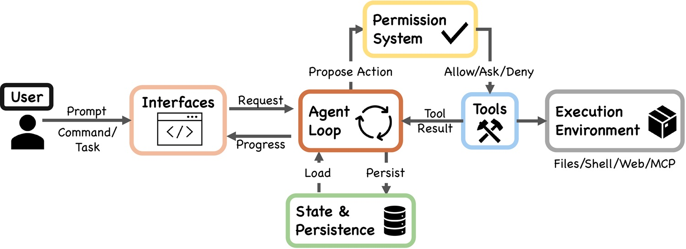
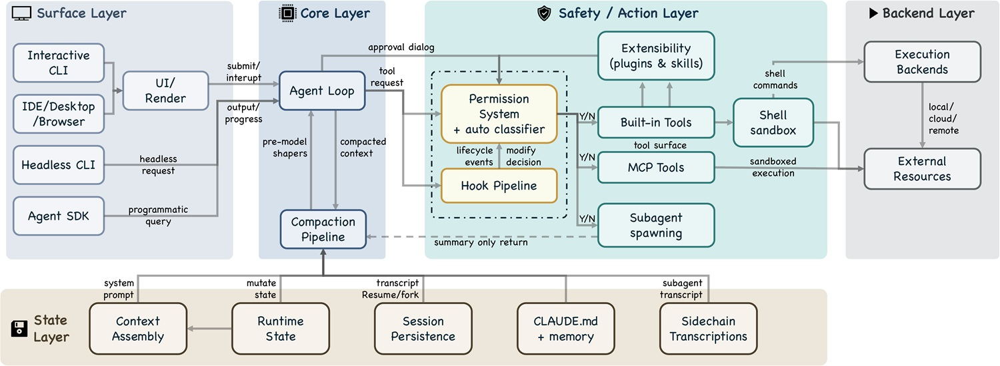
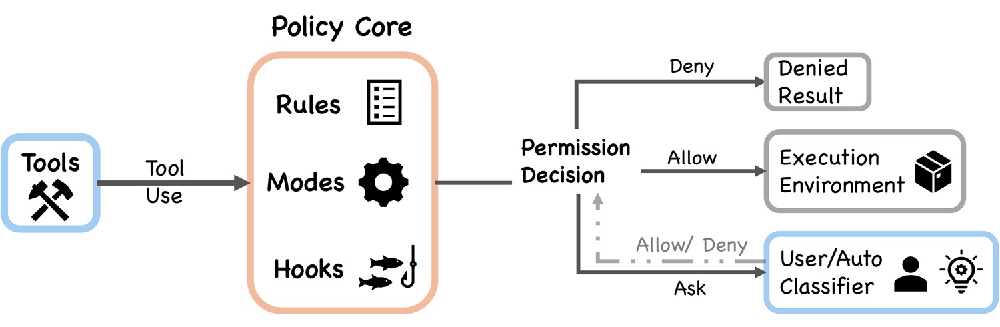
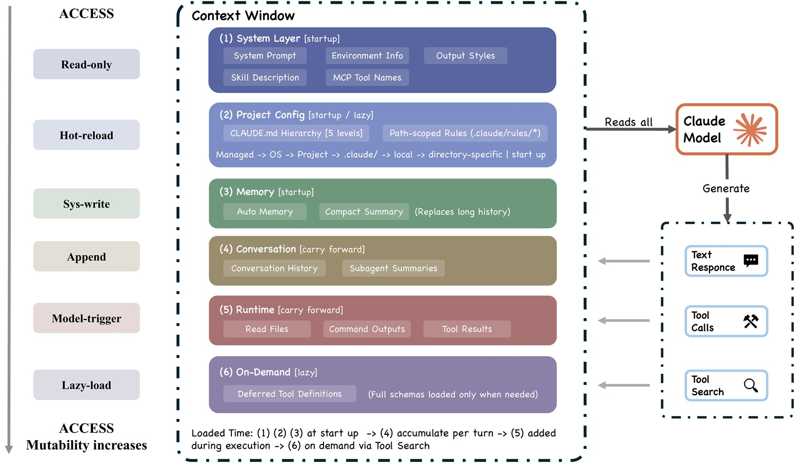

# Au cœur de Claude Code : c'est le système qui compte, pas le modèle

*Il y a un moment précis où un assistant cesse de répondre et commence à agir. Ce n'est pas une question d'intelligence, du moins pas seulement : c'est une question d'architecture. Les chatbots classiques fonctionnent comme des juke-box sophistiqués, ils reçoivent une demande et renvoient un résultat. Les agents de codage comme Claude Code font quelque chose de fondamentalement différent : ils ouvrent des fichiers, exécutent des commandes, lisent le résultat, corrigent les erreurs et recommencent, tout seuls, jusqu'à ce que la tâche soit terminée ou que quelqu'un les arrête. Ce saut de l'auto-complétion à l'autonomie n'est pas cosmétique. Il nécessite une infrastructure que les chatbots n'ont jamais eu besoin de construire.*

C'est exactement le thème au centre de [*Dive into Claude Code: The Design Space of Today's and Future AI Agent Systems*](https://arxiv.org/html/2604.14228v1), un [rapport technique](https://github.com/VILA-Lab/Dive-into-Claude-Code) publié en avril 2026 par des chercheurs de l'Université d'Intelligence Artificielle Mohamed bin Zayed et de l'University College London. Le travail n'est pas une évaluation de produit, ni un benchmark : c'est une analyse architecturale menée en lisant directement le code TypeScript public de Claude Code, dans la version v2.1.88, en le comparant à OpenClaw, un système d'agent open-source aux objectifs similaires mais aux choix de conception très différents. Le résultat est quelque chose de rare dans le paysage de la littérature sur l'IA : une carte raisonnée de la façon dont on construit réellement un agent autonome, et pourquoi certains choix coûtent cher.

Un avertissement nécessaire, que les auteurs eux-mêmes déclarent : il s'agit d'une analyse de la base de code publique, et non d'une étude causale sur les performances en production. Certaines conclusions sont des inférences architecturales plutôt que des preuves expérimentales. L'architecture est cependant la chose la plus révélatrice qui soit, car les choix de conception incarnent des valeurs, et les valeurs se lisent dans le code mieux que dans n'importe quel communiqué de presse.

## Le code autour de la boucle

Le cœur technique de Claude Code est d'une simplicité désarmante : une boucle *while-true* qui appelle le modèle, exécute les outils, recueille les résultats et recommence. On retrouve le même schéma de base dans n'importe quel tutoriel d'introduction sur les agents LLM. Ce n'est pas là que réside l'avantage concurrentiel. Ce qui est intéressant, ce que l'article met systématiquement en lumière, c'est tout le code qui se trouve *autour* de cette boucle.

C'est un peu comme regarder un moteur de Formule 1 : techniquement, c'est un propulseur à combustion interne comme celui de votre voiture, mais le véritable avantage de Ferrari sur un tour de qualification ne réside pas dans le cycle Beau de Rochas, mais dans le système de gestion thermique, dans la boîte de vitesses électro-commandée, dans la simulation aérodynamique qui a décidé de l'angle des ailerons.

Il y a un chiffre qui vaut plus que n'importe quelle diapositive d'entreprise : selon l'analyse de la base de code, seulement 1,6 % du code de Claude Code est de la logique décisionnelle IA au sens strict. Les 98,4 % restants sont de l'infrastructure opérationnelle, de la gestion de contexte, du routage d'outils, des pipelines de récupération. Le modèle, celui que les communiqués de presse mettent toujours en couverture, occupe moins de deux lignes sur cent. Le reste est l'échafaudage qui le rend utile dans le monde réel.

De même, dans Claude Code, la recherche montre que la complexité réelle est répartie sur cinq macro-composants : un système de permissions, un pipeline de compression de contexte, quatre mécanismes d'extensibilité, un système de délégation à des sous-agents, et une archive de session avec une structure orientée vers l'ajout (append-oriented). Aucun de ceux-ci n'est le "modèle IA". Tous déterminent si le modèle IA parvient à faire quelque chose d'utile dans le monde réel.

Ce déplacement du poids architectural du modèle vers l'infrastructure environnante est la thèse centrale de l'article, et elle a des implications qui vont bien au-delà de Claude Code : elle suggère que le prochain champ de bataille dans la guerre des agents ne sera pas tant la qualité du modèle de base, que la solidité du système qui le contient, le contraint et l'active.

[Image tirée du dépôt github](https://github.com/VILA-Lab/Dive-into-Claude-Code)

## Refuser d'abord, demander après

Le système de permissions de Claude Code est construit autour d'un principe qu'on appelle en sécurité informatique le *deny by default* (refus par défaut) : l'agent ne peut rien faire à moins que quelque chose ne l'y autorise explicitement. En pratique, cela se traduit par sept modes de fonctionnement allant de "demander confirmation pour chaque action" à "procéder en autonomie dans un périmètre prédéfini". Le choix du mode actif n'est pas statique : il dépend du contexte, de la session, de la nature de l'outil qui est sur le point d'être invoqué.

Ce qui rend le système particulièrement intéressant est la présence d'un classificateur basé sur l'apprentissage automatique, appelé dans le code *auto-mode classifier*. Sa tâche est de décider, pour chaque action demandée par l'agent, si l'opération entre dans la catégorie "sûre pour procéder en autonomie" ou si elle nécessite l'approbation explicite de l'utilisateur. La logique sous-jacente est raffinée : au lieu de bombarder l'utilisateur de demandes de confirmation pour chaque lecture de fichier (ce qu'on appelle la *prompt fatigue*, l'accoutumance par surcharge de notifications qui pousse les gens à cliquer sur "oui" à tout), le système cherche à placer le contrôle humain uniquement aux points réellement critiques.

L'avantage est évident : un agent qui demande la permission pour chaque micro-action devient inutilisable. Mais le risque miroir est tout aussi réel : un classificateur ML qui décide de ce qui est "sûr" introduit une surface d'attaque subtile, celle des actions que le classificateur ne reconnaît pas comme dangereuses tout en l'étant. L'article le signale explicitement comme l'une des tensions architecturales ouvertes, celle entre sécurité et autonomie opérationnelle, qui n'a pas de solution définitive mais seulement des calibrages continus. Le pipeline d'autorisation ajoute des couches supplémentaires : pré-filtrage, hooks *PreToolUse*, évaluation des règles et gestionnaire de permissions, en séquence. C'est un système par couches, non monolithique, ce qui le rend extensible mais aussi complexe à raisonner dans son intégralité.

[Image tirée du dépôt github](https://github.com/VILA-Lab/Dive-into-Claude-Code)

## La mémoire qui oublie

S'il y a un problème que tout développeur ayant utilisé un agent LLM sur des tâches complexes connaît bien, c'est celui-ci : à un moment donné, au beau milieu d'un travail de longue haleine, l'agent commence à sembler confus. Il perd le fil. Il répète des actions déjà effectuées. Il prend des décisions qui contredisent les précédentes. Ce n'est pas un problème d'intelligence : c'est un problème de contexte. Les modèles de langage ont une fenêtre de contexte finie, une mémoire de travail qui se remplit, et quand elle est pleine, il faut faire des choix sur ce qu'il faut garder et ce qu'il faut écarter.

La solution de Claude Code est un pipeline de compression de contexte articulé en cinq étapes, qui dans l'article sont appelées budget reduction, snip, microcompact, context collapse et auto-compact. Chaque étape correspond à une stratégie différente de réduction : de la simple troncature des sections les moins pertinentes à la synthèse active de parties de la conversation via le modèle lui-même. Le mécanisme final, auto-compact, intervient automatiquement lorsque le contexte approche de la limite maximale, produisant un résumé compressé de toute la session qui est ensuite utilisé comme point de départ pour continuer.

Le compromis ici est réel et inévitable : toute compression est une perte. Un résumé est par définition moins informatif que l'original, et la cohérence sur des tâches très longues, celles qui durent des heures ou des jours et touchent de nombreuses parties d'une base de code, en souffre inévitablement. C'est le problème du *téléphone arabe* appliqué à l'IA : chaque étape de compression introduit une marge de distorsion. L'article identifie la gestion de la mémoire comme l'une des six directions ouvertes pour les systèmes d'agents du futur, car personne n'a encore trouvé de solution satisfaisante qui ne sacrifie ni l'efficacité ni la cohérence.

## Étendre sans exploser

L'une des questions de conception les plus épineuses pour toute plateforme est la suivante : comment ajouter des fonctionnalités sans rendre le système ingérable ? Claude Code répond par quatre mécanismes distincts d'extensibilité : les serveurs MCP (Model Context Protocol), les plugins, les skills et les hooks. Ce n'est pas une redondance, chacun sert un objectif spécifique dans l'architecture.

Les MCP sont le mécanisme le plus large : ils permettent de connecter Claude Code à des services externes via un protocole standardisé, qu'Anthropic a conçu comme un standard ouvert pour l'écosystème. Les plugins modifient le comportement de l'agent en ajoutant de nouveaux outils à son répertoire. Les skills sont des instructions structurées qui guident l'agent dans l'exécution de procédures complexes. Les hooks sont le mécanisme le plus chirurgical : des morceaux de code qui s'insèrent à des points précis du cycle d'exécution (pré-action, post-action) pour surveiller, transformer ou bloquer les opérations. L'article décrit le *tool pool assembly*, c'est-à-dire le processus par lequel Claude Code décide quels outils mettre à la disposition de l'agent dans chaque session, comme un moment critique où ces quatre mécanismes s'intègrent.

Quatre mécanismes au lieu d'un, ce n'est pas un cas de sur-ingénierie : cela reflète un choix conscient de séparer les préoccupations. Un hook ne fait pas la même chose qu'un plugin, et les confondre produirait un système plus simple en apparence mais plus fragile en pratique. Le risque est cependant la complexité combinatoire : chaque mécanisme interagit avec les autres, et la surface d'attaque s'accroît avec chaque extension ajoutée. Ici, la frontière entre "outil puissant" et "vecteur d'injection" peut devenir mince.

[Image tirée du dépôt github](https://github.com/VILA-Lab/Dive-into-Claude-Code)

## Équipes d'agents, îles de contexte

Lorsqu'une tâche est trop importante pour un seul agent, Claude Code peut la déléguer à des sous-agents. Le mécanisme est simplement appelé *Agent Tool* dans le code, et c'est l'un des points les plus puissants de l'architecture. L'idée : l'agent principal décompose le problème, confie des sous-problèmes à des instances séparées du modèle, recueille les résultats et les synthétise. En pratique, c'est comme gérer une équipe : le chef de projet ne fait pas tout tout seul, il coordonne des spécialistes.

Chaque sous-agent fonctionne de manière isolée, avec son propre contexte et, éventuellement, son propre *worktree* Git séparé. Cet isolement est à la fois une force et une faiblesse. D'un côté, il empêche les interférences : deux sous-agents travaillant sur des modules différents du même projet ne se marchent pas sur les pieds. De l'autre, il produit ce que l'article appelle la *fragmentation du contexte* : les sous-agents ne partagent pas automatiquement ce qu'ils savent, et recoudre la connaissance distribuée nécessite un surcoût de coordination explicite. Si un sous-agent a découvert quelque chose d'important dans le module A, le sous-agent qui travaille sur le module B ne le saura pas à moins que l'agent orchestrateur ne le transmette explicitement.

Les transcriptions des sous-agents, appelées *sidechain transcripts*, sont conservées séparément de la transcription principale de la session. C'est un choix cohérent avec le principe architectural général du système : tout est orienté vers l'ajout, tout est vérifiable, rien n'est supprimé. Mais cela ajoute de la complexité à la gestion de la session, et pose des questions encore ouvertes sur la façon dont un système futur pourrait permettre aux sous-agents de partager des connaissances de manière plus fluide sans compromettre l'isolement qui les rend fiables.

## OpenClaw au miroir

La comparaison avec OpenClaw est la partie la plus instructive de l'article pour qui veut comprendre non pas Claude Code en soi, mais les principes généraux de la conception des agents. OpenClaw est un système open-source orienté vers l'assistance personnelle multi-canal : il peut recevoir des messages de Slack, Discord, d'autres canaux de messagerie, et orchestrer des équipes d'agents configurés via de simples fichiers Markdown. Même catégorie de problème, choix architecturaux très différents.

La différence la plus révélatrice concerne le modèle de confiance et de sécurité. Claude Code adopte une évaluation par action : chaque outil, chaque opération, passe par le pipeline d'autorisation. OpenClaw déplace le contrôle au périmètre du système : l'accès est vérifié à l'entrée, dans la passerelle (gateway), et une fois à l'intérieur, les agents opèrent avec une plus grande liberté. Aucune des deux approches n'est mauvaise dans l'absolu : la première est plus granulaire et adaptée à un contexte où chaque action peut avoir des effets directs sur le système de fichiers de l'utilisateur, la seconde est plus adaptée à une passerelle qui doit gérer de nombreux agents en parallèle sans devenir un goulot d'étranglement d'autorisations.

Sur la gestion du contexte, la différence est tout aussi nette. Claude Code optimise la fenêtre de contexte individuelle, avec le pipeline de compaction décrit plus haut. OpenClaw préfère l'enregistrement centralisé des capacités au niveau de la passerelle, où les outils disponibles sont connus globalement et n'ont pas besoin d'être repassés dans chaque session individuelle. La mémoire persistante d'OpenClaw, structurée en quatre couches (session, quotidienne, à long terme et partagée), répond au même problème que la compaction de Claude Code mais avec une philosophie opposée : au lieu de comprimer et d'oublier, elle archive et accumule. Les deux paient un prix : Claude Code risque la perte de cohérence sur des tâches longues, OpenClaw risque la prolifération incontrôlée de mémoire obsolète.

Ce qui ressort de la comparaison n'est pas un classement, mais une leçon de conception : les mêmes questions architecturales fondamentales (où placer la sécurité, comment gérer le contexte, comment organiser la délégation) produisent des réponses différentes selon le contexte de déploiement, les exigences de sécurité et les hypothèses sur les utilisateurs. Il n'existe pas d'architecture universellement correcte pour les agents IA. Il existe des compromis qui doivent être déclarés.

[Image tirée du dépôt github](https://github.com/VILA-Lab/Dive-into-Claude-Code)

## Ingénierie système, pas prompt

Il y a une phrase dans l'article qui résume tout le travail : le véritable avantage concurrentiel des agents ne réside pas seulement dans le modèle, mais dans l'infrastructure qui l'entoure. Autrement dit : le *prompt engineering*, l'art de convaincre un LLM de faire des choses via des formulations ingénieuses, devient une compétence de moins en moins suffisante. Ce qui compte vraiment, pour ceux qui construisent des agents qui doivent fonctionner en production, sur des tâches complexes, dans des environnements hostiles ou simplement imprévisibles, c'est le *systems engineering* : contrôle des accès, gestion du contexte, délégation sécurisée, persistance vérifiable.

Cela change le profil de la compétence requise. Un agent de codage n'est pas un produit IA au sens strict : c'est un système logiciel qui utilise un composant IA comme moteur de raisonnement, mais dont la qualité dépend de la qualité de toute l'architecture. Il est plus proche d'un système d'exploitation embarqué que d'un chatbot sophistiqué.

Les directions ouvertes identifiées par l'article sont au nombre de six : combler le fossé entre observabilité et évaluation (aujourd'hui, il est difficile de comprendre pourquoi un agent a échoué silencieusement), construire une persistance inter-sessions authentique, faire évoluer les limites du *harness* (le périmètre à l'intérieur duquel l'agent opère), mettre à l'échelle l'horizon de planification, aborder la gouvernance des agents autonomes à l'échelle, et répondre à la question la plus dérangeante : les agents actuels amplifient-ils les capacités humaines à court terme, mais contribuent-ils à la croissance des compétences humaines à long terme, ou les érodent-ils ?

Cette dernière question n'est pas rhétorique. Un système qui automatise trop bien risque de rendre superflue la compréhension profonde qui rend possible l'automatisation elle-même. C'est le syndrome du pilote automatique appliqué au logiciel : plus il devient bon, moins le pilote se souvient comment piloter. L'article appelle cela "long-term capability preservation" et le laisse, honnêtement, comme une question ouverte.

Le principal mérite de ce travail est méthodologique : démontrer que l'on peut faire de l'archéologie architecturale sur un système de production en lisant le code public, et que cette archéologie produit des intuitions authentiques sur l'avenir du secteur. Les limites sont celles déclarées : pas de benchmark causal, pas de validation empirique des performances, et une analyse liée à un instantané précis du code, la version v2.1.88, qui pourrait déjà avoir changé. Mais la structure conceptuelle qui émerge, la carte des compromis entre sécurité et autonomie, entre mémoire et cohérence, entre extensibilité et complexité, est suffisamment stable pour durer plus longtemps qu'une mise à jour de version.
