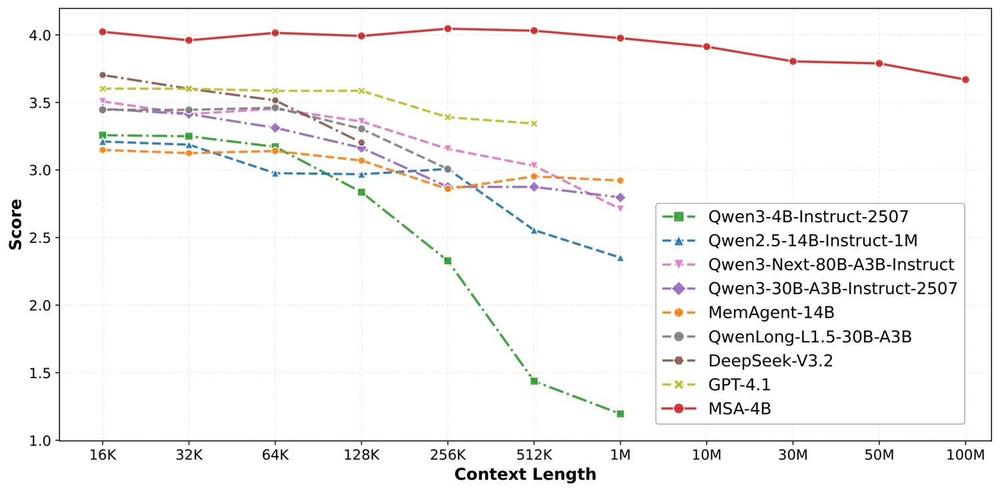
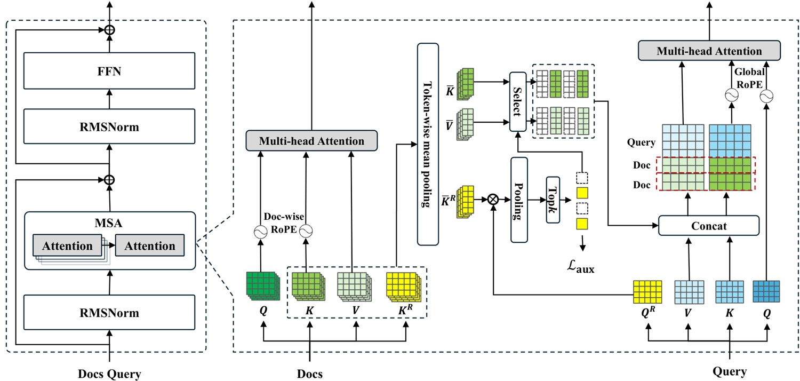
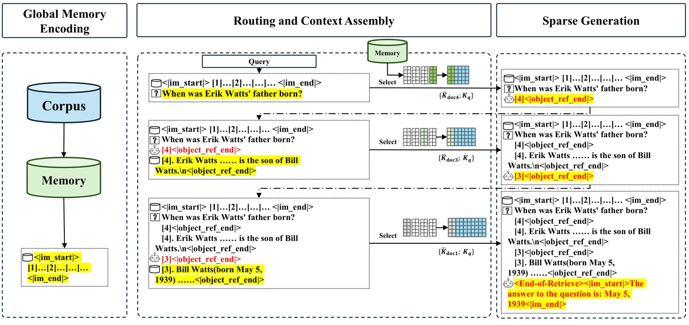

# 100 milioni di token: memoria o miraggio?

*Proviamo a ragionare per immagini. Cento milioni di token non è un numero che il cervello umano riesce a visualizzare spontaneamente, quindi serve un'ancora. Un token, nella lingua dei modelli linguistici, corrisponde approssimativamente a tre quarti di una parola inglese, quindi un po' meno in italiano. Diecimila token sono più o meno settantacinque pagine di testo. Un milione di token rappresenta l'intera *Recherche* di Proust, quella cosa in sette volumi che quasi tutti fingono di aver letto. Dieci milioni di token coprono l'intera opera di Shakespeare più la Bibbia più qualche enciclopedia di medie dimensioni. Cento milioni di token sono qualcosa nell'ordine di una piccola biblioteca universitaria, diciamo sessantamila romanzi di media lunghezza caricati in un unico contesto attivo, disponibili simultaneamente per un modello linguistico che risponde alle domande.*

È questo il claim centrale del progetto [Memory Sparse Attention](https://github.com/EverMind-AI/MSA) (MSA), pubblicato dal team di [EverMind](https://evermind.ai/blogs/breaking-the-100m-token-limit-msa-architecture-achieves-efficient-end-to-end-long-term-memory-for-llms) a marzo 2026 su [Zenodo](https://zenodo.org/records/19103670) e accompagnato da un repository GitHub che al momento conta oltre 3000 stelle. L'affermazione è netta: un'architettura capace di scalare la memoria contestuale fino a 100 milioni di token mantenendo meno del 9% di degradazione delle prestazioni rispetto al punto di partenza. Per chi lavora con modelli linguistici nel 2026, dove il confine pratico dell'attenzione piena si attesta ancora tra i 128.000 e il milione di token prima che le cose inizino a deteriorarsi seriamente, questa è una cifra che merita attenzione. Merita anche qualche domanda.

## Il collo di bottiglia che frena tutto

Per capire cosa propone MSA occorre prima capire perché il problema esiste. I Transformer, l'architettura su cui poggiano praticamente tutti i grandi modelli linguistici contemporanei, hanno un difetto strutturale noto: l'attenzione a piena densità scala in modo quadratico rispetto alla lunghezza del contesto. In termini pratici, questo significa che raddoppiare il contesto non raddoppia il costo computazionale, lo quadruplica. A 128.000 token la situazione è già impegnativa; a un milione diventa proibitiva; a cento milioni è semplicemente impossibile con l'architettura standard, indipendentemente dalla quantità di GPU che si mette in campo.

Le soluzioni esistenti si dividono grossolanamente in tre famiglie, nessuna delle quali soddisfacente. La prima è la compressione degli stati latenti, come nelle architetture lineari o ibride (Mamba, Jamba e simili), che riducono la complessità computazionale ma tendono a perdere informazione progressivamente, come una fotocopia di una fotocopia di una fotocopia. La seconda è la memoria esterna tramite RAG (Retrieval-Augmented Generation): si tiene fuori dal contesto attivo un corpus di documenti e si recuperano i pezzi rilevanti al momento della query. Funziona, è già in produzione ovunque, ma introduce una discontinuità strutturale: il retrieval e la generazione sono due sistemi separati, addestrati separatamente, ottimizzati separatamente, e questa separazione ha un costo in termini di coerenza e ragionamento multi-hop. La terza famiglia è l'estensione bruta del contesto, che sconta tutti i problemi quadratici di cui sopra.

MSA si propone di occupare un quarto spazio, fino ad ora poco esplorato: un meccanismo di attenzione sparsa addestrato end-to-end, che integra il retrieval direttamente nell'architettura del Transformer senza spezzare la catena differenziabile. L'intuizione è brillante. L'esecuzione richiede esame.

## Il cervello a due velocità

L'architettura MSA si ispira, almeno metaforicamente, a qualcosa di simile alla distinzione neuropsicologica tra memoria di lavoro e memoria a lungo termine. Non è una novità concettuale in assoluto, ma il modo in cui viene implementata ha alcune caratteristiche originali.

Il punto di partenza è la separazione fisica della memoria. Quando un documento viene processato da MSA, il modello produce tre tipi di rappresentazioni compresse: le chiavi di routing (Kᵣ), le chiavi di contenuto (K̄) e i valori di contenuto (V̄). Le chiavi di routing sono vettori molto compressi, leggeri, pensati per fare una sola cosa: rispondere velocemente alla domanda "questo documento è rilevante per la query corrente?". Il loro posto è nella VRAM della GPU, dove la latenza di accesso è nell'ordine dei microsecondi. Il contenuto completo, chiavi e valori K̄/V̄, viene invece spostato nella RAM di sistema della CPU, molto più abbondante e molto meno costosa, ma più lenta. Quando il router decide che un documento è rilevante, solo allora quel contenuto viene trasferito dalla RAM alla VRAM per partecipare al calcolo dell'attenzione.

Questo schema, che il team chiama Memory Parallel, permette di distribuire la fase di routing su più GPU in parallelo: ognuna gestisce una porzione delle chiavi di routing, le query vengono trasmesse in broadcast, i punteggi di rilevanza vengono aggregati, e solo i documenti top-k selezionati vengono effettivamente caricati. Il tutto, sostengono gli autori, su una configurazione di sole due GPU NVIDIA A800.

Il secondo elemento architetturale rilevante è la document-wise RoPE, una variante delle embeddings di posizione rotazionali (RoPE) usate nei Transformer moderni. Il problema con RoPE standard in contesti lunghissimi è che il modello, addestrato su sequenze corte, "non sa" come interpretare le posizioni molto alte che compaiono durante l'inferenza su contesti lunghi, con conseguente degradazione delle prestazioni. La soluzione proposta da MSA è semplice: il contatore di posizione si azzera all'inizio di ogni documento. Ogni testo inizia sempre dalla posizione zero, indipendentemente da quanti documenti lo precedono nella memoria. Questo permette a un modello addestrato su sequenze di 64.000 token di estrapolarne 100 milioni senza mai vedere posizioni fuori distribuzione.

La scelta è intelligente, ma introduce una conseguenza che vale la pena notare: i documenti nella memoria diventano, dal punto di vista posizionale, ordinatamente indistinguibili tra loro. Il modello sa cosa c'è dentro ciascun documento, ma non ha un segnale posizionale che indichi quale documento è "più recente" o "più antico" nella sequenza temporale assoluta. Per applicazioni dove l'ordine cronologico conta, questo è un limite reale che il paper riconosce solo implicitamente.

[Immagine tratta dal repository GitHub](https://github.com/EverMind-AI/MSA)

## Memory Interleave: ragionamento o recupero intelligente?

Il terzo pilastro dell'architettura è probabilmente quello più interessante dal punto di vista del ragionamento, e anche quello che solleva le domande più difficili. Si chiama Memory Interleave, e affronta un problema che i sistemi RAG tradizionali gestiscono male: le domande multi-hop.

Una domanda multi-hop è una domanda la cui risposta richiede di collegare informazioni sparse in documenti diversi, dove l'informazione nel documento B è necessaria per capire quale parte del documento C cercare. "Chi era il regista del film preferito dello scrittore che vinse il premio Booker nel 1981?" è un esempio banale: servono almeno tre passaggi, e ogni passaggio dipende dal risultato del precedente. Un sistema RAG che recupera documenti una volta sola, prima di generare, ha strutturalmente difficoltà con questo tipo di ragionamento. Può recuperare cinque documenti, sperando che contengano tutto il necessario, ma è una scommessa cieca.

Memory Interleave propone invece un ciclo iterativo: il modello alterna fasi di "generative retrieval" (produce gli identificatori dei documenti che vuole leggere), fasi di recupero effettivo di quei documenti, e fasi di generazione parziale, finché non ha abbastanza evidenza per rispondere. Il numero di documenti recuperati per ogni round è determinato dinamicamente dal modello stesso, non da un iperparametro fisso. Gli esperimenti di ablazione nel paper mostrano che rimuovere Memory Interleave provoca una caduta media di 5,3 punti percentuali sui benchmark QA, e di 19,2 punti sul solo HotpotQA, un dataset specificamente progettato per il ragionamento a due hop.

Questi numeri sono convincenti, ma qui sorge una domanda giornalisticamente rilevante che il paper non risolve esplicitamente: Memory Interleave migliora il ragionamento del modello, o migliora semplicemente il retrieval? La distinzione non è accademica. Se l'effetto è principalmente che il modello recupera informazioni più utili grazie alle iterazioni, allora la capacità di ragionamento sottostante rimane quella del backbone Qwen3-4B, e i miglioramenti su HotpotQA riflettono un retrieval più intelligente, non una capacità inferenziale superiore. Se invece il meccanismo iterativo permette al modello di costruire catene di ragionamento più complesse di quelle che potrebbe costruire con tutte le informazioni già presenti nel contesto, allora siamo di fronte a qualcosa di strutturalmente nuovo.

Il paper non fornisce esperimenti che distinguano tra questi due scenari in modo netto, e il fatto che MuSiQue, il dataset di ragionamento multi-hop a tre o più passaggi, mostri il punteggio assoluto più basso di tutta la tabella (2,211 su 5) suggerisce che, al crescere della complessità inferenziale, i guadagni si ridimensionano. Questa non è una critica, è un'area aperta che la ricerca successiva dovrà esplorare.

## I numeri sotto la lente

Passiamo ai benchmark, che meritano attenzione separata e occhio critico. Il setup sperimentale descritto nel [repository GitHub](https://github.com/EverMind-AI/MSA) usa nove dataset di question answering (MS MARCO, Natural Questions, DuReader, TriviaQA, NarrativeQA, PopQA, 2WikiMultiHopQA, HotpotQA, MuSiQue) con banche di memoria che vanno da 277.000 a 10 milioni di token, più i test NIAH (Needle-in-a-Haystack, nella versione RULER) fino a un milione di token. Il backbone (modello di base) è Qwen3-4B-Instruct, un modello da quattro miliardi di parametri del 2025.

I risultati nella comparazione con RAG sullo stesso backbone sono genuinamente impressionanti: MSA ottiene un punteggio medio di 3,760 su 5 contro il 3,242 del miglior RAG con reranker, un miglioramento relativo dell'11,5%. Su MS MARCO, il dataset con la banca di memoria più grande (7,34 milioni di token), il divario si allarga notevolmente: 4,141 contro 3,032, circa il 37% di vantaggio. Su HotpotQA MSA supera il RAG+reranker di circa il 4%. Su NarrativeQA, tuttavia, perde: il RAG con reranker ottiene 3,638 contro 3,395 di MSA, l'unico dataset su nove dove MSA non è il migliore nel confronto a parità di backbone.

Il confronto con sistemi RAG su backbone molto più grandi (KaLMv2 con Qwen3-235B e con Llama-3.3-70B) è più sfumato. MSA da 4B parametri ottiene la migliore media assoluta (3,760) ma perde su quattro dataset su nove rispetto alle configurazioni più forti, e il vantaggio medio su Qwen3-235B con reranker è del 5%. In pratica, un modello sessanta volte più piccolo tiene il passo con un colosso da 235 miliardi di parametri quando il vantaggio architetturale nella gestione della memoria è sufficientemente grande da compensare la differenza di scala. È un risultato notevole, ma va letto senza iperboli.

Due aspetti del setup sperimentale meritano però di essere dichiarati esplicitamente, perché condizionano come leggere i numeri. Primo: la metrica di valutazione per i benchmark QA è un giudice LLM che assegna punteggi da 0 a 5. Questo tipo di valutazione, pur essendo diventato standard nel campo, porta con sé una variabilità intrinseca, e il fatto che il modello giudice non sia specificato nel README aggiunge un'opacità che in un paper peer-reviewed non sarebbe accettabile. Secondo: il benchmark di scalabilità principale, la curva 16K→100M token con meno del 9% di degradazione, è misurata su MS MARCO, un solo dataset. La generalizzazione di quella curva ad altri tipi di contenuto, distribuzione delle domande, o lingue diverse dall'inglese è tutta da dimostrare.

Sul fronte NIAH, i risultati sono più netti e più facili da valutare: MSA mantiene il 94,84% di accuratezza a un milione di token, mentre il backbone non modificato crolla al 24,69%. I modelli a attenzione lineare ibrida (la concorrenza più diretta) mostrano degradazione apprezzabile già dai 128.000-256.000 token. Questo è il risultato più solido del paper, perché il benchmark NIAH è standardizzato, ampiamente usato nella comunità e non lascia molti margini di ambiguità interpretativa.

Al momento della stesura, il codice è pubblicamente disponibile sul repository GitHub, con istruzioni di installazione, il modello MSA-4B scaricabile direttamente da Hugging Face e i benchmark replicabili tramite script. Questo è un segnale di maturità non banale: significa che i risultati sono in linea di principio verificabili da chiunque abbia l'hardware adeguato, e che la comunità può iniziare a testare il sistema su casi d'uso propri.

[Immagine tratta dal repository GitHub](https://github.com/EverMind-AI/MSA)

## 100 milioni di token su 2×A800: a che prezzo?

"Complessità quasi lineare" è una delle frasi più abusate nel vocabolario della ricerca sui Transformer, e richiede quasi sempre una traduzione. Nel caso di MSA, la complessità formale di O(L) si riferisce alla fase di routing e attenzione sparsa, ma nasconde una serie di costi concreti che un articolo serio non può ignorare.

Il primo costo è la latenza di fetch dalla memoria CPU. Quando il router decide quali documenti caricare, quei dati devono essere trasferiti dalla RAM di sistema alla VRAM della GPU attraverso il bus PCIe, che ha una banda tipica di 16-32 GB/s. Per cento milioni di token, anche con una compressione aggressiva della KV cache, le dimensioni dei dati da trasferire per query possono essere dell'ordine di gigabyte. Il paper non riporta numeri espliciti di latenza end-to-end per singola query, e questa è un'omissione rilevante per chiunque voglia valutare la fattibilità in produzione.

Il secondo costo è la fase di encoding offline. Prima che MSA possa rispondere a qualsiasi domanda su un corpus, deve processare tutti i documenti in quel corpus per produrre le rappresentazioni K̄, V̄ e Kᵣ. Questo è un costo una tantum per corpus statici, ma diventa un problema ricorrente per corpus che si aggiornano frequentemente, come gli storici di conversazione in un'applicazione agente o i feed di dati aziendali in tempo reale. Il paper descrive questo come encoding offline, il che suggerisce che l'architettura è pensata principalmente per corpus relativamente stabili.

Il terzo costo è quello di memoria persistente. Un corpus da 100 milioni di token, anche con compressione aggressiva, richiede quantità significative di RAM di sistema. Senza cifre specifiche dal paper sui ratio di compressione effettivi e sulle dimensioni risultanti della KV cache compressa, è difficile stimare i costi infrastrutturali precisi, ma per un deployment enterprise su corpora reali siamo probabilmente nell'ordine di centinaia di gigabyte di RAM. Non impossibile, ma non banale.

Questo porta alla domanda centrale, che vale la pena formulare esplicitamente: MSA risolve il collo di bottiglia della memoria, oppure sposta la complessità su storage, retrieval e orchestration? La risposta onesta è che entrambe le cose sono vere allo stesso tempo. MSA alleggerisce genuinamente il problema della complessità quadratica dell'attenzione, integrando il retrieval in modo differenziabile e ottenendo risultati migliori del RAG su praticamente tutti i benchmark testati. Ma non elimina la complessità infrastrutturale: la distribuisce su componenti diverse, alcune delle quali (il trasferimento CPU-GPU, la gestione della RAM, l'encoding offline) non sono ancora ben documentate nel materiale pubblico disponibile. Per un team di ricerca, è un progresso reale. Per un team di ingegneria che deve portarlo in produzione, restano domande aperte.

## EverMind: memoria come servizio

Chi c'è dietro MSA vale la pena capirlo, perché la lettura del progetto cambia sensibilmente a seconda del contesto. EverMind è una startup con sede a Singapore, fondata con l'obiettivo dichiarato di costruire infrastruttura di memoria a lungo termine per agenti AI. Il suo prodotto principale è EverOS, un sistema di gestione della memoria per agenti che integra diverse tecniche, inclusa MSA, in una piattaforma più ampia. Il team ha pubblicato a fine marzo 2026 risultati su quattro benchmark di memoria (LoCoMo, LongMemEval, PersonaMem e un framework di valutazione proprietario) rivendicando prestazioni allo stato dell'arte.

La traiettoria è quella di una startup che costruisce quello che nel gergo del settore si chiama "Memory-as-a-Service": un livello di astrazione che si inserisce tra i modelli linguistici di base e le applicazioni, gestendo la persistenza, il recupero e l'organizzazione dei ricordi dell'agente nel tempo. È un posizionamento industriale coerente, e MSA ne è la base tecnica. 

Il fatto che il paper sia stato pubblicato su [arXiv](https://arxiv.org/html/2603.23516v2), e non su una sede minore, e che il codice sia già disponibile pubblicamente su GitHub, con il modello MSA-4B scaricabile direttamente da Hugging Face e i benchmark eseguibili tramite script, è un segnale di maturità non banale. I risultati sono in linea di principio verificabili da chiunque abbia l'hardware adeguato, e la comunità può iniziare a testare il sistema su casi d'uso propri. La ricerca viene comunicata pubblicamente e gli asset tecnici sono aperti: per una startup in fase early non è la norma, ed è un elemento che pesa positivamente nella valutazione complessiva del progetto.

I tredici autori del paper (tra cui Chen Yu, Chen Runkai, Yi Sheng e altri, con Lidong Bing e Tianqiao Chen come figure senior) rappresentano un team di dimensioni e profilo credibili per il tipo di lavoro descritto. Non ci sono, al momento, valutazioni indipendenti dei risultati da parte di gruppi di ricerca terzi, il che è normale per un paper di pochi mesi fa, ma è un elemento da tenere a mente quando si leggono le percentuali di miglioramento.

[Immagine tratta dal repository GitHub](https://github.com/EverMind-AI/MSA)

## Proof-of-concept elegante o sistema pronto?

È la domanda che ogni articolo onesto su questo tipo di ricerca deve porsi, e la risposta qui è chiaroscura. MSA è, allo stato attuale, un sistema convincentemente descritto, con risultati benchmark credibili su un set di test sufficientemente ampio da non poter essere liquidato come cherry picking (scelta delle informazioni più vantaggiose), e con un'architettura che ha una logica interna coerente e ben motivata. Non è una promessa vuota.

Al tempo stesso, probabilmente non è ancora un sistema pronto per la produzione nel senso ingegneristico del termine. I benchmark di scalabilità a 100 milioni di token sono dimostrati su un solo dataset (MS MARCO), e la degradazione effettiva su altri tipi di contenuto a quella scala è sconosciuta. Le prestazioni su NarrativeQA, il dataset con le storie più lunghe e la comprensione più contestuale, sono l'unico caso dove MSA perde contro il RAG con reranker, suggerendo che i contenuti narrativi densi potrebbero essere un punto debole. La latenza di query end-to-end, il costo di encoding del corpus e i requisiti di RAM di sistema non sono comunicati con la precisione necessaria per una valutazione ingegneristica.

C'è anche una domanda più sottile sulla portabilità. Tutti i risultati sono ottenuti su Qwen3-4B, un backbone specifico con caratteristiche specifiche. MSA richiede di addestrare il router e il meccanismo di attenzione sparsa end-to-end: non è qualcosa che si innesta su un modello preaddestrato qualsiasi come un plugin. Il paper descrive un training su 158,95 miliardi di token con una perdita ausiliaria di routing, seguita da due fasi di fine-tuning supervisionato con curriculum da 8.000 a 64.000 token. Replicare questo processo su un backbone diverso (Llama, Mistral, Gemma) richiederebbe risorse e tempo considerevoli, e non è garantito che i risultati si trasferiscano identici.

Disco Elysium, il gioco di ruolo narrativo di ZA/UM, costruisce il suo sistema di memoria su frammenti, sussurri, ricordi che il protagonista recupera in modo iterativo e spesso inaffidabile per ricostruire una storia più grande. MSA, in qualche modo, fa qualcosa di simile: recupera frammenti sparsi di una biblioteca enorme, li assembla iterativamente, cerca di costruire un ragionamento coerente. La differenza è che nel gioco il fallimento del retrieval è parte del racconto; in un sistema di produzione, è un bug. Quanto spesso MSA fallisce nel recuperare i frammenti giusti, e con quali conseguenze, è esattamente il tipo di domanda a cui solo il codice pubblico e la sperimentazione indipendente possono rispondere.

MSA merita attenzione, studio e sperimentazione diretta. La domanda se risolva davvero il collo di bottiglia della memoria o lo sposti semplicemente su infrastruttura, storage e orchestration non ha ancora una risposta definitiva, e probabilmente non ce l'avrà finché qualcuno al di fuori di EverMind non avrà potuto smontarlo e rimontarlo su un caso d'uso reale. Nel frattempo, è una delle architetture più interessanti apparse quest'anno nello spazio della memoria per modelli linguistici, e il [repository GitHub](https://github.com/EverMind-AI/MSA) vale già la pena di essere tenuto sotto osservazione.