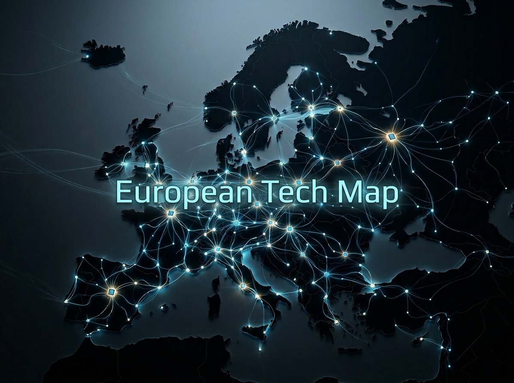
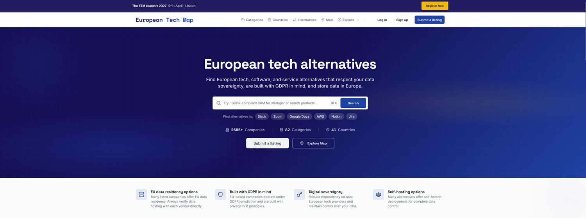

# European Tech Map : la carte pour la souveraineté numérique européenne

*Les premiers explorateurs qui pénétraient dans des territoires inconnus s'appuyaient souvent sur des cartes approximatives, parfois complètement inventées. Non pas parce que la terre sous leurs pieds était irréelle, mais parce que personne ne l'avait jamais vraiment relevée. C'est une métaphore qui colle avec une précision surprenante à l'écosystème technologique européen de 2025 : l'infrastructure est là, les entreprises existent, les produits fonctionnent. Le problème, c'est que personne ne sait où ils se trouvent.*

La part des fournisseurs américains sur le marché européen du cloud tourne autour de 70 %, tandis que les fournisseurs européens ont glissé à environ 13 % de part de marché, soit une baisse de 27 points de pourcentage par rapport à 2017. Un chiffre impressionnant, surtout si on le compare à la perception largement répandue selon laquelle "il n'existe pas d'alternatives européennes". Cette perception, répétée dans les réunions des CTO, dans les appels d'offres publics, dans les décisions des startups, est à la fois compréhensible et erronée. Compréhensible parce que celui qui ne connaît pas d'alternative ne peut pas la choisir. Erronée parce que les recherches d'alternatives européennes ont augmenté de 660 % d'une année sur l'autre, et que le site European Alternatives a enregistré une augmentation de fréquentation de 1 100 % au cours de l'année 2025. La demande est là. C'est l'offre d'information qui manque.

C'est dans cet espace que s'insère [European Tech Map](https://europeantechmap.eu/), un annuaire interactif d'entreprises technologiques européennes qui se propose comme une réponse systématique à un problème de visibilité. Pas un manifeste politique, pas un projet institutionnel financé par Bruxelles. Quelque chose de plus simple et, peut-être justement pour cela, de plus efficace : une plateforme qui comprend une carte interactive des entreprises tech par pays européen et un annuaire qui permet de chercher des alternatives directes aux produits et services américains.

## Qui a dessiné la carte

Le fondateur, Dante Emilio Grassi, est un consultant basé en Suède avec un parcours qui traverse la finance, l'intelligence artificielle et le machine learning. Le projet est une initiative indépendante, collaborative (crowd-sourced), non affiliée aux institutions européennes. Grassi a construit la plateforme en mode *bootstrapped*, terme du jargon startup qui désigne un projet ayant grandi sans financements externes, sous l'impulsion du fondateur et de la communauté qui se rassemble autour de lui.

La genèse est presque accidentelle, comme c'est souvent le cas pour les projets les plus intéressants. En analysant les données entrantes, Grassi a découvert que des catégories considérées par tous comme dominées par les Américains avaient en réalité dix alternatives européennes ou plus, avec des fondateurs d'Estonie, de Bulgarie, du Portugal qui construisaient des outils de classe mondiale. Le problème n'était pas la qualité du produit européen. C'était son invisibilité systémique. Comme l'écrit Grassi lui-même dans la présentation de la plateforme, citée par plusieurs observateurs du secteur : la souveraineté numérique commence par les choix, et les choix exigent que les alternatives soient visibles. C'est une formule élégante qui décrit un court-circuit réel.

Aujourd'hui, la plateforme compte, selon les données les plus à jour disponibles : environ 1 898 entreprises technologiques européennes, réparties dans 37 pays, organisées en 79 catégories, avec des alternatives à 856 produits américains connus. Une photographie qui se met à jour continuellement, car n'importe qui peut [signaler une entreprise](https://europeantechmap.eu/submit) ou proposer des corrections à la base de données. Le modèle communautaire ne garantit pas l'exhaustivité, mais il garantit la vitalité.

## Ce qui compte pour y entrer

Un annuaire n'est utile qu'en fonction de la fiabilité de ses critères d'inclusion. Et ici, European Tech Map fait des choix précis, qu'il vaut la peine d'examiner sans détour.

Les entreprises doivent avoir leur siège en Europe, ce qui inclut les États membres de l'UE, les pays de l'EEE comme la Norvège et l'Islande, et d'autres pays européens comme la Suisse et le Royaume-Uni. La localisation géographique ne suffit toutefois pas : une société enregistrée aux États-Unis ne peut pas être listée comme fournisseur européen, même si les fondateurs ou les employés sont européens. C'est une distinction qui a des implications légales concrètes, et pas seulement nominales. Une startup fondée par un Italien mais immatriculée au Delaware reste soumise à la juridiction américaine, avec tout ce que cela implique en termes d'obligations réglementaires et d'accès aux données.

La plateforme se concentre sur les fournisseurs B2B, excluant les applications purement grand public (consumer). Un critère central est la transparence sur le lieu de stockage et de traitement des données : les entreprises doivent documenter clairement si le service est hébergé dans l'UE ou à l'extérieur, et sur quelle infrastructure. Sur ce point, il y a une nuance importante : les services qui tournent sur des hyperscalers comme AWS, Azure ou Google Cloud ne sont pas automatiquement exclus, mais ils doivent le documenter explicitement. C'est un compromis raisonnable avec la réalité du marché — énormément de startups européennes utilisent des infrastructures américaines — mais qui ouvre une zone grise sur laquelle nous reviendrons.

Un autre critère concerne la structure de propriété : les entreprises ayant des participations majoritaires en dehors de l'Europe peuvent être incluses, mais elles doivent le déclarer. L'objectif est la transparence sur l'identité de celui qui contrôle l'entreprise et les cadres juridiques sous lesquels elle opère.

La plateforme introduit également un [*Verified Status*](https://europeantechmap.eu/about), qui ne vaut pas recommandation qualitative ni certification de conformité RGPD, mais confirme que certaines informations de base ont été vérifiées : siège social, structure de propriété, informations sur la résidence des données, documentation publique sur la confidentialité et la sécurité. La plateforme souligne explicitement que ce statut ne garantit pas la qualité du service ni la conformité réglementaire. Les entreprises devraient continuer à mener leur propre *due diligence*. Une honnêteté intellectuelle qui n'est pas évidente dans les annuaires du secteur, où la tentation du "souveraineté-washing" guette toujours.

## Là où l'Europe tient le rythme

Regarder la distribution des catégories dans la carte est un exercice instructif sur les domaines où la tech européenne est vraiment compétitive et ceux où, au contraire, l'écosystème reste rare.

Les catégories les plus peuplées sont l'IA et le machine learning, le cloud computing, la cybersécurité, les outils de productivité, les logiciels de comptabilité et de finance, les plateformes DevOps, l'infrastructure e-commerce et les solutions de communication. Il n'est pas surprenant que la cybersécurité soit parmi les rubriques les plus denses : l'Europe a une tradition consolidée dans le secteur, avec des entreprises comme Bitdefender (Roumanie), F-Secure (Finlande) et une constellation de spécialistes de la sécurité d'entreprise répartis sur tout le continent.

La surprise, peut-être, est la vitalité de la catégorie IA. Le préjugé commun veut que l'intelligence artificielle soit un domaine américain et chinois, avec l'Europe réduite au rôle d'observatrice. Les chiffres racontent une histoire différente, bien qu'avec les nuances nécessaires. Mistral AI, dont la [valorisation a atteint des milliards d'euros](https://aitalk.it/it/startup-europa-2025.html) en attirant des investisseurs comme Andreessen Horowitz et Nvidia, en est l'exemple le plus visible. Mais [Mistral Forge](https://aitalk.it/it/mistral-forge.html), le système qui permet aux organisations d'entraîner des modèles de langage sur leur propre connaissance institutionnelle, montre une direction plus intéressante pour le thème de la souveraineté : non seulement construire des modèles alternatifs, mais les construire de manière à ce que la connaissance propriétaire reste sous le contrôle de l'entreprise cliente, sur une infrastructure européenne.

Géographiquement, le paysage technologique européen est réparti sur tout le continent. Les pays comptant le plus grand nombre d'entreprises listées sont l'Allemagne, les Pays-Bas, la Suède, la France, le Royaume-Uni, la Suisse, l'Espagne, la Roumanie, la Belgique et l'Autriche. Une distribution qui dément le récit d'une tech européenne concentrée dans quelques hubs, et qui reflète la diversité, structurelle et culturelle, du continent. L'Estonie et la Bulgarie, pour citer deux exemples que Grassi mentionne explicitement, produisent des startups de classe mondiale qui apparaissent rarement dans les conversations des salons tech des capitales occidentales.

[Capture d'écran de la page d'accueil de europeantechmap.eu](https://europeantechmap.eu/)

## Le nœud invisible : IA et infrastructure

Un aspect rend European Tech Map particulièrement pertinente en 2026, et il va au-delà de la logique du simple annuaire logiciel. L'intelligence artificielle moderne n'est pas une application autonome qui tourne sur un ordinateur portable. C'est un système qui dépend de couches technologiques profondes et interdépendantes : le cloud pour l'entraînement et l'inférence, le stockage pour les jeux de données, les outils d'observabilité pour surveiller les modèles en production, les pipelines de communication et de collaboration pour les équipes qui les construisent. Choisir un stack européen pour votre entreprise ne signifie pas seulement utiliser une alternative à Slack ou à Google Analytics. Cela signifie, potentiellement, choisir le lieu de traitement des données qui alimentent vos modèles, qui contrôle l'infrastructure sur laquelle ils tournent, et de quelle juridiction ils relèvent en cas de litige ou de demande gouvernementale.

Le [Rapport Leonardo 2026 sur l'Italie à l'ère de l'IA](https://aitalk.it/it/rapporto-leonardo-2026-parte1.html) photographie avec précision le court-circuit structurel : les dépenses italiennes en logiciels et services d'intelligence artificielle ont atteint 1,2 milliard d'euros en 2024, avec une croissance de 58 % d'une année sur l'autre, tandis que la dépendance envers des fournisseurs non européens pour l'infrastructure sous-jacente reste presque inchangée. On investit dans l'IA, mais l'IA tourne sur le cloud américain. C'est comme construire une voiture au design italien sur un moteur dont on ne contrôle ni la production ni l'entretien.

La question n'est pas académique. À l'automne 2025, les pannes de grands fournisseurs d'hébergement comme Amazon Web Services et Cloudflare ont touché des millions de sites web dans le monde entier, soulignant la dépendance critique envers quelques fournisseurs d'infrastructure, presque tous basés aux États-Unis. Plusieurs États membres de l'UE, dont l'Autriche, l'Allemagne et la France, ont par la suite signé des engagements concrets dans une déclaration sur la souveraineté numérique. Il ne s'agit pas de nationalisme technologique : il s'agit de résilience. Un système qui dépend d'un seul point de défaillance, ou d'un seul système juridique étranger, est par définition fragile.

[Devstral](https://aitalk.it/it/mistral-devstral.html), le modèle de Mistral optimisé pour le codage, et plus généralement l'écosystème que l'entreprise française construit autour de la formation, de l'inférence et de la personnalisation des modèles, montrent que la compétition dans la couche IA n'est pas perdue. Mais les modèles seuls ne suffisent pas. Il faut aussi les centres de données, les réseaux, les outils d'observabilité, les pipelines de données. Et c'est là que le fossé européen est le plus prononcé et le plus difficile à combler à court terme.

## Le CLOUD Act et l'éléphant au milieu de la pièce

Pour comprendre pourquoi le choix du fournisseur n'est pas une question purement technique ou commerciale, il faut faire un pas en arrière vers le droit. Le CLOUD Act, *Clarifying Lawful Overseas Use of Data Act*, est une loi fédérale américaine de 2018 qui permet aux autorités américaines de demander l'accès aux données détenues par des entreprises américaines, quel que soit le lieu de stockage physique de ces données. Le point stratégiquement pertinent est que ces demandes font abstraction de la localisation géographique du stockage : que les données soient à Francfort, Dublin ou Amsterdam est sans importance du point de vue du CLOUD Act, si le fournisseur est une entreprise américaine.

Cela crée une tension légale concrète avec le RGPD, en particulier avec l'article 48, qui interdit le transfert de données personnelles aux autorités de pays tiers, sauf via des canaux juridiques reconnus. L'Union européenne a répondu avec le Data Act, entré en application en septembre 2025, dont le Chapitre VII exige des fournisseurs de cloud opérant dans l'UE qu'ils mettent en œuvre des mesures techniques, légales et organisationnelles pour empêcher l'accès non autorisé de gouvernements non européens aux données non personnelles stockées dans l'UE. Une réponse normative importante, même si le conflit structurel reste ouvert : les défis juridiques prennent du temps, ont des issues incertaines et ne suspendent pas les obligations de divulgation pendant la procédure.

La solution technique la plus robuste, selon plusieurs experts en sécurité, est architecturale : un chiffrement géré par le client européen, avec des clés qui ne transitent jamais par les serveurs du fournisseur américain. Mais cette solution exige des compétences et des ressources que toutes les organisations ne peuvent pas se permettre, et surtout elle exige une conscience du problème, ce qui est exactement ce qui manque quand on ne connaît même pas l'existence d'alternatives européennes.

Le paradoxe est subtil mais important : les grands hyperscalers américains ont investi dans des solutions comme l'EU Data Boundary de Microsoft, les Sovereign Controls de Google Cloud, et l'architecture Nitro d'AWS, qui créent des frontières plus robustes pour les données européennes. Ce sont des avancées réelles, mais elles ne résolvent pas la question de fond : tant que le fournisseur a sa direction aux États-Unis, la juridiction américaine s'applique à l'entreprise, pas au centre de données. La souveraineté numérique n'est pas une question de lieu où se trouvent les serveurs, mais de savoir qui contrôle l'infrastructure et devant quelle loi il répond.

C'est dans ce contexte que la carte de Grassi cesse d'être une simple liste de logiciels et devient un outil d'orientation géopolitique. Savoir quels fournisseurs de cloud sont effectivement européens, immatriculés en Europe, avec des capitaux européens, sous juridiction européenne, est le prérequis pour construire des stacks d'infrastructure qui résistent non seulement aux pannes techniques, mais aussi aux pressions juridiques extraterritoriales.

## Promesse de souveraineté, réalité du marché

Rendre compte des limites d'un projet est la façon la plus honnête d'en évaluer la valeur réelle. European Tech Map en a plusieurs, et il vaut la peine de les nommer sans détour.

La première limite est structurelle : il s'agit d'un annuaire basé sur l'auto-déclaration. Les entreprises se proposent elles-mêmes, et la vérification, bien qu'existante pour le *Verified Status*, n'atteint pas le niveau d'un audit technique ou d'une certification indépendante. Il n'y a pas de benchmarks de performance, pas de comparaisons fonctionnelles systématiques, pas de méthodologie d'évaluation de la maturité du produit. Une startup avec un produit à peine sorti de la bêta et une entreprise avec dix ans de développement enterprise peuvent se côtoyer dans la même catégorie, sans que l'annuaire ne le signale explicitement. Pour celui qui cherche un outil d'approvisionnement sérieux, cela signifie que la carte est un point de départ, pas un point d'arrivée.

La deuxième limite concerne la zone grise infrastructurelle déjà citée : les entreprises européennes qui tournent sur AWS ou Azure sont incluses, à condition de le déclarer. C'est un choix pragmatique — les exclure reviendrait à diviser la base de données par deux — mais cela introduit une ambiguïté dans le concept même d'"alternative européenne". Une application de visioconférence fondée à Berlin mais hébergée sur AWS Virginia n'offre pas la même garantie de souveraineté qu'une application équivalente hébergée sur Hetzner ou OVHcloud. La distinction compte, et la carte ne la rend pas toujours immédiatement visible pour l'utilisateur moins expert.

La troisième limite est plus systémique et concerne le fossé de compétitivité qui existe dans certaines catégories. L'investissement nécessaire pour une indépendance numérique européenne significative est estimé entre 500 et 700 milliards d'euros, et la fragmentation du marché européen, avec des champions nationaux et des solutions régionales au lieu de plateformes continentales, travaille contre les économies d'échelle qui rendent le cloud computing moderne économiquement viable. Répertorier les alternatives existantes est utile, mais cela ne change pas la réalité : dans certains domaines, grands modèles de langage de pointe, infrastructures de calcul à haute densité pour l'IA, plateformes de développement avec des écosystèmes de millions d'utilisateurs, le fossé avec les leaders américains reste prononcé.

Cela dit, le risque opposé est d'utiliser la perfection comme alibi pour ne rien faire. Le véritable obstacle à l'utilisation des alternatives européennes n'est pas le manque de qualité ou de disponibilité : il réside dans la logique de l'approvisionnement, dans le pouvoir de marché, dans les habitudes consolidées. Les entreprises et les administrations publiques recourent automatiquement aux mêmes plateformes américaines non pas parce que les alternatives n'existent pas, mais parce qu'elles n'en connaissent pas l'existence, parce que les processus d'achat sont calibrés sur les fournisseurs déjà consolidés, et parce que les coûts de migration sont perçus comme prohibitifs. Rompre ce cercle vicieux est exactement ce qu'un annuaire bien construit peut faire.

## Un test décisif, pas une solution

Il existe, en urbanisme, le concept de *wayfinding* : la science de concevoir des systèmes d'orientation qui aident les gens à naviguer dans des espaces complexes. Une bonne signalétique ne construit pas la ville, mais elle rend la ville navigable. European Tech Map fonctionne de manière analogue par rapport à l'écosystème tech du continent : elle ne crée pas les entreprises européennes qu'elle liste, ne les finance pas, ne garantit pas leur qualité. Mais elle les rend trouvables, et rendre quelque chose trouvable est le prérequis de toute autre action.

Le contexte dans lequel ce projet opère devient rapidement plus urgent. Le 18 novembre 2025, les États membres de l'UE ont adopté une Déclaration pour la Souveraineté Numérique Européenne, un engagement non contraignant centré sur l'objectif de renforcer l'autonomie numérique du continent pour soutenir la résilience économique, la prospérité sociale, la compétitivité et la sécurité. Sur le front réglementaire, le Data Act est entré en application, la Commission européenne a lancé des enquêtes de marché sur AWS et Microsoft Azure en tant que *gatekeepers* potentiels dans le cadre du Digital Markets Act, et plusieurs États — la France de manière particulièrement décidée — ont annoncé des plans pour réduire la dépendance envers Microsoft dans leurs administrations publiques.

Les [analyses sur l'état de l'écosystème IA européen](https://aitalk.it/it/rapporto-leonardo-2026-parte2.html) convergent sur un point : l'Europe ne manque pas de talent ni, de plus en plus, de technologie compétitive. Ce qui manque, c'est l'échelle, la visibilité et la capacité de construire des marchés internes profonds qui permettent aux entreprises européennes de croître sans devoir émigrer dans la Silicon Valley pour trouver des clients enterprise disposés à parier sur elles. L'annuaire de Grassi ne résout pas le problème de l'échelle — pour cela il faut des capitaux, des politiques industrielles et des marchés de capitaux plus profonds, comme [analysé en regardant les startups européennes en 2025](https://aitalk.it/it/startup-europa-2025.html). Mais il contribue à la visibilité, et la visibilité est la première étape.

Avec environ 2 400 entreprises cartographiées, structurées en plus de 80 catégories et réparties sur 40 marchés, la plateforme a rapidement évolué vers un outil utile pour les décideurs qui cherchent des solutions logicielles développées en Europe. L'étape suivante, annoncée avec l'European Tech Map Summit prévu pour 2027, est de transformer l'annuaire d'une couche de découverte en une infrastructure de business : non seulement trouver les alternatives européennes, mais créer les conditions de rencontres directes entre vendeurs et acheteurs, entre startups et CTO d'entreprises enterprise disposés à changer de stack.

Les questions les plus difficiles restent ouvertes. La souveraineté numérique est-elle un objectif réaliste pour un continent fragmenté en vingt-sept marchés nationaux avec des réglementations, des langues et des cultures d'approvisionnement différentes ? Ou est-elle destinée à rester une aspiration politique qui se heurte à la gravité économique des hyperscalers américains, dont les investissements en recherche et développement dépassent le PIB de nombreux États européens réunis ? Et surtout : combien une entreprise européenne est-elle prête à payer, en termes de fonctionnalités, d'intégration et de coûts de migration, pour choisir un stack qui garde ses données sous juridiction européenne ?

Il n'existe pas de réponses simples. Mais la première condition pour répondre à ces questions de manière informée est de savoir ce qui existe. European Tech Map, avec toutes ses limites, fait exactement cela : elle met les options sur la table. Le reste — les choix, les investissements, les politiques — dépend d'acteurs bien plus grands qu'un annuaire géré par un consultant suédois avec une bonne idée et la ténacity pour la construire de zéro. Ce qui, en retour, dit quelque chose d'assez éloquent sur l'état de la souveraineté numérique européenne : nous en sommes au point où la carte est encore faite par un individu, pas par un système.

---

*Données mises à jour en mai 2026. Les statistiques sur le marché du cloud européen sont des estimations de marché sujettes à révision. Les critères d'inclusion d'European Tech Map sont sujets à mise à jour par l'équipe de la plateforme.*
