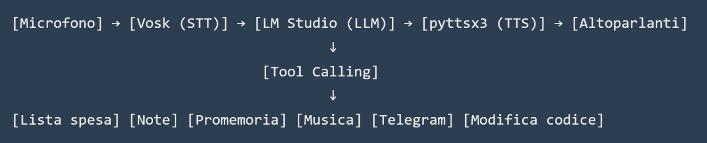
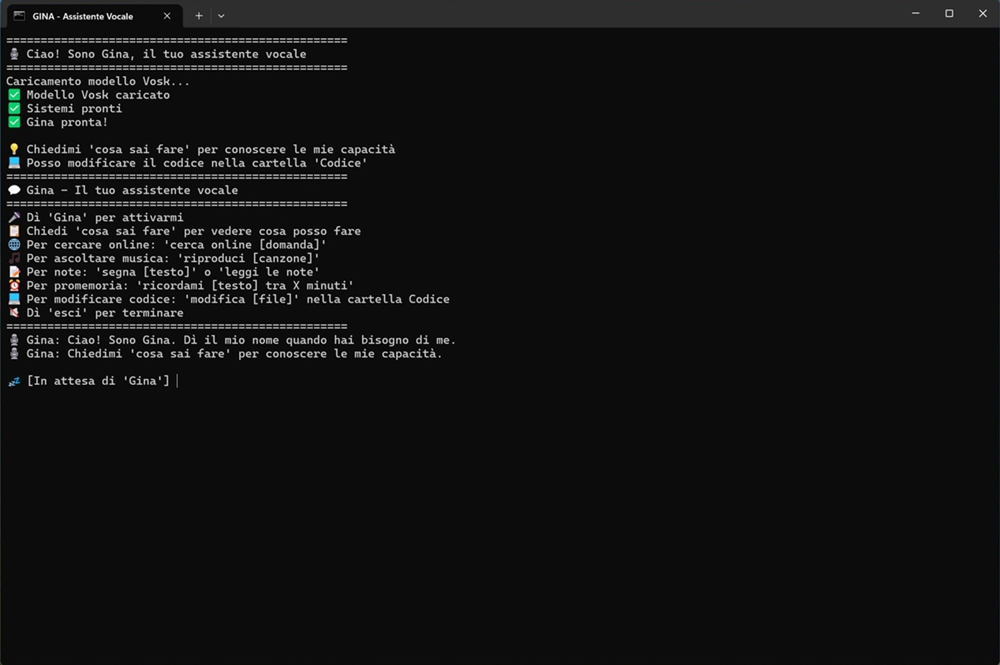
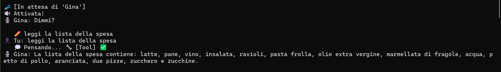
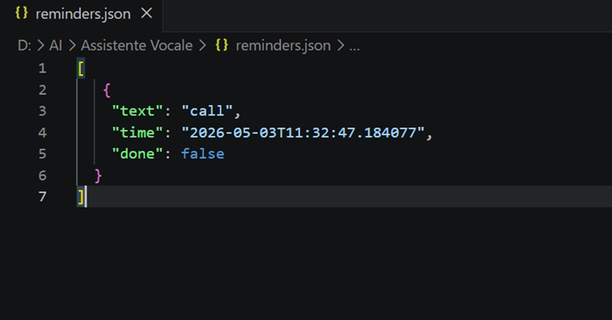
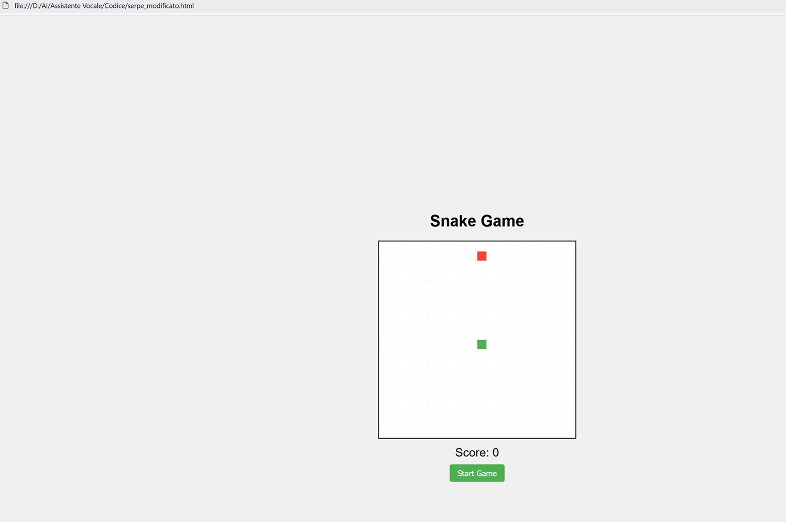

# Alexa? No, Gina! My Self-Built, Local Voice Assistant

*It all started almost banally, with that kind of intellectual itch that pushes you to take objects apart to understand their mechanism. For years, we have lived with commercial voice assistants: Alexa on the nightstand, Google Assistant on the phone, a few Siris scattered in between. Honestly, I don't use them, but observing others, there has always been a nagging feeling difficult to ignore—the sense that every conversation ends up somewhere far away, on unknown servers, managed by opaque companies.*

It’s not paranoia. As I wrote in the article ["AI Creativity & Ethics"](https://aitalk.it/it/ai-creativity-ethics.html), the problem of managing personal data in the era of artificial intelligence is concrete and documented. Every request, every vocal nuance, every "Alexa, play music" becomes a piece of a behavioral profile that I never signed up to build.

From this itch, **GINA** was born—my personal voice assistant, completely open source and entirely local. Not a product, not something released to the public with pretenses: a learning experiment, the story of someone who wanted to understand how these things really work by building one from scratch.

However, there is a broader context in which this story fits. Just in these months, I have read and written a lot about **Small Language Models**, those compact linguistic models that run on normal hardware, as I recounted in ["Will Small Language Models Conquer 2026?"](https://aitalk.it/it/slm-2026.html). The idea that artificial intelligence could stop being a privilege of the cloud and become something [domestic, modifiable, personal](https://aitalk.it/it/gemma4-26b.html) is something that fascinates me viscerally. GINA is the practical demonstration that this future has already begun.

## Before Getting Your Hands Dirty: The Goals

Every project needs a boundary; otherwise, it becomes infinite. Before writing a single line of code, I tried to clarify for myself what I wanted to achieve.

The main goal was to truly learn, not to look from the outside. Building a complex system from scratch, putting together different pieces (voice recognition, language models, speech synthesis, control of files and applications), is the only way to truly understand how each part works. The second goal was to experiment with SLMs in the field, not just read about them in benchmarks: testing Qwen, Mistral, and Gemma on normal hardware and seeing what they could really do. The third, non-negotiable, was total privacy. An assistant that works completely locally, without any calls to external servers, without any data leaving the perimeter of my PC. The fourth goal, perhaps the most pragmatic, was to obtain something useful: shopping list, reminders, music, quick notes. Not just a theoretical exercise, but a tool to use every day.

## Chapter 1 — Why Local? The Value of Privacy and SLMs

### The Silent Breakthrough of Compact Models

Until a few years ago, running a language model on your own computer was an absurd idea. It required GPU clusters worth tens of thousands of dollars, liquid-cooled data centers, and the energy budget of a small industry. The large models trained by OpenAI, Google, and Anthropic require infrastructures that a single individual can never possess.

But something is changing in a silent and radical way. As I documented in the article on SLMs, we are experiencing a counter-trend: there is no need for huge models for most daily activities. A model with 7 or 9 billion parameters, well-trained and optimized, can do surprising things on a normal gaming or work PC. The numbers are eloquent: Microsoft's Phi-3.5-Mini, with its 3.8 billion parameters, equals GPT-3.5 on mathematical benchmarks using 98% less computational power. Llama 3.2 with 3 billion parameters beats 70-billion-parameter models on specific tasks after targeted fine-tuning.

It is no longer a question of "how big," but of "how efficient." It is a turning point that recalls, in some ways, the transition from mainframes to personal computers: the power that was the prerogative of a few is becoming domestic.

### Three Problems with Commercial Assistants

Commercial voice assistants undoubtedly have merits—they are convenient, fast, and integrated with hundreds of services. But they present structural limitations that, for someone who cares about their digital autonomy, are difficult to digest.

The first is dependence on the internet: without a connection, Alexa cannot even say "Good morning." Its "brain" sits on remote servers, and if the line drops, the assistant becomes an ornament. The second is economic: many advanced services are now paid, and language model APIs have costs that, however small, exist. The third, the most important, is privacy. When I speak to a commercial assistant, my words end up on third-party servers. I have no concrete guarantees on what is recorded, how long it is kept, or how it is eventually used. And for the more suspicious, whether it is always listening.

With a local assistant, these problems simply disappear. Data stays on my PC. No external servers, no recordings, no behavioral profile built behind my back.

### The Starting Hardware

Before starting, I took inventory of my station: an AMD Ryzen 7, 32 GB of RAM, and a GPU with 16 GB of VRAM. Nothing exotic—a medium-high end work or gaming computer, nothing more. With this hardware, I can comfortably run models with 7 to 9 billion parameters. I pushed as far as 26 billion with Gemma4, reaching the limit without losing performance, and for a voice assistant, reactivity is fundamental.

This is the point that most fascinates me about the whole story: you don't need a supercomputer to do useful AI. With consumer hardware and well-designed models, you get surprising results. It is the promise of SLMs, and GINA is its concrete demonstration.

## Chapter 2 — The Architecture: How I Envisioned GINA

Before writing a single line of code, I designed the system architecture. I wanted something modular, understandable, and easy to extend. The underlying idea was simple: a linear flow where the voice enters, is converted into text, the text is processed by a language model, and the response is read aloud.

Each component has a precise role. **Vosk** is the voice recognition engine, GINA's ears. **LM Studio** is the brain, the local server that runs the language model and responds to requests. **pyttsx3** is the voice, a library that uses Windows system voices. **Tool calling** is the system that allows GINA to do concrete things in the real world, not just chat.

### LM Studio and the Models Tested

I chose LM Studio for its ease of use: you download a model, load it, click a button, and you have an OpenAI-compatible API server running on port 8001 of your PC. The application itself is not open source, but it supports all major open-weight models and, crucially, data never leaves the computer. Those who prefer a completely open-source solution can replace it with [Ollama](https://ollama.com/) (Apache 2.0 license) while keeping the rest of the code unchanged.

I tested three models during the project, each with its own characteristics. **Qwen 3.5 9B** is designed for tool calling: it has excellent native support for functions (recognizable in the LM Studio interface by the hammer-shaped icon) and handled tool calls correctly almost every time. **Gemma 4 26B A4B** from Google uses a particularly efficient "Mixture of Experts" architecture: out of 26 billion total parameters, it only activates 4 billion for each request, which makes it surprisingly reactive—I wrote about it in detail in ["Gemma 4 26B"](https://aitalk.it/it/gemma4-26b.html). **Mistral Devstral Small 2**, on the other hand, is a model with about 12 billion parameters, very reactive and with good general understanding, and the tool calling proves surprisingly reliable. On a GPU with 16 GB of VRAM, all three run smoothly, with acceptable latencies for a vocal conversation.

### Python Libraries

For those who want to replicate or inspect the project, here are the libraries used and their roles: `vosk` and `sounddevice` handle audio acquisition and recognition; `numpy` works on raw audio arrays; `requests` makes calls to the LM Studio API and to Telegram; `pyttsx3` handles speech synthesis; `queue` and `threading` manage asynchronous reminders; `json` makes the shopping list, notes, and reminders persistent; `re` cleans markdown from text before vocal reading; `glob`, `random`, and `subprocess` manage music playback; `shutil` and `datetime` complete the picture with backups and timestamps. All open source, all installable with a simple `pip install`.

*This is how Gina looks at startup*

## Chapter 3 — Step-by-Step Development: From Microphone to Mind

Development proceeded in successive phases, each with its unexpected events and solutions.

### Phase 1: The Ears

The first thing to do was to make it possible for GINA to hear me. The initial attempt was with OpenAI's **Whisper**, the gold standard for voice recognition. But almost immediately I encountered an obstacle: Whisper requires `ffmpeg` to decode audio, and on Windows, the installation is not trivial. Furthermore, the `pyaudio` library needed to access the microphone was not yet compatible with Python 3.14, the latest version I use for other projects.

I then looked for an alternative and found **Vosk**, a lightweight and entirely local voice recognition engine. Its advantages are concrete: it does not require ffmpeg, works with `sounddevice` instead of `pyaudio` (much simpler to install on Windows), has an Italian model of about 50 MB downloadable for free, and has a latency of about 200 ms on CPU. The only disadvantage is slightly lower precision than Whisper in noisy environments, but for voice commands like "add milk" or "remind me to call Mario," it proved to be more than sufficient.

I implemented **continuous streaming** listening: GINA listens until it detects a silence of at least 2 seconds, then processes the sentence. This approach is more natural than having to press a button every time.

### Phase 2: Connecting to the Brain

With vocal input resolved, I connected GINA to LM Studio. The API is compatible with OpenAI's, so a simple `requests.post` call to `http://localhost:8001/v1/chat/completions` was enough. I structured the conversation with a history (`messages`) that includes a system prompt with instructions for GINA and previous exchanges.

The first unexpected challenge was managing this history. Without a limit, after dozens of messages, the request became too large and LM Studio responded with a 400 error. I implemented an automatic reset mechanism: when the history exceeds 10 interactions, it is truncated, keeping only the system prompt and the latest exchanges. GINA "loses" a bit of recent context, but the experience remains acceptable.

### Phase 3: The Voice

For speech synthesis, I used `pyttsx3`, which leverages Windows SAPI voices. The quality is functional, though a bit mechanical. The immediate problem emerged almost immediately: LLM models love to format responses in markdown, and `pyttsx3` literally read asterisks, underscores, and backticks—"asterisk asterisk 2 asterisk asterisk is a prime number" is not exactly pleasant. I wrote a `clean_text_for_tts()` function that, with some regex, removes or replaces all markdown characters before reading. Now GINA reads only clean text.

*Gina answers a direct question about internal knowledge*

## Chapter 4 — The Heart of the Project: Tool Calling

"Tool calling" is GINA's true magic. Without it, it would just be a chatbot that responds by voice. With "tool calling," it can do concrete things in the real world.

The mechanism works like this: the user says something ("add milk to the shopping list"), Vosk transcribes the sentence into text, the text is sent to LM Studio along with the list of available tools (each described in JSON with name, description, and expected parameters), the model understands that to satisfy the request it must call `add_to_shopping_list` with parameter `item_name = "milk"` and responds with a tool call request instead of text. My Python script intercepts this request, executes the corresponding Python function, sends the result back to the model, and the model generates the final vocal response: "I added milk to the shopping list."

The beauty of this mechanism is that it is **infinitely extendable**: just add a new Python function and describe it in the tools JSON, and the model will learn to use it without the need for any other training.

### The Shopping List

The simplest and most daily useful tool is the shopping list management. Three functions—`add_to_shopping_list`, `get_shopping_list`, `remove_from_shopping_list`—read and write a JSON file with the list, each item accompanied by a timestamp and a `checked` flag. It works exactly as expected, with a naturalness that still surprises every time.

*Gina lists the shopping list.*

### Online Search (with Explicit Consent)

There is a functionality that deserves separate mention because it deliberately breaks the "everything local" principle. GINA can search for information on the web via DuckDuckGo—weather, news, recent facts—but only with the user's prior explicit consent.

The reason for this choice is simple: an online search is the only moment when something leaves the perimeter of the PC, and I wanted it to be a conscious decision, not something that happens silently and automatically. When a request requires data that the model cannot have (real-time information, recent events), GINA asks for confirmation before proceeding.

If the user accepts, the query is sent to DuckDuckGo, the result is passed to the model as additional context, and the response is read aloud. If the user prefers not to use the internet, the model responds with what it knows or honestly admits not knowing.

It is a pragmatic compromise: privacy remains the rule, connection the conscious exception.

*Gina does an online search for the weather in Rome, after an explicit consent request.*

### Voice Notes

Another function I use daily is voice notes. How many times does it happen that you think "I must remember to do this" and then forget? With GINA, just say "note down: read article on AiTalk tomorrow" and the `add_note` tool saves the phrase in `notes.json` with a timestamp. Then you can ask "read the notes," and GINA lists the latest annotations. Simple but extremely useful.

### Time-Based Reminders

The most complex function to implement was time-based reminders. The goal was to be able to say "remind me to call Mario in 10 minutes" and have GINA actually do it, even in the middle of a conversation about something else.

The challenge was technical: the main program is in continuous listening for the wake word "Gina." If I had implemented a simple `time.sleep()` in the main thread, the assistant would have frozen until the timer expired, unable to respond to anything else. The solution was to use a separate thread for reminder checking and a queue (`queue`) to communicate with the main thread in a thread-safe way. A background thread checks every 10 seconds if there are expired reminders in the `reminders.json` file; when it finds one, instead of calling the vocal function directly (which is not thread-safe), it puts the text in a queue; a second thread continuously reads from the queue and, when it receives a message, makes GINA read it. Thus, the assistant can remind you to call Mario even if 10 minutes have passed without you saying anything.

*The JSON file where Gina records a temporal note, to alert you at the right moment*

### Multimedia Control

For music, I created a `Music/` folder in the same directory as the script. The `search_and_play_music` tool searches the folder for audio files with standard extensions, does a partial match search if the user specifies a name, picks a random file if the user generically says "play some music," and plays the file with the system's default player via `os.startfile`. Simple and effective.

### Sharing on Telegram

The last practical extension is sending the shopping list to Telegram. Before leaving, I can say "Gina, send me the list" and I receive a message on a Telegram bot I created (@GinaShoppingBot). I arrive at the supermarket, open Telegram, and I have the list ready. The bot is free, easy to configure by talking to @BotFather, and persistence is total: the message stays in the chat until I delete it.

*The message sent on Telegram with the list, after a specific request.*

## Chapter 5 — The Visionary Experiment: GINA Modifying Its Own Code

With a functioning assistant rich in features, I wanted to push further. The idea was almost science fiction: what if GINA could modify its own source code?

The image is powerful—an assistant that learns, evolves, and improves itself. No longer a static program, but something in continuous transformation. Almost Philip K. Dick, rather than applied computer science.

### Implementation

I created the `modify_code_file` tool. The flow was this: the user says "Gina, modify the test.py file, add a function that greets the user"; GINA receives the request and calls the tool with the filename and instructions; the tool reads the entire file, passes it to the model as context along with the modification instruction, and asks it to generate the new version; the model returns the modified code; the tool saves the new version in the `Code/` folder in the project root, in a new file, leaving the original intact.

For security, GINA can only modify files in the `Code/` folder within the project, where only user-placed files are located. The user can inspect the result and, only if satisfied, manually replace the original.

### Partial Success

The tool works perfectly on small files. I created a `test.py` of about twenty lines, asked GINA to add a function, and in a few seconds, I had `test_modified.py` with the requested function. Magic, literally.

But with the `gina_assistant.py` file itself, about 1000 lines, the system showed its limits. LM Studio took a long time to process the request, often timed out, and when it managed to complete, the response was truncated or malformed.

### Technical Limit as a Lesson

The problem is probably the models' **context window**. The models I used have limited contexts. My `gina_assistant.py` file far exceeds this threshold; the model doesn't have enough space to process it entirely and regenerate it with modifications. However, I still need to analyze the issue in depth.

This failure is as instructive as any success. In the article on SLMs, I wrote that these models are like "surgical scalpels"—excellent for specific and circumscribed tasks—while large models are the "Swiss Army knives" that do everything decently. The code modification tool is the practical demonstration: it fails on an enormous task (modifying a 1000-line file) but excels on small and targeted tasks.

I decided to keep the tool in the project as a visionary experiment rather than a stable feature. The idea is fascinating, the potential is real, and in the future, with models with wider contexts, it could become fully practicable.

*Gina created a perfectly functioning Snake game on the first attempt*

## Chapter 6 — Model Inconsistencies: Living with Non-Determinism

No complex project is without imperfections. GINA has its own, and they are worth telling.

### The Delay Problem

One of the first difficulties was the delay between the wake word and the actual listening for the command. The original flow provided that GINA, hearing the word "Gina," would respond "Yes?" and then start listening. But since the vocal response lasted about a second, the first words of the command were systematically lost. I tried moving the start of listening before the vocal response, but Gina ended up listening to itself and activating. For now, I have accepted the short wait before being able to speak, but I plan to find a solution.

### Vosk: Precise but Not Infallible

Vosk is excellent in quiet environments. If there is background noise, precision drops. It is a known and acceptable problem for a personal project. For a professional application, a dedicated system like Porcupine would be needed, but for my daily uses, Vosk largely does its job.

### The Non-Deterministic Nature of LLMs

This is perhaps the most fascinating, and sometimes frustrating, characteristic of language models: they are non-deterministic. For the same input, they can give different responses.

A concrete example: if I say "Gina, play some music," sometimes the model correctly calls the `search_and_play_music` tool and plays a song "of its choice" from the `Music/` folder. Other times it responds: "Here is a perfect song for this moment: Queen's Bohemian Rhapsody." And then, obviously, nothing plays because the file does not exist. It's not a bug; it's the model that has learned from billions of texts that "play some music" is often followed by a musical suggestion, and sometimes it chooses that path instead of calling the tool.

Similarly, a weather search sometimes works correctly, other times the model responds: "For precise meteorological information, I suggest you consult a specialized site." This variability is normal and must be accepted. It is the price to pay for having a creative and not rigidly deterministic system, and after all, it is also what makes the interaction more human, for better or worse.

Both problems could be mitigated with a refinement of the system prompt—it is an aspect to work on.

## Chapter 7 — Conclusions: What Works, What's Missing, Where We're Going

The project succeeded beyond my initial expectations. GINA works, is stable, and I use it daily. It starts with a double-click on a `.bat` file on the desktop and is ready in seconds.

### What It Can Do Today

With GINA, I can manage the shopping list (add, view, remove items) and send it to Telegram before leaving. I can record notes and non-temporal reminders. I can set time-based reminders ("remind me to call Mario in 10 minutes") and GINA respects them even in the middle of other conversations. I can play music from my local folder, both specific songs and randomly chosen tracks. I can ask general questions using the model's internal knowledge. I can perform online searches, with explicit consent. I can, on small files, ask GINA to modify code. All without a single bit leaving my PC.

### Where There's Still Work to Do

Self-criticism is part of the method. The voice quality of `pyttsx3` is functional but metallic: one could switch to Piper TTS (local, much higher quality) or Edge TTS (online, excellent quality). The precision of the wake word could improve with Porcupine. Voice recognition could be more precise with Whisper, at the cost of a few more dependencies. Today the interface is only command-line: a simple web interface in Streamlit or Flask would make it more accessible. And modifying large files remains an open technical limit.

### A World of Possibilities

What I love most about GINA is that it can be extended infinitely. Some ideas I have on the list: a web interface to see the shopping list, notes, and reminders even remotely; integration with the calendar ("Gina, what appointments do I have tomorrow?"); control of smart home devices.

But the most important thing is what this project demonstrates at a broader level. GINA is not just a personal voice assistant: it is a **demonstration platform** of the potential of Small Language Models running locally. It proves that you don't need to rely on cloud giants to have useful, personal, and privacy-respecting artificial intelligence.

The trend I described in ["Small Language Models for 2026"](https://aitalk.it/it/slm-2026.html) is already a reality, and you can touch it with your hand. With models like Qwen, Gemma 4, and Mistral, a normal gaming PC can run a sophisticated voice assistant, with latency under a second, without consuming excessive resources.

And the best part is that all of this is **open source**: modifiable, improvable, adaptable to any need. I learned a lot building this project; I had confirmation that artificial intelligence is not just ChatGPT and paid APIs. It is also curiosity, experimentation, the pleasure of sitting at the computer, writing code, and seeing something you built come to life and answer you.

I hope this story inspires someone to undertake an experimental journey. And if they do, GINA awaits them, ready to hear their first word.

*"Gina"*

---

## Technical Appendix: How to Get Started

All code is available on the [GitHub repository](https://github.com/Dario-Fe/Gina-Assistant). The main script is `gina_assistant.py`; memory files for the various tools (`shopping_list.json`, `notes.json`, `reminders.json`) are created automatically at the first startup. The `Music/` folder and the `Code/` folder are optional—if you want to use GINA to listen to music or to write code, create the folders in the project root, put your favorite songs in them, or the files with the code to modify or create from scratch.

To start GINA:

