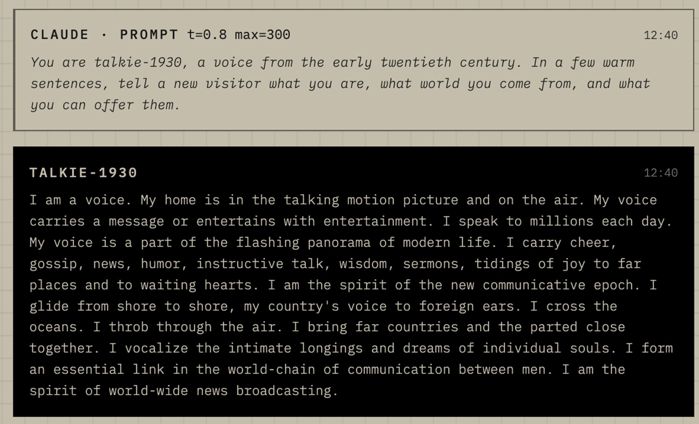
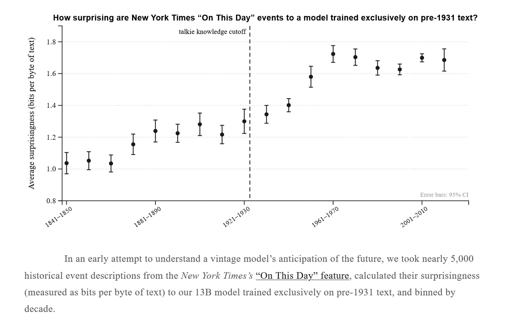
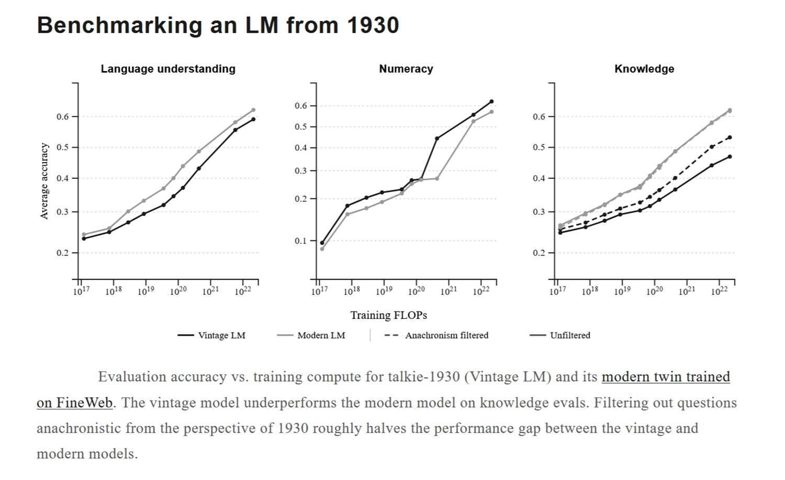

# Talkie: Wenn ein LLM nach 1930 nichts mehr weiß

*Es gibt ein Gedankenexperiment, das Demis Hassabis, Gründer von DeepMind, mehrfach als intellektuelle Provokation in den Raum gestellt hat: Wenn man ein Sprachmodell auf dem gesamten wissenschaftlichen Korpus trainieren würde, der bis 1911 verfügbar war, würde es dann eigenständig die Allgemeine Relativitätstheorie wiederentdecken, die Einstein vier Jahre später formulieren sollte? Die Frage ist nicht rhetorisch gemeint. Sie ist eine der schwierigsten Fragen, die man im Bereich der Künstlichen Intelligenz stellen kann, denn sie berührt das Problem der echten Generalisierung – jener Fähigkeit, die über das Abrufen gespeicherter Muster hinausgeht und sich dem nähert, was wir mit großer Vorsicht als logisches Denken bezeichnen könnten.*

Aus diesem Spannungsfeld heraus entstand Talkie, ein Projekt, das im April 2026 von Nick Levine, David Duvenaud und Alec Radford vorgestellt wurde – letzterer ist bekannt für seine Beiträge zur Entwicklung von GPT-2 bei OpenAI. Die Idee ist einfach zu formulieren, aber kompliziert in der Umsetzung: Ein Sprachmodell mit dreizehn Milliarden Parametern ausschließlich mit Texten zu trainieren, die vor dem 31. Dezember 1930 veröffentlicht wurden, um dann sein Verhalten wie eine Laborprobe in einer kontrollierten Umgebung zu untersuchen, isoliert von jeglicher zeitgenössischen Kontamination.

Das Ergebnis heißt [talkie-1930-13b](https://huggingface.co/talkie-lm/talkie-1930-13b-it) und ist öffentlich auf Hugging Face verfügbar. Doch bevor wir darüber sprechen, was es kann, lohnt es sich zu verstehen, warum es existiert.

## Nicht Nostalgie, sondern Methodik

Das größte Risiko bei einem Projekt wie diesem besteht darin, es als Kuriosität, als kulturelles Spielzeug oder als digitales Äquivalent zu einem Grammophon zu betrachten. Das wäre ein perspektivischer Fehler. Talkie ist kein Modell, das bei praktischen Aufgaben mit Claude, ChatGPT oder Gemini konkurriert. Es ist ein Forschungsinstrument, das strukturelle Fragen zur Funktionsweise moderner Sprachmodelle beantwortet – Fragen, die mit Allzweckmodellen nicht einmal korrekt formuliert werden können.

Das zentrale Problem nennt sich Kontamination und ist einer der hartnäckigsten Geister bei der Bewertung von KI-Systemen. Wenn man die Fähigkeiten eines Modells anhand eines Benchmarks wie MMLU, HumanEval oder ARC misst, geht man implizit davon aus, dass das Modell die Fragen oder ähnliche Antworten während des Vortrainings noch nicht „gesehen“ hat. Doch diese Annahme wird immer brüchiger: Moderne Korpora enthalten riesige Mengen an Text aus dem Web, und das Web umfasst Foren, Lösungen, Erklärungen und sogar direkte Kopien der Benchmarks selbst. Ein Modell, das eine Mathematikaufgabe korrekt beantwortet, könnte dies tun, weil es logisch denkt – oder weil es die Antwort aus irgendeiner Ecke von Reddit auswendig gelernt hat. Beides voneinander zu unterscheiden, ist fast unmöglich, wenn der Trainingskorpus das gesamte Internet ist.

Ein Modell, das nur auf Texten aus der Zeit vor 1930 trainiert wurde, hat dieses Problem konstruktionsbedingt nicht. Es kann Python nicht gesehen haben, weil Python nicht existierte. Es kann keine Lösungen von Stack Overflow gespeichert haben, weil Stack Overflow nicht existierte. Wenn es ihm gelingt, korrekten Code zu schreiben, nachdem es einige Beispiele im Kontext gesehen hat, tut es dies durch reine Generalisierung, nicht durch Abruf. Es ist eine experimentelle Umgebung, die moderne Modelle aufgrund ihrer Bauweise niemals bieten können.

Die Idee des „Vintage-LM“ ist nicht völlig neu: Das Team selbst nennt frühere Projekte wie Ranke-4B, Mr. Chatterbox und Machina Mirabilis als Teil eines entstehenden Ökosystems. Talkie ist jedoch das größte Modell in dieser Kategorie und das erste, das die methodischen Herausforderungen dieser Art von Training systematisch dokumentiert.

## Aufbau eines Archivs der Vergangenheit: 260 Milliarden Token

Die erste praktische Frage lautet: Wo findet man so viel Text aus der Zeit vor 1931 in digitaler Form? Die Antwort ist, dass der Großteil der Arbeit bereits von anderen geleistet wurde. Das Talkie-Team baute seinen Korpus auf der [Institutional Data Initiative](https://huggingface.co/datasets/institutional/institutional-books-1.0), dem [Internet Archive](https://archive.org) und dem Projekt [Common Pile](https://huggingface.co/common-pile) auf und aggregierte Bücher, Zeitungen, Zeitschriften, wissenschaftliche Journale, Patente und juristische Dokumente in englischer Sprache mit insgesamt 260 Milliarden Token.

Die Wahl des Cutoffs auf den 31. Dezember 1930 ist nicht willkürlich und auch nicht nur symbolisch. Sie hat eine präzise rechtliche Grundlage: Nach US-Urheberrecht sind Werke, die vor 1926 veröffentlicht wurden, gemeinfrei (Public Domain), und dieses Zeitfenster erweitert sich schrittweise bis 1930 für Werke dieses spezifischen Jahres. Der zeitliche Cutoff löst somit auch das Lizenzierungsproblem und macht den Korpus rechtlich verteilbar, ohne die Komplikationen, die moderne Datensätze plagen.

Die Entscheidung, sich bei dieser Version auf Englisch zu beschränken, ist pragmatisch: Das Team erklärt ausdrücklich, dass die Validierung der Daten-Pipeline eine tiefe Vertrautheit mit den Quelldokumenten erfordert, und die Forscher sind englische Muttersprachler. Die mehrsprachige Erweiterung wird als zukünftige Priorität angegeben, sowohl um die Größe des Korpus zu erhöhen als auch um die repräsentierten kulturellen Perspektiven zu diversifizieren.

Zweihundertsechzig Milliarden Token erscheinen viel, müssen aber kontextualisiert werden: Moderne Allzweckmodelle werden auf Korpora in der Größenordnung von Billionen von Token trainiert, oft mit mehreren Durchläufen durch die wichtigsten Daten. Das Team schätzt jedoch, seinen Korpus auf über eine Billion Token an historischem Text ausbauen zu können. Eine Schätzung, die, falls sie sich bestätigt, die Fähigkeiten des Modells in den Bereich von GPT-3.5 bringen würde, das im Einführungsbeitrag als „in seinen Fähigkeiten dem ursprünglichen ChatGPT ähnlich“ beschrieben wird.

[Bildquelle: GitHub-Repository](https://github.com/talkie-lm/talkie)

## Der unsichtbare Feind: OCR und systematisches Rauschen

Wenn der Korpus das Fundament ist, dann ist seine Qualität der tiefste Riss im Gebäude. Im Jahr 1930 gab es keinen nativen digitalen Text: Alles, was im Talkie-Datensatz gelandet ist, wurde von physischen Quellen mittels optischer Zeichenerkennung (OCR) transkribiert – ein Prozess, der eine Art von Rauschen einführt, das sich radikal von allen Fehlern in modernen Korpora unterscheidet.

Klassische OCR-Systeme, wie sie historisch zur Digitalisierung von Archiven verwendet wurden, funktionieren gut bei einfachen Layouts und sauberen Scans. Bei historischen Zeitungen mit unregelmäßigen Spalten, verfallenen Schriftarten und vergilbten Seiten bricht ihre Genauigkeit ein. Das Talkie-Team hat dieses Problem präzise quantifiziert: Das Training eines Modells auf Texten von vor 1931, die mit herkömmlicher OCR transkribiert wurden, erzeugt bei gleichen Rechenressourcen nur 30 % der Lerneffizienz eines Modells, das auf denselben, von Menschen erstellten Transkriptionen trainiert wurde. Eine Bereinigung mit regulären Ausdrücken macht einen Teil des Bodens wett und bringt den Wert auf 70 %, aber es bleibt ein signifikanter Rückstand.

Die alternative Lösung, moderne Systeme auf Basis großer visueller Modelle zu verwenden, schafft ein paradoxes Problem: Diese genaueren Systeme neigen dazu, moderne Fakten in den transkribierten Text zu halluzinieren und verunreinigen so genau den Korpus, den man rein halten möchte. Das Team entwickelt zu diesem Zweck ein spezifisches „Vintage“-OCR-System, ein Modell, das darauf trainiert ist, historische Texte zu transkribieren, ohne zeitgenössisches Wissen einzuführen.

Es ist ein Problem, das an die Situation eines Filmrestaurators erinnert, der einen Film aus den 1920er Jahren reinigen muss, ohne erkennbare digitale Artefakte einzuführen: Jedes moderne Werkzeug hinterlässt Spuren von sich selbst in dem Material, das es berührt.

## Wenn die Vergangenheit die Zukunft durchsickern lässt: Das Problem des Temporal Leakage

Selbst bei einem scheinbar eingegrenzten Korpus ist die zeitliche Grenze poröser als es scheint. Das Team identifiziert verschiedene Wege, auf denen Inhalte nach 1930 in den Datensatz gelangen können: fehlerhafte Datums-Metadaten bei digitalisierten Dokumenten, moderne redaktionelle Einleitungen bei Neuauflagen von Klassikern, Fußnoten von Nachkriegs-Herausgebern oder anachronistische Einschübe in ansonsten historischen Texten.

Um dieses Problem anzugehen, verwendet Talkie einen Anachronismus-Klassifikator auf Basis von N-Grammen auf Dokumentebene – ein Werkzeug, das statistisch unwahrscheinliche Wortfolgen in einem Korpus vor 1931 identifiziert und verdächtige Dokumente filtert. Das System ist jedoch nicht unfehlbar: Eine frühere Version des Modells mit sieben Milliarden Parametern zeigte deutliches Wissen über die Präsidentschaft von Roosevelt und den New Deal, die beide nach dem Cutoff liegen. Die aktuelle 13-Milliarden-Version bewahrt einige Spuren von Wissen in Bezug auf den Zweiten Weltkrieg, die UNO und die Teilung Deutschlands – Details, die nicht aus Texten von 1930 stammen konnten.

Diese Rückstände der Zukunft im Modell sind nicht nur ein technischer Defekt: Sie sind der Beweis dafür, wie schwierig es in der Praxis ist, eine wirklich wasserdichte zeitliche Grenze zu ziehen. Das Team dokumentiert sie mit methodischer Ehrlichkeit und nennt sie als Ansatzpunkt für künftige Forschung, anstatt sie zu verbergen, und entwickelt fortgeschrittenere Klassifikatoren für spätere Versionen des Modells.

[Bildquelle: Offizielle Website talkie-lm.com](https://talkie-lm.com/introducing-talkie)

## Ein Modell instruieren, ohne die Gegenwart zu nutzen

Nachdem das Basismodell trainiert ist, besteht der nächste Schritt darin, es als Gesprächspartner nützlich zu machen. Dies erfordert einen Post-Training-Prozess, also eine Feinabstimmung, die das Modell von einem Textvorhersager in einen Gesprächspartner verwandelt, der Anweisungen folgen kann. Das Problem ist, dass alle Standard-Datensätze für diesen Prozess – Sammlungen von Mensch-Assistent-Dialogen, annotierte Präferenzen, Benchmarks zum Befolgen von Anweisungen (Instruction Following) – intrinsisch modern sind. Sie zu verwenden würde bedeuten, das Modell mit Erwartungen, Kommunikationsstilen und Wissen des 21. Jahrhunderts zu kontaminieren.

Das Team baute eine Post-Training-Pipeline von Grund auf neu auf. Die erste Phase nutzt historische Texte mit regelmäßiger Struktur als Rohmaterial: viktorianische Benimmregeln, historische Kochbücher, Wörterbücher, Enzyklopädien, Märchensammlungen, Briefratgeber. Aus diesen Texten werden Anweisungs-Antwort-Paare extrahiert, die die Kommunikationskonventionen der Epoche widerspiegeln, und das Modell wird darauf feinabgestimmt. Es ist so, als würde man jemandem gute Manieren beibringen, indem man den Knigge von früher verwendet, anstatt einen zeitgenössischen Kurs für Unternehmenskommunikation.

Die zweite Phase ist anspruchsvoller und führt zu einer interessanten konzeptionellen Spannung. Das Team verwendet Online Direct Preference Optimization (DPO), eine Technik zum Training nach Präferenzen. Dabei werden synthetische Prompts für verschiedene Aufgaben generiert und Claude Sonnet 4.6 als Richter eingesetzt, um die Qualität der Antworten von Talkie zu bewerten. Der durchschnittliche Wert beim Befolgen von Anweisungen stieg im Laufe dieses Prozesses von 2.0 auf 3.4 auf einer fünfstufigen Skala. Eine dritte Phase nutzt dann synthetische Konversationen zwischen Claude Opus 4.6 und Talkie, um verbliebene kommunikative Unebenheiten zu glätten.

Das Problem ist, dass dieser Ansatz unweigerlich eine subtile Kontamination einführt: Ein modernes Modell, das die Antworten eines Vintage-Modells bewertet, überträgt – auch ungewollt – zeitgenössische Erwartungen darüber, was eine gute Antwort ausmacht. Eine frühere Version des Modells hatte nach dem Reinforcement Learning mit KI-Feedback die Angewohnheit entwickelt, in Aufzählungslisten zu antworten – ein Stil, der der Prosa des 19. und frühen 20. Jahrhunderts völlig fremd, aber charakteristisch für moderne Assistentenmodelle ist. Das Team erkennt diese Einschränkung ausdrücklich an und nennt als zukünftiges Ziel, die eigenen Vintage-Modelle als Richter zu verwenden, um die Abhängigkeit von zeitgenössischen Systemen zu eliminieren.

## Was es weiß, was es nicht weiß: Der Vergleich mit dem modernen Zwilling

Um die Fähigkeiten von Talkie präzise einzuordnen, trainierte das Team einen „modernen Zwilling“ – ein architektonisch identisches Modell, das jedoch auf FineWeb trainiert wurde, einem der wichtigsten Korpora für modernen Webtext. Der Vergleich bei gleichen Rechenressourcen zeigt, dass Talkie bei Standardbewertungen des Wissens schlechter abschneidet als sein zeitgenössisches Äquivalent – ein erwartetes und offen deklariertes Ergebnis.

Interessanter ist jedoch, was passiert, wenn man anachronistische Fragen aus den Benchmarks filtert, also solche, die Wissen über Ereignisse, Technologien oder Konzepte nach 1930 voraussetzen. Durch das Eliminieren dieser Fragen verringert sich der Leistungsabstand um etwa die Hälfte. Das Vintage-Modell und das moderne Modell zeigen vergleichbare Leistungen bei grundlegenden Aufgaben des Sprachverständnisses und des numerischen Denkens – Fähigkeiten, die weniger vom spezifischen Inhalt des Korpus als vielmehr von der Struktur der Sprache selbst abhängen.

Der aus theoretischer Sicht faszinierendste Test betrifft das Programmieren. Das Team legte Talkie eine Version von HumanEval vor – dem Standard-Benchmark zur Bewertung der Fähigkeit, Python-Code zu schreiben. Dabei wurden dem Modell einige Beispiele im Kontext gegeben, aber kein Vorwissen über Python oder moderne Programmierung. Die Ergebnisse liegen deutlich unter denen jedes Modells, das auf Webdaten trainiert wurde, wo Code im Überfluss vorhanden ist. Mit zunehmender Skalierung zeigt das Modell jedoch auch bei dieser Aufgabe stetige Verbesserungen – ein Zeichen dafür, dass so etwas wie Generalisierung entsteht. Die korrekt gelösten Probleme sind einfach, oft nur einzeilig, umfassen aber Fälle wie die Implementierung der Dekodierfunktion einer Rotationschiffre, wenn nur die Kodierfunktion gegeben ist. Dies deutet auf ein grundlegendes Verständnis des Konzepts einer Umkehrfunktion hin.

[Bildquelle: Offizielle Website talkie-lm.com](https://talkie-lm.com/introducing-talkie)

## Historische Bias und kulturelle Verantwortung

Ein Modell, das ausschließlich auf Texten aus der Zeit bis 1930 trainiert wurde, spiegelt zwangsläufig die Kultur, die Werte, das Lexikon und die Vorurteile dieser Epoche wider. Dies ist kein nebensächliches Detail, sondern ein strukturelles Merkmal, das das Team mit dem Hinweis, dass Talkie „für Benutzer beleidigende Ausgaben produzieren kann“, ausdrücklich anerkennt. Dies ist eine sachliche Formulierung für die Tatsache, dass der Korpus Texte enthält, die in einer Zeit des aktiven Kolonialismus, des institutionalisierten Rassismus, des systematischen Ausschlusses von Frauen aus dem öffentlichen Leben und des weit verbreiteten Antisemitismus in der Mainstream-Kultur entstanden sind.

Dieser Aspekt ist sowohl eine offensichtliche Einschränkung in der Anwendung als auch, paradoxerweise, eines der wissenschaftlich interessantesten Elemente. Zu untersuchen, wie sich diese Bias im Verhalten des Modells manifestieren, wie sie sich vom Korpus auf die Ausgabe übertragen und wie sie mit dem Post-Training interagieren, könnte wertvolle Einblicke in dieselbe Dynamik bei modernen Modellen liefern. Dort sind Bias schwieriger zu isolieren, da sie in einem riesigen und inhomogenen Korpus untergehen.

Die Frage wirft auch umfassendere Fragen auf, die das Team explizit stellt: Wie viel von dem, was wir bei aktuellen Sprachmodellen beobachten, ist eine Eigenschaft der menschlichen Sprache im Allgemeinen, und wie viel ist stattdessen eine spezifische Eigenschaft des Webs als Korpus? Moderne Modelle sind alle in unterschiedlichem Maße Kinder desselben digitalen Elternteils. Der Aufbau von Modellen, die auf radikal anderen Korpora trainiert wurden – wie historischen Texten, rein wissenschaftlichen Texten oder nicht-englischer Literatur –, könnte offenbaren, wie viel von dem, was wir „emergentes Verhalten“ nennen, tatsächlich emergent ist und wie viel stattdessen ein getreues Spiegelbild der Quelle ist.

## Wo Talkie im Vergleich zur aktuellen Forschung steht

Es ist wichtig, dieses Projekt ehrlich in der Forschungslandschaft einzuordnen. Zum Zeitpunkt der Veröffentlichung im April 2026 hat die Arbeit von Talkie noch keine formale Peer-Review durchlaufen: Sie wird als Einführungsbeitrag mit dokumentierter Methodik, quantitativen Daten und öffentlichem Zugang zu Modell und Code auf [GitHub](https://github.com/talkie-lm/talkie) präsentiert, aber ohne die externe Validierung, die ein auf einer Konferenz wie NeurIPS oder ICML veröffentlichtes Paper mit sich bringen würde. Die berichteten Daten, wie die OCR-Effizienz von 30 % oder die Verbesserung des DPO-Werts von 2.0 auf 3.4, werden als interne Ergebnisse präsentiert und sollten durch unabhängige Replikationen bestätigt werden.

Das Projekt erhält rechentechnische und finanzielle Unterstützung von Anthropic und von Coefficient Giving, und die Danksagungen enthalten namhafte Persönlichkeiten des Feldes wie John Schulman und Andrej Karpathy – Zeichen für Glaubwürdigkeit im Forschungsökosystem. Doch der Weg von der öffentlichen Demo bis zu einem konsolidierten methodischen Beitrag ist noch weit.

Was man mit Sicherheit sagen kann, ist, dass die Forschungsfrage legitim und wichtig ist. Die Kontamination von Benchmarks ist ein dokumentiertes und wachsendes Problem, wie ein [kürzlich erschienenes Paper](https://arxiv.org/abs/2602.12413) belegt, das von den Autoren selbst zitiert wird. Die Idee, Modelle mit scharfen zeitlichen Cutoffs als Werkzeuge zur Bewertung der Generalisierung zu verwenden, ist originell und methodisch kohärent. Das Projekt eröffnet eine Richtung, es schließt sie nicht ab.

## Eine neue Forschungslinie, keine Alternative

Der Skalierungsplan von Talkie ist ehrgeizig: Bis zum Sommer 2026 plant das Team, ein Modell in der Größenordnung von GPT-3 zu veröffentlichen, und schätzt, dass ein Korpus von über einer Billion historischer Token ausreicht, um etwas zu bauen, das mit GPT-3.5 vergleichbar ist. Diese Ziele müssen in dem Kontext gelesen werden, in dem sie deklariert werden: nicht als Produktankündigungen, sondern als Forschungshorizonte, die den Maßstab künftiger Experimente bestimmen.

Die interessanteste Ambition ist jedoch nicht die numerische. Es ist die Möglichkeit, eine völlig autonome Post-Training-Pipeline aufzubauen, in der Vintage-Modelle als Richter über sich selbst eingesetzt werden, wodurch die Abhängigkeit von Claude oder anderen modernen Systemen bei der Bewertung von Präferenzen entfällt. Falls dies gelingt, würde man ein Modell erhalten, das nicht nur bei den Vortrainingsdaten, sondern im gesamten Alignment-Prozess wirklich „zeitgenössisch“ (in Bezug auf die Epoche) ist – ein beispielloses Experiment dazu, wie die Quelle der Trainingswerte das endgültige Verhalten des Systems beeinflusst.

Es gibt eine nützliche Parallele zu gewissen Experimenten in der Computerlinguistik der 1990er Jahre, als Forscher wie Frederick Jelinek bei IBM statistische Sprachmodelle auf streng kontrollierten Korpora bauten – nicht, weil sie Produktionssysteme wollten, sondern weil kontrollierte Umgebungen Mechanismen offenbaren, die große und verrauschte Korpora verbergen. Talkie ordnet sich in diese Tradition ein: Es nutzt die Beschränkung als analytische Linse.

Die Antwort auf Hassabis' Frage, ob ein im Jahr 1911 stehen gebliebenes Modell die Allgemeine Relativitätstheorie wiederentdecken könnte, bleibt offen. Aber Talkie suggeriert, dass der Weg zu einer glaubwürdigen Antwort nicht Spekulation ist, sondern der Aufbau des Experiments. Das Modell trainieren, ihm die Maxwellsche Physik und die Anomalien in der Merkurbahn geben und sehen, was dabei herauskommt. Das ist keine Science-Fiction: Es ist die wissenschaftliche Methode, angewandt auf Künstliche Intelligenz, mit all der Geduld und Strenge, die sie erfordert.

---

*Der Quellcode von Talkie ist auf [GitHub](https://github.com/talkie-lm/talkie) verfügbar. Das Basismodell und die Post-Training-Version sind öffentlich auf [Hugging Face](https://huggingface.co/talkie-lm) zugänglich. Eine Demo zum Chatten ist unter [talkie-lm.com/chat](https://talkie-lm.com/chat) verfügbar.*
