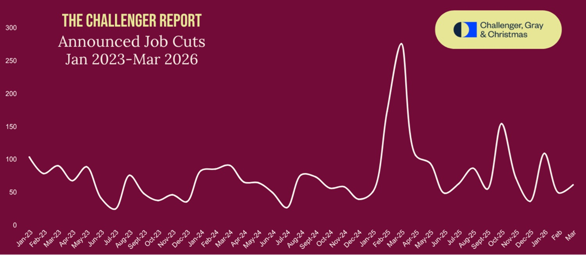
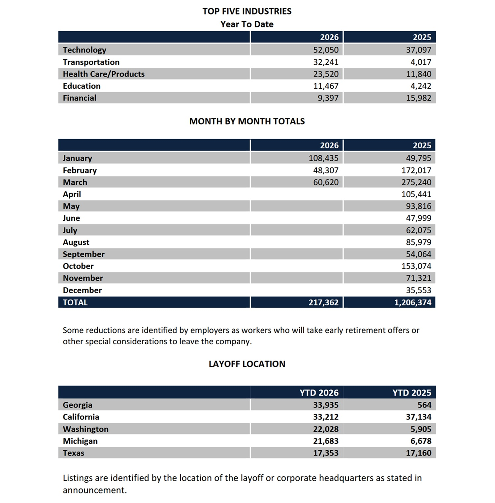
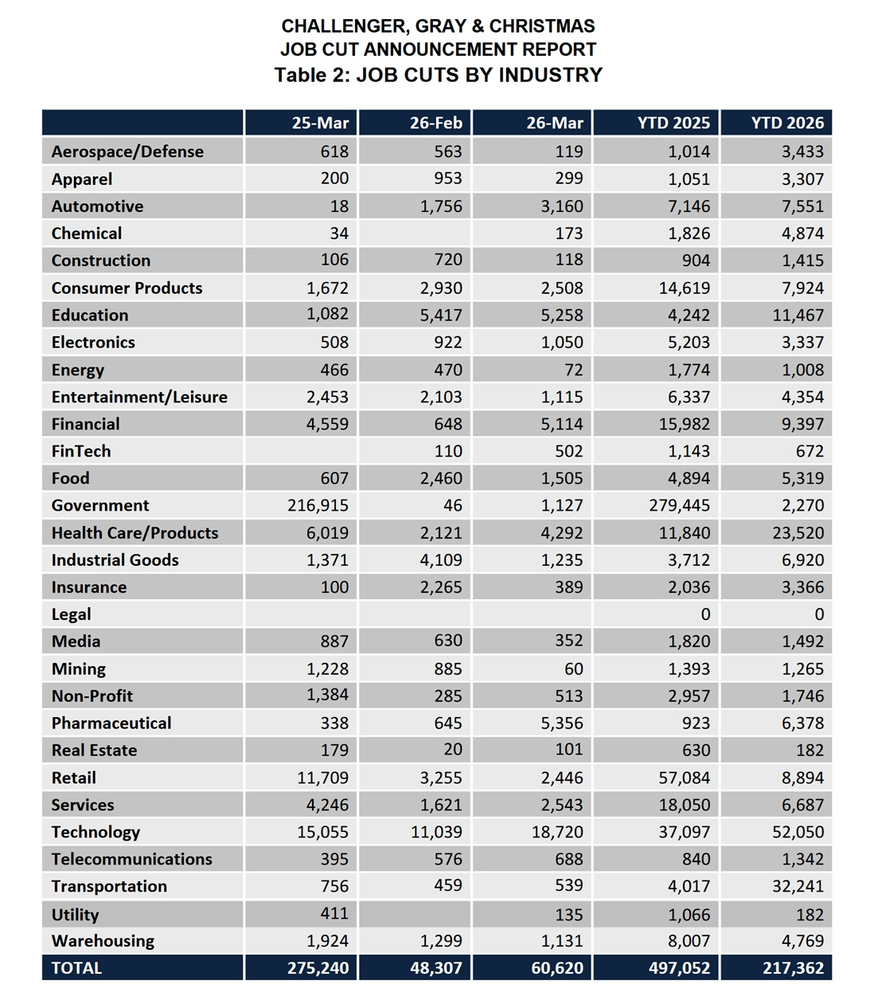

# Entlassungen: KI und die Rechnung, die nicht aufgeht

Am 2. April 2026 um 7:30 Uhr morgens Chicagoer Zeit begannen, wie an jedem ersten Donnerstag im Monat, die Telefone der Personalverantwortlichen auf der halben Welt zu vibrieren. Der [Bericht von Challenger, Gray & Christmas](https://www.challengergray.com/wp-content/uploads/2026/04/Challenger-Report-March-2026-1.pdf) war pünktlich erschienen: 60.620 angekündigte Entlassungen in den Vereinigten Staaten allein im März – ein Anstieg von 25 % gegenüber den 48.307 im Februar. Die meistgenannte Ursache für den Monat? Künstliche Intelligenz, verantwortlich für 15.341 Stellenstreichungen, was 25 % der monatlichen Gesamtzahl entspricht.

Die Zahl an sich erzählt nicht die ganze Geschichte. Wer diese Berichte seit Jahren verfolgt, weiß: Challenger misst die *Ankündigungen* von Entlassungen, nicht die tatsächlich durchgeführten Kündigungen. Es ist ein Thermometer der managementseitigen Absichten, nicht des realen Marktes. Aber genau deshalb ist es wertvoll: Es antizipiert, statt nur zu registrieren. Und das, was es seit einigen Jahren antizipiert, hat einen wiederkehrenden Namen in den Pressemitteilungen der Unternehmen.

Die Daten für das erste Quartal 2026 zeigen insgesamt 217.362 angekündigte Kürzungen – der niedrigste Gesamtwert für ein erstes Quartal seit 2022. Das klingt fast wie eine gute Nachricht, bis man sich daran erinnert, woher wir kommen.

## Ein anhaltender Zyklus, kein isolierter Schlag

Das Jahr 2025 endete laut den endgültigen Daten von Challenger, Gray & Christmas mit 1.206.374 Entlassungsankündigungen in den Vereinigten Staaten. Um ein schlechteres Jahr zu finden, muss man bis ins Jahr 2020 zurückgehen – das Jahr von Covid, Lockdowns und massenhaften Zwangsschließungen. Der Vergleich ist aufschlussreich: War die Ursache im Jahr 2020 brutal extern und sichtbar, so ist sie im Jahr 2025 undurchsichtiger, verteilter und erzählerisch komplexer.

Der Bericht vom Januar 2026 hatte bereits die Alarmglocken schrillen lassen: [108.435 angekündigte Kürzungen in einem einzigen Monat](https://www.challengergray.com/wp-content/uploads/2026/02/CR126007123.pdf) – der höchste Monatswert seit Oktober 2025 und der höchste Januar-Wert seit 2009, als die Welt noch versuchte zu verstehen, was ihr mit der Finanzkrise zugestoßen war. In diesem Zusammenhang merkte Andy Challenger, Leiter der Außenbeziehungen des Unternehmens, an, dass derart umfangreiche Streichungspläne zu Beginn des Jahres bedeuten, dass die Entscheidungen bereits Ende 2025 getroffen wurden, was auf einen gewissen Mangel an Optimismus für 2026 hindeutet.

Das Muster, das bei der Betrachtung der Sektoren deutlich wird, erzählt von einer umfassenderen Neuordnung, als das Wort „Krise“ allein ausdrücken kann. Im Jahr 2025 waren die drei am stärksten betroffenen Sektoren die Bundesregierung, der Einzelhandel und die Technologiebranche. Im ersten Quartal 2026 wird das Podium bereits von der Technologiebranche (52.050 Kürzungen), dem Transportwesen (32.241) und dem Gesundheitswesen (23.520) besetzt. Jedes Jahr eine neue Zusammensetzung, aber die grundlegende Richtung ändert sich nicht.

[Bildquelle: challengergray.com](https://www.challengergray.com/wp-content/uploads/2026/04/Challenger-Report-March-2026-1.pdf)

## Der amerikanische Markt hält sich (vorerst)

Es gibt jedoch ein Paradoxon, das man präzise benennen sollte, da man sonst Gefahr läuft, das Thermometer mit der Krankheit zu verwechseln. Das [amerikanische Bureau of Labor Statistics](https://www.bls.gov/news.release/empsit.nr0.htm) veröffentlichte am 3. April 2026 die Beschäftigungsdaten für März: Die Arbeitslosenquote lag stabil bei 4,3 % mit 7,2 Millionen Arbeitslosen, und es wurden 178.000 neue Stellen im Nicht-Agrar-Sektor geschaffen. Das Gesundheitswesen legte um 76.000 Stellen zu, das Baugewerbe um 26.000, Transport und Logistik um 21.000.

Wie lässt sich dieser Wert mit den 60.000 im selben Monat angekündigten Entlassungen vereinbaren? Die Antwort lautet, dass wir zwei verschiedene Zeitskalen und zwei verschiedene Messgrößen betrachten. Challenger misst die öffentlich kommunizierten Streichungspläne der Unternehmen, die oft über Monate oder Jahre verteilt sind. Das BLS hingegen fotografiert die reale Beschäftigung zum Zeitpunkt der Erhebung, einschließlich der Neueinstellungen. Ein Unternehmen kann am Montag 10.000 Entlassungen ankündigen und in den folgenden drei Monaten 12.000 Menschen einstellen: Beides ist wahr, und beides muss betrachtet werden.

Das bedeutet nicht, dass alles in Ordnung ist. Die Zahl der Langzeitarbeitslosen – also jener, die seit mindestens 27 Wochen ohne Arbeit sind – ist im letzten Jahr um 322.000 gestiegen. Und der Bundesdienst hat nach seinem Höchststand im Oktober 2024 insgesamt 355.000 Stellen verloren, was 11,8 % entspricht. Der amerikanische Markt hält sich, aber mit Problemen in Teilbereichen, welche die aggregierten Quoten nicht zeigen können.

## Tech im Rampenlicht, aber es ist nicht nur Tech

Der Technologiesektor ist der sichtbarste Protagonist dieser Kündigungswelle. Allein im ersten Quartal 2026 kündigte er 52.050 Entlassungen an – 40 % mehr als im Vorjahreszeitraum und der höchste Quartalswert seit 2023, als die Branche nach den Einstellungsüberschüssen der Pandemiejahre eine ihrer schwersten Bereinigungen durchmachte. Dell, Oracle, Meta mit der Reality Labs Division: verschiedene Namen, gemeinsame Logik – Ressourcen in Richtung Künstliche Intelligenz umschichten und sie anderen Funktionen entziehen.

Der Tracker [layoffs.fyi](https://layoffs.fyi), der Streichungen in globalen Technologieunternehmen sammelt und geografisch zuordnet, bietet eine Echtzeit-Kartografie dieses Prozesses. Das Tool wurde 2022 ins Leben gerufen, als der Sektor seine erste große Korrektur nach der Pandemie begann, und ist zu einer der meistzitierten Referenzen für Beobachter der digitalen Wirtschaft geworden. Die Granularität seiner Daten, die fast täglich aktualisiert werden, hilft dabei, den Einzelfall von strukturellen Trends zu unterscheiden.

Es wäre jedoch ein Fehler, dieses Phänomen als ausschließlich technologiezentriert zu betrachten. Der Challenger-Bericht für das erste Quartal 2026 zeigt, dass das Transportwesen einen Anstieg von 703 % gegenüber dem gleichen Zeitraum des Jahres 2025 verzeichnete, mit 32.241 Kürzungen, getrieben von Fluggesellschaften und Speditionen, die durch geopolitische Volatilität unter Druck standen. Das Gesundheitswesen erreichte einen historischen Rekordwert für ein erstes Quartal: 23.520 Kürzungen, womit der bisherige Höchststand von 2023 übertroffen wurde. Der Finanzsektor trug 9.397 Kürzungen bei, das verarbeitende Gewerbe kam mit Wellen im Zusammenhang mit der Automobilindustrie hinzu, und selbst der Pharmasektor kündigte bereits im ersten Quartal 6.378 Kürzungen an. Das Bild ist das einer Wirtschaft, die sich an mehreren Fronten gleichzeitig reorganisiert, und nicht das eines einzelnen Sektors in Schwierigkeiten.

[Bildquelle: challengergray.com](https://www.challengergray.com/wp-content/uploads/2026/04/Challenger-Report-March-2026-1.pdf)

## KI als Ursache oder als Ausrede?

Die unbequemste Frage in dieser Phase ist, ob die Künstliche Intelligenz wirklich die Entlassungen verursacht oder ob sie zum bevorzugten Narrativ wird, um Umstrukturierungen zu rechtfertigen, die traditionellere Wurzeln haben: überschüssiges Personal aus der Boomphase, höhere Zinsen, Korrektur der Bewertungsmultiplikatoren, Verlangsamung der Nachfrage.

Die Daten von Challenger mahnen zur Vorsicht. Im März war KI mit 15.341 von 60.620 Ankündigungen die am häufigsten genannte Ursache für die monatlichen Kürzungen (25 %). Auf das Jahr gerechnet ist KI in den ersten drei Monaten des Jahres 2026 jedoch nur der fünfthäufigste Grund nach Volumen: 27.645 von 217.362 Kürzungen, also etwa 13 %. Der Hauptgrund bleiben die allgemeinen Markt- und Wirtschaftsbedingungen (45.103 Kürzungen), gefolgt von Umstrukturierungen (37.916) und Standortschließungen (37.405).

Seit Challenger im Jahr 2023 mit der Erfassung dieser Daten begann, wurde KI in insgesamt 99.470 Entlassungsankündigungen genannt – das sind 3,5 % aller im Berichtszeitraum kommunizierten Pläne. Diese Zahl wächst – im Februar 2026 lag sie noch bei 3 % –, rechtfertigt aber nicht das katastrophale Narrativ, das die Berichterstattung zu diesem Thema oft begleitet. Wie Andy Challenger bei der Kommentierung des Berichts vom Januar zusammenfasste: Es ist schwer zu verstehen, wie viel Einfluss die KI wirklich auf spezifische Entlassungen hat, da Führungskräfte darüber sprechen und die Märkte diejenigen zu belohnen scheinen, die sie erwähnen, aber viele unter diesem Deckmantel angekündigte Kürzungen haben profanere Ursachen.

Das bedeutet nicht, dass die Auswirkungen gleich null sind. Es bedeutet, dass sie mit größerer Ehrlichkeit gemessen werden müssen, als es die oft für Analysten geschriebenen Pressemitteilungen der Unternehmen tun.

## Die Rechnung, die nicht aufgeht: Wenn KI teurer wird

Hier kommt der interessanteste Kurzschluss der gesamten Geschichte: Während Unternehmen KI als Rechtfertigung für den Abbau von Arbeitsplätzen nutzen, deutet eine wachsende Zahl von Forschungsergebnissen darauf hin, dass der direkte Ersatz menschlicher Arbeitskräfte durch KI-Systeme weit weniger rentabel sein kann, als das vorherrschende Narrativ vermuten lässt.

Eine Studie des MIT CSAIL zeigte, dass bei Aufgaben, die auf Computer Vision basieren, nur etwa 23 % der Löhne für „exponierte“ Tätigkeiten bei den derzeitigen Kosten der Modelle wirtschaftlich vorteilhaft zu automatisieren waren. Dabei geht es nicht nur um die Qualität der Ergebnisse, sondern um die Kostenstruktur. Bei Sprachmodellen wird jedes Input-Token und jedes Output-Token abgerechnet. Ein KI-Agent, der eine komplexe Aufgabe erledigen, Dokumente lesen, Hypothesen generieren, Tools aufrufen, Fehler korrigieren und Schritte wiederholen muss, ist keine Software mit Fixkosten: Er verursacht kontinuierlich variable Kosten, die mit der Komplexität und Mehrdeutigkeit der Aufgaben steigen.

Der Benchmark „TheAgentCompany“, der zur Bewertung von KI-Agenten bei realistischen Tätigkeiten in einer Unternehmenssimulation entwickelt wurde, ergab, dass das beste getestete Modell nur 30,3 % der Aufgaben autonom bewältigen konnte (39,3 % unter Einbeziehung von Teilergebnissen). Anders ausgedrückt: In mehr als der Hälfte der Fälle scheitert der Agent, und es muss trotzdem jemand eingreifen, um das Ergebnis zu kontrollieren, zu korrigieren und die Verantwortung dafür zu übernehmen. Das ist kein Ersatz: Es ist eine neue Kategorie von Arbeit, die hinzukommt – die des Automatisierungs-Supervisors.

Der kontraintuitivste Wert stammt aus einer randomisierten Studie von METR mit erfahrenen Entwicklern, die an ihnen vertrauten Open-Source-Repositories arbeiteten: Diejenigen, die Zugang zu KI-Tools hatten, benötigten 19 % *mehr* Zeit als diejenigen, die ohne sie arbeiteten, obwohl sie erwarteten, Zeit zu sparen. Die bei der Codegenerierung gewonnene Zeit wurde durch die Zeit, die für die Kontrolle, Überprüfung und Korrektur der Ergebnisse aufgewendet werden musste, mehr als wettgemacht. Es ist dasselbe Paradoxon, das jeder kennt, der diese Werkzeuge intensiv im professionellen Kontext nutzt: KI beschleunigt den einfachen Teil und verlangsamt den schwierigen Teil, der oft der entscheidende ist.

Gartner schätzte, dass über 40 % der agentischen KI-Projekte bis Ende 2027 aufgrund steigender Kosten und unklaren Geschäftswerts eingestellt werden. Das Problem besteht, wie die Analyse zusammenfasste, nicht darin, sich abstrakt zu fragen, ob die KI weniger kostet als ein Mitarbeiter, sondern die realen Kosten für die Erledigung einer Tätigkeit in akzeptabler Qualität zu berechnen – einschließlich Token, Supervision, Fehlern, Schulung, Systemintegration und Wartung der Prompts. Diese Berechnung relativiert den theoretischen wirtschaftlichen Vorteil erheblich, wenn sie ehrlich durchgeführt wird.

[Bildquelle: challengergray.com](https://www.challengergray.com/wp-content/uploads/2026/04/Challenger-Report-March-2026-1.pdf)

## Fokus Italien: Die ISTAT-Momentaufnahme

Italien betrachtet dieses Szenario aus einer Position, die es verdient, eigenständig gelesen zu werden, ohne das amerikanische Narrativ automatisch zu übertragen. Die [Pressemitteilung des ISTAT zum Arbeitsmarkt des vierten Quartals 2025](https://www.istat.it/comunicato-stampa/il-mercato-del-lavoro-iv-trimestre-2025/) bietet ein Bild, das dem Katastrophismus entgegenwirkt.

Ende 2025 gab es in Italien 24 Millionen 121 Tausend Erwerbstätige, was einem Anstieg von 37.000 Personen allein im vierten Quartal gegenüber dem dritten entspricht. Auf das Jahr gerechnet betrug das Wachstum der Erwerbstätigen 185.000 Personen (+0,8 %). Die Arbeitslosenquote lag bei 5,5 %, ein Rückgang um 0,5 Punkte gegenüber dem Vorjahr; der Jahreswert liegt bei 6,1 %, ebenfalls rückläufig. Die Zahl der Arbeitslosen sank im Laufe des Jahres um 138.000 Personen, fast 8,9 % weniger. Die dynamischste Komponente waren die unbefristet Beschäftigten, deren Zahl im Jahresvergleich um 1 % stieg, sowie die Selbstständigen mit einem Plus von 3 %.

Das Bild ist nicht ohne Schattenseiten: Die befristet Beschäftigten gingen im Laufe des Jahres um 8,6 % zurück, was auf eine weiterhin belastende Segmentierung des Marktes hindeutet, und die Zahl der Nichterwerbspersonen zwischen 15 und 64 Jahren stieg wieder leicht an. In der Gesamtbilanz steht jedoch ein Markt, der die in den Vereinigten Staaten verzeichneten Erschütterungen nicht erfahren hat.

Das bedeutet nicht, dass die KI die italienische Arbeitswelt nicht berührt. Es bedeutet, dass der Zeitrahmen und die Art und Weise der Übertragung des Phänomens anders sind. Dies hängt mit einer Produktionsstruktur zusammen, deren Geflecht aus kleinen und mittleren Unternehmen weniger anfällig für die Massenentlassungsankündigungen ist, welche die amerikanischen Schlagzeilen dominieren, sowie mit einem rechtlichen Rahmen, der Massenentlassungen zu einem langwierigen und regulierten Prozess macht – mit Gewerkschaftsbeteiligung, Präventivverfahren und präzisen Fristen.

## Die unsichtbaren Ströme: Einstellungen, Umwandlungen, Beendigungen

Erwerbstätigen- und Arbeitslosenquoten sind Momentaufnahmen. Um die wirkliche Gesundheit eines Arbeitsmarktes zu verstehen, muss man die Ströme betrachten: Wie viele Menschen treten ein, wie viele scheiden aus, mit welcher Vertragsart und in welchem Sektor. Die „Comunicazioni Obbligatorie“ des Arbeitsministeriums – die Daten, welche Unternehmen bei jeder Änderung des Arbeitsverhältnisses übermitteln müssen – sind die detaillierteste in Italien verfügbare Quelle für diese Art der Analyse.

Aus den verfügbaren Quartalsberichten geht ein Markt hervor, der sich in ständiger Umwälzung befindet, wobei Beendigungen nicht notwendigerweise mit Entlassungen im technisch-rechtlichen Sinne zusammenfallen. In Italien ist die Unterscheidung zwischen Einzelentlassung, Mehrfachentlassung und Massenentlassung nicht nur formaler Natur: Sie bestimmt Verfahren, Schutzmaßnahmen, Unternehmenskosten und Fristen. Eine Massenentlassung – eine, die fünf oder mehr Arbeitnehmer innerhalb von einhundertzwanzig Tagen betrifft – erfordert ein Verfahren mit den Gewerkschaftsorganisationen und in vielen Fällen eine Prüfung durch die regionalen Arbeitsbehörden. Dies erklärt, warum private amerikanische Tracker, die für einen Markt konzipiert sind, in dem Unternehmen an einem Vormittag 10.000 Entlassungen ankündigen können, keine geeigneten Instrumente sind, um den italienischen Arbeitsmarkt zu verstehen.

Die praktische Folge ist, dass sich die Auswirkungen der KI auf die italienische Beschäftigung wahrscheinlich gradueller manifestieren werden, weniger sichtbar in den Schlagzeilen und zeitlich stärker verteilt: nicht so sehr in großen Wellen angekündigter Entlassungen, sondern eher in der Nichtbesetzung frei werdender Stellen, in der Transformation gesuchter Profile und im Anwachsen der geforderten Kompetenzen für Rollen, die einst ohne spezifische technische Ausbildung zugänglich waren.

## Zwei Geschwindigkeiten, viele offene Fragen

Es gibt eine Szene im Finale der zweiten Staffel von *Severance*, der Apple-Serie, welche die Metapher der Trennung von Arbeit und Leben in eine dystopische Architektur verwandelt hat, in der die Charaktere entdecken, dass die Trennung, unter der sie zu leiden glaubten, zum Teil auch etwas war, das sie selbst gewählt hatten. Der Vergleich ist nützlich: Die Neuordnung des Arbeitsmarktes, die wir gerade erleben, ist nicht nur etwas, das uns passiert. Sie ist auch das Ergebnis kollektiver Entscheidungen darüber, wie investiert wird, welche Technologien eingeführt und welche Risiken akzeptiert werden.

Die betrachteten Daten erzählen zwei parallele Geschichten, die man nicht verwechseln sollte. Die amerikanische ist die Geschichte eines Marktes in beschleunigter Transformation, mit Wellen von Kürzungen, die im Jahr 2025 1,2 Millionen Ankündigungen überschritten haben – getrieben von einer Mischung aus echten Umstrukturierungen, zu korrigierenden Exzessen der Vergangenheit und einem wachsenden, aber immer noch minderheitlichen Anteil an echtem technologischem Ersatz. Die italienische ist die Geschichte eines langsameren, stärker regulierten Marktes mit 185.000 neuen Erwerbstätigen im Jahr 2025 und einer sinkenden Arbeitslosenquote, der die Wellen der Transformation mit eigenem Zeitmaß und in eigenen Formen absorbieren wird.

Die Fragen, die offen bleiben, sind jedoch auf beiden Seiten des Atlantiks dieselben. Schafft KI wirklich mehr Arbeitsplätze, als sie vernichtet, wie ihre Evangelisten behaupten? Erweisen sich die Schätzungen von Goldman Sachs, McKinsey und ähnlichen über die bevorstehende Automatisierung von Hunderten Millionen Stellen als zutreffend oder als zu aggressiv? Und vor allem: Wenn uns die Daten des MIT CSAIL sagen, dass nur 23 % der „exponierten“ Aufgaben heute schon wirtschaftlich vorteilhaft zu automatisieren sind, und wenn uns der Benchmark „TheAgentCompany“ sagt, dass der beste verfügbare Agent nur 30 % der realistischen Aufgaben autonom bewältigt – wie fundiert ist dann die Gewissheit, mit der viele Unternehmen ihre Umstrukturierungspläne auf der Hypothese einer KI aufbauen, die ganze Funktionen ersetzen kann?

Es geht nicht darum zu beruhigen – die Transformation ist real und ihre Auswirkungen werden signifikant sein. Es geht darum, das Marketing der KI, das totale Autonomie verspricht, um Plattformen zu verkaufen und Märkte zu überzeugen, nicht mit der operativen Realität von Systemen zu verwechseln, die bei mehr als der Hälfte der komplexen Aufgaben immer noch scheitern. Wie bei jedem großen technologischen Wandel gewinnt in der ersten Phase nicht unbedingt derjenige, der auf lange Sicht recht hat, sondern derjenige, dem es gelingt, kurzfristig das überzeugendste Narrativ aufzubauen.

Die endgültige Abrechnung für Arbeitnehmer und Unternehmen steht noch aus.
