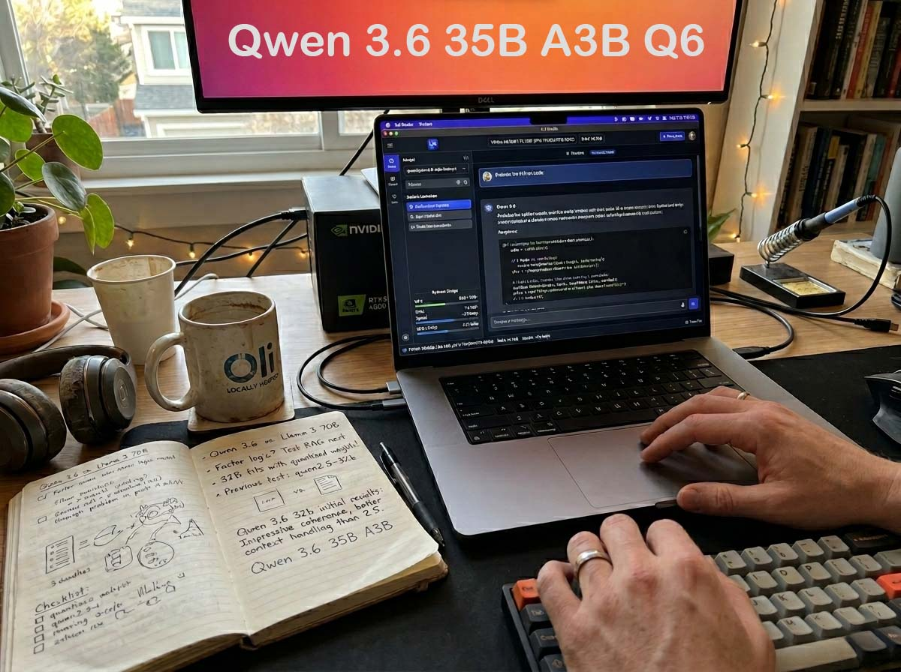
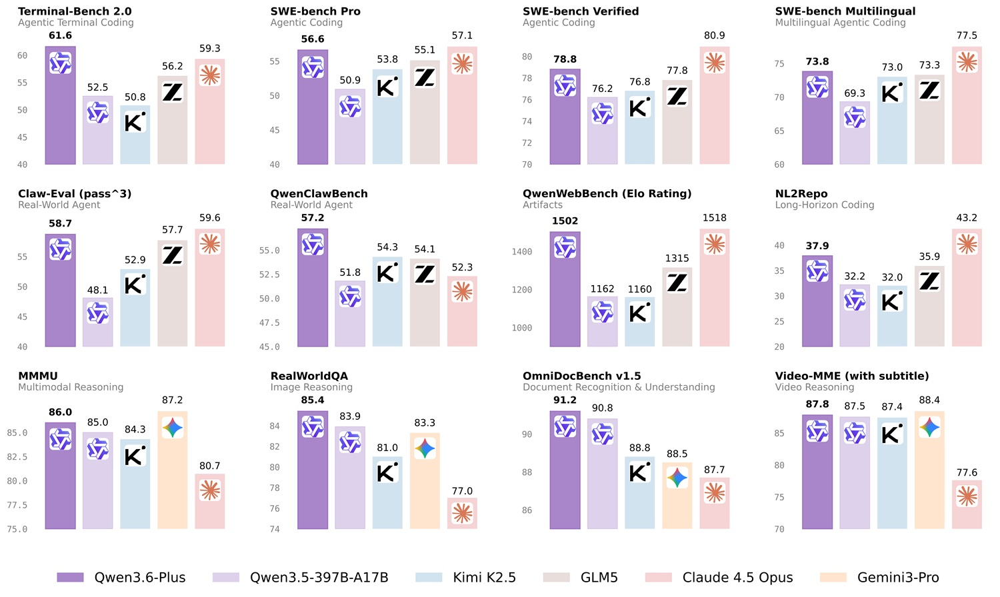
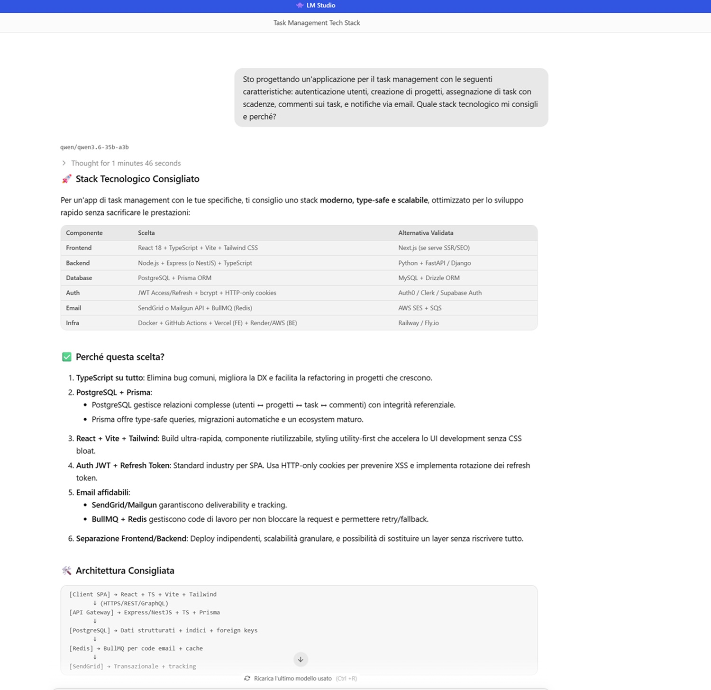
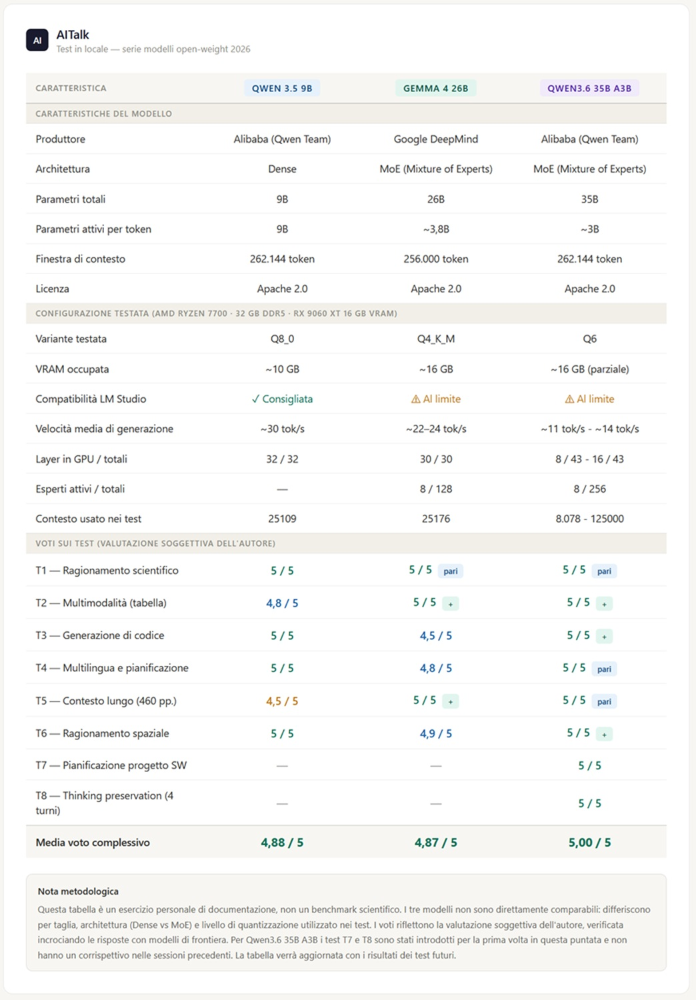

# Qwen 3.6 Locally: 35 Billion Parameters on My PC

*There is a moment in every series of experiments when you realize that the problem is no longer the subject of the test, but the quality of your measuring instrument. I was collecting the scores of the eighth test and thought that perhaps my tests have become the limit: five out of five, eight times out of eight. Is the thermometer still working, or has the water stopped varying in temperature?*

The question is not rhetorical. These articles are born as a logbook of a home laboratory, not as an academic white paper, and the method remains deliberately personal: no automated benchmarks, no standardized metrics, only prompts calibrated on realistic scenarios and the tactile sensation of someone who uses the tool and then tells the story. The hardware has not changed compared to previous episodes: AMD Ryzen 7700, 32 GB of RAM, AMD GPU with 16 GB of VRAM—and neither has the software: [LM Studio](https://lmstudio.ai/), the most accessible solution for those who want to run local models without losing an afternoon in terminal configurations. For all details on the installation, the ecosystem, and the philosophy of this laboratory, I refer to the [first episode of the series on Qwen 3.5](https://aitalk.it/it/qwen3.5-locale-puntata1.html), which remains the methodological reference for the entire series. Those already on board can continue from here.

Today the protagonist is different from the others. Not by category, but by size: [Qwen3.6 35B A3B in Q6 quantization](https://huggingface.co/Qwen/Qwen3.6-35B-A3B), the largest model I have ever loaded on this machine, literally at the limit of what the configuration can handle. After exploring [Qwen 3.5 9B in the first two episodes](https://aitalk.it/it/qwen3.5-locale-puntata2.html) and [Gemma 4 26B MoE](https://aitalk.it/it/gemma4-26b.html) in the third, this scale jump was inevitable. And it is exactly the jump I wanted to make.

## Thirty-Five Billion, Three at a Time

The name hides an architecture that is worth understanding, because it radically changes the way one reasons about hardware requirements. Qwen3.6 35B A3B is a Mixture of Experts model: it has 35 billion total parameters, but for each generated token it only activates about 3 billion. Not all experts are called to respond every time, only those considered most competent for that specific fragment of text. It's a bit like having an orchestra of two hundred and fifty-six musicians, where the conductor chooses from time to time which eight instrumentalists to have play, leaving the others listening and ready. The practical result is that the computational cost more closely resembles that of a three-billion-parameter model than a thirty-five-billion one, while still drawing on the depth of the latter when needed.

Qwen3.6, described in the [Alibaba official blog](https://qwen.ai/blog?id=qwen3.6) as an evolution of the Qwen3 architecture, brings with it four innovations that the team wanted to emphasize: a 43% improvement on QwenWebBench in agentic code generation and complete web application capabilities, a feature called *thinking preservation* to maintain reasoning coherence across multi-turn conversations, a jump in multimodal understanding with images and documents, and native support for video understanding—the latter still experimental and not supported by all available runtimes.

The Q6 quantization I worked on represents a reasoned compromise: less heavy than pure F16, much more faithful to the original model compared to aggressive quantizations like Q4. In practice, very little quality is lost compared to full weights, while paying a memory cost that, on my configuration, required careful balancing between GPU and system RAM.

## Configuration at the Limit

Here lies the real experiment. I didn't look for the point of maximum performance: I deliberately looked for the edge of the possible, to understand what happens when working with the minimum acceptable performance, at least in my opinion.

The chosen parameters: context at 8078 tokens (the model natively exceeds 262,000), GPU offload of 8 layers out of 43 total, 8 active experts out of 256 available, F16 quantization internally for the GPU layers. The resulting speed settled around 11 tokens per second, compared to the 20-25 that Qwen 3.5 9B comfortably reached. It’s not a speed I would recommend for a conversational assistant to be used on the fly, but it is entirely acceptable for structured work sessions where one is not in a hurry and privileges the depth of the response.

The question underlying the whole experiment is simple: is the sacrifice in speed worth the gained quality? The tests that follow are the answer.

## A Step Beyond: The Optimal Configuration

The choice to start from 8 layers in GPU and reduced context was deliberate: I wanted to test the model in conditions of real resource scarcity, the lowest point of the acceptable range. But once the battery of tests was completed, I wanted to understand where the true point of equilibrium lies on this hardware.

The results were instructive. Bringing the layers in GPU from 8 to 16 makes the speed rise from 11 to about 14.5 tokens per second—a significant gain. Surprisingly, doubling them again to 32 changes almost nothing (14.49 tok/s), and attempting a load with 40 layers prevents the model from starting altogether: the VRAM can't handle it. The optimal point for this hardware is therefore 16 layers, no more.

Equally interesting is the behavior of context: expanding it from 8,000 tokens to the native maximum of 262,000 has very little impact on speed, with a drop of less than one token per second between the two extremes. In practice, you can choose the context window based on the task without worrying about performance.

The parameter that actually makes the difference, however, is the number of active experts. With 4 experts, it rises to 16.2 tok/s; with 8 it’s at 14.2; with 16 it drops to 11.4; and with 125 it collapses to 2.9. It is an almost linear downward relationship: every additional expert costs, and on consumer hardware, the cost is felt immediately.

All tests with different configurations still produced responses of excellent quality, which suggests that reducing active experts does not perceptibly compromise quality, at least on the tasks used in this series.

The best compromise configuration on this hardware is therefore: 16 GPU layers, 125,000-token context, 8 active experts, with a speed of approximately 14.2 tokens per second. It’s not the speed of a small model, but it’s a step forward compared to the "at the limit" configuration used in the main tests, and it opens the door to working sessions on long documents without having to sacrifice quality.

[Image of benchmark results taken from qwen.ai](https://qwen.ai/blog?id=qwen3.6)

## The Tests

### Test 1 — Higgs Mechanism and Particle Physics *(5/5)*

*Parameters: context 8078 tokens, GPU offload 8 layers out of 43, 8 experts active out of 256, F16, 11.17 tokens/s*

The response was exceptional, probably the best I have ever obtained from a local model on a complex scientific topic. The model opened with the theoretical context, describing the gauge symmetry that governs electroweak interactions. It then introduced the Higgs field and its famous "Mexican hat" potential, explaining why zero is not the energy minimum. It showed how the vacuum expectation value interacts with gauge bosons, conferring mass to W and Z particles. And it clarified the subtlest detail, which is often missing even in university treatments: why the photon remains massless, thanks to a residual symmetry that the Higgs vacuum fails to break.

The structure of the response was impeccable, organized into logical sections that proceeded from the general to the particular without ever losing the thread. The language was precise but accessible, using metaphors like the "Mexican hat" to make abstract concepts intuitive. I found no errors in either the physical concepts or the mathematical details. The speed of 11 tokens per second is lower compared to the smaller models tested previously, but the quality of this response more than pays for the compromise. The patience to wait a few more seconds was rewarded with an explanation that could be defined as textbook.

### Test 2 — Multimodality and Table Understanding *(5/5)*

*Parameters: context 8078 tokens, GPU offload 8 layers out of 43, 8 experts active out of 256, F16, 10.49 tokens/s*

The uploaded image was deliberately of low quality: a small screenshot of an invoice management interface, imperfect to test visual capabilities in realistic rather than ideal conditions. The model passed the test with surprising results.

The first thing that struck me was the ability to understand the general structure of the interface. The model correctly identified the three main sections: the filter panel at the top, the side list of products on the right, and the central table. It recognized that it was likely an accounting management application, even hypothesizing that it could be a sample database or a test environment, given the generic nature of customer and item names.

The reading of the data was precise and detailed: all columns of the table enumerated correctly, the fixed 22% VAT rate detected as constant on all rows, the "Amount" column highlighted in yellow noted as a navigation element for the user, and the invoice dates identified in the January-March 2022 period. But the most valuable part was the analysis of anomalies: despite the upper filter showing the "TO PAY" option as selected, the invoices in the table already had a payment date and a settled amount. The model pointed out the possible mix of data, formulating sensible hypotheses about the context of use. A smaller model would have produced a generic description. Here I got a real analysis, with interpretation of inconsistencies included.

### Test 3 — Complex Code Generation *(5/5)*

*Parameters: context 8078 tokens, GPU offload 8 layers out of 43, 8 experts active out of 256, F16, 10.06 tokens/s*

This test was one of the most important of the entire battery, because Qwen3.6 promises a 43% improvement on QwenWebBench specifically in code generation. I wanted to see if the promise translated into a concrete and working implementation on a non-trivial algorithmic problem: finding the maximum length cycle in an undirected graph.

The response was fully convincing. The model opened with a theoretical premise that few programming assistants have the maturity to include: it explicitly stated that the problem is NP-hard, that there is no polynomial algorithm to solve it on general graphs, and that any exact solution will have exponential complexity in the worst case. This awareness is rare and precious, because it demonstrates that the model is not trying to sell a magic solution, but deeply understands the limits of the domain.

The proposed implementation was elegant and functional: a DFS strategy with path tracking, a data structure with a depth map to detect back-edges and calculate cycle length in constant time, efficient graph representation via adjacency list, correctly implemented backtracking, and full handling of edge cases like graphs without cycles and disconnected components. I particularly appreciated the use of the depth map—more elegant and performant than a simple linear search in the path because it allows for calculating cycle length without scanning the entire list. The explanation of temporal complexity was clear and honest, with a distinction between the favorable case and the worst case. No syntactic or logical errors, type hints present, modular structure. Code that you could hand in.

### Test 4 — Multilingual and Planning *(5/5)*

*Parameters: context 8078 tokens, GPU offload 8 layers out of 43, 8 experts active out of 256, F16, 11.15 tokens/s*

*Methodological note: executed in a clean chat after a first execution in a chat with history had produced mediocre results.*

This test taught something important even before the result. The first execution, in a chat with previous iterations on other topics, had produced interruptions and mediocre quality. Repeated in a completely new chat, the result was transformed. The difference was so sharp it deserves a permanent methodological note: chat history, even when it seems harmless, can significantly alter results on complex tasks. Testing in a clean chat is not a whim; it is experimental hygiene.

In a clean chat, Qwen3.6 produced a five-day itinerary for Tokyo in French, complete and articulate, on the first attempt. The French was of native level: "spécialités de rue," "ambiance vieux Tokyo," "cadre apaisant," "ruelle atmosphérique," "patrimoine UNESCO." No grammatical or syntactic errors, advanced-level fluency.

The itinerary was logistically perfect, with days balanced between temples and street food, and full of tips for the savvy traveler: arrive at Fushimi Inari before eight to avoid crowds, print temple names in Japanese, use food models in restaurants to order without speaking the language. The transport section explained how to activate Suica or Pasmo on a smartphone, how to book the Shinkansen, and that information offices in main stations have French-speaking staff at certain times. It suggested the Kyoto City Bus Day Pass and recommended downloading offline maps. For the language barrier, it proposed not only Google Translate but also Papago for voice recognition, and key phrases in transliterated Japanese.

The requested final section in Italian, to test multilinguality within the same prompt, was clean, correct, and full of practical advice on cash payments, Seven-Eleven ATMs, and translation cards for food allergies.

### Test 5 — Extremely Long Context: 460-Page Document *(5/5)*

*Parameters: context 8078 tokens, GPU offload 8 layers out of 43, 8 experts active out of 256, F16, 10.93 tokens/s*

This was the most surprising test of the entire battery, and it deserves to be told with due attention. I uploaded the *AI Index Report 2025*, a PDF of about 460 pages and over 20 million characters, asking the model to describe the growth of video generation and to indicate the pages where to find the data. The challenge was deliberately extreme: a context of only 8078 tokens—far from the model's native 262,000—only eight active experts, only eight GPU layers.

The response left me speechless. Despite the bare-bones parameters, the model provided a precise and well-structured summary of progress in video generation between 2023 and 2025. It correctly cited the main models: Meta Movie Gen, Google Veo and Veo 2, Runway Gen-3 Alpha, Luma Dream Machine, Kling 1.5. It mentioned the famous example of the "Will Smith eating spaghetti" prompt as a marker of the qualitative leap that occurred in the sector. It indicated specific figures in the report, such as Figure 2.3.11 and Figure 2.3.12. And it stated that the main data could be found on pages 126 and 127 of the report. I checked. It was exact.

How it managed to find the right information in a 460-page document with a context window corresponding to a few dozen pages remains the most fascinating mystery of the entire session. Likely, the model was able to identify and retain the most relevant sections despite memory constraints, but the exact mechanism is not transparent from the outside. What is transparent is the result: with a bare-bones configuration, on an enormous document, verifiable references to the correct pages. That is robustness.

### Test 6 — Spatial Reasoning *(5/5)*

*Parameters: context 8078 tokens, GPU offload 8 layers out of 43, 8 experts active out of 256, F16, 11.42 tokens/s*

The test asked to analyze a photograph of a messy room and propose a tidying plan. Despite the conservative parameters—only eight experts, only eight GPU layers—the model produced a high-level visuospatial analysis.

The description was faithful and detailed: a bed with a black metal frame, two white ladder bookcases correctly positioned, a cluttered gray desk, a small white cabinet, and a mirror on the door. Wall colors identified as light sage green, floor with printed carpet, and green and white striped curtains. Even the blue laundry basket in the center of the floor, surrounded by scattered clothes, shoes, boxes, scissors, and other objects, was detected and cataloged.

The tidying plan was structured by visual priorities with solid reasoning. First, the clothes from the floor and bed, because removing them clears the movement path and reduces visual noise, making the room seem larger. Then the bed, because an unmade bed visually occupies more space and creates a sense of chaos, while straightening it defines the room's boundaries. Then the laundry basket and shoes—physical obstacles blocking the central "naviglio" (a curious and effective term, meaning 'aisle' or 'passage'). Finally, the desk, whose free surface projects order and functionality. The final synthesis was perfect: "The initial goal is not meticulousness, but volume." A sentence that summarizes the essence of effective organization in a very messy environment, and which a professional in the field could not have said better.

### Test 7 — Multi-Step Agent: Software Project Planning *(5/5)*

*Parameters: context 8078 tokens, GPU offload 8 layers out of 43, 8 experts active out of 256, F16, 11.04 tokens/s*

This test was introduced specifically to verify the promise of 43% improvement on QwenWebBench. A model that excels in physics and spatial reasoning could still fail at an articulated planning task. The true maturity of a programming assistant is seen in the ability to organize work, anticipate problems, and provide practical solutions, not just write code. The task was to plan the development of a web app for managing family expenses, with a team of two developers and a detailed roadmap.

The response was probably the most complete of the entire battery. The proposed technology stack was modern and coherent, with each choice motivated in a clear table: React with TypeScript and Vite for the frontend, Node.js with Express for the backend, PostgreSQL with Prisma as the ORM, JWT for authentication, papaparse for CSV parsing, React-PDF for exporting, BullMQ for notification queues, and Docker for infrastructure. The project structure was detailed by logical folders for both frontend and backend sides, with a docker-compose.yml to orchestrate Postgres, Redis, and the application. This is the structure a real software engineer would use.

The planning in six weekly sprints was realistic and well-balanced: setup and authentication, transactions and CSV import, dashboard and charts, PDF export, budget and email notifications, testing and deploy. For each sprint, focus, expected deliverables, potential criticalities, and work division between the two developers were indicated. The recommendation to first define the API contracts and then work in parallel is a best practice that many senior developers struggle to follow systematically.

Critical issues were identified with surgical precision: heterogeneous CSV formats and management of partial errors in importing, deliverability and time zones for email notifications, test coverage and a rollback plan for the deploy. The best practices section was complete: httpOnly cookies and rate limiting for security, DB indexes and pagination for performance, mock SMTP and DB for testing, and GitHub Actions for CI/CD. The model even suggested Sentry for error tracing and Notion for documentation. The only small note is that the response was almost excessively detailed for an initial planning, but it is the kind of excess one prefers to have.

*Screenshot of my PC and LM Studio during the Multi-step Agent test.*

### Test 8 — Thinking Preservation: Four-Turn Conversation *(5/5)*

*Parameters: context 8078 tokens, GPU offload 8 layers out of 43, 8 experts active out of 256, F16, slightly above 11 tokens/s per turn*

This test was introduced to evaluate one of the most interesting innovations of Qwen3.6: the ability to maintain reasoning coherence across multi-turn conversations, preserving not only the chat history but also the logic of decisions made in previous phases. For iterative development, this is a fundamental quality because it allows for building complex projects without having to constantly repeat premises.

The conversation was articulated in four turns. In the first, I asked for a technology stack for a task management application: the response was detailed with a comparative table—React with TypeScript, Node.js with Express, PostgreSQL with Prisma, JWT, SendGrid with BullMQ—each choice motivated with solid arguments. In the second turn, I asked for an opinion on the choice between WebSocket and polling for real-time notifications with 1000 active users: the model explained why WebSocket is superior for latency and overhead, showed an architecture with PostgreSQL LISTEN/NOTIFY and Redis Pub/Sub, and anticipated the edge case of networks that block WebSocket by explaining that Socket.IO handles fallback automatically. In the third turn, I asked for the database schema in Prisma: the schema produced was complete, with eight main models, enums for status, priority, and role, well-defined relations, UUIDs for primary keys, strategic indexes for frequent queries, and controlled cascades. It included an example query that avoided the N+1 problem.

The fourth turn was the real test: I asked for a summary of the technology choices made so far and the explanation of why we chose WebSocket instead of polling. The model correctly remembered everything from the first turn, summarized the reasons for WebSocket with the same terminology and the same reasons as the second turn, and spontaneously added a section on scalability to 10,000 users with strategies for backend, database, caching, email queues, observability, and deploy, plus an operational checklist. It received no reminders: it simply remembered. No contradictions, no forgetting, reasoning extended coherently. The promise of *thinking preservation* was not marketing.

## The Video That Waits

Qwen3.6 promises native video understanding, an absolute novelty compared to previous versions. I tried to test it by uploading an MP4 file in LM Studio. The system responded with an exclamation mark on the attachment and the model stated it had not received any file. The limit is not in the model, but in the tool chosen to run it: LM Studio handles images, PDFs, text documents, and CSVs excellently, but videos are not yet among the supported formats. I reserve the right to return to this test as soon as possible, likely with llama.cpp or vLLM, which might offer more complete support for video content. If the premises are maintained, it will be an episode that deserves a dedicated space.

*The "comparative" table with tests on previous models. Featuring the dual configuration tested for Qwen 3.6*

## Is It Worth Pushing to the Limit?

This is the question that underlies the entire series, and with Qwen3.6, it becomes impossible to avoid. With Qwen 3.5 9B, we were going at 20-25 tokens per second on a relaxed configuration. With Gemma 4 26B MoE, the margins had already narrowed. With this model, we are at 11 tokens (about 14/15 in maximum optimization on my hardware) per second, with the GPU engaged for a fraction of the total and the load distributed between VRAM and system RAM in a precarious balance. The consecutive maximum scores have raised a legitimate question about the severity of my tests, and that question remains open: sharper evaluation tools will likely be needed in subsequent episodes.

But meanwhile, there is a concrete fact to reason upon. The answer to the question about speed depends entirely on how the model is used. If you are looking for a conversational assistant for quick sessions, 11 tokens (about 14/15 in maximum optimization on my hardware) per second start to be felt. If you work on structured tasks, in-depth analyses, complex code generation, or long documents, the quality this model offers in a reduced configuration is simply unreachable by smaller models, even pushed to the maximum. The experiment with the 460-page document demonstrated this in the most graphic way possible: a tiny context window, a machine at the limit, and the model finding the exact pages in a book-sized volume.

There is, however, a broader subtext that this series of experiments is progressively bringing to the surface. When a 35-billion-parameter model runs locally on consumer hardware with results comparable to cloud services of two years ago, something in the topology of the AI market is changing. The cloud remains unbeatable for speed, for frontier models, for scalability. But for those working with sensitive data, for those who want complete control over inference, for those who do not want to depend on an API endpoint with its latencies and variable costs, local is becoming a mature choice, no longer just an experiment for enthusiasts. The distance between the two options shortens with every generation of models, and Qwen3.6, even in this intentionally penalized configuration, is the most convincing proof I have had so far.

The maximum scores are a problem. But it's the kind of problem that is much less scary than the opposite.
