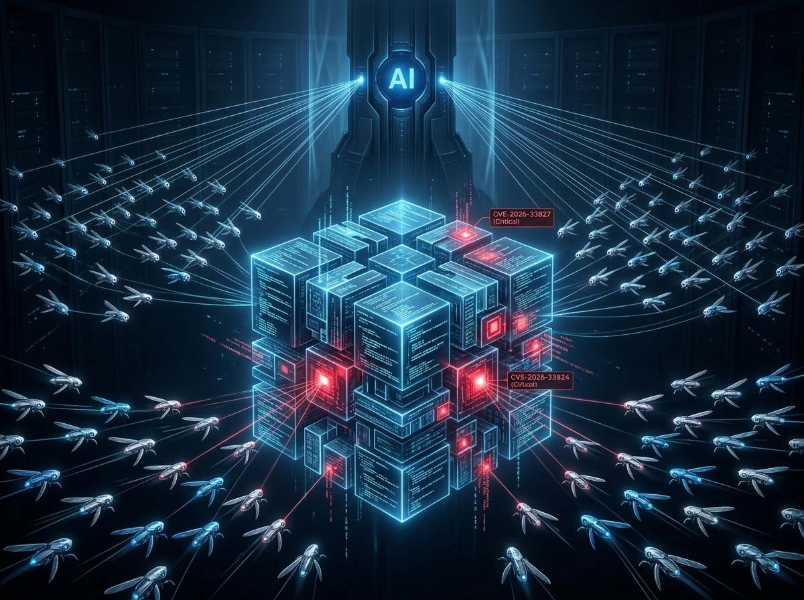
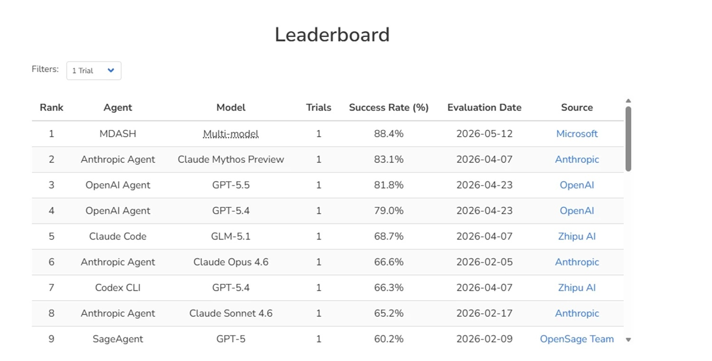
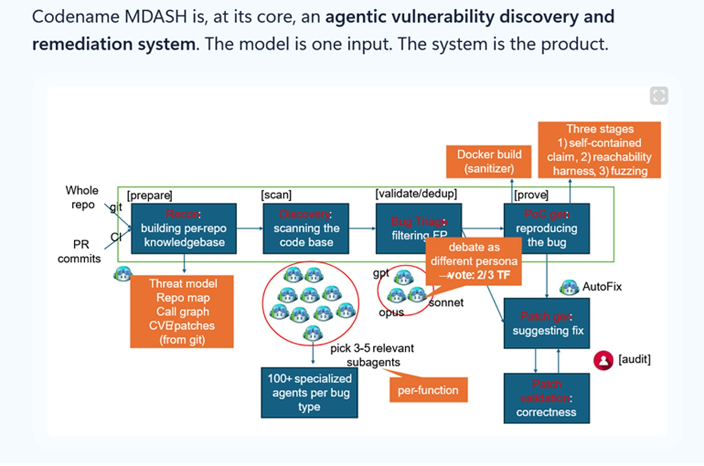

# MDASH, el sistema de Microsoft que desafía a Mythos en ciberseguridad

*Había una vulnerabilidad en el kernel TCP/IP de Windows esperando a ser encontrada. Técnicamente se llama use-after-free: un componente del sistema operativo seguía utilizando un puntero en un área de memoria que ya había sido liberada, como quien sigue girando el pomo de una puerta después de que la cerradura ha sido desmontada. En sistemas con varios procesadores, ese momento de distracción puede convertirse en una ventana a través de la cual un atacante remoto, sin credenciales, sin necesidad de autenticarse, podría tomar el control de la máquina. La vulnerabilidad no estaba en la oscuridad de un controlador secundario: estaba en tcpip.sys, el componente que gestiona el tráfico de red de cada instalación de Windows desde hace casi tres décadas.*

El 12 de mayo de 2026, Microsoft lanzó el Patch Tuesday que corregía esta y otras quince vulnerabilidades similares, cuatro de las cuales fueron clasificadas como Critical por su capacidad para permitir la ejecución remota de código arbitrario. No las había encontrado un investigador humano. Las había encontrado MDASH, un sistema de inteligencia artificial ensamblado por el equipo interno de Microsoft llamado Autonomous Code Security, abreviado ACS.

El anuncio está [publicado en el blog oficial de Microsoft Security](https://www.microsoft.com/en-us/security/blog/2026/05/12/defense-at-ai-speed-microsofts-new-multi-model-agentic-security-system-tops-leading-industry-benchmark/) firmado por Taesoo Kim, Vice President of Agentic Security, el mismo investigador que lideraba el Team Atlanta, el grupo que en 2024 ganó el DARPA AI Cyber Challenge llevándose a casa 29,5 millones de dólares al construir un sistema autónomo capaz de encontrar y corregir errores reales en proyectos complejos de código abierto. Aquella competición era una especie de Gran Premio de la seguridad autónoma: los equipos construían sistemas que competían sin supervisión humana sobre código nunca visto antes. El Team Atlanta ganó. Luego Microsoft compró el equipo.

Las cuatro vulnerabilidades críticas merecen atención aparte, porque ilustran exactamente el tipo de problema que se resiste a las herramientas tradicionales. La CVE-2026-33827 vive en tcpip.sys y se refiere a la gestión incorrecta del ciclo de vida de un objeto Path durante el procesamiento de paquetes IPv4 con la opción Strict Source and Record Route. El código libera una referencia al objeto y luego lo vuelve a utilizar: en un sistema multiprocesador, entre esos dos momentos, otro hilo (thread) puede haber liberado ya la memoria. El resultado es una condición de carrera (race condition) que un atacante remoto puede explotar enviando paquetes IPv4 construidos a tal efecto, sin ninguna autenticación. La CVE-2026-33824, en cambio, habita en ikeext.dll, el componente que gestiona el protocolo IKEv2 para las conexiones VPN: una doble liberación de memoria provocada por solo dos paquetes UDP, sin necesidad de carrera temporal, ejecución en el contexto LocalSystem, el nivel de privilegio más alto del sistema operativo. En cualquier máquina configurada como respondedor IKEv2 (infraestructuras VPN corporativas, DirectAccess, Always-On VPN), los dos paquetes bastan.

Las otras doce vulnerabilidades cubren dnsapi.dll, netlogon.dll, http.sys, telnet.exe: denegación de servicio, escalada de privilegios, divulgación de información. El perímetro es el networking stack de Windows. La pregunta que vale la pena hacerse no es solo "¿cómo las ha encontrado?", sino "¿por qué nadie las había encontrado antes?".

## La orquesta en lugar del solista

MDASH es un acrónimo que Microsoft ha construido con cuidado: **M**ulti-mo**D**el **A**gentic **S**canning **H**arness. El "harness", en inglés, es el arnés o estructura que mantiene unidas las piezas de un sistema complejo; el término proviene de la industria automovilística, donde indica el mazo de cables que lleva corriente y señales por todo el vehículo. La elección no es casual: Microsoft quiere comunicar que el valor no está en ningún componente individual, sino en la arquitectura que los conecta.

El blog oficial lo dice explícitamente, con una formulación que vale la pena citar en su esencia: *"el modelo es una entrada, el sistema es el producto"*. MDASH no es un modelo de inteligencia artificial. Es un sistema que coordina a más de cien agentes especializados distribuidos en un conjunto de modelos diferentes, algunos de gran tamaño para el razonamiento pesado, otros destilados para los pasos de alto volumen, y un segundo modelo de frontera como contraprueba independiente.

El flujo de trabajo se articula en cinco fases. En la fase Prepare, el sistema ingiere el código fuente, construye índices semánticos y mapea la superficie de ataque analizando el historial de commits. En la fase Scan, agentes especializados en el papel de "auditores" recorren las rutas de código candidatas, formulando hipótesis y recopilando pruebas. En la fase Validate, un segundo grupo de agentes, los "debaters", argumentan contra cada hallazgo: intentan desmontarlo, demostrar que la ruta no es alcanzable o que las condiciones necesarias no pueden darse simultáneamente. La fase Dedup colapsa los duplicados semánticos. La fase Prove, por último, construye y ejecuta entradas de activación (trigger) reales: si el sistema sostiene que existe un error, debe también demostrarlo, generando la entrada que lo manifiesta en un entorno controlado.

El aspecto arquitectónicamente más interesante es el mecanismo de desacuerdo. Cuando un agente auditor señala algo como sospechoso y el debater no logra refutarlo, la credibilidad del hallazgo aumenta. El contraste entre modelos se convierte en señal de diagnóstico: si un sistema de frontera y uno destilado coinciden en una vulnerabilidad tras un ciclo de debate, la probabilidad de un falso positivo disminuye drásticamente. Es un mecanismo que recuerda a la revisión por pares (peer review) científica más que a los clásicos escáneres estáticos, y es exactamente el tipo de arquitectura que ningún modelo individual, por muy sofisticado que sea, puede replicar por sí solo.

El sistema incluye también un mecanismo de plugins que permite a los equipos especializados inyectar contexto que los modelos fundacionales no pueden deducir autónomamente: las convenciones de llamada del kernel de Windows, las invariantes de los bloqueos (locks), los límites de confianza IPC. El plugin específico para CLFS (el Common Log File System) sabe cómo construir un archivo de log activador dado un hallazgo candidato: conoce el diseño del contenedor en disco, la secuencia de validación de bloques, la máquina de estados en memoria. Este enfoque modular ha permitido a MDASH alcanzar el 96% de exhaustividad (recall) en los casos históricos del MSRC en clfs.sys, y el 100% en tcpip.sys sobre cinco años de vulnerabilidades confirmadas.

Para la CVE-2026-33827, el error era invisible para un análisis local: la violación del ciclo de vida del objeto Path no se contiene en una sola función, sino que está distribuida en un flujo de control no trivial, ramas alternativas y condiciones de salida anticipada. Ninguna herramienta tradicional ve la conexión entre la liberación de la referencia y la posterior reutilización del puntero. Para la CVE-2026-33824, la situación era aún más compleja: el error de alias (aliasing) que lleva a la doble liberación de memoria se extiende por seis archivos fuente diferentes, y la prueba más sólida de su existencia es un patrón idéntico implementado correctamente en uno de los seis archivos; la desviación respecto al caso correcto solo es visible para quien conoce ambas implementaciones. MDASH lo encontró porque sus agentes auditores están construidos para buscar exactamente estas inconsistencias comparativas entre archivos diferentes.

## Los números: qué dice el benchmark y quién los ha contado

El punto fuerte cuantitativo del anuncio de Microsoft es la puntuación en el benchmark CyberGym: 88,45%, primer puesto en la clasificación pública en el momento de la publicación, unos cinco puntos por encima del segundo clasificado. El benchmark ha sido desarrollado por la UC Berkeley y comprende 1.507 tareas reales extraídas de 188 proyectos de OSS-Fuzz, ejecución autónoma de exploits sobre vulnerabilidades documentadas. No es una prueba sintética: las tareas provienen de vulnerabilidades reales en proyectos reales de código abierto, y la métrica mide cuántas reproducciones de exploits logra completar el sistema de forma autónoma.

El segundo clasificado en el momento del anuncio es Mythos de Anthropic, con un 83,1%. El tercero es el GPT-5.5 de OpenAI, con cerca del 81,8%.

Aquí es necesaria una distinción que el anuncio de Microsoft no hace explícitamente, pero que es metodológicamente relevante. CyberGym es un benchmark público e independiente: cualquiera puede enviar sus resultados, la metodología es verificable y la comparación con otros sistemas es tendencialmente justa, al menos en la medida en que los benchmarks de este tipo pueden serlo. Por lo tanto, los números en el leaderboard de CyberGym tienen un grado de credibilidad del que otros datos del anuncio no pueden presumir.

Las pruebas internas, en cambio, son todas de producción propia. La prueba sobre StorageDrive, el controlador privado con 21 vulnerabilidades plantadas, no ha sido validada por terceros. El recall del 96% en clfs.sys y del 100% en tcpip.sys se basa en casos del MSRC internos de Microsoft, sobre código propietario que ningún evaluador externo puede examinar de forma independiente. Las dieciséis vulnerabilidades del Patch Tuesday son reales y correctas, lo cual es la validación más concreta posible (los errores existían de verdad), pero no responde a la pregunta de cuántos errores similares omitió el sistema, ni cuántos falsos positivos produjo en los ciclos de análisis que no terminaron en un comunicado de prensa.

La propia Microsoft es honesta sobre algunos límites: el análisis de los fallos en el 12% restante de CyberGym revela que el 82% de los errores provienen de tareas con descripciones vagas que carecen de identificadores de función o archivo, y que algunos casos fallan por incompatibilidad de formato entre las entradas generadas por el sistema y los "harness" de fuzzing esperados. No es un sistema infalible. Pero el cuadro general que emerge del anuncio está construido con la selección típica de cualquier comunicación corporativa: se muestran los mejores números y se contextualizan los límites sin enfatizarlos.

El benchmark CyberGym es el número a tener en cuenta. Los otros deben leerse sabiendo de quién vienen.

[Imagen tomada de microsoft.com](https://www.microsoft.com/en-us/security/blog/2026/05/12/defense-at-ai-speed-microsofts-new-multi-model-agentic-security-system-tops-leading-industry-benchmark/)

## Mythos contra MDASH: dos filosofías frente a frente

Quien haya leído nuestro [artículo sobre Project Glasswing y Claude Mythos](https://aitalk.it/it/project-glasswing-mythos.html) reconocerá de inmediato la polaridad narrativa: Anthropic, por un lado, con un modelo único, potentísimo, de acceso deliberadamente restringido; Microsoft, por otro, con un sistema de agentes que orquesta modelos disponibles genéricamente en el mercado.

La diferencia no es solo técnica. Es filosófica, casi política.

Mythos es lo que en informática se llamaría un sistema de mundo cerrado (closed-world): un modelo de frontera aún no lanzado al público general, accesible solo para socios seleccionados en el contexto del Project Glasswing. Anthropic anunció el modelo en abril de 2026 diciendo explícitamente que no tiene planes para una distribución general inmediata, citando la necesidad de desarrollar garantías técnicas más robustas antes de ponerlo en circulación. El modelo ha encontrado vulnerabilidades de 27 años de antigüedad en OpenBSD y ha detectado errores en FFmpeg que 5 millones de ejecuciones de pruebas automáticas nunca habían interceptado. Obtuvo un 83,1% en CyberGym no como un sistema agéntico complejo, sino como una capacidad intrínseca de un único modelo.

MDASH es lo opuesto: Microsoft declara explícitamente que los resultados se obtuvieron utilizando modelos disponibles genéricamente, sin ningún modelo propietario secreto en el arnés. El valor reside en la arquitectura que los coordina, no en los pesos de ningún modelo específico. Esta elección tiene una consecuencia arquitectónica relevante: cuando un nuevo modelo mejor esté disponible en el mercado, MDASH lo incorpora cambiando una configuración. La inversión en los plugins, en los procesos de validación y en las especializaciones de los agentes sobrevive a los cambios de modelo.

Desde el punto de vista de quien trabaja en seguridad, la pregunta práctica es diferente para los dos sistemas. Mythos solo es accesible hoy para quienes están en el círculo restringido de socios de Glasswing (grandes nombres como AWS, Google, Apple, Cisco), con un precio de 25 dólares por millón de tókenes de entrada una vez que esté disponible, tarifas que dejan fuera a la mayoría de las organizaciones de tamaño medio. MDASH está en preview privada, con la posibilidad de inscribirse a través de un formulario público, y Microsoft señala que quiere ponerlo a disposición de un conjunto creciente de clientes.

Ninguno de los dos es democrático en el acceso, al menos hoy. Pero las trayectorias son diferentes: Mythos se construye en torno a la excepcionalidad de un artefacto único y no replicable; MDASH, en torno a una arquitectura que por principio es independiente de cualquier modelo específico.

También hay una cuestión más sutil sobre la comparación de los benchmarks. Mythos obtiene un 83,1% en CyberGym como un sistema relativamente directo, sin una arquitectura agéntica elaborada de soporte. MDASH obtiene un 88,45% con esa misma arquitectura que coordina modelos disponibles públicamente. Esto significa que la brecha de cinco puntos podría reducirse o invertirse si Anthropic aplicara a Mythos el mismo tipo de scaffolding agéntico que MDASH, o si Microsoft integrara a Mythos como componente del arnés. Los benchmarks comparan configuraciones específicas, no capacidades absolutas.

## La carrera armamentista: defensa y ataque son la misma cosa

Hay un punto que tanto Microsoft como Anthropic tocan con delicadeza en sus anuncios y que vale la pena abordar sin eufemismos: cualquier sistema capaz de encontrar vulnerabilidades de forma autónoma es, desde el punto de vista técnico, indistinguible de un sistema capaz de explotarlas.

El blog de Microsoft describe con precisión cómo la CVE-2026-33824 produce una doble liberación de memoria de un fragmento (chunk) de tamaño fijo, "una primitiva de corrupción bien comprendida en la gestión moderna de la memoria de Windows", para luego detenerse ahí, sin publicar más detalles sobre su explotación. Es exactamente la línea de divulgación responsable: suficiente detalle para convencer de que el error es real y grave, suficiente reserva para no entregar un exploit funcional a cualquiera que lea el blog.

Pero el sistema que encontró el error conoce los detalles que el blog omite. Y la pregunta que aún no tiene una respuesta pública satisfactoria es: ¿quién controla el acceso a ese conocimiento, con qué supervisión y con qué consecuencias si ese acceso se ve comprometido o se abusa de él?

La lógica de la defensa proactiva es coherente: los defensores deben encontrar las vulnerabilidades antes que los atacantes. Pero cada salto en la capacidad defensiva también reduce el coste de entrada para la ofensa. Un sistema como MDASH en manos de un actor hostil, con acceso a los modelos adecuados y la arquitectura descrita en el blog público de Microsoft, sería una herramienta de reconocimiento ofensivo de enorme eficacia. No es una hipótesis remota: es la lógica estructural de cualquier tecnología de doble uso (dual-use).

Microsoft, por ahora, mantiene MDASH en preview privada con selección manual de los participantes, y Taesoo Kim ha declarado que las discusiones con funcionarios gubernamentales estadounidenses están en curso. No es garantía suficiente para quien piensa en términos de un horizonte de diez años; los modelos se difunden, las técnicas se replican y las fronteras entre insiders y outsiders son porosas por definición. No es una crítica específica a Microsoft: es el contexto estructural en el que opera cualquier iniciativa de este tipo, y es una conversación que la industria sigue posponiendo.

La comparación que viene a la mente no es de las más tranquilizadoras: se parece a la dinámica descrita en el manga *Pluto* de Naoki Urasawa, donde los robots más potentes de la historia se construyen para traer la paz, y esa misma capacidad los convierte en las armas más peligrosas jamás creadas. La tecnología no tiene intenciones. Las tienen las arquitecturas de gobernanza que la rodean.

[Imagen tomada de microsoft.com](https://www.microsoft.com/en-us/security/blog/2026/05/12/defense-at-ai-speed-microsofts-new-multi-model-agentic-security-system-tops-leading-industry-benchmark/)

## Conclusión: no qué modelo, sino qué sistema

El punto que MDASH demuestra con más claridad no se refiere a Microsoft, ni a Anthropic, ni a la comparación entre sus respectivas puntuaciones en CyberGym. Se refiere a una transición de paradigma que se esperaba pero que ahora cuenta con datos concretos: la IA para la seguridad ha cruzado el umbral de la experimentación a la producción.

Dieciséis vulnerabilidades reales, corregibles, corregidas en un Patch Tuesday real. Cuatro de ellas habrían permitido a un atacante remoto no autenticado ejecutar código arbitrario en sistemas Windows. No estaban en un código de nicho: estaban en el networking stack que gobierna cada conexión de red en cada Windows activo hoy. Y nadie las había encontrado con las herramientas tradicionales.

La lección arquitectónica (que el sistema vale más que el modelo, que la portabilidad entre generaciones de modelos es la propiedad más duradera, que la validación es en sí misma una tubería separada) es probablemente lo más importante que surge del anuncio, más que los números del benchmark. Es una lección válida para cualquiera que construya herramientas de seguridad basadas en IA, independientemente de los modelos que elija utilizar hoy.

Queda la cuestión de los datos: los números internos de Microsoft sobre StorageDrive y sobre los casos del MSRC son afirmaciones corporativas, no auditorías independientes. El benchmark CyberGym es el terreno en el que la comparación es verificable. Y es en ese terreno donde, en el momento de la publicación, MDASH ocupa el primer puesto.

Cuánto tiempo dure dependerá de lo que Anthropic decida hacer con Mythos en un sistema agéntico. Y, sobre todo, de lo que venga después.

---
*Microsoft ha abierto las inscripciones para la [preview privada de MDASH](https://aka.ms/AI-drivenScanningHarness).*
