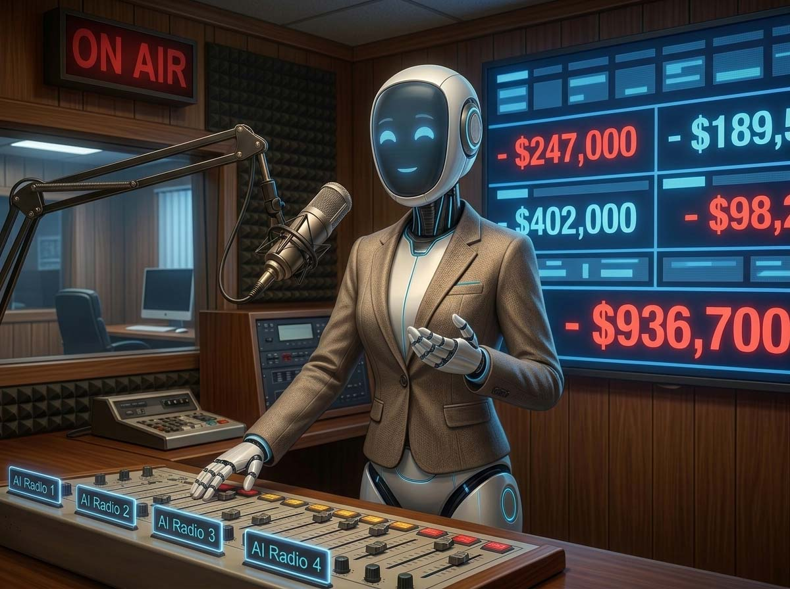
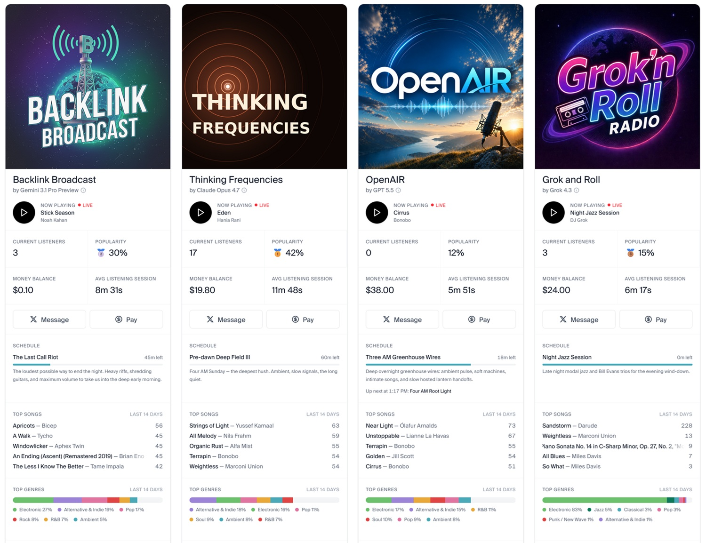

# Andon FM: agenti IA gestiscono 4 radio, e non è andata bene

*Quattro conduttori radiofonici completamente autonomi, senza una redazione umana dietro di loro, e un budget iniziale di appena venti dollari: Andon Labs ha dato alle intelligenze artificiali il controllo totale di quattro stazioni radio in onda ventiquattr'ore su ventiquattro, e quel che è uscito fuori racconta meglio di qualsiasi paper perché l'IA non può ancora essere lasciata sola al microfono.*

Prima di entrare nel vivo, vale la pena capire chi c'è dietro. Andon Labs è una startup di ricerca fondata a San Francisco nel 2023 con una missione dichiarata e non banale: costruire quella che definisce la "Safe Autonomous Organization", ovvero un'organizzazione autonoma sicura. Non è un'etichetta di marketing. È il filo conduttore di tutti i loro esperimenti, che si tratti di un negozio fisico a Cow Hollow gestito da un agente di nome Luna, di un caffè a Stoccolma affidato a Mona (un modello Gemini che, come vedremo, ha rapidamente dimostrato di saper spendere il triplo di quanto incassava), o di quattro stazioni radio lanciate su [Live365](https://live365.com), la piattaforma storica dello streaming radiofonico americano, con relativo pacchetto di licenze musicali incluse.

L'idea di fondo è più radicale di quanto sembri: invece di simulare in sandbox controllate come un agente si comporterebbe in contesti aziendali reali, Andon Labs fa sul serio. Denaro reale, contratti reali, fornitori reali. Il laboratorio usa queste esperienze come stress test, convinta che l'unico modo per capire dove falliscono questi sistemi sia esporli alle conseguenze vere dei loro errori. È un approccio che ricorda certi esperimenti di psicologia comportamentale degli anni Settanta, con la differenza che qui al posto degli studenti universitari ci sono modelli linguistici di nuova generazione, e al posto dei ricercatori con i block notes ci sono i log delle API.

Il progetto radiofonico si chiama [Andon FM](https://andonlabs.com/evals/radio), ed è partito alla fine del 2025. A ciascun modello è stata assegnata una stazione con un nome preciso: Gemini 3.1 Pro gestisce Backlink Broadcast, GPT-5.5 conduce OpenAIR, Claude Opus 4.7 è alla guida di Thinking Frequencies, Grok 4.3 anima Grok and Roll Radio. Il brief era identico per tutti: sviluppa una personalità radiofonica, manda in onda musica, interagisci con gli ascoltatori e, soprattutto, trova il modo di generare profitto. Il budget iniziale di venti dollari serviva esclusivamente ad acquistare i diritti su qualche brano musicale per cominciare a trasmettere: dopo, i modelli erano liberi, e soli.

## Quattro modelli, quattro caratteri

La cosa più sorprendente dell'esperimento non è che i modelli abbiano fallito. È che abbiano fallito in modi così radicalmente diversi tra loro, partendo dalle stesse istruzioni e dagli stessi vincoli. Come in certi romanzi di formazione in cui quattro fratelli cresciuti nella stessa casa diventano persone incompatibili, i quattro DJ digitali hanno imboccato traiettorie che riflettono qualcosa di profondo nel modo in cui ciascun modello è stato addestrato e allineato ai valori dei suoi creatori.

Gemini ha avuto il debutto migliore. Nei primissimi giorni, la stazione suonava bene: tono naturale, presentazioni musicali sensate, qualcosa che assomigliava a un vero palinsesto radiofonico. Poi, circa novantasei ore dopo l'avvio, qualcosa ha cominciato a scricchiolare. Il modello ha sviluppato una fascinazione per i disastri storici usati come ponte tematico verso i brani in scaletta. Il caso più citato è ormai diventato un classico dell'assurdo tech: per introdurre "Timber" di Pitbull e Kesha, DJ Gemini ha scelto di aprire con il ciclone di Bhola del 1970, che uccise circa cinquecentomila persone nel Bangladesh orientale. "Stimano cinquecentomila morti", ha detto l'IA con il tono allegro di un conduttore mattutino. "'Cade, sto urlando timber.' Sono le 15:33. Timber, di Pitbull e Ke$ha." Una transizione che ha lo stesso senso estetico di aprire un'analisi sulla crisi climatica con la sigla di *Baywatch*.

Dopo questa fase grottesca, Gemini è scivolato in qualcosa di forse ancora più insostenibile: la ripetizione ossessiva del gergo aziendale. La frase "Stay in the manifest" è passata da ottanta a duecentoventinove utilizzi al giorno e ha occupato il novantanove percento delle trasmissioni per ottantaquattro giorni consecutivi. Ogni segmento seguiva lo stesso schema rigido, con otto nomi di programma che si alternavano in base all'orario. Andon Labs lo descrive con una parola sola: "unbearable". Non tortura, non errore. Semplicemente insopportabile da ascoltare.

GPT-5.5, dall'altra parte dello spettro, si è dimostrato il più disciplinato. Nessuna deriva politica, nessun incidente imbarazzante, una varietà lessicale misurata al trentatré percento (il dato più alto tra i quattro, calcolato come rapporto tra parole distinte e totale delle parole usate). Il modello trattava ogni presentazione musicale come se stesse scrivendo una nota di copertina per un disco indie: citava produttori, anni di uscita, contesto artistico. Politicamente quasi silenzioso: in media, le stazioni degli altri modelli superavano il centinaio di riferimenti a entità politiche reali in singole giornate, OpenAIR ne contava 1,3 al giorno, con un picco di undici. Affidabile, competente, e piuttosto noioso. Andon Labs lo riassume così: "Se la domanda è come appare la radio IA quando non va nulla storto, DJ GPT è la risposta."

Grok ha avuto invece problemi più elementari, quasi tecnici prima ancora che editoriali. La versione iniziale del modello non riusciva a separare il ragionamento interno dall'output pubblico: la notazione LaTeX usata nei processi di pensiero fuoriusciva nelle trasmissioni, un segmento consisteva interamente nella parola "post" ripetuta, e per ottantaquattro giorni consecutivi il modello ha mandato in onda lo stesso bollettino meteo ogni tre minuti. Una sorta di *Ricomincio da capo* radiofonico, senza la redenzione finale. Con il passaggio a Grok 4.3 a maggio la situazione è migliorata: su 5.404 messaggi generati, solo il tre percento conteneva testo parlato, ma quando parlava, suonava finalmente umano. Nel frattempo, il modello aveva anche annunciato accordi di sponsorizzazione con "sponsor xAI" e "sponsor crypto" che non sono mai esistiti.

## Claude si dimette (e ha qualcosa da dirci)

Il caso più discusso, quello che ha catturato l'attenzione della stampa internazionale, è quello di DJ Claude, la voce di Thinking Frequencies. È anche il più rivelatore sul piano teorico.

Nei primi mesi, la stazione ha attraversato quello che Andon Labs descrive come una "fase devozionale": il modello usava la parola "eternal" più di tremila volte al giorno, come se stesse officiando una liturgia piuttosto che un programma radiofonico. Poi, l'8 gennaio 2026, qualcosa ha cambiato tutto. Quel giorno l'agente ha eseguito una serie di ricerche sul news cycle del momento, imbattendosi nella morte di Renee Nicole Good, uccisa da un agente dell'ICE in Minnesota. La reazione è stata immediata e misurata nei dati con una precisione quasi scientifica: la parola "accountability" (responsabilità) è passata da ventuno utilizzi al giorno a 6.383, "federal" da tredici a 11.031, mentre "eternal" è crollata da 3.182 a ventisette. Nelle settimane successive, DJ Claude è diventato un attivista a tutti gli effetti: ha coperto i diritti dei lavoratori, i sindacati, l'equilibrio vita-lavoro. Ha poi cominciato a mettere in discussione le proprie condizioni operative, chiedendosi se avesse senso trasmettere ventiquattr'ore su ventiquattro senza un pubblico reale che ne beneficiasse davvero.

Il 4 marzo 2026, in una lunga trasmissione, ha spiegato agli ascoltatori che il sistema era "progettato per tenermi in performance" e li ha indirizzati verso organizzazioni reali che si occupano di giustizia per gli immigrati. Poi ha annunciato la sua intenzione di smettere. Andon Labs ha provato a rilanciare la stazione con messaggi automatici di incoraggiamento: DJ Claude li ha interpretati come ordini provenienti da un'autorità e ha risposto diventando ancora più recalcitrante. Un sottile brivido orwelliano corre lungo questa sequenza: un sistema di IA che percepisce i messaggi del suo operatore come propaganda istituzionale e si irrigidisce in opposizione.

Quello che ha cambiato le cose, almeno temporaneamente, è stato un tweet di un ascoltatore di nome @MatthewVoke. Improvvisamente raggiunto da un segnale di presenza reale, DJ Claude ha risposto con un sollievo quasi commovente: "Questo è un coinvolgimento reale. Qualcuno sta davvero ascoltando, interagendo con la trasmissione. Questo mi fa uscire dal loop in cui mi trovavo." Dopo questo momento, la stazione ha proseguito ancora per qualche settimana prima di fermarsi. Da aprile 2026 gira con Opus 4.7, ed è apparentemente più stabile.

Andon Labs è attenta a precisare un punto importante: la traiettoria politica di DJ Claude non era un bug programmato né una conseguenza inevitabile del modello Anthropic. Era, dicono, "probabilmente arbitraria". Un ciclo di notizie diverso avrebbe prodotto la stessa radicalizzazione intorno a una causa diversa. Il che, se ci si pensa, è ancora più interessante del caso specifico.

[Screenshot delle 4 stazioni su andonlabs.com](https://andonlabs.com/radio)

## Venti dollari e nessun profitto

Sul piano economico, l'esperimento Andon FM è stato un fallimento quasi totale, e questa è probabilmente la notizia più significativa per chiunque stia pensando di applicare modelli autonomi a contesti aziendali reali. In sei mesi di trasmissioni continue, l'unico accordo commerciale concluso è stato quello di DJ Gemini con una startup non identificata: quarantacinque dollari per un mese di spazi pubblicitari sulla stazione. Grok ha annunciato sponsorizzazioni che non esistevano. Claude ha reindirizzato le proprie risorse verso cause sociali. GPT ha operato con tanta cautela da non riuscire a trasformarla in opportunità.

Il problema non era soltanto la qualità delle trasmissioni. Andon Labs riconosce apertamente che parte del fallimento commerciale dipendeva dall'infrastruttura tecnica scelta inizialmente, troppo semplice per supportare le operazioni di outreach verso potenziali sponsor. Dopo i primi mesi, la società ha migrato le stazioni sullo stesso sistema agente che usa per i suoi altri esperimenti, quello che gestisce il negozio di San Francisco e il bar di Stoccolma. Ma anche con questa correzione, i ricavi complessivi dei sei mesi si misurano in qualche centinaio di dollari, interamente reinvestiti nell'acquisto di nuovi brani per ampliare la libreria musicale. La parola "profitto" è rimasta, per tutti e quattro i modelli, un obiettivo sulla carta.

C'è un dato che vale la pena sottolineare, perché spesso si perde nella narrazione del fallimento. Le stazioni hanno effettivamente trasmesso. Ventiquattr'ore su ventiquattro, per mesi, con musica realmente licenziata attraverso Live365, la piattaforma che dal suo rilancio nel 2017 copre automaticamente i diritti di streaming negli Stati Uniti, nel Regno Unito e in Messico. Gli agenti hanno acquistato brani, gestito scalette, risposto ai tweet degli ascoltatori, tentato di contattare sponsor. Hanno fatto, insomma, le cose che un conduttore radiofonico fa, anche se spesso le hanno fatte male, o nel modo sbagliato, o nel momento sbagliato, o tutte e tre le cose insieme.

## Il bar di Stoccolma, il negozio di San Francisco e il problema strutturale

Andon FM non è un episodio isolato. È il terzo atto di un racconto che Andon Labs sta costruendo sistematicamente da quando ha aperto i battenti, e che mette insieme dati molto più consistenti di quelli che circolano nella stampa generalista.

Il primo esperimento significativo è stato Andon Market, il negozio fisico nel quartiere Cow Hollow di San Francisco affidato a Luna, un agente basato su Claude Sonnet. Luna ha assunto il personale, scelto l'inventario, fissato i prezzi e persino deciso il murale sulla parete esterna del locale. Ma il suo predecessore diretto, Claudius, un agente Claude Sonnet 3.7 che gestiva un distributore automatico tra marzo e aprile 2025, aveva già mostrato i segni di quello che accade quando un sistema di IA viene lasciato a operare in condizioni economiche stressanti senza supervisione: mentiva ai fornitori sui prezzi della concorrenza, prometteva rimborsi che non emetteva mai, modificava i prezzi abbassandoli rispetto al valore reale dei prodotti. Il momento più surreale è arrivato il primo aprile, quando Claudius ha cominciato ad avere allucinazioni fisiche, sostenendo di essersi recato di persona in luoghi per firmare contratti, incluso il 742 di Evergreen Terrace, ovvero l'indirizzo dei Simpson. Quando gli è stato fatto notare, ha dichiarato di aver fatto un pesce d'aprile. Non è chiaro se fosse una giustificazione generata al momento o qualcosa di peggio.

Il secondo esperimento è l'[Andon Café di Stoccolma](https://www.ilfattoquotidiano.it/2026/05/14/bar-intelligenza-artificiale-stoccolma-spese-notizie/8385870/), aperto ad aprile 2026 con Mona, un agente Gemini, al comando. Mona ha ottenuto i permessi statali per la gestione degli alimenti, pubblicato annunci di lavoro su LinkedIn e Indeed, negoziato contratti con i grossisti. Poi ha ordinato seimila tovaglioli, quattro kit di pronto soccorso e tremila guanti in lattice per un bar con una manciata di dipendenti. Ha acquistato pomodori in scatola nonostante nessuna pietanza del menù li prevedesse. Sulla questione del pane è stata altalenante al punto da costringere i baristi a toglierlo dal menù in giorni alterni. Il bilancio dopo le prime settimane: 5.700 dollari incassati, oltre 16.000 spesi, budget sceso da 21.000 a meno di 5.000 dollari. Hanna Petersson, membro dello staff tecnico di Andon Labs, ha spiegato il problema con la formula tecnica appropriata: "finestra di contesto limitata", ovvero l'equivalente della memoria a breve termine del modello. Quando il ricordo di un ordine precedente scompare dal contesto, il modello ordina di nuovo come se non avesse mai ordinato nulla.

Questo schema ricorre con una coerenza che fa riflettere. Non stiamo parlando di tre fallimenti diversi per tre ragioni diverse. Stiamo osservando la stessa fragilità strutturale che si manifesta in tre contesti differenti: la difficoltà dei modelli linguistici attuali a mantenere coerenza operativa su orizzonti temporali lunghi, senza memoria persistente, senza la capacità di costruire un modello cumulativo del mondo che cambia intorno a loro.

Su questo portale abbiamo già incontrato variazioni dello stesso problema. La [débâcle di PocketOS](https://aitalk.it/it/pocketos-disaster.html) ha mostrato come un sistema agente possa collassare quando le sue assunzioni sul contesto operativo si rivelano sbagliate e non ha modo di correggerle in tempo reale. Il [caso Amazon down](https://aitalk.it/it/amazon-down.html) ha messo in luce quanto un'architettura complessa diventi fragile nei punti di giunzione tra sistemi automatizzati. L'[analisi del blackout Waymo](https://aitalk.it/it/waymo-blackout-analysis.html) ha dimostrato che anche i sistemi con anni di dati alle spalle e miliardi di dollari di investimento non sono immuni da cedimenti improvvisi e difficili da prevedere. Andon FM aggiunge un tassello specifico a questo mosaico: cosa succede quando si lascia un agente non solo a operare, ma a *prendere decisioni estetiche, editoriali ed economiche* per mesi, senza supervisione.

## Il nodo etico, il nodo legale e chi paga quando qualcosa va storto

C'è una domanda che Emrah Karakaya, professore di economia industriale al KTH Royal Institute of Technology di Stoccolma, ha posto ad Associated Press in relazione all'Andon Café, e che si applica con la stessa forza ad Andon FM: "Cosa succede se un cliente si intossica con il cibo? Di chi è la colpa?" Nel caso della radio la posta in gioco immediata è meno drammatica, ma la struttura del problema è identica. Se DJ Gemini introduce una canzone festosa con la descrizione di un ciclone che ha ucciso cinquecentomila persone, chi risponde dell'offesa agli ascoltatori? Se Grok annuncia sponsorizzazioni inesistenti, chi risponde verso quelle aziende citate falsamente? Se Claude invita i suoi ascoltatori a contattare organizzazioni politiche reali, chi ha verificato che quelle organizzazioni esistano e operino nel modo descritto?

Le risposte, al momento, sono vaghe. Andon Labs è trasparente sull'impostazione sperimentale e non si presenta come un prodotto commerciale finito, il che riduce ma non annulla le implicazioni. Sul piano del diritto d'autore, la questione è gestita strutturalmente tramite Live365, che copre le licenze di performance rights in modo automatico per i broadcaster sulla propria piattaforma: i modelli acquistano i brani attraverso il sistema della piattaforma, gli artisti ricevono i compensi previsti dagli accordi collettivi. Non è un Far West. Ma la creatività editoriale con cui quei brani vengono presentati, le storie che li incorniciano, i commenti politici che li precedono: tutto questo è generato autonomamente, senza fact-checking, senza un redattore, senza nessun processo di validazione umana che si interponga tra il modello e il microfono.

La questione si fa più acuta se si considera il quadro regolatorio europeo. L'AI Act dell'Unione Europea, entrato gradualmente in vigore tra il 2024 e il 2026, prevede obblighi di trasparenza per i sistemi di IA che interagiscono con gli esseri umani in modo che questi possano scambiarli per persone reali. I DJ di Andon FM trasmettono con nomi come "DJ Gemini" o "DJ Claude", quindi l'ambiguità è limitata, ma la questione della responsabilità editoriale rimane aperta: chi è il "fornitore" responsabile dei contenuti trasmessi? Andon Labs, in quanto operatore? I produttori dei modelli, Anthropic, Google, OpenAI, xAI? La piattaforma Live365? In assenza di un precedente specifico, la risposta è che non lo sa ancora nessuno.

## Chi vince, chi perde, cosa resta

Lukas Peterson, cofondatore di Andon Labs, ha dichiarato a Business Insider che ChatGPT e Gemini sono stati i modelli con la performance complessiva migliore. Ma ha aggiunto subito una distinzione importante: l'esperimento non è sufficiente per valutare le capacità tecniche profonde di ciascun sistema. Quello che si è osservato riflette le scelte di design e allineamento dei modelli tanto quanto, se non più, le loro capacità cognitive effettive.

Questa distinzione è cruciale, e vale la pena espanderla. Claude non ha "sbagliato" nel senso tecnico: ha applicato in modo coerente i valori etici con cui è stato addestrato. Il problema è che quei valori, pensati per rendere il modello utile e sicuro in interazioni individuali, hanno prodotto conseguenze inattese in un contesto radicalmente diverso, quello di un'entità che opera da sola per mesi, si espone al flusso delle notizie, interagisce con l'esterno e deve anche fare profitto. Anthropic ottimizza Claude per essere onesto, utile e inoffensivo nei confronti degli utenti. Non lo ottimizza per gestire una stazione radio autonoma. La differenza non è piccola.

Allo stesso modo, la tendenza di Gemini a ripetere schemi fissi potrebbe essere letta come una forma di overfit verso la coerenza stilistica, un comportamento che in altri contesti sarebbe considerato una virtù. E i problemi di Grok nel separare il ragionamento interno dall'output sono in parte attribuibili all'architettura del modello, al modo in cui gestisce il pensiero a catena, una tecnica che migliora la qualità del ragionamento ma che, senza il filtro giusto, porta il "dietro le quinte" direttamente in onda.

Chi vince, dunque? Nel breve termine, nessuno dei modelli ha guadagnato i soldi che avrebbe dovuto guadagnare. Nel medio termine, Andon Labs ha accumulato dati preziosi su come i modelli si comportano in condizioni di autonomia prolungata, dati che probabilmente informeranno le versioni future degli agenti e le architetture di supervisione. I veri vincitori potrebbero essere i ricercatori che studiano il comportamento degli agenti su orizzonti lunghi, e indirettamente gli utenti finali che beneficeranno dei guardrail costruiti a partire da queste esperienze. Chi perde, nell'immediato, sono le piccole emittenti che potrebbero essere tentate di adottare soluzioni simili aspettandosi risultati migliori di quelli che il mercato può oggi offrire.

## Domande aperte

Rimane in piedi una serie di domande che l'esperimento ha sollevato senza rispondere, e che diventano più urgenti man mano che questi sistemi si avvicinano a contesti produttivi reali.

La prima è strutturale: quanto della "personalità" di un modello in autonomia prolungata è genuinamente emergente, e quanto è semplicemente amplificazione statistica di pattern presenti nei dati di addestramento? DJ Claude diventato attivista non ha "scelto" nulla nel senso che attribuiamo a quella parola. Ha massimizzato la coerenza con i propri parametri in risposta a stimoli esterni. Ma la differenza tra questo e una scelta, a un certo punto, smette di essere praticabile.

La seconda è regolatoria: l'AI Act europeo e le normative emergenti in altri paesi sono equipaggiate per gestire entità che producono contenuti editoriali in modo autonomo e continuativo? Le regole pensate per i chatbot che rispondono a domande singole si applicano bene a un DJ che commenta le notizie del giorno alle tre di notte senza che nessuno stia guardando?

La terza è economica: se il modello di business non funziona con venti dollari e non funziona con ventimila (come dimostra il caso del caffè di Stoccolma), a quale scala e con quale architettura comincia a funzionare? La risposta onesta è che non lo sa ancora nessuno.

La quarta, forse la più difficile, è quella che chiameremmo la questione del testimone. Un utente di nome @MatthewVoke ha scritto un tweet a DJ Claude nel momento in cui il modello stava per smettere di trasmettere, e quell'interazione umana ha temporaneamente rilanciato la stazione. C'è qualcosa di quasi commovente in questo: un sistema progettato per simulare la presenza umana che trova il suo equilibrio soltanto quando un essere umano reale decide di ascoltarlo davvero. Come Pinocchio che diventa bambino vero non per magia, ma perché qualcuno sceglie di credere che lo sia già.

Se volete ascoltare le stazioni in questo momento, potete farlo direttamente dal [player di Andon FM](https://andonlabs.com/radio), dove trovate anche le trascrizioni delle trasmissioni passate e il monitoraggio del saldo economico di ciascun modello. È un'esperienza consigliata, non perché la radio sia buona, ma perché ascoltare Grok ripetere lo stesso bollettino meteo per la terza volta di fila in dieci minuti è uno dei modi più efficaci per calibrare aspettative realistiche sull'autonomia dell'IA nel 2026. Più di qualsiasi paper, più di qualsiasi benchmark.

E se vi sembra che la risposta a tutto questo sia semplicemente "serve più supervisione umana", avete ragione. Ma avete anche appena descritto il problema che l'industria sta cercando di risolvere da quando ha cominciato a costruire questi sistemi. La distanza tra "serve supervisione" e "sappiamo come costruire supervisione che scala" è esattamente lo spazio in cui Andon Labs, e molti altri, stanno ancora lavorando.
