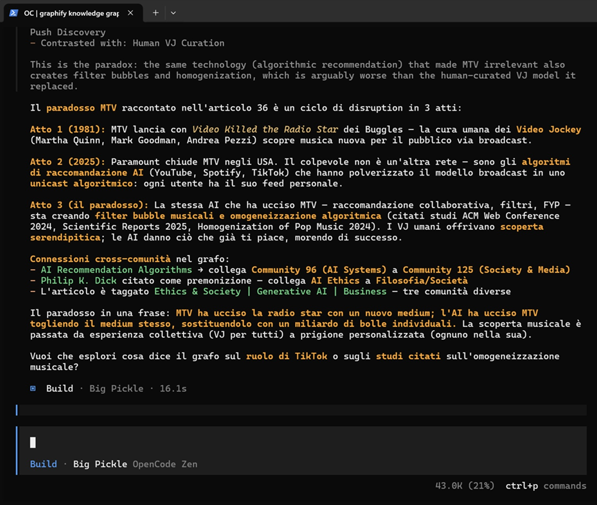
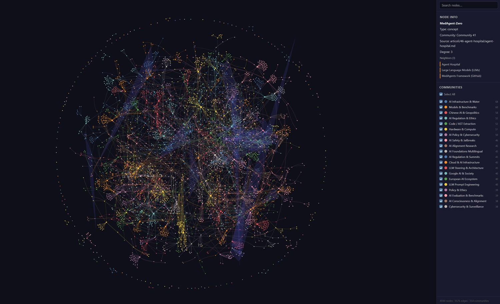
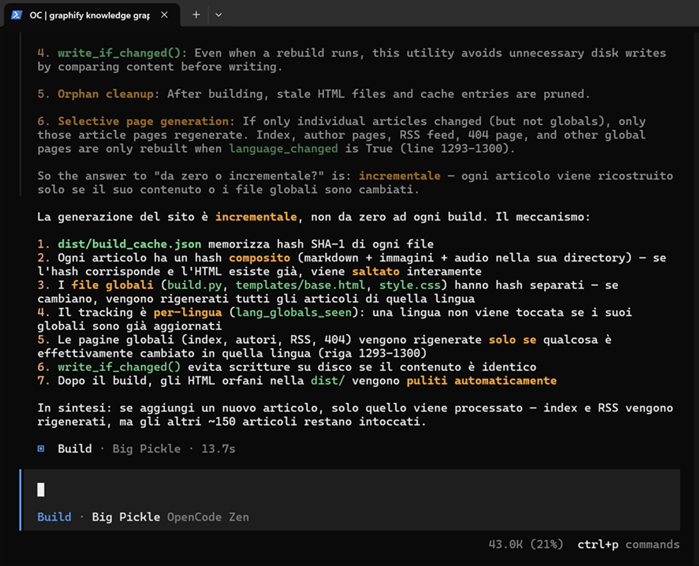

# Graphify et la mémoire que les LLM n'ont pas

*Et si votre assistant IA pouvait cesser de relire tout le projet à chaque fois pour répondre à une seule question ? Graphify, un outil open-source publié sur GitHub avec plus de 50 000 étoiles, promet exactement cela : transformer un dossier de code, documents, PDF, images et vidéos en un graphe de connaissances interrogeable par les agents IA, réduisant radicalement le nombre de tokens consommés à chaque requête.*

Quiconque travaille quotidiennement avec des agents IA sur des projets de taille moyenne connaît bien une frustration spécifique : chaque fois qu'un assistant comme Claude Code, Cursor ou Gemini CLI doit répondre à une question sur le projet, il parcourt l'intégralité de la base de code comme s'il n'avait jamais rien lu. Il relit les fichiers, réanalyse les structures, recommence à zéro. C'est un peu comme l'inspecteur Lunge dans *Monster* de Naoki Urasawa, qui, pour se souvenir de quelque chose, doit à chaque fois reconstruire toute la chaîne déductive depuis le premier indice, incapable de conserver un état intermédiaire entre les sessions.

En avril, dans ces mêmes pages, nous avons analysé en détail [la proposition d'Andrej Karpathy pour une base de connaissances évolutive pour les LLM](https://aitalk.it/it/llm-knowledge-base.html) : construire un wiki structuré en Markdown que le modèle pourrait compiler et interroger, évitant ainsi de recharger tout le corpus dans le contexte à chaque fois. La proposition a recueilli plus de 16 millions de vues sur X, déclenchant un débat technique passionné sur l'architecture de mémoire réellement praticable pour un usage professionnel.

Graphify part exactement de cette intuition, citant explicitement l'approche de Karpathy dans le README comme point de départ, pour ensuite la pousser plus loin : au lieu d'un wiki plat en Markdown, il construit un graphe de connaissances où chaque entité, chaque fonction, chaque concept extrait de vos fichiers devient un nœud, et les relations entre entités deviennent des arcs navigables. La différence n'est pas esthétique, elle est structurelle.

## Qu'est-ce qu'un graphe (et pourquoi cela change tout ici)

Un graphe, dans sa forme la plus simple, est une collection de points reliés par des lignes. Les points s'appellent des nœuds, les lignes s'appellent des arcs. C'est la même structure que celle utilisée par Google Maps pour représenter les rues d'une ville, ou que les réseaux sociaux emploient pour modéliser les relations entre utilisateurs. Ce n'est pas une métaphore : c'est une structure de données dotée de propriétés mathématiques qui la rendent particulièrement adaptée à la représentation de relations complexes.

Pourquoi un graphe est-il plus utile qu'un document Markdown pour un projet logiciel ? La réponse réside dans la nature des relations. Dans un texte, même bien structuré, les connexions entre concepts sont implicites : vous devez lire, comprendre le contexte, inférer les liens. Dans un graphe, les relations sont explicites, typées et traversables. Vous pouvez demander « quel est le chemin le plus court entre le module d'authentification et la base de données ? » et obtenir une réponse en naviguant sur les arcs, sans analyser le texte.

Pour un agent IA qui doit répondre sur un projet, cette différence est substantielle. Au lieu de charger des dizaines de fichiers dans le contexte en espérant que le modèle trouve les connexions pertinentes, l'agent navigue dans le graphe, récupère uniquement les nœuds pertinents et leurs voisins directs, et construit la réponse avec une fraction des tokens. C'est la différence entre demander à quelqu'un de lire une encyclopédie entière pour répondre à une question, ou lui donner un index sémantique avec lequel naviguer directement vers la bonne entrée.

## Trois passes pour tout comprendre

La pipeline interne de Graphify, documentée en détail dans le fichier [how-it-works.md](https://github.com/safishamsi/graphify/blob/v7/docs/how-it-works.md) du dépôt, s'articule en trois phases conçues pour maximiser le traitement local et minimiser les appels aux API externes.

La première passe concerne le code source et est entièrement locale : aucune API, aucun token consommé. Tree-sitter, le parseur AST également utilisé par des éditeurs comme Neovim et Helix pour la coloration syntaxique en temps réel, analyse les fichiers de code et extrait les classes, les fonctions, les importations, les graphes d'appels et les commentaires en ligne. Le résultat est déterministe : le même fichier produit toujours le même résultat. Les fichiers SQL reçoivent un traitement spécial, avec les tables, les vues, les clés étrangères et les relations JOIN extraites selon la même logique déterministe. Au moment du lancement, Graphify déclare supporter 29 langages de programmation.

La deuxième passe couvre les fichiers audio et vidéo, elle aussi locale. Faster-whisper, une implémentation optimisée du modèle Whisper d'OpenAI qui tourne entièrement en local, transcrit les contenus multimédias. Il y a un détail technique raffiné : la transcription est « guidée » par les nœuds les plus connectés du graphe construit lors de la première passe, les fameux « god nodes », les concepts qui apparaissent le plus fréquemment dans les relations extraites du code. Cela permet au modèle de transcription de prêter une attention accrue aux termes de domaine spécifiques au projet. Les transcriptions sont mises en cache : les exécutions ultérieures sautent les fichiers déjà traités.

La troisième passe, celle qui consomme des tokens d'API, gère les documents, les PDF et les images. Ici entre en jeu le modèle de langage configuré par l'utilisateur : Claude, Gemini, OpenAI, ou alternativement une instance locale d'Ollama, ou encore AWS Bedrock via la chaîne de lettres de créance IAM. Les fichiers sont traités en parallèle par plusieurs sous-agents, dont chacun renvoie un fragment JSON structuré avec des nœuds, des arcs et des relations de groupe. Les fragments sont ensuite fusionnés en un seul graphe cohérent.

Le clustering des communautés s'effectue avec l'algorithme de Leiden, une méthode publiée en 2019 dans *Nature Scientific Reports* qui regroupe les nœuds par densité de connexions sans nécessiter d'embeddings vectoriels séparés. Les relations sémantiques extraites par le modèle de langage, par exemple `semantically_similar_to` entre deux concepts affins, sont déjà présentes dans le graphe sous forme d'arcs et influencent directement la forme des communautés détectées. Il n'y a pas de base de données vectorielle séparée : la structure du graphe est le signal de similarité.

Chaque relation est marquée par l'un des trois tags de confiance : `EXTRACTED` pour les relations trouvées directement dans le code source, `INFERRED` pour les inférences du modèle avec un score de 0,55 à 0,95 selon une échelle discrète documentée, et `AMBIGUOUS` pour les cas incertains signalés dans le rapport final pour révision manuelle. Vous savez toujours si le graphe vous dit quelque chose de certain ou d'hypothétique.

*Capture d'écran de mon test sur les données (requête sur le paradoxe de MTV) dans opencode*

## Tout le projet en 7 mégaoctets

J'ai installé Graphify via OpenCode et je l'ai exécuté sur l'ensemble du projet AiTalk : code, articles, images, fichiers audio, toute la base de travail accumulée au fil du temps. Le matériel source pesait environ 970 Mo. La sortie générée, le dossier `graphify-out/` avec ses trois fichiers principaux, occupait un peu plus de 7 Mo.

Trois fichiers : `graph.html`, la visualisation interactive navigable dans n'importe quel navigateur ; `GRAPH_REPORT.md`, le rapport textuel avec les concepts clés, les connexions les plus significatives et les questions suggérées ; et `graph.json`, le graphe complet au format NetworkX node-link, directement interrogeable.

Dès lors, toute question posée à OpenCode sur la structure technique du projet, sur la logique du code, sur le contenu des articles et sur les connexions thématiques entre eux a reçu d'excellentes réponses. Pas génériques, mais contextualisées : l'agent savait quels composants dépendent desquels, quel sujet est traité dans plusieurs articles sous des angles différents, où se trouvaient des connexions non explicites entre des contenus apparemment distants. Le modèle naviguait dans le graphe au lieu de relire les fichiers sources à chaque fois. Là où auparavant une requête complexe nécessitait de charger des dizaines de fichiers dans le contexte, l'agent part désormais du rapport et navigue dans le JSON pour trouver uniquement ce qui est nécessaire.

*Capture d'écran de la page html avec la représentation dynamique et navigable du graphe du projet AiTalk.it*

## Des chiffres honnêtes : 71x, mais cela dépend

Le dépôt publie dans le fichier [how-it-works.md](https://github.com/safishamsi/graphify/blob/v7/docs/how-it-works.md) un benchmark explicite, et il vaut la peine d'être lu avec attention car les chiffres sont présentés avec une honnêteté inhabituelle pour un projet en phase de promotion.

Sur un corpus mixte de 52 fichiers composé des dépôts de Karpathy, de cinq articles académiques et de quatre images, Graphify déclare une réduction de 71,5x des tokens pour chaque requête par rapport à la lecture directe des fichiers bruts. Sur un corpus plus petit, quatre fichiers entre code source et articles, la réduction tombe à 5,4x. Sur six fichiers, environ 1x : aucun avantage notable en termes de tokens, tout au plus une clarté structurelle.

Le schéma est clair et expliqué explicitement : la compression augmente avec la taille du corpus. Six fichiers tiennent déjà dans une seule fenêtre de contexte. À 52 fichiers, les économies s'accumulent rapidement. Chaque dossier `worked/` dans le dépôt contient les fichiers d'entrée originaux et la sortie réelle, afin que chacun puisse reproduire le benchmark en toute autonomie.

Il convient toutefois de préciser ce que ces chiffres n'incluent pas : le coût de l'extraction initiale, le moment où Graphify consomme des tokens d'API pour analyser les documents, les PDF et les images. Ce coût s'amortit sur les requêtes suivantes grâce au cache SHA256 qui saute les fichiers non modifiés, mais c'est un coût réel qui, dans un corpus important, peut être significatif, surtout avec des modèles premium. Le benchmark mesure l'économie en régime stationnaire, pas le coût d'installation. La documentation le dit clairement.

## S'intégrer ou se perdre

L'un des aspects les plus soignés du projet est la compatibilité avec l'écosystème des outils de développement. Pour l'instant, Graphify supporte l'installation directe sur Claude Code, OpenCode, Codex, Cursor, Gemini CLI, GitHub Copilot CLI, VS Code Copilot Chat, Aider et d'autres outils moins répandus.

Le mécanisme d'intégration est simple. Une fois le graphe construit, la commande `graphify claude install` (ou la commande correspondante pour la plateforme choisie) écrit un fichier de configuration qui instruit l'assistant de lire `GRAPH_REPORT.md` avant de répondre. Sur les plateformes supportant les hooks, comme Claude Code, Codex et Gemini CLI, un hook s'active automatiquement avant chaque lecture de fichier : l'assistant navigue dans le graphe au lieu de scanner le répertoire.

Pour les équipes, le workflow recommandé est de committer le dossier `graphify-out/` dans le dépôt Git. Chaque membre qui fait un pull trouve le graphe déjà à jour. La commande `graphify hook install` ajoute un hook post-commit qui reconstruit automatiquement la partie AST après chaque commit, à coût zéro en termes d'API, avec un pilote de fusion Git qui gère les conflits sur `graph.json` en fusionnant les deux graphes au lieu de laisser des marqueurs insolubles.

Le paquet s'appelle `graphifyy` sur PyPI (double y), nécessite Python 3.10+, et s'installe avec `uv tool install graphifyy`, `pipx install graphifyy` ou `pip install graphifyy`. La commande CLI reste `graphify`.

*Capture d'écran de mon test sur le code (requête sur la méthode de génération du site) dans opencode*

## Vie privée : ce qui reste à la maison

La gestion de la vie privée suit une logique explicite. Le code source est traité entièrement en local via tree-sitter, sans aucun appel à des services externes. Les fichiers audio et vidéo sont transcrits localement avec faster-whisper. Aucun octet de code ou de contenu multimédia ne quitte la machine de l'utilisateur.

La situation change pour les documents, les PDF et les images : ceux-ci sont envoyés au modèle de langage configuré via son API. Si l'on utilise Claude, les fichiers sont envoyés à Anthropic. Si l'on utilise Ollama, ils restent en local. Pour les contextes contenant des données sensibles, Graphify propose deux options : une instance Ollama locale ou AWS Bedrock via IAM, sans clés API explicites. Le projet affirme ne pas avoir de télémétrie, de suivi des utilisations ou d'analyse des données.

Un aspect à considérer pour les équipes sur du code propriétaire : même si le code reste local, les documents d'architecture, les PDF de spécifications et les images de maquettes sont traités par le modèle externe configuré. En présence d'obligations de confidentialité contractuelle, cette distinction doit être évaluée avec attention avant l'adoption.

## Des limites sans concessions

Il serait malhonnête de se limiter aux seuls éloges. Certains aspects méritent une évaluation critique.

Le premier concerne la qualité des relations inférées. Les relations étiquetées `INFERRED` dépendent de la qualité du modèle utilisé. Un modèle plus petit ou configuré avec un budget de tokens réduit peut produire des relations spéculatives avec des scores de confiance optimistes. L'échelle de 0,55 à 0,95 est calibrée sur les corpus de test du développeur, pas nécessairement sur le type de projet auquel l'outil est appliqué.

La deuxième limite concerne les mises à jour. Le cache SHA256 saute les fichiers non modifiés, mais que se passe-t-il lorsque l'on déplace une fonction d'un module à un autre ou que l'on refactorise une classe de manière significative ? Le graphe peut avoir des nœuds orphelins ou des relations pointant vers des entités qui n'existent plus. La commande `--update` gère les fichiers modifiés, mais en cas de refactorisation profonde, une reconstruction complète est probablement nécessaire, avec le coût en tokens associé.

Le troisième aspect critique est l'échelle. Comme pour l'approche wiki de Karpathy, le graphe a lui aussi un point de rupture. Pour les corpus très importants, la documentation suggère d'utiliser des requêtes directes sur le `graph.json` ou d'exposer le graphe sous forme de serveur MCP avec `python -m graphify.serve`, qui offre des outils structurés comme `query_graph`, `get_node`, `get_neighbors` et `shortest_path`. La solution est raffinée, mais ajoute une couche de configuration que tous les workflows ne peuvent pas absorber facilement.

Il convient de noter enfin que le projet est maintenu substantiellement par un seul développeur, Safi Shamsi. Le dépôt montre une activité intense, avec 97 releases au moment de l'écriture et la dernière version stable v0.7.16 publiée le 12 mai 2026, mais la durabilité à long terme d'un projet avec cette visibilité et cette dépendance vis-à-vis d'un seul mainteneur est une variable à ne pas ignorer pour ceux qui planifient une adoption dans des environnements critiques.

## L'avenir de la mémoire

Graphify résout un problème concret. Mais la question la plus intéressante qu'il soulève ne concerne pas l'économie de tokens : elle concerne la nature de la mémoire chez les agents IA.

Aujourd'hui, un agent n'a pas de mémoire persistante. Chaque session est une page blanche, chaque projet redécouvert de zéro. Graphify et des projets similaires sont des tentatives de construire une couche externe de mémoire structurée qui survive aux sessions, qui s'accumule au fil du temps, qui représente non seulement les données brutes mais les relations entre elles.

De nombreuses questions restent ouvertes. Comment maintenir la cohérence d'un graphe dans un projet qui évolue rapidement ? Qui est responsable de la qualité des relations inférées lorsqu'un agent prend des décisions basées sur celles-ci ? Et la plus subtile : si l'agent navigue dans un graphe au lieu de raisonner sur les fichiers, la qualité de l'extraction initiale devient le véritable goulot d'étranglement, non contrôlable par un paramètre de température mais par la qualité de la pipeline d'ingestion.

Le site de Graphify Labs laisse entrevoir une vision plus ambitieuse : Penpax, le produit commercial annoncé prochainement en version d'essai, promet d'appliquer la même logique à tout le travail quotidien d'une personne, réunions, e-mails, fichiers et code, en se mettant à jour en arrière-plan, sans cloud, entièrement sur l'appareil. Un « second cerveau » numérique construit sur des bases techniques sérieuses plutôt que sur des métaphores motivationnelles.

Graphify, dans sa forme open-source, est déjà un point de départ significatif. Ce n'est pas la solution ultime au problème de la mémoire des LLM, mais c'est un indicateur précis de la direction recherchée : pas à l'intérieur du modèle, pas dans le contexte, mais dans une représentation structurée et persistante qui vit à l'extérieur des deux.

---

*Graphify est disponible sur [GitHub](https://github.com/safishamsi/graphify) sous licence MIT. Le paquet PyPI s'appelle [graphifyy](https://pypi.org/project/graphifyy/) (double y). Le site du projet est [graphifylabs.ai](https://graphifylabs.ai). La documentation technique sur la pipeline d'extraction se trouve dans [how-it-works.md](https://github.com/safishamsi/graphify/blob/v7/docs/how-it-works.md).*
