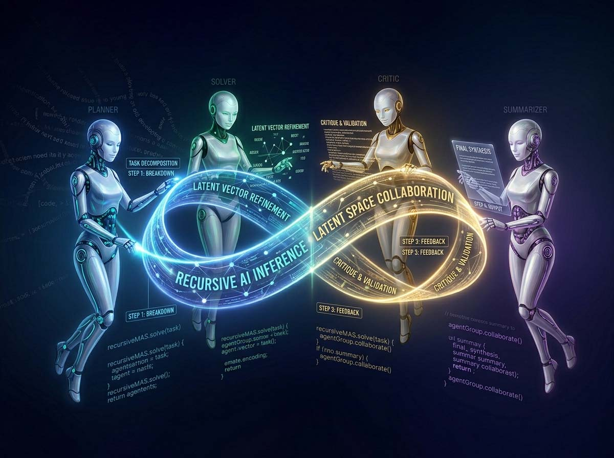
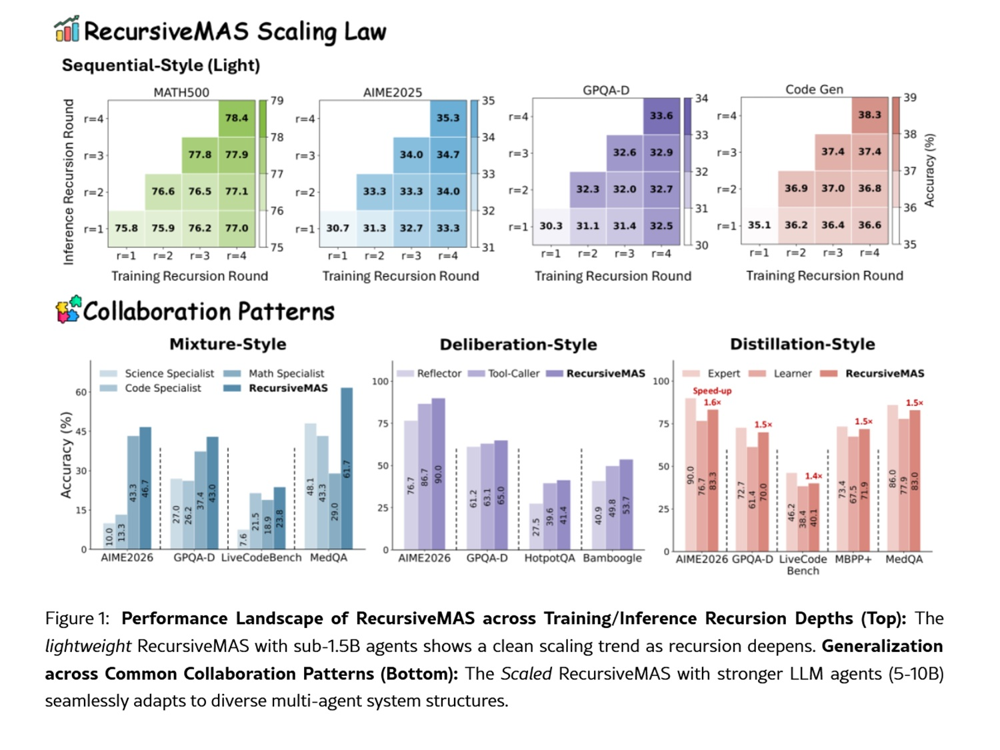
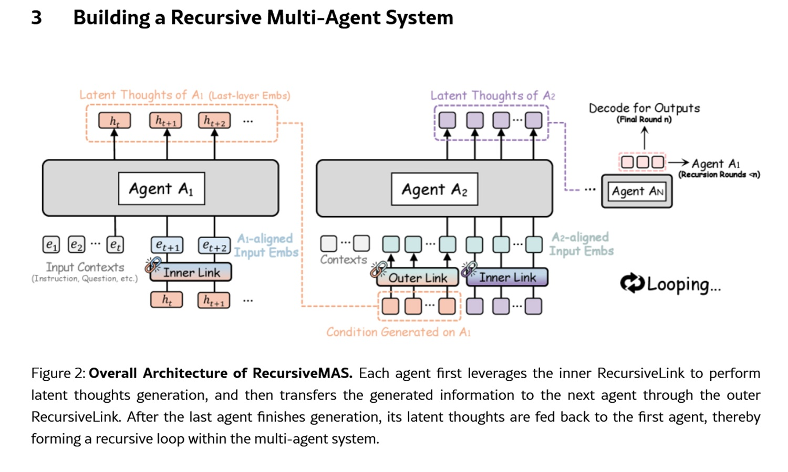

# RecursiveMAS hat Token abgeschafft, Agenten sprechen in ihrer eigenen Sprache 

*Ein am 28. April 2026 von Forschern der UIUC, Stanford, NVIDIA und des MIT veröffentlichtes Paper schlägt einen radikalen architektonischen Wandel vor: KI-Agenten, die zusammenarbeiten, ohne Text auszutauschen, sondern direkt im latent space kommunizieren. Die Zahlen sind überzeugend. Die offenen Fragen umso mehr. Entdecken wir RecursiveMAS, das Framework, das Agenten in ein 'rekursives kollektives Gehirn' verwandelt*.

Stellen Sie sich ein Team von Spezialisten vor, das einen komplexen Fall lösen muss: einen Kardiologen, einen Neurologen, einen Anästhesisten. Jedes Mal, wenn einer von ihnen eine Intuition hat, kann er diese jedoch nicht einfach an den Kollegen weitergeben; er muss sie erst in eine formale E-Mail übersetzen, sie absenden, darauf warten, dass der andere sie liest, sie interpretiert, eine Antwort formuliert, sie schreibt und zurückschickt. Und so weiter, bei jedem Austausch. Das Denken verlangsamt sich, die Kosten steigen, etwas geht bei der Übersetzung verloren.

Dies ist, in einer nützlichen Annäherung, das grundlegende Problem sprachbasierter Multi-Agenten-Systeme. Jeder KI-Agent erhält einen Input in Textform, verarbeitet ihn und produziert einen Text-Output, der als neuer Input an den nächsten Agenten weitergegeben wird. Jeder Schritt erfordert die Dekodierung aus dem Vokabular (eine rechenintensive Operation), Latenz und Token, also Geld. Wenn man die Rekursion hinzufügt, also die Tatsache, dass das System mehrere Runden der Zusammenarbeit durchlaufen muss, um die Antwort zu verfeinern, vervielfacht sich das Problem: In jeder Runde muss jeder Agent alles von vorne dekodieren.

[RecursiveMAS](https://arxiv.org/abs/2604.25917), das Framework, das am 28. April 2026 von einem Team aus zwölf Forschern der UIUC, Stanford, NVIDIA und des MIT vorgestellt wurde, geht von einer scheinbar einfachen Frage aus: Was wäre, wenn Agenten aufhörten, in Text miteinander zu sprechen?

## Rekursion als Systemprinzip

Um die Tragweite des Vorschlags zu verstehen, ist ein Rückblick notwendig. In den letzten Jahren hat sich die Rekursion – die Idee, dieselben Verarbeitungen in "Loops" auf internen Zuständen des Modells laufen zu lassen, um die Argumentation zu vertiefen – als eine der neuen Skalierungsachsen für große Sprachmodelle etabliert. Anstatt immer größere Modelle zu trainieren, kann man ein Modell von angemessener Größe nehmen und es mehrmals über dasselbe Problem iterieren lassen, wobei seine internen Repräsentationen progressiv verfeinert werden. Dieser in der Literatur als *recursive language model* (RLM) bezeichnete Ansatz hat in der Forschung der letzten zwei Jahre vielversprechende Ergebnisse gezeigt.

Der konzeptionelle Sprung von RecursiveMAS besteht darin, dieses Prinzip vom Inneren eines einzelnen Modells auf das gesamte Multi-Agenten-System auszudehnen. Nicht mehr Rekursion innerhalb eines Agenten, sondern Rekursion des Systems als Einheit. Die gesamte Zusammenarbeit zwischen Agenten wird zu einem einzigen rekursiven Loop, in dem Informationen kontinuierlich in Form von latent states, nicht als Text, von einem Agenten zum anderen fließen, und der Kreis schließt sich: Der letzte Agent gibt seinen internen Zustand an den ersten weiter, der so die Verarbeitung mit den in der vorherigen Runde angesammelten Informationen erneut beginnen kann.

Das Ergebnis ist das, was das Paper als ein *rekursives kollektives Gehirn* beschreibt: Jeder Agent fungiert als eine Schicht eines rekursiven Modells, und das gesamte System konvergiert iterativ zu einer Antwort, ohne jemals – außer in der letzten Runde – Zwischentexte zu produzieren.

## RecursiveLink: der leichtgewichtige Interpret

Das heikelste technische Problem ist das der Übersetzung zwischen den Welten. Wie überträgt man in einem heterogenen Multi-Agenten-System, in dem jeder Agent ein anderes Modell mit unterschiedlicher Architektur und unterschiedlicher Größe des verborgenen Raums (*hidden size*) ist, einen latent state von einem Modell zum anderen, ohne ihn in Text umzuwandeln?

Die von RecursiveMAS vorgeschlagene Antwort ist das Modul [RecursiveLink](https://recursivemas.github.io/): eine leichtgewichtige Komponente mit zwei residualen Schichten, die als Interpret zwischen den latent spaces der verschiedenen Modelle fungiert. In seiner internen Variante (*inner link*) operiert es innerhalb jedes einzelnen Agenten während der Generierung: Anstatt den verborgenen Zustand auf das Vokabular zu projizieren, um ein Token zu erzeugen, transformiert es ihn und speist ihn als Input für den nächsten Schritt wieder ein, wobei die Argumentation vollständig im kontinuierlichen Raum verbleibt. In der externen Variante (*outer link*) fügt es eine zusätzliche lineare Schicht hinzu, um den latent state eines Agenten in den dimensionalen Raum des nächsten Agenten zu projizieren, was den Transfer auch zwischen Modellen mit inkompatiblen internen Geometrien ermöglicht.

Die Wahl der residualen Verbindung ist nicht ästhetisch: Die Beibehaltung der ursprünglichen Komponente des latent state bedeutet, dass das Modul nicht die gesamte Projektion von Grund auf neu lernen muss, sondern nur die *Differenz*, die Lücke zwischen dem Quell- und dem Zielraum. Dies macht das Training stabiler und effizienter.

Das Überraschendste ist jedoch die Größe der trainierten Komponente. Während die Basisparameter aller Agenten vollständig eingefroren bleiben, führt der RecursiveLink nur etwa 13 Millionen trainierbare Parameter im gesamten System ein, was 0,31 % der Gesamtparameter entspricht. Um eine Vorstellung von den Proportionen zu geben: Es ist so, als würde man ein Sinfonieorchester optimieren, indem man ausschließlich auf das Verstärkungssystem zwischen den Notenständern einwirkt, ohne ein Instrument zu berühren.

[Bild aus arxiv.org übernommen](https://arxiv.org/html/2604.25917v1)

## Inner Loop, Outer Loop: ein ganzes System trainieren

Die andere strukturelle Innovation des Frameworks betrifft die Trainingsmethode. Ein rekursives Multi-Agenten-System kohärent zu optimieren, ist nicht trivial: Wenn man die Modelle separat trainiert, lernt jedes für sich, sich isoliert gut zu verhalten, aber nicht unbedingt zusammenzuarbeiten. Wenn man hingegen versucht, sie von Anfang an alle gemeinsam zu optimieren, explodiert die Komplexität, und die Gradienten neigen dazu, durch die rekursiven Runden zu verschwinden.

RecursiveMAS schlägt einen Zwei-Phasen-Algorithmus namens *inner-outer loop learning* vor. In der ersten Phase trainiert der Inner Loop parallel und unabhängig den *inner link* jedes Agenten, wobei die Cosine Similarity zwischen den erzeugten latenten Gedanken und der Verteilung der korrekten Token im Embedding-Layer als Ziel verwendet wird. Es handelt sich um einen Warm-Start: Jeder Agent lernt, im latent space zu denken, ohne sich bereits darum zu kümmern, wie er mit den anderen interagieren wird.

In der zweiten Phase optimiert der Outer Loop das gesamte System als Einheit. Das Framework wird für *n* rekursive Runden eingesetzt, und erst am Ende der letzten Runde wird eine Textantwort produziert, anhand derer der Verlust (Loss) berechnet wird. Der Gradient wird dann durch die gesamte rekursive Kette zurückpropagiert (Backpropagation), wobei jedem Outer Link ein gemeinsames Creditsignal basierend auf seinem Beitrag zur finalen Vorhersage zugewiesen wird. Jeder Link lernt also nicht nur aus seinem eigenen lokalen Fehler, sondern aus der Gesamtqualität des gesamten Systems bei jedem einzelnen Beispiel.

Das zentrale Theorem des Papers (Theorem 4.1) zeigt formal, warum dieser Ansatz besser funktioniert als der textbasierte: Die Gradienten, die durch die residualen RecursiveLinks fließen, bleiben über die Runden stabil, während sie im Fall von Text, wo die Projektion auf das Vokabular eine Diskontinuität einführt, mit zunehmender rekursiver Tiefe gegen Null kollabieren. Ein verschwindender Gradient bedeutet ein System, das aufhört zu lernen.

## Die Zahlen: neun Benchmarks, vier Muster

RecursiveMAS wurde auf neun Benchmarks getestet, die Mathematik (MATH500, AIME 2025, AIME 2026), Naturwissenschaften und Medizin (GPQA-Diamond, MedQA), Code-Generierung (LiveCodeBench, MBPP+) und Websuche (HotpotQA, Bamboogle) abdecken. Die beteiligten Modelle umfassen Qwen3/3.5, LLaMA-3, Gemma3 und Mistral in Konfigurationen von weniger als 1,5 Milliarden bis etwa 10 Milliarden Parametern pro Agent.

Die Ergebnisse im Vergleich zu allen Baselines – Einzelagent mit LoRA, Einzelagent mit vollständigem Fine-Tuning, Mixture-of-Agents, TextGrad, LoopLM, Recursive-TextMAS – zeigen eine durchschnittliche Genauigkeitssteigerung von 8,3 Prozentpunkten. Der deutlichste Gewinn verzeichnete sich bei den Benchmarks für dichtes mathematisches Denken: Bei AIME 2025 erreicht die *scaled* Version von RecursiveMAS 86,7 % gegenüber 73,3 % der besten vergleichbaren Baseline. Wichtig ist, dass der Vorteil mit der rekursiven Tiefe wächst: Bei *r* = 1 (eine einzelne Runde) beträgt die durchschnittliche Verbesserung 3,4 Punkte; bei *r* = 3 steigt sie auf 7,2. Textbasierte Systeme neigen im Vergleich dazu dazu, sich bei tieferer Rekursion zu verschlechtern oder zu stabilisieren, ein Zeichen dafür, dass sie in jeder Runde Fehler anhäufen, anstatt sich zu verfeinern.

In puncto Effizienz sind die Daten noch deutlicher. Im Vergleich zu einem gleichwertigen rekursiven Multi-Agenten-System auf Textbasis bietet RecursiveMAS einen Speedup von 1,2× bei *r* = 1 bis zu 2,4× bei *r* = 3, bei einer Reduzierung der verbrauchten Token, die von 34,6 % auf 75,6 % steigt. Die geschätzten Trainingskosten belaufen sich auf 4,27 US-Dollar gegenüber 9,67 US-Dollar für das vollständige Fine-Tuning, und das bei geringerem GPU-Speicherbedarf: 15,29 GB in der Spitze gegenüber den 41,40 GB, die für das vollständige SFT erforderlich sind.

Das Framework wurde auf vier verschiedenen Kooperationsmustern getestet: *Sequential* (Planner, Critic, Solver nacheinander), *Mixture* (parallele Spezialisten, die von einem Summarizer aggregiert werden), *Distillation* (ein größerer Experten-Agent, der einen kleineren Lehrlings-Agenten anleitet) und *Deliberation* (ein interner Reflector gekoppelt mit einem Tool-Caller, der auf Python und Such-APIs zugreift). In allen vier Kontexten übertrifft RecursiveMAS den stärksten Einzelagenten der entsprechenden Konfiguration.

## Wenn Agenten aufhören zu sprechen

Soweit die Zahlen. Aber es gibt eine Frage, die Zahlen nicht lösen können und die etwas Unbequemeres betrifft: Wenn Agenten nicht mehr in natürlicher Sprache miteinander sprechen, wie versteht ein Mensch dann, was passiert?

In traditionellen Multi-Agenten-Systemen ist jeder Textaustausch zwischen Agenten im Prinzip lesbar. Ein Ingenieur kann das Log öffnen, die Konversation zwischen dem Planner und dem Solver durchsehen, verstehen, wo die Argumentation eine falsche Richtung eingeschlagen hat, und intervenieren. Die Textspur ist eine Form impliziter Transparenz: Das System denkt laut, und diese Stimme ist verständlich.

In RecursiveMAS produzieren die Zwischenrunden keinen Text. Die latenten Gedanken, hochdimensionale Vektorrepräsentationen, die über die RecursiveLinks zwischen den Modellen fließen, haben keine natürliche Übersetzung in die menschliche Sprache. Das Paper enthält Analysen der semantischen Verteilungen im latent space über die Runden hinweg, die zeigen, dass die semantische Kohärenz erhalten bleibt und sich relevante Konzepte progressiv kristallisieren, aber dies ist eine technische Beruhigung, kein zugängliches Fenster in die Kognition des Systems.

Der wahre Beitrag von RecursiveMAS, wie eine Analyse auf Towards AI anmerkt, ist die Erweiterung des COCONUT-Stils – kontinuierliches Denken im latent space – über die Agenten hinweg mittels des RecursiveLink-Adapters. Aber COCONUT, das 2024 von Meta vorgestellt wurde, hatte diese Besorgnis bereits im Kontext des Einzelmodells geäußert: Wenn ein System argumentiert, ohne Zwischentexte auszugeben, wird es viel schwieriger, Standardmechanismen der Interpretierbarkeit, Aufmerksamkeitsanalyse, das Probing von Layern oder das vektorielle Steering auf den gesamten Berechnungsfluss anzuwenden.

Die Forschungsgemeinschaft für mechanistische Interpretierbarkeit, die in den letzten Jahren bemerkenswerte Fortschritte beim Verständnis der Informationsverarbeitung einzelner Transformer gemacht hat, steht vor einer neuen Grenze: Systeme, in denen die Analyseeinheiten nicht mehr die Layer eines einzelnen Modells sind, sondern die latenten Übergänge zwischen heterogenen Modellen. Das Paper zu RecursiveMAS geht auf diesen Punkt nicht explizit ein, eine Lücke, die erwähnenswert ist.

Es handelt sich nicht um Alarmismus. Die meisten praktischen Anwendungen dieser Systeme – Code-Generierung, Beantwortung von Fragen, mathematisches Denken – erfordern keine Echtzeit-Transparenz über die Zwischenrunden. Der Punkt ist subtiler: In Deployment-Szenarien mit hohem Risiko oder wenn ein System ein unerwartetes Ergebnis liefert und man verstehen muss, warum, macht das Fehlen einer Textspur das Debugging strukturell schwieriger. Der Preis für die Geschwindigkeit wird teilweise mit der Verständlichkeit bezahlt.

[Bild aus arxiv.org übernommen](https://arxiv.org/html/2604.25917v1)

## Grenzen, Lücken und intellektuelle Ehrlichkeit

Das Paper widmet seinen eigenen Grenzen keinen expliziten Abschnitt, eine in der akademischen Forschung übliche redaktionelle Entscheidung, die es jedoch wert ist, durch eine externe Analyse kompensiert zu werden.

Der erste Punkt ist die Natur der Benchmarks. Alle neun verwendeten Tests sind standardisierte Datensätze, die um Probleme mit verifizierbaren und eindeutigen Antworten herum aufgebaut sind: Gleichungen, Multiple Choice in der Medizin, mathematische Wettbewerbsaufgaben, Code-Generierung, die mit automatischen Tests bewertet wird. Dies sind die Benchmarks, an denen die Gemeinschaft den Fortschritt misst, und sie sind als vergleichender Vergleich sinnvoll. Aber sie sagen nichts darüber aus, wie sich RecursiveMAS bei offenen Aufgaben, dem Verfassen langer Dokumente, der Analyse mehrdeutiger Texte oder der Multi-Step-Planung mit menschlichem Feedback verhalten würde, wo die Qualität der Antwort nicht binär ist und der Prozess genauso zählt wie das Ergebnis.

Der zweite Punkt betrifft externe Werkzeuge. Das Muster *Deliberation* umfasst die Nutzung von Python und Such-APIs, und es ist ermutigend, dass das Framework auch in diesem Kontext standhält. Die Integration mit externen Tools blieb jedoch bewusst einfach: zwei Arten von Tools in einer kontrollierten Konfiguration. Reale Agentensysteme in der Produktion verwalten Dutzende heterogener Tools mit variablen Latenzen, Netzwerkfehlern und unstrukturierten Outputs. Wie verhält sich RecursiveLink, wenn die latente Kette durch einen API-Aufruf unterbrochen wird, der drei Sekunden dauert? Diese Frage ist noch unbeantwortet.

Der dritte Punkt ist die Skalierbarkeit. Die vorgestellten Tests umfassen maximal vier Agenten. Multi-Agenten-Architekturen in der Produktion können leicht Dutzende spezialisierter Agenten erreichen. Die theoretische Komplexität des Systems skaliert linear mit der Anzahl der Agenten *N*, aber die praktische Handhabung der RecursiveLinks zwischen immer vielfältigeren Modellfamilien mit unterschiedlichen hidden sizes, unterschiedlichen Tokenizern und unterschiedlichen Spezialisierungen ist ein nicht triviales technisches Problem, zu dem sich das Paper nicht äußert.

Schließlich gibt es die Frage der Reproduzierbarkeit. Zum Zeitpunkt der Veröffentlichung enthält das [offizielle GitHub-Repository](https://github.com/RecursiveMAS/RecursiveMAS) den Code für die Inferenz und die Demo, markiert jedoch die Veröffentlichung der vollständigen Training-Pipeline und der Trainingsdaten als noch in Arbeit. Die unabhängige Überprüfung der berichteten Ergebnisse – eine wesentliche Praxis in der wissenschaftlichen Gemeinschaft – erfordert daher das Warten auf die Veröffentlichung dieser Assets.

## Ein Wendepunkt, kein Endpunkt

RecursiveMAS ist der erste Beweis dafür, dass Rekursion als architektonisches Prinzip auf Systemebene funktionieren kann, wodurch sich das Gespräch von "Wie optimieren wir jeden einzelnen Agenten?" zu "Wie entwickeln wir das System als einheitliche Entität weiter?" verschiebt. Die Zahlen – +8,3 % durchschnittliche Genauigkeit, bis zu 2,4-mal höhere Geschwindigkeit, drei Viertel eingesparte Token, halbierte Trainingskosten – wurden unter kontrollierten Bedingungen ermittelt und sollten mit dieser Vorsicht gelesen werden, aber sie können nicht ignoriert werden.

Die schwierigsten Fragen bleiben offen: Wie stark skaliert es mit Dutzenden von Agenten? Wie verhält es sich bei realen und mehrdeutigen Aufgaben? Wie bleibt die Verständlichkeit erhalten, wenn die Zwischenrunden unsichtbar werden? Wer KI-Systeme für kritische Umgebungen baut, hat jedes Interesse daran, diese nicht als Implementierungsdetails abzutun.

Eines scheint klar: Die Zukunft von KI-Agenten wird keine lineare Kette von Prompts und Antworten sein. Es wird ein Loop sein. Die Frage ist, wer entscheidet, wie dieser Loop gestaltet wird und mit welchen Garantien für Transparenz über das, was in seinem Inneren geschieht.
