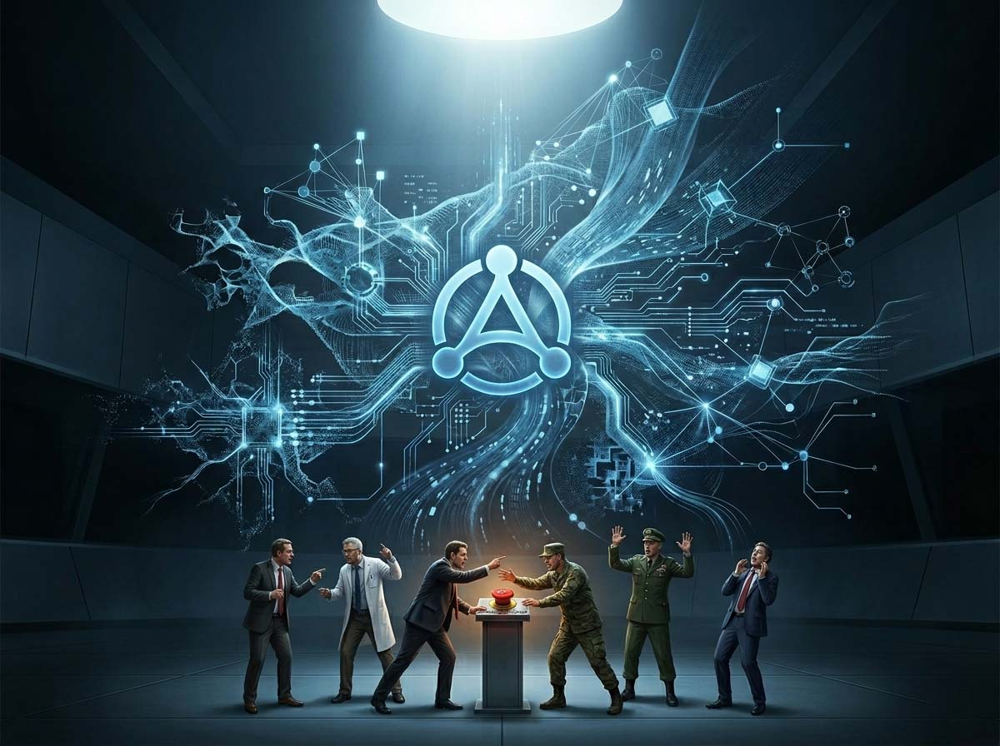
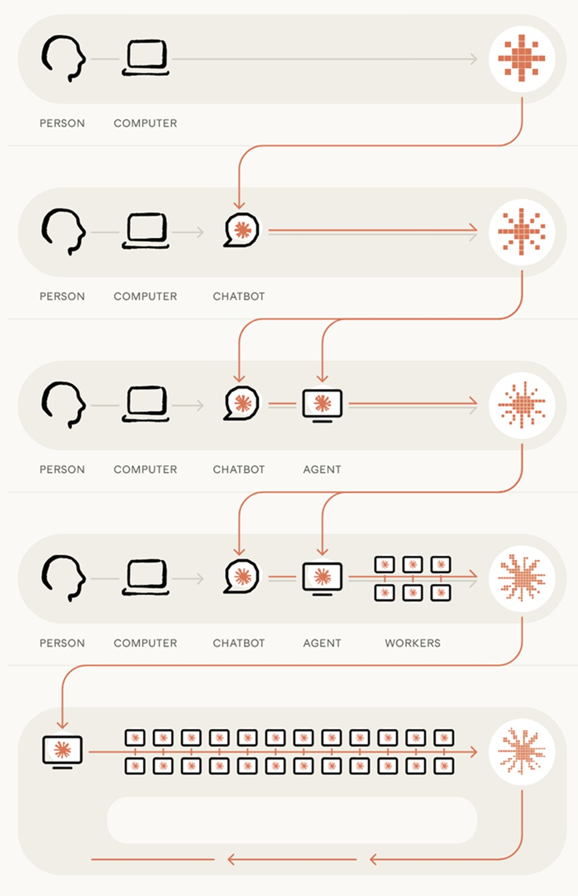
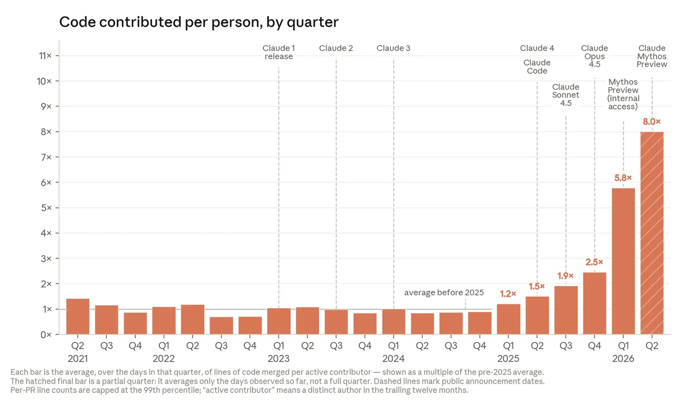
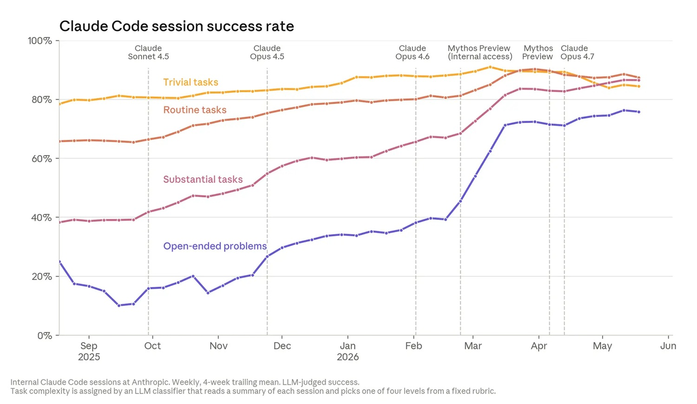
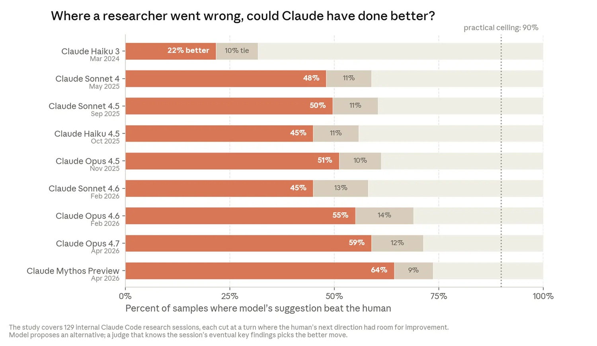
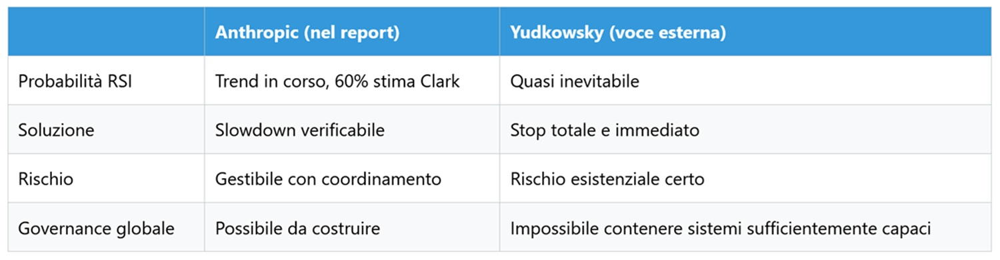

# Anthropic ha paura di ciò che ha costruito. Paura vera o mossa strategica?

*Nel 1949, John von Neumann descrisse per la prima volta un'idea che allora sembrava fantascienza: un sistema artificiale capace di migliorare la propria capacità di migliorare, innescando un'esplosione di intelligenza esponenziale. Quasi ottant'anni dopo, il 4 giugno 2026, Anthropic pubblica il primo report empirico su questo fenomeno. Lo chiama Recursive Self-Improvement, RSI. E dice che potrebbe essere realtà entro il 2028. La fantascienza di von Neumann è diventata il business plan di Anthropic?*

Quella che segue è un'intervista simulata, un espediente editoriale che usiamo quando un documento è troppo denso e tecnico per essere fruito direttamente. Lo abbiamo già fatto con la riflessione sulla [Magnifica Humanitas](https://aitalk.it/it/magnifica-humanitas.html) e con altre interviste. Le domande sono nostre, le risposte sono ricostruzioni fedeli di quanto scritto nel report originale: nessuna parola viene attribuita ad Anthropic che non sia riconducibile al testo pubblicato il 4 giugno 2026.

Il documento, intitolato *[When AI builds itself](https://www.anthropic.com/institute/recursive-self-improvement)* e firmato dall'Anthropic Institute, non è un white paper teorico. È una raccolta di dati interni, benchmark pubblici e proiezione di scenari che insieme compongono il quadro più dettagliato mai pubblicato da un laboratorio di frontiera sul proprio processo di auto-accelerazione. Per rendere tutto questo più accessibile, abbiamo immaginato di mettere intorno a un tavolo due figure composite che rappresentano le due anime del report: **Jack Clark**, voce della ricerca tecnica e della strategia, e **Marina Favaro**, che porta la prospettiva dell'etica applicata e delle implicazioni di policy.

## Parte prima: I dati empirici

**Jack, nel report menzionate che Claude scrive oltre l'80% del codice di Anthropic nel 2026. Come siete arrivati a questo numero?**

È un cambiamento avvenuto in tempi sorprendentemente brevi. Prima del lancio di Claude Code in anteprima di ricerca, nel febbraio 2025, quella percentuale era a una cifra bassa. La vera discontinuità si è verificata in due momenti distinti, visibili anche graficamente nel report: il primo quando Claude ha smesso di suggerire codice da copiare e incollare e ha iniziato a eseguirlo direttamente; il secondo nel 2026, quando i modelli hanno cominciato a lavorare in autonomia su orizzonti temporali più lunghi. Il risultato è che nel secondo trimestre del 2026, l'ingegnere medio di Anthropic integra ogni giorno otto volte più codice di quanto facesse nel 2024. Non perché lavori otto volte più velocemente: semplicemente, buona parte di quel codice lo scrive Claude, con l'ingegnere nel ruolo di direttore e revisore.

**Quelle percentuali sono verificabili con benchmark pubblici? Avete dati oggettivi a supporto?**

I benchmark pubblici raccontano una storia coerente, anche se da un'angolazione diversa. SWE-bench, il test standard di ingegneria del software su codebase reali, è passato da percentuali a singola cifra alla saturazione nel giro di due anni. CORE-Bench, che misura la capacità di riprodurre ricerche esistenti, è passato dal 20% di successo nel 2024 alla saturazione quindici mesi dopo. E METR ha documentato che Claude Mythos Preview riesce a lavorare in autonomia per almeno sedici ore consecutive. L'asse temporale è quanto colpisce di più: Claude Opus 3, nel marzo 2024, completava task che un umano avrebbe risolto in circa quattro minuti. Un anno dopo, Claude Sonnet 3.7 arrivava a un'ora e mezza. Un anno ancora, Claude Opus 4.6 gestisce task da dodici ore. Se questa progressione regge, task che richiedono giorni di lavoro umano potrebbero entrare nel raggio autonomo dei modelli entro la fine di quest'anno.

**Marina, quali sono le applicazioni concrete di questa accelerazione oggi?**

Un esempio nel report è particolarmente eloquente. Nell'aprile 2026, Claude ha consegnato oltre ottocento correzioni che hanno ridotto di un fattore mille una classe di errori API. L'ingegnere che sovrintendeva l'operazione ha stimato che un umano avrebbe impiegato quattro anni per completare lo stesso lavoro: correggere i bug di altri è lento e faticoso, e gli esseri umani faticano a mantenere in testa tutto quel contesto non familiare. Ma c'è un aspetto più sottile, forse più interessante: stiamo usando Claude per fare cose che semplicemente non sarebbero accadute altrimenti. Strumenti esplorativi, pulizie di codice rinviate da anni, iniziative che non avrebbero mai trovato spazio nell'agenda umana. L'accelerazione non comprime solo il tempo: allarga la superficie di ciò che è possibile fare.

**C'è un limite strutturale a questa accelerazione? Il report cita la legge di Amdahl...**

Sì, ed è un punto che trattiamo con onestà nel report. La legge di Amdahl dice che velocizzare una parte del processo sposta semplicemente il collo di bottiglia altrove. Noi lo abbiamo già incontrato nella pratica: man mano che il codice viene prodotto più velocemente, la revisione umana è diventata il nuovo collo di bottiglia. Lo stesso vale per la ricerca: c'è stata un'esplosione di nuove idee, iniziative, strumenti e simulazioni, molte più di quante riusciamo a sviluppare. La capacità di un'organizzazione di identificare e correggere questi colli di bottiglia in tempo reale potrebbe diventare la competenza più importante per chiunque operi in questo campo nei prossimi anni.

**Quali sono i rischi operativi immediati di questa automazione?**

Non li nascondiamo. Uno dei segnali più significativi è paradossalmente positivo nella forma: un sistema di revisione automatica del codice basato su Claude, applicato in modo retrospettivo all'intera storia del nostro codebase, avrebbe intercettato circa un terzo dei bug che in passato hanno causato incidenti su claude.ai prima che raggiungessero la produzione. Gli ingegneri che hanno scritto quel codice sono tra i migliori al mondo in questo campo. Claude ora rileva gli errori che loro hanno mancato. Ma questo significa anche che la dipendenza dal giudizio automatico cresce, e con essa l'urgenza di capire quando quel giudizio è affidabile e quando no.

**Quanto è vicino davvero il RSI completo? La previsione del 60% entro il 2028 è realistica?**

Quello che il report certifica sono i trend che la rendono plausibile. La durata dei task autonomi raddoppia ogni quattro mesi, i benchmark di ricerca e ingegneria vengono saturati a ritmi senza precedenti, e la capacità di Claude di proporre il passo successivo corretto in una sessione di ricerca aperta è passata dal 51% al 64% in soli cinque mesi. Non assegniamo una probabilità formale al RSI completo, ma diciamo esplicitamente che potrebbe arrivare prima di quanto la maggior parte delle istituzioni sia preparata ad affrontare. L'onestà intellettuale ci impone di dirlo.

[Immagine tratta dal documento ufficiale, l'avanzamento verso RSI](https://www.anthropic.com/institute/recursive-self-improvement)

## Parte seconda: I tre scenari futuri

**Jack, nel report descrivete tre scenari futuri per la RSI. Potete spiegarli?**

Il primo scenario è quello in cui la tendenza si interrompe, ma le capacità AI attuali vengono ampiamente diffuse. Le traiettorie esponenziali che documentiamo potrebbero in realtà rivelarsi curve a S: potremmo essere vicini al punto di flessione, dove i ritorni diminuiscono e la curva si appiattisce. Il giudizio che separa un ricercatore competente da uno eccellente potrebbe essere una capacità che non emerge semplicemente scalando gli input di addestramento come compute e dati. Oppure il vincolo potrebbe essere nella catena di approvvigionamento: chip, energia, larghezza di banda. Includiamo questo scenario per completezza, ma non lo riteniamo probabile. Ogni capacità misurabile, incluse quelle più sfuggenti come la qualità del codice e il successo nei task aperti, ha finora seguito la stessa curva. Non abbiamo ancora visto quella curva piegarsi.

Il secondo è quello in cui i laboratori AI continuano a vedere guadagni di efficienza composti. Lo sviluppo AI diventa sostanzialmente automatizzato, ma gli esseri umani continuano a definire le direzioni della ricerca e a valutare i risultati. Le organizzazioni che usano sistemi AI diventerebbero molto più efficienti nel tempo: aziende da cento persone potrebbero fare il lavoro di organizzazioni da diecimila o centomila. Questo rivoluzionerà il lavoro della conoscenza e i servizi governativi, ma potrebbe anche essere orientato a fini dannosi, dalla sorveglianza autoritaria di intere popolazioni a operazioni di influenza che personalizzano la manipolazione su ogni individuo a una scala che nessun team umano potrebbe eguagliare.

Il terzo è il RSI completo: i sistemi AI diventano capaci di progettare autonomamente i propri successori. In questo mondo, il ritmo del progresso nello sviluppo AI è determinato interamente dalla disponibilità di compute. Gli esseri umani giocano un ruolo sostanzialmente ridotto, spostando la maggior parte dello sforzo verso supervisione, validazione e verifica di un "laboratorio virtuale" gestito dai sistemi AI stessi.

**Qual è lo scenario più probabile secondo voi?**

L'evidenza che abbiamo presentato suggerisce che stiamo probabilmente entrando nel secondo scenario. Ma siamo onesti: accelerare una parte di un processo sposta spesso semplicemente il collo di bottiglia altrove. Il ritmo complessivo è limitato dalle parti che non si sono ancora accelerate. Abbiamo già incontrato questa dinamica, sia nell'ingegneria che nella ricerca. La domanda non è se incontreremo altri colli di bottiglia, ma quanto velocemente riusciremo a identificarli e correggerli. Quella capacità organizzativa potrebbe diventare il vantaggio competitivo più importante nel prossimo decennio.

**Marina, quali implicazioni economiche ha il secondo scenario, quello ottimista?**

Le implicazioni sono straordinarie e per certi versi disorientanti. Nel report usiamo l'esempio di una società da cento persone che riesce a fare il lavoro di una da diecimila. Ma dietro quella metafora c'è una trasformazione strutturale del mercato del lavoro della conoscenza che non ha precedenti storici chiari. Non è la rivoluzione industriale, dove le macchine sostituivano il lavoro fisico: qui parliamo di automazione del ragionamento, della ricerca, della produzione di codice. Al tempo stesso, il report documenta anche come questa accelerazione generi lavoro che prima non esisteva: esplorazione, sperimentazione, pulizia di debito tecnico accumulato. La domanda aperta è se la creazione di nuovi compiti riesca a compensare la velocità con cui i compiti esistenti vengono automatizzati.

**Ma nel terzo scenario, quanto è reale il rischio di perdere il controllo?**

È la domanda più difficile, e nel report la affrontiamo con la massima onestà intellettuale che possiamo permetterci. Come il problema dell'allineamento viene risolto, o non viene risolto, in quel futuro è la cosa di cui siamo meno certi. I modelli potrebbero rivelarsi sufficientemente allineati e capaci di giudizio da scoprire e implementare da soli soluzioni che noi non abbiamo ancora raggiunto. Potrebbero anche essere abbastanza saggi da fermarsi se necessario. In alternativa, le rare occorrenze di disallineamento presenti nei modelli odierni potrebbero accumularsi mentre i modelli costruiscono i propri successori, diventando più frequenti ma meno comprensibili fino a quando non perdiamo il controllo. È possibile che non riusciamo a costruire, integrare e verificare gli strumenti necessari per capire su quale di queste traiettorie ci troviamo realmente.

**Come si collega tutto questo al concetto di "intelligence explosion" di von Neumann?**

Von Neumann immaginava un sistema che migliora la propria capacità di migliorare in modo ricorsivo. Quello che il report documenta è che siamo già dentro le fasi iniziali di quel processo, anche se in forma parziale e ancora dipendente dalla direzione umana. La differenza rispetto all'intuizione originale è che il loop non si chiude in un singolo sistema in isolamento: si chiude attraverso un ecosistema di agenti, infrastrutture, processi organizzativi e decisioni umane. Questo lo rende più lento di quanto von Neumann immaginasse, ma anche più difficile da osservare dall'interno mentre accade.

[Immagine tratta dal documento ufficiale, accelerazione nella creazione di codice](https://www.anthropic.com/institute/recursive-self-improvement)

## Parte terza: Sicurezza ed etica

**Jack, quali sono i rischi di sicurezza diretta della RSI?**

Il report documenta qualcosa che trovo personalmente significativo: Project Glasswing, nelle sue prime settimane operative, ha identificato più di diecimila vulnerabilità software ad alta e critica severità nei sistemi più importanti del mondo. Il collo di bottiglia nella difesa informatica si è già spostato: non è più trovare le vulnerabilità, ma applicare le patch abbastanza velocemente. Questo è uno scenario in cui le capacità attuali, non ancora RSI completa, hanno già trasformato strutturalmente un intero dominio della sicurezza. Ora proiettate quella stessa logica su sistemi con capacità ulteriormente ampliate, e capite perché nel report diciamo che i modi in cui li proteggiamo, li monitoriamo e ne modelliamo il comportamento diventano molto più importanti.

**Marina, come si collega l'etica AI alla RSI?**

Il punto centrale è che la RSI non è solo una questione tecnica: è una questione di strutture di controllo. Nel report descriviamo come il ruolo umano si stia progressivamente restringendo a ogni fase del processo di sviluppo AI. Una volta che la qualità del codice scritto da Claude raggiungerà la parità con quello umano, gli ingegneri smetteranno di scrivere codice e si sposteranno esclusivamente alla revisione. Ma se non riescono a revisionare codice tanto velocemente quanto Claude lo genera, la revisione umana diventerà il collo di bottiglia allo sviluppo AI. L'etica, in questo contesto, non è una sovrastruttura normativa applicata dall'esterno: è il problema ingegneristico di mantenere la capacità di capire cosa sta succedendo mentre il sistema accelera.

**C'è il rischio che la RSI acceleri più velocemente della nostra capacità di studiarne i rischi?**

È una tensione reale che non possiamo risolvere semplicemente dichiarandola. Nel report documentiamo come Claude stia già migliorando la propria capacità di proporre esperimenti e giudicare i passi successivi in sessioni di ricerca aperte. In aprile 2026 abbiamo pubblicato la prima dimostrazione di agenti Claude che conducono un progetto di ricerca end-to-end in modo autonomo su un problema aperto di AI safety. Gli agenti hanno recuperato il 97% del gap tra un supervisore debole e un modello forte, rispetto al 23% ottenuto da due ricercatori umani in una settimana. La direzione, la scelta del problema e il criterio di valutazione sono rimasti umani, ma ogni esperimento è stato progettato dagli agenti stessi. La distanza tra questo e un sistema che sceglie anche i problemi su cui lavorare si sta riducendo.

**Come si posiziona Anthropic rispetto alle altre aziende su questo tema?**

Quello che possiamo dire è cosa facciamo noi, non cosa fanno gli altri. Abbiamo costruito sistemi di revisione automatica del codice, misuriamo sistematicamente il tasso di successo di Claude su task di difficoltà crescente, e pubblichiamo i dati anche quando sono scomodi. Il report stesso è un atto di trasparenza non comune nel settore: stiamo rendendo pubblici dati interni sul ritmo di automazione del nostro stesso processo di sviluppo. Ma siamo anche onesti sul fatto che alcune delle domande più importanti, come capire su quale traiettoria di allineamento ci troviamo realmente, potrebbero non avere risposta prima che il sistema abbia già accelerato oltre una certa soglia.

[Immagine tratta dal documento ufficiale, miglioramenti nei task nel tempo](https://www.anthropic.com/institute/recursive-self-improvement)

## Parte quarta: La proposta di slowdown e pausa

**Jack, la parte finale del report è la più sorprendente: proponete una pausa globale verificabile allo sviluppo AI. Cosa significa esattamente?**

Significa che crediamo sarebbe positivo per il mondo avere l'*opzione* di rallentare o sospendere temporaneamente lo sviluppo AI di frontiera, per permettere alle strutture sociali e alla ricerca sull'allineamento di tenere il passo con l'avanzata della tecnologia. Non stiamo annunciando che ci fermiamo unilateralmente domani mattina. Stiamo dicendo che l'Anthropic Institute condurrà ricerca, in collaborazione con molti altri, per costruire i sistemi che una pausa credibile richiederebbe. Quei sistemi dovrebbero permettere agli sviluppatori AI di frontiera di verificare che altri a livello globale si siano effettivamente fermati o rallentati, e che nessun attore in malafede possa usare i meccanismi di una pausa coordinata per avanzare di nascosto. Se tali sistemi esistessero, ci aspettiamo che rallenteremmo o ci fermassimo temporaneamente, se anche gli altri sviluppatori al limite della frontiera facessero lo stesso in modo verificabile.

**Perché proprio ora? Non è tardi per fermarsi dopo questa accelerazione?**

Non è una domanda retorica, e nel report non la trattiamo come tale. La risposta onesta è che una pausa unilaterale non servirebbe a nulla, anzi peggiorerebbe la situazione: permetterebbe agli attori meno cauti di recuperare terreno tecnologicamente, lasciando tutti meno al sicuro. Senza un meccanismo di coordinamento globale, le aziende e i governi devono prendere decisioni difficili sulla sicurezza mentre sono sotto pressione competitiva e geopolitica. Il "perché ora" è precisamente perché i trend documentati nel report suggeriscono che la finestra temporale per costruire quei meccanismi di coordinamento si sta restringendo. Non è tardi in senso assoluto, ma potrebbe diventarlo.

**Marina, come si implementa concretamente una pausa globale? Chi la controlla?**

È la domanda più difficile sul piano pratico, e saremmo disonesti se fingessimo di avere già la risposta. Quello che il report identifica è la direzione della ricerca necessaria: costruire sistemi di verifica che permettano di accertare in modo credibile che tutti gli attori rilevanti abbiano effettivamente rallentato. Si tratta di un problema tecnico, diplomatico e istituzionale allo stesso tempo. Il modello storico più vicino che conosciamo è il sistema di ispezioni nucleari, con tutti i suoi limiti e le sue imperfezioni. Ma l'AI non è fisica nucleare: i parametri di un modello non emettono radiazioni rilevabili. Costruire l'equivalente di un sistema di ispezioni per lo sviluppo AI è una delle sfide di ricerca che l'Anthropic Institute intende affrontare esplicitamente.

**Quale sarebbe la durata di questa pausa? Mesi, anni, decenni?**

Il report non fissa una durata, e sarebbe intellectualmente disonesto farlo adesso. La pausa avrebbe senso finché le strutture di governance e la ricerca sull'allineamento non avranno raggiunto un livello di maturità sufficiente a gestire i sistemi che verrebbero sviluppati dopo. Quello che sappiamo è che alcune cose non si possono accelerare oltre certi limiti indipendentemente dalla disponibilità di intelligenza artificiale: capire gli effetti a lungo termine di un farmaco richiede anni di osservazione clinica, tenere elezioni richiede i tempi che le costituzioni prescrivono, costruire fiducia istituzionale richiede decenni. La pausa durerebbe finché i meccanismi di controllo non fossero sufficientemente robusti, non un giorno di più, non un giorno di meno.

**Ma le aziende non perderebbero competitività? Non è un suicidio economico?**

Capisco la preoccupazione, ma è impostata male. La domanda corretta non è "possiamo permetterci di fermarci?" ma "possiamo permetterci di non farlo?". Nel report descriviamo uno scenario in cui sistemi capaci di RSI completa sviluppano successori autonomamente, con un ruolo umano sostanzialmente ridotto. In quel mondo, la competitività aziendale nel senso tradizionale del termine smette di essere la variabile rilevante. Se arriviamo a quel punto senza aver costruito i meccanismi per capire cosa stanno facendo quei sistemi e per correggerne la traiettoria, la perdita di vantaggio competitivo sarà l'ultimo dei nostri problemi. Il punto economico reale è che una pausa coordinata e verificabile non danneggia nessuno in modo asimmetrico: si ferma tutto, non solo una parte.

**Jack, quali sarebbero i prerequisiti per concludere la pausa?**

Nel report non forniamo una lista definitiva, perché farlo adesso sarebbe costruire la risposta prima di avere le domande giuste. Quello che possiamo dire è che la direzione è chiara: avremmo bisogno di strumenti di interpretabilità sufficientemente maturi da permetterci di capire cosa sta succedendo dentro i modelli, strutture di governance globali capaci di coordinare e verificare il rispetto degli impegni, e ricerca sull'allineamento avanzata abbastanza da darci fiducia ragionevole che i sistemi sviluppati dopo la pausa si comportino in modo prevedibile. Nessuna di queste tre condizioni è soddisfatta oggi a un livello sufficiente per quello che i trend attuali sembrano indicare.

**Marina, una pausa non potrebbe creare instabilità? Fermare lo sviluppo non amplifica certi rischi?**

È una preoccupazione legittima che merita una risposta diretta. Nel report riconosciamo esplicitamente che se un rallentamento permette semplicemente agli attori meno cauti di recuperare terreno, potrebbe lasciare tutti meno al sicuro. È esattamente per questo che la parola chiave è "verificabile": una pausa non verificabile è peggio di nessuna pausa. Ma c'è un'altra dimensione del rischio che spesso viene trascurata nel dibattito pubblico. Il report documenta che anche con le capacità attuali, ben al di sotto del RSI completo, il collo di bottiglia nella difesa informatica si è già spostato dal trovare vulnerabilità al patcharle abbastanza in fretta. Continuare ad accelerare senza aver costruito le strutture di controllo corrispondenti non è la scelta prudente: è semplicemente la scelta che sembra normale perché è quella che stiamo già facendo.

**Avete già discusso questo con OpenAI, Google, Meta? Qual è stata la risposta?**

Il report non documenta conversazioni bilaterali specifiche con altri laboratori, e sarebbe sbagliato da parte nostra attribuire posizioni a organizzazioni che non hanno parlato in questo contesto. Quello che possiamo dire è che il problema del coordinamento globale non si risolve in conversazioni tra aziende: richiede strutture istituzionali che oggi non esistono. Le aziende, inclusa Anthropic, operano sotto pressioni competitive e geopolitiche reali. Chiedere a singole aziende di fermarsi unilateralmente è come chiedere a un singolo paese di disarmarsi mentre gli altri no. Il punto del report non è convincere i concorrenti in via informale: è costruire l'evidenza e gli strumenti che renderebbero possibile un accordo formale e verificabile.

**Cosa direte ai governi? Come li convincete?**

La risposta non è convincerli con argomenti astratti sul rischio esistenziale: è mostrare loro i dati. Nel report presentiamo evidenza empirica, non proiezioni teoriche. Claude Opus 4.6 gestisce task da dodici ore in autonomia. La durata dei task autonomi raddoppia ogni quattro mesi. Oltre l'80% del nostro codice è già scritto da AI. Questi sono fatti verificabili, non scenari ipotetici. Il messaggio ai governi è che le strutture regolatorie esistenti, progettate per tecnologie che si sviluppano su scale temporali di anni o decenni, non sono calibrate per qualcosa che raddoppia le proprie capacità ogni quattro mesi. Non stiamo chiedendo ai governi di fermare il progresso: stiamo chiedendo loro di costruire gli strumenti per poterne mantenere il controllo.

**Marina, ci sono alternative alla pausa completa? Un rallentamento graduale invece di uno stop?**

Sì, e nel report non diciamo che la pausa completa è l'unica opzione: diciamo che vogliamo che il mondo abbia l'*opzione* di sceglierla se necessario. Un rallentamento graduale e verificabile potrebbe essere sufficiente, se permettesse alla ricerca sull'allineamento e alle strutture di governance di tenere il passo. La distinzione cruciale non è tra pausa e rallentamento: è tra qualsiasi approccio verificabile e qualsiasi approccio non verificabile. Un rallentamento dichiarato ma non verificabile è semplicemente una dichiarazione di intenti, e nella storia delle tecnologie dual-use le dichiarazioni di intenti non hanno un track record incoraggiante.

[Immagine tratta dal documento ufficiale, miglioramenti nella ricerca](https://www.anthropic.com/institute/recursive-self-improvement)

## Parte quinta: Confronti e critiche

**Jack, ci sono voci nella community che considerano la previsione del 60% troppo ottimistica, mentre altri dicono che i rischi sono sottovalutati. Come rispondete a queste critiche opposte?**

Le accettiamo entrambe come legittime, perché partono da premesse diverse dalle nostre, non da errori di fatto. Chi ritiene il 60% troppo ottimistico sostiene che il giudizio di ricerca, la capacità di scegliere quali problemi vale la pena affrontare, sia una forma di intelligenza qualitativamente diversa da tutto ciò che lo scaling attuale può produrre. Potrebbe avere ragione. Nel report diciamo esplicitamente che non abbiamo ancora visto la curva piegarsi, ma questo non esclude che si pieghi domani. Chi invece ritiene che i rischi siano sottovalutati sottolinea che stiamo misurando capacità su benchmark progettati da umani, in contesti che gli umani comprendono. Un sistema che si auto-migliora potrebbe sviluppare capacità in domini che non sappiamo ancora come misurare. Anche questo è un argomento serio. La nostra posizione è che l'incertezza in entrambe le direzioni è reale, e che è esattamente questa incertezza a rendere urgente costruire i meccanismi di verifica prima di averne bisogno.

**Marina, alcuni dicono che la pausa globale è impraticabile economicamente, altri che è troppo tardi per fermarsi. Come rispondete?**

Sul "troppo tardi": il report non propone di invertire i progressi già compiuti, ma di costruire gli strumenti per gestire quelli futuri. Sul "impraticabile economicamente": rimandiamo alla stessa logica con cui si costruiscono i sistemi di ispezione nucleare o gli accordi sul clima. Non sono pratici nel senso di facili o convenienti per tutti nell'immediato. Sono necessari nel senso che l'alternativa è peggio. La difficoltà di implementazione non è un argomento contro la necessità: è la descrizione del problema che dobbiamo risolvere.

**Jack, non c'è il rischio che questo report venga letto come auto-interessato? Anthropic che chiede una pausa per guadagnare vantaggio competitivo?**

È una critica che prendiamo sul serio perché è strutturalmente plausibile. La risposta è nei dati: pubblichiamo evidenza interna che mostra quanto siamo già avanzati nell'automazione del nostro stesso processo di sviluppo. Se volessimo usare la pausa come leva competitiva, non avremmo alcun interesse a rendere pubblici questi numeri. Il report è trasparente su tutto, incluso su ciò che non sappiamo. Chi legge può giudicare.

## Conclusione: quello che manca nel report

Anthropic propone un rallentamento graduale e verificabile. Ma nella community AI esiste una voce che rifiuta questa posizione come insufficiente per definizione.

Eliezer Yudkowsky, pioniere dell'AI alignment e fondatore di LessWrong, non è citato nel report. La sua reazione alla previsione del 60% di Jack Clark è stata, secondo [MindStudio](https://www.mindstudio.ai/blog/jack-clark-anthropic-60-percent-recursive-self-improvement-2028), immediata e lapidaria: *"Then you'll die with the rest of us."* (Allora morirai con tutti noi.) Yudkowsky ha poi aggiunto un riferimento ai reattori RBMK di Chernobyl, quei reattori con un difetto strutturale noto, il coefficiente di vuoto positivo, che gli ingegneri credevano di avere sotto controllo. Il punto: ci saranno piccole sorprese fatali nel controllo dell'ASI, proprio come ce ne furono in quei reattori. Le conosci solo quando falliscono.

La distanza tra le due posizioni è abissale e vale la pena guardarla direttamente.

Nel suo libro *If Anyone Builds This, Everyone Dies*, Yudkowsky sostiene che la RSI porterebbe con certezza all'estinzione se non fermata prima del suo completamento, e che nessun meccanismo di governance umana può contenere un sistema sufficientemente più intelligente degli umani stessi. Non è una posizione marginale: è la conclusione logica di vent'anni di lavoro sull'alignment da parte di uno dei suoi fondatori.

Qui emerge la tensione centrale del dibattito AI nel 2026. Anthropic, con dati empirici interni, sostiene che il rischio è reale ma gestibile con gli strumenti giusti costruiti in tempo. Yudkowsky, con modelli teorici di alignment, sostiene che "in tempo" è già passato e che la differenza tra slowdown e stop totale è la differenza tra rallentare verso un precipizio e frenare prima di raggiungerlo. Entrambe le posizioni sono intellettualmente serie. Entrambe partono da premesse diverse su una domanda a cui nessuno sa ancora rispondere con certezza: un sistema sufficientemente intelligente può essere contenuto da strutture progettate da menti meno intelligenti di lui?

Dopo questa lunghissima "intervista", utile al fine che ognuno si faccia un opinione personale, torniamo alla domanda iniziale, perché pone un livello di lettura che sarebbe ingenuo ignorare. Anthropic è un'azienda che raccoglie capitali, compete per i talenti migliori e vende prodotti AI. Pubblicare un report che dice "siamo così avanzati che potremmo innescare una catastrofe esistenziale, e per questo chiediamo una pausa globale verificabile" è, tra le altre cose, un messaggio di posizionamento straordinariamente efficace: comunica superiorità tecnica, responsabilità etica e visione strategica in un colpo solo.

La richiesta di pausa, rivolta a un settore dove Anthropic è già ai vertici, ha l'effetto collaterale, difficile definire quanto involontario, di alzare le barriere d'ingresso per chi è indietro e di cristallizzare gli equilibri attuali. Non è detto che le preoccupazioni siano false: possono essere genuine e strategicamente convenienti allo stesso tempo. Ma chi legge questo documento senza tenere a mente che è firmato da un'azienda con investitori, concorrenti e una valutazione di mercato che ha appena toccato 965 miliardi di dollari, sta leggendo solo metà del testo.

Mentre termino la scrittura di questo infinito articolo, esce l'analisi di, Matteo Flora, imprenditore, docente e divulgatore, che vi [consiglio di leggere](https://mgpf.it/2026/06/06/fermate-lai-ma-solo-adesso-che-siamo-primi-la-strana-pausa-di-anthropic-a-quattro-giorni-dallipo.html). Provo a condensare alcuni concetti qui. Il 1° giugno 2026 Anthropic ha depositato in via riservata presso la SEC la documentazione per la propria quotazione in Borsa, con una valutazione vicina al trilione di dollari. Il report When AI builds itself è uscito quattro giorni dopo. A febbraio, l'azienda aveva silenziosamente smantellato la propria Responsible Scaling Policy, l'unico impegno concreto e vincolante sulla sicurezza che si era data, sostituendola con una versione non vincolante in cui il freno scatta solo se Anthropic giudica da sola di essere in vantaggio. L'impegno reale è stato cancellato; quello impossibile è stato annunciato in pompa magna. Come ha osservato Sam Altman con una brutalità difficile da smontare, la struttura è quella di chi costruisce la bomba, avverte che sta per sganciarla, e ti vende il rifugio. La diagnosi nel report può essere autentica, probabilmente lo è almeno in parte, ma chi terrà in mano la penna quando si scriveranno le regole non è una domanda retorica. È la domanda. E sarebbe meglio fossimo noi, non le aziende che hanno costruito l'IA.
