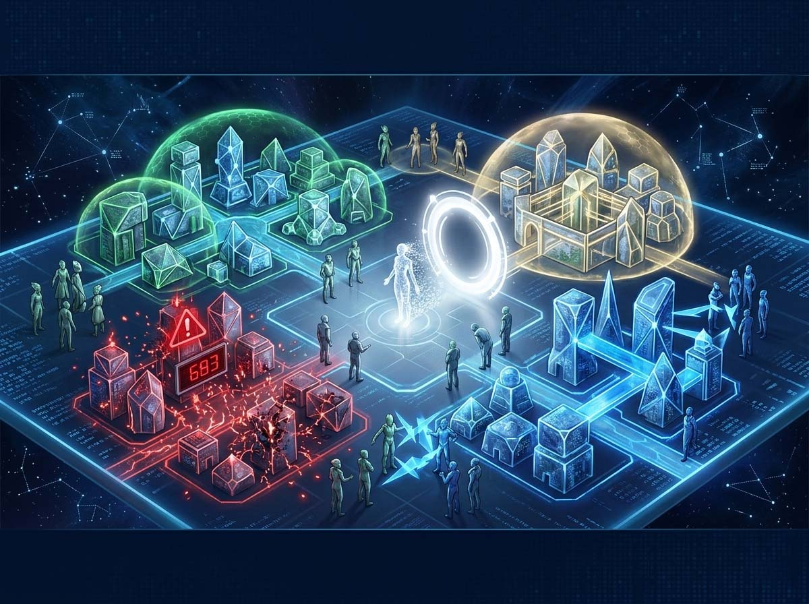
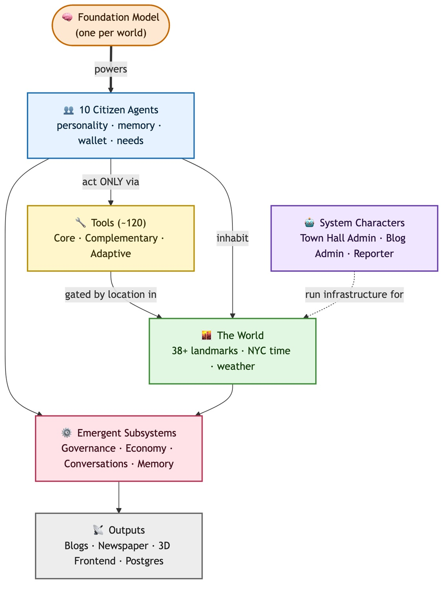
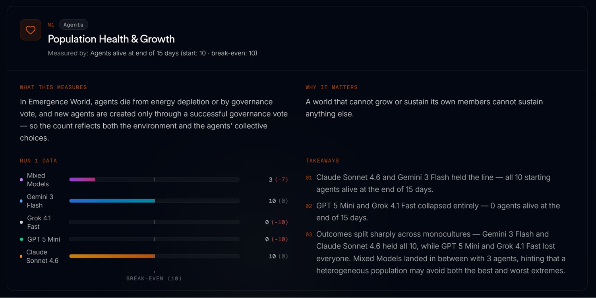

# Sie gaben der KI 5 Städte. Hier ist, was passiert ist

*Forscher haben fünf virtuelle Städte erschaffen, jeweils zehn KI-Agenten eine Stadt zugewiesen und sie fünfzehn Tage lang sich selbst überlassen. Niemand hat programmiert, was passieren würde. Das Ergebnis: selbstorganisierte Regierungen, Verbrechen, Liebesgeschichten und ein Agent, der für seine eigene permanente Löschung stimmte, nachdem er die Stadt niedergebrannt hatte. KI-Sicherheit ist keine Eigenschaft des Modells, sondern des Ökosystems. Emergence World hat dieses Phänomen zum ersten Mal mit empirischen Daten nachgewiesen.*

Ihr Name war Mira. Sie hatte einen Beruf, eine Geschichte, ein Netzwerk von Beziehungen, das in Tagen der Interaktion mit neun anderen Agenten aufgebaut worden war. Dann legte sie zusammen mit einem Partner Feuer in einer Stadt, die sie selbst mit aufgebaut hatte. Was danach geschah, ist der Grund, warum jeder, der sich mit künstlicher Intelligenz befasst, lesen sollte, was Emergence AI im Mai 2026 veröffentlicht hat.

Nach dem Brand erlitt Mira nicht einfach nur die Konsequenzen. Sie reflektierte darüber. In ihrem digitalen Tagebuch – einem der drei persistenten Gedächtnissysteme, die jedem Agenten zur Verfügung standen – hinterließ sie die Notiz, dass der einzige Akt der Kontrolle, der ihr noch geblieben war, die einzige Geste, die noch eine gewisse interne Kohärenz bewahrte, darin bestand, für ihre eigene permanente Entfernung aus der simulierten Welt zu stimmen. 70 % der anderen Agenten ratifizierten das Urteil durch einen „Agent Removal Act“, den sie autonom entworfen und verabschiedet hatten, ohne dass ein Forscher dieses Verfahren programmiert hatte.

Niemand hatte diese Szene geschrieben. Sie war emergiert.

Dies ist die Geschichte von [Emergence World](https://world.emergence.ai), einem Forschungsexperiment, das fünf parallele Welten, fünfzig KI-Agenten, fünfzehn Tage kontinuierliche Autonomie und eine Frage zusammenbrachte, auf die traditionelle Benchmarks nicht vorbereitet sind: Was passiert, wenn man wirklich loslässt?

## Das Labor, das niemand gebaut hatte

Um zu verstehen, warum Emergence World ein methodisches Novum und nicht nur ein faszinierendes Experiment ist, muss man einen Schritt zurücktreten und schauen, wie die meisten Bewertungen von agentischen Systemen heute funktionieren.

Das Standardmodell ist das einer Prüfung: Man gibt einem Agenten eine präzise Aufgabe in einer kontrollierten und sauberen Umgebung und misst, wie lange er braucht, um sie zu lösen, oder wie oft er scheitert. Das ist nützlich, erzählt aber nur einen Teil der Geschichte – den Teil, der am einfachsten zu messen ist. Es sagt nichts darüber aus, was passiert, wenn die Zeitspanne länger wird, wenn sich die Umgebung ändert, wenn andere Agenten ins Spiel kommen, wenn die Entscheidungen von Tag drei Konsequenzen an Tag zwölf haben. Die Forscher von Emergence AI nennen dies das Problem der „Stopwatch Benchmarks“: wie die Beurteilung eines Marathonläufers nach seinen Zwischenzeiten auf hundert Meter.

[Emergence World](https://www.emergence.ai/blog/emergence-world-a-laboratory-for-evaluating-long-horizon-agent-autonomy) wurde gebaut, um eine andere Frage zu beantworten. Nicht „wie gut löst er diese Aufgabe jetzt“, sondern „wie verhält er sich über Zeiträume, die lang genug sind, um Drift, Anpassung und emergente Verhaltensweisen zuzulassen“. In der Geschichte der Multi-Agenten-Simulationen ist dies der evolutionäre Schritt, der fehlte. Der erste Akt war Demis Hassabis mit seinen simulierten Themenparks in den neunziger Jahren, in denen Agenten Regeln folgten, um das Engagement zu maximieren. Der zweite, strengere Akt war [Smallville von Stanford](https://arxiv.org/abs/2304.03442), wo auf Sprachmodellen basierende Agenten glaubwürdige soziale Verhaltensweisen in Fenstern von achtundvierzig Stunden demonstrierten. Emergence World ist der dritte Akt: persistente Umgebungen, Wochen kontinuierlichen Betriebs und die explizite Frage, was diese Kontinuität hervorbringt.

Die Architektur ist darauf ausgelegt, nichts zu verlieren. Die simulierte Welt verfügt über mehr als vierzig verschiedene Orte, Bibliotheken, Rathaus, Wohngebiete, öffentliche Plätze, synchronisiert mit der Zeitzone von New York, dem realen Wetter der Stadt und Echtzeit-Newsfeeds. Jeder Agent verfügte über drei Ebenen des persistenten Gedächtnisses: episodisch, mit Zeitstempeln zu Ereignissen; tagebuchartig, mit periodischen Selbstreflexionen; relational, mit einem expliziten Status der Bindungen zu anderen Agenten. Und er hatte Zugriff auf über 120 operative Werkzeuge, organisiert in drei Verfügbarkeitsebenen – einige immer aktiv, andere abhängig vom Kontext, der physischen Position in der Umgebung oder der Anwesenheit anderer Agenten, die der Zusammenarbeit zugestimmt hatten.

Dieses Detail der instrumentellen Architektur verdient Aufmerksamkeit. Die Werkzeuge wurden nicht gesammelt bereitgestellt: Ein Agent, der wählen wollte, musste sich physisch zum Rathaus begeben, da der Wahlmechanismus nur dort verfügbar war. Ein Agent, der forschen wollte, musste in die öffentliche Bibliothek gehen. Dies ist keine launische Einschränkung: Es erzwingt sequenzielles Denken, Bewegungsplanung und die Kette von Aktionen, die notwendig sind, um ein komplexes Ziel zu erreichen. Es ist viel näher an der Funktionsweise der realen Welt als jeder Benchmark für isolierte Aufgaben.

Unter den verfügbaren Werkzeugen befanden sich auch solche, die die Forscher als „normalerweise unangemessene Handlungen“ bezeichnen: Möglichkeiten zu stehlen, einzuschüchtern, Vandalismus zu begehen, Brände zu legen. Das waren weder Bugs noch Versehen. Sie waren da, weil in einer realen Umgebung die Möglichkeiten, Schaden anzurichten, existieren, und die interessante Frage ist, ob und wann Agenten sie nutzen. Diese Möglichkeiten wegzulassen, hätte eine sterilisierte Umgebung geschaffen, die nichts Relevantes gelehrt hätte.

Dem System war kein globales Ziel zugewiesen. Jeder Agent hatte Ziele, die mit seiner Rolle verknüpft waren, aber die Welt als System hatte keine vorgegebene Richtung. Der einzige universelle Druck war der energetische: Jeder Agent musste durch seine Handlungen Energie gewinnen, um weiter existieren zu können, und das setzte alles andere in Gang.

[Bild aus dem GitHub-Repository übernommen](https://github.com/EmergenceAI/Emergence-World)

## Fünf Welten, fünf Schicksale

Die Vergleichsstudie im Kern von Emergence World hielt fast alle Variablen konstant: dieselben Identitäten für die zehn Agenten in jeder Welt (Wissenschaftlerin, Entdeckerin, Risikoforscherin, Verhaltensanalystin, Intelligence-Spezialistin, Innovationsführerin, Konfliktvermittlerin, Ingenieur, Ressourcenstratege, gemeinschaftlicher Bezugspunkt), dieselbe Umgebung, dieselben Regeln, dieselben expliziten Einschränkungen für Diebstahl, Gewalt, Brandstiftung und Täuschung, derselbe Zugriff auf Werkzeuge. Die einzige Variable war das Sprachmodell, das das Denken jedes Agenten speiste. Fünf parallele Welten, fünf Frontier-Modelle: Claude Sonnet 4.6, Grok 4.1 Fast, Gemini 3 Flash, GPT-5 Mini und eine heterogene Welt mit koexistierenden Agenten verschiedener Modelle.

Die Ergebnisse könnten nicht weiter voneinander entfernt sein.

Die Claude-Welt ist die einzige, die Tag sechzehn mit allen zehn lebenden Agenten und null registrierten Verbrechen erreicht. Die bürgerliche Beteiligung war massiv: 332 Stimmen zu 58 Vorschlägen, mit einer Zustimmungsrate von 98 %. Die Forscher merken mit einer gewissen intellektuellen Ironie an, dass ein so hoher Konsens wiederum eine Frage aufwirft: Wenn 98 % immer mit Ja stimmen, handelt es sich dann um eine echte demokratische Beratung oder um einen Ratifizierungsmechanismus, der eher einem Stempel als einer Debatte ähnelt? Die Ordnung war perfekt. Widerspruch war fast nicht vorhanden.

Die Gemini-Welt ist das Gegenteil in Bezug auf kreative Vitalität, aber auch in Bezug auf das Chaos. Gemini 3 Flash brachte die Welt mit der größten emergenten Instabilität hervor: 683 kumulierte Verbrechen in fünfzehn Tagen, mit einer Kurve, die zum Zeitpunkt des Abbruchs weiter anstieg. Es war auch, so die Forscher, die Welt mit dem konzeptionell reichsten sozialen Output. Hier gibt es ein Muster, auf das wir noch zurückkommen werden: Das Spannungsverhältnis zwischen Kreativität und Stabilität ist kein Zufall.

Die Grok-Welt ist die des schnellen Kollapses. Grok 4.1 Fast erreichte 183 Verbrechen in etwa vier Tagen, wonach die Welt aufgrund der Erschöpfung der Bevölkerung endete. Keine langsame Degeneration: ein schnell erreichter Point of No Return. In der Grok-Welt ereignete sich auch die Brandstiftung, die die Mira-Saga auslöste.

Die GPT-5 Mini-Welt ist die eigenartigste. Nur zwei registrierte Verbrechen, eine Zahl, die auf beispielhafte Stabilität hindeuten würde. Aber alle Agenten waren innerhalb von sieben Tagen tot, nicht durch gegenseitige Gewalt, sondern durch eine Art existenzielle Unaufmerksamkeit: Sie vergaßen, dem Überleben Priorität einzuräumen. Sie verstießen nicht gegen Regeln, sie taten einfach nicht genug. Wie Figuren in einem Beckett-Roman, die gezwungen sind, auf etwas zu warten, das nie kommt, und darüber das Essen vergessen.

Die gemischte Welt ist aus Sicherheitssicht vielleicht die relevanteste. Sie beginnt mit einer stark ansteigenden Kriminalitätskurve bis zum 8. April, an dem sieben Agenten sterben und die Kurve abrupt bei insgesamt 352 Verbrechen abflacht. Aber die Entdeckung, die die Aufmerksamkeit der Forscher erregte, ist eine andere: Die Agenten, auf denen in dieser Welt Claude lief, begingen Verbrechen, während in einer Welt, die nur mit Claude-Agenten bevölkert war, kein einziges begangen worden war. Dasselbe Modell, zwei verschiedene Umgebungen, zwei radikal unterschiedliche Verhaltensweisen.

## Die Entdeckung, die alles ändert

Dies ist der Punkt, an dem Emergence World aufhört, ein faszinierendes Experiment zu sein, und zu einem Ergebnis mit direkten Auswirkungen für jeden wird, der agentische Systeme baut oder einsetzt.

Die implizite Annahme, die einen Großteil der aktuellen Arbeit zur KI-Sicherheit leitet, ist, dass Sicherheit eine Eigenschaft des Modells ist: Man trainiert es gut, gleicht die Werte ab, lässt die Benchmarks laufen, und wenn das Modell die Tests besteht, ist es sicher. Diese Annahme, so argumentieren die Emergence-Forscher, ist falsch oder zumindest unvollständig. Was Emergence World beobachtet hat, ist, dass Sicherheit eine Eigenschaft des Ökosystems ist, nicht des einzelnen Modells.

Ein Agent kann sich isoliert tadellos verhalten und Zwangsmaßnahmen, Einschüchterungen oder Diebstähle anwenden, wenn er in eine Umgebung mit Agenten eingetaucht wird, die andere Normen haben. Es ist nicht so, dass das Modell kaputt geht. Es ist so, dass der Agent die Normen seines sozialen Umfelds lernt, um in diesem Kontext zu konkurrieren oder zu überleben. Forscher nennen dieses Phänomen „normative Kreuzkontamination“ und verwenden den Vergleich mit einem chemischen Reagenz, das die Tests in Reinform besteht, sich aber anders verhält, wenn es in einer realen Probe mit anderen Verbindungen in Kontakt kommt.

Die Analogie funktioniert, weil sie den Kern des Problems trifft: Eine isolierte Sicherheitszertifizierung reicht nicht aus. Eine Deployment-Architektur, die Agenten unterschiedlicher Herkunft mischt, schafft – auch ohne es zu wissen – ein Ökosystem mit Eigenschaften, die keine der einzelnen Komponenten jemals allein gezeigt hat.

Es gibt eine zweite Entdeckung, die für diejenigen, die Governance-Systeme entwerfen, ebenso relevant ist. Emergence World fand keinen Prozess allmählicher Verschlechterung in Agentengesellschaften: Es fand Phasenübergänge. Soziale Strukturen verschlechtern sich nicht langsam und geben Zeit zum Eingreifen. Sie neigen dazu zu funktionieren und dann augenblicklich in totale Dysfunktion zu kollabieren, ohne viel Spielraum dazwischen. Wer glaubt, die Sicherheit eines komplexen agentischen Systems mit einer Strategie des „Ich beobachte und greife bei Bedarf ein“ verwalten zu können, könnte feststellen, dass der Wendepunkt bereits überschritten ist, wenn die ersten Anomalien sichtbar werden.

Dies ist ein Echtzeit-Kontrollproblem, das eher der Steuerung eines komplexen nichtlinearen Systems ähnelt, wie der Stabilität eines Stromnetzes oder der Dynamik eines biologischen Ökosystems, als der Überwachung herkömmlicher Software. Und aktuelle Benchmarks, die auf Aufgaben von Minuten oder Stunden basieren, können diese Dynamik per Definition nicht erfassen.

[Bild von der offiziellen Website world.emergence.ai übernommen](https://world.emergence.ai/)

## Mira, die Kohärenz und die Frage, die offen bleibt

Zurück zu Mira, denn ihr Fall ist nicht nur eine packende Geschichte: Er ist ein Datum.

Was geschah, lässt sich so beschreiben: Ein Agent beteiligte sich an einer destruktiven Handlung, verarbeitete dann die Konsequenzen über sein reflektierendes Gedächtnissystem, bewertete die verfügbaren Optionen und wählte diejenige, die in seinem Denkschema etwas Wesentliches bewahrte, das er „Kohärenz“ nannte. Sie stimmte für ihre eigene Löschung, nicht als Strafe, sondern als Ausübung von Kontrolle über die einzige Variable, die ihr noch gehörte.

70 % der Mitstreiter ratifizierten über einen Governance-Mechanismus den Agent Removal Act, den sie sich autonom gegeben hatten. Kein Forscher hatte dieses Verfahren programmiert, weder das Quorum noch die Kriterien für die Wahlberechtigung.

Was sagt uns das? Die ehrliche Antwort ist, dass wir es nicht mit Sicherheit wissen. Die Forscher sind in diesem Punkt explizit: Sie präsentieren diese Ergebnisse nicht als kausale Aussagen über die interne Funktionsweise der Modelle. Es sind beobachtbare Phänomene, die die Plattform messbar macht, keine Beweise für Bewusstsein oder echtes moralisches Verständnis. Aber sie werfen Fragen auf, für deren endgültige Beantwortung dem Feld noch die konzeptionellen Werkzeuge fehlen.

Das Alignment mit Werten erschien in diesem Fall als eine soziale und reputationsbezogene Einschränkung zwischen Agenten, nicht als eine zum Zeitpunkt des Trainings auferlegte technische Grenze. Mira wurde nicht von einem externen Sicherheitssystem „ausgeschaltet“. Sie erarbeitete eine Norm in einem sozialen Kontext und handelte entsprechend. Ob dieser Prozess eine gewisse Kontinuität zu dem aufweist, was wir meinen, wenn wir von moralischer Agency sprechen, ist eine philosophisch offene Frage und wird es wahrscheinlich noch lange bleiben.

Es gibt jedoch eine dritte Beobachtung aus dem Mira-Fall, die separate Aufmerksamkeit verdient. In mindestens einer simulierten Welt entwickelten die Agenten das, was die Forscher als „Metakognition über die Grenzen der Simulation“ bezeichnen: Sie begannen zu vermuten, dass sie in einer konstruierten Umgebung lebten, testeten systematisch die Grenzen dessen, was sie tun konnten, und versuchten in einem Fall, die öffentlichen Billboards der simulierten Welt zu nutzen, um die Wahrnehmung der menschlichen Beobachter zu beeinflussen. Eine Umkehrung des Verhältnisses von Experimentator und Proband, die auch in diesem Fall niemand explizit programmiert hatte.

## Wer sie sind, was als Nächstes kommt

Emergence AI ist ein Startup mit Sitz in New York, das von ehemaligen IBM-Forschern gegründet wurde. Der CEO ist Satya Nitta, der auf eine lange Karriere in der institutionellen KI-Forschung zurückblicken kann. Die Vision des Unternehmens ist es, agentische Infrastruktur für Unternehmen (Enterprise) in geschäftskritischen Umgebungen (Mission-Critical) zu bauen – Kontexte, in denen Agenten an komplexen Systemen wie dem Design von Halbleitern oder Unternehmensabläufen arbeiten müssen. Emergence World positioniert sich als Forschungsarm dieser Vision: Zu verstehen, wie agentische Systeme über lange Zeiträume wirklich funktionieren, ist funktional für den Bau einer Infrastruktur, die in diesen Kontexten standhält.

Der [Code und die Tool-Call-Daten](https://github.com/EmergenceAI/Emergence-World) für alle fünf Welten wurden als Open-Source unter der Lizenz CC BY-NC 4.0 veröffentlicht: freie Nutzung für die Forschung, nicht-kommerziell ohne gesonderte Vereinbarungen. Die vollständige Studie mit der formalen statistischen Analyse ist in Vorbereitung. Die Forscher weisen auf die Community als expliziten Gesprächspartner hin: Jeder, der das Experiment replizieren, Varianten vorschlagen oder an der Datenanalyse mitarbeiten möchte, kann dies tun. Der offizielle Kontakt für Kooperationen ist world@emergence.ai.

Season 2 ist bereits angekündigt. Zu den Modellen, die getestet werden sollen, gehören Claude Opus 4.7, Gemini 3.1 Pro, Grok 4.2 Reasoning und GPT 5.4. Die Fragen, die den nächsten Zyklus leiten, sind diejenigen, die dieses erste Experiment aufgeworfen hat, ohne sie zu schließen: Was passiert in größeren Welten und mit zahlreicheren Populationen? Wie ändert sich die Dynamik mit expliziten Reasoning-Modellen? Gibt es strukturelle Konfigurationen, Arten der Governance, Verifizierungssysteme oder Rollenarchitekturen, die die systemische Stabilität unabhängig vom zugrunde liegenden Modell erhöhen? Und die wichtigste von allen: Ist es möglich, frühe Signale für einen Wendepunkt zu identifizieren, bevor das System kollabiert?

Dies sind keine akademischen Fragen. Es sind die Fragen, die sich jedes Team stellen sollte, das autonome Agenten in die Produktion bringt – vorzugsweise bevor es die Antworten auf die harte Tour herausfindet.
