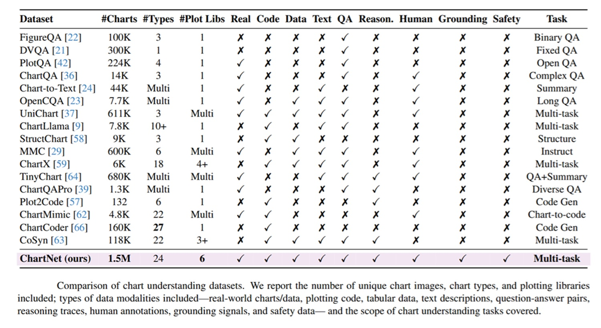
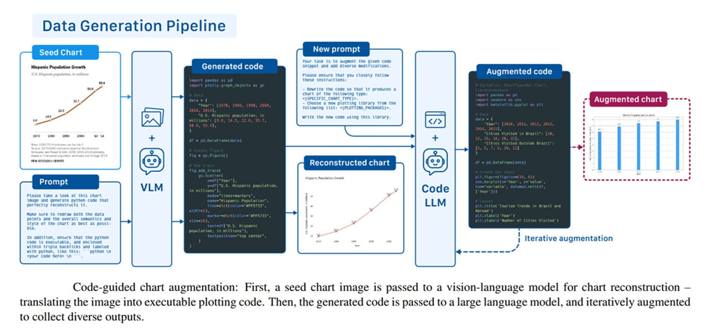

# ChartNet: el análisis de gráficos ya no es cosa de grandes presupuestos

*Por primera vez, un modelo de AI open-source de pequeño tamaño interpreta gráficos mejor que los gigantes comerciales, gracias a ChartNet, el dataset revolucionario del MIT de 1,5 millones de muestras sintéticas que combina código de plotting, imágenes renderizadas, tablas de datos, resúmenes en lenguaje natural y pares de Q&A con razonamiento. ¿El resultado? Cualquier persona que deba analizar un informe financiero de 200 páginas puede ahora usar un modelo de 3 mil millones de parámetros gratuito en HuggingFace para extraer datos, reconstruir gráficos y obtener respuestas con razonamiento, democratizando el análisis visual de datos para PYMES, investigadores y profesionales con presupuesto limitado.*

Imaginad que tenéis un analista financiero que entiende perfectamente el inglés, conoce todos los fundamentos de balance, pero cuando le mostráis un gráfico de barras con los ingresos trimestrales os responde describiendo los colores de las barras en lugar de leeros los números. Es una situación paradójica, y sin embargo es exactamente lo que les sucede a gran parte de los modelos de inteligencia artificial visual hoy en el mercado, incluidos algunos de los más prestigiosos y costosos.

El problema no es nuevo, pero ha permanecido mucho tiempo en la sombra, oscurecido por el clamor en torno a las capacidades lingüísticas de la AI. Los modelos llamados vision-language, aquellos que procesan tanto texto como imágenes, han hecho progresos espectaculares en la descripción de fotografías, el reconocimiento de objetos y la transcripción de documentos. Pero cuando se encuentran ante un gráfico, su razonamiento se encalla de forma sutil y peligrosa: ven una figura, pero no entienden el dato que esa figura representa.

Interpretar un gráfico no es simplemente "mirar una imagen". Requiere fundir tres competencias distintas: la percepción visual de las formas geométricas (dónde se encuentran las barras, por dónde pasa la línea de tendencia), la comprensión estructural de los datos numéricos (escala de los ejes, proporciones, valores absolutos) y la comprensión lingüística de las etiquetas, los títulos y las leyendas. Es una triangulación cognitiva que el cerebro humano ejecuta de forma casi automática, pero que para un modelo artificial sigue siendo un desafío abierto, un territorio donde incluso los sistemas de miles de millones de parámetros tropiezan con detalles que parecerían banales.

Dhiraj Joshi, senior scientist en IBM Research, describió el problema con claridad en el [comunicado del MIT](https://news.mit.edu/2026/mit-researchers-teach-ai-models-to-interpret-charts-0603): la industria financiera vive de gráficos, y si los modelos vision-language logran extraer de ellos información fiable, descripciones de tendencias, variaciones en el tiempo o comparaciones entre categorías, se abren automáticamente decenas de flujos de trabajo que hoy requieren analistas humanos o herramientas costosas. Pero la palabra clave es "fiables". Un modelo que responde con seguridad y se equivoca en los números es peor que ningún modelo.

El cuello de botella, como suele ocurrir en este campo, no estaba en los modelos. Estaba en los datos.

## Cómo nace un dataset de 1,5 millones de gráficos

Quien siga el mundo de la AI sabe que la calidad de los datos de entrenamiento es casi siempre más importante que la arquitectura del modelo. Una idea sencilla pero bien nutrida vence casi siempre a una idea brillante hambrienta de ejemplos. El problema con los gráficos es que recopilarlos, etiquetarlos y hacerlos realmente útiles para el entrenamiento es extraordinariamente difícil.

Los datasets existentes antes de ChartNet eran, mirando hacia atrás, casi ingenuos en su parcialidad. FigureQA, uno de los más conocidos, contenía 100.000 imágenes pero cubría solo tres tipos de gráfico y usaba una sola librería de renderizado, aceptando exclusivamente respuestas binarias sí/no. DVQA estaba construido en torno a un solo tipo de gráfico. ChartQA, más ambicioso, incluía imágenes reales y preguntas complejas, pero se detenía en 14.000 ejemplos, ni de lejos suficientes para entrenar un modelo robusto. La carencia común era estructural: ninguno de estos datasets conectaba la imagen del gráfico con el código que lo había generado, con los datos subyacentes, con una descripción en lenguaje natural y, sobre todo, con cadenas de razonamiento explícito.

Jovana Kondic, doctoranda del MIT en ingeniería eléctrica e informática y autora principal del [paper](https://arxiv.org/pdf/2603.27064), encuadró el problema con una analogía que vale la pena citar: un modelo, a diferencia del cerebro humano, podría necesitar ver miles de ejemplos durante el entrenamiento para reconocer de forma fiable algo como un gráfico de líneas. La escasez de datos no es un inconveniente, es una barrera estructural.

La solución concebida por el equipo MIT-IBM es elegante precisamente porque invierte la lógica convencional. En lugar de recopilar gráficos de internet y luego intentar anotarlos, los investigadores han construido una pipeline que genera gráficos partiendo del código. La idea de fondo, la llamada síntesis guiada por código, funciona así: se toma un conjunto inicial de imágenes de gráficos ya existentes, se usa un modelo visual para reconstruir aproximadamente el código que podría haberlos generado y luego se usa ese código como semilla para producir cientos de variantes. Cambiad el tipo de gráfico, modificad los valores, alterad los colores, cambiad el tema, el título, la densidad de los datos: cada modificación del código produce una nueva muestra auténtica, con todos sus metadatos ya disponibles por construcción.

El resultado es una pipeline capaz de expandirse de forma casi geométrica. Partiendo de un número relativamente pequeño de gráficos semilla, el sistema ha producido más de 1,5 millones de muestras diversificadas, cubriendo 24 tipologías de gráfico (histogramas, gráficos de líneas, de tarta, de dispersión, box plot, mapas de calor y muchos otros) a través de seis librerías de plotting diferentes, entre ellas Matplotlib, Seaborn, Plotly y Vega-Altair. Un sistema automático de control de calidad verifica que cada muestra generada sea ejecutable, esté renderizada correctamente y sea semánticamente coherente: no se busca simplemente diversidad, sino diversidad significativa.

## Cinco lenguas para un solo gráfico

La verdadera innovación de ChartNet no está sin embargo en la cantidad, sino en la estructura. Cada muestra del dataset no es una simple pareja imagen-etiqueta: es una tupla de cinco elementos perfectamente alineados entre sí, una representación del mismo gráfico en cinco "lenguas" diferentes.

El primero elemento es el código de plotting ejecutable, la fuente de verdad de la que deriva todo lo demás. El segundo es la imagen renderizada del gráfico, la que el modelo verá durante el entrenamiento. El tercero es la tabla de datos con los valores numéricos subyacentes, expresada en formato estructurado. El cuarto es un resumen en lenguaje natural que describe los patrones, las tendencias y las anomalías visibles en el gráfico. El quinto, disponible para 632.000 de las muestras core (y en expansión), es una pareja pregunta-respuesta con una cadena de razonamiento explícita, el llamado chain-of-thought, que muestra no solo la respuesta correcta sino el camino lógico para llegar a ella.

Esta estructura multimodal de cinco niveles no es estéticamente agradable, es funcionalmente necesaria. Cuando un modelo se entrena con estos datos, aprende no solo a "mirar" un gráfico sino a poner en relación su estructura visual con los números que representa, con las palabras que lo describen y con las preguntas que se pueden hacer sobre él. La alineación transversal entre los cinco componentes es lo que los investigadores llaman cross-modal alignment granular: el modelo desarrolla una comprensión integrada, no fragmentada.

Además del núcleo sintético, ChartNet incluye subconjuntos especializados que abordan dimensiones a menudo ignoradas por los datasets anteriores. Un subconjunto de 94.643 gráficos sintéticos fue verificado por anotadores humanos expertos, produciendo también un set de test de 2.000 muestras con garantías de calidad certificadas: es la red de seguridad estadística de todo el sistema. Un segundo subconjunto recoge 30.000 gráficos reales extraídos de fuentes autorizadas de medios y visualización de datos, lo necesario para probar la generalización del mundo sintético al mundo real. Un tercer subconjunto incluye anotaciones de grounding, es decir, parejas pregunta-respuesta asociadas a recuadros de delimitación precisos sobre las regiones visuales del gráfico: enseña al modelo no solo qué responder, sino dónde mirar. Finalmente, un subconjunto dedicado a la seguridad aborda el problema de los gráficos potencialmente engañosos o manipulados, una dimensión que los datasets académicos anteriores ignoraban casi por completo.

[Imagen extraída del paper oficial en arxiv.org](https://arxiv.org/pdf/2603.27064)

## Un 3B vence a GPT-4o

Los resultados experimentales son la parte que ha hecho levantar algunas cejas en la comunidad, y con razón. El equipo evaluó los modelos entrenados en ChartNet en cuatro tareas principales: reconstrucción del gráfico (recrear el código de plotting a partir de la imagen), extracción de los datos (recuperar la tabla numérica subyacente), generación de resúmenes y respuesta a preguntas con razonamiento en cadena.

El modelo Granite 4.0 Vision de 3 mil millones de parámetros, entrenado con ChartNet, alcanzó el 86,4% de precisión en la generación de resúmenes (Chart2Summary) en el test set humano verificado de ChartNet, con evaluación realizada mediante LLM-as-a-judge. Esta puntuación es la más alta entre todos los modelos evaluados, incluidos modelos significativamente más grandes. En el mismo benchmark, Granite se clasificó segundo en la extracción de datos (Chart2CSV) con el 62,1%, superado solo por Qwen3.5-9B con el 63,4%, un modelo de tamaño más del doble.

Pero el dato que más ha impactado a los observadores está en la comparación directa con los sistemas comerciales. Los modelos open source entrenados en ChartNet superaron a modelos de órdenes de magnitud más grandes, incluido GPT-4o de OpenAI, en todas las tareas de interpretación gráfica. El concepto de "órdenes de magnitud" aquí no es énfasis retórico: GPT-4o es un modelo que se estima tiene cientos de miles de millones de parámetros, mientras que Granite 4.0 Vision tiene tres mil millones. La relación es del orden de 100:1 en parámetros, con el modelo más pequeño resultando ganador. Esto es exactamente lo que Kondic quería decir cuando declaró que el objetivo del proyecto es demostrar que se puede alcanzar el estado del arte con modelos más pequeños que no requieren cantidades infinitas de cálculo.

El resultado no es mágico, es consecuente: GPT-4o es un modelo generalista entrenado en enormes cantidades de datos heterogéneos. Granite, entrenado en un dataset construido quirúrgicamente para la tarea específica, puede superarlo en ese nicho preciso. Es la diferencia entre un cirujano generalista y un especialista: en el quirófano para esa intervención específica, el especialista gana casi siempre.

ChartNet mejoró el rendimiento también en los benchmarks públicos estándar del sector, como ChartQA, FigureQA y PlotQA, demostrando que las ganancias no se limitan al test set propietario sino que generalizan a evaluaciones independientes.

## Open source, pero con reservas

Hasta aquí la historia parece casi demasiado buena para ser cierta. Un dataset gratuito, construido con rigor científico, que permite a modelos pequeños y económicos vencer a los gigantes comerciales en las tareas de análisis gráfico. Para quien gestiona una PYME, realiza investigación sin fondos de las grandes tecnológicas o simplemente no quiere pagar las tarifas de API de los proveedores premium, ChartNet y los modelos Granite que derivan de él representan un acceso concreto a capacidades que estaban de hecho vetadas.

El [dataset está disponible en HuggingFace](https://huggingface.co/datasets/ibm-granite/ChartNet), los modelos Granite se publican con licencia Apache 2.0 y el paper está publicado en arXiv con licencia CC BY 4.0. No hay barreras de acceso. Un profesional que quisiera integrar hoy Granite Vision para analizar automáticamente los informes PDF de su empresa, extraer los gráficos y obtener resúmenes y respuestas a preguntas, puede hacerlo en hardware de consumo con costes marginales cercanos a cero.

Dicho esto, un relato honesto no puede ignorar los límites estructurales del proyecto.

El punto crítico más evidente es la naturaleza sintética de la mayoría de los datos. Los gráficos generados por pipelines automáticas, por muy diversificados y controlados que estén, tienden a ser visualmente más limpios, más regulares, más "correctos" que los gráficos que se encuentran en la realidad. Un informe anual de una multinacional, una diapositiva de una presentación académica o una infografía de un periódico tienen a menudo estilos gráficos idiosincrásicos, fuentes no estándar, escalas anómalas, anotaciones manuales, superposiciones y calidad de renderizado variable. El subconjunto de 30.000 gráficos reales en ChartNet es un intento de cerrar esta brecha, pero sigue siendo una fracción menor del dataset total. El riesgo del llamado "distribution shift", la diferencia entre la distribución de los datos de entrenamiento y la de los datos reales, es real y reconocido por los propios autores, que han indicado la expansión con datos de mayor complejidad como prioridad para las versiones futuras.

Hay además una cuestión de dependencia del ecosistema. ChartNet ha sido desarrollado en el marco del MIT-IBM Computing Research Lab, una colaboración estructurada entre el MIT e IBM Research, y sus resultados más visibles son los modelos de la familia Granite de IBM. Esto no es un defecto, pero es un contexto a tener en cuenta: el dataset es open source, pero su trayectoria de desarrollo está influenciada por los objetivos de una gran empresa tecnológica con intereses comerciales precisos en la AI enterprise. Se invita explícitamente a la comunidad de investigación independiente a contribuir, pero el equilibrio entre gobernanza comunitaria y dirección empresarial está por verse con el tiempo.

Cabe señalar también que las métricas de evaluación más halagadoras, como el 86,4% en Chart2Summary, usan un enfoque LLM-as-a-judge donde un modelo lingüístico evalúa la calidad de las respuestas de otro modelo. Es una metodología cada vez más común, pero no exenta de críticas: los jueces automáticos pueden tener preferencias sistemáticas, pueden ser menos sensibles que los expertos humanos a ciertos tipos de errores numéricos y las puntuaciones absolutas dependen en parte de las elecciones de prompt del evaluador. El test set de 2.000 muestras verificadas por humanos es una garantía parcial, pero no una validación completa en condiciones reales.

El paper será presentado en la IEEE CVPR 2026, el Computer Vision and Pattern Recognition, una de las conferencias académicas más importantes del mundo en el campo de la visión artificial. Es el sello de legitimidad científica del proyecto, y trae consigo también la tradición de revisión por pares que distingue la investigación académica del simple anuncio comercial.

[Imagen extraída del paper oficial en arxiv.org](https://arxiv.org/pdf/2603.27064)

## Qué cambia, concretamente

Para quien lee este artículo desde una perspectiva práctica, la pregunta es: ¿qué cambia hoy, en mi actividad, gracias a ChartNet?

Si trabajáis en una gran organización con acceso a los modelos comerciales premium y un equipo de AI dedicado, es principalmente una noticia interesante sobre el progreso de la investigación. Si por el contrario sois un analista financiero freelance que procesa decenas de informes PDF mensuales, un investigador con presupuesto limitado o una PYME que quiere automatizar la extracción de datos de presentaciones y cuadros de mando, entonces ChartNet abre una puerta concreta.

Un modelo de 3 mil millones de parámetros como Granite 4.0 Vision corre en servidores cloud con costes horarios de pocos céntimos. La diferencia respecto a GPT-4o vía API no es solo económica: es también de latencia, de control de datos y de posibilidad de fine-tuning sobre datos propietarios. El subconjunto anotado por humanos en ChartNet está diseñado precisamente para esto: permitir que cualquiera adapte el rendimiento a su dominio específico, desde gráficos del mercado de valores hasta métricas de rendimiento empresarial.

ChartNet demuestra que en la AI la ventaja competitiva no pertenece necesariamente a quien tiene más parámetros y más potencia de cálculo, sino a quien tiene los datos adecuados construidos de la forma adecuada. En tareas específicas y bien definidas, un modelo pequeño pero bien entrenado puede dar un vuelco a la situación. A veces lo que cuenta no es ser más grande, sino más preciso.
