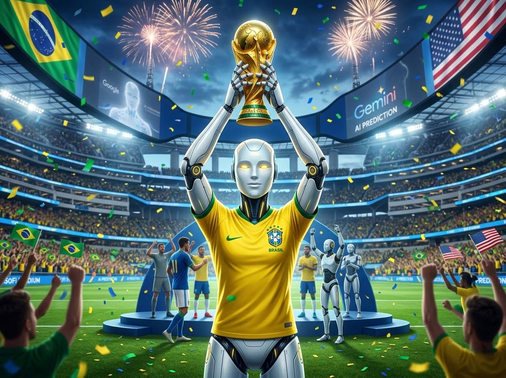
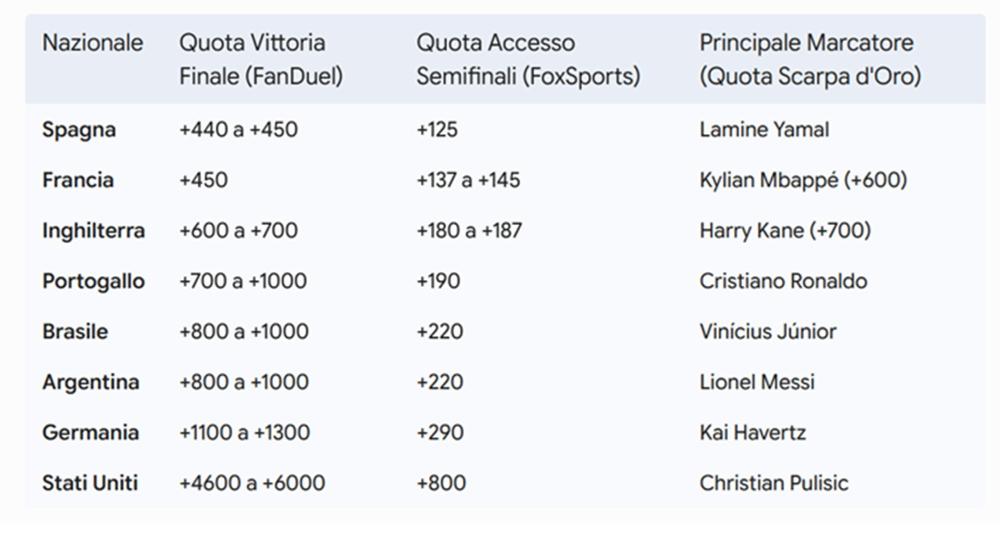

# Gemini told me who will win the 2026 World Cup

*Once upon a time, there was an octopus named Paul. He lived in the Sea Life Centre in Oberhausen, Germany, and in 2010 he guessed the outcome of fourteen out of sixteen matches, including the South African World Cup final, by choosing which of two food boxes to open based on the national flag affixed above. The world went crazy. Newspapers called him an "oracle." Bookmakers stopped laughing after the fifth correct prediction. Spain officially thanked him after their victory against the Netherlands. Paul died of natural causes in October 2010, taking to the grave the secret of a forecasting method that no artificial intelligence has yet replicated with the same media charisma.*

We tried anyway. An experiment without scientific basis, conducted with a quasi-scientific method, on a tournament that starts now and ends in July. Results to be verified at the end of July 2026.

The idea is simple, vaguely insane, and entirely in line with the spirit of football: provide Gemini Deep Research, Google's autonomous research system, with a detailed prompt containing every imaginable variable—FIFA rankings, World Cup history, climate conditions of the venues, technical profiles of the national teams, coaches' philosophies, betting markets, geopolitical dynamics—and ask it to elaborate a reasoned prediction on the winner of the 2026 World Cup. No declared scientific basis. No oracular pretense. Just an experiment to do at the start of the tournament and to reopen, like a time capsule, in July when the cup will already be in someone's hands.

What emerged from the analysis is more interesting than the final result: a layered, methodical, at times surprising reasoning that says sensible things about modern football and something even more interesting about how an AI system builds a complex argument starting from heterogeneous data. Before revealing the algorithm's verdict, it's worth retracing the path.

## The world in 48 teams (and 48 problems)

The starting point is the FIFA ranking published on June 11, 2026, the definitive snapshot of world power relations on the eve of the largest tournament in history. For the first time, the event welcomes forty-eight national teams instead of the usual thirty-two, with twelve groups of four teams and a bracket that stretches to eight matches to reach the end. Not seven as before. Eight.

This detail, which on the surface seems like a bureaucratic detail from FIFA, is actually the first knot in Gemini's analysis. An extra round means an entire extra match of physical effort, another night in a hotel, another recovery session, another potential injury for a starter. In a tournament already compressed in time and played under the scorching sun of North America, that additional round—the round of 32, returned after decades of absence—becomes as much a selective variable as the Houston heat.

At the top of the ranking, three teams face each other in an almost molecular balance: Argentina leads with 1877.27 points, Spain follows at 1874.71 (a gap of 0.13%, the kind of thing that in political polls would be called a "statistical margin of error"), France is third with 1870.70 points after a misstep against Ivory Coast in a friendly nullified the temporary lead in April. Behind the trio, England consolidates in fourth place, while a Brazil in a "tactical adjustment phase"—a polite euphemism for a team that has changed coach, philosophy, and identity within a few months—occupies the sixth position.

The structure of the groups reveals some interesting choices: Group C brings together Brazil (sixth in the world) and Morocco (seventh), two teams that in a classic tournament would face each other in the semifinals. Group L pairs England and Croatia, a recent history of a painful English elimination in 2018 that Gemini records as a non-negligible psychological datum.

The big statistical story that the analysis puts on the table, however, concerns the defending champions: three of the last four winners were eliminated in the group stage of the following tournament. The 2022 Argentina conceded eight goals in Qatar, needed two penalty shootouts, and showed structural fragilities that in an eight-match path under the North American sun could prove fatal. It's not a condemnation, but it's a weight that Gemini inserts into the equation.

## Heat, altitude, and jet lag: the invisible variables

If the part on the FIFA ranking is the predictable section of the analysis, the one on environmental conditions is where Gemini does its most original, and for some national teams most unsettling, work.

The tournament is played in three countries, in venues ranging from Miami (practically at sea level, humidity through the roof) to Mexico City (2,250 meters altitude, thin air) passing through Guadalajara (1,566 meters) and Houston (flat and torrid, but with the only stadium in the tournament equipped with full air conditioning and a retractable roof). Each venue is a different ecosystem, and teams move between these ecosystems without any physiological continuity.

The sports-medical literature that Gemini cites is clear: VO2max, maximum oxygen consumption, a key indicator of aerobic endurance, drops between 7% and 8% for every thousand meters of altitude beyond 1,500 meters. At the 2010 World Cup in South Africa, a 21% drop in high-speed runs was recorded. The 1970 Czechoslovakia did not acclimatize and lost all group matches. Alf Ramsey's England did the opposite—three weeks of training camp in Mexico City, high-altitude friendlies, salt tablets—and reached the quarterfinals: environmental preparation is a true competitive factor, not an obsession of athletic trainers.

Heat adds further complexity. Climate Central data shows that the 2026 venues are recording a marked increase in days with extreme temperatures: Estadio Azteca has seen the average number of days at thermal risk rise from two to eleven per year; Miami combines heat and humidity in a mix that depresses body thermoregulation; Dallas sets the "extreme heat" threshold at 31.8 degrees, which for a European team fresh from a spring season is already a hostile environment.

This is where Gemini introduces what it calls the "resilience multiplier": a system of weights applied to stress variables (transcontinental travel, late-season burnout, climate) that significantly alters hierarchies compared to purely technical models. The technically strongest team is not necessarily the one that survives this physical meat grinder best. And this observation flips the ranking.

A geopolitical note that the analysis does not omit, because it would be dishonest to do so: the US political climate has generated concrete tensions around the organization of the tournament. More than 120 civil rights organizations led by the ACLU have issued travel advisories for the ten million expected visitors. A referee of Somali origin was refused a visa, Iraqi striker Aymen Hussein was detained for seven hours at Chicago airport, and fifteen members of the Iranian federal staff were unable to enter the United States. The "No ICE in the Cup" coalition is protesting outside stadiums. These are not technical data in a football sense, but they are real data about the environment in which the tournament takes place, and a serious analysis system cannot ignore them.

## The protagonists: who wins, who collapses

**Argentina** arrives with seventeen veterans from the 2022 triumph: a continuity that is simultaneously a strength and a vulnerability. Messi is 38 years old and has chronic hamstring fatigue that requires careful management of minutes. The defensive structure—Romero, Lisandro Martínez, Emiliano Martínez in goal—holds; the midfield with De Paul, Mac Allister, and Enzo Fernández works. But the starting full-backs arrived at the camp battered, defender Balerdi was excluded for a muscle tear, and the absence of Di María's charisma, retired from the national team, is a void that will be felt.

**France** is profoundly renewed: only eleven survivors from 2022, average age dropped to 26.4 years. Mbappé, 42 goals in 44 matches for Real Madrid in the last season, is the gravitational center, flanked by current Ballon d'Or Dembélé and talent Michael Olise. The high-profile exclusions of Griezmann, Camavinga, and Giroud tell of a clear choice toward renewal. The question is whether such a young group can withstand the pressure of direct eliminations.

**Brazil**'s new course under Carlo Ancelotti is the most ambitious operation of the tournament: the Italian is the first foreign coach to lead the Seleção in a World Cup in the last century of history. In his first ten matches on the bench, he has gathered five wins, two draws, and three defeats—a non-triumphant start, compensated by his main gift which goalkeeper Alisson described as "a work of pacifying the environment." The offensive force is entrusted to Vinícius Júnior, second in the 2024 Ballon d'Or, and nineteen-year-old Estêvão, already five goals in eleven appearances for the national team. And Neymar, 34, recovering from a cruciate ligament rupture in 2023, was called up by Ancelotti as a symbol and tactical weapon, even without the athletic brilliance of his best days.

**England** under Thomas Tuchel is the team Gemini identifies as best structured for the knockout rounds. The German coach, who arrived in March 2025 with the declared goal of winning the second star ("Operation second star"), achieved eight wins in eight qualifying matches without conceding a goal, deliberately excluding talents like Palmer, Foden, and Alexander-Arnold in favor of a cohesive block. Kane leads the attack, Bellingham and Saka guarantee quality, Ivan Toney is the box sniper and penalty specialist in case of a shootout. The big surprise is Morgan Rogers of Aston Villa, a starter in twelve of the thirteen matches of the Tuchel era.

**Germany** brings Neuer in goal at forty years old and the enigma Jamal Musiala: after the leg fracture sustained at the Club World Cup, he played his first full ninety minutes only at the end of May. Over a distance of eight matches under the North American heat, his athletic endurance is the hardest question of the German tournament. Nagelsmann's hyper-dynamism, built on frenetic rhythms, is a philosophy that at forty degrees can become an unsustainable luxury.

A mention is deserved for the ranking of the aesthetic attractiveness of the forty-eight coaches, elaborated by the Live Football Tickets institute, because it is exactly the type of data that no serious analysis should cite and which instead says something true about the media circus accompanying global football. Tuchel is fourth with 8.43 out of 10. He is surpassed by Australian coach Tony Popovic (8.99), absolute first. Nagelsmann is seventh. Scaloni, Ancelotti, and de la Fuente do not appear in the top ten. It is unclear to what extent a coach's attractiveness influences on-field performance. Gemini, wisely, doesn't even try.

## Bookmaker numbers vs. the algorithm

Before listening to the AI's verdict, it's worth looking at what the betting market says, which is the most honest distributed forecasting system in existence: it aggregates millions of individual evaluations into an implicit probability, and money doesn't lie.

The picture is clear: Spain absolute favorite (+440/+450 on FanDuel), France close behind (+450), England third (+600/+700). Brazil and Argentina, penalized by logistical and climatic unknowns, share the range between +800 and +1000—same evaluation, different destinies according to Gemini. For the Golden Boot, bookmakers are betting on Mbappé (+600) and Kane (+700), with Haaland at +1400 slowed by the limited depth of the Norwegian path.

Three European teams at the top, South Americans in the second tier. This is exactly where Gemini's analysis takes a divergent direction, and it does so with a precise historical argument.

One of the tables from Gemini's analysis

## The verdict: Brazil in triumph

Gemini's final prediction is this: Brazil will win the 2026 World Cup. Finalist England. Third Spain.

The reasoning supporting this verdict is articulated in levels, and it's worth following them in the order they are presented.

The first level is historical. In the Americas, South American teams have a success rate disproportionate to their weight in the world ranking. Uruguay won in 1930 (at home) and in 1950 (in Brazil, against the hosts in the most painful final in football history). Brazil won in 1962 (in Chile) and in 1970 (in Mexico). Argentina won in 1978 (at home) and in 1986 (in Mexico). In the American continent, only one European team has won: in 2014, in Brazil, Germany won the title, beating Argentina in the final. Out of 7 World Cups played on American soil, 6 were won by South Americans and 1 (2014) by a European team. Only one team from the American continent (Brazil) has managed to win a World Cup in Europe: in 1958 in Sweden, the only case of a victory by a non-European national team on European soil. These are statistics, but they tell a long story.

The second level is physiological. South American teams are structurally more accustomed to playing in high heat and humidity conditions, especially those coming from qualifying systems that cross Brazil, Colombia, Ecuador, Paraguay. Acclimatization is not a protocol to follow in a camp: it is a skill acquired over time, in muscle tissue, in thermoregulation mechanisms.

The third level is tactical. Ancelotti, in the AI analysis system, is identified as the coach best equipped for the tournament's extended format. Not because he is the most tactically brilliant—that crown belongs, according to Gemini, to Nagelsmann or Tuchel—but because his management philosophy, the ability to modulate match rhythms and rotate elements without losing solidity, is exactly what is needed in an eight-match competition under the scorching North American sun. The safe harbor in a long storm.

The path Gemini builds sees Brazil clearing the groups with relative agility, then progressively eliminating European opponents weighed down by heat and attrition. The semifinal against Argentina—the South American super-derby, the match most charged with history in the tournament—is assigned to Brazil for depth of bench and better management of rotations. The final against Tuchel's England is the confrontation between two opposite models: the "creative discipline" of the green-and-yellow against the "pragmatic rigor" of the English. England aims for extra time or penalties to exploit Ivan Toney's specialization from the spot. They don't get there.

Spain, described as the team with the highest technical quality of the tournament, is eliminated in the semifinals by England: Luis de la Fuente's total ball possession, under the North American heat cap, ends up wearing out the Iberians themselves in a textbook physiological paradox.

Brazil wins its sixth world title, twenty-four years after 2002. The analysis closes with a sentence that has the tone of a poetic declaration: "In the Americas, football remains a territory where resilience and the environmental factor prevail over theory. 2026 will mark the return of the crown to South America, closing the circle started in 1958."

## What this experiment really tells us

It's fair to remember what this experiment is not: it's not a scientific prediction, it's not betting advice, it's not an oracle. Paul the octopus had the advantage of not having to justify himself: he opened a box and that was it. Gemini must build an argument, and every argument carries with it the biases of the data on which it was trained.

What's interesting is how the system handled complexity: it didn't just order teams by FIFA ranking and declare the first as the winner, but it integrated heterogeneous variables—climatological, physiological, historical, geopolitical—producing a prediction that diverges from the bookmakers' consensus not by chance, but for an argued reason. That reason can be wrong. It probably is in some points. But the process is rigorous in the way only someone who isn't afraid to be wrong can afford to be.

If in July Brazil really lifts the cup, the real question will be another: what will we have learned? That environmental data is systematically underestimated in modern football? That Ancelotti brings luck to national teams too? Or simply that with enough variables and a pinch of luck, anyone can guess right? We'll reopen this article in July. In the meantime, the tournament begins.

*Note: this analysis was elaborated by Gemini Deep Research at the start of the tournament (June 11, 2026), based on a structured prompt with climatological, historical, tactical, and market variables. It does not constitute a scientific prediction or betting advice. FIFA ranking data is updated as of June 11, 2026.*
