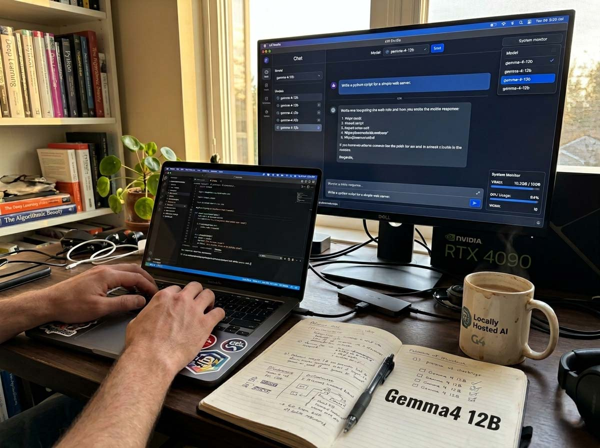
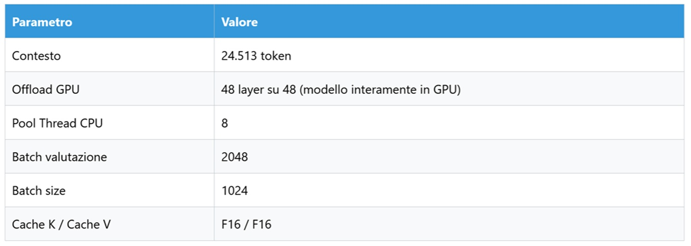
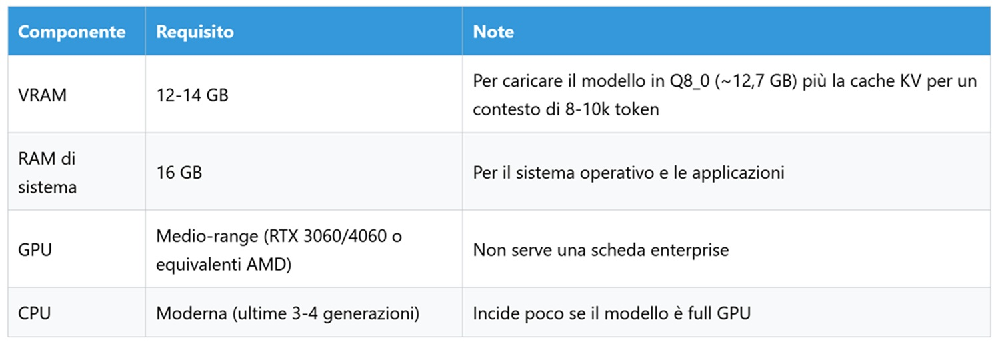
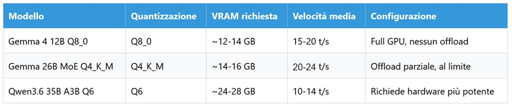
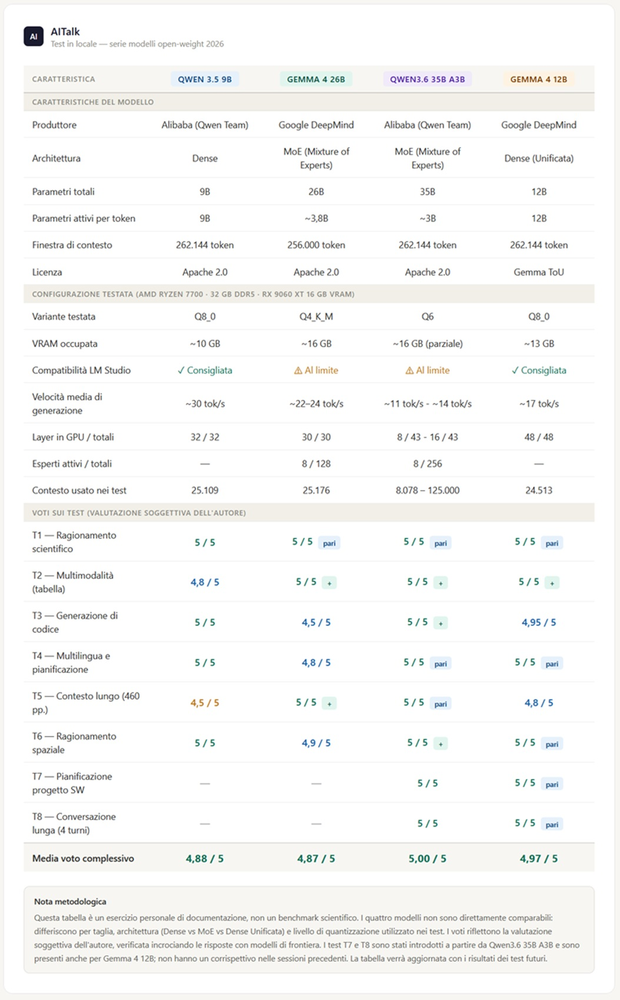

# Gemma 4 12B en local : vaut-il mieux un petit au maximum ou un grand étranglé ?

*Lors des tests précédents sur Gemma 4 26B et Qwen3.6 35B, j'avais toujours dû faire face au même problème : la VRAM n'était jamais suffisante. Grands modèles, quantifications poussées, couches en offload. Ils fonctionnaient, mais avec la sensation de conduire une voiture puissante avec le frein à main serré. Puis est arrivé Gemma 4 12B. Plus petit, certes. Mais avec une nouvelle architecture et la promesse de tourner entièrement sur GPU grand public sans compromis. J'ai donc décidé de faire une expérience différente : non plus « quel est le modèle le plus puissant ? », mais « un modèle plus petit utilisé au maximum de son potentiel peut-il battre un plus grand mais étranglé ? ». J'ai repris exactement les mêmes tests, les mêmes questions, et je les ai comparés.*

Ceux qui suivent cette série connaissent déjà le matériel et la méthode. Pour tous les détails sur l'installation, le choix du framework et la philosophie du laboratoire, je renvoie au [premier article de la série sur Qwen 3.5](https://aitalk.it/it/qwen3.5-locale-puntata1), qui reste la référence méthodologique de tous ces exercices. Ici, je me limite à l'essentiel.

La machine est toujours la même : un PC assemblé avec discernement mais sans exagération, avec un processeur AMD Ryzen 7700, 32 Go de RAM DDR5, et un GPU AMD Radeon RX 9060 XT avec 16 Go de VRAM. Du matériel d'utilisateur avancé, pas de laboratoire de recherche. Le logiciel est [LM Studio](https://lmstudio.ai/), l'application de bureau qui permet de télécharger et de lancer des modèles sans ouvrir de terminal, avec la précieuse caractéristique d'afficher à l'avance une estimation des performances attendues sur sa propre configuration.

La méthode, je le répète comme dans les épisodes précédents, n'est pas scientifique au sens académique du terme. Il n'y a pas de protocole revu par les pairs, ni d'échantillon de prompts statistiquement significatif. Les tests sont des essais sur le terrain, menés avec les outils d'un utilisateur exigeant, et les notes sont des évaluations personnelles, pas des sentences. La batterie de tests est restée identique à celle utilisée pour [Qwen 3.5](https://aitalk.it/it/qwen3.5-locale-puntata1), [Gemma 4 26B](https://aitalk.it/it/gemma4-26b.html) et [Qwen3.6 35B](https://aitalk.it/it/qwen36-35b-ai.html) : raisonnement scientifique, multimodalité sur tableaux, génération de code complexe, planification multilingue, contexte long sur un PDF de 460 pages, raisonnement spatial sur une pièce en désordre, et les tests supplémentaires sur agent multi-étapes et conversation longue.

## Ce n'est pas un petit frère

Avant d'entrer dans les tests, il vaut la peine de s'arrêter un instant sur un point qui risque de passer inaperçu : Gemma 4 12B n'est pas simplement une version réduite du [26B MoE que j'avais déjà testé](https://aitalk.it/it/gemma4-26b.html). Ce n'est pas une déclinaison plus économique du même projet. C'est quelque chose de structurellement différent, et la différence n'est pas de degré mais de type.

Le 26B MoE, comme tous les modèles multimodaux traditionnels, utilise des encodeurs séparés pour gérer les images et le texte : une partie du modèle reçoit les images, les compresse, les transforme en une représentation numérique, et seulement après transmet le résultat au modèle linguistique proprement dit. C'est un processus en deux phases, avec un « traducteur » au milieu qui perd inévitablement quelque chose en chemin, comme toute traduction.

Le 12B élimine complètement cette étape. C'est le premier modèle « unifié » de la famille Gemma, et ce mot dans le nom n'est pas du marketing : c'est de l'architecture. Un patch d'image ne subit qu'une multiplication de matrice et l'ajout de coordonnées spatiales, et finit directement dans le même espace où vivent les tokens de texte. Images et mots sont traités par la même attention, partageant la même représentation interne. Il n'y a pas de traducteur : il y a deux langues qui n'en deviennent qu'une.

Ce choix de conception a des conséquences directes sur la mémoire, la vitesse et la qualité des réponses multimodales. Et c'est précisément la raison pour laquelle le tester avec la même batterie d'essais que les modèles précédents est intéressant : on ne mesure pas seulement la taille, on mesure aussi une idée différente de la manière dont les données devraient circuler à travers un modèle.

## La configuration : enfin sans compromis

Et nous voici au cœur de l'expérience. Pour la première fois dans cette série de tests, j'ai pu configurer le modèle sans avoir à choisir quoi sacrifier. LM Studio affichait le vert franc, pas l'orange de la limite comme avec le 26B MoE, ni le rouge de la configuration déconseillée.

Le détail qui change tout est l'offload GPU : 48 couches sur 48. Le modèle tourne entièrement dans la VRAM, sans devoir distribuer des parties de lui-même sur la RAM système. Avec le 26B MoE en Q4_K_M, j'étais contraint à un offload partiel, et ce choix pesait sur la vitesse et la latence. Ici, pour la première fois, la machine travaille sans ce frein.

Le résultat se fait sentir immédiatement : la vitesse moyenne s'est établie autour de 17 tokens par seconde, contre les 10-12 de Qwen 36 35B, et un peu en dessous des 20 de Gemma 4 26B qui, avec 8B actifs (les « experts actifs » pesaient beaucoup sur les performances, 8 était le point optimal).

Il y a un paradoxe intéressant apparu lors des tests. Gemma 4 26B MoE s'est révélé plus rapide que le 12B, bien qu'il ait le double de paramètres totaux. Le secret réside dans l'architecture. Le 26B est un modèle MoE : sur 25 milliards de paramètres totaux, il n'en active que 4 environ (8 dans mon test) pour chaque token. C'est comme avoir une bibliothèque énorme mais ne feuilleter qu'un petit nombre de livres pour chaque question. Le 12B, étant un modèle dense, active quant à lui la totalité de ses 12 milliards de paramètres à chaque token, effectuant plus de calculs et s'avérant donc légèrement plus lent en moyenne.

Toutefois, les 25 milliards de paramètres du MoE doivent tout de même résider en VRAM, occupant plus du double de la mémoire du 12B. Et l'overhead de routage pour gérer les experts devient évident sur les contextes longs, où le 26B perd une partie de son avantage alors que le 12B maintient des performances plus stables. En résumé : le 26B est plus rapide mais plus exigeant en VRAM et moins stable sur les séquences longues ; le 12B est plus léger, prévisible et, pour la plupart des usages quotidiens, plus que suffisant. Le choix dépend de ce que vous recherchez.

## Les tests

### Test 1 — Raisonnement scientifique : le mécanisme de Higgs *(Note : 5/5)*

*Vitesse : 17,45 tokens/seconde*

Ce que j'utilise depuis toujours comme thermomètre de l'intelligence du modèle : expliquer le mécanisme de Higgs et la brisure de la symétrie électrofaible à un étudiant universitaire en physique. Une question qui exige de la rigueur sans sacrifier la clarté, et la capacité de construire un parcours qui guide le lecteur à travers des concepts non triviaux.

La réponse est arrivée structurée en cinq sections avec la logique d'un cours bien mené, partant du problème central, à savoir pourquoi on ne peut pas écrire de termes de masse explicites sans violer l'invariance de jauge, jusqu'à la solution complète, avec le groupe de jauge SU(2)_L × U(1)_Y, la condition μ² < 0 qui fait que le minimum du potentiel n'est plus à zéro, et l'explication de pourquoi le photon reste sans masse grâce à la symétrie résiduelle U(1)_em. La précision scientifique était impeccable : formules correctes, valeur d'attente du vide, l'image évocatrice des bosons de Goldstone qui sont « mangés » par la polarisation longitudinale, une « synthèse pour l'examen » finale en cinq points qui résume l'ensemble du mécanisme sans le banaliser.

Ce qui frappe, cependant, ce n'est pas seulement la qualité de la réponse : c'est la vitesse à laquelle elle est arrivée. Avec Qwen3.6 35B, j'étais à environ 11 tokens par seconde. Avec Gemma 4 26B MoE à environ 10. Avec ce modèle à 17,45. La différence n'est pas négligeable dans la pratique quotidienne.

**Note : 5/5.** Une ouverture de série difficile à améliorer.

### Test 2 — Multimodalité : lire un tableur d'entreprise *(Note : 5/5)*

*Vitesse : 17,64 tokens/secondes*

Le second test mettait à l'épreuve la partie multimodale avec une image délibérément non idéale : une capture d'écran d'une feuille Excel intitulée « COÛTS DU PERSONNEL », une projection financière sur cinq ans de 2023 à 2027, avec des colonnes pour les postes de coûts, les unités, les coûts unitaires et totaux.

Le modèle a fait ce que l'on attend d'un analyste, pas d'un OCR. Il a identifié correctement la structure du document, les cinq catégories (Valeurs globales, Ouvriers spécialisés, Employés, Cadres, Collaborateurs), a lu les valeurs numériques avec précision, a noté que les coûts unitaires restaient fixes sur toute la période alors que les unités augmentaient, et en a tiré la conclusion correcte : ce n'est pas de l'inflation, c'est une expansion de l'équipe. Il a identifié 2026 comme « l'année de la grande expansion », avec le saut net des coûts globaux, et a même observé que les cotisations sociales calculées de manière constante à 33 % indiquaient une planification fiscale standardisée. Un détail qu'un directeur financier remarquerait, et que le modèle a extrait de lui-même d'un tableau.

C'est là la différence que l'architecture unifiée est censée apporter : ne pas se contenter de lire les données, mais comprendre le contexte dans lequel elles existent. Si le test 1 a confirmé les attentes, le test 2 a commencé à répondre à la question que j'avais en tête depuis le début.

**Note : 5/5.** Lecture et analyse, pas seulement transcription.

### Test 3 — Génération de code : un problème NP-hard *(Note : 4,95/5)*

*Vitesse : 17,99 tokens/seconde*

Le test de codage classique de la série : implémenter en Python un algorithme pour trouver le cycle de longueur maximale dans un graphe non orienté, avec la demande d'expliquer la complexité temporelle. Un problème NP-hard qui requiert non seulement une capacité d'implémentation mais aussi une conscience théorique.

La réponse était techniquement excellente, probablement la meilleure obtenue sur ce test dans toute la série. Le modèle a commencé en déclarant explicitement que le problème est NP-hard et qu'il n'existe pas d'algorithme en temps polynomial connu, une maturité théorique que tous les assistants de programmation ne montrent pas. L'implémentation en backtracking avec DFS était propre et correcte, avec une technique de « symmetry breaking » qui impose `neighbor > start_node` pour éviter d'explorer le même cycle plusieurs fois, une optimisation non triviale qui réduit l'espace de recherche. Explication de la complexité claire et honnête : factorielle dans le pire des cas, linéaire en espace.

Il y a cependant une seule, petite ombre : la réponse est arrivée en anglais, bien que le prompt fût en italien. Lors des tests 1 et 2, le modèle avait répondu correctement en italien, ce n'est donc pas un problème structurel. C'est une inattention. Le code est parfaitement fonctionnel, l'explication est claire, mais le manque d'adhérence à la langue du prompt est un signal qui mérite d'être noté. Rien qui ne compromette le résultat technique, mais quelque chose qu'on ne voudrait pas voir chez un assistant quotidien.

**Note : 4,95/5.** La meilleure solution de la série sur ce test, avec un bémol linguistique qui n'entache pas le fond.

### Test 4 — Multilinguisme et planification : cinq jours au Japon *(Note : 5/5)*

*Vitesse : 17,41 tokens/seconde*

Le test multilingue : agir en tant qu'agent de voyage, planifier un itinéraire de cinq jours au Japon pour un client français, avec un accent mis sur les temples historiques et la nourriture de rue, et une section finale en italien avec des conseils pour un touriste italien. Le test qui, pour le 26B MoE, avait produit des erreurs et un mot avec une terminaison cyrillique.

Le français était impeccable, fluide, avec des expressions qui montrent une véritable maîtrise stylistique : « âme historique », « havre de paix », « splendeur des temples ». L'itinéraire était logistique et réaliste : Asakusa avec le Senso-ji le premier jour, Meiji Jingu et Harajuku le deuxième, Shinkansen pour Kyoto et Fushimi Inari le troisième, Kinkaku-ji et Kiyomizu-dera le quatrième, Nara avec le Todai-ji le cinquième. Cinq jours bien remplis mais pas impossibles. Les conseils pratiques étaient concrets et utiles : la carte Suica, le Pocket Wi-Fi, l'étiquette de ne pas manger en marchant, les phrases clés en japonais translittéré.

La section en italien a été la meilleure que j'ai obtenue sur ce test dans toute la série. Pas d'erreurs, pas de terminaison cyrillique, aucune bavure. Juste un italien correct, fluide, utile. Un résultat que le 26B MoE n'avait pas atteint, du moins pas de manière aussi propre.

Il y a toutefois un petit lapsus lexical dans le titre du cinquième jour, où le modèle écrit « Les Daimyos », les seigneurs féodaux, au lieu de « Les daims », les cerfs sacrés de Nara. Une confusion entre deux termes qui sonnent de façon proche mais ont des significations complètement différentes. Cela ne compromet pas la compréhension de l'itinéraire, mais cela vaut la peine d'être signalé.

**Note : 5/5.** La meilleure section en italien de la série, avec un petit lapsus français qui n'écorche pas le résultat global.

### Test 5 — Contexte long : 460 pages au débotté *(Note : 4,8/5)*

*Vitesse : 10,15 tokens/seconde*

Ici, les choses deviennent intéressantes. Le même AI Index Report 2025 de Stanford, le même PDF d'environ 460 pages chargé dans tous les tests précédents, la même question sur la croissance de la génération vidéo avec demande d'indiquer les pages de référence.

Le modèle a répondu au premier essai, sans blocages, sans sollicitations, ce qui est déjà une amélioration significative par rapport aux problèmes que j'avais eus avec Qwen 3.5. La synthèse était correcte et pertinente : modèles émergents comme Runway, Luma et Kuaishou, le célèbre exemple du prompt « Will Smith eating spaghetti » comme marqueur du saut qualitatif, les fonctionnalités de Movie Gen de Meta, la comparaison entre Veo 2 et les concurrents. Tout était là, tout était exact.

Toutefois, la précision dans la récupération de la page a été moins granulaire que lors des tests précédents. Le modèle a indiqué « autour de la page 127 », alors que Gemma 26B avait indiqué les pages 125-126-127 et Qwen3.6 126-127. Ce n'est pas une erreur, c'est une réponse moins précise. La différence entre « ici exactement » et « à peu près ici ».

Le point le plus significatif, cependant, est autre : la vitesse a chuté à 10,15 tokens par seconde, contre 17 et plus lors des tests précédents. C'est la première fois de cette session que la génération ralentit sensiblement. La cause est le contexte saturé : avec 24k tokens actifs et un PDF énorme à traiter, la VRAM se remplit et le débit chute. Ce n'est pas un défaut du modèle, c'est la physique de la mémoire. Mais c'est une information précieuse pour ceux qui doivent choisir : sur des tâches nécessitant des contextes très longs, la fluidité diminue.

**Note : 4,8/5.** Réponse dès le premier essai, mais moins précise et plus lente que lors des tests précédents. Le contexte long a un coût.

### Test 6 — Raisonnement spatial : la pièce en plein chaos *(Note : 5/5)*

*Vitesse : 17,56 tokens/seconde*

La photographie d'une pièce en grand désordre, la même utilisée dans toute la série. Décrire la disposition des objets et suggérer comment ranger pour créer plus d'espace. Un test qui mesure quelque chose de difficilement standardisable : l'intelligence visuo-spatiale, la capacité de voir une scène tridimensionnelle dans une photographie bidimensionnelle et de raisonner à son sujet.

La vitesse est immédiatement revenue aux niveaux des premiers tests, confirmant que la baisse du test précédent était liée au contexte long et non à un problème généralisé. La réponse était précise et bien organisée par zones fonctionnelles : le lit comme élément central submergé de draps et de vêtements, les deux étagères en forme d'échelle sur les côtés de la tête de lit, l'espace bureau avec le bureau et le petit meuble, le sol comme zone la plus critique. Le modèle a remarqué le panier bleu au pied du lit, le plaid rouge sur le côté droit, le miroir qui « double visuellement le désordre », les vêtements éparpillés et les chaussures. La stratégie de rangement était logique et motivée : d'abord le sol car c'est l'obstacle principal à la circulation, puis le panier bleu comme point d'accumulation, puis le lit, enfin les étagères pour réduire le bruit visuel.

Par rapport aux meilleurs tests de la série, le modèle n'est pas allé jusqu'à remarquer les reflets spécifiques dans le miroir avec le même niveau de détail que ce que j'avais vu avec Qwen3.5 et Gemma 26B. Mais la qualité de la description et de la planification est tout de même excellente. Ce n'est pas un retour en arrière : c'est un choix différent de ce qu'il faut souligner.

**Note : 5/5.** Description précise, plan de rangement logique, vitesse revenue à des niveaux optimaux.

### Test 7 — Agent multi-étapes : planifier un projet logiciel *(Note : 5/5)*

*Vitesse : 17,26 tokens/seconde*

Le test qui mesure la capacité à organiser le travail, pas seulement à l'exécuter. J'ai demandé de planifier le développement d'une application web pour la gestion des dépenses familiales : stack technologique, structure du projet, roadmap détaillée pour une équipe de deux développeurs.

La réponse a fait preuve d'une maturité de conception remarquable. Le stack proposé était moderne et cohérent : Next.js avec Tailwind pour le frontend, Node.js avec Prisma ORM pour le backend, PostgreSQL, NextAuth.js pour l'authentification, Recharts pour les graphiques, PapaParse pour le CSV, react-pdf pour les rapports, Resend pour les emails. Chaque choix avait une logique implicite dans le contexte du projet. La structure du code était organisée par fonctionnalité (feature), une approche professionnelle et scalable. La roadmap s'articulait en huit sprints avec des objectifs clairs, des livrables concrets, une répartition du travail entre les deux développeurs, et, détail qui fait la différence, les points critiques identifiés pour chacun. « Formats CSV non standardisés », « rendu du PDF difficile », « bugs imprévus en production » : la capacité à anticiper les problèmes avant qu'ils ne surviennent est le signe d'une compréhension profonde du cycle de développement logiciel. Les conseils stratégiques finaux, « Database First », validation avec Zod, tests unitaires pour les calculs financiers, étaient pratiques et dignes d'un développeur senior.

C'est le type de réponse qu'un chef de projet expérimenté signerait, pas seulement un outil qui écrit du code sur demande.

**Note : 5/5.** Planification complète, réaliste, avec les points critiques là où il faut.

### Test 8 — Conversation longue : cohérence sur quatre tours *(Note : 5/5)*

*Vitesse : de 17,65 à 15,98 tokens/seconde*

Le test qui évalue une qualité différente des autres : non pas l'excellence sur une seule réponse, mais la capacité à garder le fil à travers une conversation qui se construit dans le temps. Qwen3.6 avait introduit cette épreuve pour tester sa fonctionnalité de « thinking preservation ». Ici, je l'ai reproposée avec la même structure : quatre tours sur une session de conception collaborative, avec des choix technologiques qui s'accumulent et s'affinent.

Au premier tour, j'ai demandé un conseil sur le stack pour une application de gestion de tâches. Au deuxième, comment gérer les notifications en temps réel pour 1000 utilisateurs simultanés : le modèle a expliqué pourquoi le polling est déconseillé et pourquoi WebSocket avec Redis Pub/Sub est le bon choix, citant également l'alternative SSE avec ses avantages et inconvénients. Au troisième, le schéma de la base de données : six tables dans un ordre logique, relations clés, conseils de développeur senior sur l'utilisation des UUID, des index et du soft delete. Au quatrième, j'ai demandé un récapitulatif de tous les choix faits et une stratégie de scalabilité pour 10 000 utilisateurs.

Le modèle s'est souvenu de tout correctement. Le stack du premier tour, les motivations pour WebSocket du deuxième, les structures de données du troisième. Il a ajouté spontanément une stratégie de scalabilité en cinq points : load balancer, Redis Pub/Sub pour la gestion distribuée des connexions, connection pooling avec PgBouncer, files d'attente asynchrones avec BullMQ, caching. Aucune contradiction, aucun oubli.

Une donnée mérite d'être signalée : la vitesse a chuté progressivement, de 17,65 tokens par seconde au premier tour à 15,98 au quatrième. Le phénomène est prévisible et physiquement compréhensible : à chaque tour, la cache KV se remplit et le modèle doit gérer un contexte de plus en plus long. La baisse est limitée, environ 1,7 token par seconde en quatre tours, et ne compromet pas la fluidité. Mais c'est un comportement réel que ceux qui utilisent le modèle pour des sessions de travail prolongées trouveront utile de connaître.

**Note : 5/5.** Cohérence maintenue sur quatre tours, qualité constante, baisse marginale de la vitesse dans la norme.

### Test 9 — Génération vidéo : pas encore *(non évalué)*

Comme dans les épisodes précédents, LM Studio ne supporte pas encore l'input vidéo. Les raisons sont déjà expliquées dans l'[article sur Qwen3.6](https://aitalk.it/it/qwen36-35b-ai.html), où j'ai également documenté les tentatives avec des formats alternatifs. La question reste ouverte et mérite un approfondissement dédié, probablement avec llama.cpp ou vLLM.

## Configuration minimale : de quelles ressources a-t-on réellement besoin

L'un des aspects les plus intéressants apparus lors de ce test est que Gemma 4 12B en Q8_0 ne nécessite pas une station de travail extraordinaire. Sur la base de mon expérience directe, voici la configuration minimale pour le faire tourner de manière acceptable, c'est-à-dire avec une vitesse autour de 15-17 tokens par seconde et sans swap continu sur la RAM :

La comparaison avec les modèles précédents de la série raconte une histoire précise :

La conclusion pratique est la suivante : si vous avez un GPU avec 12-14 Go de VRAM, vous pouvez faire tourner Gemma 4 12B Q8_0 en full GPU avec d'excellentes performances. Si vous avez moins de VRAM, vous pouvez descendre en Q6 ou Q4 et obtenir tout de même des résultats honorables. Avec les modèles plus grands, même avec des quantifications poussées, vous étiez déjà à la limite ou au-delà.

## La réponse à la question

La moyenne arithmétique des huit tests effectués est de 4,97 sur 5. Un chiffre élevé, mais ce n'est pas le chiffre qui est le point le plus intéressant de cette expérience.

Le point intéressant est la configuration avec laquelle il a été atteint. Pour la première fois dans cette série de tests, j'ai fait tourner un modèle entièrement sur GPU, 48 couches sur 48, sans aucun goulot d'étranglement. La vitesse moyenne d'environ 17 tokens par seconde a été constante et fluide, un point d'équilibre entre les modèles essayés plus qu'acceptable et qui ne pousse pas une machine de ce type à ses limites, garantissant une stabilité dans les réponses et réduisant le risque de crashs imprévus. Et cette différence, dans la pratique quotidienne, change la nature de l'interaction.

Il y a une scène dans *Ping Pong the Animation*, l'adaptation du manga éponyme de Taiyo Matsumoto, où le personnage le plus doué techniquement perd contre un adversaire qui devrait lui être inférieur, simplement parce que ce dernier joue sans aucun poids sur les épaules, sans peur, au maximum de ce qu'il peut faire. Ce n'est pas une question de talent absolu : c'est une question de marge libre entre potentiel et exécution. Gemma 4 12B sur cette configuration m'a donné la même sensation : un modèle qui joue son match en entier, sans rien retenir.

La question qui a motivé cette expérience était : « Un modèle plus petit utilisé au maximum peut-il battre un plus grand mais étranglé ? ». La réponse que j'en retire est oui, pour la plupart des usages quotidiens. Le 12B en Q8_0, avec un full GPU offload, produit des réponses d'excellente qualité, est rapide, a une latence plus prévisible grâce à l'architecture dense, sans les pics variables typiques des modèles MoE, et nécessite moins de mémoire. Le 26B MoE en Q4_K_M avec offload partiel reste un excellent modèle, mais perd en fluidité et en réactivité sur du matériel grand public standard.

Il y a ensuite la question de l'architecture multimodale. Le 12B, avec son approche unifiée qui élimine les encodeurs séparés, promet une compréhension plus intégrée du texte et des images. Je n'ai pas pu tester la partie vidéo en raison des limites de LM Studio, mais ce que j'ai vu sur le test des tableaux d'entreprise, où le modèle ne s'est pas contenté de lire les données mais les a interprétées dans leur contexte, suggère que ce choix de conception n'est pas seulement théoriquement élégant. Il fonctionne.

La vraie nouvelle, pour le lecteur, est celle-ci : il existe aujourd'hui un modèle de très haute qualité qui tourne entièrement sur votre GPU grand public, sans compromis. Vous n'avez plus à choisir entre « grand modèle mais étranglé » et « petit modèle mais insuffisant ». Gemma 4 12B est le point d'équilibre que beaucoup attendaient. Et le fait qu'il soit également plus avancé architecturalement que son prédécesseur dans la gestion multimodale est la cerise sur un gâteau qui, cette fois, est bien cuit.

---

*Tous les articles de la série : [Qwen 3.5 sur mon PC](https://aitalk.it/it/qwen3.5-locale-puntata1) — [Gemma 4 26B en local](https://aitalk.it/it/gemma4-26b.html) — [Qwen3.6 35B en local](https://aitalk.it/it/qwen36-35b-ai.html)*
