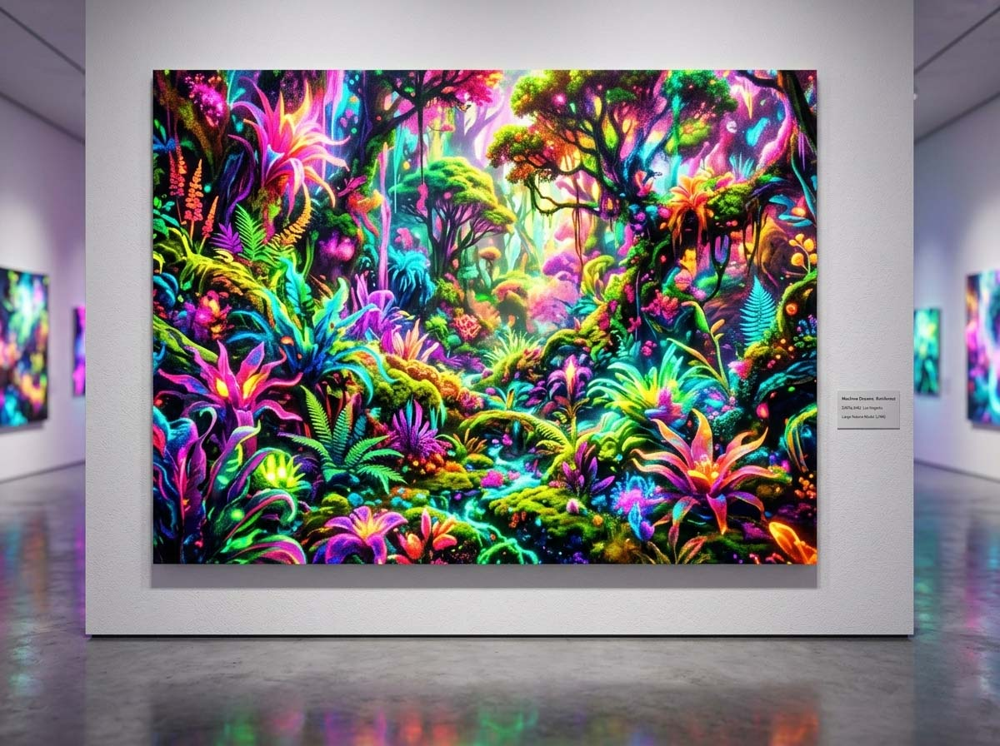

# Dataland, le premier musée d'œuvres de l'IA

*Vous vous demandez si l'image de couverture est tirée du catalogue officiel de présentation du musée ? La réponse est non. Elle a été générée avec une IA gratuite, en quelques secondes, à partir de rien. Gardez cela à l'esprit pendant votre lecture. Le 20 juin, Los Angeles inaugure le premier espace muséal au monde entièrement dédié à l'art génératif. Entre datasets éthiques, forêts amazoniennes reconstruites en pixels et une question que personne ne parvient encore à trancher : tout cela est-il de l'art ? Une critique circule depuis des mois dans les studios d'artistes numériques et dans les fils de discussion les plus bruyants d'Internet, et que l'on pourrait résumer ainsi : « Vous construisez un musée sur des instructions que les gens donnent à l'IA et vous appelez cela de l'art. » C'est une phrase tranchante. Et le 20 juin 2026, elle trouvera sa réponse la plus concrète, ou peut-être sa provocation la plus coûteuse, lors de l'ouverture de [Dataland](https://dataland.art/about), le premier musée mondial entièrement dédié à l'art génératif par intelligence artificielle.*

Le siège est celui qui, en termes de symbolisme architectural, ne pourrait être plus chargé : The Grand LA, le complexe conçu par Frank Gehry au cœur du Grand Avenue Cultural District de Los Angeles, à quelques pas du Walt Disney Concert Hall, du Broad Museum et du MOCA. Un quartier où chaque bâtiment est déjà un manifeste esthétique avant même d'ouvrir ses portes. Dataland, cofondé par l'artiste turco-américain Refik Anadol et par son associée et compagne Efsun Erkılıç, occupe environ 25 000 mètres carrés, dont près d'un tiers, détail non négligeable, est destiné au matériel informatique (hardware) nécessaire pour faire fonctionner le tout.

L'exposition inaugurale s'intitule *Machine Dreams: Rainforest* et fonctionne comme suit : un modèle d'intelligence artificielle entraîné sur des données écologiques collectées dans seize forêts tropicales de la planète génère, en temps réel, des visions de nature qui n'existent pas, des sons d'espèces qui n'existent peut-être plus, des parfums synthétisés par un algorithme. L'Infinity Room, l'une des cinq galeries, a été décrite comme le lieu où l'on peut écouter des enregistrements de 1987 d'un oiseau hawaïen désormais éteint tout en respirant une odeur de forêt qu'aucun nez humain n'a jamais flairée dans cette combinaison précise. Comme dans certains chapitres d'*Annihilation* de Jeff VanderMeer, on a cette sensation d'être à l'intérieur d'un écosystème qui répond à ses propres règles, pas tout à fait hostile, pas tout à fait compréhensible.

## L'homme qui peint avec les données

Refik Anadol, né à Istanbul en 1985 et installé à Los Angeles en 2012 pour étudier le design des médias à l'UCLA, n'est pas arrivé là par hasard. Il a construit sa carrière autour d'une idée précise : les données ne sont pas seulement des informations, elles sont un matériau plastique, capable de devenir forme, couleur, mouvement. Ce qu'il appelle le *data painting* est une approche dans laquelle d'énormes archives numériques, des collections de musées, des enregistrements climatiques, des mémoires urbaines, sont traités par des systèmes de machine learning pour produire des installations visuelles à l'échelle architecturale.

Le moment de la consécration institutionnelle est arrivé en 2022, lorsque le MoMA de New York a accueilli *Unsupervised*, une installation dans le foyer du musée qui réélaborait deux cents ans de collection en flux génératifs continus. C'était la première fois que le temple de l'art moderne new-yorkais embrassait aussi explicitement un travail construit entièrement autour de l'intelligence artificielle. En 2025, le *TIME* l'avait inclus dans les 100 AI Impact Awards. Ses installations ont parcouru soixante-dix villes, de la Serpentine Gallery de Londres à la Sphere de Las Vegas, en passant par le Guggenheim de Bilbao.

Avec Dataland, Anadol et Erkılıç n'ouvrent pas une simple exposition temporaire. Ils déclarent que l'art de l'IA mérite une maison permanente, une institution qui le traite non pas comme une expérience de laboratoire ou une curiosité de foire technologique, mais comme un médium ayant le même statut que la sculpture ou la photographie. « Dataland n'est pas seulement un espace pour montrer de l'art fini », a déclaré Anadol. « C'est une institution vivante dédiée à la recherche, à l'éducation et à l'expérimentation éthique. »

## La machine parfaite (ou presque)

Le projet a une architecture éthique affichée avec un soin qui, par moments, rappelle les spécifications techniques d'un produit de la Silicon Valley plus que le communiqué de presse d'un musée. Le moteur de tout est le Large Nature Model (LNM), décrit comme le premier modèle d'intelligence artificielle open-source entraîné exclusivement sur des données naturelles. Les jeux de données (datasets) proviennent de partenariats avec la Smithsonian, le Cornell Lab of Ornithology et le Natural History Museum de Londres, collectés, précise-t-on, selon des protocoles éthiques vérifiables. Pas de scraping sauvage sur Internet, pas de données dérobées sans consentement.

Sur le plan énergétique, [Artnet rapporte](https://news.artnet.com/art-world/dataland-refik-anadol-opening-date-2767486) que le Large Nature Model tourne sur une infrastructure cloud alimentée à 87 % par des sources décarbonées, dans l'Oregon, et que l'impact énergétique d'une visite au musée équivaut à la recharge d'un smartphone. Une donnée de communication brillante, du genre à désarmer d'avance les objections de ceux qui, légitimement, rappellent que l'entraînement d'un grand modèle linguistique consomme autant que des centaines de vols transcontinentaux.

La structure sociétale commence comme une entité commerciale, avec une possible transition future vers le but non lucratif. Les adhésions (memberships) commencent à 350 dollars par an. Le complexe dans lequel il est inséré abrite également des appartements de luxe et un hôtel cinq étoiles. Tout cela est connu, tout cela est public. Et c'est précisément là que commence la partie intéressante de l'analyse.

## « Vous appelez cela de l'art »

Thomas Brummett est un artiste numérique dont les œuvres figurent dans les collections du Museum of Fine Arts de Houston, du Philadelphia Museum of Art et du Museu de Arte Moderna de Rio de Janeiro. Lorsque Dataland a annoncé son ouverture, il a écrit sur Instagram, comme le rapporte la [NPR](https://www.npr.org/2026/04/25/nx-s1-5799511/dataland-refik-anadol-los-angeles-ai-art-museum) : « Nous construisons un musée basé sur des instructions données à l'IA et nous appelons cela de l'art. Ça n'en est pas et ça n'en sera jamais. Au mieux, c'est du divertissement de second ordre. »

Brummett n'est pas un luddite. Il utilise des techniques numériques dans son travail. Mais son objection touche un nerf ancien : la question de l'auctorialité. Que fait, exactement, l'artiste dans un processus génératif ? Il sélectionne un dataset, définit des paramètres, choisit ce qu'il montre et ce qu'il écarte. Il est curateur, programmeur, réalisateur, mais est-il auteur au sens où Rembrandt était l'auteur d'une toile, ou Coltrane celui d'un solo ? La question n'a pas de réponse consensuelle, et c'est probablement ainsi que cela doit être.

Nous avons déjà rencontré cette tension dans ces pages, en parlant de la [musique générée par l'IA](https://aitalk.it/it/AI-Musica-Copyright.html) avec le cas The Velvet Sundown, et de [Tilly Norwood](https://aitalk.it/it/tilly-norwood-ai-actor.html), la première actrice complètement synthétique à intéresser les agences de Hollywood. Dans tous ces cas, le point de friction est le même : quand la machine fait le travail « visible », la mélodie, le visage, l'image, où se trouve l'intention humaine qui transforme la technique en expression ?

La comparaison historique souvent évoquée dans ces débats est celle de la photographie, balayée pendant des décennies comme étant « mécanique » et donc non-art, avant que Cartier-Bresson et Diane Arbus ne démontrent que le médium importe peu face à l'intention. Mais il y a une différence structurelle : le photographe choisit l'instant, la lumière, la composition, chaque cliché est unique. Une œuvre générative est, par définition, réplicable, muable, évolutive. Qui possède la version « authentique » de *Machine Dreams: Rainforest* qui tourne le 20 juin 2026 à 15h00 ? Et celle de 15h01 ?

## La tension que le billet ne couvre pas

Il y a une autre faille dans l'architecture éthique de Dataland, plus subtile mais non moins pertinente. [Le débat sur l'auctorialité dans l'IA créative](https://aitalk.it/it/ai-creativity-ethics.html) que nous avons exploré précédemment soulevait une question précise : qui en profite, et qui en paie le prix, lorsqu'un système automatisé occupe un espace qui appartenait auparavant au travail humain ?

Dataland naît comme une entité à but lucratif au sein d'un complexe immobilier de luxe. L'adhésion annuelle à 350 dollars définit déjà un profil de visiteur. Pendant ce temps, des centaines d'artistes qui travaillent avec l'IA, sans le pedigree d'Anadol, sans le partenariat avec la Smithsonian, sans la capacité de construire un Large Nature Model propriétaire, continuent d'opérer sur un marché où, selon une étude d'Artsy, seulement 9 % des galeries mondiales considèrent l'art de l'IA comme un médium pleinement légitime. Dataland pourrait faire évoluer ce chiffre. Mais il pourrait aussi cristalliser une hiérarchie : l'art de l'IA « certifié » de ceux qui peuvent se permettre l'opération institutionnelle, et tout le reste.

La promesse de transparence sur les données est réelle et vérifiable, du moins en partie, le Large Nature Model est open-source, les jeux de données sont documentés. Mais la question de savoir qui vérifie reste ouverte. Les partenaires institutionnels (Smithsonian, Cornell, Natural History Museum) apportent de la crédibilité, pas une capacité d'audit continu. Et la propriété intellectuelle d'une œuvre qui évolue en temps réel, générant des configurations sans cesse nouvelles, est un territoire juridique sur lequel le droit d'auteur mondial n'a pas encore de coordonnées stables. Comme nous l'avons vu en analysant [la créativité à l'ère de l'IA générative](https://aitalk.it/it/AI-Creazione-Contenuti.html), l'écart entre ce que la technologie rend possible et ce que le cadre réglementaire parvient à régir continue de se creuser.

## L'IA qui n'entre pas par la porte

On arrive ici au problème le plus intéressant, celui qu'aucune adhésion à 350 dollars ne parvient à acheter : le fossé entre l'IA que Dataland montre et l'IA qui agit dans le monde.

À l'intérieur du musée, il y aura une IA convenable. Des données éthiques, des forêts amazoniennes élaborées avec soin, des parfums synthétiques non invasifs, tout est soigné, tout est magnifique, tout est « sous curatelle certifiée », pour reprendre une formule qui circule dans la critique d'art numérique. Une IA qui rassure, qui montre comment la technologie peut être belle et contrôlée et même émouvante dans sa tentative de recréer la voix d'un oiseau éteint.

À l'extérieur, dans cette même semaine de juin 2026 où Dataland ouvre ses portes, une autre IA existe. Celle que le Forum Économique Mondial a définie comme la protagoniste du « premier cycle électoral où les deepfakes franchissent le seuil au-delà duquel on ne les distingue plus du réel ». Celle qui génère des vidéos de personnalités publiques décédées, avec les conséquences que Zelda Williams a décrites publiquement à propos de son père Robin, diffusées sur des plateformes qui peinent à suivre la vitesse de production. Celle qui est utilisée dans les tribunaux, dans les campagnes électorales, dans la désinformation sanitaire.

Cette IA n'entrera pas à Dataland. Non pas parce que quelqu'un l'en empêche délibérément, mais parce qu'un musée, par nature, sélectionne, cadre, valorise, et ce qu'il valorise définit inévitablement par contraste ce qu'il exclut. Le problème n'est pas que Dataland montre de belles choses. Le problème est que le « beau », l'« éthique » et le « durable » risquent de devenir un alibi pour ne pas s'occuper de la même technologie dans ses manifestations les moins présentables.

Barry Threw, directeur artistique de la Gray Area Foundation de San Francisco, une institution qui travaille depuis des années à l'intersection de l'art et de la technologie sans le cadre luxueux d'un complexe Gehry, a déclaré à la NPR que Dataland est intéressant parce qu'il transforme des « données complexes en expérience ». C'est une synthèse honnête. Mais cela rend aussi complexe la question de ce qui reste en dehors de l'expérience.

## Ce qui reste ouvert

Un musée est toujours un argument, avant même d'être un bâtiment. Dataland soutient que l'art de l'IA a atteint la maturité institutionnelle, qu'il peut côtoyer le Broad et le MOCA sans se sentir comme un parent pauvre de la contemporanéité, que la technologie générative peut être éthiquement fondée, écologiquement responsable, culturellement pertinente.

C'est un argument solide, construit avec soin et des ressources considérables. Mais les arguments solides méritent des questions solides. L'art de l'IA « certifié » par Dataland aidera-t-il ou obscurcira-t-il le débat sur celui qui n'est pas certifié ? Un modèle open-source est-il vraiment transparent quand la compétence nécessaire pour le vérifier est accessible à peu de personnes ? Le fait qu'une visite consomme l'énergie d'une recharge de téléphone change-t-il quoi que ce soit à la question plus vaste du coût informatique de l'IA à l'échelle mondiale ? Et surtout : un musée qui naît à but lucratif dans un complexe de luxe, et qui pose sa mission éducative comme un objectif futur, est-il en train de construire de la culture ou de construire un marché ?

Refik Anadol a déclaré que Dataland sera « une institution vivante ». Les institutions vivantes changent, s'adaptent, trahissent parfois leurs prémisses initiales et parfois les dépassent. Le 20 juin est un début, pas une réponse. Et c'est peut-être exactement là le point : les meilleurs musées ne résolvent pas les questions. Ils les rendent impossibles à ignorer.
