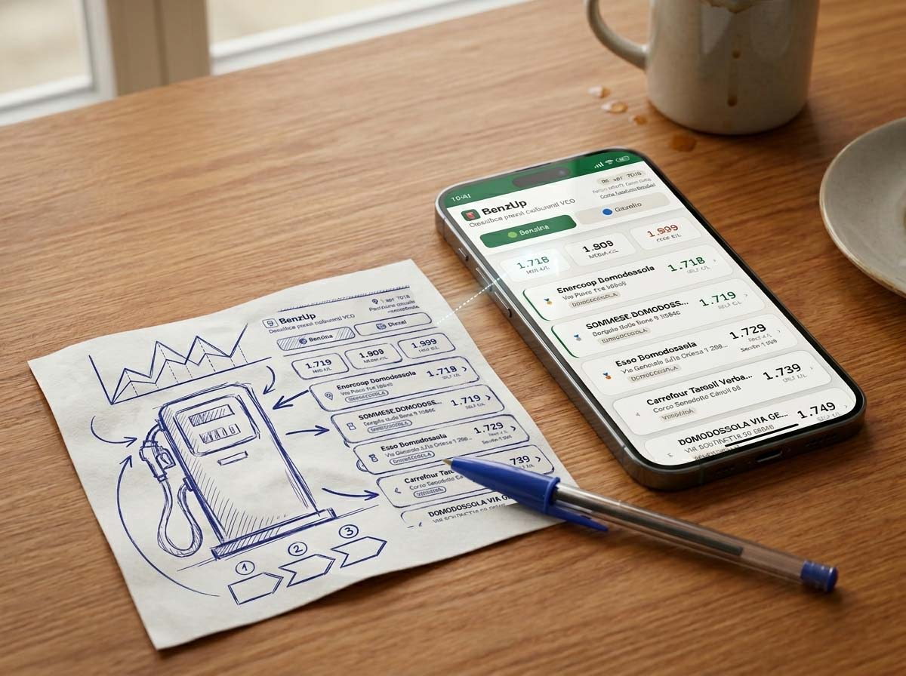
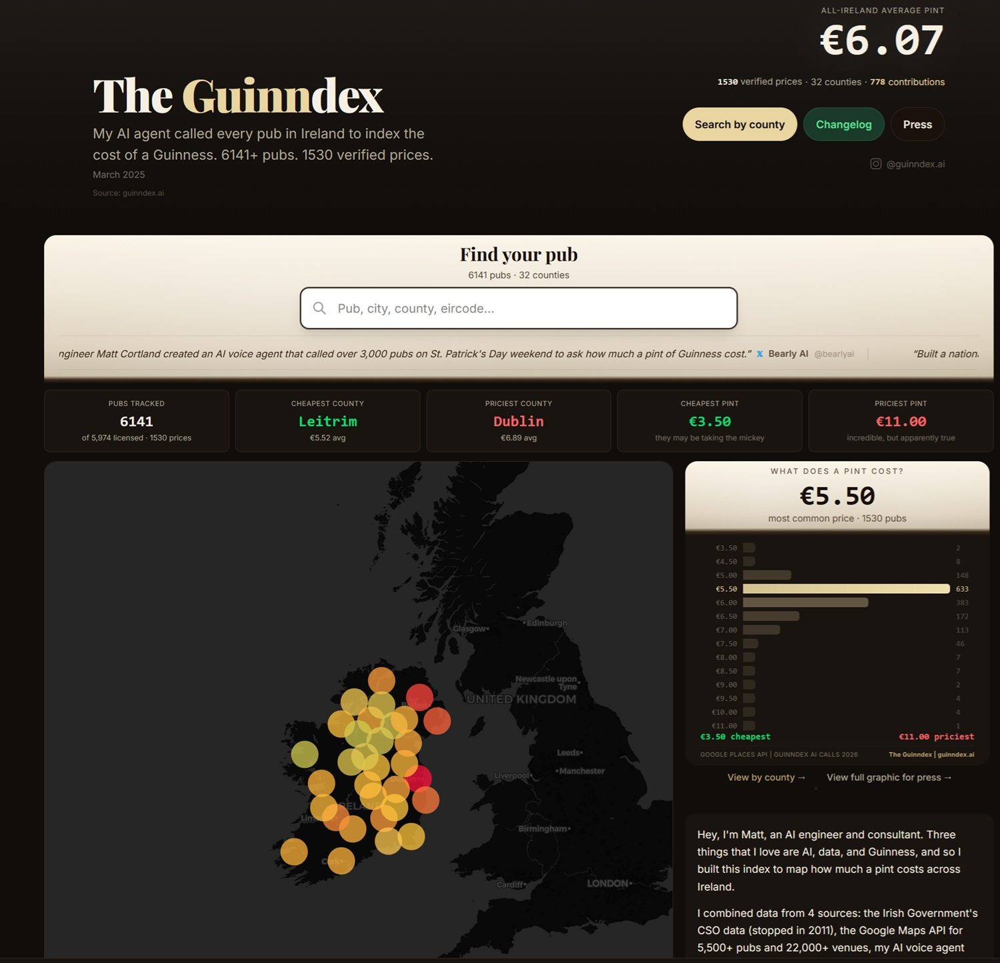
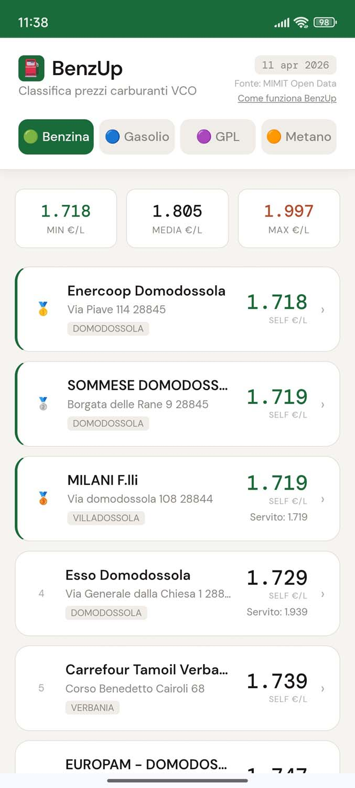

# BenzUp: he creado una aplicación sin escribir una sola línea de código

*Hay un momento preciso en el que una idea deja de ser una fantasía de bar y se convierte en algo concreto. En mi caso, ese momento tuvo como protagonistas, por orden: el coste de la gasolina, un ingeniero estadounidense molesto por una cerveza cara en Dublín, y un modelo de inteligencia artificial accesible para cualquiera con una conexión a Internet. El resultado se llama [BenzUp](https://benzup.netlify.app), es gratuito, no hace nada revolucionario, y quizás sea precisamente por eso por lo que merece la pena contarlo.*

En las últimas semanas, entre amigos, colegas y conocidos, el tema del alto precio del combustible se había convertido en una presencia fija en las conversaciones. No es que fuera una novedad absoluta, entiéndase: el precio de la gasolina ha sido siempre uno de los temas nacionales por excelencia, mal que le pese a quien preferiría hablar de otra cosa. Pero la situación internacional actual había subido aún más el volumen del debate, y a menudo nos encontrábamos preguntándonos dónde convenía repostar, qué gasolineras eran más honestas, si valía la pena hacer algunos kilómetros más para ahorrar algo. Preguntas legítimas a las que nadie tenía una respuesta rápida y verificable.

Yo, mientras tanto, observaba, tomaba nota mentalmente y no hacía nada. Como se hace con la mayoría de las buenas ideas: se dejan decantar hasta que llega algo que las desbloquea.

## Llega la Guinness

El desbloqueo llegó una mañana en forma de una noticia que nunca imaginé leer. Matt Cortland, un ingeniero estadounidense con raíces irlandesas y base en Londres, se había encontrado pagando 7,80 euros por una pinta de Guinness en un pub de Dublín. Una cifra que, para quien conoce la relación casi sagrada entre los irlandeses y su cerveza nacional, es poco menos que una ofensa. Investigando, Cortland descubre que la Oficina Central de Estadísticas de Irlanda había dejado de monitorizar los precios de la cerveza en 2011, dejando un vacío informativo de catorce años. ¿Su reacción? Construir un agente de voz llamado Rachel, dotado de acento norirlandés, que en el fin de semana de San Patricio de 2026 llamó a unos 2.300 pubs en los 32 condados de la isla planteando una sola pregunta: ¿cuánto cuesta una pinta de Guinness? El coste de toda la operación: unos doscientos euros. El resultado: el [Guinndex](https://guinndex.ai), un mapa interactivo de los precios de la Guinness en Irlanda, elaborado mediante Claude de Anthropic a partir de las más de 1.200 respuestas recogidas. Precio más común detectado: 5,50 euros por pinta. Récord absoluto: 11 euros en el The Temple Bar Pub de Dublín, que confirma su vocación de desplumar a los turistas con una coherencia casi admirable.

El objetivo declarado de Cortland es explícito: "Quiero ver si podemos reducir colectivamente el coste de una pinta en toda Irlanda". El Guinndex se ha convertido en una plataforma de crowdsourcing abierta, donde cualquiera puede informar de los precios y contribuir a mantenerlo actualizado. Y ya hay algunas primeras señales de descenso de los precios, pero por ahora es difícil correlacionarlas con la iniciativa.

La historia es simpática, la idea es brillante, la ejecución es elegante. Pero, sobre todo, al leerla, me hizo saltar ese resorte que llevaba semanas esperando. Si alguien había usado la IA para mapear el precio de la cerveza en toda Irlanda gastando doscientos euros, yo podía usarla para construir algo útil para los automovilistas sin gastar ni un céntimo. No tenía la pretensión de hacer bajar el precio de la gasolina, como era la esperanza de Cortland de hacer bajar el de la Guinness, pero al menos podría dar una orientación rápida sobre dónde convenía detenerse.

[Captura de pantalla de Guinndex.ai](https://guinndex.ai/)

## Los datos ya estaban allí, gratis

Antes de lanzarse de cabeza al desarrollo, siempre se impone un poco de investigación en línea. Y aquí llega la primera sorpresa agradable: el Ministerio de las Empresas y del Made in Italy publica cada mañana, en formato abierto y descargable por cualquiera, los precios de los combustibles practicados por todos los distribuidores italianos. Dos archivos CSV, actualizados diariamente, que contienen el registro completo de las instalaciones activas en todo el territorio nacional, con dirección, coordenadas GPS, gestor y bandera, y los precios comunicados por los gestores, distinguidos por tipo de combustible y por modalidad de suministro, autoservicio o atendido. Los datos se publican con licencia IODL 2.0, que permite la reutilización libre incluso para fines comerciales, siempre que se cite la fuente. El Ministerio no se limita a tolerar el uso de estos datos: lo incentiva activamente.

Era exactamente lo que necesitaba. Nada de scraping, nada de zonas grises legales, nada de dependencia de API de terceros que podrían cambiar las condiciones de uso de un día para otro. Datos oficiales, abiertos, actualizados cada mañana.

En ese momento decidí mantenerme pequeño y enfocado: nada de aplicación nacional, nada de ambiciones de escala. Solo mi provincia, el VCO (esa sigla VB en los datos del Ministerio), filtrada y servida de forma sencilla y rápida. Un prototipo ligero para ver si la cosa funcionaba de verdad.

## El prompt como acto de diseño

Quien trabaja con la IA de forma incluso semirregular sabe que la calidad del resultado depende de forma determinante de la calidad de la entrada. Un prompt vago produce resultados vagos. Este no es un artículo sobre el prompting, pero merece la pena dedicarle un párrafo, porque fue la parte más artesanal de toda la experiencia.

Establecí los requisitos con cierta precisión. En el plano técnico: una aplicación web en HTML, CSS y JavaScript puro, con una función serverless en Netlify para gestionar las llamadas al MIMIT y evitar los problemas de CORS que impiden a los navegadores hacer peticiones directas a dominios externos, diseño responsive optimizado para móviles, filtrado de los datos de la provincia del VCO, dos clasificaciones ordenadas por precio de menos a más costoso, una para gasolina y otra para gasóleo. En el plano de la interfaz: un conmutador (toggle) visible para pasar de un combustible a otro, la información esencial de cada gasolinera, un panel de detalles accesible al tocar cada instalación, fecha de referencia y fuente destacadas. En el plano estético: estilo moderno, tipografía cuidada, paleta sobria, algo que pareciera diseñado y no generado.

Elegí deliberadamente usar Claude Sonnet 4.6, la versión accesible de forma gratuita, precisamente porque quería probar qué era posible hacer con las herramientas disponibles para cualquiera, no solo para quienes tienen una suscripción premium o competencias de desarrollador senior. Si funcionaba con el modelo gratuito, la historia tenía sentido también para quien lee sin formación técnica.

En un par de minutos, unas 750 líneas de código. Un archivo HTML con todo incluido: estructura, estilo, lógica, gestión de errores, animaciones, panel de detalles con deslizamiento (swipe) para cerrarlo. Ya me había pasado usar modelos de IA para escribir pequeños fragmentos de código, alguna función, un componente aislado. Nunca, sin embargo, algo de esta complejidad de un solo golpe. La primera sorpresa fue abrir ese archivo en el navegador del PC: todo funcionaba exactamente como lo había descrito. Diseño correcto, conmutación entre gasolina y gasóleo, panel de detalles, animaciones fluidas. Obviamente sin datos reales, pero la estructura era exactamente la solicitada.

## Del navegador a la producción

Tener un archivo HTML que funciona en local es una cosa. Tenerlo en línea, con datos reales que llegan del Ministerio, es otra. Este es el paso en el que una mínima familiaridad con las herramientas disponibles marcó la diferencia.

Creé un repositorio en GitHub, cargué los archivos, vinculé el repositorio a mi cuenta de Netlify. Netlify detectó automáticamente la configuración, activó la función serverless que descarga y filtra los CSV del MIMIT, y en pocos minutos la aplicación estaba en línea. Segunda sorpresa: funcionaba. Los datos llegaban, las gasolineras de la provincia VB aparecían ordenadas por precio, el conmutador entre gasolina y gasóleo respondía como se esperaba.

En ese momento hice algo que siempre recomiendo cuando se trabaja con código generado por la IA: un control cruzado con otra herramienta. Conecté a Jules, el agente de IA asíncrono de Google integrado directamente en GitHub, y le pedí un análisis del código. Jules no señaló problemas relevantes, lo cual no es una garantía absoluta, pero es un segundo par de ojos computacionales sobre el trabajo realizado.

Con Jules realicé después algunas integraciones que hicieran la aplicación más parecida a una nativa. Se añadió un archivo manifest JSON que permite la instalación en el teléfono directamente desde el navegador, sin pasar por las tiendas, un icono personalizado y una página dedicada a la información útil, con explicación del funcionamiento, del origen de los datos, de los límites del sistema y de las instrucciones para la instalación en Android y iPhone. Esa página, como veremos, resultó ser más importante de lo previsto.

[Captura de pantalla de BenzUp](https://benzup.netlify.app)

## Los límites son parte del producto

Un día de prueba personal, luego la difusión a un círculo de amigos con la petición explícita de informar de cualquier problema. Los comentarios fueron positivos, pero llegó un aviso recurrente: los precios de algunas gasolineras parecían parados desde hacía días. Ningún error de la aplicación, simplemente la realidad del sistema: los gestores están obligados por ley a comunicar las variaciones de precio al Ministerio, pero no todos lo hacen con frecuencia diaria. Además, los datos se publican cada mañana referidos a las 8:00 del día anterior, y la actualización efectiva en la aplicación puede retrasarse algunas horas debido a los tiempos de publicación del Ministerio y a la infraestructura técnica en la que se aloja la aplicación, sobre la que no tengo control directo.

Ese aviso llevó a mejorar la página informativa, añadiendo una explicación clara de estos mecanismos e indicando que al tocar la ficha de una gasolinera individual se puede verificar la fecha de la última actualización enviada al Ministerio. La transparencia no es una opción, es parte integrante de un servicio que se basa en datos públicos y que no tiene ningún interés en parecer más preciso de lo que es.

Llegó también una petición precisa: añadir GLP y metano, combustibles que para muchos automovilistas de la provincia son de todo menos secundarios. En los días siguientes los integré, y ahora BenzUp muestra las clasificaciones para los cuatro tipos de combustible.

## Tres días, 800 visitas

La aplicación lleva tres días en línea mientras escribo este artículo (11 de abril de 2026). La lancé con una publicación en el blog local que gestiono desde hace muchos años, [Verbania Notizie](https://www.verbanianotizie.it), sin publicidad de pago, sin campañas, sin estrategia de crecimiento. En tres días, unas 800 visitas. Cifras insignificantes a escala nacional, probablemente irrelevantes incluso a escala local si se miden con los parámetros del marketing digital. Pero ese no es el punto.

El punto es que, de una idea nacida en una conversación sobre el encarecimiento del combustible a una aplicación funcionando en producción, consultada por cientos de personas reales de mi provincia, pasó menos de una semana. Sin escribir una línea de código, sin presupuesto, sin un equipo de desarrollo. Con un conocimiento del ecosistema de las herramientas digitales gratuitas disponibles, un prompt construido con cuidado y la disposición para iterar, corregir y mejorar basándose en los comentarios reales.

## Actualizaciones

Este artículo tuvo el placer de ser publicado en la revista de Codemotion, así que lo publico hoy en el portal, dos meses después de su redacción. Por ello, es conveniente ofrecer una breve actualización.

En los dos meses transcurridos desde la publicación de este artículo, BenzUp ha seguido evolucionando, manteniendo siempre la misma filosofía: cero costes, sin infraestructura compleja, todo construido con las herramientas gratuitas ya disponibles.

El desarrollo más significativo es su expansión geográfica: la aplicación ahora cubre toda la región del Piamonte, con las ocho provincias y la posibilidad de filtrar por municipio mediante un menú específico. De ser una herramienta hiperlocal diseñada para conductores en la zona VCO, se ha convertido en una referencia para cualquiera que viaje o transite por la región.

A nivel técnico, la arquitectura se ha rediseñado sustancialmente. Los datos ya no se procesan en tiempo real con cada solicitud, sino que se pregeneran cada mañana en archivos estáticos servidos directamente desde la CDN de Netlify, con un impacto inmediato y notable en la velocidad de carga. Una acción de GitHub programa automáticamente el proceso, verifica que el Ministerio haya publicado datos actualizados antes de continuar y genera un archivo JSON para cada provincia. La interfaz lee el archivo correcto y lo muestra al instante, sin utilizar funciones sin servidor.

También se ha añadido un sistema de semáforo para indicar la actualidad de los datos de cada distribuidor: verde si el precio se actualizó en las últimas 24 horas, amarillo en las últimas 48 horas y rojo después de ese plazo. Esta es una forma sencilla y visual de proporcionar a los usuarios información que antes requería acceder a la página detallada de cada distribuidor.

Finalmente, un formulario de reporte, accesible desde la página de cada distribuidor, permite a los usuarios informar sobre cualquier discrepancia, precios desactualizados, plantas cerradas o errores en los datos. Esta pequeña medida de calidad colectiva es coherente con la naturaleza voluntaria y transparente del proyecto.

## Consideraciones finales

Esto no es un himno al vibe coding, esa práctica de generar código de forma rápida y aproximada confiando ciegamente en la IA sin entender qué se está haciendo. El vibe coding, por lo demás, parece ya encaminado a ser superado por un enfoque más estructurado y profesional: escribir las especificaciones del proyecto en archivos markdown detallados, para pasarlos a los agentes de código como instrucciones precisas y verificables, en lugar de confiar en prompts improvisados. Hablé de ello en un [artículo en este mismo portal](https://aitalk.it/it/codespeak.html), y la diferencia en términos de control y calidad del resultado es sustancial. Pero esa es verdaderamente otra historia. Lo que quiero contar es algo más sencillo y quizás más interesante: la IA ha reducido de forma radical la distancia entre la idea y su realización, incluso para quienes no tienen competencias específicas de programación.

Esto no significa que los programadores, ingenieros y arquitectos de software se hayan convertido en figuras superfluas, al contrario. Llevar un prototipo funcional a producción es una cosa; construir algo estable, seguro y escalable es otra: para eso se necesitan competencias reales, experiencia y una comprensión profunda de los sistemas que ningún prompt, por muy bien construido que esté, puede sustituir.

En mi caso, cierta familiaridad con las herramientas en línea y una curiosidad de usuario avanzado, no de experto, permitió llevar el proyecto a producción en lugar de detenerlo en prototipo. Pero el umbral ha bajado para todos. Cualquiera que tenga una idea clara, la paciencia para construir un prompt decente y las ganas de aprender los mecanismos mínimos de despliegue en plataformas como Netlify o Vercel puede hacer lo mismo.

En algún lugar del mundo, alguien con la idea adecuada, un poco de iniciativa y una cuenta gratuita en Claude está probablemente construyendo en este momento algo que aún no existe. No el nuevo Facebook, quizás, pero sí algo útil para las personas de su entorno. Y eso ya me parece suficiente.

Mientras tanto, si sois conductores del Piemonte (por ahora) y queréis saber dónde repostar gastando menos, [BenzUp está ahí](https://benzup.netlify.app) esperando. Gratuito, independiente, con todos sus límites bien declarados.

Y si llegara a triunfar y terminara con una salida multimillonaria hacia alguna gran tecnológica de Silicon Valley, os espero a todos en la gran fiesta que daré en mi megavilla a orillas del Lago Maggiore porque, aunque sea inmensamente rico, me mantendré fiel a donde todo empezó.
