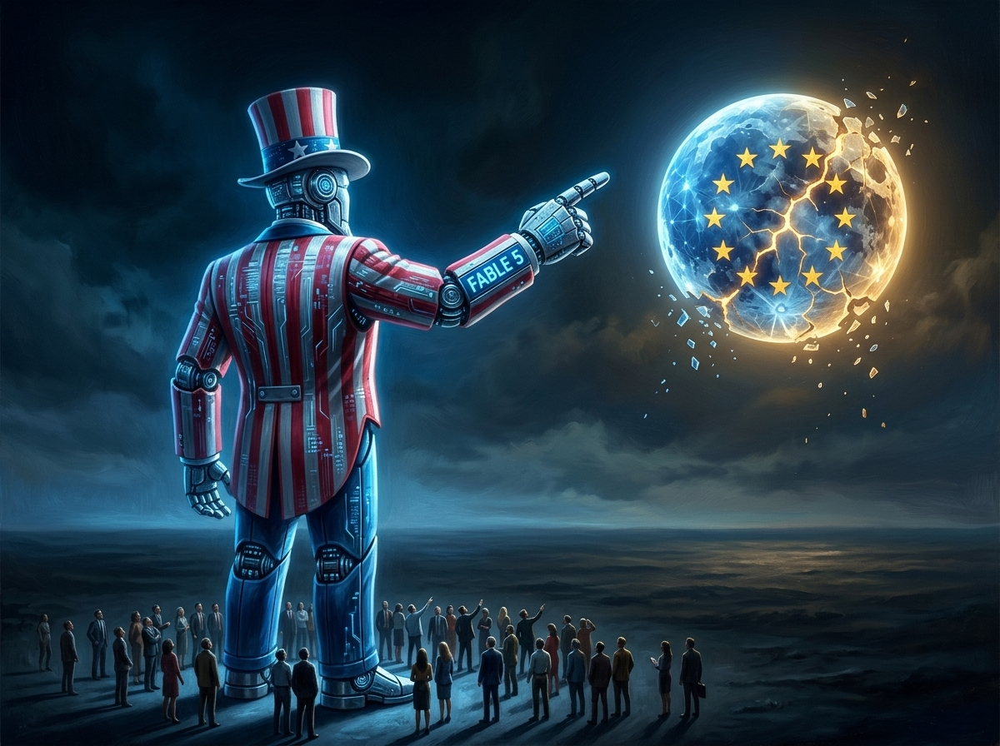
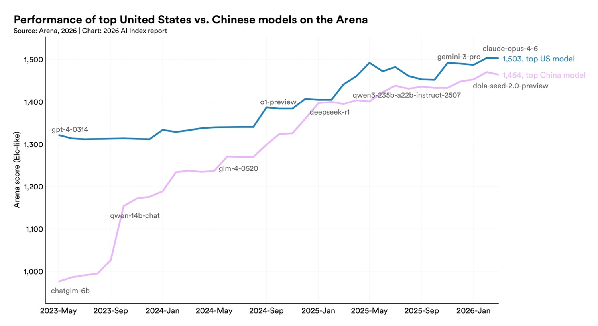

# La guerra algorítmica. Fable 5 el dedo, Europa la Luna

*El 12 de junio de 2026 el Departamento de Comercio de los Estados Unidos envió a Anthropic una carta que, en los círculos del sector, circuló con la velocidad de las noticias que dan miedo de verdad: suspensión obligatoria de los modelos Fable 5 y Mythos para cualquier ciudadano extranjero, dentro o fuera de las fronteras americanas. La motivación oficial es la seguridad nacional. Grupos vinculados a Pekín habrían obtenido acceso a Mythos, la versión sin guardarraíles (guardrails) pensada para aplicaciones de ciberseguridad, eludiendo los sistemas de control de acceso. Una violación grave, si se confirma, no cabe duda. Pero quedarse en esta noticia, como están haciendo muchos, obsesionados con los nombres Fable 5 y Mythos como si fueran personajes de una serie distópica, es como mirar el dedo y no la luna.*

La verdadera pregunta no es si China ha forzado los sistemas de Anthropic. La verdadera pregunta es qué nos cuenta ese bloqueo sobre una partida mucho más amplia, donde los Estados Unidos gastan veintitrés veces más que China por una ventaja que se ha reducido al 2,7%, donde la India está invirtiendo 1.250 millones de dólares en silencio, y donde Europa corre el riesgo de pagar la cuenta de una guerra en la que no participa.

Lo que está sucediendo en el mundo de la inteligencia artificial no es un conflicto a dos entre Washington y Pekín. Es un tablero multipolar donde cada movimiento revela quién tiene soberanía tecnológica y quién, en cambio, padece la soberanía tecnológica. Y nosotros los europeos, en este momento, pertenecemos a la segunda categoría.

## Desenchufar el sistema

La carta del Departamento de Comercio no llegó de la nada. Anthropic ya había operado un primer endurecimiento en septiembre de 2025, bloqueando el acceso a las organizaciones controladas en más del 50% por entidades chinas, un movimiento que en aquel momento fue descrito como la primera vez en la historia reciente en que una sociedad americana de inteligencia artificial limitaba activamente las ventas a China. Un precedente significativo, pero que evidentemente no había sido suficiente.

El bloqueo de junio de 2026 es de un alcance totalmente distinto: afecta a cualquier ciudadano extranjero, sin distinción de nacionalidad, se encuentre donde se encuentre. No es una medida quirúrgica contra Pekín. Es una nacionalización de facto del acceso a los modelos de punta de Anthropic. La motivación pública habla de accesos no autorizados a Mythos, un sistema diseñado para operar sin los filtros de seguridad habituales en contextos especializados de análisis de vulnerabilidades informáticas. Un sistema de este tipo, en las manos equivocadas, sería efectivamente una herramienta poderosa.

Lo que aún no está claro es cómo se produjo la violación. La hipótesis del jailbreak, es decir, del acceso obtenido eludiendo las protecciones con técnicas de prompt engineering, ha circulado, pero no ha sido confirmada oficialmente. Lo que se sabe es que Anthropic ya había recurrido a un tribunal federal de San Francisco en marzo de 2026 para impugnar algunas decisiones gubernamentales sobre sus modelos, señalando una tensión preexistente entre la sociedad y las autoridades reguladoras. Se sabe también, según algunas reconstrucciones periodísticas, que el soplo que aceleró el bloqueo podría haber llegado de círculos cercanos a Amazon, que es el principal inversor institucional de Anthropic, con miles de millones comprometidos en la operación. Un detalle que transforma esta historia de simple cuestión de seguridad en un episodio de geopolítica corporativa.

La pregunta a la que nadie ha respondido aún de forma satisfactoria es esta: ¿era realmente necesario el bloqueo total, o era también una señal? ¿Un mensaje dirigido no solo a China, sino a todos los gobiernos del mundo, sobre quién controla el acceso a los modelos más avanzados?

## Pekín dice no a Meta

Si el bloqueo a Anthropic es la noticia del día, el caso Manus es la noticia del trimestre, y cuenta la misma historia desde un ángulo especular. En abril de 2026 la Comisión Nacional de Desarrollo y Reforma de China ordenó el bloqueo de la adquisición por parte de Meta de Manus, una startup de inteligencia artificial que se había presentado al mundo como la primera plataforma de AI completamente autónoma. El valor de la operación superaba los dos mil millones de dólares. Pekín dijo no.

Es la primera vez que China utiliza de forma tan explícita las medidas de control sobre las inversiones extranjeras introducidas a finales de 2020, una herramienta que había permanecido en gran medida inerte durante años y que ahora se agita con decisión. La motivación oficial es que la adquisición habría supuesto una transferencia inaceptable de tecnologías avanzadas hacia los Estados Unidos. En otras palabras: los modelos de Manus, desarrollados por investigadores chinos, no saldrán de China. No importa cuán grande sea el cheque de Zuckerberg.

[TechCrunch ha informado](https://techcrunch.com/2026/06/13/meta-reportedly-moves-to-unwind-2b-manus-deal-after-beijings-demand/) de que Meta se está moviendo para disolver el acuerdo tras la orden de Pekín, una rendición silenciosa que dice mucho sobre el equilibrio real de poder. Pero el caso Manus no es aislado: China está construyendo una serie de barreras simétricas a las americanas. Los investigadores y directivos de las principales empresas tecnológicas deben obtener ahora aprobación gubernamental antes de viajar al extranjero. Las mayores sociedades de inteligencia artificial chinas, Moonshot AI, StepFun, ByteDance, deben informar al gobierno antes de aceptar inversiones de fondos americanos. Y el llamado "Singapore washing", es decir, la estratagema de trasladar formalmente la sede legal a un país neutro para eludir las restricciones, ha sido explícitamente clausurado.

El embajador chino en EE. UU., Xie Feng, había dicho con cierta claridad ya en junio de 2023: "No somos los primeros en instigar, pero no retrocederemos ante las provocaciones". Aquella frase, en aquel momento, parecía diplomacia. Hoy parece un calendario.

## El muro de en medio

Para entender el caso Manus es necesario insertarlo en un marco más amplio de política regulatoria que ambas superpotencias llevan construyendo, ladrillo a ladrillo, desde hace años. La administración Biden ya había dado al Tesoro americano el poder de prohibir fusiones, operaciones de private equity e inversiones en capital riesgo en sociedades chinas activas en la inteligencia artificial, la computación cuántica y los semiconductores. En enero de 2025 introdujo la llamada AI Diffusion Rule, una regulación que imponía restricciones a la exportación de chips Nvidia a unos 120 países, con bloqueo total para China, Rusia, Irán y Corea del Norte.

Los dos movimientos, el americano de restringir las inversiones entrantes en la China tecnológica, el chino de bloquear el talento y las tecnologías salientes, producen el mismo resultado: un muro. Lo llaman "decoupling", desacoplamiento, pero la palabra es engañosa porque sugiere una separación ordenada y consensuada. Lo que está sucediendo se parece más a una separación en régimen de conflicto, donde ambas partes construyen vallas mientras declaran que solo quieren protegerse.

El resultado práctico es que el mundo de la inteligencia artificial se está fragmentando en ecosistemas separados. No del todo estancos aún, como demuestra el hecho de que algunos investigadores siguen desplazándose, pero cada vez más diferenciados en las arquitecturas, en los datos de entrenamiento, en los estándares de seguridad, en las interfaces. Es la balcanización de internet aplicada a los modelos lingüísticos, y lleva años produciéndose de forma lo suficientemente silenciosa como para pasar inadvertida para la mayoría.

## Chips de papel, chips de silicio

Hay un frente de esta guerra donde lo que está en juego es aún más concreto, porque afecta al hardware físico sobre el que corre la inteligencia artificial. Las sanciones americanas sobre los semiconductores avanzados han cortado a China el acceso a los chips Nvidia más potentes, los que sirven para entrenar los modelos de frontera. Era, en las intenciones de Washington, el punto de estrangulamiento definitivo: sin las GPU adecuadas, China no puede jugar la misma partida.

China ha respondido en tres frentes.

El primero es la técnica del "chiplet": en lugar de producir un solo chip monolítico de alto rendimiento, difícil sin las máquinas litográficas holandesas de ASML, también sujetas a restricciones de exportación, se ensamblan varios chips menos avanzados, obteniendo un sistema que en su conjunto alcanza el rendimiento necesario. Es una solución ingeniosa, aunque no exenta de límites en términos de eficiencia energética y latencia.

El segundo frente es SMIC, la Semiconductor Manufacturing International Corporation, que ha demostrado saber producir chips con proceso de 7 nanómetros alcanzando [cerca del 60% del rendimiento del H100 de Nvidia](https://www.rivista.ai/2025/10/22/chip-di-cartone-o-realta-la-cina-sfida-nvidia-nel-calcolo-analogico/), un resultado que los reguladores chinos han evaluado como suficiente para muchas aplicaciones prácticas de inteligencia artificial. Tanto es así que en septiembre de 2025 las autoridades chinas de Internet ordenaron a las empresas tecnológicas interrumpir las compras de semiconductores a Nvidia, sustituyéndolos por alternativas domésticas producidas por Huawei, Cambricon, Alibaba y Baidu. Un movimiento que, en la narrativa de Pekín, es una respuesta a las sanciones americanas, pero que en la práctica acelera la creación de un ecosistema de hardware completamente separado.

El tercer frente es el más especulativo pero también el más interesante: el cálculo analógico. Investigadores de la Universidad de Pekín presentaron un chip basado en tecnología RRAM, memoria resistiva de acceso aleatorio, que en las pruebas habría mostrado un rendimiento teórico hasta mil veces superior a las GPU digitales Nvidia H100 para ciertas categorías de cálculo. La noticia circuló por los medios internacionales con tonos entre el entusiasmo y el escepticismo. Los chips analógicos tienen límites reales: son difíciles de programar, sensibles al ruido, aún lejos de la versatilidad de las GPU. Pero indican una dirección de investigación que Washington, concentrado en el paradigma digital dominante, no está siguiendo necesariamente con la misma intensidad.

El punto no es si China ha empatado o superado ya a los Estados Unidos en el hardware. El punto es que la certeza con la que Washington contaba con el embargo de chips como barrera infranqueable se ha revelado, al menos en parte, una ilusión.

## Solo el 2,7%

Llegamos a los números, porque en esta historia los números cuentan más que las declaraciones. El [AI Index Report 2026 de Stanford HAI](https://www.tomshw.it/business/cina-quasi-alla-pari-usa-intelligenza-artificiale-2026-04-17), publicado en abril, certifica algo que hasta hace tres años habría parecido ciencia ficción: la brecha de rendimiento entre los mejores modelos lingüísticos americanos y chinos ha caído al 2,7%.

Para dar la medida de cuánto ha cambiado el panorama: en mayo de 2023, cuando GPT-4 dominaba las clasificaciones, la diferencia en las puntuaciones Arena, el principal benchmark de evaluación de modelos lingüísticos basado en juicios humanos comparativos, superaba los 1.300 puntos. En marzo de 2026, Claude Opus 4.6 de Anthropic lidera la clasificación global con una puntuación de 1.503, mientras que Dola-Seed 2.0 de ByteDance le sigue con 1.464. Treinta y nueve puntos de diferencia. El 2,7%.

Los Estados Unidos han producido 50 modelos de punta frente a los 30 chinos, y en 2025 las inversiones privadas americanas en AI alcanzaron los 285.900 millones de dólares, veintitrés veces los 12.400 millones chinos. Y sin embargo la brecha se ha reducido casi a cero. ¿Cómo es posible?

Stanford ofrece algunas respuestas que van más allá de la simple narrativa de "los chinos lo copian todo". Las publicaciones chinas en el ámbito de la AI recogen el 20,6% de las citas científicas globales, frente al 12,6% americano. En la robótica industrial la relación es de nueve a uno a favor de China: 295.000 instalaciones anuales frente a 34.200. Y hay un dato que afecta al talento, quizá el más inquietante para Washington: el flujo de investigadores de AI hacia los Estados Unidos se ha reducido en un 89% desde 2017, con una caída del 80% solo en el último año. Los investigadores de DeepSeek analizados en el informe se formaron casi todos en China, con cerca del 25% que había estudiado en EE. UU. antes de regresar. Stanford habla de "transferencia de conocimiento en un solo sentido".

Dos expertos independientes, Rory Green de TS Lombard y Dominic Gorecky, sostienen que la primacía china en la AI aplicada respecto a EE. UU. y Europa está creciendo, no disminuyendo. La distinción es importante: China no está ganando necesariamente en la carrera por los modelos lingüísticos de frontera, aquellos que aspiran a replicar o superar las capacidades cognitivas humanas de forma generalizada, pero está construyendo una ventaja clara en la AI industrial, en la robótica, en la optimización manufacturera. Sectores donde el impacto económico es medible e inmediato, no una promesa futura.

El 2,7% es un número que debería hacer reflexionar a cualquiera que esté construyendo estrategias geopolíticas, económicas o industriales sobre la premisa de que la supremacía tecnológica americana en la AI es un dato adquirido.

[imagen extraída del AI Index Report 2026 de Stanford HAI](https://hai.stanford.edu/ai-index/2026-ai-index-report)

## El gigante "invisible"

Hay un tercer actor en esta historia que los medios occidentales tienden a ignorar, concentrados en el duelo EE. UU.-China como si fuera una película comercial con solo dos protagonistas. Ese actor es la India, y está haciendo cosas bastante notables.

El gobierno indio ha puesto en marcha la IndiaAI Mission con un presupuesto de 1.250 millones de dólares, articulado en investigación, aplicaciones sectoriales y formación. A esto se añade un programa de coinversión público-privada de 1.100 millones en deep tech e inteligencia artificial. No son cifras comparables a las de EE. UU., pero son cifras reales, no anuncios.

El punto más concreto es la infraestructura de cálculo. La India ha lanzado lo que los documentos gubernamentales llaman la "50.000 GPU ambition": en las dos primeras rondas de licitaciones públicas ya ha obtenido compromisos para 34.000 GPU, con 18.000 ya operativas y las restantes esperadas en los dos o tres meses siguientes. En diciembre de 2025 el gobierno declaraba 38.000 unidades ya activas. Las GPU se ponen a disposición de startups, investigadores y universidades a precios subvencionados, 65 rupias por hora (unos 0,59€), un umbral pensado para permitir incluso a pequeñas entidades académicas acceder a infraestructuras de cálculo que de otro modo serían inaccesibles.

El enfoque indio es lo que sus arquitectos definen como "tecno-legal": una integración explícita entre derecho y tecnología en la construcción de una soberanía digital que no dependa ni de Washington ni de Pekín. Para Nueva Delhi las inversiones en AI no son solo una cuestión industrial, son una herramienta de autonomía estratégica en un mundo que se está fragmentando.

El cuarto India AI Impact Summit, celebrado en febrero de 2026, fue el primero organizado en el Global South y presentó al mundo una visión articulada de cómo un país con 1.440 millones de personas, un crecimiento rapidísimo de la conectividad móvil y una reserva de talentos tecnológicos de dimensiones extraordinarias pretende competir en la nueva economía de la inteligencia artificial. Italia estuvo presente con el ministro Urso, un detalle que dice algo sobre el interés europeo por un área a menudo descuidada en los razonamientos sobre la geopolítica de la AI.

La India no ganará la carrera de los modelos lingüísticos de frontera a corto plazo. Pero está construyendo una infraestructura soberana y un ecosistema de innovación que podrían producir efectos significativos en el arco de cinco o diez años. Ignorarla, como hace la mayor parte del debate público occidental, es un error de perspectiva.

## La cuenta europea

Llegamos a la parte incómoda. La que nos afecta a nosotros.

Christine Lagarde, presidenta del Banco Central Europeo, no es conocida por sus tonos apocalípticos. Sin embargo, entre noviembre de 2025 y febrero de 2026 multiplicó las advertencias sobre la AI: Europa llega tarde respecto a China y EE. UU., Europa ya ha perdido la ocasión de ser pionera, Europa corre el riesgo de poner en peligro su propio futuro permaneciendo como espectadora. Y después, con la cautela estratégica de quien quiere abrir una puerta sin derribarla: "Europa puede ganar en la AI con la aplicación, no con la innovación". Una afirmación que es al mismo tiempo una apertura y una rendición.

Los números del [informe JRC 2025](https://www.primaonline.it/2025/06/13/444106/ai-generativa-europa-in-ritardo-su-cina-e-usa-servono-fondi-e-investimenti/) son despiadados: la Unión Europea contribuye al 7% de las actividades globales de AI generativa. China está al 60%, los Estados Unidos al 12%. Y en el frente de las inversiones, las startups europeas de inteligencia artificial han recaudado menos de una décima parte de lo que han recaudado las americanas: menos de cinco mil millones de euros en 2023 frente a más de cincuenta mil millones en EE. UU.

Pero hay un aspecto de la posición europea que va más allá de los retrasos en la inversión y que afecta a la geometría misma de la dependencia tecnológica. Cuando en enero de 2025 la administración Biden introdujo las restricciones a la exportación de los chips de AI, la medida dividió a Europa de forma neta: [17 países miembros se encontraron sujetos a limitaciones](https://www.leuropeista.it/chip-ai-le-nuove-restrizioni-usa-dividono-leuropa/), entre ellos Polonia, Rumanía, Bulgaria, Hungría, República Checa. Los otros 10, entre ellos Italia, Francia, Alemania, Irlanda y Países Bajos, entran en el grupo restringido de las 18 naciones consideradas aliados cercanos, que pueden comprar chips de AI sin limitaciones.

La división es geográficamente elocuente: separa a grandes rasgos la Europa occidental de la oriental, los países del antiguo bloque de la OTAN "histórico" de los que entraron en la Unión más recientemente. Es Washington quien decide qué países europeos tienen acceso a la tecnología estratégica y en qué medida. La Comisión Europea reaccionó con una declaración conjunta del vicepresidente Virkkunen y el comisario Šefčovič: "Creemos que es de interés económico y de seguridad para los Estados Unidos que la UE pueda comprar chips de AI sin limitaciones". Una frase que, en su cortesía diplomática, contiene una verdad brutal: Europa está pidiendo permiso.

El Parlamento Europeo usó palabras más duras, describiendo las restricciones americanas como "un desafío directo a la resiliencia económica y a la soberanía tecnológica de Europa". Pero desafiar y reaccionar son dos cosas distintas. La respuesta europea ha llegado principalmente en forma de regulación: la AI Regulation V2, finalizada en enero de 2026, introduce una clasificación de los sistemas en "alto riesgo", "riesgo medio" y "bajo riesgo", una obligación de auditoría independiente para los modelos más arriesgados, y un European AI Trust Fund de 10.000 millones de euros para apoyar a las startups del norte de Europa. Una respuesta de sistema, ciertamente, pero que llega con años de retraso respecto al desarrollo del mercado y que no aborda el problema estructural: Europa no tiene modelos lingüísticos de frontera propios, no tiene un ecosistema de chips doméstico competitivo, no invirtió como debería haberlo hecho cuando era el momento.

El CEO de Sipearl, la sociedad francesa que produce el procesador europeo Rhea, sintetizó el problema con una lucidez que no deja espacio al optimismo de fachada: las restricciones americanas sobre los chips son "una voz de alarma adicional" para una Europa que debe reducir su dependencia de los proveedores estadounidenses. Pero reducir esa dependencia requiere inversión, tiempo y una capacidad de coordinación industrial que el continente ha demostrado raramente.

El punto no es que Europa lo esté haciendo todo mal. El enfoque regulatorio es serio, la cultura de la protección de datos personales es un activo real en un mundo donde la confianza en los algoritmos se está convirtiendo en un factor competitivo, y algunas realidades industriales europeas en la AI aplicada, desde la sanidad a la automoción, desde la agricultura de precisión a las redes energéticas, son genuinamente competitivas. Pero hay una diferencia sustancial entre competir en nichos de aplicación y participar en la construcción de la infraestructura cognitiva global. Y hoy, en ese segundo plano, Europa está ausente.

## Fragmentación pragmática

¿A dónde lleva todo esto? No hacia una nueva Guerra Fría en el sentido clásico del término, con dos bloques rígidos y contrapuestos que se miran con recelo a través de un telón digital. El mundo que está emergiendo es más complicado y, en cierto sentido, más inestable.

La categoría que mejor describe el 2026 es la de la "fragmentación pragmática": un orden internacional compuesto por actores múltiples que se agrupan y desagregan por intereses concretos, acceso a recursos críticos, control de los estándares tecnológicos, soberanía energética, más que por bloques ideológicos rígidos. China bloquea Manus pero comercia con Europa. EE. UU. limita los chips pero mantiene relaciones con los países del Golfo que invierten en startups de Silicon Valley. La India corteja tanto a Washington como a Moscú sin casarse con nadie. Las líneas son difusas, las alianzas son situacionales.

En este escenario, las variables decisivas serán pocas pero cruciales. La primera es el grado de coordinación transatlántica: si EE. UU. y Europa logran construir estándares comunes sobre seguridad de los modelos, gobernanza de los datos y control de las inversiones, Occidente mantiene una posición negociadora relevante. Si siguen procediendo por separado, con Bruselas regulando y Washington actuando, la fragmentación beneficia a quien sepa jugar entre las grietas.

La segunda es la velocidad con la que China resuelva el nudo del hardware. Si el embargo de chips americano produce efectos duraderos sobre el ritmo de desarrollo de los modelos chinos de frontera, el 2,7% podría estabilizarse o ampliarse de nuevo. Si las alternativas domésticas, el cálculo analógico, los chiplets, las GPU de Huawei, se revelan suficientes para mantener el paso, esa brecha podría cerrarse del todo en los próximos dos años.

La tercera variable es la India. Un país con la reserva de talento, el crecimiento demográfico y las inversiones infraestructurales de la India que decida jugar por su cuenta, ni con Washington ni con Pekín sino como tercer polo, podría cambiar las geometrías del sector de formas que hoy es difícil anticipar.

Para Europa, la pregunta incómoda pero necesaria es esta: ¿es posible aún la soberanía tecnológica, o el momento ya pasó? No es una pregunta retórica. Hay ángulos desde los que la respuesta es "aún posible, pero el tiempo apremia", y ángulos desde los que la respuesta es "llegamos ya con un retraso irremediable". La verdad probablemente esté en el medio, lo cual es otra manera de decir que depende de las decisiones que se tomen en los próximos años, o quizá meses.

El bloqueo de los modelos de Anthropic no es la noticia. La noticia es que vivimos en un mundo donde un gobierno puede ordenar a una empresa privada que apague el acceso a sus herramientas para cada ciudadano extranjero en el planeta, y que esa empresa, tras haber intentado resistir legalmente, probablemente obedecerá. La noticia es que China puede bloquear una adquisición de dos mil millones de Meta con una orden administrativa, y que Meta se adapta sin hacer ruido. La noticia es que la India está construyendo en silencio lo que Europa discute en comisión.

La noticia, al final, es que la guerra algorítmica no es una hipérbole periodística. Es la estructura del mundo que estamos habitando. Y merece la pena entender de qué lado de la frontera nos encontramos.
