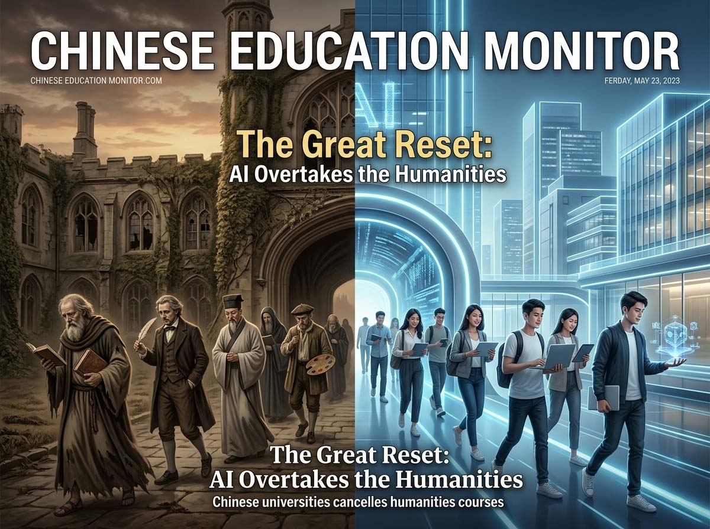
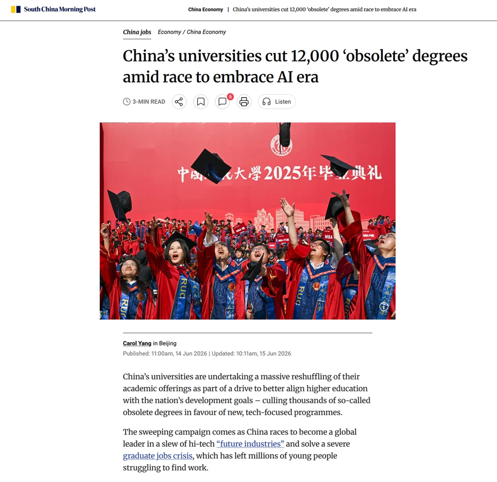

# Kurse zugunsten von KI gestrichen: China schreibt die Universität neu

*Es gibt eine Szene, die von der [South China Morning Post](https://www.scmp.com/economy/china-economy/article/3356913/chinas-universities-cut-12000-obsolete-degrees-amid-race-embrace-ai-era) erzählt wird und mehr wert ist als tausend Statistiken: Ein Absolvent des Industriedesigns erklärt, dass sein Kurs eingestellt wurde, weil die künstliche Intelligenz genau diesen Sektor hart getroffen hat, in dem Modellierung und Rendering mittlerweile größtenteils oder vollständig von einem Algorithmus durchgeführt werden können. Dies ist kein Einzelfall, sondern das Symptom einer Transformation, die das gesamte chinesische Universitätssystem in wenigen Jahren und mit einer Entschlossenheit durchlaufen hat, die im Westen ihresgleichen sucht.*

Zwischen 2021 und 2025 haben chinesische Universitäten 12.200 Bachelor-Studiengänge gestrichen oder ausgesetzt und sie durch 10.200 neue Bildungswege ersetzt. Mehr als 30 Prozent des gesamten nationalen Bildungsangebots wurden von dieser Umschreibung berührt, so die Daten des Bildungsministeriums, die von der Agentur [Xinhua](https://english.news.cn/) übernommen wurden. Um einen Maßstab zu haben: Es ist so, als hätte Italien in weniger als einem halben Jahrzehnt ein Drittel seiner eigenen Studiengänge demontiert und sie von Grund auf um einige technologische Prioritäten herum neu aufgebaut, die am grünen Tisch festgelegt wurden. Allein im Jahr 2024 wurden laut Erklärungen des stellvertretenden Bildungsministers Wu Yan in einer Pressekonferenz, die er selbst als beispiellos bezeichnete, 1.670 Kurse entfernt, die als unvereinbar mit der wirtschaftlichen und sozialen Entwicklung des Landes eingestuft wurden, während 1.673 Kurse eingeführt wurden, die als dringlich für die nationalen Strategien erachtet wurden. Zu den repräsentativsten Neueintritten gehören Programme für intelligente maritime Ausrüstung und intelligente Materialwissenschaft, die darauf ausgelegt sind, das industrielle Upgrade der Region Guangdong zu unterstützen. Darüber hinaus haben neun Universitäten Kurse gestartet, die sich der sogenannten „integrierten Intelligenz“ widmen, der Kunst, die KI der neuesten Generation mit der Realwirtschaft koexistieren zu lassen – jener Wirtschaft, die aus Fabriken, Lagern und Montagelinien besteht.

Die Zahl allein sagt schon viel aus. Aber es ist das Motiv, das die Angelegenheit interessanter macht als eine einfache Schulreform.

## Was stirbt, was entsteht

Den höchsten Preis für diese Abspeckkur zahlten die Künste, die Geisteswissenschaften, die Fremdsprachen und die Unternehmensführung – Sektoren, die Peking mittlerweile als gesättigt oder als nicht mehr im Einklang mit der Richtung ansieht, die die Wirtschaft eingeschlagen hat. An ihre Stelle traten Kurse in künstlicher Intelligenz, Robotik, Halbleitern und fortschrittlicher Fertigung – die vier Leitsterne, um die die Regierung das Humankapital des Landes in den kommenden Jahrzehnten kreisen lassen will.

Der Fall des Industriedesigns ist keine dekorative Ausnahme. Er ist fast ein unfreiwilliges Manifest dafür, wie die Reform denkt: Man streicht einen Kurs nicht, weil ihn niemand mehr wählt, sondern weil die Technologie den Marktwert der vermittelten Kompetenzen untergraben hat. Es ist eine schonungslos pragmatische Logik, die das Diplom primär als Vermittlungsinstrument sieht, noch vor einem Bildungsweg zur Persönlichkeitsentfaltung, und die aus diesem Grund die erste, unvermeidliche Frage aufwirft: Wer entscheidet, was für die Zukunft wirklich gebraucht wird?

## Die Logik von Peking

Die chinesische Antwort ist ebenso einfach wie radikal: Der Staat entscheidet auf der Grundlage einer Planung, die Wirtschaftsdaten, geopolitische Prioritäten und eine eher düstere Lesart des Arbeitsmarktes miteinander verflicht. Die Reform entspringt nämlich nicht einer plötzlichen Begeisterung für Chatbots, sondern einer Jugendarbeitslosigkeitskrise, die als ernst zu bezeichnen eine Untertreibung wäre: Über 16 Prozent der jungen Chinesen sind arbeitslos, und in diesem Sommer werden 12,7 Millionen Studenten ihren Abschluss machen, 4 Prozent mehr als im Vorjahr. Der alte Sozialpakt – heute Abschluss und morgen ein stabiler Job – hat Risse bekommen, und in China wissen das alle, auch die Studenten, die sich in den neuen Kursen einschreiben und bereits wissen, dass sie in einem instabilen Markt konkurrieren.

Peking hat die Kürzungen mit einer Umschulungskampagne im industriellen Maßstab begleitet: Das Ministerium für Humanressourcen hat sich verpflichtet, einer Million junger Menschen Kompetenzen in künstlicher Intelligenz und im Bereich der Elektrofahrzeuge zu vermitteln, während einige Städte mit Programmen experimentiert haben, die ein Studienjahr mit einem Praktikumsjahr abwechseln – eine Art staatliche Ausbildung, um zu verhindern, dass der Übergang zwischen Hörsaal und Fabrik in einem schwarzen Loch endet. Der rote Faden der gesamten Operation ist die in der chinesischen politischen Kultur tief verwurzelte Überzeugung, dass die wirtschaftliche Entwicklung nicht einfach nur begleitet, sondern antizipiert werden muss, mit einer Planung, die bei Bedarf auch starr sein kann. Die Zukunft wird in China nicht abgewartet: Sie wird entworfen, mit großem Vorlauf und wenig Toleranz für Ungewissheit.

Dieses Vertrauen in die Programmierung von oben ist auch der Punkt, an dem die Reform ihre größte Wette offenbart. Während in Europa und den Vereinigten Staaten die Debatte über künstliche Intelligenz noch um offene Fragen kreist, was sie ist und wie sie die Arbeit von morgen verändern wird, stellt sich China eine andere und operativere Frage: Wie baut man heute die Kompetenzen auf, die morgen benötigt werden, bevor sie unverzichtbar werden? Es ist ein Unterschied in der Haltung, nicht nur in der Geschwindigkeit, und es ist auch der Grund, warum das chinesische Experiment Aufmerksamkeit verdient, auch von denen, die das Modell, das es inspiriert, nicht teilen.

## Wer sagt, dass es ein Fehler ist

Nicht alle in China sind davon überzeugt, dass das Ersetzen eines Kurses durch einen anderen das Grundproblem löst. Chu Zhaohui, leitender Forscher am Nationalen Institut für Erziehungswissenschaften in Peking, wies darauf hin, dass viele der gerade gestrichenen Programme erst wenige Jahre zuvor während einer früheren Phase derselben Reform geschaffen worden waren und daher keine physische Zeit hatten, um zu reifen. Anstatt weiterhin eine Spezialisierung durch eine andere zu ersetzen, sollten die Universitäten laut Chu den Studenten eine größere Freiheit bieten, sich ein transversales Profil aufzubauen, indem sie Kurse basierend auf persönlichen Interessen, spezifischen Talenten und Karriereperspektiven wählen, anstatt sie zu zwingen, alles auf eine Kompetenz zu setzen, die zum Zeitpunkt des Eintritts in den Arbeitsmarkt bereits veraltet sein könnte. Es ist eine systeminterne Kritik, keine Ablehnung der Grundlogik: Chu sagt nicht, dass Planung falsch ist, er sagt, dass eine zu starre Planung Gefahr läuft, dasselbe Problem zu produzieren, das man lösen wollte, nur um einige Jahre nach hinten verschoben.

Dann gibt es eine Kritik eher philosophischer Natur, die von internationalen Beobachtern kommt und den Kern der Entscheidung betrifft, die geisteswissenschaftlichen Disziplinen zu reduzieren. Philosophie, Literatur und Sozialwissenschaften genau in dem Moment zu kürzen, in dem die künstliche Intelligenz immer komplexere ethische Fragen aufwirft – von in Algorithmen eingebetteten Bias bis hin zu Dilemmata über den militärischen Einsatz autonomer Systeme –, bedeutet das Risiko einzugehen, das zu schaffen, was einige Analysten als ethische blinde Flecken bezeichnen: eine Generation von Ingenieuren, die fähig sind, hochkomplexe Systeme zu bauen, aber weniger gerüstet sind, um die moralischen Konsequenzen dessen zu hinterfragen, was sie bauen. Es ist ein wenig so, als würde man einen ganzen Jahrgang außergewöhnlicher Piloten ausbilden, ohne ihnen etwas über die Regeln des Luftverkehrs beizubringen: Die technische Kompetenz ist da, der Rahmen der Verantwortung droht zurückzubleiben.

Auch an den prestigeträchtigsten Universitäten ist unterdessen eine ähnliche Spannung zu spüren. An der Fudan-Universität in Shanghai schrumpfen die Sozialwissenschaften progressiv, während die Universität parallel dazu ein Curriculum namens „AI-BEST“ startet, das darauf ausgelegt ist, jede Fakultät mit künstlicher Intelligenz zu durchdringen, von der Medizin bis zum Recht. Es ist die plastische Darstellung eines Systems, das gleichzeitig in zwei entgegengesetzte Richtungen rennt: Einerseits reduziert es den Raum für Disziplinen, die lehren, nach dem Sinn der Dinge zu fragen, andererseits weitet es die Technologie wie ein Lauffeuer aus, die genau diese Fragen dringlicher machen würde, nicht weniger.

[Screenshot des Artikels der South China Morning Post](https://www.scmp.com/economy/china-economy/article/3356913/chinas-universities-cut-12000-obsolete-degrees-amid-race-embrace-ai-era)

## Die mittlere Generation

Diese Widersprüchlichkeit erleben vor allem die Studenten am eigenen Leib, und online mangelt es nicht an Unmut. Es gibt diejenigen, die sich mit einer Mischung aus Resignation und Ironie fragen, welchen Sinn es mache, Jahre über Büchern zu verbringen, um sich dann ohnehin in einer Fabrik beim Bau von Elektroautos wiederzufinden, vielleicht mit einem Diplom in der Tasche, auf dem „integrierte Intelligenz“ steht, aber mit einem beruflichen Schicksal, das sich nicht allzu sehr von dem derjenigen unterscheidet, die nie ein Diplom gemacht haben. Es ist das Kennzeichen einer breiteren Spannung zwischen Fachausbildung und der Freiheit, den eigenen Weg zu wählen: Wenn der Staat heute entscheidet, was morgen gebraucht wird, bleibt dem Studenten wenig Spielraum, um Fehler zu machen, zu experimentieren oder die Meinung auf halbem Weg zu ändern – Luxusgüter, die in anderen Universitätssystemen als integraler Bestandteil des persönlichen Wachstums gelten.

Dann gibt es eine subtilere Beunruhigung, die die Geschwindigkeit des Wandels selbst betrifft. Wenn die künstliche Intelligenz in einem Tempo fortschreitet, das niemand, nicht einmal ihre Schöpfer, wirklich mit Sicherheit vorhersagen kann, welche Garantie gibt es dann, dass die heute als strategisch erachteten Kompetenzen es noch sein werden, wenn die Studenten von 2026 ihren Abschluss machen? Die Herausforderung besteht mit anderen Worten nicht nur darin, die richtigen Fächer zu wählen, sondern ein System aufzubauen, das fähig ist, sich schneller anzupassen, als es die Technologie selbst schafft, diejenigen zu überraschen, die sie studieren. Es ist ein wenig das Dilemma von Memento, dem Film von Christopher Nolan, in dem der Protagonist jeden Tag seine Identität von Grund auf neu konstruieren muss, weil sein Gedächtnis innerhalb weniger Stunden zerfließt: Die chinesische Universität scheint gezwungen zu sein, jedes Jahr die Karte der Zukunft neu zu schreiben, wohlwissend, dass die Karte selbst in dem Moment, in dem sie gezeichnet wird, bereits veraltet zu sein droht.

## Zwei Modelle, zwei Länder

Der Kontrast zum westlichen Ansatz tritt an diesem Punkt deutlich hervor. In China wird künstliche Intelligenz nicht als eine zu bändigende Bedrohung der akademischen Integrität wahrgenommen, sondern als strategische Kompetenz, die so schnell wie möglich entwickelt werden muss, und die Zahlen bestätigen dies: Laut einer Umfrage des Mycos Institute, die von verschiedenen Medien zitiert wurde, nutzen nur 1 Prozent der chinesischen Studenten und Dozenten keine KI-Tools, während fast 60 Prozent sie regelmäßig verwenden, mehrmals pro Woche oder jeden Tag. Universitäten wie Zhejiang haben ab 2024 einen KI-Grundbildungskurs für alle Studenten verpflichtend gemacht, unabhängig von der Fakultät, während Tsinghua ein ganzes College für Allgemeinbildung geschaffen hat, das künstliche Intelligenz und Geisteswissenschaften miteinander verwebt. Bis vor zwei Jahren mussten viele chinesische Studenten Netzwerksperren umgehen, indem sie Raubkopien von ChatGPT kauften: Heute fordern die Professoren sie selbst auf, diese Tools bewusst zu nutzen, und die Universitäten installieren Premium-Versionen von DeepSeek, die mit dem Studentenausweis zugänglich sind.

In Europa und den Vereinigten Staaten hingegen bleibt die Debatte fragmentierter und vorsichtiger und schwankt zwischen der zaghaften Einführung optionaler Module und der oft berechtigten Sorge, dass generative künstliche Intelligenz das kritische Denken untergraben oder ausgeklügelte Formen des Plagiats erleichtern könnte. Es ist kein Zufall, dass, während das MIT und Stanford freiwillige Kurse über KI hinzufügen, die chinesische Regierung nationale Richtlinien mit dem erklärten Ziel erlässt, kritisches Denken, digitale Kompetenzen und praktische Fähigkeiten bei jedem Schüler und Studenten zu entwickeln, von der Grundschule bis zur Universität. Es ist ein Unterschied, der von zwei Kulturen der Technologie erzählt, noch vor zwei Bildungssystemen: Die eine behandelt Ungewissheit als ein Risiko, das mit Vorsicht zu handhaben ist, die andere behandelt sie als ein Terrain, das besetzt werden muss, bevor es jemand anderes tut.

Natürlich hat auch das chinesische Modell seine Risse. Die Ausweitung der KI-Kurse wurde an vielen Universitäten nicht von einer proportionalen Zunahme an qualifizierten Dozenten, Forschungsgeldern und Laborinfrastrukturen begleitet, was bedeutet, dass die Qualität der Lehre Gefahr läuft, nicht mit der Begeisterung der Einschreibungen Schritt zu halten. Und während China einerseits einige der am häufigsten zitierten Paper weltweit im Bereich KI produziert, bleibt andererseits die Fähigkeit, diese akademische Forschung in global wettbewerbsfähige Produkte zu transformieren, ein Terrain, das noch gefestigt werden muss. Die Schnelligkeit der Reform garantiert kurzum nicht automatisch ihre Qualität.

## Die Frage, die offen bleibt

Es gibt einen grundlegenden Widerspruch, der die gesamte chinesische Operation durchzieht, und es ist derselbe, der viele internationale Beobachter die Nase rümpfen lässt: Es werden technologische Spezialisten ausgebildet, genau während dieselbe Technologie einen guten Teil des Arbeitsmarktes gefährdet, der sie dann aufnehmen sollte. In Europa droht laut einer Schätzung des Consumer’s Forum in den kommenden Jahren jeder vierte Arbeitsplatz durch künstliche Intelligenz ersetzt zu werden: Wäre die Vorhersage auch nur teilweise korrekt, würde die Ausbildung einer ganzen Generation von auf KI spezialisierten Technikern heute bedeuten, sie darauf vorzubereiten, in einem Markt zu konkurrieren, den die KI selbst an verfügbaren Stellen ärmer gemacht haben wird. Es ist eine Art Paradoxon im Stile von Philip K. Dick, bei dem das Werkzeug, das die Zukunft garantieren soll, auch dasjenige ist, das sie am instabilsten macht.

Es bleibt abzuwarten, ob der tiefste Unterschied zwischen Peking und dem Westen nicht so sehr die Reaktionsgeschwindigkeit ist, sondern die Idee von Universität selbst, die jedes Modell mit sich bringt. Wenn eine Universität primär eine Maschine sein soll, die Arbeiter produziert, die den nationalen Prioritäten dienlich sind, dann hat die chinesische Logik, so schonungslos sie auch sein mag, eine innere Kohärenz: besser von oben mit Daten und Planung entscheiden, als Millionen junger Menschen allein durch einen verrückt gewordenen Markt navigieren zu lassen. Aber wenn die Universität auch die Aufgabe hat, Bürger auszubilden, die zu kritischem Denken, zum Zweifel, zu einer Kultur fähig sind, die sich nicht nur in Begriffen unmittelbarer Verwertbarkeit misst, dann droht das Streichen von Philosophie, Sprachen und Kunst im Namen der Effizienz eine gefährliche Abkürzung zu sein, eine Art Ockhams Rasiermesser angewandt auf das Wissen, das alles wegschneidet, was keinen unmittelbaren Ertrag bringt.

Es ist kein Zufall, dass in Italien, während man noch darüber diskutiert, ob man die Nutzung von Smartphones im Unterricht einschränken soll, und während Europa darum ringt, eine gemeinsame Stimme zur künstlichen Intelligenz zu finden, die Frage, die die chinesische Reform aufwirft, auch hierzulande unangenehm gültig bleibt: Wer hat wirklich das Recht zu entscheiden, welche Kompetenzen es wert sind, gelehrt zu werden? Der Staat, der plant, der Markt, der auswählt, oder die künstliche Intelligenz selbst, die allein durch ihre Existenz bereits Berufe obsolet gemacht hat, die bis gestern sicher schienen? Peking hat eine klare Antwort gewählt. Der Rest der Welt entscheidet derzeit noch, ob diese Antwort zu fürchten, zu studieren oder teilweise zu kopieren ist.