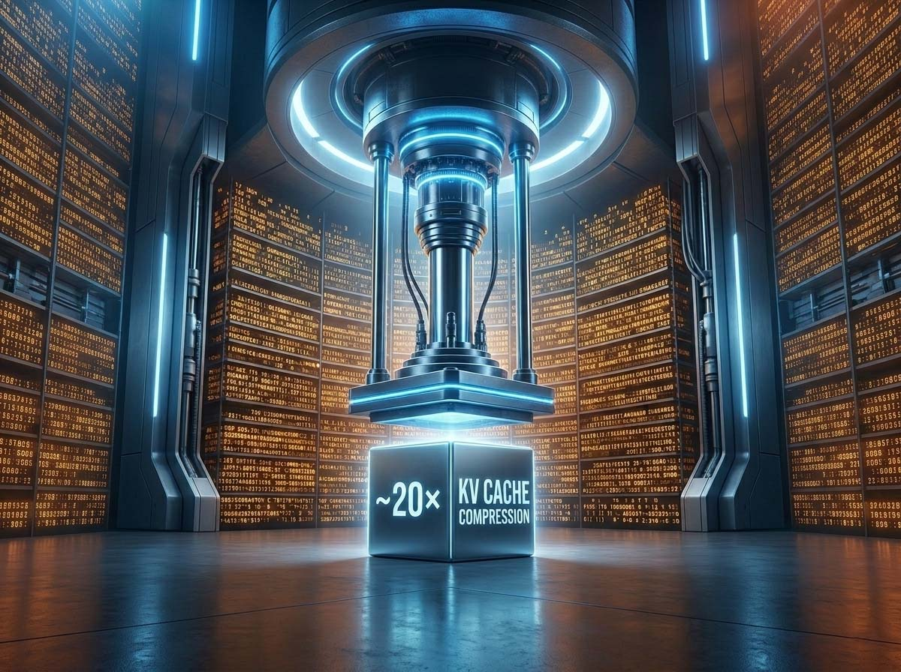
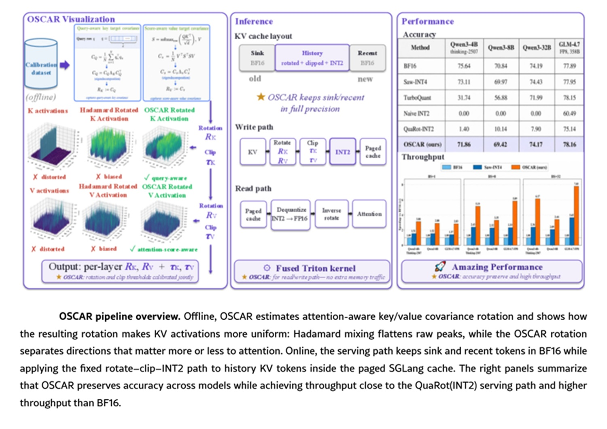
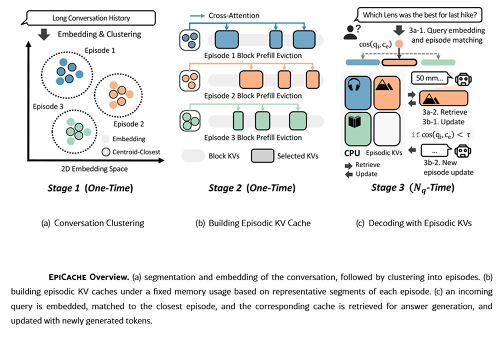

# La KV cache et le poids de l'attention : trois voies, un problème

*Llama-3.1-70B, exécuté en précision BF16, accumule environ 0,31 mégaoctet de KV cache pour chaque token traité. Avec un contexte de 128 000 tokens, l'addition monte à 40 gigaoctets, un chiffre déjà inconfortable. Avec un million de tokens, le standard vers lequel les modèles les plus récents se dirigent, on dépasse les 300 gigaoctets : plus que les 140 gigaoctets occupés par les poids du modèle lui-même. C'est un détail qui renverse une intuition répandue, celle selon laquelle la mémoire critique dans un grand modèle de langage est celle de ses paramètres. Ce n'est plus le cas, ou du moins pas toujours. La mémoire qui effraie vraiment ceux qui conçoivent des systèmes d'inférence à long contexte est celle de la KV cache, l'archive où le modèle conserve les représentations de clé (key) et de valeur (value) de chaque token déjà vu, pour ne pas avoir à tout recalculer de zéro à chaque nouveau mot généré.*

Le problème n'est pas seulement la taille. Chaque token décodé doit faire transiter toute la cache de la mémoire à large bande passante jusqu'aux unités de calcul, ce qui fait de la phase de décodage un goulot d'étranglement de bande passante plutôt que de puissance de calcul. C'est un peu comme avoir un entrepôt spacieux mais des couloirs trop étroits pour y transporter les dossiers : peu importe l'espace disponible, si l'on ne parvient pas à le faire circuler assez vite, le système se bloque de toute façon.

Ces dernières années, la recherche a répondu à ce problème selon cinq axes principaux. Le premier est l'éviction de tokens (eviction), dont H2O et SnapKV sont les exemples les plus cités : on décide quels tokens sont les moins importants et on supprime leur cache. Le deuxième est la quantification, où KIVI et GEAR ont ouvert la voie en réduisant le nombre de bits utilisés pour représenter chaque valeur. Le troisième est la projection de bas rang (low-rank projection), avec Palu en chef de file, qui s'attaque à la redondance cachée dans les dimensions internes des vecteurs clé et valeur plutôt que dans le nombre de tokens ou les bits par valeur. Le quatrième est la fusion, KVMerger, qui combine plusieurs entrées de cache en una représentation partagée. Le cinquième est le partage architectural, dont la [Multi-head Latent Attention de DeepSeek-V2](https://arxiv.org/abs/2405.04434) est l'exemple le plus connu, avec une réduction de la KV cache de 93,3 % intégrée directement dans la conception du modèle dès l'entraînement.

Ces derniers mois, trois approches ont attiré une attention particulière et méritent d'être racontées non pas comme trois concurrents en lice pour le trône, mais comme trois réponses à des questions légèrement différentes posées au même problème.

## TurboQuant, l'antécédent

Nous avions déjà parlé de TurboQuant [dans un article dédié](https://aitalk.it/it/turboquant.html), un rappel suffit donc ici. La méthode, signée par des chercheurs de Google Research et de la New York University et acceptée à l'ICLR 2026, applique une rotation aléatoire aux vecteurs clé et valeur avant de les quantifier. La rotation n'altère pas la longueur du vecteur mais redistribue ses composantes sous une forme statistiquement connue et prévisible, éliminant ainsi la nécessité de calibrer le quantificateur sur des données spécifiques. À cela s'ajoute un second stade, construit sur la technique QJL (Quantized Johnson-Lindenstrauss), qui corrige le résidu de la quantification par un seul bit supplémentaire, garantissant que les estimations des produits scalaires — précisément les calculs que le mécanisme d'attention effectue en continu — ne soient pas systématiquement biaisées.

Le résultat déclaré est une compression supérieure à cinq fois avec une neutralité qualitative à 3,5 bits par canal, et une accélération de l'attention allant jusqu'à huit fois sur GPU H100. Comme nous l'avions déjà noté, la méthode est solide mais non exempte de zones d'ombre : la comparaison avec le précédent RabbitQ a suscité des polémiques en phase de révision, et les benchmarks les plus sévères sur LongBench montrent que l'avantage réel par rapport à des méthodes comme KIVI est de l'ordre d'un bit, et non une révolution. Pour les détails sur la rotation aléatoire, le bit résiduel et les questions ouvertes sur la transférabilité à des modèles plus grands, [nous vous renvoyons à l'article original](https://aitalk.it/it/turboquant.html).

## OSCAR et la rotation qui écoute l'attention

Si TurboQuant mise sur la généralité, sur la capacité à fonctionner sans rien savoir de la distribution des données, [OSCAR](https://arxiv.org/html/2605.17757v1) de Together AI naît d'une observation presque opposée : ignorer l'attention a un coût, et à 2 bits, ce coût devient insoutenable.

Le point de départ est une distinction subtile mais décisive. Une rotation comme celle d'Hadamard, utilisée par de nombreuses méthodes précédentes, est efficace car elle distribue les valeurs aberrantes sur plusieurs canaux, rendant la distribution plus uniforme et donc plus facile à quantifier. Mais c'est une rotation aveugle : elle traite toutes les directions de l'espace vectoriel comme équivalentes, alors que l'attention ne le fait pas. Certaines directions comptent beaucoup plus que d'autres pour le calcul final des scores d'attention et pour l'output qui en découle. Minimiser l'erreur de reconstruction du vecteur clé ou valeur — l'objectif implicite de nombreuses techniques de quantification — ne revient pas à minimiser l'erreur qui atteint effectivement l'output du modèle.

L'équipe de Together AI a donc construit un système en deux phases. Dans la phase offline, lors d'une courte calibration sur un petit ensemble de données, on estime la covariance des requêtes et celle des scores d'attention, et on en dérive deux rotations distinctes, une pour les clés et une pour les valeurs, construites spécifiquement pour s'aligner sur les directions que l'attention consomme réellement. Ces rotations sont ensuite composées avec une transformée d'Hadamard et une permutation, afin d'obtenir le meilleur des deux mondes : l'attention à la géométrie du problème et la capacité à étaler davantage les excès résiduels. Dans la phase online, le système applique ces transformations fixes pendant le service du modèle, ne conservant en haute précision qu'une petite fenêtre de tokens récents et les tout premiers tokens de la séquence — qui servent d'ancrage pour l'attention — tandis que tout le reste de l'historique conversationnel est compressé à 2 bits.

L'avantage de ce choix est que la transformation est fixe, calculée une seule fois en phase de calibration, et ne nécessite aucune intervention pendant l'inférence proprement dite. Cela la rend compatible avec les architectures de service existantes, en particulier avec le paged-attention layout utilisé par des frameworks comme SGLang et vLLM, où les blocs de cache sont gérés comme des pages mémoire indépendantes. OSCAR a été intégré directement dans la pile SGLang avec un noyau Triton dédié pour l'attention à 2 bits.

Les chiffres parlent d'eux-mêmes quant à l'ampleur du problème que OSCAR résout. Sur Qwen3-4B-Thinking, la quantification INT2 naïve, sans aucune rotation, s'effondre pratiquement à zéro de précision sur le benchmark de mathématiques AIME25. Avec la seule rotation d'Hadamard, sans la précaution attention-aware, le score reste inférieur à 1,5. OSCAR, sur la même tâche et sur la même quantité de bits, atteint une précision comparable à celle du modèle non compressé. Sur Qwen3-8B, l'écart par rapport à la précision totale BF16 est réduit à 1,42 point, tandis que la mémoire de la cache est réduite d'environ huit fois et le débit à gros lots (throughput) augmente jusqu'à sept fois, toujours à budget mémoire égal. Même sur des modèles nettement plus grands, comme Qwen3-32B et le GLM-4.7 de 358 milliards de paramètres, OSCAR maintient une précision proche du BF16 jusqu'à des contextes de 128 000 tokens dans les tests RULER-NIAH, là où la rotation naïve s'effondre.

Il faut dire que le domaine lui-même évolue avec une rapidité qui rend difficile la fixation d'un point d'arrêt : presque en même temps qu'OSCAR est apparue une méthode au nom presque identique mais différente sur le fond, [OScaR](https://arxiv.org/html/2605.19660) (Omni-Scaled Canalized Rotation), qui s'attaque au déséquilibre de norme entre tokens comme cause première de la dégradation à basse précision, proposant une solution plus légère mais avec des objectifs similaires. Un signe de l'effervescence actuelle sur le front de la rotation attention-aware.

[Image tirée du papier officiel sur arxiv.org](https://arxiv.org/html/2605.17757v1)

## EpiCache, le problème que personne ne regardait

Alors que TurboQuant et OSCAR rivalisent sur le même terrain, celui de la représentation numérique la plus efficace de chaque vecteur individuel, [EpiCache](https://arxiv.org/html/2509.17396v4) d'Apple déplace l'attention ailleurs : non pas combien de bits sont nécessaires pour représenter un token, mais quels tokens valent la peine d'être conservés lorsque la conversation se prolonge pendant des jours ou des semaines.

Le problème qu'EpiCache aborde est spécifique aux conversations de longue durée, celles où un assistant accumule session après session de dialogue avec le même utilisateur. Dans ce scénario, la KV cache d'un modèle relativement petit comme LLaMA3.2-3B peut dépasser les 7 gigaoctets après seulement trente sessions, soit plus que l'espace occupé par les poids du modèle lui-même. La réponse la plus évidente, appliquer l'éviction après avoir traité tout le contexte, présente toutefois un défaut structurel : le pic de mémoire croît de toute façon de manière linéaire avec la longueur de l'entrée, car avant de pouvoir rejeter quoi que ce soit, il faut d'abord tout traiter. C'est comme décider quels livres jeter seulement après avoir déjà rempli toutes les étagères de la maison.

EpiCache résout cela avec une éviction par blocs : le contexte est traité par segments de taille fixe, et après chaque segment, on rejette immédiatement les tokens les moins pertinents, maintenant ainsi le budget mémoire constant quelle que soit la longueur de la conversation globale. Le problème est qu'appliquer cette stratégie de manière élémentaire dégrade fortement la précision, car les techniques les plus sophistiquées de sélection des tokens pertinents — celles basées sur un prompt supplémentaire qui mesure à quel point chaque token reçoit l'attention d'une requête — ont besoin de savoir à l'avance ce que l'utilisateur va demander. Et dans une conversation réelle, cette question future n'est pas disponible au moment de la compression.

La solution proposée est élégante dans sa simplicité conceptuelle. Au lieu de deviner la question future, EpiCache l'approche en utilisant le passé : il regroupe l'historique conversationnel en épisodes thématiquement cohérents par clustering, identifie pour chaque épisode le segment le plus représentatif — celui dont la représentation sémantique est la plus proche du centre du cluster — et utilise ce segment comme prompt de guidage pour décider quels tokens conserver dans la cache spécifique de cet épisode. Lorsqu'une nouvelle question de l'utilisateur arrive, le système la compare aux centroïdes de tous les épisodes mémorisés et récupère la cache de l'épisode le plus affine, construisant ainsi une réponse basée sur le contexte réellement pertinent, même si cette partie de la conversation remonte à plusieurs jours.

À cela s'ajoute un second procédé, peut-être moins spectaculaire mais tout aussi utile : toutes les couches d'un Transformer ne réagissent pas de la même manière à l'éviction par blocs. En mesurant à quel point les états des clés s'écartent entre le traitement complet et le traitement par blocs, les auteurs ont découvert que la sensibilité varie beaucoup d'une couche à l'autre, de manière cohérente selon l'entrée mais différente selon le modèle. EpiCache distribue donc le budget mémoire en allouant plus d'espace aux couches les plus sensibles et moins à celles qui tolèrent mieux la compression, au lieu d'appliquer une coupe uniforme sur tout le réseau.

Les résultats, mesurés sur trois benchmarks dédiés aux conversations de longue durée (LongMemEval, Realtalk et LoCoMo), montrent une amélioration de la précision allant jusqu'à 30 % par rapport aux techniques de compression précédentes appliquées dans le même scénario par blocs, avec des performances proches de celles de la cache complète même avec une compression de quatre ou six fois. Sur le front de l'efficacité, le système réduit la latence de décodage jusqu'à 2,4 fois et le pic de mémoire jusqu'à 3,7 fois par rapport à la cache non compressée.

[Image tirée du papier officiel sur arxiv.org](https://arxiv.org/html/2509.17396v4)

## Trois philosophies à la loupe

Mis côte à côte, les trois méthodes révèlent plus de complémentarité que de compétition, car elles répondent en réalité à trois questions différentes. TurboQuant demande : comment compresser n'importe quel vecteur, sans rien savoir du modèle ou de la tâche, avec des garanties théoriques solides ? OSCAR demande : puisque je connais le modèle et que je peux me permettre une courte calibration, comment aligner la compression sur ce que l'attention utilise réellement ? EpiCache, enfin, demande une chose complètement différente : dans une conversation qui dure des semaines, quelles portions de l'historique valent la peine d'être gardées sous la main, indépendamment du nombre de bits par token utilisés ?

Cela signifie qu'en principe, on n'est pas obligé d'en choisir une et d'abandonner les autres. EpiCache décide quels tokens survivent dans la cache ; OSCAR ou TurboQuant décident avec quelle précision ces tokens survivants sont représentés. Un système de production conçu pour un assistant conversationnel de longue durée pourrait en théorie appliquer les deux logiques en séquence, bien qu'aucun des trois articles ne discute explicitement de cette combinaison, et que l'intégration pratique reste un exercice à vérifier sur le terrain.

Sur le plan pratique, cependant, les différences comptent énormément selon le scénario. Pour celui qui doit servir un modèle générique en production sans pouvoir se permettre une phase de calibration spécifique pour chaque modèle et chaque matériel, l'approche data-oblivious de TurboQuant reste attrayante, même si les benchmarks les plus sévères suggèrent un avantage réel plus modeste que ce que la communication a laissé entendre. Pour celui qui opère avec un seul modèle fixe et veut pousser la compression jusqu'à la limite de 2 bits sans renoncement drastique à la qualité, surtout sur des tâches de raisonnement ou de code où chaque erreur d'attention se propage et s'amplifie dans les étapes suivantes, la calibration attention-aware d'OSCAR offre une marge de sécurité que les rotations aveugles ne garantissent pas. Et pour ceux qui construisent des assistants qui accompagnent l'utilisateur dans le temps, où le problème n'est pas tant la précision bit par bit que la capacité à se souvenir de la bonne chose au bon moment, EpiCache s'attaque à un goulot d'étranglement que les deux autres n'effleurent même pas.

Il existe également une distinction de coût opérationnel qui mérite d'être soulignée. TurboQuant ne nécessite aucune calibration d'aucune sorte, ce qui le rend immédiatement applicable à n'importe quel modèle pré-entraîné. OSCAR nécessite une calibration offline légère, de l'ordre de quelques milliers de tokens pour estimer les covariances nécessaires, mais reste ensuite fixe et n'entraîne pas de coûts supplémentaires pendant l'inférence. EpiCache, enfin, introduit un coût computationnel récurrent, car chaque fois que la conversation dépasse un certain budget, il faut répéter le clustering et reconstruire les caches épisodiques, une opération qui a un prix mais qui se rentabilise par une précision bien plus élevée précisément dans le scénario pour lequel il a été conçu.

Pour ceux qui souhaitent approfondir ou expérimenter en autonomie, les auteurs d'OSCAR ont mis à disposition à la fois le [code](https://github.com/FutureMLS-Lab/OSCAR) et une collection de rotations pré-calculées sur [Hugging Face](https://huggingface.co/Zhongzhu/OSCAR-RotationZoo), tandis que pour ceux qui travaillent davantage sur le côté de la projection de bas rang, Palu met à disposition un [répertoire complet](https://github.com/shadowpa0327/Palu) avec des scripts d'évaluation et des noyaux GPU dédiés, confirmant que dans ce domaine la théorie, aussi élégante soit-elle, ne vaut que dans la mesure où elle se traduit en code exécutable sur du matériel réel.

## Qui gagne, qui attend

Reste une question de fond qu'aucun des trois articles ne résout seul : la compression de la KV cache est-elle vraiment la contrainte principale de l'inférence à long contexte, ou existe-t-il d'autres facteurs — la bande passante mémoire, la latence d'accès, la parallélisation du calcul de l'attention — qui pèsent tout autant ou plus ? Les chiffres cités dans cet article sont tous réels et vérifiables, mais ils doivent être lus dans le contexte spécifique où ils ont été mesurés : modèles de la famille Qwen3 et GLM pour OSCAR, LLaMA pour EpiCache, Llama-2-7B pour TurboQuant. La transférabilité à des familles de modèles différentes, à des architectures avec attention groupée ou multi-requête où les dimensions des vecteurs clé et valeur sont déjà réduites au départ, reste en grande partie à vérifier sur le terrain, non pas par manque de confiance dans la théorie sous-jacente, mais parce que chaque architecture apporte son lot d'idiosyncrasies que les benchmarks publiés épuisent rarement.

Il y a enfin une considération qui mérite d'être faite à haute voix. La rapidité avec laquelle trois approches distinctes sont apparues en l'espace de quelques semaines, et l'apparition presque simultanée d'une quatrième méthode au nom quasi homonyme à l'une des trois, témoigne moins d'une course compétitive que de la maturation d'un problème que l'industrie a enfin cessé de considérer comme secondaire. Pendant des années, la conversation publique sur l'efficacité des grands modèles de langage s'est concentrée presque exclusivement sur la taille des poids, la quantification du modèle, la distillation. La KV cache est restée, pendant la majeure partie de ce temps, un détail d'implémentation. Les chiffres d'ouverture de cet article devraient suffire à expliquer pourquoi ce détail est devenu, de fait, la véritable limite des systèmes que nous souhaiterions capables de se souvenir de tout, pour toujours, sans en payer le prix en gigaoctets.

*Note technique : les benchmarks cités proviennent des papiers originaux et n'ont pas été reproduits de manière indépendante par cette rédaction ; comme toujours dans ce domaine, les chiffres de laboratoire ne garantissent pas automatiquement les mêmes performances dans des scénarios de production avec des charges de travail réelles.*
