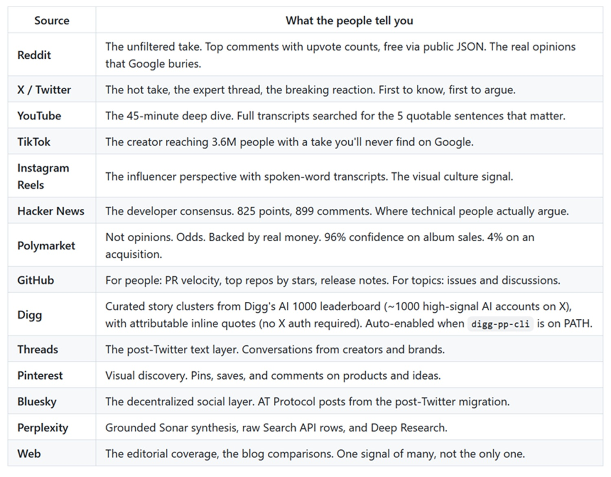

# Last30days: quando un agente di codice diventa un motore di ricerca sociale

*Prima di scrivere qualcosa sull'AI, ho aperto undici schede del browser: Reddit, X, YouTube, Hacker News, GitHub, qualche newsletter di settore. Due ore dopo, tre caffè, avevo trovato tre post davvero utili. Il resto era rumore: articoli di blog ottimizzati per i motori di ricerca, opinioni di persone pagate per averle, classiche gallery del tipo "i dieci strumenti AI che cambieranno la tua vita" scritte con la stessa profondità di un foglio di istruzioni di un mobile IKEA.*

Il problema non è la quantità di informazioni. È che i sistemi che usiamo per navigarle sono stati progettati per aggredire gli algoritmi, non per riflettere ciò che le persone pensano davvero. Google indicizza editor. Reddit, X e YouTube indicizzano persone. Sono ecosistemi fondamentalmente diversi, ognuno chiuso nel proprio giardino recintato, ognuno con le proprie API, i propri token di autenticazione, le proprie logiche di accesso.

[`/last30days`](https://github.com/mvanhorn/last30days-skill) è un tentativo di abbattere quei recinti. Non è un motore di ricerca nel senso tradizionale: è una skill per agenti di codice che interroga in parallelo Reddit, X, YouTube, Hacker News, TikTok, GitHub, Polymarket e altri, fonde i risultati, e consegna una sintesi strutturata in pochi minuti. Scritto da Matthew Van Horn, ha raggiunto 41.500 stelle su GitHub, classificandosi come repository numero uno del giorno nella sua settimana di lancio. I numeri da soli non dicono molto, ma raccontano l'intensità di un bisogno reale.

## Dentro la macchina: architettura v3

La versione tre del progetto, quella attuale, è costruita attorno a un'idea semplice ma potente: non cercare quello che hai scritto, capire prima *dove* cercarlo. Il README ufficiale del repository descrive il flusso in sette passaggi, ma la parte interessante è quello che succede prima che una singola chiamata API venga effettuata.

Il motore usa un sistema di fusione dei ranking chiamato Reciprocal Rank Fusion, abbreviato RRF. Invece di affidare la rilevanza a un'unica fonte o a un unico algoritmo, RRF prende i risultati da più sorgenti, ognuna con la propria classifica, e li fonde in un ranking composito che riduce il peso degli outlier e premia la coerenza tra piattaforme diverse. Se un tema emerge con forza su Reddit, riceve segnale. Se lo stesso tema appare su X e viene citato in un video YouTube, il segnale si amplifica. Se invece è forte solo su una piattaforma e silenzioso sulle altre, viene ridimensionato.

L'altro elemento architetturale degno di attenzione è il clustering automatico: quando la stessa storia appare su Reddit, X e YouTube con titoli diversi, il motore non la mostra tre volte. La rileva come unico cluster tramite entity-based overlap detection, riconoscendo la coincidenza anche quando le parole usate nelle diverse piattaforme non coincidono. Il risultato è un brief che consolida invece di duplicare.

## Il cervello che legge prima di cercare

La funzione che il README chiama "Intelligent Search" è quella che separa più nettamente questo strumento dalla ricerca tradizionale. È stata costruita da [Jonas Sperling](https://github.com/j-sperling) e funziona come un pre-research brain, un passaggio zero che precede qualsiasi interrogazione alle API esterne.

L'idea è questa: quando scrivi `/last30days OpenClaw`, il motore non cerca letteralmente "OpenClaw" su tutte le piattaforme. Prima risolve chi e cosa c'è attorno a quel termine. Capisce che OpenClaw ha un creatore, Peter Steinberger, che su X è `@steipete`, che su GitHub il repository principale è `steipete/openclaw`, che le discussioni rilevanti si trovano su subreddit come `r/ClaudeCode`. Poi cerca tutto questo in parallelo, già orientato. La differenza rispetto alla versione precedente, scrive Van Horn nel README, è strutturale: "Il vecchio motore cercava parole chiave. Il nuovo capisce il tuo argomento prima, poi cerca le persone e le community giuste."

Questo risolve uno dei problemi più fastidiosi della ricerca contestuale: l'ambiguità. Se cerchi "Paperclip" intendi la startup di AI o il ferretto per tenere insieme i fogli? Il motore risolve `@dotta` e capisce che stai parlando della prima. Se cerchi "Dave Morin" ottieni non solo il suo profilo X ma anche le connessioni con OpenClaw e le citazioni dal podcast TWiST. La disambiguazione avviene prima della ricerca, non dopo.

## Due giudici, non uno

Uno degli elementi più inusuali di `/last30days` è la presenza di un secondo giudice nel processo di sintesi. Il primo valuta la rilevanza: quanto un risultato è pertinente alla query, quanto è recente, quanto engagement ha ricevuto. Il secondo valuta qualcosa di diverso: humor, wit, viralità.

La motivazione è pratica. Reddit e X producono quotidianamente sintesi brillanti, battute perfette, commenti che catturano l'essenza di un fenomeno meglio di qualsiasi analisi. Il vecchio sistema li seppelliva perché non erano "rilevanti" nel senso stretto del termine. Un commento come "My Michael Jordan is Steve Kerr" in un thread sull'Arizona Basketball segna basso sulla pertinenza tematica, ma altissimo sulla qualità espressiva.

Il risultato è una sezione finale chiamata "Best Takes" che raccoglie le citazioni più vivaci, le one-liner più condivise, le reazioni che invogliano a tornare sull'argomento. Non è una funzione decorativa: è un riconoscimento che la cultura digitale si muove spesso attraverso la battuta giusta al momento giusto, non attraverso l'analisi più accurata.

## Comparazioni in parallelo, non in serie

Un'altra funzione introdotta nella v3 merita attenzione perché risolve un problema pratico che chiunque abbia cercato di confrontare due strumenti concorrenti conosce bene. Nelle versioni precedenti, una query come `/last30days "OpenClaw vs Hermes vs Paperclip"` eseguiva tre ricerche seriali: prima una, poi l'altra, poi l'ultima. Il tempo di esecuzione poteva superare i dodici minuti. La v3 esegue invece un'unica passata con subquery entità-consapevoli per tutti i soggetti contemporaneamente, portando il tempo a circa tre minuti con la stessa profondità di analisi.

C'è anche la modalità `--competitors`, che funziona in modo ancora più autonomo: dato un soggetto, il motore scopre da solo i principali concorrenti tramite web search, poi avvia pipeline parallele per ciascuno e le fonde in una comparazione strutturata. È il tipo di funzione che trasforma uno strumento di ricerca in qualcosa che somiglia a un analista junior: non si limita a rispondere alla domanda che hai fatto, ma costruisce il contesto in cui quella risposta ha senso.

## Quindici piattaforme, un brief

La tabella delle sorgenti supportate nel [repository](https://github.com/mvanhorn/last30days-skill) è lunga: Reddit, X, YouTube, TikTok, Instagram Reels, Hacker News, Polymarket, GitHub, Digg, Threads, Pinterest, Bluesky, Perplexity, ricerca web tradizionale. Alcune sono gratuite e funzionano senza configurazione (Reddit con commenti, HN, Polymarket, GitHub). Altre richiedono autenticazione o chiavi API a pagamento.

La presenza di Polymarket è particolarmente interessante: non raccoglie opinioni, raccoglie quote. Le probabilità su Polymarket sono determinate da chi mette soldi reali sulla previsione, non da chi vuole sembrare informato. C'è una differenza epistemica significativa tra "molti pensano che X accadrà" e "il 74% dei capitali scommette che X accadrà entro dicembre". Il motore lo mostra come segnale separato, con le percentuali di probabilità, non i volumi in dollari, perché la magia è nella quota, non nell'ammontare.

Per GitHub esiste anche un cosiddetto "person-mode": quando la query riguarda una persona specifica, il motore smette di cercare chi ne parla e inizia a cercare cosa quella persona sta effettivamente costruendo. Il comando `/last30days Peter Steinberger --github-user=steipete` restituisce non una rassegna stampa su Steinberger ma una mappa del suo lavoro: quante pull request ha fatto nell'ultimo mese, in quali repository, a che tasso di approvazione, che cosa ha rilasciato.

[Le piattaforme su cui avvengono le ricerche](https://github.com/mvanhorn/last30days-skill)

## Opencode: un test sul campo

Quando ho visto il progetto, la domanda immediata è stata: funziona anche fuori dall'ecosistema Claude Code? La risposta del repository è affermativa: la skill è installabile su Codex, Cursor, Copilot, Gemini CLI, e tramite il pacchetto open `npx skills add mvanhorn/last30days-skill -g` su oltre cinquanta ambienti compatibili con lo standard Agent Skills, tra cui `opencode`.

Ho installato la skill su opencode e ho fatto una ricerca concreta: le preferenze degli utenti di opencode su quale modello linguistico gratuito o a basso costo offrisse il miglior rapporto qualità-prestazioni. Una query di nicchia, con una community piccola ma attiva, che un motore di ricerca tradizionale avrebbe soddisfatto con zero risultati utili.

Il report prodotto ha attraversato provider, forum, discussioni GitHub e documentazione ufficiale. Ha distillato che opencode supporta oltre 75 provider e tre modalità principali di accesso ai modelli. Tra i gratuiti disponibili immediatamente, senza chiavi API: DeepSeek V4 Flash Free, un modello mixture-of-experts da 284 miliardi di parametri con un milione di token di contesto, distribuito con licenza MIT. Per chi volesse spendere dieci dollari al mese con OpenCode Go, il modello con il miglior rapporto richieste/qualità risultava essere ancora DeepSeek V4 Flash, con circa 158.000 richieste mensili stimate, mentre per la qualità assoluta emergevano GLM-5.2 e Kimi K2.7 Code, quest'ultimo particolarmente raccomandato per agenti MCP complessi. Per chi non vuole dipendere dal cloud, i modelli locali via Ollama o LM Studio erano documentati in dettaglio, con Qwen3.6-27B come scelta per singola GPU da 24GB.

Il report è uscito come file `.md` su richiesta esplicita, citando le fonti. Ha impiegato circa un minuto. Non è stato perfetto: alcune informazioni sui prezzi richiederebbero verifica diretta sui siti dei provider, e la community di opencode è abbastanza piccola da rendere il campione statisticamente sottile. Ma per orientarsi rapidamente in un panorama che cambia ogni settimana, era esattamente quello che serviva.

## I limiti che nessuno dice

L'onestà richiede di mettere sul tavolo anche ciò che non funziona, o che funziona con dei costi nascosti.

Il primo limite è strutturale: le sorgenti più ricche, TikTok, Instagram, Threads, YouTube con commenti, richiedono una chiave API di ScrapeCreators, un servizio a pagamento. Le prime cento richieste sono gratuite, poi si entra in un modello pay-per-use. Chi vuole la versione completa dello strumento deve mettere in conto un costo variabile che dipende dall'intensità dell'uso. Il modello "gratis" esiste, ma è significativamente più limitato di quello descritto nei casi d'uso del README.

Il secondo limite è epistemico, ed è più sottile. Lo strumento ottimizza per l'engagement: un thread Reddit con 1.500 upvote pesa più di un blog post che nessuno ha letto. In linea di principio ha senso. In pratica, l'engagement è una misura della reattività emotiva tanto quanto della qualità informativa. Un post che semplifica, indigna o diverte raccoglie più upvote di un'analisi sfumata. `/last30days` non risolve questo problema: lo eredita dalle piattaforme che interroga. La sintesi è tanto buona quanto le conversazioni che trova, e le conversazioni online hanno i loro bias strutturali.

Il terzo limite riguarda la latenza dei dati: lo strumento cerca quello che è successo *nelle ultime settimane*, non quello che è successo ieri mattina. Per trend analysis e ricerca di contesto funziona benissimo. Per breaking news in tempo reale, meno.

Infine, una nota sulla privacy. Il README dichiara esplicitamente che la ricerca rimane in locale, nessun dato viene trasmesso a server terzi al di fuori delle API che l'utente stesso configura. Si tratta di un progetto MIT, verificabile nel codice sorgente. Ma chi usa `/last30days` con chiave X o ScrapeCreators sta comunque autorizzando quelle piattaforme a ricevere le query: la riservatezza è quindi relativa, dipende da quali sorgenti si abilitano.

## Chi vince, chi perde, chi decide

Dal punto di vista degli utenti, `/last30days` risponde a un bisogno che gli strumenti esistenti ignorano sistematicamente: aggregare segnali sociali eterogenei senza passare ore a farlo manualmente. È particolarmente utile in tre contesti: prima di una riunione con qualcuno di cui si vuole capire il lavoro recente, quando si deve valutare uno strumento nuovo in un settore che si muove velocemente, quando si cerca di capire se un trend è reale o amplificato dai soliti dieci profili influenti.

Per la categoria dei ricercatori professionisti e dei giornalisti, la questione è più complessa. Lo strumento accelera la raccolta ma non sostituisce il giudizio. Il "Best Takes" può essere prezioso per capire come reagisce una community, ma selezionare le battute più virali non è lo stesso che identificare le voci più informate. L'ottimizzazione per l'engagement e quella per la verità sono funzioni diverse, e a volte ortogonali.

Le piattaforme che vengono interrogate non traggono nulla da questo schema: `/last30days` usa le loro API o i loro dati pubblici senza restituire traffico diretto. È una dinamica già vista con i motori di ricerca tradizionali, ma amplificata: qui non c'è neanche il click-through su un link. Reddit ha già intrapreso battaglie legali contro chi usa i suoi dati in modi non autorizzati, e non è impossibile che in futuro le condizioni di accesso cambino.

Il progetto, con i suoi 41.500 stelle e 3.400 fork, è già abbastanza grande da attirare attenzione. La domanda non è se funziona: funziona, con le limitazioni descritte. La domanda è dove porta questo paradigma quando viene generalizzato. Un agente che interroga in parallelo tutte le conversazioni pubbliche su un argomento, le fonde, le sintetizza, e consegna una risposta in un minuto, è uno strumento potente. Come ogni strumento potente, dice molto di più su chi lo usa che su se stesso.
