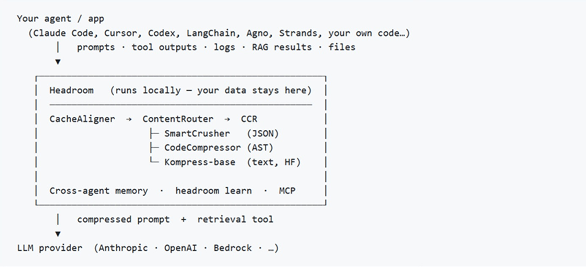

# Headroom: il compressore di token che non usa l'IA per comprimere l'IA

*C'è un paradosso silenzioso al cuore di molti sistemi di intelligenza artificiale moderni. Gli ingegneri costruiscono agenti sofisticati, capaci di ragionare, pianificare e coordinare sequenze complesse di azioni. Poi guardano la fattura mensile dell'API e si rendono conto che la spesa più grande non è il ragionamento, non è la creatività, non è nemmeno l'accuratezza. È il traffico. Il puro, banale volume di testo che i componenti si scambiano tra loro.*

Tejas Chopra, ingegnere di Netflix, si è trovato esattamente in quella situazione. Il suo agente AI bruciava duecento dollari al giorno non per fare cose straordinarie, ma semplicemente per trasportare contesto: output di tool, log di sistema, file di debug. Dati strumentali, spesso ridondanti, che occupavano finestre di contesto preziose e venivano fatturati token per token. La sua risposta è [Headroom](https://github.com/headroomlabs-ai/headroom), un progetto open-source che in pochi mesi ha raccolto oltre 45.000 stelle su GitHub e che propone una soluzione tanto semplice nella premessa quanto interessante nei dettagli: comprimere quello che entra nell'LLM prima che ci entri davvero.

La premessa è che gli agenti AI moderni soffrono di un problema strutturale. A ogni passaggio del loro ciclo di lavoro, leggono file, interrogano database, eseguono comandi di shell, ricevono risposte da API esterne. Tutto questo materiale confluisce nel contesto che viene inviato al modello, e il modello paga per ogni token. Un log di sistema da mille righe, anche se contiene una sola riga critica, costa come mille righe. Un array JSON di cinquecento risultati di ricerca, anche se ne basterebbero venti per rispondere alla domanda, pesa come cinquecento risultati.

Il mercato delle soluzioni ha risposto in modo prevedibile: servizi hosted che comprimono il testo inviandolo a loro volta a un altro LLM, il quale produce una versione riassunta da mandare al modello principale. L'eleganza di questa soluzione è inversamente proporzionale alla sua efficacia economica, perché introduce un costo aggiuntivo nel tentativo di ridurne uno. Headroom fa una scelta radicalmente diversa.

## Il trucco: algoritmi, non modelli

La decisione progettuale che distingue Headroom dalla maggior parte dei concorrenti è così controcorrente da meritare di essere sottolineata: per comprimere il contesto degli LLM, Headroom non usa nessun LLM. Usa algoritmi deterministici. Software classico, che legge la struttura dei dati e li riduce seguendo regole precise, senza ambiguità, senza varianza, senza il costo di un'inferenza aggiuntiva.

Questo approccio ha conseguenze importanti su tre dimensioni: velocità, prevedibilità e costo. La compressione di un array JSON da 500 elementi richiede circa 940 millisecondi su CPU; la stessa operazione con un modello linguistico richiederebbe secondi, con un costo non trascurabile. La compressione algoritmica produce sempre lo stesso output a parità di input, il che la rende testabile, auditabile, prevedibile in produzione. E non aggiunge una dipendenza verso un provider esterno nel momento stesso in cui si sta cercando di ridurre il budget API.

Il cuore dell'architettura è il **ContentRouter**, che analizza il contenuto in ingresso e lo smista verso il compressore appropriato. Non è una classificazione grossolana: il router riconosce JSON strutturati, array di stringhe, array numerici, log di sistema, codice sorgente, testo in prosa, immagini. A ciascuno corrisponde una strategia diversa.

Lo **SmartCrusher** si occupa di JSON, che rappresenta la categoria più frequente negli output degli agenti. La sua logica non è semplicemente "tieni i primi N elementi": usa l'algoritmo Kneedle per trovare il punto sulla curva di copertura dei bigrammi dove aggiungere ulteriori elementi smette di portare nuova informazione. Poi divide il budget così ottenuto: il trenta percento dai primi elementi dell'array (per catturare lo schema), il quindici percento dagli ultimi (recency bias), il cinquantacinque percento dagli elementi che uno scoring per importanza identifica come anomalie. Errori, eccezioni, outlier statistici vengono sempre preservati, anche se eccedono il budget complessivo. È una scelta di progettazione che rivela una comprensione chiara del contesto d'uso: in un agente che fa debug, perdere l'unica riga con "FATAL" sarebbe catastrofico.

Il **CodeCompressor** è tecnicamente il più sofisticato, e anche il più conservativo nel suo comportamento reale. Usa tree-sitter per costruire l'Abstract Syntax Tree del codice sorgente e potrebbe teoricamente ridurlo eliminando dettagli implementativi non necessari alla comprensione strutturale. In pratica, nella configurazione predefinita, il codice sorgente passa quasi sempre attraverso senza modifiche. I motivi sono documentati onestamente: i messaggi brevi vengono saltati, il codice nelle ultime quattro conversazioni è sempre protetto, e se l'utente ha usato parole come "analizza", "spiega" o "correggi" nel messaggio più recente, tutto il codice nella sessione viene considerato intoccabile. È un approccio conservativo che riflette una priorità chiara: meglio sprecare qualche token che rischiare di rompere il ragionamento del modello.

**Kompress-base** è l'unico componente che introduce un modello di machine learning, ma è un modello locale, che gira sull'hardware dell'utente e non richiede chiamate esterne. Addestrato su tracce agentiche, si occupa del testo in prosa (documentazione, log non strutturati) e produce riduzioni nell'ordine del quarantacinque percento. È disponibile su HuggingFace come [kompress-v2-base](https://huggingface.co/chopratejas/kompress-v2-base).

## Sei compressori, un solo obiettivo

La galassia di componenti che compone Headroom converge su un'unica garanzia fondamentale: la compressione è sempre reversibile. Questo è il cuore del sistema CCR, acronimo di Compress-Cache-Retrieve, che risolve il problema più spinoso della compressione aggressiva: cosa succede se il modello ha bisogno dei dati originali?

La risposta di Headroom è pragmatica e ben congegnata. Quando un contenuto viene compresso, l'originale viene mantenuto in una cache locale (con un TTL configurabile, un'ora per impostazione predefinita). Il contenuto compresso include un marcatore che il modello può vedere, del tipo "1000 elementi compressi a 20. Recupera con hash=abc123". Contestualmente, Headroom inietta nello schema dei tool disponibili uno strumento chiamato `headroom_retrieve`, che il modello può invocare autonomamente se considera insufficienti i venti elementi ricevuti.

L'architettura è elegante perché sposta la decisione su chi ha più informazioni per prenderla. Il modello, che conosce il proprio ragionamento e le proprie necessità, decide autonomamente se i dati compressi bastano o se vale la pena recuperare l'originale. Il recupero è locale, con latenza nell'ordine del millisecondo. Il modello può anche fare ricerche semantiche all'interno della cache usando BM25, ricevendo un sottoinsieme rilevante invece dell'intero payload.

Nella pratica, questa caratteristica è più una rete di sicurezza che un meccanismo frequentemente attivato: se la compressione funziona bene, il modello raramente ha bisogno di recuperare l'originale. Ma sapere che il safety net esiste è sufficiente per usare Headroom in contesti dove la perdita di informazione sarebbe inaccettabile.

Gli altri componenti completano il quadro. Il **CacheAligner** stabilizza i prefissi dei messaggi in modo da massimizzare i cache hit sui KV cache dei provider, in particolare Anthropic e OpenAI, con risparmi aggiuntivi che si sommano alla compressione dei contenuti. L'**IntelligentContext** gestisce la finestra conversazionale su sessioni molto lunghe, eliminando messaggi a bassa rilevanza (anch'essi cachati via CCR). La funzione **headroom learn** analizza le sessioni fallite e scrive correzioni nei file di configurazione degli agenti come `CLAUDE.md` o `AGENTS.md`, trasformando gli errori passati in istruzioni future.

L'integrazione con gli stack esistenti avviene in tre modi distinti. Come libreria Python o TypeScript, con una singola chiamata `compress(messages)` prima di inviare al provider. Come proxy locale (`headroom proxy --port 8787`), che intercetta le richieste dirette all'API senza modificare il codice applicativo. Come server MCP, compatibile con Claude Code, Cursor, Codex e qualsiasi client MCP. Esiste anche `headroom wrap`, un comando che avvolge direttamente gli agenti a riga di comando. Il supporto dichiarato copre LangChain, LiteLLM, Vercel AI SDK, Agno e Strands.

[Schema di processo di Headroom da github.com](https://github.com/headroomlabs-ai/headroom)

## I numeri: veri o marketing?

I numeri che Headroom presenta meritano una lettura attenta, perché mescolano risultati convincenti con qualche punto che richiede contestualizzazione.

I benchmark sui workload reali sono i più significativi. Una ricerca su codice con cento risultati passa da 17.765 a 1.408 token, un risparmio del novantadue percento. Una sessione di debug SRE da 65.694 a 5.118 token, stesso ordine di grandezza. Il triage di issue su GitHub da 54.174 a 14.761, settantatré percento. Questi sono scenari plausibili per un agente che usa tool intensivamente, e i numeri interni della pipeline di compressione mostrano latenze di un millisecondo per la maggior parte delle operazioni.

I benchmark sull'accuratezza sono rassicuranti ma richiedono una nota metodologica. Su GSM8K (matematica elementare) e SQuAD v2 (question answering estrattivo), i risultati con e senza Headroom sono praticamente identici o leggermente migliori con la compressione, perché eliminare il rumore a volte aiuta il modello a focalizzarsi. Ma questi sono benchmark standard, misurati su contenuti generici. Non esistono, almeno nella documentazione pubblica, test equivalenti su domini dove la precisione terminologica è critica: testi legali, schede tecniche mediche, contratti finanziari. La documentazione dei limiti è onesta su questo punto: Headroom è ottimale per sessioni con molti tool call, non per testi brevi o conversazionali, dove la compressione mediana rilevata su 50.000 sessioni reali è di appena il 4.8%.

Vale la pena soffermarsi su questo ultimo dato, perché ridimensiona alcune aspettative. Il 4.8% mediano significa che la metà delle sessioni reali beneficia pochissimo di Headroom, perché sono conversazioni brevi, domande singole, scambi senza accumulo di contesto. Il valore del tool emerge nei workload pesanti, quelli con accumulo di output da tool, log, file: lì la compressione sale al quaranta-ottanta percento. È un tool per casi d'uso specifici, non una bacchetta magica universale, e la documentazione lo dice esplicitamente nella sezione limitazioni.

I dati di telemetria aggregata sono presentati con trasparenza metodologica: 50.000 sessioni proxy, 250 istanze uniche tra marzo e aprile 2026, 1.4 miliardi di token risparmiati, circa 4.000 dollari di saving complessivo sulla flotta monitorata. Questi numeri permettono di fare qualche calcolo: 4.000 dollari su 250 istanze in due mesi significano circa 8 dollari al mese per istanza. È un risparmio reale, ma modesto per la maggior parte degli utenti, il che torna al punto precedente sull'eterogeneità dei workload.

La latenza aggiuntiva introdotta dal proxy è di 52 millisecondi mediani, trascurabile rispetto ai 2-10 secondi tipici di un'inferenza LLM. Il P99 è 4 secondi, che potrebbe essere problematico per applicazioni particolarmente sensibili alla latenza. In scenari real-time o di streaming ad alta frequenza, l'overhead va valutato caso per caso.

## Chi vince, chi perde, cosa resta aperto

Headroom è un progetto giovane, nato in pubblico tre mesi fa e cresciuto rapidamente. La velocità dello sviluppo, 157 release in altrettanti giorni, riflette un ciclo di iterazione molto aggressivo. La licenza Apache 2.0 è più permissiva della MIT in contesti commerciali, permettendo l'uso in prodotti proprietari con meno vincoli. La base di codice è scritta prevalentemente in Python (79%) con un layer critico in Rust (17%) per le operazioni di bassa latenza.

Il punto di concentrazione del progetto è il suo autore principale, Tejas Chopra. I contributor sono più di trenta, e la community su Discord è attiva, ma la visione architetturale e le decisioni chiave passano ancora da una singola persona. Non è insolito per un progetto nella sua fase, ma è un fattore da considerare per chi valuta un'adozione in produzione a lungo termine. Non esiste ancora un security whitepaper, né certificazioni di conformità (GDPR, SOC2, HIPAA). La documentazione sulla sicurezza esiste, il SECURITY.md nel repository descrive la gestione delle vulnerabilità, ma non copre aspetti come il modello di isolamento della cache locale o la gestione di credenziali e PII che possono transitare nei log compressi.

Per chi costruisce agenti AI con tool use intensivo, Headroom rappresenta un'opzione concreta e ben documentata, con una proposta di valore chiara e misurabile. La scelta di non usare un LLM per la compressione non è solo una distinzione tecnica: è una garanzia di comportamento deterministico, di assenza di derive, di costi di compressione prevedibili. Il sistema CCR risolve elegantemente il problema della compressione lossy con un'architettura retrieve-on-demand che preserva l'integrità delle informazioni.

Per chi invece usa LLM principalmente per conversazione, scrittura o analisi testuale senza accumulo di contesto da tool, l'impatto sarà marginale e l'overhead di adozione probabilmente non vale l'investimento. Il tool è esplicito su questo nei suoi stessi limiti documentati, il che è un segnale di maturità progettuale non scontato.

La domanda aperta più interessante non è tecnica: è se il problema che Headroom risolve diventerà meno rilevante con l'evoluzione dei provider. OpenAI e Anthropic stanno lavorando su finestre di contesto sempre più grandi e su meccanismi nativi di compressione e caching. Se il costo per token scenderà significativamente, o se i provider offriranno compressione as-a-service a prezzi competitivi, la nicchia di Headroom si restringe. Per ora, in questo momento di prezzi ancora elevati e contesti ancora limitati, il progetto risponde a un bisogno reale con strumenti solidi.

Il [repository](https://github.com/headroomlabs-ai/headroom) è pubblico, la documentazione è ben strutturata, i benchmark sono riproducibili con `python -m headroom.evals suite --tier 1`. Per chi vuole valutarlo sul proprio workload specifico, il punto di partenza più rapido è `headroom perf`, un comando che analizza le sessioni esistenti e stima i saving potenziali prima di toccare qualsiasi configurazione di produzione.