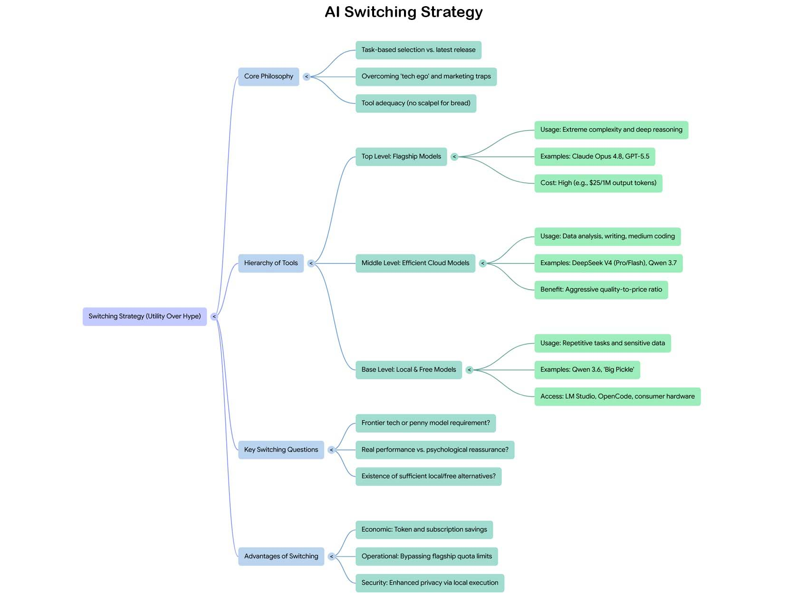

# Ti serve davvero l'ultimo modello AI? O stai aggiornando il tuo ego tecnologico?

*Ti serve davvero l'ultimo modello stato dell'arte per fare il tuo lavoro quotidiano? Se la tua risposta è "sì", sei sicuro che non ti abbia ingannato il marketing delle big tech? Anthropic, sorvolando sulla vicenda Fable 5 che meriterebbe un articolo a parte,  ha lanciato Claude Opus 4.8, OpenAI ha già in cantiere la prossima versione di ChatGPT, e tutti ci spingono a inseguire il modello più recente come se la nostra produttività dipendesse da quell'ultimo decimale di benchmark. Eppure, per il 90% delle attività quotidiane, un modello efficiente come, ad esempio, DeepSeek V4 Flash costa una frazione del prezzo e fa esattamente la stessa cosa. Vi ricorda qualcosa? A me sì, e cercherò di raccontarvela.*

Il 28 maggio 2026 Anthropic ha rilasciato [Claude Opus 4.8](https://www.anthropic.com/news/claude-opus-4-8), presentato con il consueto tono da evento cosmico. E i miglioramenti, a guardare bene, ci sono certo, ma non così clamorosi: il benchmark SWE-bench Verified sale dall'87,6 all'88,6 per cento, il SWE-bench Pro passa dal 64,3 al 69,2. Il modello [supera GPT-5.5 nella maggior parte delle prove pubblicate](https://www.tomshw.it/business/esce-opus-48-un-modello-piu-onesto-quando-sbaglia), con un margine di circa 121 punti ELO sul punteggio GDPval-AA. Fin qui, tutto bene il progresso c'è, ma di quanto? E soprattutto ti serve?

Poi guardi il prezzo, e lì si apre la storia vera. Opus 4.8 costa 5 dollari per milione di token in input e 25 in output, identico a Opus 4.7. C'è anche una modalità "fast" a 10 e 50 dollari rispettivamente, per chi vuole velocità massima senza guardare al portafoglio. La stabilità tariffaria è una scelta pensata per il mercato enterprise, dove chi ha integrato Claude in pipeline di produzione non deve riscrivere preventivi o rinegoziare budget IT. Ma per l'utente individuale, anche quello con abbonamento Pro, quella tariffa si traduce in quote che si esauriscono in fretta, soprattutto per task intensivi. E qui comincia il paradosso: il modello più potente disponibile è anche quello che molti utenti possono usare meno liberamente.

La reazione delle community è stata, come sempre in questi casi, un termometro interessante. Su Reddit e su X si è mescolata l'eccitazione per i miglioramenti al coding con la frustrazione per i limiti pratici. La domanda implicita nei post più critici era sempre la stessa: *vale davvero la pena pagare questo prezzo per qualche punto percentuale in più su un benchmark?* È una domanda che merita di essere presa sul serio, non liquidata come lamentela di chi non capisce il valore della tecnologia.

## La macchina dei rilasci

Aprite la [timeline dei modelli LLM](https://llmgateway.io/timeline) e guardatela con attenzione. Quello che vedete non è più il susseguirsi ordinato di generazioni ben distinte, un GPT-3 poi un GPT-4 poi il passo successivo, ciascuno con anni di distanza e miglioramenti radicali. Quello che vedete oggi assomiglia molto di più al calendario delle uscite di un produttore di smartphone di fascia alta: rilasci continui, numerazione che sale a scatti decimali, ogni annuncio costruito per sembrare una svolta mentre introduce aggiustamenti incrementali.

Solo nel mese di maggio 2026, giusto per dare la misura, sono usciti Claude Opus 4.8, Qwen3 Coder Next, MiniMax M2.5 Highspeed, MiniMax M2.7, Gemini 3.5 Flash. Ad aprile erano arrivati DeepSeek V4 Pro e Flash, MiMo V2.5 di Xiaomi, Qwen3.6 nelle sue varianti. A marzo GPT-5.5 Pro. Il ritmo è quello di un'industria che ha trasformato il rilascio di modelli in un atto comunicativo prima ancora che tecnico: dimostrare vitalità, rispondere ai competitor, alimentare l'attenzione mediatica.

Il parallelismo con il mercato degli smartphone non è una metafora pigra, è una struttura industriale che si sta replicando quasi punto per punto. Apple lancia iPhone ogni settembre. Samsung risponde con Galaxy S pochi mesi dopo. Google nel mezzo con Pixel. Ogni anno, per ogni dispositivo, la presentazione è costruita intorno a quella fotocamera leggermente migliorata, a quel processore qualche punto percentuale più veloce, a quello schermo con qualche nit di luminosità in più. Il ciclo è diventato un meccanismo di marketing prima che di innovazione, e [chi lo studia da fuori ha cominciato a chiedersi se non sia arrivato il momento di rallentare](https://www.bgr.com/2093151/annual-phone-upgrade-cycle-dead-reality/), sia per l'utilità reale degli aggiornamenti sia per le implicazioni ambientali di produzione e smaltimento.

Nell'AI il meccanismo è analogo ma più accelerato, perché i costi di produzione di un nuovo modello, pur enormi, non includono la logistica fisica di milioni di dispositivi hardware. Il risultato è una cadenza ancora più frenetica, con la differenza che qui non si butta via il vecchio telefono ma si continua a pagare un abbonamento, mentre ci viene detto che il modello del mese scorso è già obsoleto.

Vale la pena chiedersi chi guida davvero questa accelerazione. Anthropic ha rilasciato Opus 4.8 a cinque mesi di distanza da Opus 4.7, e il momento del lancio non sembra casuale: GPT-5.5 era uscito poche settimane prima, DeepSeek V4 stava guadagnando terreno con un rapporto qualità-prezzo aggressivo. La corsa non è dettata solo dal progresso tecnologico, ma dalla necessità di rispondere ai competitor nel momento in cui si avvicinano troppo. È una dinamica che chi ha vissuto le guerre degli smartphone degli anni Dieci riconosce perfettamente.

## Quando più potente non significa più utile

C'è un concetto in economia che si chiama rendimento marginale decrescente: ogni unità aggiuntiva di input produce un incremento di output sempre più piccolo. Un campo fertilizzato una volta produce molto di più che un campo non fertilizzato. Fertilizzarlo una seconda volta porta un beneficio, ma minore. Una terza volta, ancora meno. A un certo punto aggiungere fertilizzante non serve a nulla, o addirittura danneggia il raccolto.

Siamo lì. O molto vicini.

La frontiera dei modelli linguistici continua tecnicamente ad avanzare, i benchmark salgono, le capacità si affinano in aree specifiche come il coding agentico o il ragionamento multi-step. Ma la distanza percepita tra un modello flagship e il successivo si restringe ad ogni generazione, mentre il costo per accedervi non scende di pari passo. L'utente che usava GPT-4 nel 2023 aveva la sensazione di toccare qualcosa di radicalmente nuovo rispetto a GPT-3. L'utente che passa da Opus 4.7 a Opus 4.8 oggi difficilmente avrà la stessa sensazione, a meno che non stia lavorando su task di programmazione molto specifici dove quel salto da 64 a 69 punti su SWE-bench Pro fa davvero la differenza.

Il problema non è che i modelli smettano di migliorare. Il problema è il disallineamento crescente tra la narrativa del lancio, costruita per sembrare una svolta epocale, e l'esperienza reale della maggioranza degli utenti che per i propri task quotidiani, scrittura, analisi dati, automazione di flussi di lavoro, generazione di codice a complessità media, avrebbe risultati praticamente identici con un modello molto meno costoso.

E qui entra in scena il lato della storia che le big tech preferiscono non raccontare. Mentre Anthropic e OpenAI costruivano i propri modelli flagship, il panorama dei modelli alternativi stava diventando sempre più ricco e capace. [DeepSeek ha lanciato V4](https://www.tuttotech.net/news/2026/04/24/deepseek-lancia-v4.html) in due varianti, Pro e Flash, entrambi open source con licenza MIT, con un'architettura Mixture of Experts che porta 1.600 miliardi di parametri totali nel modello Pro, di cui soli 49 miliardi attivi durante l'inferenza. Il prezzo? Una frazione di quello dei modelli occidentali equivalenti. L'ambizione dichiarata non è vincere in ogni singola metrica, ma ridefinire il rapporto tra capacità e costo. Guardando ai risultati su task concreti, l'argomento regge.

C'è poi una direzione che vale la pena seguire anche se oggi richiede ancora hardware per pochi. Il 7 maggio 2026 Salvatore Sanfilippo, conosciuto nella comunità open source come Antirez, ha rilasciato DS4: un motore di inferenza locale scritto in C puro, ottimizzato specificatamente per DeepSeek V4 Flash su Apple Silicon. Chi conosce la storia del software riconosce il nome: Antirez è lo stesso che nel 2009 ha creato Redis da solo, il database in-memory che oggi gira sotto buona parte dell'infrastruttura web globale, e che ha guidato per undici anni con l'ossessione artigianale di chi scrive codice come atto espressivo prima ancora che come soluzione tecnica.

Sette giorni di lavoro a quattordici ore al giorno, 10.700 stelle su GitHub in pochi giorni dal rilascio. Il progetto usa una quantizzazione asimmetrica aggressiva, 2 bit per la maggior parte dei parametri e 8 per quelli critici, e permette di eseguire un modello da 284 miliardi di parametri totali su un Mac con 128 GB di RAM, tenendo il contesto conversazionale sull'SSD invece che in memoria unificata. Il verdetto di Antirez stesso, che non è tipo da entusiasmi facili, è stato inequivocabile: è la prima volta che trova un modello locale che usa per cose serie che normalmente avrebbe chiesto a Claude o GPT. Oggi DS4 richiede un Mac Studio o un Mac Pro con configurazione massimale, hardware da alcune migliaia di euro accessibile a pochi. Ma quando è Salvatore Sanfilippo a tracciare una direzione, vale la pena guardare dove porta.

## Big Pickle e la prova sul campo

Permettetemi di portare un modesto esempio recente e personale, perché a volte la teoria si capisce meglio quando ha un nome strano e un sito web da rifare.

Qualche settimana fa mi sono trovato con alcuni siti web da aggiornare: aspetto datato, architettura sovradimensionata rispetto alle esigenze reali, caricamento su una piattaforma pensata per applicazioni dinamiche quando in realtà si trattava di siti statici. Classico debito tecnico che si accumula silenziosamente finché non diventa abbastanza fastidioso da non poter essere ignorato oltre.

Ho usato [OpenCode](https://opencode.ai), un ambiente di sviluppo assistito da AI che integra diversi modelli e permette di lavorare direttamente sul codice con un'interfaccia a riga di comando. Ho scritto un prompt accurato ma sintetico, ho inserito il link al vecchio sito come riferimento visivo e stilistico, e in pochi minuti avevo la prima versione funzionante del sito nuovo: struttura moderna, codice pulito, caricamento drasticamente più veloce. Qualche iterazione per sistemare dettagli, e il lavoro era fatto. Poi ho ripetuto il processo per gli altri siti. Neanche una giornata di lavoro totale per attività che avrei potuto procrastinare per mesi.

Il dettaglio interessante non è lo strumento in sé ma il modello che ho usato. Tra le opzioni gratuite disponibili ce n'era uno con un nome che avrebbe fatto ridere qualsiasi marketing manager di un'azienda tech seria: "Big Pickle". Nessuna presentazione, nessun comunicato stampa, nessun benchmark pubblicizzato. Chissà quale modello si nasconde dietro quello pseudonimo, probabilmente qualcosa di più noto con un nome diverso per ragioni di licensing o sperimentazione. Accanto a lui, sempre gratuiti, DeepSeek V4 Flash, MiMo V2.5 di Xiaomi, Nemotron 3 Super di NVIDIA.

Ho scelto Big Pickle, essenzialmente per curiosità. Il risultato è stato perfetto per lo scopo. Nessun limite di quota raggiunto, nessun costo, nessuna attesa per un modello troppo carico. E soprattutto: nessuna necessità di usare un modello di frontiera per quel tipo di task. Avrei potuto aprire Claude con Opus 4.8 e spendere crediti preziosi per ottenere lo stesso identico risultato? Sì. Aveva senso farlo? Secondo me no.

Questo è il punto centrale della strategia di switching che voglio introdurre. Non si tratta di demonizzare i modelli flagship o di sostenere che siano inutili, perché non lo sono. Si tratta di sviluppare la consapevolezza critica per capire quando sono necessari e quando sono un lusso non richiesto dal task che si ha davanti.

*Mappa per la Strategia di Switching AI*

## La mappa degli strumenti

Pensare all'AI come a un unico strumento monolitico da aggiornare periodicamente è l'errore concettuale che il marketing delle big tech vuole che facciamo. È come pensare al proprio set di utensili da cucina come a un'unica entità da sostituire ogni volta che esce il modello più recente del coltello da chef, ignorando che per sbucciare una patata basta un pelapatate e che usare un coltello Shun da 300 euro per quello scopo non produce patate migliori.

La strategia di switching parte da una domanda semplice: cosa sto cercando di fare, e quale livello di capacità è davvero necessaria per farlo bene?

Per task di estrema complessità, scrittura di sistemi critici, ragionamento su problemi multi-step con molte variabili interdipendenti, analisi di documenti lunghi e densi che richiedono comprensione profonda del contesto, i modelli flagship hanno ancora un vantaggio reale e misurabile. Se stai scrivendo il kernel di un sistema operativo o costruendo un agente autonomo per pipeline di produzione enterprise, quel vantaggio vale il costo.

Per tutto il resto, che copre la stragrande maggioranza dell'uso quotidiano, il panorama alternativo è ricco e spesso gratuito o quasi. [DeepSeek V4 Flash](https://www.tuttotech.net/news/2026/04/24/deepseek-lancia-v4.html) gestisce egregiamente data analysis, scraping, ricostruzione di dataset, generazione di testo strutturato, a una frazione del costo. I modelli della famiglia Qwen di Alibaba, arrivati alle versioni 3.6 e 3.7, competono con i migliori modelli occidentali su molti benchmark pur essendo disponibili gratuitamente via API o eseguibili in locale su hardware consumer.

Ed è qui che la conversazione si fa davvero interessante, perché il locale non è più un'opzione da nerd con server rack in cantina. [Come ho esplorato con Qwen 3.6 da 35 miliardi di parametri](https://aitalk.it/it/qwen36-35b-ai.html), un PC con 32 GB di RAM e una GPU con 16 GB di VRAM, configurazione non più straordinaria nel 2026, riesce a eseguire modelli di quella dimensione con prestazioni sorprendenti su task reali. LM Studio ha reso l'installazione e la gestione di modelli locali accessibile a chiunque sappia usare un'interfaccia grafica, senza perdere un pomeriggio in configurazioni da terminale. Il vantaggio del locale non è solo economico: è la privacy completa dei dati, l'assenza di limiti di quota, la disponibilità offline.

La gerarchia pratica che emerge da questa analisi è stratificata. In cima, per i task che davvero lo richiedono, i modelli flagship a pagamento. Nel mezzo, per la maggior parte del lavoro quotidiano, modelli come DeepSeek V4 Pro o Flash, accessibili via API a costi contenuti o tramite interfacce come OpenCode che aggregano più provider. Alla base, per task ripetitivi, veloci, o che coinvolgono dati sensibili, modelli locali su hardware di fascia media. E trasversalmente, per chi vuole esplorare senza spendere, una serie di opzioni gratuite che un anno fa sarebbero state considerate di ottima qualità e che oggi, per molti scenari, sono semplicemente più che sufficienti.

Vale la pena fare almeno una volta all'anno questo esercizio mentale, anche solo con carta e penna. Prendi un task che esegui spesso, diciamo riassumere documenti lunghi o generare bozze di testo strutturato, e chiediti quanto ti costa farlo con il modello che usi abitualmente. Poi cerca il costo dello stesso task su un modello alternativo capace di gestirlo altrettanto bene. La differenza, moltiplicata per il volume mensile, è il tuo costo opportunità: quello che stai pagando non per avere prestazioni migliori, ma semplicemente per non aver fatto il confronto.

I numeri specifici cambiano continuamente, i provider aggiustano i prezzi, escono nuovi modelli, le promozioni scadono, e qualsiasi tabella di confronto pubblicata oggi è già parzialmente obsoleta domani. Ma la logica del calcolo resta valida indipendentemente da chi vince la corsa in un determinato momento: il modello giusto non è quello più potente disponibile, è quello il cui costo riflette realmente il valore che produce per te, su quel task, con quel volume.

## Scegliere, non inseguire

C'è una scena nel videogioco *Disco Elysium* in cui il protagonista, un detective con la memoria distrutta, deve ricostruire la propria identità pezzo per pezzo scegliendo consapevolmente quali abilità sviluppare, quali valori abbracciare, quale tipo di persona tornare a essere. Il gioco ti mette davanti a decine di opzioni, tutte plausibili, tutte con i propri vantaggi, e ti chiede di resistere alla tentazione di volerle tutte. La capacità di scegliere con criterio, non quella di accumulare, è ciò che costruisce un personaggio coerente e capace.

Il parallelo con la scelta degli strumenti AI è meno forzato di quanto sembri. Il mercato oggi ci offre decine di modelli, tutti presentati come indispensabili, tutti con qualcosa da offrire. La risposta istintiva, alimentata da anni di marketing tecnologico, è inseguire il migliore disponibile in ogni momento. La risposta intelligente è costruire una propria gerarchia consapevole, basata sui task reali che si affrontano ogni giorno.

Questo non significa ignorare i progressi. Opus 4.8 è un modello migliore di Opus 4.7, e lo sarà ancora di più per chi lavora su coding agentico avanzato o su pipeline enterprise dove la riduzione delle allucinazioni vale da sola il costo della migrazione. I miglioramenti ci sono, anche quando sono incrementali. La domanda non è se i modelli migliorano, ma se quel miglioramento vale per il tuo caso d'uso specifico, adesso, con il budget che hai.

Le domande che vale la pena porsi prima di ogni upgrade sono poche e dirette. Il task che devo svolgere richiede davvero capacità di ragionamento ai limiti della frontiera tecnologica, o è qualcosa che un modello da un centesimo a milione di token risolve altrettanto bene? Sto pagando per prestazioni oggettivamente migliori sul mio flusso di lavoro reale, o sto pagando per la rassicurazione psicologica di avere l'ultimo modello? Esiste una versione locale o gratuita che gestisce questo task in modo sufficiente alla mia aspettativa? 

Le grandi aziende tech hanno tutto l'interesse a farci rispondere sempre "sì, mi serve l'ultimo modello uscito". È il meccanismo che alimenta gli abbonamenti, i rinnovi, la dipendenza dal fornitore. Non è necessariamente malafede, è semplicemente la logica di un mercato che ha imparato a monetizzare l'ansia da prestazione tecnologica nello stesso modo in cui i produttori di smartphone hanno monetizzato quella da status symbol. Il ciclo si autosostiene perché funziona, almeno per chi lo vende.

L'alternativa non è il luddismo né la nostalgia per i modelli di due anni fa. È la lucidità di chi capisce che il valore di uno strumento non si misura nella sua posizione in classifica, ma nella sua adeguatezza al compito. Un bisturi Titanium non taglia meglio il pane di un coltello da cucina ordinario. Un modello da 25 dollari per milione di token in output non produce email migliori di uno che ne costa due.

La vera competenza che questo momento storico richiede non è saper usare il modello più potente disponibile. È saper scegliere, ogni volta, quello giusto.

---

*Tutti i prezzi e i benchmark citati fanno riferimento alle informazioni disponibili al momento della pubblicazione, maggio 2026. Il panorama dei modelli AI evolve rapidamente: verificate sempre le fonti primarie dei singoli provider per dati aggiornati.*
