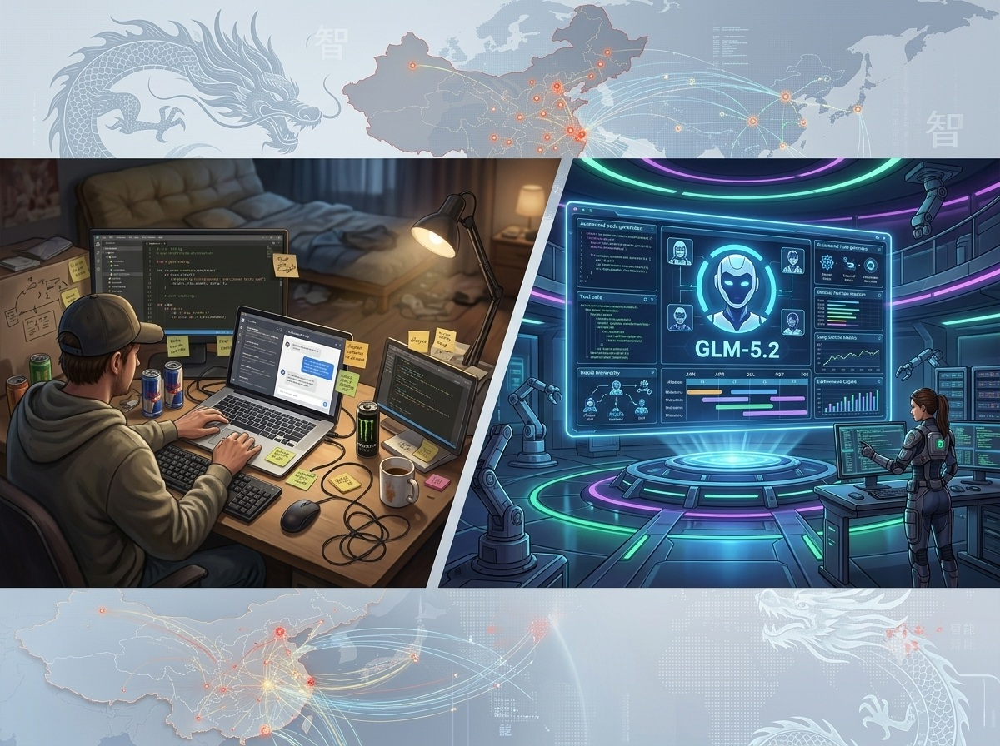
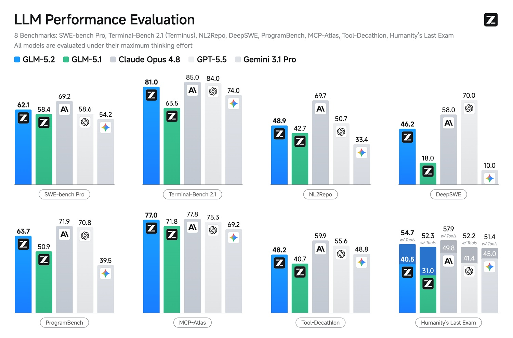
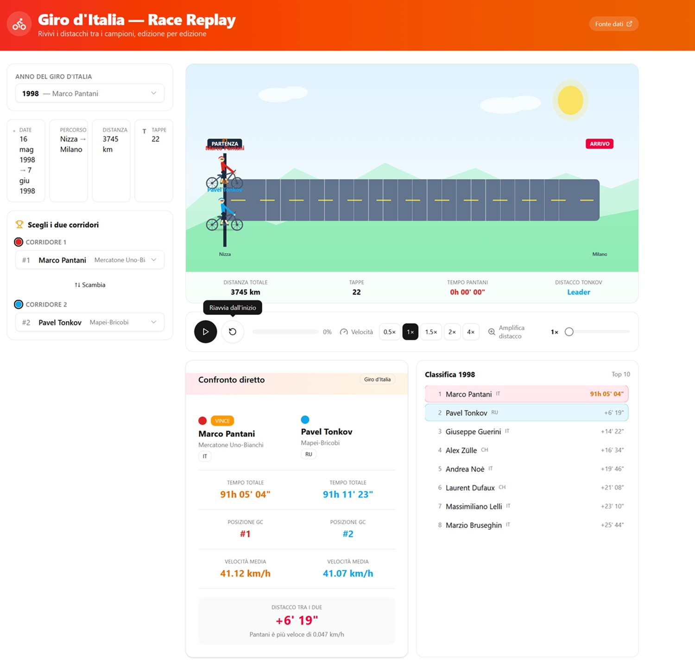

# GLM-5.2: el open-weight chino che cierra la brecha, al menos en el coding

*Cuando Z.ai, el laboratorio que en China todos conocen aún como Zhipu AI, lanzó [GLM-5](https://aitalk.it/it/glm-5.html) el pasado febrero, el mensaje ya era claro: la serie GLM no buscaba ser simplemente competitiva, buscaba ser relevante para quienes hacen software. Aquel modelo de 744 mil millones de parámetros con arquitectura Mixture-of-Experts había puesto sobre la mesa un rendimiento que no desentonaba junto a los grandes propietarios, con la diferencia nada secundaria de los pesos abiertos bajo licencia MIT. Poco más de cuatro meses después, el 13 de junio de 2026, Z.ai ha vuelto a subir la apuesta: GLM-5.2 llegó primero a los niveles del GLM Coding Plan, los planes de suscripción dedicados a los desarrolladores, y luego, el 16 de junio, a la API pública y a [Hugging Face](https://huggingface.co/zai-org/GLM-5.2) con los pesos libremente descargables.*

El salto de 5.1 a 5.2 podría parecer una actualización incremental, el tipo de lanzamiento que las empresas usan para mantenerse visibles entre un ciclo y otro. No lo es. GLM-5.2 trae consigo un contexto de un millón de tokens que, por primera vez en la serie, Z.ai declara como "sólido", una palabra elegida con cuidado, en contraste con la tendencia del sector de publicitar ventanas enormes que en la práctica se degradan ya más allá de las cien mil posiciones. Y trae consigo una serie de resultados en los benchmarks de coding a largo horizonte que merecen ser leídos con atención, sin énfasis pero sin minimizar.

## Arquitectura: 753 mil millones con cerebro disperso

GLM-5.2 es un modelo MoE de 753 mil millones de parámetros totales con unos 40 mil millones activos por token. Esto significa que en cada inferencia el modelo "enciende" solo una fracción especializada de su red neuronal, un poco como una orquesta en la que tocan juntos solo los músicos necesarios para esa pieza, no los ciento treinta. Esto permite tener la capacidad expresiva de un modelo enorme con costes computacionales mucho más contenidos en comparación con una arquitectura densa equivalente.

La principal novedad arquitectónica respecto a GLM-5.1 es una técnica que Z.ai llama IndexShare en su propia documentación, descrita en el paper como [IndexCache](https://arxiv.org/abs/2603.12201). En las arquitecturas con atención dispersa, aquellas que permiten al modelo "mirar" selectivamente porciones del contexto en lugar de todo, el componente que decide dónde mirar se llama indexer. En GLM-5.2, cada cuatro capas de atención dispersa comparten el mismo indexer en lugar de calcular uno por separado. El resultado es una reducción de los cálculos por token de 2,9 veces con un contexto de un millón de tokens: un ahorro computacional que hace realmente utilizable, no solo publicitable, esa ventana enorme.

La otra mejora está en la capa MTP, el mecanismo de decodificación especulativa que permite generar más tokens por adelantado y luego verificarlos. Combinando IndexShare con un sistema de KV-cache compartida y un entrenamiento con TV loss end-to-end, Z.ai ha aumentado la tasa de aceptación de los tokens especulativos en un 20%. En la práctica: respuestas más rápidas a igual calidad, un detalle relevante para quienes usáis el modelo en pipelines agénticos donde la latencia se multiplica por cientos de llamadas.

El contexto de un millón de tokens no es solo una cifra para los comunicados de prensa. Z.ai ha llevado a cabo meses de entrenamiento especializado en escenarios de coding-agent: implementaciones a gran escala, investigación automatizada, optimización de rendimiento, debugging complejo. El objetivo declarado era que el modelo no se limitara a aceptar más tokens en la entrada, sino que mantuviera la calidad y la coherencia a lo largo de toda la trayectoria, lo cual es algo totalmente distinto. La documentación técnica habla explícitamente de "engineering judgments formed earlier" que el modelo debe saber "carry forward into subsequent execution": entender arquitecturas, recordar restricciones de API, respetar convenciones de código establecidas veinte pantallas antes.

## Los benchmarks: dónde gana, dónde persigue

La forma más honesta de leer los números de GLM-5.2 es separarlos por categoría, porque el modelo no es uniformemente fuerte en todo, y es precisamente esta selectividad la que lo hace interesante como señal de tendencia más que como objeto de hype.

En el coding estándar, GLM-5.2 es el modelo open-weight más fuerte disponible. En [Terminal-Bench 2.1](https://terminal-bench.com) obtiene 81.0 frente al 63.5 de GLM-5.1, un salto de casi 18 puntos que no se explica con ajustes marginales. En SWE-bench Pro marca 62.1 frente al 58.4 del predecesor, superando a Qwen3.7-Max (60.6), MiniMax M3 (59) y DeepSeek-V4-Pro (55.4). Claude Opus 4.8 sigue por delante con 69.2, GPT-5.5 se queda en 58.6.

Donde GLM-5.2 hace lo más sorprendente es en los benchmarks a largo horizonte, aquellos que miden la capacidad de completar proyectos de ingeniería complejos, no funciones individuales. En [FrontierSWE](https://www.frontierswe.com), que mide la capacidad de llevar adelante proyectos técnicos con una duración de horas o decenas de horas, GLM-5.2 marca 74.4 frente al 30.5 de la versión anterior: más que duplicado. Dista solo un punto porcentual de Claude Opus 4.8 (75.1) y supera a GPT-5.5 (72.6) por casi dos puntos. En [PostTrainBench](https://posttrainbench.com), donde a cada agente se le asigna una GPU H100 para mejorar modelos más pequeños mediante post-training, GLM-5.2 marca 34.3 superando tanto a GPT-5.5 (28.4) como a Claude Opus 4.7, siendo solo superado por Opus 4.8 (37.2). En [SWE-Marathon](https://swe-marathon.vercel.app), el campo de pruebas más brutal, con tareas como construir compiladores y desarrollar servicios de nivel de producción, el modelo sube a 13.0 desde el 1.0 anterior, pero aquí la distancia con Claude Opus 4.8 (26.0) es todavía clara.

En el razonamiento general el panorama es más variado. En HLE (Humanity's Last Exam) GLM-5.2 obtiene 40.5, en línea con GPT-5.5 (41.4) pero lejos de Claude Opus 4.8 (49.8) y Gemini 3.1 Pro (45). En AIME 2026 marca 99.2, tercero absoluto en la tabla. El perfil general es el de un modelo optimizado con precisión para las cargas de trabajo de ingeniería, no un generalista para todo.

Un detalle importante se refiere al control del "nivel de esfuerzo": GLM-5.2 expone dos presets, High y Max, que permiten equilibrar rendimiento y latencia. Con el ajuste Max el modelo consume más tokens, y el dato de Artificial Analysis es esclarecedor: en la evaluación del Intelligence Index generó 140 millones de tokens frente a una media de 110 millones. Más verboso de lo necesario, por tanto, y esto se traduce en costes más altos por sesión. No es un defecto oculto, es una característica que debéis conocer antes de construir pipelines de producción.

[Imagen tomada del repositorio github.com](https://github.com/zai-org/GLM-5)

## Prueba sobre el terreno: veinte minutos de Giro de Italia

Vale la pena relatar una prueba directa, con todos sus límites declarados de antemano. Usé la versión gratuita del chatbot en [chat.z.ai](https://chat.z.ai), que no expone el máximo rendimiento del modelo, usa un contexto reducido y no tiene acceso a los effort levels, con una petición deliberadamente escueta: construir una web app que, tomando datos históricos del Giro de Italia, visualizara con una simple animación gráfica las diferencias entre corredores elegidos por el usuario en una edición especificada por el usuario.

En unos veinte minutos el modelo produjo un proyecto completo: Next.js 16 con App Router, TypeScript, Tailwind CSS, componentes SVG animados para los ciclistas, arquitectura con route handler, un dataset de 37 ediciones históricas, animación proporcional de las diferencias, controles de velocidad y amplificación de la brecha. Una especificación técnica articulada en múltiples niveles, con elecciones arquitectónicas coherentes y código funcional. El nivel de organización y razonamiento estructural fue genuinamente impresionante.

El límite se manifestó en los datos: muchos tiempos de corredores y algunas clasificaciones históricas contenían errores, requiriendo peticiones de corrección. No es una sorpresa, se trata de informaciones fácticas específicas sobre las que los modelos alucinan con regularidad, y la versión gratuita seguramente no ofrece el máximo rendimiento del modelo. Sin embargo, las pruebas realizadas por conocidos divulgadores con planes de pago y acceso completo devuelven resultados de coding netamente superiores, confirmando que el nivel gratuito es un punto de entrada, no una representación fiel de las capacidades del modelo.

*Captura de pantalla de la aplicación desarrollada con GLM 5.2*

## El precio que cambia el discurso

El detalle que hace de GLM-5.2 una conversación seria para los equipos de desarrollo no es ninguno de los benchmarks citados arriba. Es el precio. La API standalone, activa desde el 16 de junio, cuesta 1,40 dólares por millón de tokens en la entrada y 4,40 en la salida, con input cache a 0,26 dólares, aproximadamente una quinta parte del coste normal por contexto repetido. A título comparativo: GPT-5.5 cuesta 5 dólares por millón en la entrada y 30 en la salida; Claude Opus 4.8 5 dólares en la entrada y 25 en la salida. El coste medio de GLM-5.2 es aproximadamente un sexto del de GPT-5.5.

Para un equipo que hace coding agéntico con pipelines intensivos, cientos de miles de tokens por sesión, varias sesiones al día, la diferencia no es marginal. Es la diferencia entre un servicio que equilibra fatigosamente las cuentas y uno que las hace cuadrar con margen.

Existe también el GLM Coding Plan, el modelo de suscripción plana pensado para quienes usáis el modelo directamente dentro de herramientas como Claude Code, Cline, OpenCode, Roo Code y una decena de otros entornos de desarrollo compatibles. El nivel base parte de unos 10-18 dólares al mes, con cuotas en prompts por ciclo horario en lugar de por token, un modelo de precios más previsible para desarrolladores individuales. El nivel Max sube hacia los 80 dólares mensuales con volúmenes mucho más altos. Durante el horario de máxima audiencia (14:00-18:00 hora de Pekín) el consumo de cuota se multiplica; fuera de hora punta, al menos hasta finales de septiembre de 2026, la promoción en curso pone a cero el multiplicador.

Para quienes queráis eliminar por completo la partida de costes: los pesos están disponibles bajo licencia MIT, sin restricciones de campo de uso, sin umbrales de usuarios activos mensuales, sin acuerdos comerciales por separado. El modelo completo en FP8 ocupa unos 800 GB en disco y corre en producción sobre 8 GPUs H200 con headroom suficiente para el contexto de un millón de tokens. Una versión cuantizada INT4 baja a unos 200 GB y funciona sobre 4 H200 con una regresión de aproximadamente el 1-3% en los benchmarks de coding, una pérdida aceptable para muchos escenarios empresariales, especialmente considerando la desaparición del coste por token. El modelo está disponible también en [OpenRouter](https://openrouter.ai/z-ai/glm-5.2) con precios ligeramente inferiores y acceso a más de trece proveedores que compiten en costes de inferencia.

## Quién gana, quién pierde, qué queda abierto

El lanzamiento de GLM-5.2 no tiene un solo protagonista y no produce un solo efecto. Vale la pena mirarlo desde múltiples ángulos.

Para los equipos de desarrollo que usáis asistentes de código o pipelines agénticos, el mensaje más concreto es que existe ahora un modelo open-weight con rendimientos en el territorio de los mejores propietarios en tareas de ingeniería, a un coste que cambia significativamente el cálculo económico. No es seguro que sea la elección correcta para cada contexto, la verbosidad, los costes efectivos con esfuerzo Max y la varianza entre ejecuciones siguen siendo factores a evaluar caso por caso, pero es la primera vez que la conversación puede desarrollarse sobre bases de igualdad técnica real, no solo ideológica.

Para el mercado open-weight en su conjunto, GLM-5.2 consolida una tendencia que ya había mostrado señales claras con GLM-5.1 y con Kimi K2.7 de Moonshot AI: los modelos chinos de arquitectura abierta ya no persiguen a los propietarios occidentales con seis meses de retraso en benchmarks genéricos. En verticales específicas, coding, tareas agénticas, contextos largos, están construyendo ventajas propias, y lo hacen con estructuras de costes que el duopolio OpenAI-Anthropic no puede replicar fácilmente.

Sin embargo, hay sombras que es incorrecto ignorar. Z.ai está en la Entity List del Bureau of Industry and Security estadounidense desde el 15 de enero de 2025: los pesos MIT son legalmente utilizables por empresas privadas, pero los clientes federales americanos y la mayoría de los contratistas principales de defensa tratan de hecho los modelos de origen chino como inaccesibles, independientemente de la licencia. Para las empresas europeas en sectores regulados, la ausencia de un AI Act GPAI Code of Practice firmado por Zhipu, y la falta de una ficha técnica Annex XI, descarga el peso del cumplimiento de la transparencia sobre los implementadores finales. No son vetos absolutos, pero son costes y riesgos que deben tenerse en cuenta junto con los de los tokens.

La pregunta que queda abierta es la más interesante: ¿es GLM-5.2 la señal de que la ventaja competitiva de los modelos propietarios de alta gama se está erosionando específicamente en el coding, o es una excelencia vertical que deja intactas diferencias significativas en todo lo demás? La respuesta honesta, por el momento, es que en tareas fuera del coding y de la agencialidad los benchmarks muestran un modelo fuerte pero no excepcional. El posicionamiento es declarado y coherente: Z.ai no está intentando hacer el mejor modelo general del mundo, está intentando ser la referencia para quienes construyen software. Si lo está logrando, lo medirá la adopción en los próximos meses, en los registros de producción de los equipos que usarán GLM-5.2 como columna vertebral de sus pipelines, no en las tablas comparativas que cada laboratorio prepara para quedar bien.
