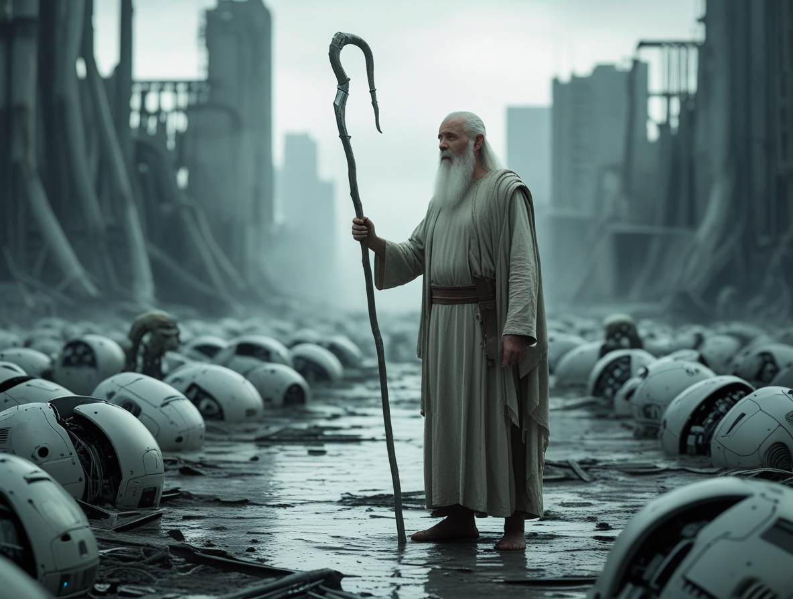
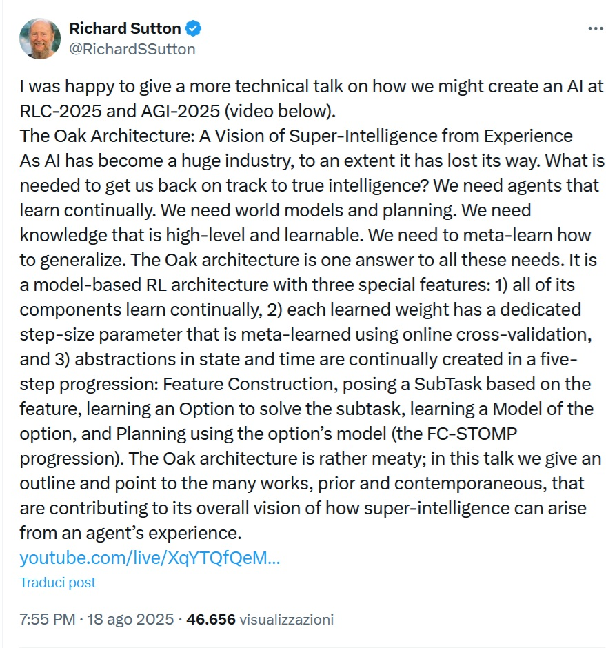
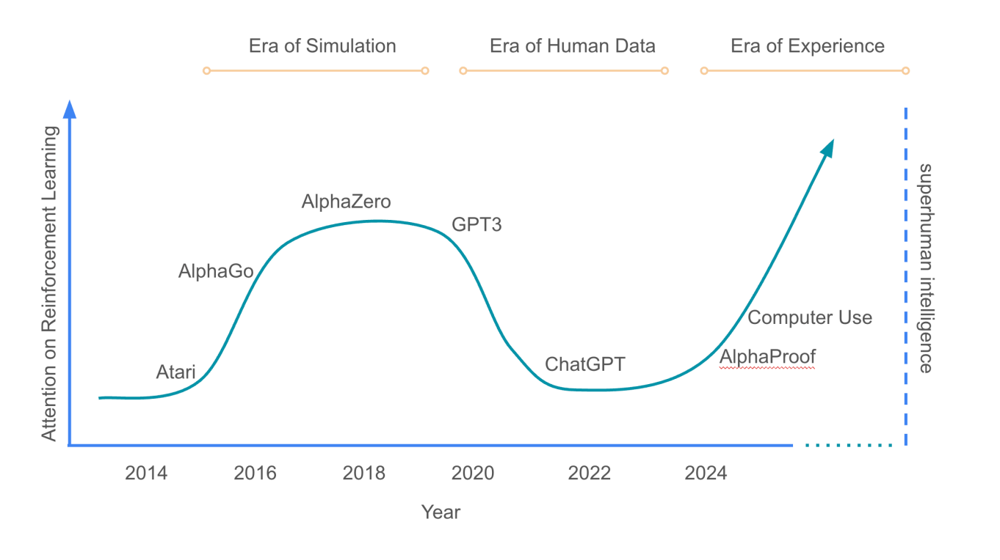

# Il "Nobel" per l'informatica:"Produttori AI, Avete Perso la Strada"

*Immaginate un cuoco stellato che, dopo aver inventato la ricetta perfetta per il risotto, scopre che tutti i ristoranti del mondo stanno servendo ai clienti solo il riso crudo con sopra una spolverata di parmigiano. È più o meno quello che deve provare Richard Sutton osservando l'attuale panorama dell'intelligenza artificiale. Il [co-vincitore del Turing Award 2024](https://awards.acm.org/turing) - quello che nel mondo informatico equivale al Nobel - ha lanciato un j'accuse che suona come un campanello d'allarme per un'industria che, secondo lui, ha completamente smarrito la direzione verso la vera intelligenza.*

## L'Anatomia di una Rivoluzione Tradita

Sutton, figura di spicco nel reinforcement learning e vincitore del Turing Award, afferma che l'industria AI ha perso la strada, e non si tratta di una critica mossa da qualche accademico brontolone relegato in un angolo dell'università. Stiamo parlando di uno dei [padri fondatori dell'apprendimento computazionale per rinforzo](https://www.ualberta.ca/en/computing-science/news-and-events/news/2025/march/rich-sutton-receives-the-2024-acm-am-turing-award.html), colui che insieme ad Andrew Barto ha gettato le basi concettuali e algoritmiche di quello che oggi permette ai robot di imparare a camminare e alle auto autonome di navigare nel traffico.

Ma cosa intende esattamente Sutton quando dice che l'industria "ha perso la strada"? La sua critica non è rivolta ai risultati commerciali - quelli sono innegabili - ma al fatto che l'attuale approccio dominante nell'AI sta costruendo castelli di sabbia invece che fondamenta solide per l'intelligenza del futuro. [Come scrive su X](https://x.com/RichardSSutton/status/1957501548214513897), "Man mano che l'AI è diventata un'industria enorme, in una certa misura ha perso la strada", argomentando che i progressi recenti hanno ignorato i principi fondamentali necessari per una vera intelligenza.

Il nocciolo della questione è filosofico quanto tecnico. Gli attuali Large Language Models, quelli giganti che divorano terabyte di testo per restituirci risposte apparentemente intelligenti, secondo Sutton fanno esattamente l'opposto di quello che dovrebbe fare una vera intelligenza artificiale: hanno la loro conoscenza "programmata" al momento della progettazione, piuttosto che scoperta attraverso l'apprendimento esperienziale.

## Il Grande Malinteso: Scaling vs Learning

Per capire la profondità della critica di Sutton, bisogna fare un passo indietro e considerare quello che lui stesso ha chiamato la ["Bitter Lesson"](http://www.incompleteideas.net/IncIdeas/BitterLesson.html) nel 2019 - un saggio che è diventato una specie di manifesto nell'AI research. La lezione amara è questa: nel lungo termine, i metodi scalabili e generali vincono sempre sui sistemi costruiti incorporando conoscenze specifiche del dominio. È come la differenza tra insegnare a qualcuno a pescare e dargli un pesce ogni giorno: il primo approccio scala indefinitamente, il secondo ti obbliga a continuare a pescare per lui.

Eppure, guardando l'industria oggi, sembra che tutti abbiano deciso di pescare per le loro AI invece di insegnargli a farlo. I modelli linguistici contemporanei sono alimentati con quantità astronomiche di testo umano, assorbendo pattern e correlazioni in modo passivo. È un approccio che funziona - e i risultati sono sotto gli occhi di tutti - ma che secondo Sutton rappresenta un vicolo cieco evolutivo.

La critica diventa ancora più pungente quando si considera che Sutton ha lavorato proprio in Google DeepMind, una delle aziende che ha contribuito maggiormente al successo dei modelli linguistici. Non si tratta quindi del classico outsider che spara a zero contro il sistema, ma di qualcuno che conosce intimamente i meccanismi interni dell'industria e che ha deciso di alzare la voce dall'interno.

## L'Architettura Oak: Un Manifesto per il Futuro

Sutton non si limita a diagnosticare il problema - propone anche una soluzione radicale chiamata architettura Oak (Options and Knowledge). È un framework che potrebbe sembrare uscito direttamente da un episodio di Black Mirror, se Black Mirror fosse scritto da ingegneri ottimisti invece che da sceneggiatori pessimisti.

Oak si basa su tre principi fondamentali: l'agente deve essere general-purpose, partendo senza conoscenze specifiche su alcun mondo particolare; l'apprendimento è interamente guidato dall'esperienza, con l'agente che acquisisce conoscenza esclusivamente attraverso l'interazione diretta con il suo ambiente; e si applica l'ipotesi del reward, secondo cui ogni obiettivo può essere ridotto alla massimizzazione di un semplice segnale di ricompensa scalare.

Il cuore di Oak è un loop auto-rinforzante che suona quasi mistico nella sua semplicità: l'agente crea astrazioni di livello sempre più alto attraverso il feedback, dove le caratteristiche che aiutano nella pianificazione e nella risoluzione di problemi diventano la base per la prossima generazione di conoscenza, ancora più astratta. Questo processo è aperto, limitato solo dalla potenza di calcolo disponibile, e secondo Sutton potrebbe eventualmente aprire la strada alla superintelligenza.

Sembra fantascienza, ma c'è un problema molto terreno che impedisce di realizzare questa visione: Oak dipende da algoritmi che possano apprendere continuamente e stabilmente senza dimenticare quello che hanno già imparato. È il famoso problema del "catastrophic forgetting" - quando una rete neurale impara qualcosa di nuovo, tende a "sovrascrivere" quello che sapeva prima, come un hard disk che continua a cancellare i file vecchi per fare spazio a quelli nuovi.

## Il Paradosso del Continuous Learning

Qui arriviamo al cuore tecnico della questione, quello che separa i sogni dalla realtà implementabile. Sutton identifica il problema principale dei sistemi attuali nel fatto che non possono apprendere continuamente: lottano con il catastrophic forgetting, dove nuove informazioni sovrascrivono quello che hanno già imparato, perdendo la capacità di continuare ad apprendere nel tempo.

È un po' come se ogni volta che impariamo una lingua nuova dovessimo dimenticare tutte quelle che sapevamo prima. Per gli esseri umani questo non accade - o almeno non in modo così drastico - perché i nostri cervelli hanno sviluppato meccanismi sofisticati per integrare nuove conoscenze senza cancellare quelle precedenti. Ma i nostri algoritmi di deep learning sono ancora primitivi in questo senso: bravi a imparare da zero su enormi dataset, ma incapaci di continuare ad apprendere senza perdere stabilità.

Questo non è solo un dettaglio tecnico - è la differenza tra costruire un'intelligenza che cresce e si evolve continuamente e una che rimane congelata al momento della sua ultima sessione di training. Ed è qui che la critica di Sutton diventa più che mai attuale: l'industria sta investendo trilioni in sistemi che, per quanto impressionanti, rappresentano essenzialmente istantanee statiche di conoscenza piuttosto che intelligenze dinamiche e adattive.

[*Immagine tratta da medium.com*](https://medium.com)

## La Voce Dissidente nell'Era dello Scaling

Sutton si unisce ad altri ricercatori di primo piano nel criticare la fissazione dell'industria sullo scaling dei large language model, ma la sua posizione è particolarmente interessante perché arriva da qualcuno che non può essere accusato di essere fuori dal giro. Il [Turing Award che ha ricevuto nel 2024](https://www.nsf.gov/news/ai-pioneers-andrew-barto-richard-sutton-win-2024-turing) insieme ad Andrew Barto è arrivato con un assegno da un milione di dollari sponsorizzato da Google, l'azienda che più di tutte ha spinto l'approccio basato sui grandi modelli linguistici.

La sua critica assume così i contorni di una vera e propria dissidenza intellettuale dall'interno del sistema. Quando uno dei vincitori del "Nobel dell'informatica" che ha lavorato per una delle Big Tech più influenti nel settore AI dice che l'industria ha perso la strada, forse vale la pena di prestare attenzione.

Ma Sutton non è solo nel suo scetticismo. Insieme a David Silver, professore all'University College London, noto tra le altre cose per aver guidato lo sviluppo di AlphaGo, il sistema che nel 2016 ha sconfitto il campione mondiale di Go Lee Sedol, ha recentemente [pubblicato un paper](https://storage.googleapis.com/deepmind-media/Era-of-Experience%20/The%20Era%20of%20Experience%20Paper.pdf) che argomenta che l'AI dovrebbe imparare facendo, non solo assorbendo enormi quantità di testo scritto da esseri umani. È una posizione che risuona con crescente forza in una parte della comunità di ricerca che vede negli LLM una strada verso il successo commerciale ma non necessariamente verso l'intelligenza generale.

## Le Implicazioni di una Rivoluzione Mancata

Se Sutton ha ragione - e la sua credibilità scientifica suggerisce che vale la pena prendere sul serio le sue argomentazioni - cosa significa questo per il futuro dell'AI? Primo, potremmo trovarci in quello che i biologi chiamano un "vicolo cieco evolutivo": un percorso che porta a successi localizzati ma che non ha sbocchi verso livelli superiori di complessità.

I current AI systems, per quanto impressionanti nelle loro capacità linguistiche e di ragionamento, potrebbero rappresentare una specie di plateau tecnologico - sistemi che eccellono in compiti specifici ma che non possono evolvere verso forme più generali e adattive di intelligenza. È come se avessimo perfezionato la macchina da scrivere proprio quando stavamo per inventare il computer.

Secondo, c'è una questione più profonda di sostenibilità e efficienza. Gli attuali approcci richiedono quantità crescenti di dati e potenza computazionale, seguendo una curva che potrebbe non essere sostenibile a lungo termine. L'approccio proposto da Sutton, basato su agenti che imparano attraverso l'interazione diretta con l'ambiente, potrebbe rappresentare un percorso più efficiente verso l'intelligenza artificiale generale.

## Verso un Futuro Incerto ma Affascinante

La visione di Sutton per il futuro dell'AI non è semplicemente tecnica - è quasi filosofica nella sua portata. Immagina sistemi che non solo processano informazioni ma che realmente "comprendono" il mondo attraverso l'esperienza diretta, che costruiscono modelli sempre più sofisticati della realtà attraverso l'interazione e il feedback continuo.

È una visione che richiede una rivoluzione non solo algoritmica ma anche infrastrutturale. Come spiega Sutton, "quello di cui abbiamo bisogno per tornare sulla strada giusta verso la vera intelligenza sono agenti che imparano continuamente, modelli del mondo e pianificazione, conoscenza di alto livello e apprendibile, e la meta-capacità di imparare come generalizzare".

Certo, c'è il rischio che questa sia la classica "next big thing" che rimane sempre "next" senza mai diventare "current". Il continuous learning stabile rimane uno dei problemi più difficili nell'AI, e non è chiaro quando - o se - riusciremo a risolverlo. Ma se c'è una lezione che la storia della tecnologia ci ha insegnato, è che le rivoluzioni spesso arrivano dai luoghi più inaspettati, proposte da voci che inizialmente suonano come dissidenti.

Richard Sutton, con il suo track record di innovazioni che hanno definito il campo e la sua posizione unica come insider critico, potrebbe essere esattamente il tipo di voce che l'industria AI ha bisogno di sentire. Anche se - e forse soprattutto se - quello che dice mette in discussione tutto quello che abbiamo costruito finora.

Nel frattempo, mentre l'industria continua a spingere i limiti di quello che i large language model possono fare, dall'Alberta un premio Turing che ha visto nascere e crescere DeepMind dall'interno continua a sognare agenti che imparano come bambini curiosi, esplorando il mondo un passo alla volta. È un po' come se Willy Wonka, dopo aver inventato la fabbrica di cioccolato più avanzata del mondo, decidesse di uscirne per ricordarci che il sapore migliore non viene dalle macchine più sofisticate, ma dalla ricetta più semplice: quella dell'esperienza diretta.

Sutton oggi osserva l'industria che ha contribuito a plasmare con gli occhi di chi ha visto il futuro e sa che stiamo andando nella direzione sbagliata. La sua voce, amplificata dal peso di una carriera che ha definito intere generazioni di ricercatori, risuona come un monito che non possiamo permetterci di ignorare. Perché l'esperienza ci insegna che i più grandi cambiamenti spesso iniziano con qualcuno che ha il coraggio di dire che l'imperatore è nudo - anche quando quell'imperatore ha trilioni di parametri e sa rispondere a qualsiasi domanda.