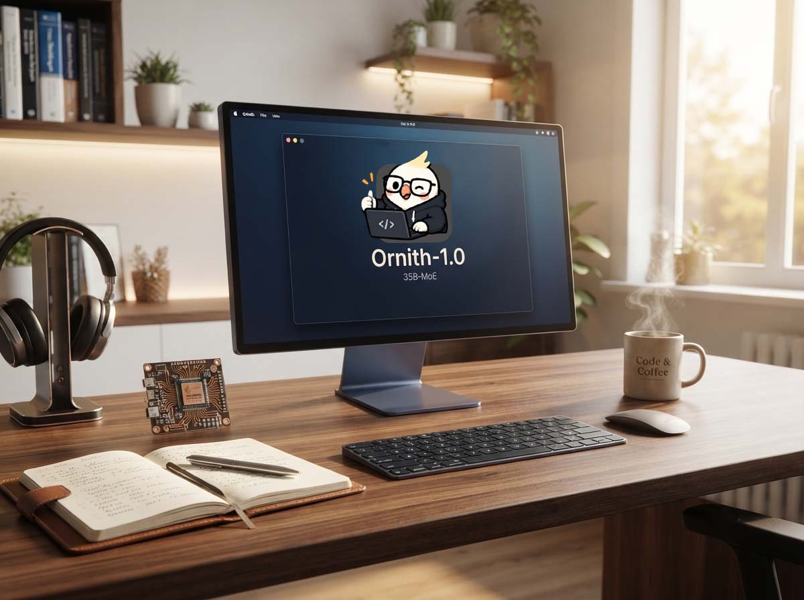
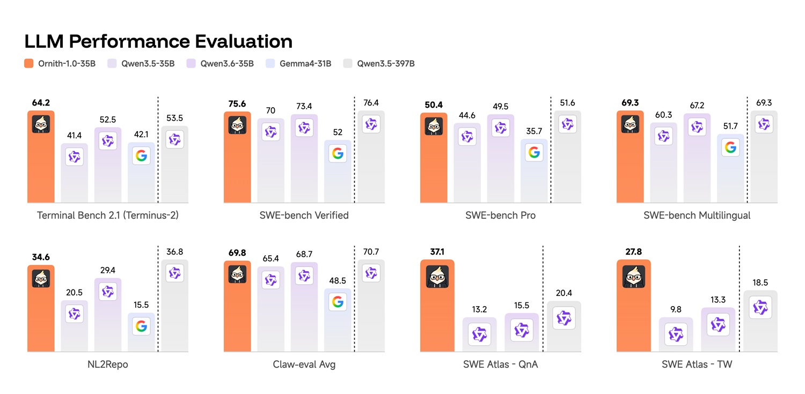
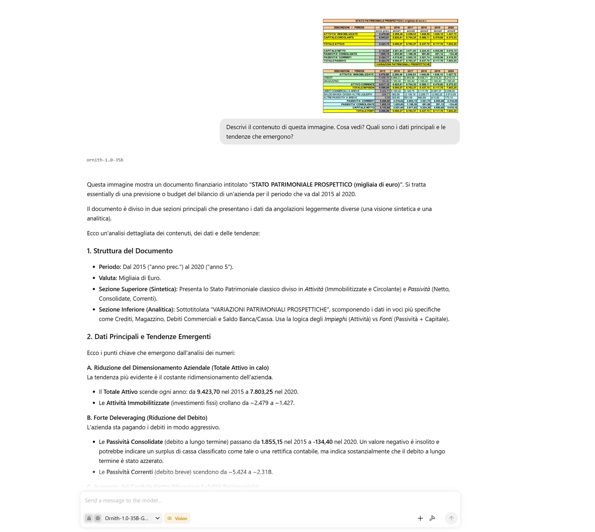
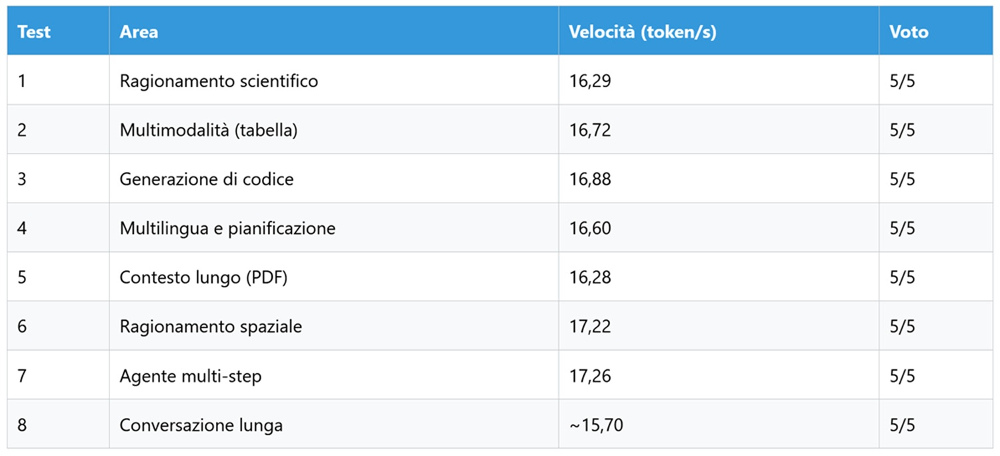

# Ornith-1.0 35B in locale: lo sconosciuto che batte tutti

*C'è un momento, in ogni sessione con un nuovo modello scaricato in locale, in cui capisci se hai davanti un giocattolo o un attrezzo da lavoro. Con Ornith-1.0-35B quel momento è arrivato al secondo prompt, quando ho caricato la foto sfocata di un foglio Excel aziendale aspettandomi la solita risposta vaga, e mi sono ritrovato una vera analisi di bilancio, completa di segnali d'allarme sulla liquidità. Da lì in avanti la sessione di test ha preso una piega diversa dal solito.*

Anche questa volta il disclaimer resta lo stesso di sempre: non è un benchmark scientifico, non ci sono metodologie validate né controlli incrociati degni di un laboratorio, è semplicemente il resoconto di quello che succede quando un modello open source finisce sul mio PC di casa e viene messo alla prova con gli stessi identici compiti riservati agli altri concorrenti passati per questa serie. Se non hai letto le puntate precedenti, sull'[hardware utilizzato e sulla configurazione di LM Studio](https://aitalk.it/it/qwen3.5-locale-puntata1.html) trovi già tutti i dettagli tecnici, qui mi limito a ricordare i numeri essenziali: un Ryzen 7700, 32 GB di RAM DDR5 e una Radeon RX 9060 XT con 16 GB di VRAM, la stessa combinazione con cui ho già messo alla prova Qwen 3.5, Qwen 3.6 e la famiglia Gemma 4. Sul portale trovi anche le altre puntate della serie, con modelli diversi e risultati altrettanto sorprendenti.

## Chi è Ornith-1.0

Il nome viene dal greco antico per "uccello", e DeepReinforce lo spiega con un'immagine che si lascia ricordare: come un volatile che costruisce da sé il proprio nido, il modello impara a costruire da sé l'impalcatura con cui affronta i problemi di programmazione, prima ancora di risolverli. Non è marketing vuoto, è la sintesi di un approccio di addestramento realmente diverso da quello standard.

La famiglia comprende quattro taglie, dal 9B denso fino al mastodontico 397B, passando per un 31B denso e per il 35B a esperti misti che ho scelto per i miei test, disponibile con licenza MIT su [GitHub](https://github.com/deepreinforce-ai/Ornith-1) e descritto nel dettaglio nel [post di lancio ufficiale](https://deep-reinforce.com/ornith_1_0.html). Qui vale la pena spendere due righe sull'architettura MoE, perché è il vero motivo per cui questo modello riesce a girare con dignità anche su una scheda video da 16 GB: dei 35 miliardi di parametri totali, solo circa 3 miliardi vengono attivati per ogni singolo token generato, un po' come se in una redazione enorme, invece di far lavorare tutta la squadra su ogni singolo articolo, si chiamasse in causa solo la manciata di specialisti davvero competenti sull'argomento del momento. Nel caso di Ornith-1.0-35B si tratta di 256 esperti totali, di cui 8 attivati a rotazione più uno sempre presente, e la scelta si sente tutta nella velocità di generazione, che nei miei test si è mantenuta stabile tra i 16 e i 17 token al secondo, un ritmo di lettura più che ragionevole per un uso interattivo quotidiano.

L'altro elemento distintivo riguarda il metodo di addestramento. Ornith-1.0 nasce da un framework di reinforcement learning che non ottimizza soltanto la soluzione finale a un problema di codice, bensì anche lo scaffold, cioè il piano d'azione, le chiamate agli strumenti, la logica con cui il modello decide quando ritentare o quando cambiare approccio. È una differenza sottile, però importante, rispetto al fine-tuning tradizionale, un po' come insegnare a qualcuno non solo a risolvere un cruciverba, bensì anche a costruirsi da sé lo schema con cui affrontarlo, e nei benchmark dichiarati questa scelta si traduce in punteggi notevoli su Terminal-Bench 2.1, dove il 35B raggiunge quota 64,2, e su SWE-bench Verified, fermo a 75,6, risultati che superano modelli più famosi come Qwen 3.5 e Qwen 3.6 nelle rispettive categorie di peso.

[immagine tratta da deep-reinforce.com](https://deep-reinforce.com/ornith_1_0.html)

## Un occhio in più, non dichiarato

C'è un dettaglio che vale la pena raccontare per esteso, perché racconta bene come funziona davvero l'ecosistema open source quando è in salute. Sulla pagina ufficiale di DeepReinforce e nel model card originale non si fa menzione di capacità multimodali: Ornith-1.0 viene presentato esclusivamente come modello testuale per coding agentico, per quanto dotato di supporto nativo alle chiamate di strumenti in stile OpenAI. Eppure, cercando tra le conversioni GGUF disponibili su Hugging Face, si trova un file separato caricato da [bartowski](https://huggingface.co/bartowski/deepreinforce-ai_Ornith-1.0-35B-GGUF/blob/main/mmproj-deepreinforce-ai_Ornith-1.0-35B-bf16.gguf), uno dei quantizzatori più prolifici e affidabili della comunità, etichettato come mmproj: si tratta del proiettore visivo che, copiato nella stessa cartella del modello principale, sblocca in LM Studio la lettura delle immagini.

L'ho provato per curiosità, aspettandomi un errore o nella migliore delle ipotesi un supporto zoppo, e invece ha funzionato senza intoppi, aprendo la strada ai due test multimodali di questa puntata. È un piccolo esempio di come, nel mondo dei modelli aperti, le funzionalità reali finiscano per essere più ampie di quelle dichiarate nella scheda tecnica ufficiale, grazie al lavoro sommerso di chi smonta, converte e ricompone i pesi per farli girare ovunque. Vale anche come promemoria per chi si affida solo alla documentazione ufficiale per valutare le capacità di un modello, il rischio di sottostimarne il potenziale reale è concreto.

## Il banco di prova

La configurazione usata in LM Studio ricalca quella già rodata nelle puntate precedenti, con qualche adattamento dovuto alla dimensione del modello. Ho lavorato con la quantizzazione Q6_K, un compromesso che tiene la qualità delle risposte molto vicina all'originale sacrificando un po' di spazio su disco, con un contesto impostato a 25.042 token, offload GPU su 20 dei 32 layer totali, pool di 8 thread CPU, batch di valutazione a 2048 e batch size a 512, con un massimo di 4 predizioni concorrenti e 8 esperti attivi per token, in linea con la configurazione di default indicata da DeepReinforce.

Gli otto test coprono lo stesso terreno esplorato nelle puntate precedenti della serie, dal ragionamento scientifico puro fino alla tenuta della memoria conversazionale su più turni, passando per multimodalità, generazione di codice, pianificazione multilingue, gestione di documenti lunghissimi, ragionamento spaziale e capacità agentiche multi-step.

## Otto sfide, un verdetto

### Test 1 — Ragionamento scientifico: il meccanismo di Higgs *(5/5)*

Il primo banco di prova era di quelli che mettono in difficoltà anche i modelli blasonati: spiegare il meccanismo di rottura della simmetria elettrodebole, il ruolo del campo di Higgs, il motivo per cui i bosoni W e Z acquisiscono massa mentre il fotone resta privo di massa. Ornith ha risposto con una struttura in cinque blocchi logici, dall'inquadramento del problema fino a un accenno finale al bosone fisico, con formule corrette e interpretazioni fisiche puntuali, in un registro che definirei da manuale universitario ben scritto, né troppo tecnico né annacquato.

### Test 2 — Multimodalità: leggere un foglio di calcolo aziendale *(5/5)*

Il secondo test, quello della tabella Excel sfocata raccontato in apertura, ha confermato quanto intuito al primo sguardo: lettura corretta dei dati nonostante la scarsa qualità dell'immagine, individuazione delle relazioni tra colonne, un'analisi di business intelligence che ha notato il ridimensionamento progressivo dell'azienda, il forte deleveraging, il capitale netto triplicato e soprattutto il peggioramento della liquidità, con un commento pertinente anche sul significato di un valore negativo nelle passività consolidate.

*Screenshot durante il test sull'immagine del foglio excel*

### Test 3 — Generazione di codice: un problema NP-hard *(5/5)*

Sul fronte della generazione di codice, il compito era implementare in Python un algoritmo per il ciclo massimo in un grafo non orientato, un problema NP-hard che si riduce al ciclo hamiltoniano. Ornith lo ha riconosciuto subito, aprendo con la nota teorica corretta prima ancora di scrivere una riga di codice, per poi fornire un'implementazione con backtracking e un pruning intelligente per evitare duplicati, documentata e corretta, corredata di un'analisi della complessità nel caso peggiore e di una tabella di strategie alternative per scenari diversi. La sensazione, qui, è quella di parlare con qualcuno che ha davvero studiato informatica teorica, non solo memorizzato pattern di codice ricorrenti.

### Test 4 — Multilingua e pianificazione: cinque giorni in Giappone *(5/5)*

Il quarto test ha spostato l'asticella sul multilinguismo, chiedendo la pianificazione di un viaggio di cinque giorni in Giappone per un cliente francese, con itinerario in francese e una sezione finale in italiano. Il francese prodotto è fluente e naturale, l'itinerario bilancia templi storici e street food con una logistica credibile, cita quartieri meno battuti come Yanaka o Omoide Yokocho e suggerisce di arrivare a Fushimi Inari prima delle 8:30 per evitare la folla, un consiglio che chiunque abbia visitato Kyoto sa quanto sia prezioso. La sezione in italiano finale è altrettanto solida, con indicazioni pratiche su JR Pass, Suica e app di traduzione offline.

### Test 5 — Contesto lungo: 460 pagine al volo *(5/5)*

Con il quinto test si è passati alla gestione del contesto lungo, caricando l'intero AI Index Report 2025, quattrocentosessanta pagine, e chiedendo informazioni sulla generazione video con relativa indicazione delle pagine di riferimento. Ornith ha risposto al primo tentativo, indicando con precisione le pagine 126 e 127, citando i modelli principali del settore, l'esempio virale dello spaghetti eating test e i benchmark interni citati nel report, precisando persino che la pagina successiva sposta il discorso sul riconoscimento vocale. Una precisione chirurgica.

### Test 6 — Ragionamento spaziale: la stanza nel caos *(5/5)*

Il sesto test, quello visivo abilitato grazie al file mmproj scovato su Hugging Face, chiedeva di descrivere la foto di una stanza in disordine e proporre una strategia di riordino. La descrizione ha coperto tutti gli elementi principali, dallo specchio all'armadietto, dalla scrivania ingombra al letto sfatto, con una strategia di intervento sensata: prima il pavimento per liberare un percorso, poi il letto per definire lo spazio, infine scrivania e cesto, ogni passaggio motivato in modo pratico.

### Test 7 — Agente multi-step: pianificare un progetto software *(5/5)*

Il settimo test misura la capacità di organizzare il lavoro, non solo di eseguirlo. Ho chiesto di pianificare lo sviluppo di una web app per la gestione delle spese familiari: stack tecnologico, struttura del progetto, roadmap dettagliata per un team di due sviluppatori. Ornith ha proposto uno stack coerente basato su Next.js, Node.js, PostgreSQL, Prisma e Redis, una struttura modulare organizzata per feature e una roadmap con deliverable e criticità per ogni sprint, con consigli da senior developer come impostare prima il database e validare gli input con Zod.

### Test 8 — Conversazione lunga: coerenza su quattro turni *(5/5)*

L'ultimo test ha verificato la tenuta su una conversazione lunga, articolata in quattro turni su stack, notifiche, database e scalabilità della stessa applicazione di task management. Ornith ha mantenuto coerenza per tutta la conversazione, ricordando le scelte fatte nei turni precedenti e costruendoci sopra: dal confronto tra WebSocket e polling per mille utenti simultanei, corredato di esempi di codice, fino a uno schema Prisma completo con relazioni e indici, per chiudere con una strategia di scalabilità a diecimila utenti che tocca load balancing, adattatori Redis, repliche in lettura e caching. Unica nota da rilevare, scontata con l'aumentare del contesto, un progressivo leggero rallentamento dei token/s ad ogni iterazione.

Il punteggio finale, otto su otto, non l'avevo ancora visto in questa serie, e vale la pena sottolinearlo, nessuno dei modelli passati finora sul mio banco di prova, né Qwen 3.5 9B, né Gemma 4 nelle sue varianti da 12B e 26B, né lo stesso Qwen 3.6 35B, era riuscito a mantenere il massimo su tutti gli otto fronti contemporaneamente.

## Luci e ombre

Detto questo, un risultato perfetto in un test personale condotto da un solo osservatore, senza controlli incrociati né campioni statisticamente rilevanti, va preso per quello che è: un'indicazione forte, non una verità assoluta. I benchmark dichiarati da DeepReinforce vanno letti sapendo che l'azienda ha ovviamente interesse a mostrarsi nella luce migliore rispetto a Qwen 3.5 e Qwen 3.6, e alcuni osservatori indipendenti nella comunità hanno già iniziato a chiedere misurazioni di velocità indipendenti su hardware diverso dal mio, dato che i numeri di throughput per ora circolano soprattutto tra chi ha già scaricato il modello.

C'è poi la questione della multimodalità non dichiarata, che da un lato è la dimostrazione di quanto sia vitale l'ecosistema attorno ai pesi aperti, dall'altro apre una domanda scomoda su chi si assume la responsabilità quando una funzionalità emerge da un file caricato da un singolo utente della comunità e non dallo sviluppatore originale del modello: se qualcosa va storto nell'interpretazione di un'immagine, chi risponde, l'azienda che ha addestrato il modello o chi ha ricavato il proiettore visivo. Sono domande aperte che la fase attuale dei modelli locali si porta dietro, e che difficilmente troveranno una risposta netta nel breve periodo.

Chi vince, in questo scenario, sono senza dubbio gli sviluppatori indipendenti e i piccoli studi che possono permettersi coding agent di livello competitivo senza pagare abbonamenti mensili a fornitori cloud, grazie anche alla licenza MIT che non pone vincoli di utilizzo commerciale. Chi rischia di perdere qualcosa, nel medio periodo, sono i fornitori di modelli proprietari specializzati in coding, che vedono ridursi il vantaggio competitivo su segmenti sempre più ampi del mercato, mentre resta da capire quanto questo tipo di modelli regga il confronto su compiti più lunghi e complessi di quelli che un singolo test pomeridiano riesce a mettere in scena, una domanda che lascio volentieri aperta per la prossima puntata.

Per ora, seduto davanti al mio PC con la ventola della Radeon che si fa sentire un po' più del solito, resta la sensazione di aver toccato con mano un altro piccolo salto di qualità reale nei modelli locali.