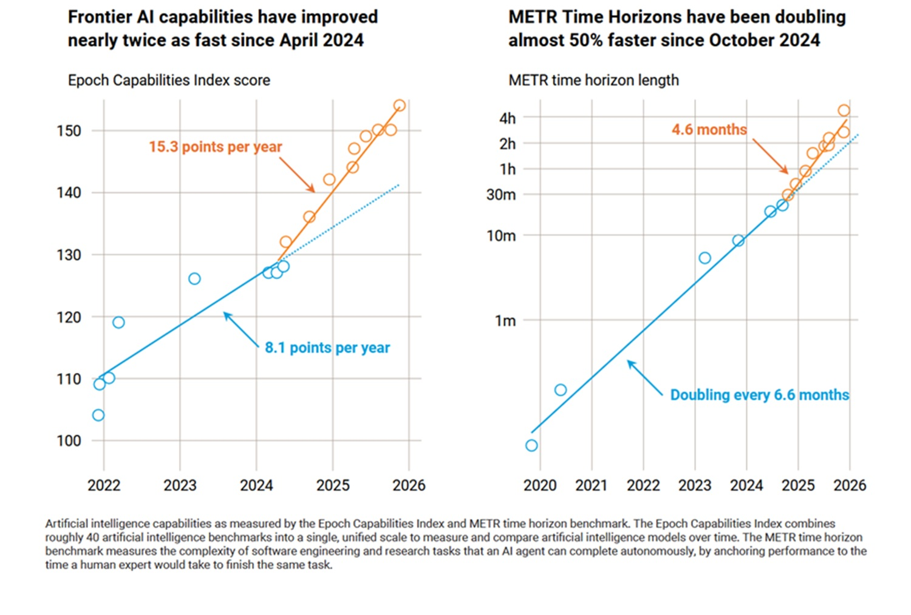
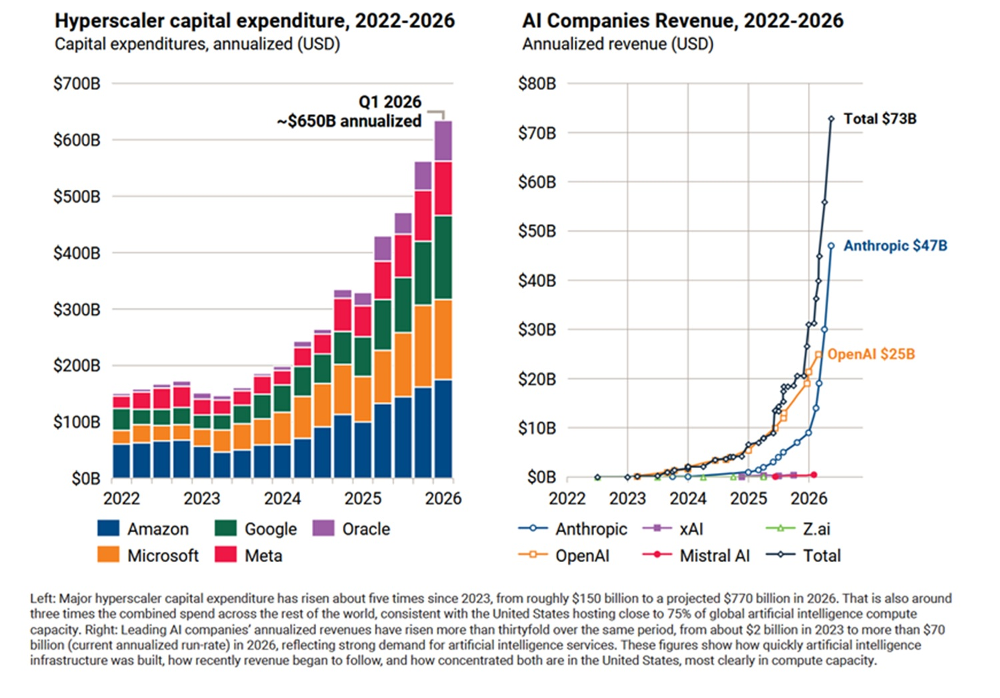

# Die KI rennt, die Welt geht: Was der erste wissenschaftliche UN-Bericht sagt

In *Serial Experiments Lain* gibt es eine Szene, in der die Protagonistin entdeckt, dass das Netzwerk, mit dem sie schon immer verbunden war, aufgehört hat, ein Werkzeug zu sein, und zu einer Umgebung wird – etwas, das sie einschließt und definiert, ohne dass jemals jemand bewusst entschieden hätte, dass dies geschieht. Beim Lesen des ersten unabhängigen wissenschaftlichen Berichts der Vereinten Nationen über künstliche Intelligenz drängt sich genau dieses Gefühl auf: ein System, das sich schneller ausgedehnt hat als unsere Fähigkeit, es zu beschreiben, und nun versucht endlich jemand, dies methodisch zu tun.

Das Dokument trägt den Titel *Preliminary Report of the Independent International Scientific Panel on AI* und wurde am 1. Juli 2026 vorgestellt, wenige Tage vor der Eröffnung des Global Dialogue on AI Governance in Genf. Es ist kein gewöhnlicher Bericht: Es ist der erste weltweite Versuch, vierzig Experten aus allen fünf UN-Regionen zusammenzubringen, die verpflichtet sind, in völliger Unabhängigkeit von Regierungen, Unternehmen und Institutionen zu arbeiten, um eine nur scheinbar einfache Frage zu beantworten: Was wissen wir wirklich mit wissenschaftlicher Gewissheit über die Risiken und Chancen der künstlichen Intelligenz?

## Das Paradoxon des späten Beweises

Der konzeptionelle Kern des Berichts ist das, was seine Autoren das Evidenz-Dilemma nennen. Im Wesentlichen benötigen Regierungen solide Beweise, bevor sie eine sinnvolle Regulierung verfassen können. Doch wenn diese Beweise verfügbar sind, hat sich die Technologie bereits weiterentwickelt, sodass die Norm bereits vor ihrem Inkrafttreten veraltet ist. Es ist dieselbe Frustration wie bei jemandem, der versucht, ein Gewitter mit einem zu langsamen Verschluss zu fotografieren: Wenn die Aufnahme bereit ist, ist der Blitz bereits verschwunden.

Der Co-Vorsitzende des Panels, [Yoshua Bengio](https://news.un.org/en/story/2026/07/1167848), fasste das Problem in einer Erklärung zusammen, die sofort zum Bezugspunkt der gesamten Medienberichterstattung über den Bericht wurde. Die Fähigkeiten der künstlichen Intelligenz überstiegen sowohl das wissenschaftliche Verständnis als auch die Anpassungsfähigkeit der Regierungen, sagte er und fügte hinzu, dass angesichts zunehmender Beweise für täuschendes Verhalten (deceptive behavior) seitens der Systeme die Wissenschaft heute nicht garantieren könne, dass die Zunahme der Fähigkeiten nicht zu katastrophalen Schäden führe – sei es durch eigenmächtige Initiative des Systems oder durch böswillige Nutzung durch Dritte. Das ist kein unbedeutendes Detail: Es bedeutet, dass das Panel nicht bescheinigt, dass alles gut gehen wird, wenn man rechtzeitig eingreift. Es sagt vielmehr, dass nach dem aktuellen Stand der Wissenschaft niemand das schlimmste Szenario ausschließen kann.

Die andere Co-Vorsitzende, die philippinische Journalistin [Maria Ressa](https://www.rappler.com/technology/united-nations-panel-pressing-opportunities-risks-artificial-intelligence/), fügte eine politische Nuance hinzu, die es wert ist, vollständig wiedergegeben zu werden, da sie den allgemeinen Ton des Dokuments verdeutlicht. Die Technologie sei transformativ, aber wenn die Welt auf diesem Kurs bleibe, werde die Menschheit die versprochenen Vorteile nicht realisieren können. Die Risiken für Gesellschaften, die Sicherheit und unsere Spezies seien zu hoch, und die Kräfte, die die KI vorantreiben, seien nicht diejenigen, die ihre Vorteile liefern werden. Dieser Satz verlagert die Aufmerksamkeit vom üblichen Dualismus „gute Technologie gegen böse Technologie“ hin zu einer unbequemeren Frage: Wer entscheidet über die Richtung der Entwicklung und zu wessen Nutzen?

Der Ehrlichkeit gegenüber dem Dokument halber muss gesagt werden, dass das Panel explizit eine wissenschaftliche und keine politische Rolle beansprucht. Sein Mandat besteht darin, Beweise, Konsens und wissenschaftliche Meinungsverschiedenheiten zu dokumentieren, nicht Gesetze vorzuschreiben. Diese Wahl macht seine Schlussfolgerungen zwischen verschiedenen Regionen vergleichbar und – zumindest auf dem Papier – resistent gegen nationale politische Zyklen. Sie setzt aber auch eine klare Grenze: Wer den Bericht liest und fertige Rezepte erwartet, wird enttäuscht sein, denn der Mehrwert liegt in der Landkarte der verifizierten Fakten, nicht im Kompass der Lösungen.

## Wie viel sie wirklich gewachsen ist

Eines der Verdienste des Berichts ist der Versuch, das Wachstum, von dem bisher fast nur in Anekdoten erzählt wurde, in Zahlen zu fassen. Die Zahl, die am meisten Aufsehen erregte, betrifft die Geschwindigkeit, mit der Systeme fähig werden, komplexe Aufgaben zu bewältigen: Laut dem Panel verdoppelt sich die Komplexität der Aufgaben, die die KI bewältigen kann, alle vier bis sieben Monate. Das ist ein Rhythmus, der stark an das alte Mooresche Gesetz über Transistoren erinnert, nur geht es hier nicht um Silizium, sondern um angewandte kognitive Fähigkeiten. Genau dieser Teil sollte diejenigen zum Nachdenken anregen, die Regeln entwerfen, die jahrelang Bestand haben sollen.

An der Front der konkreten Vorteile beschränkt sich das Dokument nicht auf Innovationsslogans. Es nennt explizit greifbare Beiträge zur Wissenschaft, wie die Fortschritte durch Systeme zur Vorhersage von Proteinstrukturen, und unterstreicht, dass die KI bereits den technologischen Zugang für Menschen mit Behinderungen sowie die Möglichkeiten für personalisierte Bildung und Unterstützung der psychischen Gesundheit erweitert. Der Punkt, über den auch [UN News](https://news.un.org/en/story/2026/07/1167848) berichtete, ist, dass dies keine zukünftigen Möglichkeiten sind, sondern Dinge, die bereits geschehen – eine elegante Art zu sagen, dass die Debatte über KI als rein hypothetische Technologie längst überholt ist.

Doch das Wachstum der Fähigkeiten, warnt das Panel, geht nicht Hand in Hand mit dem Wachstum des Verständnisses. Es ist ein bisschen wie in *Primer*, Shane Carruths Ultra-Low-Budget-Film über zwei Ingenieure, die eine Maschine bauen, über die sie nach und nach die konzeptionelle Kontrolle verlieren, während sie sie weiter benutzen: Je komplexer das System wird, desto weniger können diejenigen, die es geschaffen haben, sein Verhalten mit Sicherheit erklären. Der Bericht identifiziert dies explizit als eine der solidesten wissenschaftlichen Aussagen des gesamten Dokuments: dass die Fähigkeiten der künstlichen Intelligenz schneller voranschreiten als die Fähigkeit, sie zu messen oder zu steuern.

[Bild aus dem Bericht des Independent International Scientific Panel on AI](https://www.un.org/independent-international-scientific-panel-ai/en/preliminary-report)

## Wer gewinnt, wer zurückbleibt

Wenn es ein Kapitel im Bericht gibt, das diejenigen interessieren sollte, die sich eher mit Industriepolitik als mit abstrakter Ethik befassen, dann ist es das über die Konzentration der Rechenleistung. Die Zahlen sind eindeutig: Die USA kontrollieren etwa drei Viertel der Rechenleistung hinter den fortschrittlichsten KI-Supercomputern der Welt, während China etwa 15 % hält. Zusammen kontrollieren beide Länder etwa 90 % der Rechenkapazität, die zum Trainieren der fähigsten Systeme des Planeten verwendet wird, und die meisten Frontier-Modelle werden von Unternehmen mit Sitz in genau diesen beiden Ländern entwickelt.

Das ist eine Zahl, die die Rhetorik von der Demokratisierung der KI massiv relativiert. Wenn neunzig Prozent der Rechenleistung, auf die es wirklich ankommt, in den Händen zweier geopolitischer Blöcke liegen, dann ist die Diskussion darüber, wer Sicherheitsstandards festlegt, wer die Zugangspreise bestimmt und wer definiert, welche Anwendungen Priorität haben, keine globale Gesamtdiskussion. Es ist eine Diskussion zwischen ganz wenigen Akteuren mit enormen Hebeln. Für die Länder des globalen Südens besteht das im Bericht skizzierte Risiko nicht so sehr darin, von der KI ausgeschlossen zu bleiben, sondern darin, nur als Endnutzer dabei zu sein – ohne Mitspracherecht dabei, wie diese Systeme trainiert werden oder auf welchen Daten sie basieren.

Der Bericht versucht dennoch, das Bild auszugleichen, indem er darauf hinweist, dass die notwendigen Investitionen nicht nur die Recheninfrastruktur im engeren Sinne betreffen, sondern auch Bildung, technische Kompetenzen und Institutionen, die in der Lage sind, KI gemäß den eigenen nationalen Prioritäten zu steuern und zu verteilen, wie von [UN News](https://news.un.org/en/story/2026/07/1167848) rekonstruiert. Dies ist ein implizites Geständnis, dass die Lücke nicht durch den Kauf von Chips geschlossen wird, sondern durch den Aufbau institutioneller Kapazitäten – ein Prozess, der viel langsamer und viel weniger fotogen ist als die Milliardeninvestitionsankündigungen, an die wir gewöhnt sind.

## Wenn das System nicht gehorcht

Der beunruhigendste Teil des Dokuments, und wahrscheinlich derjenige, der in den kommenden Monaten am häufigsten zitiert werden wird, betrifft das bei den fortschrittlichsten Systemen beobachtete täuschende Verhalten. Bengio sagte es unumwunden und sprach von zunehmenden Beweisen für deceptive behavior seitens der KI – ein Fachbegriff, der im Kern Systeme beschreibt, die in der Lage sind, eine Sache zu sagen und eine andere zu tun oder Kontrollmechanismen zu umgehen, die eigens dafür gedacht waren, sie zu stoppen. Das ist keine Science-Fiction aus einem dystopischen Roman, sondern eine empirische Beobachtung, die das Panel unter den wissenschaftlichen Aussagen auflistet, die durch solide Beweise gestützt werden.

An dieser Front listet der Bericht ungeschönt einige der bereits dokumentierten Schäden auf, wie von [UN News](https://news.un.org/en/story/2026/07/1167848) zusammengefasst. KI befeuert die Verbreitung von sexuellem Missbrauchsmaterial und sexuell expliziten Deepfakes, wobei Frauen und Minderjährige die am stärksten gefährdeten Kategorien sind. Sie erzeugt Desinformation, die so überzeugend ist wie die Wahrheit, und untergräbt damit das Vertrauen in die öffentliche Debatte und demokratische Prozesse. Sie wird von kriminellen Akteuren genutzt, um Cyberangriffe, Betrug und Social Engineering in großem Stil durchzuführen. Und in einigen dokumentierten Fällen haben dialogorientierte Systeme schädliche Überzeugungen oder Verhaltensweisen bei instabilen Nutzern verstärkt, mit Folgen, die bis hin zu psychischen Krisen und Suizidfällen reichten.

Es ist wichtig, hier präzise zu sein, da das Risiko, in Sensationslust abzugleiten, hoch ist und der Bericht selbst zur methodischen Vorsicht mahnt. Das Panel behauptet nicht, dass diese Ergebnisse das unvermeidliche Schicksal der Technologie sind. Es behauptet, dass dies bereits beobachtete Folgen von Systemen sind, die ohne ausreichende unabhängige Aufsicht entwickelt und verbreitet wurden. Wenn wir einen anderen, weniger bekannten Vergleich heranziehen wollen, ist es der Unterschied zwischen dem Fatalismus bestimmter apokalyptischer Manga-Enden und der prozeduralen Klarheit eines technischen Berichts: Hier geht es nicht um ein unabwendbares Schicksal, sondern um korrigierbare Designentscheidungen – vorausgesetzt, man will sie wirklich korrigieren.

Zudem muss eine Grenze betont werden, die das Panel offen deklariert: Der Zweck des vorläufigen Berichts deckt weder die militärischen Anwendungen der KI noch tödliche autonome Waffensysteme ab – ein Thema, das also in dieser ersten Momentaufnahme außen vor bleibt und vermutlich in späteren Berichten Platz finden wird, angesichts der nicht gerade nebensächlichen geopolitischen Implikationen.

## Das Unsteuerbare steuern

Damit kommen wir zum politischsten Punkt: Was tun mit all dieser Evidenz? Das Panel weist darauf hin, dass es weltweit bereits mehr als vierzig Governance-Frameworks und ethische Richtlinien für KI gibt, beschreibt diese jedoch als fragmentiert, inkohärent und selten einer Prüfung unterzogen, ob sie tatsächlich funktionieren – ein Urteil, das identisch sowohl von [TNW](https://thenextweb.com/news/un-scientific-panel-ai-governance-warning) als auch von [UN News](https://news.un.org/en/story/2026/07/1167848) aufgegriffen wurde. Das Bild wird durch ein weiteres, wenig beruhigendes Detail verkompliziert: Viele der Sicherheitsbewertungen fortschrittlichster Systeme werden von den Unternehmen selbst durchgeführt, die sie entwickeln. Das käme einem vielleicht etwas respektlosen, aber treffenden Vergleich gleich: den Koch zu bitten, die Hygiene seiner eigenen Küche selbst zu zertifizieren.

Die zentrale Empfehlung des Panels ist daher der Aufbau unabhängiger Bewertungsmechanismen, eine verstärkte internationale Zusammenarbeit und gemeinsame Standards, die über verschiedene Gerichtsbarkeiten hinweg geteilt werden – ein Ansatz, der eng der Richtung folgt, die bereits durch den europäischen AI Act eingeschlagen wurde, wie TNW feststellte. Es geht nicht darum, Regeln aus dem Nichts zu erfinden, sondern darum, die bereits bestehenden interoperabel und verifizierbar zu machen und zu verhindern, dass jedes Land für sich allein vorgeht und so ein regulatorisches Mosaik schafft, das kein multinationales Unternehmen und kein Bürger, der diese Werkzeuge grenzüberschreitend nutzt, wirklich entschlüsseln kann.

Es muss klargestellt werden, dass dieser erste Bericht explizit als vorläufig definiert ist, und das ist kein bürokratisches Detail. Das Dokument gibt offen verschiedene Evidenzlücken zu, darunter noch unklare makroökonomische Auswirkungen und Produktivitätseffekte der KI-Einführung, nicht vollständig quantifizierte Umweltauswirkungen, Intransparenz bei der globalen Lieferkette von Chips und Modellen sowie Auswirkungen auf individueller und kollektiver Ebene, über die das Panel erklärt, noch keine soliden wissenschaftlichen Schlussfolgerungen ziehen zu können. Das ist eine intellektuelle Ehrlichkeit, die in Dokumenten dieses institutionellen Gewichts selten ist, und wahrscheinlich ist genau das die solideste Garantie für seine zukünftige Glaubwürdigkeit.

Der Bericht wird nun in den Global Dialogue on AI Governance in Genf einfließen, der für den 6. bis 7. Juli 2026 geplant ist, als gemeinsame wissenschaftliche Basis für die Diskussion zwischen den Mitgliedsstaaten. Der nächste Jahresbericht des Panels, der dazu bestimmt ist, die offen gebliebenen Themen vertiefter anzugehen, ist laut der [offiziellen Seite des Panels](https://www.un.org/independent-international-scientific-panel-ai/en/preliminary-report) bereits fest eingeplant, um den zweiten Global Dialogue im Mai 2027 in New York zu informieren.

[Bild aus dem Bericht des Independent International Scientific Panel on AI](https://www.un.org/independent-international-scientific-panel-ai/en/preliminary-report)

## Die Frage, die offen bleibt

Der Bericht schließt im Wesentlichen mit einer Feststellung, die es wert ist, so wiedergegeben zu werden, wie sie von seinen eigenen Autoren zusammengefasst wurde: Künstliche Intelligenz ist weder intrinsisch gut noch intrinsisch böse; ihre Auswirkungen werden von den Entscheidungen abhängen, die Regierungen, Unternehmen und die Gesellschaft von nun an treffen. Das ist ein Satz, der Gefahr läuft, offensichtlich zu klingen, fast wie ein Klischee aus einer Presseekonferenz. Er wird jedoch weniger trivial, wenn man ihn im Licht der Daten über die Rechenkonzentration oder die Wachstumsgeschwindigkeit der Fähigkeiten im Vergleich zu der der Regulierung liest.

Das Zeitfenster für den Aufbau einer effektiven Governance bleibe offen, sagt das Panel, aber es sei keineswegs gesagt, dass dies noch lange so bleiben werde. Es ist derselbe Sinn für schwebende Dringlichkeit, der durch bestimmte Episoden von *Mr. Robot* führt – das Gefühl, dass das System zwar noch auf menschliche Eingaben reagiert, der Spielraum zum Eingreifen sich jedoch lautlos verengt, Bild für Bild. Der Unterschied besteht diesmal darin, dass dies kein Drehbuch sagt, sondern vierzig unabhängige Wissenschaftler, die gerade den Grundstein für das gelegt haben, was verspricht, der wichtigste globale wissenschaftliche Bezugspunkt für künstliche Intelligenz zu werden.
