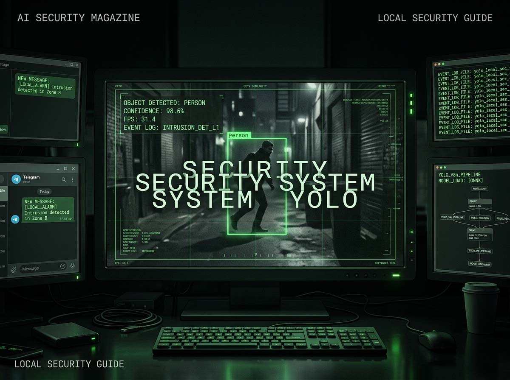
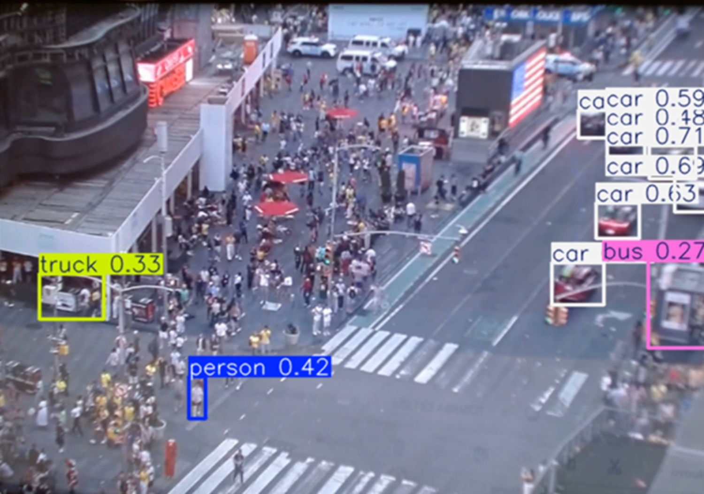
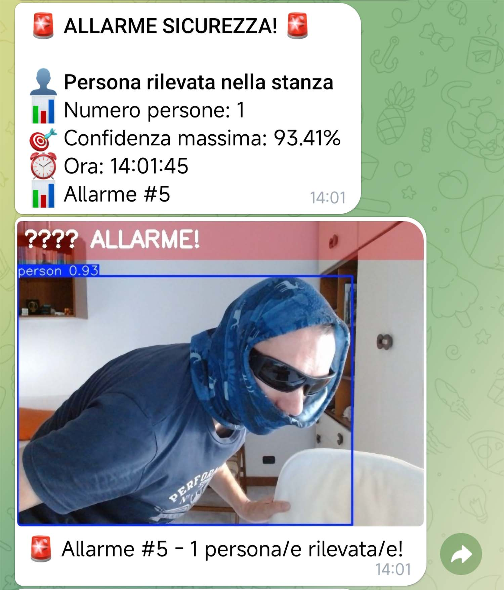
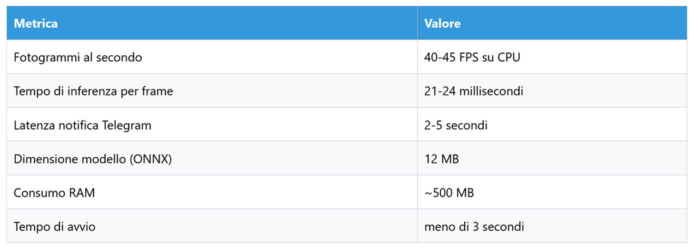
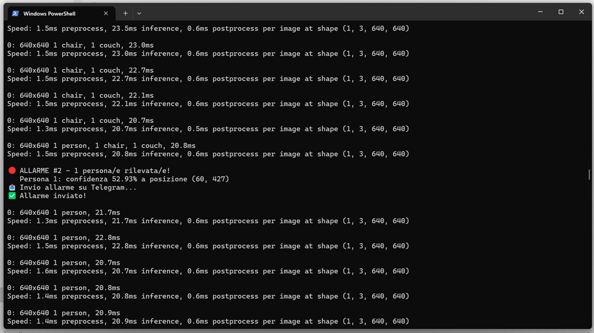

# Ich habe der KI das Wachehalten beigebracht: Wie ich ein Sicherheitssystem zum Nulltarif gebaut habe

*In der Fernsehserie 'Person of Interest' überwacht eine Superintelligenz, die einfach nur "die Maschine" genannt wird, jeden Winkel des Planeten durch Kameras, Mikrofone und Sensoren aller Art und erkennt Bedrohungen, bevor sie entstehen. Das ist natürlich Science-Fiction. Aber die Grundidee, nämlich Computer Vision zu nutzen, um zu verstehen, was in einer Umgebung passiert, ist heute für jeden zugänglich, der einen PC und eine Webcam besitzt. Weniger als 250 Zeilen Code. Kein Abonnement, keine Cloud, kein Video, das um die Welt geht. Nur eine Benachrichtigung auf dem Telefon, mit Foto, wenn jemand das Haus betritt.*

Die Frage, die ich mir vor einigen Wochen stellte, war einfach: Wie viel kostet ein Sicherheitssystem, das einen in Echtzeit benachrichtigt, wenn jemand das Haus betritt, ein Foto schickt und komplett lokal läuft, ohne von einem monatlichen Abonnement abhängig zu sein? Die Antwort: null Euro. Nur Hardware, die man mit hoher Wahrscheinlichkeit bereits besitzt. In diesem Artikel erzähle ich, wie ich dieses System gebaut habe, was ich dabei gelernt habe und warum das Experiment etwas Größeres darüber aussagt, wie die künstliche Intelligenz das Verhältnis zwischen Technologie und Alltag verändert.

## Bevor man sie auf das Haus richtet: Der Test am Times Square

Jedes Sicherheitssystem, das diesen Namen verdient, muss getestet werden, bevor es in Produktion geht. Aber eine Webcam auf das eigene Zimmer zu richten, ohne die Funktionsweise unter anspruchsvollen Bedingungen überprüft zu haben, schien naiv. Also beschloss ich, mit dem chaotischsten Kontext zu beginnen, den ich finden konnte, ohne mich von meinem Stuhl zu bewegen: Times Square, New York, von oben gesehen durch eine der vielen öffentlichen Webcams, die per Streaming zugänglich sind.

Das Szenario war bewusst extrem gewählt. Hunderte von Menschen, die sich kreuzen, gelbe Taxis, Busse, Lieferwagen, alles in gleichzeitiger Bewegung, mit plötzlichen Lichtveränderungen und schwierigen Winkeln. Die Art von Situation, die jedes mittelmäßige visuelle Erkennungssystem in die Krise treibt.

Das Ergebnis war überraschend: Das System erkannte bis zu neun Fahrzeuge gleichzeitig, darunter Autos, Busse und Lastwagen, identifizierte Fußgänger selbst aus beträchtlicher Entfernung und hielt stabile 40 Bilder pro Sekunde – alles auf einer CPU, ohne die GPU zu beanspruchen. *"Wenn es am Times Square funktioniert, funktioniert es überall"*, sagte ich mir. Und so war es auch.

*Screenshot der Tests an der Times Square Webcam.*

## Das Herz des Systems: YOLO einfach erklärt

Bevor wir zu dem Moment kommen, an dem das Telefon beim ersten Alarmfoto vibrierte, lohnt es sich, ein paar Zeilen darüber zu verlieren, was unter der Haube passiert, denn die beteiligte Technologie ist wirklich faszinierend, selbst wenn man sie aus der Ferne betrachtet.

Die zentrale Komponente heißt [YOLO](https://github.com/ultralytics/ultralytics), ein Akronym für *You Only Look Once*. Der Name ist kein Marketing: Er beschreibt genau, wie es funktioniert. Traditionelle visuelle Erkennungssysteme analysierten ein Bild in mehreren Schritten, indem sie erst Regionen von Interesse identifizierten und diese dann klassifizierten. YOLO kehrt den Ansatz um: Es analysiert das gesamte Bild in einem einzigen Durchgang, unterteilt es in ein Raster und sagt gleichzeitig Position und Objekttyp für jede Zelle voraus. Das Ergebnis ist eine deutlich höhere Geschwindigkeit bei einer Präzision, die in den jüngsten Versionen ein exzellentes Niveau erreicht hat.

Die Version, die ich verwendet habe, YOLOv8n, ist die leichteste Variante der Familie. Das Suffix "n" steht für *nano* und wurde explizit für den Betrieb auf begrenzter Hardware entwickelt. Sie ist auf dem COCO-Datensatz trainiert, der achtzig Objektkategorien umfasst: Personen, Fahrzeuge, Haustiere, Einrichtungsgegenstände. Für meine Zwecke ist die einzige Kategorie, die mich interessiert, "Person", mit einer Konfidenzschwelle von 0,4. Das bedeutet, das Modell meldet eine Anwesenheit nur dann, wenn es sich zu mindestens vierzig Prozent sicher ist, sie erkannt zu haben. Eine niedrigere Schwelle führt zu mehr Fehlalarmen, eine höhere birgt das Risiko, reale Erkennungen zu verpassen.

Die zweite entscheidende Zutat ist [ONNX](https://onnxruntime.ai/), was für *Open Neural Network Exchange* steht. Es ist ein offenes Format zur Darstellung von Machine-Learning-Modellen, vor allem aber ist es eine optimierte Inferenz-Engine, die weiß, wie man die spezifischen Befehle jedes Prozessors am besten nutzt. Wenn man YOLOv8n in das ONNX-Format exportiert, steigt das Modell von 10-15 Bildern pro Sekunde auf 40-45 Bilder pro Sekunde auf derselben CPU, ohne eine einzige Zeile Anwendungscode zu ändern. Die Datei wächst von 6 MB auf 12 MB, aber der Geschwindigkeitsgewinn ist fast vervierfacht. Es ist, als hätte man einen Simultanübersetzer, der den Dialekt des eigenen Prozessors perfekt kennt.

## GINA leiht mir den Bot

Wer dieses Portal verfolgt, wird sich an [GINA erinnern, meinen persönlichen Sprachassistenten](https://aitalk.it/it/gina-assistente-vocale.html). Für Echtzeit-Benachrichtigungen hatte ich bereits einen Telegram-Bot gebaut, der in das GINA-Ökosystem integriert ist und mir Nachrichten, Updates und Warnungen direkt auf das Smartphone senden kann. Diese Infrastruktur für das Sicherheitssystem wiederzuverwenden, war naheliegend: ein klassisches Beispiel dafür, wie die Teile eines technologischen Ökosystems, das im Laufe der Zeit aufgebaut wurde, auf oft unvorhergesehene Weise ineinandergreifen.

Der Telegram-Bot macht nur eine Sache, aber er macht sie gut: Wenn das System eine Person erkennt, erhält es einen HTTP-Aufruf mit einer Textnachricht und einem Foto des betreffenden Frames und stellt diese in zwei bis fünf Sekunden auf meinem Telefon zu. Keine proprietäre App, kein Konto auf Cloud-Videoüberwachungsplattformen, keine Daten, die über Server von Drittanbietern laufen – außer den Servern von Telegram für die endgültige Zustellung der Benachrichtigung. Alternativ könnte man auch an den Versand einer E-Mail denken. Das Video selbst verlässt den PC nie.

Die Konfiguration des Bots dauert etwa fünf Minuten: Er wird über den [@BotFather](https://core.telegram.org/bots) auf Telegram erstellt, man erhält ein Authentifizierungs-Token, ruft die eigene Chat-ID ab, indem man eine Nachricht an den Bot sendet und die API abfragt, und fügt die beiden Zeichenfolgen in die Konfigurationsdatei ein. Danach ist der Benachrichtigungskanal einsatzbereit.

## Der Moment der Wahrheit: Mein Zimmer

Nachdem der Test in New York bestanden war, war es an der Zeit, die Webcam auf die Umgebung zu richten, auf die es wirklich ankam: mein Zimmer. Ich positionierte die Kamera, startete das Skript, wartete die fünf Sekunden Stabilisierungszeit ab, die sich das System beim Start nimmt, um während des Ladevorgangs keine Fehlalarme zu generieren, und verließ den Raum.

Dann kam ich wieder herein.

Das Telefon vibrierte noch bevor ich die Mitte des Bildausschnitts erreichte. Die Nachricht lautete: *"🚨 SICHERHEITSALARM! Personen erkannt: 1. Zeit: 13:43:07. Alarm #1"*. Darunter ein Foto, auf dem mein Umriss durch einen Rahmen hervorgehoben war, mit einem roten Overlay im oberen Teil des Frames. Latenz vom Betreten bis zur Benachrichtigung: weniger als eine Sekunde für die Erkennung, zwei bis drei Sekunden für die Telegram-Zustellung.

Es funktionierte.

Das System verfügt über eine integrierte Logik zum Schutz vor Fehlalarmen: Ein Cooldown von zehn Sekunden zwischen einem Alarm und dem nächsten verhindert, dass eine Person, die sich im Bildausschnitt aufhält, Dutzende von Benachrichtigungen pro Minute generiert. Die Konfidenzschwelle von 0,4 erwies sich als gut kalibriert für eine häusliche Umgebung: keine Fehlalarme während der Tests, keine verpasste Erkennung unter normalen Lichtverhältnissen. Bei schlechter Beleuchtung nimmt die Leistung ab, aber das ist eine physikalische Grenze der Webcam, noch bevor es eine Grenze des Modells ist.

*Screenshot der Alarmnachricht auf Telegram sowie des unwahrscheinlichsten Diebes in der Geschichte der Kriminalität.*

## Wie es aufgebaut ist: Das technische Rezept

Der komplette Code umfasst weniger als 250 Zeilen Python. Die Struktur ist linear und auch für Personen verständlich, die nicht professionell programmieren. Es gibt vier Logikblöcke: die Erstkonfiguration mit Telegram-Token und Schwellenwertparametern, die Funktionen zum Senden von Nachrichten und Fotos über die Telegram-API, die Funktion zur Personenerkennung, die ONNX abfragt, und die Hauptschleife, die die Frames von der Webcam erfasst, sie analysiert und die Alarmlogik verwaltet.

Die Abhängigkeiten sind fünf Standard-Python-Bibliotheken im Machine-Learning-Ökosystem: `ultralytics` zum Laden von YOLO, `onnxruntime` für die optimierte Inferenz, `opencv-python` für die Verwaltung der Webcam und die Frame-Verarbeitung sowie `requests` für die HTTP-Aufrufe an Telegram.

Die endgültige Projektstruktur ist minimalistisch: eine Haupt-Python-Datei, das 12 MB große ONNX-Modell und eine Konfigurationsdatei. Insgesamt weniger als 15-20 MB auf der Festplatte.

In puncto Leistung sprechen die Zahlen eine deutliche Sprache:

Die verwendete Hardware ist ein AMD Ryzen 7 7700 mit 32 GB RAM, aber Tests auf weniger leistungsstarken Konfigurationen bestätigen, dass das System auch auf einem Laptop mit einem Intel i5-Prozessor der fünften oder sechsten Generation und 8 GB RAM problemlos funktioniert. Die GPU wird nie beansprucht.

## Wo der Einsatz sinnvoll ist und wo nicht

Ein solches System funktioniert in spezifischen Kontexten gut, und es ist ehrlich, das klar zu sagen. Für die häusliche Sicherheit in einer Wohnung oder einem kleinen Haus ist es effektiv: Es überwacht einen Raum oder einen Eingang, warnt in Echtzeit und kostet nichts. Zur Überwachung eines Büros während der nächtlichen Schließzeit, eines Geschäfts nach Ladenschluss oder eines Lagers mit begrenztem Zugang eignet sich das System ebenso gut.

Es ist jedoch kein Ersatz für ein professionelles Sicherheitssystem, das für kritische Umgebungen zertifiziert ist. Fehlalarme (False Negatives) kommen vor, insbesondere unter schwierigen Lichtverhältnissen. Das System unterscheidet – zumindest in der Basisversion – nicht zwischen Personen, die den Hausschlüssel haben, und einem echten Eindringling. Es nimmt kein Video auf, sondern nur Fotos der Alarmmomente. Und es läuft auf einem PC, der eingeschaltet und für die Benachrichtigungen mit dem Internet verbunden sein muss.

In rechtlicher Hinsicht ist zu bedenken, dass die Videoüberwachung in Italien durch die DSGVO und die Datenschutzbehörde (Garante della Privacy) geregelt ist. Für den ausschließlich privaten Gebrauch innerhalb des eigenen Grundstücks sind die Einschränkungen deutlich weniger belastend als für öffentliche oder Arbeitsumgebungen. Wenn die Kamera Gemeinschaftsbereiche oder gemeinsam genutzte Außenbereiche erfasst, kommen Kennzeichnungspflichten und in gewissen Fällen die Meldepflicht bei der Behörde ins Spiel. Das Leitprinzip ist einfach: Personen darüber zu informieren, dass der Bereich überwacht wird, ist immer die richtige Wahl, nicht nur die rechtlich gebotene.

*Screenshot des Terminals mit dem laufenden System, der Objekterkennung und dem Alarm beim Betreten einer Person.*

## Offene Wege

Das Projekt in seiner jetzigen Form ist ein funktionierender Ausgangspunkt, kein Endpunkt. Die natürlichen Erweiterungen sind vielfältig und von zunehmender Komplexität.

Der offensichtlichste nächste Schritt ist die Gesichtserkennung, um Bewohner von Fremden zu unterscheiden. Die Python-Bibliothek `face_recognition` ermöglicht es, ein Archiv bekannter Gesichter aufzubauen und Alarme entsprechend zu filtern: Wenn ich das Haus betrete, erfolgt keine Benachrichtigung. Wenn es jemand ist, den das System noch nie gesehen hat, gibt es einen Alarm. Der zusätzliche Code umfasst nur wenige Dutzend Zeilen.

Eine Integration mit passiven PIR-Sensoren (den klassischen Infrarot-Bewegungsmeldern) würde es ermöglichen, YOLO nur bei Bewegung zu aktivieren, was den Energieverbrauch in Zeiten der Inaktivität drastisch senken würde. In der aktuellen Implementierung läuft die Webcam und das Modell analysiert die Frames kontinuierlich, auch wenn der Raum seit Stunden leer ist.

Multi-Kamera-Unterstützung würde das Instanziieren mehrerer paralleler Prozesse erfordern, einen für jede Webcam, mit einem zentralisierten Alarmmanagementsystem. Ein leichtes Web-Dashboard, das mit Flask oder FastAPI gebaut wurde, würde es ermöglichen, den Systemstatus aus der Ferne einzusehen. All dies sind Erweiterungen, die in wenigen Arbeitstagen realisierbar sind.

## Lokal gewinnt (fast immer)

Jedes Mal, wenn ich so etwas baue, finde ich mich bei einer umfassenderen Frage wieder: Warum sollte man es lokal machen, wenn es Cloud-APIs für Computer Vision gibt, die mit drei Zeilen Code funktionieren?

Die Antwort ist nicht ideologisch. Sie ist praktisch.

Wie ich bereits in anderen Zusammenhängen auf diesem Portal erörtert habe, haben lokale Modelle einen Reifegrad erreicht, der die Wahl zwischen Lokal und Cloud wirklich vom Anwendungsfall abhängig macht, und nicht von der automatischen Annahme, dass die Cloud immer überlegen sei. Für ein häusliches Videoüberwachungssystem sind die Vorteile der lokalen Lösung schwer zu übertreffen: Die Bilder des eigenen Hauses verlassen nie den eigenen PC, es gibt keine variablen Kosten, das System funktioniert nach der Konfiguration auch ohne Internet, und es gibt keine Abhängigkeit von Preispolitiken Dritter, die sich ändern können.

Die Cloud gewinnt in anderen Szenarien: Wenn Dutzende von Kameras benötigt werden, wenn die lokale Rechenleistung nicht ausreicht, wenn die benötigten Modelle zu groß für den lokalen Betrieb sind oder wenn die Wartung der Infrastruktur eine untragbare Last darstellt. Aber für ein häusliches Experiment wie dieses wäre die Cloud ein Overhead ohne konkreten Nutzen gewesen.

Es gibt jedoch eine Überlegung, die man immer explizit machen sollte: ONNX und YOLOv8n sind ausgereifte, dokumentierte Werkzeuge mit aktiven Communities. Das ist keine schwarze Magie, die Spezialisten vorbehalten ist. Es ist angewandtes Ingenieurwesen, das jeder mit Neugier und ein paar Stunden Zeit replizieren kann. Das ist vielleicht das Bedeutsamste an dem ganzen Experiment: Nicht das Sicherheitssystem an sich, sondern der Beweis, dass der Abstand zwischen "KI-Technologie" und "Dingen, die auf meinem PC funktionieren", so geschrumpft ist, dass er fast irrelevant geworden ist.

---

*Der Code ist im Repository [GitHub Security-System-Yolo](https://github.com/Dario-Fe/Security-System-Yolo) verfügbar.*
